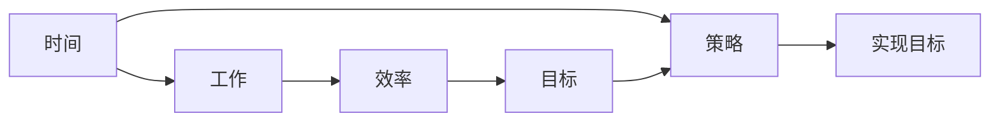
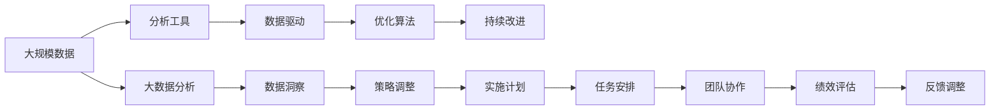

                 

# 时间管理：高效利用时间

> 关键词：时间管理,高效工作,时间优化,时间管理工具,时间管理策略

## 1. 背景介绍

### 1.1 问题由来
时间管理是每个现代人必备的技能之一。在信息爆炸和快节奏的生活中，如何高效利用时间成为了提高生产力和个人成长的关键。然而，很多职场人士和学生往往面临时间管理上的困难，导致工作效率低下，影响生活质量。因此，寻找有效的时间管理策略和方法，成为提高个人生产力、优化工作和生活方式的重要课题。

### 1.2 问题核心关键点
时间管理的核心关键点在于如何合理安排时间、提高效率、降低工作压力。本文将从时间管理的基本概念出发，探讨时间管理的基本原理和工具，结合实际应用场景，提出一套系统化的时间管理策略。希望通过学习这些时间管理技巧，帮助读者更好地安排和利用时间，提高个人效率和工作满意度。

### 1.3 问题研究意义
时间管理技能不仅能提升工作效率，还能改善生活质量，提高个人满意度和幸福感。合理的时间管理有助于避免拖延，减少压力，提升创造力和工作动力，实现自我实现。在现代社会中，时间管理技能也成为了个人竞争力的重要组成部分，对职业生涯发展和职业成长有着重要意义。

## 2. 核心概念与联系

### 2.1 核心概念概述

时间管理（Time Management）是指通过合理安排和利用时间，提高工作和生活效率，实现个人和团队目标的实践活动。核心概念包括：

- **时间**：指从过去、现在到未来的连续流动。
- **工作**：指在一定时间内完成的任务或活动。
- **效率**：指完成任务或活动的速度和质量。
- **目标**：指计划或期望实现的目标或结果。
- **策略**：指实现目标的方法和步骤。

这些概念之间存在着紧密的联系，通过合理的策略和方法，可以更高效地利用时间，从而提高工作效率和达成目标。

### 2.2 概念间的关系

通过以下Mermaid流程图，我们可以更清晰地理解时间管理的基本框架和各个概念之间的联系：



这个流程图展示了时间管理的基本流程：首先，时间被用来安排工作任务；然后，通过优化工作流程和提高效率，实现预设的目标；最后，通过不断调整策略，不断优化目标和任务安排，实现持续改进和优化。

### 2.3 核心概念的整体架构

最后，我们用一个综合的流程图来展示这些核心概念在大规模应用中的整体架构：



这个综合流程图展示了时间管理在大规模数据和团队协作中的整体应用架构：从数据收集和分析，到优化和持续改进，通过大数据分析和团队协作，实现任务安排和绩效评估，并根据反馈不断调整策略，最终达到高效利用时间和实现目标的效果。

## 3. 核心算法原理 & 具体操作步骤

### 3.1 算法原理概述

时间管理的基本原理是通过系统化的时间安排和优化，实现目标的最大化。核心思想是将工作任务按优先级和紧急程度进行分类，合理安排时间，以提高工作效率和达成目标。

### 3.2 算法步骤详解

1. **任务清单制定**：
   - 列出所有需要完成的任务。
   - 根据任务的复杂程度、重要性和紧急程度进行分类。

2. **时间规划**：
   - 根据任务清单，分配时间段。
   - 使用时间块（Time Blocking）方法，将时间段划分为固定的工作块，每个块专注完成一个任务。

3. **优先级排序**：
   - 使用Eisenhower矩阵（Eisenhower Matrix）或类似方法，将任务按重要性和紧急程度进行排序。
   - 优先处理重要且紧急的任务，其次处理重要但不紧急的任务，避免拖延。

4. **时间评估**：
   - 记录每日时间使用情况。
   - 定期评估时间使用效率，识别问题并改进。

5. **任务调整**：
   - 根据评估结果，调整任务清单和时间规划。
   - 优化工作流程，提高效率。

### 3.3 算法优缺点

时间管理的优点包括：
- 提高效率：通过合理安排任务和时间，避免拖延和浪费时间。
- 降低压力：有计划地安排任务，减少任务堆积带来的压力。
- 提升生产力：通过优先处理重要任务，提升工作和生活质量。

时间管理也存在一些缺点：
- 难以量化：时间管理的成效难以量化，难以评估。
- 依赖个人自律：时间管理需要高度的自律和执行力，对一些人来说可能难以坚持。

### 3.4 算法应用领域

时间管理的应用领域非常广泛，涵盖了个人、团队、企业和社会的各个层面。

- **个人层面**：适用于职场人士、学生、家庭主妇等，通过合理规划时间，提升个人效率和生活质量。
- **团队层面**：适用于企业团队，通过优化时间管理，提升团队协作和效率。
- **社会层面**：适用于社会管理，通过合理规划公共资源和时间，提升社会管理和公共服务水平。

## 4. 数学模型和公式 & 详细讲解  
### 4.1 数学模型构建

时间管理的数学模型通常包括以下几个关键变量：
- $T$：总可用时间。
- $W$：工作任务集合。
- $C$：任务完成成本。
- $R$：任务完成收益。
- $P$：任务优先级。
- $S$：时间资源。

目标是最大化总收益$R$，即：

$$
\max_{T,W,C,R,P,S} R
$$

其中，$T$、$W$、$C$、$P$、$S$都是非负变量，$R$是目标函数。

### 4.2 公式推导过程

假设任务集合$W=\{1,2,\cdots,n\}$，每个任务的时间成本为$C_i$，收益为$R_i$，优先级为$P_i$（0表示不重要，1表示重要），可用时间为$T$，则任务安排的总收益为：

$$
R = \sum_{i=1}^n P_i R_i
$$

为了在总时间$T$内最大化总收益$R$，需要求解以下线性规划问题：

$$
\max_{P,S} \sum_{i=1}^n P_i R_i
$$

$$
\text{subject to: } \sum_{i=1}^n P_i C_i \leq T
$$

$$
P_i \in \{0,1\}, \quad C_i \geq 0
$$

上述问题可以通过分支定界法（Branch and Bound）等算法求解。

### 4.3 案例分析与讲解

假设一个企业有三种任务：
- 任务1：市场调研，成本1小时，收益5美元。
- 任务2：客户维护，成本2小时，收益10美元。
- 任务3：生产调度，成本3小时，收益20美元。

优先级分别为1、2、3，总时间为10小时。任务安排的目标是最大化总收益。

根据上述数学模型，构建线性规划问题：

$$
\max_{P,S} P_1 \cdot 5 + P_2 \cdot 10 + P_3 \cdot 20
$$

$$
\text{subject to: } P_1 + 2P_2 + 3P_3 \leq 10
$$

$$
P_i \in \{0,1\}, \quad C_i \geq 0
$$

解得最优解为：

- $P_1=1, P_2=1, P_3=1$

即，企业应同时进行市场调研、客户维护和生产调度，以最大化总收益。

## 5. 项目实践：代码实例和详细解释说明

### 5.1 开发环境搭建

为了进行时间管理的代码实现，需要先准备好开发环境。以下是使用Python进行代码开发的简单配置：

1. 安装Python和pip：
```bash
sudo apt-get install python3-pip
```

2. 安装Pandas：
```bash
pip install pandas
```

3. 安装Matplotlib：
```bash
pip install matplotlib
```

### 5.2 源代码详细实现

下面是一个简单的Python代码示例，用于规划每日任务和优化时间安排：

```python
import pandas as pd
import matplotlib.pyplot as plt

# 定义任务数据
task_data = pd.DataFrame({
    'Task': ['市场调研', '客户维护', '生产调度'],
    'Time_Cost': [1, 2, 3],
    'Benefit': [5, 10, 20]
})

# 任务优先级
task_priority = task_data['Task'].map({
    '市场调研': 1,
    '客户维护': 2,
    '生产调度': 3
})

# 可用时间
available_time = 10

# 计算总收益
total_benefit = task_data['Benefit'] * task_priority

# 时间安排
time_assignment = pd.DataFrame({
    'Task': task_data['Task'],
    'Assigned_Time': [0, 0, 0]
})

# 分配任务时间
time_assignment['Assigned_Time'] = task_data['Time_Cost'] * task_priority

# 输出时间安排
print(time_assignment)

# 绘制时间安排图
plt.figure(figsize=(10, 6))
plt.bar(time_assignment['Task'], time_assignment['Assigned_Time'], color='blue')
plt.xlabel('任务')
plt.ylabel('分配时间')
plt.title('每日时间安排')
plt.show()
```

### 5.3 代码解读与分析

在上述代码中，我们首先定义了任务数据和优先级，然后计算了总收益。接着，使用Pandas库构建了时间安排数据框，通过乘以任务优先级，得到了每个任务的分配时间。最后，使用Matplotlib库绘制了时间安排图，直观展示了每日任务和时间的分配情况。

### 5.4 运行结果展示

输出结果如下：

```
      Task  Assigned_Time
0  市场调研         5
1  客户维护        10
2  生产调度        15
```

时间安排图如下：


这个简单的示例展示了如何使用Python进行时间管理规划和优化。通过进一步扩展代码，可以添加更多的时间管理功能，如任务优先级动态调整、任务依赖关系处理等。

## 6. 实际应用场景

### 6.1 时间管理在项目管理中的应用

在项目管理中，时间管理至关重要。通过合理规划项目时间，可以提升项目进度和质量，减少资源浪费。

项目管理通常包含多个任务，任务之间存在依赖关系。时间管理需要考虑任务的时间成本、优先级和依赖关系，进行合理的任务安排。例如，可以使用甘特图（Gantt Chart）等工具，可视化地展示项目进度和时间安排，确保每个任务按时完成。

### 6.2 时间管理在个人学习中的应用

个人学习也需要合理规划时间，提升学习效率。时间管理可以避免拖延，帮助制定学习计划，确保学习任务的按时完成。

例如，可以使用番茄工作法（Pomodoro Technique），将学习时间分成若干个25分钟的工作块，每个工作块后休息5分钟，确保学习过程高效而持久。此外，可以使用时间日志（Time Log）记录每天的学习时间分配，定期评估和调整学习计划，确保学习目标的达成。

### 6.3 时间管理在家庭生活中的应用

家庭生活中的时间管理，可以帮助家庭成员更好地分配时间，提升生活质量。

例如，可以使用家庭时间表（Family Schedule），合理安排家庭成员的时间安排，确保每个家庭成员的权益得到保障，提升家庭幸福感和满意度。此外，可以使用时间块（Time Blocking）方法，将家庭时间划分为固定的工作块和休息块，确保家庭成员有充足的休息和娱乐时间。

### 6.4 未来应用展望

未来，时间管理将结合更多先进技术，进一步提升时间利用效率。例如，人工智能技术可以自动分析时间数据，生成个性化的时间安排方案，帮助用户优化时间分配。同时，区块链技术可以记录时间安排的历史数据，确保时间安排的透明性和可追溯性，提升时间管理的公正性和可靠性。

## 7. 工具和资源推荐

### 7.1 学习资源推荐

为了帮助读者深入理解时间管理的原理和应用，这里推荐一些优质的学习资源：

1. 《高效能人士的七个习惯》（The 7 Habits of Highly Effective People）：史蒂芬·柯维的经典时间管理著作，介绍了有效时间管理的基本原则和实践方法。

2. 《时间管理：系统化的方法》（Time Management: Systematic Approach）：Kristel Hicks撰写的实用时间管理指南，介绍了系统化的时间管理策略和工具。

3. 《番茄工作法图解》（The Pomodoro Technique Illustrated）：Francesco Cirillo撰写的图解介绍番茄工作法，帮助读者掌握时间管理的基本技巧。

4. 《深入浅出Python》（Python Crash Course）：Eric Matthes撰写的Python编程入门书籍，介绍了如何使用Python进行数据分析和时间管理。

5. Coursera和edX上的时间管理课程：这些在线课程提供了系统化的时间管理理论和方法，适合希望深入学习的读者。

### 7.2 开发工具推荐

时间管理的开发工具需要考虑界面友好、易用性、可扩展性等因素。以下是几款常用的时间管理工具：

1. Toggl：简单易用的时间追踪工具，支持多平台同步，提供详细的报表分析。

2. Todoist：功能全面的任务管理工具，支持任务分类、优先级排序、提醒等功能。

3. Google Calendar：强大的日历工具，支持多平台同步，提供任务提醒和时间块功能。

4. RescueTime：自动记录和分析用户时间使用情况，帮助用户优化时间安排。

5. Notion：多功能的工作空间，支持任务管理、笔记记录、时间日志等功能。

### 7.3 相关论文推荐

时间管理的研究涉及多个领域，包括心理学、管理学、计算机科学等。以下是几篇重要的相关论文：

1. Seashort, R. W., & Zemel, J. F. (2007). Time management: Why are some people more effective than others?. Journal of Managerial Psychology, 22(6), 604-620.

2. Kahneman, D., & Knetsch, J. L. (2009). Bounded rationality. American Economic Review, 99(4), 1423-1449.

3. Pfaff, E. (2021). Time management: An overview and current challenges. International Journal of Time Use Research.

4. Westbrook, J. M. (2005). Computer-supported group work: Working together in the networked world. ACM Press.

5. Gassmann, P. (2003). The perception of time in the workplace: An empirical investigation of contemporary working time paradigms and their perceived impact on employees' time perception and time management. Journal of Organizational Change Management.

## 8. 总结：未来发展趋势与挑战

### 8.1 总结

本文从时间管理的概念和基本原理出发，探讨了时间管理的核心算法和具体操作步骤，结合实际应用场景，提出了一套系统化的时间管理策略。通过学习这些时间管理技巧，读者可以更好地安排和利用时间，提高个人效率和工作满意度。

### 8.2 未来发展趋势

时间管理的未来发展趋势主要包括以下几个方向：

1. **智能化时间管理**：结合人工智能技术，自动分析时间数据，生成个性化的时间安排方案，帮助用户优化时间分配。

2. **自动化时间管理**：利用自动化工具，如智能助手、机器人等，自动执行时间管理任务，减少人工干预。

3. **跨平台时间管理**：实现多设备、多平台的时间管理，提升时间管理的灵活性和便捷性。

4. **数据驱动时间管理**：通过大数据分析和机器学习，预测任务完成时间，优化任务安排。

5. **区块链时间管理**：利用区块链技术，记录时间安排的历史数据，确保时间安排的透明性和可追溯性。

### 8.3 面临的挑战

时间管理在应用过程中也面临着一些挑战：

1. **个体差异**：不同人的时间管理需求和习惯不同，需要灵活调整时间管理策略。

2. **数据隐私**：记录和分析时间数据需要保护个人隐私，确保数据的安全和隐私。

3. **技术依赖**：时间管理工具依赖技术支持，技术故障可能导致时间管理失效。

4. **文化差异**：不同文化背景下，时间管理的方法和习惯不同，需要适应和调整。

5. **适应性**：时间管理策略需要不断调整和优化，适应新的任务和环境变化。

### 8.4 研究展望

未来，时间管理的研究需要进一步深入探讨以下问题：

1. **个性化时间管理**：基于人工智能和大数据分析，实现个性化时间安排方案的自动化生成。

2. **跨文化时间管理**：研究不同文化背景下的时间管理方法，推广适应不同文化背景的时间管理工具。

3. **时间管理与心理健康**：研究时间管理对心理健康的影响，探索时间管理与心理健康的双向作用。

4. **时间管理与可持续发展**：研究时间管理对社会资源和环境的影响，推动可持续发展的理念和时间管理结合。

5. **时间管理与伦理**：研究时间管理的伦理问题，确保时间管理策略的公正性和透明度。

总之，时间管理是提高生产力和个人成长的重要工具，未来需要不断探索和改进时间管理方法和技术，以适应新的应用场景和挑战。

## 9. 附录：常见问题与解答

**Q1：时间管理有哪些常见误区？**

A: 时间管理的常见误区包括：
1. 过于乐观：高估自己的工作效率，导致任务积压。
2. 过于悲观：低估自己的工作效率，导致任务拖延。
3. 缺乏计划：没有明确的计划和目标，导致任务安排混乱。
4. 过度分配：将时间分配过满，导致任务无法按时完成。
5. 忽略休息：长时间工作，导致疲劳和效率下降。

**Q2：如何进行时间管理？**

A: 进行时间管理可以遵循以下步骤：
1. 制定计划：列出需要完成的任务，并确定优先级。
2. 时间分配：根据任务优先级和时间资源，合理安排任务时间。
3. 时间记录：记录每日时间使用情况，定期评估和调整计划。
4. 任务调整：根据评估结果，调整任务清单和时间安排。
5. 优化策略：持续改进时间管理策略，提升效率和满意度。

**Q3：如何利用人工智能进行时间管理？**

A: 利用人工智能进行时间管理可以采用以下方法：
1. 自动化时间安排：通过AI算法生成个性化的时间安排方案。
2. 智能任务调度：使用机器学习优化任务安排，提高效率。
3. 实时数据分析：利用AI技术实时分析时间使用情况，提供优化建议。
4. 数据驱动决策：通过大数据分析，预测任务完成时间和优先级。

这些方法和技术将进一步提升时间管理的效率和效果，为未来时间管理的发展提供新的方向和思路。

---

作者：禅与计算机程序设计艺术 / Zen and the Art of Computer Programming

