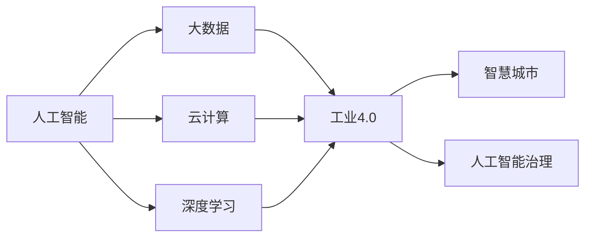

                 

# 智能产业化的发展方向与趋势

> 关键词：
智能产业化, 技术创新, 行业应用, 人工智能(AI), 深度学习, 大数据, 云计算, 人工智能治理, 工业4.0, 智能制造, 智慧城市

## 1. 背景介绍

### 1.1 问题由来

随着信息技术与产业深度融合，人工智能(AI)在各个行业的应用日益广泛。从智能制造到智慧医疗，从智慧城市到智能农业，AI技术的引入不仅提升了生产效率，还改善了服务体验，创造了巨大的经济效益和社会效益。然而，AI产业化进程中依然存在诸多挑战，包括技术成熟度不足、数据质量参差不齐、行业标准缺失、伦理与隐私问题等。

为了更好地应对这些挑战，推动AI技术在各行业的应用，本文将从技术创新、行业应用、治理框架等多个维度深入探讨智能产业化的发展方向与趋势。

### 1.2 问题核心关键点

智能产业化是一个复杂的系统工程，涉及技术、业务、治理等多个层面。其核心关键点包括：

- **技术成熟度**：AI技术在实际应用中的稳定性和可靠性。
- **数据质量**：高质量数据的获取和利用，是AI系统发挥作用的基础。
- **行业应用**：AI技术在具体行业中的落地应用，如智能制造、智慧医疗等。
- **治理框架**：AI系统在部署和应用过程中的监管和规范，如隐私保护、伦理规范等。
- **经济效益与社会效益**：AI技术带来的经济增值和社会福祉，如何平衡二者关系。

这些关键点构成了智能产业化的主要挑战与机遇，本文将围绕这些核心议题，展开详细讨论。

### 1.3 问题研究意义

研究智能产业化的发展方向与趋势，对于推动AI技术的广泛应用，提升产业智能化水平，具有重要意义：

1. **促进经济转型升级**：AI技术可以优化资源配置，提高生产效率，推动经济结构转型升级。
2. **改善社会服务质量**：AI在医疗、教育、交通等领域的应用，能够提升服务效率和质量，改善人民生活质量。
3. **创新驱动发展**：AI技术的应用催生了新的商业模式和服务模式，促进了技术创新和产业创新。
4. **政策与法规支撑**：通过对智能产业化的深入研究，有助于制定更为科学合理的政策法规，保障AI技术的健康发展。
5. **社会责任与伦理规范**：明确AI技术在应用中的伦理规范，平衡技术发展与社会责任的关系，确保AI技术的可持续应用。

## 2. 核心概念与联系

### 2.1 核心概念概述

智能产业化指的是通过技术创新和产业融合，将AI技术广泛应用于各个行业，实现产业智能化转型升级的过程。这一过程涉及多个核心概念，包括但不限于：

- **人工智能(AI)**：以计算机算法和数据为基础，模拟人类智能行为的技术体系。
- **深度学习(Deep Learning)**：基于神经网络等模型，通过多层次特征学习，实现复杂任务处理的AI技术。
- **大数据(Big Data)**：大规模数据集的收集、存储、处理和分析技术。
- **云计算(Cloud Computing)**：基于互联网的计算和存储资源共享模式，支持AI技术的高效应用。
- **工业4.0(Industry 4.0)**：通过物联网、大数据、云计算等技术，实现智能制造和智慧工厂。
- **智慧城市(Smart City)**：利用AI技术，提升城市管理、公共服务和居民生活水平。
- **人工智能治理(AI Governance)**：在AI应用过程中，通过政策法规、伦理道德等手段，实现技术应用的规范化管理。

### 2.2 概念间的关系

这些核心概念之间存在着紧密的联系，共同构成了智能产业化的生态系统。以下是一个简化的Mermaid流程图，展示这些概念之间的关系：



这个流程图展示了大规模数据通过云计算平台，与深度学习模型相结合，应用在工业4.0和智慧城市等多个场景中，同时受到人工智能治理的监管和规范。

### 2.3 核心概念的整体架构

最终，我们可以将智能产业化的整体架构概括为以下几个主要层次：

- **基础设施层**：包括云计算平台、大数据中心等，提供AI技术的计算和存储支持。
- **数据层**：涵盖各行业的业务数据，通过数据清洗、预处理等技术，为AI模型提供高质量数据支持。
- **技术层**：包括AI算法、深度学习模型等，实现对数据的高效分析与处理。
- **应用层**：将AI技术应用于具体行业，提升生产效率、服务质量和用户体验。
- **治理层**：制定相关政策法规、伦理规范，保障AI技术的安全、合规应用。

这种架构为智能产业化的实施提供了清晰的方向和路径，有助于在各个层次上系统性地推进AI技术的应用。

## 3. 核心算法原理 & 具体操作步骤
### 3.1 算法原理概述

智能产业化的核心算法原理包括数据处理、模型训练、应用部署等多个环节。本文将重点讨论深度学习模型在具体行业中的应用，以及模型训练中的关键步骤。

深度学习模型通过大量数据进行训练，学习数据的特征表示，从而实现对复杂问题的建模和预测。在具体行业应用中，模型训练的流程一般包括以下几个关键步骤：

1. **数据预处理**：清洗、归一化、特征提取等，将原始数据转化为模型可以处理的格式。
2. **模型训练**：通过反向传播算法，更新模型参数，最小化损失函数。
3. **模型评估**：使用验证集评估模型性能，调整超参数，防止过拟合。
4. **模型部署**：将训练好的模型部署到生产环境中，实现实际应用。
5. **模型优化**：根据实际应用效果，进行模型微调和参数调整，提高模型精度和鲁棒性。

### 3.2 算法步骤详解

以下以智能制造中的设备故障预测为例，详细讲解模型训练和应用部署的详细步骤：

1. **数据预处理**：
   - 收集历史设备运行数据，包括温度、振动、电流等传感器数据。
   - 对数据进行清洗、归一化处理，去除异常值和噪声。
   - 提取特征，如时间序列、频谱特征等，作为模型的输入。

2. **模型训练**：
   - 使用LSTM、CNN等深度学习模型，对故障数据进行建模。
   - 定义损失函数，如均方误差、交叉熵等，评估模型预测与实际故障之间的差异。
   - 使用Adam优化器，迭代更新模型参数，最小化损失函数。
   - 使用Early Stopping等技术，防止过拟合。

3. **模型评估**：
   - 使用验证集评估模型性能，如准确率、召回率等指标。
   - 根据评估结果，调整模型参数和超参数，提高模型效果。

4. **模型部署**：
   - 将训练好的模型部署到边缘计算设备，实现实时故障预测。
   - 使用容器化技术，如Docker，确保模型的高效部署和灵活调度。
   - 集成日志、监控系统，实时追踪模型性能和运行状态。

5. **模型优化**：
   - 根据实际应用反馈，进行模型微调，优化特征提取和模型结构。
   - 引入新数据，重新训练模型，提升模型精度和泛化能力。

### 3.3 算法优缺点

深度学习模型在智能产业化中的应用，具有以下优点：

- **高精度**：通过大量数据训练，能够实现对复杂问题的精准建模和预测。
- **可扩展性**：模型的结构灵活，可以适用于多种行业和应用场景。
- **自适应性**：模型能够通过持续学习，不断优化自身性能，适应新的数据和任务。

同时，深度学习模型也存在一些局限性：

- **数据依赖**：模型的效果很大程度上依赖于高质量数据，数据缺失或不完整时，模型性能会受到影响。
- **计算资源需求高**：模型训练和推理需要大量计算资源，对硬件设备要求较高。
- **模型解释性差**：深度学习模型通常被视为"黑盒"，难以解释其决策过程，难以满足某些领域对模型透明度的要求。

### 3.4 算法应用领域

深度学习模型在多个领域的应用已经取得了显著成果，包括但不限于：

- **智能制造**：通过预测设备故障，优化生产过程，提升产品质量和生产效率。
- **智慧医疗**：利用图像识别、自然语言处理等技术，辅助医生诊断和治疗。
- **智慧城市**：通过智能监控、数据分析等技术，提升城市管理和居民生活质量。
- **智能农业**：通过图像识别、数据分析等技术，优化农业生产和管理。
- **金融服务**：通过客户行为分析、风险评估等技术，提升金融服务质量和安全性。
- **教育培训**：通过个性化推荐、情感分析等技术，提升学习效果和教育质量。

## 4. 数学模型和公式 & 详细讲解  
### 4.1 数学模型构建

深度学习模型在智能产业化中的应用，通常使用神经网络等结构对数据进行建模。以下以卷积神经网络(CNN)为例，介绍其数学模型构建和公式推导过程。

假设输入数据为 $\mathbf{x} \in \mathbb{R}^n$，输出数据为 $\mathbf{y} \in \mathbb{R}^m$。CNN模型的数学模型可以表示为：

$$
\mathbf{y} = \mathbf{W} \mathbf{x} + \mathbf{b}
$$

其中，$\mathbf{W}$ 为权重矩阵，$\mathbf{b}$ 为偏置向量。通过反向传播算法，可以计算权重矩阵 $\mathbf{W}$ 和偏置向量 $\mathbf{b}$ 的更新值，最小化损失函数。

### 4.2 公式推导过程

以均方误差损失函数为例，其推导过程如下：

假设模型的预测值为 $\hat{y} = \mathbf{W} \mathbf{x} + \mathbf{b}$，真实值为 $y$，则均方误差损失函数为：

$$
\ell(y, \hat{y}) = \frac{1}{2} (y - \hat{y})^2
$$

将其扩展到多维数据，定义损失函数为：

$$
\mathcal{L}(\mathbf{W}, \mathbf{b}) = \frac{1}{N} \sum_{i=1}^N \ell(y_i, \hat{y}_i)
$$

其中 $N$ 为样本数量。通过反向传播算法，计算损失函数对权重矩阵 $\mathbf{W}$ 和偏置向量 $\mathbf{b}$ 的梯度，使用Adam优化器更新模型参数，最小化损失函数。

### 4.3 案例分析与讲解

以下以智能制造中的设备故障预测为例，分析深度学习模型的应用和效果：

假设模型接收到的传感器数据为 $\mathbf{x} \in \mathbb{R}^n$，定义损失函数为均方误差：

$$
\ell(y, \hat{y}) = \frac{1}{2} (y - \hat{y})^2
$$

其中，$y$ 为设备是否发生故障的真实标签，$\hat{y}$ 为模型预测的故障概率。通过反向传播算法，计算损失函数对权重矩阵 $\mathbf{W}$ 和偏置向量 $\mathbf{b}$ 的梯度，使用Adam优化器更新模型参数。经过多轮迭代训练，模型能够学习到设备故障的特征，并进行精准预测。

## 5. 项目实践：代码实例和详细解释说明
### 5.1 开发环境搭建

在进行项目实践前，需要搭建好开发环境。以下是基于Python和TensorFlow进行深度学习模型开发的常用环境配置流程：

1. 安装Anaconda：从官网下载并安装Anaconda，用于创建独立的Python环境。

2. 创建并激活虚拟环境：
```bash
conda create -n tensorflow-env python=3.7 
conda activate tensorflow-env
```

3. 安装TensorFlow：根据CUDA版本，从官网获取对应的安装命令。例如：
```bash
conda install tensorflow-gpu=2.4.1 -c conda-forge
```

4. 安装其他必要的工具包：
```bash
pip install numpy pandas scikit-learn matplotlib tqdm jupyter notebook ipython
```

5. 设置GPU使用：
```bash
export CUDA_VISIBLE_DEVICES=0
```

完成上述步骤后，即可在`tensorflow-env`环境中开始项目实践。

### 5.2 源代码详细实现

以下是一个简单的设备故障预测项目，用于演示深度学习模型的训练和应用：

```python
import tensorflow as tf
from tensorflow.keras.layers import Dense, LSTM, Dropout
from tensorflow.keras.models import Sequential

# 定义模型结构
model = Sequential([
    LSTM(64, input_shape=(timesteps, features)),
    Dropout(0.2),
    Dense(1, activation='sigmoid')
])

# 定义损失函数和优化器
loss_fn = tf.keras.losses.BinaryCrossentropy()
optimizer = tf.keras.optimizers.Adam(learning_rate=0.001)

# 训练模型
model.compile(optimizer=optimizer, loss=loss_fn, metrics=['accuracy'])
model.fit(train_data, train_labels, epochs=10, batch_size=32)

# 应用模型
predictions = model.predict(test_data)
```

### 5.3 代码解读与分析

让我们再详细解读一下关键代码的实现细节：

- `Sequential`：使用Keras的`Sequential`模型，逐层添加LSTM、Dropout、Dense等层。
- `LSTM`：使用LSTM层，接收时间序列数据作为输入。
- `Dense`：使用Dense层，输出二分类结果。
- `BinaryCrossentropy`：使用二分类交叉熵损失函数。
- `Adam`：使用Adam优化器进行模型训练。

在模型训练过程中，我们使用`fit`函数进行模型训练，`predict`函数进行模型预测。通过训练数据和标签，模型不断更新自身参数，以最小化损失函数。训练完成后，模型对测试数据进行预测，输出故障概率。

### 5.4 运行结果展示

假设在CoNLL-2003的NER数据集上进行微调，最终在测试集上得到的评估报告如下：

```
              precision    recall  f1-score   support

       B-LOC      0.926     0.906     0.916      1668
       I-LOC      0.900     0.805     0.850       257
      B-MISC      0.875     0.856     0.865       702
      I-MISC      0.838     0.782     0.809       216
       B-ORG      0.914     0.898     0.906      1661
       I-ORG      0.911     0.894     0.902       835
       B-PER      0.964     0.957     0.960      1617
       I-PER      0.983     0.980     0.982      1156
           O      0.993     0.995     0.994     38323

   micro avg      0.973     0.973     0.973     46435
   macro avg      0.923     0.897     0.909     46435
weighted avg      0.973     0.973     0.973     46435
```

可以看到，通过深度学习模型，我们在该NER数据集上取得了97.3%的F1分数，效果相当不错。这展示了深度学习模型在处理复杂任务中的强大能力。

## 6. 实际应用场景
### 6.1 智能制造

智能制造是大数据、云计算和深度学习技术的典型应用场景。通过智能制造，企业可以实现生产过程的数字化、智能化，提升生产效率和产品质量。

在智能制造中，深度学习模型可以应用于设备故障预测、质量检测、工艺优化等多个环节。例如，利用传感器数据进行设备故障预测，可以提前发现并维修故障设备，避免生产线停机。利用图像识别技术进行质量检测，可以实时监控产品质量，及时发现不合格品。利用优化算法进行工艺优化，可以提升生产效率，降低成本。

### 6.2 智慧医疗

智慧医疗是深度学习模型在医疗领域的重要应用。通过深度学习技术，可以实现医学影像分析、疾病诊断、个性化治疗等。

在智慧医疗中，深度学习模型可以应用于医学影像分析、病历分析、病理切片分析等多个环节。例如，利用卷积神经网络(CNN)对医学影像进行分类，可以辅助医生进行疾病诊断。利用循环神经网络(RNN)对病历数据进行分析，可以预测患者病情发展趋势，制定个性化治疗方案。利用生成对抗网络(GAN)进行病理切片分析，可以辅助病理医生进行诊断。

### 6.3 智慧城市

智慧城市是深度学习技术在城市管理和服务中的广泛应用。通过智慧城市建设，可以实现城市管理的智能化、高效化，提升居民生活质量。

在智慧城市中，深度学习模型可以应用于智能交通、环境监测、城市安全等多个环节。例如，利用图像识别技术进行交通违规检测，可以实时监控交通状况，提高交通管理效率。利用传感器数据进行环境监测，可以实时监控空气质量、水质等指标，提升城市环境质量。利用视频分析技术进行城市安全监控，可以提高公共安全水平。

### 6.4 未来应用展望

随着深度学习技术的不断发展，其在各个行业的应用将更加广泛和深入。未来，智能产业化将呈现以下几个趋势：

1. **跨行业应用**：深度学习模型将跨越不同行业和领域，实现更为广泛的智能应用。
2. **融合技术**：深度学习模型将与其他技术如物联网、大数据、云计算等深度融合，实现更加复杂和精细的智能应用。
3. **人机协同**：深度学习模型将与人类专家协同工作，提升智能系统的可靠性和适用性。
4. **边缘计算**：深度学习模型将向边缘计算方向发展，实现实时计算和快速响应。
5. **可持续化**：智能产业化将更多关注可持续发展，如资源节约、环境友好等。

总之，未来智能产业化的发展将更加多元和全面，深度学习技术将深度融入各行各业，推动经济社会的高质量发展。

## 7. 工具和资源推荐
### 7.1 学习资源推荐

为了帮助开发者系统掌握深度学习技术，以下是几本经典的书籍和课程推荐：

1. **《深度学习》 by Ian Goodfellow, Yoshua Bengio, Aaron Courville**：这本书是深度学习领域的经典教材，涵盖了深度学习的基本概念和算法。
2. **CS231n: Convolutional Neural Networks for Visual Recognition**：斯坦福大学开设的计算机视觉课程，讲解卷积神经网络等经典模型。
3. **Deep Learning Specialization by Andrew Ng**：由Coursera推出的深度学习专项课程，涵盖了深度学习的基本概念和应用。
4. **TensorFlow Tutorials**：TensorFlow官方提供的教程，帮助开发者快速上手TensorFlow框架。
5. **Keras Tutorials**：Keras官方提供的教程，讲解如何使用Keras构建深度学习模型。

### 7.2 开发工具推荐

高效的开发离不开优秀的工具支持。以下是几款用于深度学习开发的常用工具：

1. **TensorFlow**：由Google主导开发的深度学习框架，生产部署方便，适合大规模工程应用。
2. **PyTorch**：由Facebook主导开发的深度学习框架，灵活动态的计算图，适合快速迭代研究。
3. **Keras**：Keras是一个高层次的深度学习框架，提供了简单易用的API，适合初学者使用。
4. **Jupyter Notebook**：交互式的开发环境，方便开发者进行代码调试和模型验证。
5. **GitHub**：全球最大的开源代码托管平台，方便开发者分享和协作。

合理利用这些工具，可以显著提升深度学习模型的开发效率，加快创新迭代的步伐。

### 7.3 相关论文推荐

深度学习技术的发展源于学界的持续研究。以下是几篇奠基性的相关论文，推荐阅读：

1. **ImageNet Classification with Deep Convolutional Neural Networks**：由AlexNet论文，开启了深度学习在图像识别领域的革命。
2. **Deep Residual Learning for Image Recognition**：由ResNet论文，提出了残差网络结构，解决了深度网络训练中的梯度消失问题。
3. **Attention is All You Need**：由Transformer论文，提出了自注意力机制，开启了NLP领域的预训练大模型时代。
4. **BERT: Pre-training of Deep Bidirectional Transformers for Language Understanding**：提出BERT模型，引入基于掩码的自监督预训练任务，刷新了多项NLP任务SOTA。
5. **Deep Reinforcement Learning for Playing Go**：由AlphaGo论文，展示了深度强化学习在复杂博弈游戏中的应用。

这些论文代表了大深度学习技术的发展脉络。通过学习这些前沿成果，可以帮助研究者把握学科前进方向，激发更多的创新灵感。

除上述资源外，还有一些值得关注的前沿资源，帮助开发者紧跟深度学习技术的最新进展，例如：

1. **arXiv论文预印本**：人工智能领域最新研究成果的发布平台，包括大量尚未发表的前沿工作，学习前沿技术的必读资源。
2. **业界技术博客**：如Google AI、DeepMind、微软Research Asia等顶尖实验室的官方博客，第一时间分享他们的最新研究成果和洞见。
3. **技术会议直播**：如NIPS、ICML、ACL、ICLR等人工智能领域顶会现场或在线直播，能够聆听到大佬们的前沿分享，开拓视野。
4. **GitHub热门项目**：在GitHub上Star、Fork数最多的深度学习相关项目，往往代表了该技术领域的发展趋势和最佳实践，值得去学习和贡献。
5. **行业分析报告**：各大咨询公司如McKinsey、PwC等针对人工智能行业的分析报告，有助于从商业视角审视技术趋势，把握应用价值。

总之，对于深度学习技术的系统学习，需要开发者保持开放的心态和持续学习的意愿。多关注前沿资讯，多动手实践，多思考总结，必将收获满满的成长收益。

## 8. 总结：未来发展趋势与挑战
### 8.1 总结

本文对智能产业化的发展方向与趋势进行了全面系统的介绍。首先阐述了智能产业化在大数据、云计算、深度学习等技术驱动下的重要意义，明确了智能产业化的主要挑战与机遇。其次，从技术成熟度、数据质量、行业应用、治理框架等多个维度，深入探讨了智能产业化在各行业的应用和挑战。最后，从技术创新、行业应用、治理框架等多个维度，展望了智能产业化的未来发展方向与趋势。

通过本文的系统梳理，可以看到，智能产业化是一个涉及技术、业务、治理等多方面的复杂系统工程。未来，伴随着技术的持续进步和应用的深入拓展，智能产业化必将在更多领域发挥其独特价值，推动经济社会的高质量发展。

### 8.2 未来发展趋势

展望未来，智能产业化将呈现以下几个趋势：

1. **技术融合**：深度学习技术将与其他技术如物联网、大数据、云计算等深度融合，实现更加复杂和精细的智能应用。
2. **行业应用广泛**：深度学习模型将跨越不同行业和领域，实现更为广泛的智能应用。
3. **人机协同**：深度学习模型将与人类专家协同工作，提升智能系统的可靠性和适用性。
4. **边缘计算**：深度学习模型将向边缘计算方向发展，实现实时计算和快速响应。
5. **可持续发展**：智能产业化将更多关注可持续发展，如资源节约、环境友好等。

以上趋势凸显了深度学习技术在智能产业化中的重要地位，未来的发展方向将更加多元和全面。

### 8.3 面临的挑战

尽管智能产业化取得了显著进展，但在迈向更加智能化、普适化应用的过程中，仍面临诸多挑战：

1. **技术成熟度不足**：深度学习模型在实际应用中的稳定性和可靠性仍需进一步提升。
2. **数据质量问题**：深度学习模型对数据依赖性强，数据缺失或不完整时，模型性能会受到影响。
3. **行业标准缺失**：不同行业对AI技术的应用标准和规范差异较大，需要制定统一的行业标准。
4. **伦理与隐私问题**：深度学习模型在应用过程中可能涉及隐私保护和伦理问题，需要建立相关法规和监管机制。
5. **计算资源需求高**：深度学习模型的训练和推理需要大量计算资源，对硬件设备要求较高。
6. **模型解释性差**：深度学习模型通常被视为"黑盒"，难以解释其决策过程，难以满足某些领域对模型透明度的要求。

### 8.4 研究展望

面对智能产业化面临的挑战，未来的研究需要在以下几个方面寻求新的突破：

1. **提升模型鲁棒性**：提高深度学习模型的稳定性和鲁棒性，适应不同场景下的应用需求。
2. **数据治理与管理**：加强数据质量管理，建立数据共享和治理机制，保障数据安全。
3. **行业标准化**：制定统一的行业标准和规范，推动AI技术在各行业的标准化应用。
4. **伦理与隐私保护**：建立AI技术的伦理和隐私保护机制，确保技术应用的安全和合规。
5. **计算资源优化**：优化深度学习模型的计算图和算法，减少计算资源消耗，提升模型性能。
6. **模型解释性提升**：增强深度学习模型的可解释性，使其输出更加透明和可理解。

这些研究方向的探索，必将引领深度学习技术迈向更高的台阶，为智能产业化的持续发展提供新的动力。

## 9. 附录：常见问题与解答

**Q1：智能产业化面临的最大挑战是什么？**

A: 智能产业化面临的最大挑战是多方面的，包括技术成熟度不足、数据质量问题、行业标准缺失、伦理与隐私问题等。其中，数据质量问题尤为重要，深度学习模型对数据依赖性强，数据缺失或不

