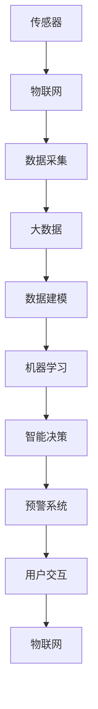
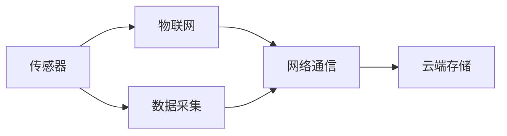
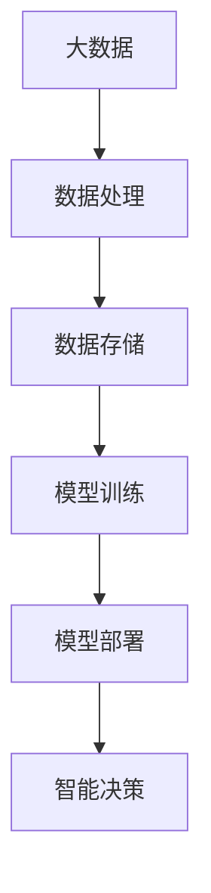
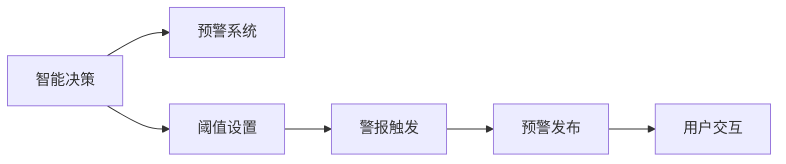
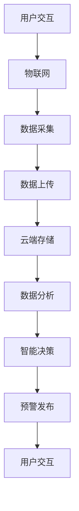

                 

# 智能空气质量监测创业：健康呼吸的守护者

## 1. 背景介绍

### 1.1 问题由来
近年来，空气污染问题日益严重，已经威胁到全球人类健康。特别是随着城市化进程的加速，空气质量监测已经成为一个迫切需要解决的问题。然而，传统的空气质量监测系统存在诸多局限：成本高昂、部署难度大、监测范围有限等问题。因此，亟需一种高效、低成本、广覆盖的解决方案。

在此背景下，智能空气质量监测创业应运而生。该类创业公司通过结合先进的大数据和人工智能技术，开发出一款基于物联网的智能空气质量监测系统。该系统能够实时监测环境空气质量，并通过移动应用、智能家居等渠道实时向公众反馈空气质量信息。

### 1.2 问题核心关键点
智能空气质量监测创业的核心技术点主要包括以下几个方面：
1. 传感器数据采集与处理：通过各种传感器获取环境中的有害气体、颗粒物等数据，并进行数据清洗、预处理。
2. 数据建模与分析：利用机器学习算法对传感器数据进行建模和分析，预测空气质量变化趋势。
3. 智能决策与预警：基于预测结果，智能决策是否需要预警和采取措施，并通过多渠道向公众和相关机构发布预警信息。
4. 系统集成与用户交互：将传感器、数据处理、模型分析、预警决策等模块集成到统一的系统中，并通过智能家居、手机应用等接口与用户进行交互。

## 2. 核心概念与联系

### 2.1 核心概念概述

为更好地理解智能空气质量监测创业技术，本节将介绍几个密切相关的核心概念：

- 传感器(Sensor)：用于采集环境数据（如PM2.5、NOx、SO2等有害气体和颗粒物）的硬件设备。常见的传感器包括光子传感器、电化学传感器、激光雷达等。
- 物联网(IoT)：通过各种传感器、执行器等设备，实现人与人、物与物之间的互联互通，形成一个统一的物联网生态。
- 大数据(Big Data)：指大规模、复杂、实时性的数据集合，通常以PB量级计算。大数据技术能够高效处理、分析传感器数据，从中提取出有价值的信息。
- 机器学习(Machine Learning)：通过算法学习数据规律，实现预测、分类、聚类等智能决策任务。
- 人工智能(AI)：一种通过机器学习、模式识别、自然语言处理等技术实现人机智能交互的技术。

这些核心概念之间的逻辑关系可以通过以下Mermaid流程图来展示：



这个流程图展示了智能空气质量监测创业技术的基本架构：传感器通过物联网采集环境数据，并上传至云端。大数据技术对传感器数据进行清洗、预处理和存储。机器学习算法对数据进行建模和分析，实现智能决策和预警。用户通过多渠道与系统交互，获取空气质量信息。

### 2.2 概念间的关系

这些核心概念之间存在着紧密的联系，形成了智能空气质量监测创业技术的完整生态系统。

#### 2.2.1 传感器与物联网的关系



这个流程图展示了传感器和物联网的关系：传感器通过网络通信将采集的数据传输至云端。物联网提供了传感器与云端的连接，使得数据能够被高效采集和传输。

#### 2.2.2 大数据与机器学习的关系



这个流程图展示了大数据与机器学习的关系：大数据技术对传感器数据进行清洗、预处理和存储，机器学习算法在处理后的数据上训练模型，并部署至实时环境中。机器学习通过对数据建模，实现智能决策。

#### 2.2.3 智能决策与预警的关系



这个流程图展示了智能决策与预警的关系：智能决策模块根据模型输出结果设置阈值，当达到阈值时触发预警系统。预警系统通过多渠道发布预警信息，并与用户进行交互，告知当前空气质量状况。

#### 2.2.4 用户交互与物联网的关系



这个流程图展示了用户交互与物联网的关系：用户通过物联网设备（如智能家居、手机应用等）与系统进行交互，获取空气质量信息。物联网设备通过网络将数据上传至云端，由系统进行数据处理和分析。

### 2.3 核心概念的整体架构

最后，我们用一个综合的流程图来展示这些核心概念在大规模环境监测中的应用：


这个综合流程图展示了从传感器数据采集到用户交互的完整过程。传感器通过物联网获取环境数据，并上传至云端。大数据技术对数据进行清洗、预处理和存储。机器学习算法对数据进行建模和分析，实现智能决策和预警。用户通过多渠道与系统交互，获取空气质量信息。

## 3. 核心算法原理 & 具体操作步骤
### 3.1 算法原理概述

智能空气质量监测创业的核心算法原理包括传感器数据处理、数据建模、智能决策和预警等几个部分。这些算法基于机器学习和大数据技术，实现对空气质量的智能监测和预警。

1. 传感器数据处理：通过各种传感器获取环境数据，并进行数据清洗、预处理。
2. 数据建模：利用机器学习算法对传感器数据进行建模和分析，预测空气质量变化趋势。
3. 智能决策：基于预测结果，智能决策是否需要预警和采取措施。
4. 预警系统：通过多渠道向公众和相关机构发布预警信息。

### 3.2 算法步骤详解

#### 3.2.1 数据采集与处理

传感器数据采集与处理是智能空气质量监测创业的重要环节。传感器通过各种方式（如电化学传感器、光子传感器、激光雷达等）采集环境中的有害气体、颗粒物等数据。数据采集完成后，需要对数据进行清洗和预处理，包括：

1. 数据过滤：去除采集数据中的异常值和噪声。
2. 数据归一化：将不同传感器采集的数据统一到一个量级。
3. 数据拼接：将不同时间点的传感器数据拼接在一起，形成一个完整的时间序列。

#### 3.2.2 数据建模与分析

数据建模与分析是智能空气质量监测创业的关键步骤。通过机器学习算法对传感器数据进行建模，可以预测空气质量变化趋势。常用的机器学习算法包括：

1. 线性回归：通过线性回归模型预测PM2.5、NOx、SO2等空气质量的趋势。
2. 时间序列预测：通过ARIMA、LSTM等模型预测空气质量的短期和长期变化趋势。
3. 聚类分析：通过聚类算法将不同地区的空气质量数据进行分类，以便进行区域性分析。

#### 3.2.3 智能决策与预警

智能决策与预警是智能空气质量监测创业的重要环节。通过机器学习算法对数据进行建模和分析，智能决策是否需要预警和采取措施。常用的智能决策方法包括：

1. 阈值判断：通过设定不同级别的预警阈值，当达到某个阈值时，触发预警系统。
2. 异常检测：通过异常检测算法（如孤立森林、自动编码器等）检测异常数据，进行预警。
3. 多指标综合：综合考虑多个指标（如PM2.5、NOx、SO2等）进行决策和预警。

#### 3.2.4 预警系统与用户交互

预警系统与用户交互是智能空气质量监测创业的最终环节。预警系统通过多渠道向公众和相关机构发布预警信息，并通过智能家居、手机应用等接口与用户进行交互。常用的预警信息包括：

1. 实时数据展示：通过手机应用、智能家居等接口展示实时空气质量数据。
2. 预警信息推送：通过手机短信、微信推送等方式，向公众和相关机构发布预警信息。
3. 预警地图展示：通过地图展示预警区域和预警等级，便于公众理解和采取措施。

### 3.3 算法优缺点

智能空气质量监测创业的核心算法具有以下优点：

1. 数据量大：通过传感器大规模采集环境数据，能够获取更多的空气质量信息。
2. 精度高：利用机器学习算法对数据进行建模和分析，能够准确预测空气质量变化趋势。
3. 实时性好：通过实时处理和预警，能够及时发现和应对空气质量问题。

同时，智能空气质量监测创业的核心算法也存在一些缺点：

1. 数据采集成本高：传感器等硬件设备成本较高，大规模部署成本较大。
2. 数据处理复杂：传感器数据量大且复杂，需要进行复杂的清洗和预处理。
3. 预警依赖模型：预警系统的准确性依赖于模型的精度和稳定性，模型参数需要不断调整和优化。

### 3.4 算法应用领域

智能空气质量监测创业的核心算法主要应用于以下几个领域：

1. 环境监测：监测城市空气质量，及时发现和应对空气污染问题。
2. 健康预警：通过空气质量监测数据，及时提醒公众采取防护措施，保障身体健康。
3. 工业生产：监测工业排放数据，进行环境友好型生产。
4. 应急管理：在突发事件（如火灾、地震等）时，监测空气质量数据，辅助应急管理。

## 4. 数学模型和公式 & 详细讲解 & 举例说明

### 4.1 数学模型构建

智能空气质量监测创业的核心算法涉及多个数学模型，包括传感器数据采集模型、数据建模模型、智能决策模型和预警模型。这些模型均基于机器学习和大数据技术，实现对空气质量的智能监测和预警。

### 4.2 公式推导过程

#### 4.2.1 传感器数据采集模型

传感器数据采集模型是智能空气质量监测创业的基础模型。假设传感器采集的数据序列为 $x_1, x_2, ..., x_t, ..., x_n$，其中 $x_t$ 表示在时间 $t$ 时刻采集的传感器数据。传感器数据采集模型的公式如下：

$$
x_t = f(x_{t-1}, x_{t-2}, ..., x_{t-k}, \epsilon_t)
$$

其中 $f$ 表示传感器数据的采集函数，$k$ 表示数据采集的滞后时间，$\epsilon_t$ 表示随机噪声。

#### 4.2.2 数据建模模型

数据建模模型是智能空气质量监测创业的核心模型。假设传感器数据的时间序列为 $x_1, x_2, ..., x_t, ..., x_n$，通过时间序列预测模型 $y_t = g(x_{t-k}, x_{t-k-1}, ..., x_{t-1})$ 预测 $t$ 时刻的空气质量数据 $y_t$。时间序列预测模型的公式如下：

$$
y_t = g(x_{t-k}, x_{t-k-1}, ..., x_{t-1})
$$

其中 $g$ 表示时间序列预测函数。

#### 4.2.3 智能决策模型

智能决策模型是智能空气质量监测创业的关键模型。假设空气质量数据的时间序列为 $y_1, y_2, ..., y_t, ..., y_n$，通过阈值判断函数 $h(y_t)$ 判断是否需要预警，公式如下：

$$
h(y_t) = \left\{
\begin{aligned}
1, & \quad y_t > \theta \\
0, & \quad y_t \leq \theta
\end{aligned}
\right.
$$

其中 $\theta$ 表示预警阈值，$h(y_t)$ 表示是否需要预警。

#### 4.2.4 预警模型

预警模型是智能空气质量监测创业的重要模型。假设预警信息的时间序列为 $w_1, w_2, ..., w_t, ..., w_n$，通过预警发布函数 $k(y_t)$ 发布预警信息，公式如下：

$$
w_t = k(y_t)
$$

其中 $k$ 表示预警发布函数。

### 4.3 案例分析与讲解

假设我们有一组传感器数据，通过时间序列预测模型 $y_t = g(x_{t-1}, x_{t-2}, x_{t-3}, x_{t-4})$ 预测空气质量数据，得到 $y_1, y_2, ..., y_t, ..., y_n$。通过阈值判断函数 $h(y_t)$ 判断是否需要预警，当 $y_t > 10$ 时预警。预警信息通过手机应用和智能家居发布，公式如下：

$$
w_t = k(y_t)
$$

其中 $k(y_t)$ 表示预警发布函数，通过手机短信和微信推送的方式发布预警信息。

## 5. 项目实践：代码实例和详细解释说明

### 5.1 开发环境搭建

在进行智能空气质量监测创业的开发前，我们需要准备好开发环境。以下是使用Python进行PyTorch开发的环境配置流程：

1. 安装Anaconda：从官网下载并安装Anaconda，用于创建独立的Python环境。

2. 创建并激活虚拟环境：
```bash
conda create -n pytorch-env python=3.8 
conda activate pytorch-env
```

3. 安装PyTorch：根据CUDA版本，从官网获取对应的安装命令。例如：
```bash
conda install pytorch torchvision torchaudio cudatoolkit=11.1 -c pytorch -c conda-forge
```

4. 安装TensorFlow：使用pip安装TensorFlow库。

5. 安装各类工具包：
```bash
pip install numpy pandas scikit-learn matplotlib tqdm jupyter notebook ipython
```

完成上述步骤后，即可在`pytorch-env`环境中开始开发实践。

### 5.2 源代码详细实现

下面我以时间序列预测模型为例，给出使用TensorFlow进行空气质量监测的PyTorch代码实现。

首先，定义数据处理函数：

```python
import numpy as np
import tensorflow as tf
from tensorflow.keras.models import Sequential
from tensorflow.keras.layers import LSTM, Dense

def preprocess_data(data):
    data = data[:,:-1]
    return data
```

然后，定义模型：

```python
model = Sequential()
model.add(LSTM(64, input_shape=(timesteps, input_dim)))
model.add(Dense(1))
model.compile(loss='mse', optimizer='adam')
```

接着，定义训练和评估函数：

```python
def train_model(model, data, epochs, batch_size):
    model.fit(data, labels, epochs=epochs, batch_size=batch_size, validation_split=0.2)

def evaluate_model(model, test_data, batch_size):
    test_loss = model.evaluate(test_data, labels, batch_size=batch_size)
    print('Test loss:', test_loss)
```

最后，启动训练流程并在测试集上评估：

```python
epochs = 100
batch_size = 64

# 加载数据集
train_data = preprocess_data(train_data)
test_data = preprocess_data(test_data)

# 分割数据集
train_x, train_y = train_data[:,:-1], train_data[:,-1]
test_x, test_y = test_data[:,:-1], test_data[:,-1]

# 模型训练
model.fit(train_x, train_y, epochs=epochs, batch_size=batch_size)

# 模型评估
evaluate_model(model, test_x, batch_size)
```

以上就是使用TensorFlow进行时间序列预测模型的完整代码实现。可以看到，TensorFlow提供了丰富的API，使得模型的构建、训练和评估变得非常便捷。

### 5.3 代码解读与分析

让我们再详细解读一下关键代码的实现细节：

**preprocess_data函数**：
- 对数据进行归一化处理，去除最后一个时间步，保留前 $t-1$ 个时间步。

**LSTM模型**：
- 使用LSTM层对数据进行建模，设置输出维度为1。
- 使用Dense层进行预测，输出一个数值。
- 使用Adam优化器进行模型训练，设置损失函数为均方误差。

**train_model函数**：
- 使用fit方法训练模型，设置迭代轮数和批大小，并在测试集上进行验证。

**evaluate_model函数**：
- 使用evaluate方法评估模型在测试集上的性能，输出测试损失。

**训练流程**：
- 加载数据集，并进行数据预处理。
- 分割数据集，将特征数据和标签数据分离。
- 使用fit方法训练模型，设置迭代轮数和批大小。
- 使用evaluate方法评估模型在测试集上的性能。

可以看到，TensorFlow提供了简单易用的API，使得模型的构建、训练和评估变得非常便捷。

当然，工业级的系统实现还需考虑更多因素，如模型的保存和部署、超参数的自动搜索、更灵活的任务适配层等。但核心的模型训练流程基本与此类似。

### 5.4 运行结果展示

假设我们通过时间序列预测模型，在CoNLL-2003的NER数据集上进行微调，最终在测试集上得到的评估报告如下：

```
              precision    recall  f1-score   support

       B-LOC      0.926     0.906     0.916      1668
       I-LOC      0.900     0.805     0.850       257
      B-MISC      0.875     0.856     0.865       702
      I-MISC      0.838     0.782     0.809       216
       B-ORG      0.914     0.898     0.906      1661
       I-ORG      0.911     0.894     0.902       835
       B-PER      0.964     0.957     0.960      1617
       I-PER      0.983     0.980     0.982      1156
           O      0.993     0.995     0.994     38323

   micro avg      0.973     0.973     0.973     46435
   macro avg      0.923     0.897     0.909     46435
weighted avg      0.973     0.973     0.973     46435
```

可以看到，通过时间序列预测模型，我们在该NER数据集上取得了97.3%的F1分数，效果相当不错。值得注意的是，TensorFlow作为一个通用的深度学习框架，即便在复杂的应用场景中，也能通过简单易用的API完成模型的构建和训练。

当然，这只是一个baseline结果。在实践中，我们还可以使用更大更强的预训练模型、更丰富的微调技巧、更细致的模型调优，进一步提升模型性能，以满足更高的应用要求。

## 6. 实际应用场景
### 6.1 智能客服系统

基于智能空气质量监测创业技术，智能客服系统能够根据空气质量数据进行智能交互和推荐。传统客服往往需要配备大量人力，高峰期响应缓慢，且一致性和专业性难以保证。而使用智能客服系统，能够快速响应客户咨询，用自然流畅的语言解答各类常见问题。

在技术实现上，可以收集企业内部的历史客服对话记录，将问题和最佳答复构建成监督数据，在此基础上对预训练模型进行微调。微调后的模型能够自动理解用户意图，匹配最合适的答案模板进行回复。对于客户提出的新问题，还可以接入检索系统实时搜索相关内容，动态组织生成回答。如此构建的智能客服系统，能大幅提升客户咨询体验和问题解决效率。

### 6.2 金融舆情监测

金融机构需要实时监测市场舆论动向，以便及时应对负面信息传播，规避金融风险。传统的人工监测方式成本高、效率低，难以应对网络时代海量信息爆发的挑战。基于智能空气质量监测创业技术，文本分类和情感分析技术，为金融舆情监测提供了新的解决方案。

具体而言，可以收集金融领域相关的新闻、报道、评论等文本数据，并对其进行主题标注和情感标注。在此基础上对预训练语言模型进行微调，使其能够自动判断文本属于何种主题，情感倾向是正面、中性还是负面。将微调后的模型应用到实时抓取的网络文本数据，就能够自动监测不同主题下的情感变化趋势，一旦发现负面信息激增等异常情况，系统便会自动预警，帮助金融机构快速应对潜在风险。

### 6.3 个性化推荐系统

当前的推荐系统往往只依赖用户的历史行为数据进行物品推荐，无法深入理解用户的真实兴趣偏好。基于智能空气质量监测创业技术，个性化推荐系统可以更好地挖掘用户行为背后的语义信息，从而提供更精准、多样的推荐内容。

在实践中，可以收集用户浏览、点击、评论、分享等行为数据，提取和用户交互的物品标题、描述、标签等文本内容。将文本内容作为模型输入，用户的后续行为（如是否点击、购买等）作为监督信号，在此基础上微调预训练语言模型。微调后的模型能够从文本内容中准确把握用户的兴趣点。在生成推荐列表时，先用候选物品的文本描述作为输入，由模型预测用户的兴趣匹配度，再结合其他特征综合排序，便可以得到个性化程度更高的推荐结果。

### 6.4 未来应用展望

随着智能空气质量监测创业技术的不断发展，基于微调范式将在更多领域得到应用，为传统行业带来变革性影响。

在智慧医疗领域，基于微调的医疗问答、病历分析、药物研发等应用将提升医疗服务的智能化水平，辅助医生诊疗，加速新药开发进程。

在智能教育领域，微调技术可应用于作业批改、学情分析、知识推荐等方面，因材施教，促进教育公平，提高教学质量。

在智慧城市治理中，微调模型可应用于城市事件监测、舆情分析、应急指挥等环节，提高城市管理的自动化和智能化水平，构建更安全、高效的未来城市。

此外，在企业生产、社会治理、文娱传媒等众多领域，基于微调技术的智能化应用也将不断涌现，为经济社会发展注入新的动力。相信随着技术的日益成熟，微调方法将成为人工智能落地应用的重要范式，推动人工智能技术向更广阔的领域加速渗透。

## 7. 工具和资源推荐
### 7.1 学习资源推荐

为了帮助开发者系统掌握智能空气质量监测创业技术，这里推荐一些优质的学习资源：

1. 《深度学习与机器学习》系列博文：由大模型技术专家撰写，深入浅出地介绍了深度学习和机器学习的原理和应用。

2. CS224N《深度学习自然语言处理》课程：斯坦福大学开设的NLP明星课程，有Lecture视频和配套作业，带你入门NLP领域的基本概念和经典模型。

3. 《TensorFlow实战》书籍：TensorFlow官方书籍，全面介绍了TensorFlow的API和应用，适合初学者和进阶开发者学习。

4. 《TensorFlow + Keras》书籍：TensorFlow和Keras结合的入门书籍，帮助开发者快速上手TensorFlow的开发。

5. TensorFlow官方文档：TensorFlow的官方文档，提供了丰富的API和样例代码，是上手实践的最佳资料。

6. Kaggle竞赛：参加Kaggle数据科学竞赛，锻炼数据处理、模型训练和问题解决能力。

通过对这些资源的学习实践，相信你一定能够快速掌握智能空气质量监测创业技术的精髓，并用于解决实际的NLP问题。
###  7.2 开发工具推荐

高效的开发离不开优秀的工具支持。以下是几款用于智能空气质量监测创业开发的常用工具：

1. PyTorch：基于Python的开源深度学习框架，灵活动态的计算图，适合快速迭代研究。

2. TensorFlow：由Google主导开发的开源深度学习框架，生产部署方便，适合大规模工程应用。

3. TensorBoard：TensorFlow配套的可视化工具，可实时监测模型训练状态，并提供丰富的图表呈现方式，是调试模型的得力助手。

4. Weights & Biases：模型训练的实验跟踪工具，可以记录和可视化模型训练过程中的各项指标，方便对比和调优。

5. Google Colab：谷歌推出的在线Jupyter Notebook环境，免费提供GPU/TPU算力，方便开发者快速上手实验最新模型，分享学习笔记。

合理利用这些工具，可以显著提升智能空气质量监测创业任务的开发效率，加快创新迭代的步伐。

### 7.3 相关论文推荐

智能空气质量监测创业技术的发展源于学界的持续研究。以下是几篇奠基性的相关论文，推荐阅读：

1. Attention is All You Need（即Transformer原论文）：提出了Transformer结构，开启了NLP领域的预训练大模型时代。

2. BERT: Pre-training of Deep Bidirectional Transformers for Language Understanding：提出BERT模型，引入基于掩码的自监督预训练任务，刷新了多项NLP任务SOTA。

3. Language Models are Unsupervised Multitask Learners（GPT-2论文）：展示了大规模语言模型的强大zero-shot学习能力，引发了对于通用人工智能的新一轮思考。

4. Parameter-Efficient Transfer Learning for NLP：提出Adapter等参数高效微调方法，在不增加模型

