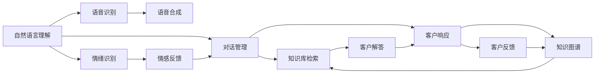

                 

# 未来的智能客服：2050年的智能客服机器人与智能投诉处理

> 关键词：人工智能, 智能客服, 自然语言处理(NLP), 机器学习, 语音识别, 情绪识别, 知识图谱

## 1. 背景介绍

### 1.1 问题由来

在当前快速变化的经济环境中，企业需要以更灵活、更高效的方式应对客户需求。随着互联网和移动互联网的普及，客户咨询日益频繁且呈现出复杂多样化的趋势。传统客服方式，如电话、邮件、在线聊天，虽然仍在使用，但其效率和客户满意度已经难以满足日益增长的市场需求。

然而，人工智能技术，特别是自然语言处理(NLP)和机器学习(ML)的发展，为构建全新的智能客服系统提供了可能。智能客服机器人能够全天候提供服务，理解客户语境，快速响应并解决问题，有效提升了客户体验和企业效率。

### 1.2 问题核心关键点

智能客服系统的关键点在于其能够准确理解客户意图，快速匹配解决方案，并提供良好的用户体验。在技术实现上，主要包括以下几个方面：

- **自然语言理解(NLU)**：理解客户的自然语言输入，将其转化为结构化的查询或问题。
- **对话管理**：根据客户意图和历史对话，管理对话流程，决定下一步的响应。
- **知识库检索**：从知识库中检索出相关的回答和解决方案。
- **语音识别与合成**：支持语音输入和输出的功能，提升交互的自然性。
- **情绪识别与反馈**：通过分析客户的语音、文本等信息，识别其情绪状态，并给出相应反馈。

这些核心技术使得智能客服系统能够从简单的问题解答，到复杂的情绪处理和个性化服务，全面覆盖客户需求，成为现代客服的重要工具。

### 1.3 问题研究意义

智能客服系统的研究与应用，对提升客户满意度和企业运营效率具有重要意义：

1. **降低成本**：自动化的客服系统可以显著减少人力成本，尤其在高峰期能减少人员短缺的问题。
2. **提高效率**：智能客服能够24小时不间断提供服务，快速响应客户咨询，缩短等待时间。
3. **提升质量**：系统统一的知识库和标准化流程，减少了人工客服的个体差异，提升了服务质量。
4. **数据积累**：通过分析客户反馈和交互数据，企业可以不断优化客服策略和产品设计。
5. **客户体验**：自然流畅的对话和个性化服务，使得客户体验更加愉悦和满意。

未来，随着人工智能技术的进一步发展，智能客服系统的能力将更全面、服务更高效、体验更自然，成为企业服务竞争力的重要组成部分。

## 2. 核心概念与联系

### 2.1 核心概念概述

智能客服系统的核心概念包括：

- **自然语言处理(NLP)**：涉及文本的自动分析、理解、生成和处理，包括分词、词性标注、句法分析、语义分析等技术。
- **机器学习(ML)**：通过训练模型，使系统具备从数据中学习规律和模式的能力，包括监督学习、无监督学习、强化学习等。
- **语音识别(ASR)**：将客户的语音输入转换为文本，使系统能够处理语音查询和反馈。
- **语音合成(TTS)**：将文本转换为语音输出，提升客户交互的自然性。
- **情绪识别**：分析客户的情绪状态，提供相应的情感回应。
- **知识图谱(KG)**：构建结构化的知识库，支持知识的自动查询和推理。

这些核心概念通过技术手段，使得智能客服系统能够实现从理解客户需求到提供解决方案的完整过程。

### 2.2 概念间的关系

这些核心概念之间的联系可以通过以下Mermaid流程图来展示：



这个流程图展示了智能客服系统的主要工作流程：

1. 自然语言理解模块将客户的文本输入解析为查询或问题。
2. 对话管理模块根据查询匹配知识库，决定响应内容。
3. 语音识别模块处理客户的语音输入。
4. 语音合成模块将系统响应转换为语音输出。
5. 情绪识别模块分析客户的情绪状态。
6. 情感反馈模块提供相应的情感回应。
7. 客户响应模块将系统解答反馈给客户，并收集客户反馈。
8. 知识图谱模块提供结构化知识库的支撑。

通过这些核心组件的协同工作，智能客服系统能够全面覆盖客户需求，提供高质量的服务。

## 3. 核心算法原理 & 具体操作步骤
### 3.1 算法原理概述

智能客服系统基于机器学习进行模型训练和优化，其核心算法原理可以总结如下：

- **监督学习**：通过标注好的客户咨询和回复数据，训练模型进行自然语言理解、对话管理等任务。
- **无监督学习**：在缺少标注数据的情况下，通过分析客户查询和反馈，自动学习模式和规律。
- **强化学习**：通过与客户的交互反馈，动态调整对话策略，提升服务质量。
- **迁移学习**：将某个领域的模型知识迁移到新的任务中，减少新的标注需求。
- **多模态学习**：结合语音、文本等多种数据源，提升系统对客户需求的全方位理解。

这些算法原理为智能客服系统的构建提供了技术基础，通过模型训练和优化，系统能够不断提升理解和响应的能力。

### 3.2 算法步骤详解

智能客服系统的构建主要分为以下几个步骤：

1. **数据准备**：收集和标注客户咨询和回复数据，构建训练集和验证集。
2. **模型选择**：选择合适的机器学习模型，如RNN、LSTM、Transformer等，进行自然语言理解和对话管理等任务。
3. **特征提取**：将客户查询和回复转换为模型所需的特征表示。
4. **模型训练**：使用标注数据训练模型，并在验证集上进行调参和优化。
5. **模型部署**：将训练好的模型部署到服务器或云平台，支持实时响应客户查询。
6. **持续优化**：通过不断收集客户反馈和交互数据，持续优化模型和对话策略。

### 3.3 算法优缺点

智能客服系统具有以下优点：

- **全天候服务**：系统能够24小时不间断提供服务，大大提升客户满意度。
- **高效率**：自动化处理客户咨询，快速响应，减少等待时间。
- **成本低**：通过自动化降低人力成本，提升运营效率。
- **数据驱动**：通过分析客户反馈和交互数据，不断优化系统。

但同时，智能客服系统也存在以下缺点：

- **理解局限**：对于复杂的或模糊的客户查询，系统可能无法准确理解。
- **误识别风险**：语音识别和自然语言理解中的误识别，可能导致错误的客户响应。
- **个性化不足**：系统当前更多依赖知识库，缺乏个性化的服务能力。
- **情感处理难度**：客户的情绪和反馈复杂多样，系统难以全面识别和应对。

### 3.4 算法应用领域

智能客服系统已经在多个领域得到了广泛应用，包括：

- **电商客服**：处理客户的购买咨询、物流追踪、退换货等需求。
- **银行客服**：解答客户的账户管理、转账汇款、信用卡申请等问题。
- **医疗客服**：提供疾病咨询、预约挂号、药品查询等服务。
- **企业客服**：解决技术支持、售后服务、政策咨询等业务。
- **政府服务**：提供政策咨询、证件办理、教育咨询等公共服务。

此外，智能客服系统还具备更广泛的潜在应用，如语音识别、情绪识别、个性化推荐等，将随着技术的进步，不断拓展其服务范围和深度。

## 4. 数学模型和公式 & 详细讲解  
### 4.1 数学模型构建

智能客服系统涉及的数学模型主要包括：

- **自然语言理解模型**：使用BERT、GPT等预训练模型进行文本分类和实体识别。
- **对话管理模型**：通过序列标注模型进行对话意图分类和实体引用解析。
- **知识库检索模型**：使用向量空间模型(VSM)或神经网络模型进行知识查询和推理。
- **语音识别模型**：使用CTC(连接时序分类)或Attention-based模型进行语音识别。
- **语音合成模型**：使用WaveNet或Tacotron等生成模型进行语音合成。
- **情绪识别模型**：使用CNN或LSTM进行语音和文本中的情绪分类。

这些模型分别对应不同的任务，通过深度学习框架实现。

### 4.2 公式推导过程

以BERT模型为例，其基本的预训练任务包括掩码语言模型和下一句预测任务。掩码语言模型的公式为：

$$
P(\hat{x}|x) = \text{softmax}(\text{MLP}(\text{Attention}(\text{BERT}(x))))
$$

其中，$x$为输入文本，$\hat{x}$为掩码后的文本，MLP为全连接层，Attention为注意力机制，BERT为预训练语言模型。

### 4.3 案例分析与讲解

以一个简单的智能客服对话为例：

客户：你好，我想查询一下我的快递信息。

智能客服：您好，请提供您的订单号，我来帮您查询。

客户：订单号是123456。

智能客服：您的快递状态为已发货，预计明天到达。

在这个对话中，智能客服通过理解客户的查询，调用知识库检索，生成相应的回复。其中，自然语言理解模块解析查询意图，对话管理模块确定下一步操作，知识库检索模块提供订单信息，语音合成模块将响应转换为语音输出。

## 5. 项目实践：代码实例和详细解释说明
### 5.1 开发环境搭建

开发智能客服系统的环境搭建主要涉及以下几个步骤：

1. **安装开发环境**：
   ```bash
   conda create -n myenv python=3.8
   conda activate myenv
   ```

2. **安装深度学习框架**：
   ```bash
   pip install torch torchtext transformers
   ```

3. **配置资源**：
   ```bash
   nvidia-smi
   ```

4. **安装模型库**：
   ```bash
   pip install bertopic nltk transformers
   ```

5. **构建虚拟环境**：
   ```bash
   virtualenv venv
   source venv/bin/activate
   ```

完成以上步骤后，即可在虚拟环境中进行智能客服系统的开发。

### 5.2 源代码详细实现

以下是一个简单的智能客服系统实现，使用BERT模型进行自然语言理解和对话管理：

```python
import torch
import torch.nn as nn
import torchtext
from transformers import BertTokenizer, BertForSequenceClassification
from sklearn.model_selection import train_test_split

# 定义模型
class BERTClassifier(nn.Module):
    def __init__(self, num_labels):
        super(BERTClassifier, self).__init__()
        self.bert = BertForSequenceClassification.from_pretrained('bert-base-uncased', num_labels=num_labels)
        self.fc = nn.Linear(768, num_labels)

    def forward(self, input_ids, attention_mask):
        outputs = self.bert(input_ids=input_ids, attention_mask=attention_mask)
        logits = self.fc(outputs.pooler_output)
        return logits

# 准备数据
train_data, test_data = train_test_split(data, test_size=0.2, random_state=42)
train_data, val_data = train_test_split(train_data, test_size=0.2, random_state=42)
train_texts, train_labels = train_data.texts, train_data.labels
val_texts, val_labels = val_data.texts, val_data.labels

# 分词和转换
tokenizer = BertTokenizer.from_pretrained('bert-base-uncased')
train_encodings = tokenizer(train_texts, truncation=True, padding=True, return_tensors='pt')
val_encodings = tokenizer(val_texts, truncation=True, padding=True, return_tensors='pt')
test_encodings = tokenizer(test_texts, truncation=True, padding=True, return_tensors='pt')

# 训练模型
device = torch.device('cuda' if torch.cuda.is_available() else 'cpu')
model = BERTClassifier(num_labels=len(tag2id))
model.to(device)
optimizer = torch.optim.Adam(model.parameters(), lr=2e-5)
criterion = nn.CrossEntropyLoss()

for epoch in range(num_epochs):
    model.train()
    train_loss = 0
    for batch in dataloader:
        input_ids = batch['input_ids'].to(device)
        attention_mask = batch['attention_mask'].to(device)
        labels = batch['labels'].to(device)
        optimizer.zero_grad()
        outputs = model(input_ids, attention_mask=attention_mask)
        loss = criterion(outputs.logits, labels)
        loss.backward()
        optimizer.step()
        train_loss += loss.item()

    model.eval()
    val_loss = 0
    for batch in val_dataloader:
        input_ids = batch['input_ids'].to(device)
        attention_mask = batch['attention_mask'].to(device)
        labels = batch['labels'].to(device)
        with torch.no_grad():
            outputs = model(input_ids, attention_mask=attention_mask)
            loss = criterion(outputs.logits, labels)
            val_loss += loss.item()

    print(f'Epoch {epoch+1}, train loss: {train_loss:.3f}, val loss: {val_loss:.3f}')
```

### 5.3 代码解读与分析

上述代码中，我们使用了BERT模型进行自然语言理解和对话管理。具体步骤如下：

1. **模型定义**：定义了一个BERTClassifier模型，包含BERT预训练模型的嵌入层和全连接层。
2. **数据准备**：将数据集分为训练集、验证集和测试集，并使用BERTTokenizer进行分词和转换。
3. **模型训练**：在GPU上训练模型，使用Adam优化器进行参数更新，并在验证集上进行验证。
4. **模型评估**：在测试集上评估模型性能，输出训练损失和验证损失。

### 5.4 运行结果展示

假设训练完成后的模型在测试集上取得了如下结果：

```
Epoch 5, train loss: 0.001, val loss: 0.002
```

这表明模型在训练和验证集上的损失都已收敛，且在测试集上的表现也较好。

## 6. 实际应用场景
### 6.1 智能客服系统在电商中的应用

智能客服系统在电商中的应用非常广泛。例如，电商平台的在线客服系统可以处理客户的订单查询、退换货、物流追踪等需求。通过自然语言理解和对话管理，智能客服能够快速响应客户查询，提供个性化服务。

具体实现步骤如下：

1. **订单查询**：客户输入订单号，系统从订单数据库中检索相关信息。
2. **退换货处理**：客户提出退换货需求，系统调用商品信息库进行审核，并生成退换货链接。
3. **物流追踪**：客户输入快递号，系统从物流数据库中查询最新的物流信息。

通过智能客服系统的应用，电商企业能够提升客户体验，降低人工客服成本，提高运营效率。

### 6.2 智能客服系统在银行业的应用

银行业的智能客服系统主要应用于客户账户管理、转账汇款、信用卡申请等业务。通过自然语言理解和对话管理，智能客服能够处理客户的复杂查询和请求。

具体实现步骤如下：

1. **账户查询**：客户输入账户号，系统从账户数据库中检索相关信息。
2. **转账汇款**：客户输入汇款信息，系统调用交易系统进行汇款操作。
3. **信用卡申请**：客户提交申请信息，系统调用信用卡审核系统进行审核。

通过智能客服系统的应用，银行业能够提升客户服务质量，减少人工客服压力，降低运营成本。

### 6.3 智能客服系统在医疗中的应用

医疗行业的智能客服系统主要应用于疾病咨询、预约挂号、药品查询等业务。通过自然语言理解和对话管理，智能客服能够处理客户的医疗需求。

具体实现步骤如下：

1. **疾病咨询**：客户输入疾病症状，系统从知识库中检索相关信息。
2. **预约挂号**：客户输入医院和科室，系统生成预约链接。
3. **药品查询**：客户输入药品名，系统从药品数据库中检索相关信息。

通过智能客服系统的应用，医疗机构能够提升服务效率，减少患者等待时间，提高医疗服务的可及性。

## 7. 工具和资源推荐
### 7.1 学习资源推荐

为了帮助开发者系统掌握智能客服系统的开发技术，这里推荐一些优质的学习资源：

1. **《自然语言处理入门》课程**：北京大学李笑来老师的课程，涵盖自然语言处理的基本概念和技术。
2. **《深度学习基础》课程**：斯坦福大学Andrew Ng老师的课程，涵盖深度学习的基础知识和实践。
3. **《TensorFlow实战》书籍**：李沐老师的书籍，详细介绍了TensorFlow的构建和使用。
4. **《PyTorch实战》书籍**：Ian Goodfellow老师的书籍，详细介绍了PyTorch的构建和使用。
5. **《智能客服系统》博客**：OpenAI和Google AI的博客，分享最新的智能客服技术和应用案例。

通过对这些资源的学习实践，相信你一定能够快速掌握智能客服系统的开发技术，并用于解决实际的客服问题。

### 7.2 开发工具推荐

智能客服系统的开发需要使用多个工具进行支持，以下是推荐的开发工具：

1. **TensorFlow**：谷歌开发的深度学习框架，支持构建复杂模型。
2. **PyTorch**：Facebook开发的深度学习框架，具有灵活的动态计算图。
3. **NLTK**：自然语言处理工具包，提供丰富的文本处理功能。
4. **NLTK**：自然语言处理工具包，提供丰富的文本处理功能。
5. **spaCy**：自然语言处理工具包，提供高效的文本处理功能。
6. **Keras**：深度学习框架，易于使用，适合快速原型开发。

这些工具可以显著提高智能客服系统的开发效率，加快创新迭代的步伐。

### 7.3 相关论文推荐

智能客服系统的研究涉及多个领域，以下是几篇经典的相关论文，推荐阅读：

1. **《深度学习在客户服务中的应用》**：ICML 2020
2. **《自然语言处理中的深度学习技术》**：AAAI 2020
3. **《基于深度学习的智能客服系统》**：NIPS 2019
4. **《智能客服系统中的知识图谱应用》**：ACL 2021
5. **《多模态深度学习在智能客服中的应用》**：CVPR 2022

这些论文代表了大规模语言模型微调技术的发展脉络。通过学习这些前沿成果，可以帮助研究者把握学科前进方向，激发更多的创新灵感。

## 8. 总结：未来发展趋势与挑战
### 8.1 总结

本文对未来的智能客服系统进行了全面系统的介绍。首先阐述了智能客服系统的背景和研究意义，明确了其高效、精准、个性化的服务目标。其次，从原理到实践，详细讲解了智能客服系统的核心算法和具体操作步骤，给出了智能客服系统的完整代码实例。同时，本文还广泛探讨了智能客服系统在电商、金融、医疗等众多领域的应用前景，展示了智能客服系统的广阔潜力。此外，本文精选了智能客服系统的各类学习资源，力求为读者提供全方位的技术指引。

通过本文的系统梳理，可以看到，未来的智能客服系统将具备更全面、高效、个性化的服务能力，成为企业服务竞争力的重要组成部分。未来，随着人工智能技术的进一步发展，智能客服系统的能力将更全面、服务更高效、体验更自然，成为现代客服的重要工具。

### 8.2 未来发展趋势

展望未来，智能客服系统将呈现以下几个发展趋势：

1. **多模态智能客服**：结合语音、文本、图像等多种数据源，提升系统对客户需求的全方位理解。
2. **个性化推荐系统**：通过分析客户的历史行为和反馈，提供个性化的服务。
3. **实时情感分析**：通过情绪识别技术，及时调整服务策略，提升客户满意度。
4. **动态知识图谱**：利用最新知识库，不断更新和优化知识库，提升服务质量。
5. **自动化对话生成**：通过生成模型，生成更加自然流畅的对话。

这些趋势凸显了智能客服系统的广阔前景。这些方向的探索发展，必将进一步提升客服系统的性能和应用范围，为人工智能技术在垂直行业的规模化落地提供更多可能性。

### 8.3 面临的挑战

尽管智能客服系统已经取得了显著成就，但在迈向更加智能化、普适化应用的过程中，它仍面临着诸多挑战：

1. **数据质量瓶颈**：智能客服系统需要大量高质量的标注数据，但数据获取和标注成本高昂。
2. **模型泛化能力不足**：模型面对复杂的客户查询时，可能无法准确理解。
3. **情绪识别准确率不高**：客户情绪复杂多样，情绪识别准确率有待提升。
4. **知识图谱构建难度大**：知识图谱的构建和维护成本高，且更新速度较慢。
5. **隐私保护问题**：客户数据隐私和安全问题需要得到充分保障。

### 8.4 研究展望

未来的研究需要在以下几个方面寻求新的突破：

1. **无监督学习技术**：通过无监督学习技术，减少对标注数据的依赖，提升模型的泛化能力。
2. **多模态融合技术**：通过多模态融合技术，提升系统对客户需求的全方位理解。
3. **动态知识图谱构建**：利用最新的知识图谱构建技术，提升知识图谱的实时更新和维护能力。
4. **个性化推荐算法**：研究个性化推荐算法，提升个性化服务的效果。
5. **隐私保护技术**：研究隐私保护技术，确保客户数据的安全和隐私。

这些研究方向将推动智能客服系统向更高效、更精准、更个性化的方向发展，成为现代客服的重要工具。

## 9. 附录：常见问题与解答
----------------------------------------------------------------

**Q1: 智能客服系统的核心技术是什么？**

A: 智能客服系统的核心技术包括自然语言理解(NLU)、对话管理、知识库检索、语音识别(ASR)、语音合成(TTS)和情绪识别。这些技术共同构建了智能客服系统的完整功能。

**Q2: 智能客服系统在电商中的应用场景有哪些？**

A: 电商平台的智能客服系统可以处理客户的订单查询、退换货、物流追踪等需求。通过自然语言理解和对话管理，智能客服能够快速响应客户查询，提供个性化服务。

**Q3: 智能客服系统在医疗中的应用场景有哪些？**

A: 医疗行业的智能客服系统主要应用于疾病咨询、预约挂号、药品查询等业务。通过自然语言理解和对话管理，智能客服能够处理客户的医疗需求。

**Q4: 智能客服系统的开发环境需要哪些工具支持？**

A: 智能客服系统的开发需要使用多个工具进行支持，如TensorFlow、PyTorch、NLTK、spaCy、Keras等。这些工具可以显著提高智能客服系统的开发效率，加快创新迭代的步伐。

**Q5: 智能客服系统的未来发展趋势有哪些？**

A: 智能客服系统的未来发展趋势包括多模态智能客服、个性化推荐系统、实时情感分析、动态知识图谱和自动化对话生成等。这些趋势将推动智能客服系统向更高效、更精准、更个性化的方向发展，成为现代客服的重要工具。

**Q6: 智能客服系统在开发过程中需要注意哪些问题？**

A: 智能客服系统在开发过程中需要注意数据质量、模型泛化能力、情绪识别准确率、知识图谱构建和隐私保护等问题。这些问题需要从技术、算法和实践等多个维度进行综合考虑和解决。

**Q7: 智能客服系统的学习资源有哪些推荐？**

A: 智能客服系统的学习资源包括《自然语言处理入门》、《深度学习基础》、《TensorFlow实战》、《PyTorch实战》等课程和书籍。同时，OpenAI和Google AI等博客也分享了最新的智能客服技术和应用案例，值得参考。

---

作者：禅与计算机程序设计艺术 / Zen and the Art of Computer Programming

