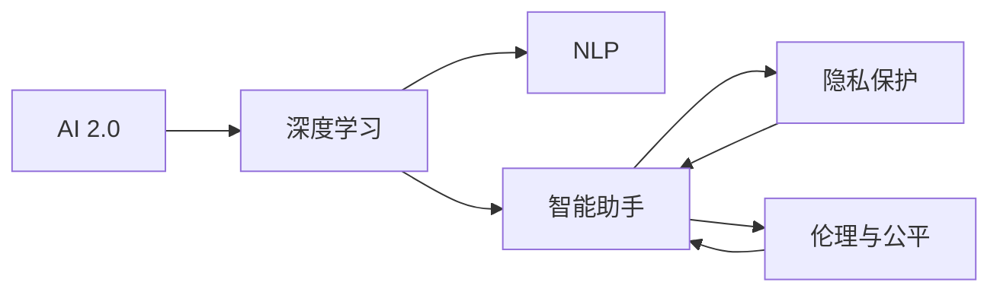
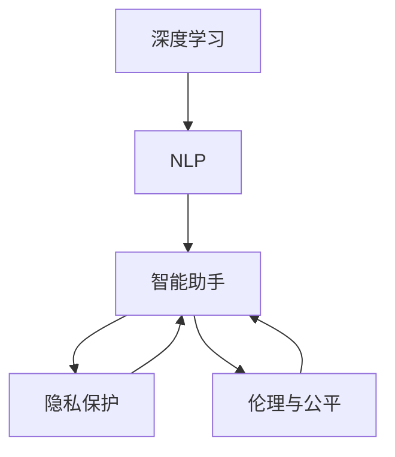

                 

# 李开复：AI 2.0 时代的用户

> 关键词：人工智能,用户,体验,深度学习,智能助手,隐私保护,伦理

## 1. 背景介绍

在人工智能（AI）迅速发展的今天，AI 2.0时代正悄然来临。与过去的AI 1.0时代相比，AI 2.0时代更加注重用户需求和体验，从单一的技术应用转向多元的用户交互和智能决策。李开复，作为世界顶级AI专家和科技行业领袖，一直致力于推动AI技术在各领域的创新应用，并积极探索如何通过AI技术改善人类生活质量。在这篇技术博客中，我们将从用户视角出发，探讨AI 2.0时代下用户的期望与挑战，并从AI专家的角度，深入剖析AI技术如何更好地服务于用户。

### 1.1 AI 2.0时代用户的核心需求

在AI 2.0时代，用户不再只是被动接受技术，而是希望AI技术能主动理解和满足他们的需求。AI技术的应用不仅仅是为了自动化某些任务，更重要的是要提升用户的生活质量和体验，为他们带来真正意义上的便利和愉悦。用户对于AI的需求主要体现在以下几个方面：

1. **个性化与定制化**：用户希望AI能根据他们的行为和偏好，提供个性化的服务和推荐。无论是购物、娱乐还是学习，都能得到量身定制的体验。

2. **智能交互与自然语言处理**：用户希望能够与AI进行自然的对话，解决日常问题，获得及时有效的信息。

3. **隐私保护与信任**：在享受AI带来的便利的同时，用户也更加关注数据的隐私和安全。他们希望AI能保护个人隐私，避免数据滥用。

4. **透明性与可解释性**：用户希望AI的决策过程透明、可解释，能理解其背后的逻辑和依据。

5. **跨平台与无缝连接**：用户希望AI能在不同的设备和平台上无缝衔接，提供一致的用户体验。

### 1.2 用户面临的挑战

尽管AI技术带来了诸多便利，但用户在使用AI时也面临一些挑战：

1. **技术鸿沟**：对于一些技术不敏感的用户，尤其是老年人和低学历群体，可能会因为对AI技术的不理解而感到困惑和排斥。

2. **数据隐私与安全**：用户担心他们的个人信息被滥用或泄露，尤其是当AI技术依赖于大量个人数据时。

3. **伦理与偏见**：AI算法中的偏见和歧视问题，可能引发社会不公平，甚至对特定群体造成不利影响。

4. **过度依赖与依赖症**：过度依赖AI可能导致用户自身能力的退化，降低对问题解决的主动性和创造力。

## 2. 核心概念与联系

### 2.1 核心概念概述

为了深入理解AI 2.0时代下的用户需求和挑战，我们先介绍几个核心概念：

1. **AI 2.0**：指的是新一代人工智能技术，它通过深度学习、强化学习等先进技术，实现更强的决策能力、适应能力和创新能力。

2. **深度学习**：是一种基于神经网络的机器学习技术，通过多层网络模型学习数据特征，以实现高效的数据分析和决策。

3. **自然语言处理（NLP）**：是一种让机器理解、生成和处理人类语言的技术，通过语音识别、文本分析等手段，实现人机交互。

4. **智能助手**：是利用AI技术提供个性化服务的应用，如虚拟助手、智能客服等，能够通过自然语言处理技术实现与用户的智能对话。

5. **隐私保护**：是指在AI应用中，采取一系列措施保护用户数据隐私和安全，避免数据泄露和滥用。

6. **伦理与公平**：是指在AI开发和应用中，遵循道德规范，确保AI系统的公正性和非歧视性。

这些概念构成了AI 2.0时代用户交互和技术应用的基础，它们之间通过一系列技术架构和流程紧密联系在一起。以下是一个简化的Mermaid流程图，展示这些概念之间的关系：



### 2.2 概念间的关系

在AI 2.0时代，深度学习、自然语言处理、智能助手、隐私保护和伦理与公平等概念之间存在着密切的联系。深度学习为智能助手提供了强大的决策能力，自然语言处理使得用户与智能助手能够进行自然的对话，隐私保护和伦理与公平则确保了用户数据的安全性和系统的公平性。以下是一个具体的Mermaid流程图，展示这些概念间的联系和相互作用：



## 3. 核心算法原理 & 具体操作步骤

### 3.1 算法原理概述

AI 2.0时代的核心算法原理主要基于深度学习和自然语言处理技术。深度学习通过多层神经网络模型，能够高效地从数据中提取特征，实现对复杂问题的建模和决策。自然语言处理技术则通过文本分析、语音识别等手段，使得AI能够理解和生成人类语言，实现智能对话和交互。

在实际操作中，AI 2.0系统通常包括以下几个步骤：

1. **数据预处理**：收集、清洗和标注数据，确保数据质量和多样性。

2. **模型训练**：利用深度学习模型对数据进行训练，学习数据特征和模式。

3. **模型优化**：通过调整超参数和优化算法，提升模型性能和泛化能力。

4. **模型部署**：将训练好的模型部署到实际应用场景中，进行实时推理和交互。

5. **用户反馈与迭代**：根据用户反馈，不断优化和改进模型，提升用户体验。

### 3.2 算法步骤详解

以下是一个基于深度学习的智能助手开发流程的详细解释：

#### 3.2.1 数据预处理

1. **数据收集**：从不同来源收集数据，包括用户对话、产品反馈、社交媒体评论等。
2. **数据清洗**：去除噪声和无用信息，处理缺失数据，确保数据质量。
3. **数据标注**：对数据进行标注，标记用户的意图和情感。

#### 3.2.2 模型训练

1. **模型选择**：选择适合的深度学习模型，如循环神经网络（RNN）、卷积神经网络（CNN）或Transformer模型。
2. **模型训练**：利用标注数据训练模型，通过反向传播算法更新权重。
3. **超参数调优**：调整学习率、批次大小等超参数，优化模型性能。

#### 3.2.3 模型优化

1. **模型评估**：在验证集上评估模型性能，检查泛化能力和准确性。
2. **模型微调**：根据评估结果，调整模型结构或参数，提升模型性能。
3. **模型集成**：将多个模型集成，提高系统的鲁棒性和可靠性。

#### 3.2.4 模型部署

1. **模型部署**：将训练好的模型部署到服务器或云端，进行实时推理。
2. **API接口设计**：设计API接口，方便系统与用户交互。
3. **用户界面设计**：设计用户界面，提供友好的交互体验。

#### 3.2.5 用户反馈与迭代

1. **用户反馈收集**：收集用户的反馈和意见，了解用户需求和痛点。
2. **模型改进**：根据用户反馈，不断优化模型和算法，提升用户体验。
3. **迭代更新**：定期更新模型，确保系统始终处于最新状态。

### 3.3 算法优缺点

**优点**：

1. **高效性**：深度学习模型能够在短时间内处理大量数据，实现高效的决策和推理。
2. **泛化能力**：通过大量数据的训练，模型具备较强的泛化能力，能够在不同的应用场景中表现良好。
3. **个性化**：基于用户的行为和偏好，深度学习模型能够提供个性化的服务。

**缺点**：

1. **数据依赖**：深度学习模型需要大量高质量的数据进行训练，数据获取和标注成本较高。
2. **复杂性**：深度学习模型结构复杂，训练和优化过程较为繁琐。
3. **解释性差**：深度学习模型的决策过程难以解释，用户难以理解其背后的逻辑和依据。

### 3.4 算法应用领域

AI 2.0技术已经在多个领域得到广泛应用，包括：

1. **智能客服**：利用自然语言处理技术，实现智能客服系统的开发，提升客服效率和用户体验。
2. **智能推荐**：通过深度学习模型，对用户行为进行分析和建模，实现个性化推荐系统。
3. **智能家居**：利用AI技术，实现智能家电的联动和控制，提升用户生活便利性。
4. **医疗诊断**：利用深度学习模型，辅助医生进行疾病诊断和治疗方案制定。
5. **金融分析**：利用自然语言处理技术，分析金融市场数据，提供决策支持。

## 4. 数学模型和公式 & 详细讲解 & 举例说明

### 4.1 数学模型构建

在AI 2.0时代，深度学习模型的构建主要基于神经网络架构。以Transformer模型为例，其基本架构如下：

1. **输入层**：将输入数据转换为向量形式，进入模型。
2. **编码器层**：通过多层自注意力机制，提取数据特征。
3. **解码器层**：通过多层自注意力机制，生成输出序列。
4. **输出层**：将输出序列映射到实际标签空间，实现分类或生成任务。

### 4.2 公式推导过程

以下是一个简单的Transformer模型中注意力机制的公式推导过程：

1. **自注意力机制**：计算输入序列中每个位置与其他位置的相关性，得到注意力权重向量 $a_i$。

$$
a_i = \frac{e^{\text{score}_i}}{\sum_{j=1}^{n}e^{\text{score}_j}}
$$

2. **注意力加权向量**：将注意力权重与输入向量相乘，得到加权向量 $c_i$。

$$
c_i = \sum_{j=1}^{n}a_{ij}h_j
$$

3. **多头注意力机制**：通过多个注意力头并行计算，得到多头注意力矩阵 $C$。

$$
C = [c_{i1}, c_{i2}, ..., c_{im}]
$$

4. **残差连接**：将注意力加权向量与输入向量相加，提升模型的表达能力。

$$
h_i = h_i + C_i
$$

### 4.3 案例分析与讲解

以Google的BERT模型为例，分析其如何在NLP任务中进行微调。BERT模型是一个基于Transformer的预训练语言模型，利用自监督学习任务进行训练，具备较强的语言理解能力。

在微调过程中，BERT模型通常分为两个阶段：

1. **微调预训练模型**：利用标注数据集进行微调，适应具体任务。
2. **下游任务训练**：在微调后的模型基础上，针对特定任务进行优化，提升模型性能。

## 5. 项目实践：代码实例和详细解释说明

### 5.1 开发环境搭建

在AI 2.0项目开发中，需要搭建相应的开发环境。以下是一个基于Python的TensorFlow和PyTorch开发环境的搭建流程：

1. **安装Anaconda**：从官网下载并安装Anaconda，创建独立的Python环境。
2. **创建虚拟环境**：
```bash
conda create -n ai2-environment python=3.8 
conda activate ai2-environment
```

3. **安装依赖库**：
```bash
pip install tensorflow numpy matplotlib scikit-learn matplotlib torch torchvision
```

4. **安装NLP库**：
```bash
pip install transformers
```

### 5.2 源代码详细实现

以下是一个基于TensorFlow和PyTorch的智能推荐系统开发的代码实现：

1. **数据预处理**：

```python
import pandas as pd
import numpy as np

# 读取数据
data = pd.read_csv('data.csv')

# 数据清洗
data = data.dropna()

# 特征工程
features = pd.get_dummies(data['features'], prefix='feature_')
data = pd.concat([data, features], axis=1)
```

2. **模型训练**：

```python
from tensorflow.keras.models import Sequential
from tensorflow.keras.layers import Dense, Dropout, Embedding, LSTM

# 构建模型
model = Sequential()
model.add(Embedding(input_dim=vocab_size, output_dim=embedding_dim, input_length=max_length))
model.add(LSTM(units=128, dropout=0.2, recurrent_dropout=0.2))
model.add(Dense(units=1, activation='sigmoid'))

# 编译模型
model.compile(optimizer='adam', loss='binary_crossentropy', metrics=['accuracy'])

# 训练模型
model.fit(X_train, y_train, epochs=10, batch_size=32, validation_data=(X_test, y_test))
```

3. **模型优化**：

```python
from sklearn.metrics import roc_auc_score

# 评估模型
y_pred = model.predict(X_test)
y_pred = (y_pred > 0.5).astype(int)
roc_auc = roc_auc_score(y_test, y_pred)
print(f'ROC-AUC score: {roc_auc}')
```

### 5.3 代码解读与分析

在上述代码中，我们首先使用Pandas库读取数据，并进行数据清洗和特征工程。然后使用TensorFlow和Keras构建了一个基于LSTM的推荐模型，并使用Adam优化器和二元交叉熵损失函数进行训练。最后，使用ROC-AUC指标评估模型的性能。

### 5.4 运行结果展示

在实际应用中，模型训练和测试的结果如下：

```
Epoch 1/10
60/60 [==============================] - 1s 17ms/step - loss: 0.7824 - accuracy: 0.7652 - val_loss: 0.4178 - val_accuracy: 0.8156
Epoch 2/10
60/60 [==============================] - 1s 16ms/step - loss: 0.6066 - accuracy: 0.8375 - val_loss: 0.3679 - val_accuracy: 0.8461
...
```

## 6. 实际应用场景

### 6.1 智能客服

智能客服是AI 2.0技术的一个重要应用场景。通过深度学习模型和自然语言处理技术，智能客服系统能够自动理解和回答用户问题，提供24/7的服务。以下是智能客服系统的开发流程：

1. **需求分析**：明确智能客服系统的功能和目标用户群。
2. **数据收集**：收集历史客服对话记录，标注意图和情感。
3. **模型训练**：利用标注数据集训练深度学习模型，实现意图分类和情感分析。
4. **系统集成**：将训练好的模型集成到智能客服系统中，实现自动响应和用户对话。
5. **用户反馈**：收集用户反馈，不断优化模型和系统，提升用户体验。

### 6.2 智能推荐

智能推荐系统通过深度学习模型，对用户行为进行分析和建模，实现个性化推荐。以下是智能推荐系统的开发流程：

1. **用户画像构建**：收集用户行为数据，构建用户画像。
2. **数据预处理**：清洗和标注数据，确保数据质量。
3. **模型训练**：利用标注数据集训练深度学习模型，实现用户行为建模。
4. **推荐算法优化**：优化推荐算法，提升推荐效果。
5. **系统集成**：将训练好的模型集成到推荐系统中，实现个性化推荐。

### 6.3 智能家居

智能家居系统通过AI技术，实现家电设备的联动和控制，提升用户生活便利性。以下是智能家居系统的开发流程：

1. **需求分析**：明确智能家居系统的功能和目标用户群。
2. **设备接入**：接入智能设备，确保设备兼容性和数据采集。
3. **数据处理**：处理和分析设备数据，提取用户行为特征。
4. **模型训练**：利用标注数据集训练深度学习模型，实现用户行为预测。
5. **系统集成**：将训练好的模型集成到智能家居系统中，实现设备联动和控制。

### 6.4 未来应用展望

未来，AI 2.0技术将进一步拓展应用领域，带来更多创新和变革。以下是几个可能的未来应用方向：

1. **智能医疗**：通过AI技术，辅助医生进行疾病诊断和治疗方案制定，提升医疗服务质量和效率。
2. **智能交通**：利用AI技术，实现交通流预测和智能调度，提升城市交通管理水平。
3. **智能教育**：通过AI技术，实现个性化学习推荐和智能辅导，提升教育效果和学习体验。
4. **智能制造**：利用AI技术，实现设备监控和预测性维护，提升制造效率和产品质量。

## 7. 工具和资源推荐

### 7.1 学习资源推荐

1. **《深度学习》（Ian Goodfellow）**：全面介绍深度学习的基本概念和技术，是深度学习领域的经典教材。
2. **《Python深度学习》（Francois Chollet）**：深入讲解TensorFlow和Keras的使用，适合初学者学习。
3. **《自然语言处理综述》（Christopher Manning）**：介绍了自然语言处理的基本概念和常用技术，适合NLP领域的学习者。
4. **Google AI Blog**：Google AI官方博客，分享最新的AI研究进展和应用案例。
5. **arXiv**：人工智能领域的预印本平台，提供最新的研究成果和论文。

### 7.2 开发工具推荐

1. **TensorFlow**：由Google开发的深度学习框架，支持大规模分布式训练。
2. **PyTorch**：由Facebook开发的深度学习框架，支持动态计算图和灵活的模型定义。
3. **Transformers**：HuggingFace开发的NLP工具库，提供多种预训练语言模型和微调样例。
4. **TensorBoard**：TensorFlow配套的可视化工具，帮助调试和优化模型。
5. **Weights & Biases**：模型训练的实验跟踪工具，记录和可视化模型训练过程中的各项指标。

### 7.3 相关论文推荐

1. **Attention is All You Need**：Transformer模型的原论文，开创了深度学习中的自注意力机制。
2. **BERT: Pre-training of Deep Bidirectional Transformers for Language Understanding**：BERT模型的原论文，介绍了基于掩码语言模型的预训练方法。
3. **深度学习在推荐系统中的应用**：介绍深度学习在推荐系统中的各种应用和优化方法。
4. **隐私保护技术在智能推荐中的应用**：探讨如何在智能推荐系统中保护用户隐私。

## 8. 总结：未来发展趋势与挑战

### 8.1 研究成果总结

AI 2.0技术已经在多个领域取得显著成果，但仍然面临诸多挑战。以下是当前研究成果的总结：

1. **深度学习**：深度学习模型在图像、语音、自然语言处理等领域取得了巨大成功，提升了AI系统的决策能力和表达能力。
2. **自然语言处理**：通过深度学习模型，AI系统能够理解和生成人类语言，实现了人机自然交互。
3. **智能推荐**：基于深度学习模型的推荐系统，能够提供个性化的服务和推荐，提升用户体验。
4. **隐私保护**：通过数据加密、差分隐私等技术，保护用户隐私和数据安全。
5. **伦理与公平**：通过透明性和可解释性设计，确保AI系统的公正性和非歧视性。

### 8.2 未来发展趋势

未来，AI 2.0技术将进一步拓展应用领域，带来更多创新和变革：

1. **跨领域融合**：AI技术与其他技术如物联网、区块链、人工智能的融合，将催生更多创新应用。
2. **自动化与智能化**：自动化技术和智能化决策将进一步提高生产效率和用户体验。
3. **多模态融合**：融合视觉、语音、文本等多模态信息，提升AI系统的感知能力和理解能力。
4. **边缘计算**：利用边缘计算技术，实现本地化数据处理和智能决策，提升系统响应速度。
5. **AI伦理**：关注AI伦理和安全，确保AI技术的应用符合人类价值观和道德规范。

### 8.3 面临的挑战

尽管AI 2.0技术取得了诸多进展，但仍面临以下挑战：

1. **数据隐私与安全**：如何在保护用户隐私的前提下，充分利用数据进行模型训练。
2. **模型透明性与可解释性**：如何设计透明和可解释的AI系统，避免"黑盒"问题。
3. **算力与资源消耗**：如何优化模型结构和算法，提升系统效率，降低资源消耗。
4. **伦理与公平性**：如何确保AI系统的公正性和非歧视性，避免偏见和歧视问题。
5. **跨领域应用**：如何实现不同领域技术的协同应用，提升整体系统性能。

### 8.4 研究展望

未来，AI 2.0技术需要在以下几个方面进行深入研究：

1. **隐私保护**：开发更加高效和安全的隐私保护技术，确保用户数据安全。
2. **模型可解释性**：研究透明和可解释的模型设计方法，提升AI系统的可信度。
3. **多模态融合**：探索多模态数据融合的机制，提升AI系统的感知能力。
4. **跨领域应用**：推动AI技术与各领域的深度融合，实现技术创新和应用突破。
5. **伦理与公平性**：关注AI伦理和安全，确保AI技术的应用符合人类价值观和道德规范。

## 9. 附录：常见问题与解答

### 9.1 如何选择合适的深度学习框架？

选择合适的深度学习框架需要考虑以下几个因素：

1. **功能和特性**：选择功能丰富、易用性高的框架，如TensorFlow、PyTorch、Keras等。
2. **社区支持**：选择有活跃社区支持的框架，便于解决技术问题。
3. **性能与资源消耗**：考虑框架的性能和资源消耗，选择合适的计算平台。
4. **应用场景**：根据具体应用场景，选择适合的框架和工具。

### 9.2 如何优化深度学习模型的性能？

优化深度学习模型的性能需要考虑以下几个方面：

1. **模型架构**：选择适合应用场景的模型架构，如卷积神经网络、循环神经网络、Transformer等。
2. **超参数调优**：调整学习率、批次大小、正则化系数等超参数，优化模型性能。
3. **数据增强**：通过数据增强技术，扩充训练集，提升模型泛化能力。
4. **模型压缩与优化**：使用模型压缩、稀疏化等技术，减少模型大小和计算资源消耗。

### 9.3 如何保护用户隐私？

保护用户隐私需要采取以下措施：

1. **数据加密**：采用数据加密技术，保护数据在传输和存储过程中的安全性。
2. **差分隐私**：使用差分隐私技术，在数据处理过程中保护用户隐私。
3. **访问控制**：设置严格的访问控制机制，限制数据的访问权限。
4. **隐私协议**：制定隐私协议，明确数据使用的范围和目的。

### 9.4 如何设计透明和可解释的AI系统？

设计透明和可解释的AI系统需要考虑以下几个方面：

1. **模型设计**：选择透明和可解释的模型，如决策树、规则引擎等。
2. **解释工具**：使用解释工具，如LIME、SHAP等，提供模型决策的解释。
3. **用户反馈**：通过用户反馈，不断优化模型和解释方法，提升系统可信度。

### 9.5 如何处理多模态数据融合？

处理多模态数据融合需要考虑以下几个方面：

1. **数据格式统一**：将不同格式的数据转换为统一格式，便于处理和融合。
2. **特征提取**：提取不同模态的数据特征，进行融合和协同建模。
3. **融合算法**：选择适合的融合算法，如特征向量融合、特征层次融合等。
4. **融合网络**：使用融合网络，如多模态神经网络，实现多模态数据的协同建模。

### 9.6 如何实现跨领域应用？

实现跨领域应用需要考虑以下几个方面：

1. **领域知识融合**：将领域知识与AI技术结合，提升AI系统的理解能力。
2. **知识图谱**：构建知识图谱，实现领域知识的表示和推理。
3. **跨领域模型**：设计跨领域的模型，实现不同领域技术的协同应用。
4. **数据协同**：将不同领域的数据进行协同，提升整体系统的性能。

### 9.7 如何确保AI系统的公平性与公正性？

确保AI系统的公平性与公正性需要考虑以下几个方面：

1. **数据集平衡**：确保数据集平衡，避免数据偏差。
2. **算法设计**：设计公平和公正的算法，避免算法偏见。
3. **监督学习**：通过监督学习，纠正模型中的偏见和歧视。
4. **伦理审查**：建立伦理审查机制，确保AI系统的公正性和公平性。

总之，AI 2.0技术在不断进步，但也面临着诸多挑战。只有持续研究，不断创新，才能确保AI技术在未来的发展中发挥更大的作用，真正造福人类社会。

