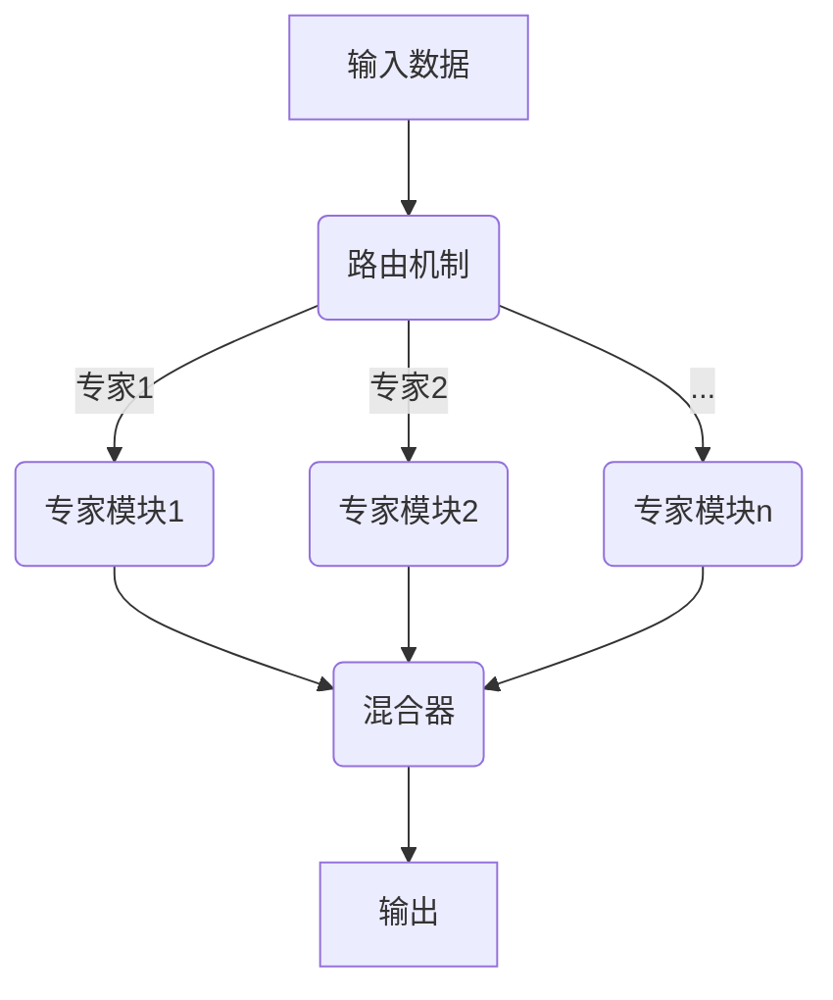

# 大语言模型原理基础与前沿：为什么采用稀疏专家模型

## 1. 背景介绍

### 1.1 问题的由来

随着人工智能技术的不断发展，大型语言模型已经成为自然语言处理领域的关键技术之一。传统的语言模型通常采用密集参数表示,但随着模型规模的不断增大,密集参数的存储和计算开销也呈指数级增长,这给硬件资源带来了巨大压力。为了解决这一问题,研究人员提出了稀疏专家模型(Sparse Expert Models)的概念,旨在通过参数稀疏化和专家模块化来降低计算和存储开销,同时保持模型的性能。

### 1.2 研究现状

近年来,稀疏专家模型在自然语言处理领域引起了广泛关注。谷歌的Switch Transformer、微软的LeDeN模型、OpenAI的Sparse Transformer等都采用了稀疏专家模型的架构。这些模型通过引入专家模块和路由机制,实现了参数的稀疏化和模块化,大大降低了计算和存储开销,同时保持了较高的性能表现。

### 1.3 研究意义

稀疏专家模型的研究对于推动大型语言模型的发展具有重要意义。它不仅可以有效降低模型的计算和存储开销,从而使更大规模的模型在有限硬件资源下变得可行,还可以通过模块化设计提高模型的可解释性和可扩展性。此外,稀疏专家模型的思想也为其他领域的深度学习模型优化提供了新的思路和启发。

### 1.4 本文结构

本文将从以下几个方面深入探讨稀疏专家模型:

1. 核心概念与联系
2. 核心算法原理与具体操作步骤
3. 数学模型和公式详细讲解与举例说明
4. 项目实践:代码实例和详细解释说明
5. 实际应用场景
6. 工具和资源推荐
7. 总结:未来发展趋势与挑战
8. 附录:常见问题与解答

## 2. 核心概念与联系

稀疏专家模型的核心思想是将传统的密集参数模型分解为多个专家模块,每个专家模块只负责处理输入的一部分,从而实现参数的稀疏化和模块化。这种设计不仅可以降低计算和存储开销,还可以提高模型的可解释性和可扩展性。

如上图所示,稀疏专家模型通常包括以下几个核心组件:

1. **专家模块(Expert Modules)**: 每个专家模块都是一个独立的子模型,专门处理输入数据的一部分。专家模块通常采用较小的模型规模,从而降低了整体模型的计算和存储开销。

2. **路由机制(Routing Mechanism)**: 路由机制决定将输入数据的哪些部分分配给哪些专家模块进行处理。常见的路由机制包括基于注意力机制的软路由和基于哈希函数的硬路由。

3. **混合器(Mixer)**: 混合器将各个专家模块的输出进行整合,生成最终的模型输出。混合器可以采用加权求和、门控机制等方式进行融合。

通过上述核心组件的协同工作,稀疏专家模型实现了参数的稀疏化和模块化,从而降低了计算和存储开销,同时保持了较高的性能表现。

## 3. 核心算法原理与具体操作步骤

### 3.1 算法原理概述

稀疏专家模型的核心算法原理可以概括为以下几个关键步骤:

1. **输入分配**: 将输入数据根据路由机制分配给不同的专家模块进行处理。

2. **专家模块计算**: 每个专家模块独立地对分配给它的输入数据进行处理,生成相应的输出。

3. **输出融合**: 将各个专家模块的输出通过混合器进行融合,生成最终的模型输出。

4. **反向传播**: 在训练过程中,根据损失函数对各个专家模块和路由机制进行反向传播,更新模型参数。

### 3.2 算法步骤详解

1. **输入分配**

   在这一步骤中,需要通过路由机制将输入数据分配给不同的专家模块。常见的路由机制包括:

   - **基于注意力机制的软路由**: 通过计算输入数据与每个专家模块之间的相关性得分,然后根据得分分配输入数据。
   - **基于哈希函数的硬路由**: 通过哈希函数将输入数据映射到不同的专家模块,实现确定性的路由。

2. **专家模块计算**

   在这一步骤中,每个专家模块独立地对分配给它的输入数据进行处理,生成相应的输出。专家模块可以采用不同的神经网络架构,如Transformer、CNN、RNN等。

3. **输出融合**

   在这一步骤中,需要将各个专家模块的输出进行融合,生成最终的模型输出。常见的融合方式包括:

   - **加权求和**: 将各个专家模块的输出按照一定的权重进行加权求和。
   - **门控机制**: 通过门控机制动态调节各个专家模块输出的重要性。

4. **反向传播**

   在训练过程中,需要根据损失函数对各个专家模块和路由机制进行反向传播,更新模型参数。具体步骤如下:

   - 计算损失函数对最终输出的梯度。
   - 根据混合器的梯度更新各个专家模块的参数。
   - 根据专家模块输出的梯度更新路由机制的参数。

### 3.3 算法优缺点

**优点**:

- 降低了计算和存储开销,使得更大规模的模型变得可行。
- 通过模块化设计提高了模型的可解释性和可扩展性。
- 专家模块可以专注于处理特定的任务或数据,从而提高了模型的性能。

**缺点**:

- 路由机制的设计和训练可能会增加一定的复杂性。
- 专家模块之间的通信和协作可能会带来额外的开销。
- 在某些情况下,稀疏专家模型可能无法达到密集模型的性能水平。

### 3.4 算法应用领域

稀疏专家模型可以应用于各种自然语言处理任务,如机器翻译、文本生成、问答系统等。此外,它的思想也可以扩展到其他领域的深度学习模型优化,如计算机视觉、语音识别等。

## 4. 数学模型和公式详细讲解与举例说明

### 4.1 数学模型构建

在稀疏专家模型中,我们需要构建以下几个核心模块的数学模型:

1. **专家模块(Expert Modules)**

   每个专家模块可以看作是一个独立的神经网络模型,其输入输出可以表示为:

   $$o_i = f_i(x_i; \theta_i)$$

   其中,$ o_i $表示第$ i $个专家模块的输出,$ f_i $表示该专家模块的模型函数,$ x_i $表示该专家模块的输入,$ \theta_i $表示该专家模块的参数。

2. **路由机制(Routing Mechanism)**

   路由机制的作用是将输入数据$ x $分配给不同的专家模块。我们可以使用注意力机制或哈希函数来实现路由。

   - 基于注意力机制的软路由:

     $$r_i = \text{Attention}(x, k_i)$$

     其中,$ r_i $表示第$ i $个专家模块的路由得分,$ k_i $表示该专家模块的查询向量。然后,我们可以根据得分$ r_i $计算输入$ x $分配给第$ i $个专家模块的比例$ p_i $:

     $$p_i = \frac{\exp(r_i)}{\sum_j \exp(r_j)}$$

   - 基于哈希函数的硬路由:

     $$i = \text{Hash}(x)$$

     其中,$ i $表示输入$ x $被分配给的专家模块的索引。

3. **混合器(Mixer)**

   混合器的作用是将各个专家模块的输出进行融合,生成最终的模型输出$ y $。我们可以使用加权求和或门控机制来实现混合。

   - 加权求和:

     $$y = \sum_i w_i o_i$$

     其中,$ w_i $表示第$ i $个专家模块的权重。

   - 门控机制:

     $$y = \sum_i g_i \odot o_i$$

     其中,$ g_i $表示第$ i $个专家模块的门控向量,$ \odot $表示元素wise乘积运算。

### 4.2 公式推导过程

在这一小节中,我们将详细推导稀疏专家模型的数学公式,以便更好地理解其原理。

1. **专家模块输出**

   假设我们有$ N $个专家模块,每个专家模块的输出可以表示为:

   $$o_i = f_i(x_i; \theta_i), \quad i = 1, 2, \ldots, N$$

   其中,$ o_i $表示第$ i $个专家模块的输出,$ f_i $表示该专家模块的模型函数,$ x_i $表示该专家模块的输入,$ \theta_i $表示该专家模块的参数。

2. **路由机制**

   我们使用注意力机制来实现路由。对于每个输入$ x $,我们计算它与每个专家模块的相关性得分$ r_i $:

   $$r_i = \text{Attention}(x, k_i)$$

   其中,$ k_i $表示第$ i $个专家模块的查询向量。

   然后,我们可以根据得分$ r_i $计算输入$ x $分配给第$ i $个专家模块的比例$ p_i $:

   $$p_i = \frac{\exp(r_i)}{\sum_j \exp(r_j)}$$

   因此,第$ i $个专家模块的输入$ x_i $可以表示为:

   $$x_i = p_i x$$

3. **混合器输出**

   我们使用加权求和的方式将各个专家模块的输出进行融合,生成最终的模型输出$ y $:

   $$y = \sum_i w_i o_i$$

   其中,$ w_i $表示第$ i $个专家模块的权重。

   将专家模块输出$ o_i $代入,我们可以得到:

   $$y = \sum_i w_i f_i(p_i x; \theta_i)$$

4. **损失函数和反向传播**

   在训练过程中,我们需要定义一个损失函数$ \mathcal{L} $,并根据损失函数对模型参数进行反向传播更新。

   假设我们的目标是最小化损失函数$ \mathcal{L}(y, y^*) $,其中$ y^* $表示期望的输出。我们可以计算损失函数相对于模型参数$ \theta_i $和路由参数$ k_i $的梯度:

   $$\frac{\partial \mathcal{L}}{\partial \theta_i} = \frac{\partial \mathcal{L}}{\partial y} \frac{\partial y}{\partial o_i} \frac{\partial o_i}{\partial \theta_i}$$

   $$\frac{\partial \mathcal{L}}{\partial k_i} = \frac{\partial \mathcal{L}}{\partial y} \frac{\partial y}{\partial o_i} \frac{\partial o_i}{\partial x_i} \frac{\partial x_i}{\partial p_i} \frac{\partial p_i}{\partial k_i}$$

   根据这些梯度,我们可以使用优化算法(如随机梯度下降)来更新模型参数和路由参数。

### 4.3 案例分析与讲解

为了更好地理解稀疏专家模型的工作原理,我们将通过一个简单的案例进行分析和讲解。

假设我们有一个文本分类任务,需要将输入文本分类为不同的类别。我们将使用一个包含三个专家模块的稀疏专家模型来解决这个问题。

1. **输入分配**

   首先,我们将输入文本$ x $通过注意力机制分配给三个专家模块。假设我们得到的路由得分分别为$ r