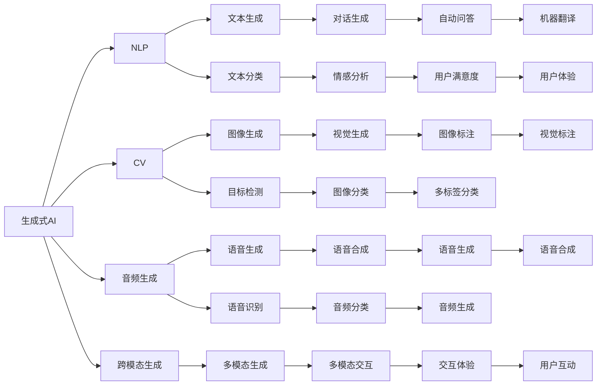
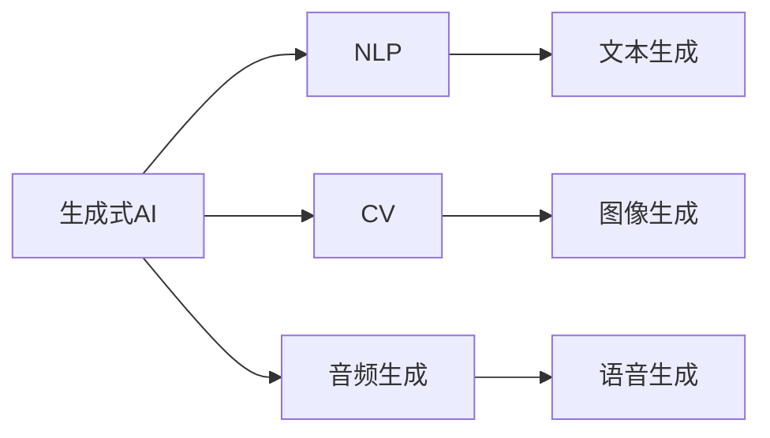
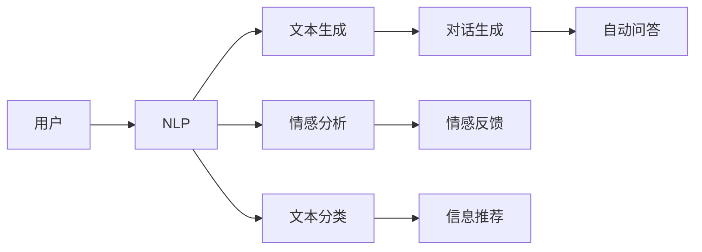
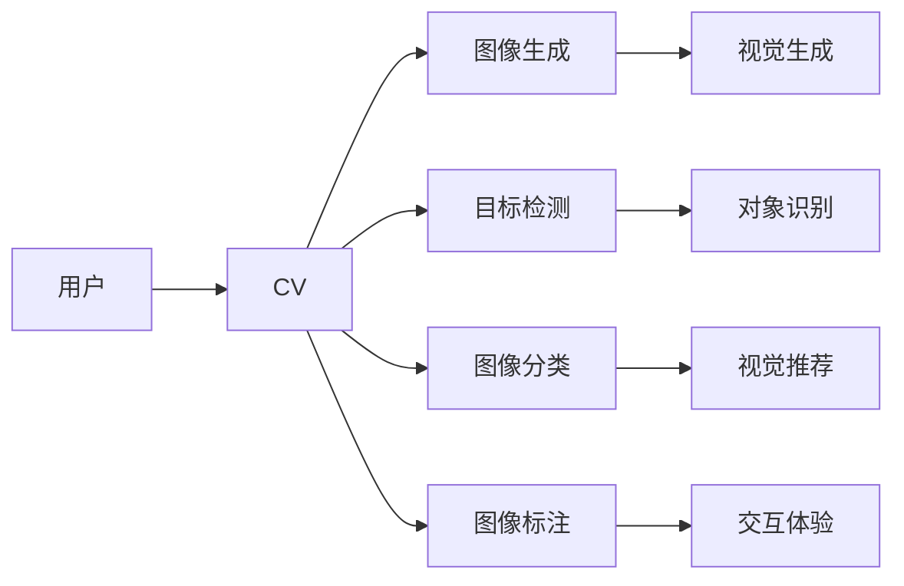
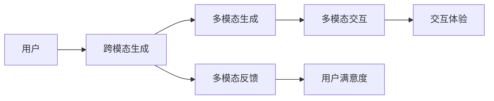
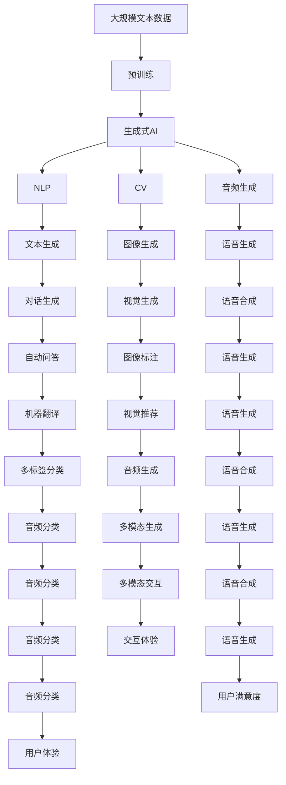

                 

# AI赋能：生成式AI如何提升用户体验？

> 关键词：生成式AI,用户体验,自然语言处理,NLP,计算机视觉,自动生成,用户互动

## 1. 背景介绍

### 1.1 问题由来

在数字时代，用户体验（User Experience, UX）成为了衡量产品成功与否的关键指标。随着AI技术的不断发展，生成式AI在提升用户体验方面展现出了巨大的潜力。生成式AI利用深度学习模型生成新的文本、图像、音频等内容，为人类提供更加丰富、个性化的互动体验。

无论是自然语言处理（NLP）还是计算机视觉（CV）领域，生成式AI都已展现出强大的应用能力。在NLP方面，生成式AI可以帮助自动化生成自然流畅的对话，改善客服体验；在CV方面，生成式AI可以生成高质量的图像、视频内容，提升用户对产品的满意度。

### 1.2 问题核心关键点

生成式AI的核心关键点在于其生成能力，即通过深度学习模型，生成符合特定规则、风格或语境的文本、图像、音频等内容。其生成效果的好坏，直接影响用户体验的高低。

生成式AI主要包括以下几个核心技术：

- **自然语言处理（NLP）**：利用语言模型生成自然流畅的对话、文本摘要、机器翻译等。
- **计算机视觉（CV）**：利用图像生成模型生成高质量的图像、视频内容，提升用户对产品的视觉体验。
- **音频生成**：利用语音合成模型生成自然流畅的语音输出，提升用户的听觉体验。
- **跨模态生成**：结合NLP、CV和音频生成技术，实现多模态内容的生成。

### 1.3 问题研究意义

研究生成式AI在提升用户体验方面的应用，对于推动产品创新、增强市场竞争力具有重要意义。具体如下：

1. **提升用户满意度**：生成式AI能够提供更加个性化、符合用户期望的内容，提升用户对产品的满意度和忠诚度。
2. **优化产品体验**：生成式AI能够自动生成高质量的内容，减少用户输入的时间和精力，优化用户互动体验。
3. **提高内容创作效率**：生成式AI能够快速生成大量高质量内容，提高内容创作的效率和质量，降低人工成本。
4. **增强用户互动**：生成式AI能够实现与用户的自然语言交互，增强用户互动的趣味性和沉浸感。
5. **促进产品创新**：生成式AI能够生成创意性内容，推动产品的创新和差异化发展。

## 2. 核心概念与联系

### 2.1 核心概念概述

为更好地理解生成式AI在提升用户体验方面的应用，本节将介绍几个密切相关的核心概念：

- **生成式AI（Generative AI）**：利用深度学习模型生成符合特定规则、风格或语境的文本、图像、音频等内容。
- **自然语言处理（NLP）**：涉及文本数据的处理和分析，包括文本分类、情感分析、机器翻译等任务。
- **计算机视觉（CV）**：涉及图像和视频数据的处理和分析，包括图像生成、目标检测、图像分类等任务。
- **跨模态生成（Cross-Modal Generation）**：结合NLP、CV和音频生成技术，实现多模态内容的生成。
- **用户体验（UX）**：衡量产品成功与否的关键指标，涉及用户对产品的使用感受和满意度。

这些核心概念之间的逻辑关系可以通过以下Mermaid流程图来展示：



这个流程图展示了大语言模型的核心概念及其之间的关系：

1. 生成式AI涵盖NLP、CV和音频生成等多种技术，可以生成文本、图像、音频等多种模态的内容。
2. NLP技术主要用于文本生成和文本处理，如对话生成、情感分析、机器翻译等。
3. CV技术主要用于图像生成和图像处理，如图像生成、目标检测、图像分类等。
4. 跨模态生成技术可以结合NLP、CV和音频生成，实现多模态内容的生成。
5. UX技术涉及用户对产品的使用感受和满意度，可以通过生成式AI提升。

这些概念共同构成了生成式AI提升用户体验的完整生态系统，使得AI技术能够更好地服务于用户，推动产品创新和差异化发展。

### 2.2 概念间的关系

这些核心概念之间存在着紧密的联系，形成了生成式AI提升用户体验的完整生态系统。下面我们通过几个Mermaid流程图来展示这些概念之间的关系。

#### 2.2.1 生成式AI的技术栈



这个流程图展示了生成式AI涵盖的技术栈：

1. 生成式AI包括NLP、CV和音频生成等多种技术。
2. NLP技术主要用于文本生成和文本处理。
3. CV技术主要用于图像生成和图像处理。
4. 音频生成技术主要用于语音合成和语音识别。

#### 2.2.2 NLP在用户体验中的应用



这个流程图展示了NLP技术在提升用户体验中的应用：

1. 用户与NLP系统进行交互，生成文本内容。
2. NLP系统生成对话和自动问答，提升用户体验。
3. 情感分析技术可以帮助了解用户的情感状态，进行情感反馈。
4. 文本分类技术可以对用户反馈进行分类，推荐相关信息。

#### 2.2.3 CV在用户体验中的应用



这个流程图展示了CV技术在提升用户体验中的应用：

1. 用户与CV系统进行交互，生成图像内容。
2. CV系统生成视觉内容和目标检测，提升用户体验。
3. 图像分类技术可以对用户生成内容进行分类，推荐相关信息。
4. 图像标注技术可以对用户生成的内容进行标注，提升交互体验。

#### 2.2.4 跨模态生成在用户体验中的应用



这个流程图展示了跨模态生成技术在提升用户体验中的应用：

1. 用户与跨模态系统进行交互，生成多模态内容。
2. 跨模态系统生成多模态内容和交互，提升用户体验。
3. 多模态反馈技术可以帮助了解用户的交互体验，进行满意度评估。
4. 交互体验技术可以提升用户对产品的满意度和忠诚度。

### 2.3 核心概念的整体架构

最后，我们用一个综合的流程图来展示这些核心概念在大语言模型微调过程中的整体架构：



这个综合流程图展示了从预训练到生成式AI应用的全过程。生成式AI首先在大规模文本数据上进行预训练，然后通过NLP、CV和音频生成技术，生成多模态内容。最后，通过多模态交互技术，提升用户体验和满意度。 通过这些流程图，我们可以更清晰地理解生成式AI提升用户体验的过程和关键技术点，为后续深入讨论具体的技术细节奠定基础。

## 3. 核心算法原理 & 具体操作步骤
### 3.1 算法原理概述

生成式AI提升用户体验的核心原理在于通过深度学习模型，生成符合特定规则、风格或语境的文本、图像、音频等内容。其核心算法包括：

- **生成对抗网络（GAN）**：通过对抗训练生成逼真的图像、视频内容。
- **变分自编码器（VAE）**：通过生成概率分布，生成高质量的文本和图像内容。
- **序列到序列模型（Seq2Seq）**：通过编码器-解码器结构，生成自然流畅的对话和文本摘要。
- **自回归模型（AR）**：通过时间依赖关系，生成自然流畅的对话和文本内容。
- **条件生成模型（CGM）**：通过条件编码器，生成符合特定条件的内容。

生成式AI主要分为两大类：基于NLP的生成和基于CV的生成。基于NLP的生成主要通过语言模型生成文本内容，如对话生成、文本摘要等；基于CV的生成主要通过图像生成模型生成图像和视频内容，如图像生成、目标检测等。

### 3.2 算法步骤详解

生成式AI提升用户体验主要包括以下几个关键步骤：

**Step 1: 准备生成式AI和数据集**
- 选择合适的生成式AI模型（如GAN、VAE、Seq2Seq等）作为初始化参数，如GPT、BERT等。
- 准备生成式AI所需的数据集，划分为训练集、验证集和测试集。数据集需要覆盖目标应用场景，涵盖不同风格、情感和语境的内容。

**Step 2: 添加任务适配层**
- 根据具体任务，在生成式AI顶层设计合适的输出层和损失函数。
- 对于文本生成任务，通常在顶层添加线性分类器和交叉熵损失函数。
- 对于图像生成任务，通常使用像素级别的交叉熵损失函数。

**Step 3: 设置生成式AI超参数**
- 选择合适的优化算法及其参数，如Adam、SGD等，设置学习率、批大小、迭代轮数等。
- 设置正则化技术及强度，包括权重衰减、Dropout、Early Stopping等。
- 确定冻结生成式AI参数的策略，如仅微调顶层，或全部参数都参与微调。

**Step 4: 执行生成式AI训练**
- 将训练集数据分批次输入生成式AI，前向传播计算损失函数。
- 反向传播计算参数梯度，根据设定的优化算法和学习率更新模型参数。
- 周期性在验证集上评估生成式AI性能，根据性能指标决定是否触发 Early Stopping。
- 重复上述步骤直到满足预设的迭代轮数或 Early Stopping 条件。

**Step 5: 测试和部署**
- 在测试集上评估生成式AI的性能，对比生成前后效果。
- 使用生成式AI对新数据进行生成，集成到实际的应用系统中。
- 持续收集新的数据，定期重新生成式AI，以适应数据分布的变化。

以上是生成式AI提升用户体验的一般流程。在实际应用中，还需要针对具体任务的特点，对生成式AI过程的各个环节进行优化设计，如改进训练目标函数，引入更多的正则化技术，搜索最优的超参数组合等，以进一步提升生成效果。

### 3.3 算法优缺点

生成式AI提升用户体验的方法具有以下优点：

1. **自动化生成**：利用深度学习模型自动化生成文本、图像、音频等内容，提高内容创作效率。
2. **个性化体验**：根据用户偏好和需求，生成个性化、符合用户期望的内容，提升用户体验。
3. **实时生成**：生成式AI可以实时生成内容，满足用户对即时体验的需求。
4. **提升创意**：生成式AI可以生成创意性内容，推动产品创新和差异化发展。

同时，该方法也存在一定的局限性：

1. **生成质量受限**：生成内容的质量很大程度上依赖于训练数据和模型结构，可能存在低质量或不合理的内容。
2. **泛化能力有限**：生成的内容可能对特定语境或场景有更好的适应性，对新语境或场景的泛化能力有限。
3. **过拟合风险**：生成式AI在训练集上过拟合，生成的内容可能不适合实际应用场景。
4. **资源消耗大**：大规模生成式AI模型需要大量的计算资源，可能面临计算成本高的问题。

尽管存在这些局限性，但就目前而言，生成式AI提升用户体验的方法已经在大规模应用中取得了显著的效果，成为推动NLP和CV技术落地应用的重要手段。未来相关研究的重点在于如何进一步降低生成式AI对计算资源的依赖，提高模型的泛化能力，同时兼顾内容质量和创意性。

### 3.4 算法应用领域

生成式AI提升用户体验的方法已经在NLP和CV领域得到了广泛的应用，覆盖了几乎所有常见的应用场景，例如：

- **文本生成**：如生成对话、文本摘要、自动问答、机器翻译等。生成式AI可以自动生成自然流畅的对话，改善客服体验。
- **图像生成**：如生成高质量的图像、视频内容，提升用户对产品的视觉体验。
- **音频生成**：如生成自然流畅的语音输出，提升用户的听觉体验。
- **跨模态生成**：结合NLP、CV和音频生成技术，实现多模态内容的生成。如生成自然流畅的多模态交互内容，提升用户对产品的互动体验。

除了上述这些经典应用外，生成式AI提升用户体验的方法也被创新性地应用到更多场景中，如可控文本生成、常识推理、代码生成、数据增强等，为NLP技术带来了全新的突破。随着生成式AI和微调方法的不断进步，相信NLP技术将在更广阔的应用领域大放异彩。

## 4. 数学模型和公式 & 详细讲解  
### 4.1 数学模型构建

本节将使用数学语言对生成式AI提升用户体验的过程进行更加严格的刻画。

记生成式AI模型为 $G_{\theta}:\mathcal{X} \rightarrow \mathcal{Y}$，其中 $\mathcal{X}$ 为输入空间，$\mathcal{Y}$ 为输出空间，$\theta \in \mathbb{R}^d$ 为模型参数。假设生成式AI的训练集为 $D=\{(x_i,y_i)\}_{i=1}^N, x_i \in \mathcal{X}, y_i \in \mathcal{Y}$。

定义生成式AI模型 $G_{\theta}$ 在数据样本 $(x,y)$ 上的损失函数为 $\ell(G_{\theta}(x),y)$，则在数据集 $D$ 上的经验风险为：

$$
\mathcal{L}(\theta) = \frac{1}{N} \sum_{i=1}^N \ell(G_{\theta}(x_i),y_i)
$$

生成式AI的优化目标是最小化经验风险，即找到最优参数：

$$
\theta^* = \mathop{\arg\min}_{\theta} \mathcal{L}(\theta)
$$

在实践中，我们通常使用基于梯度的优化算法（如SGD、Adam等）来近似求解上述最优化问题。设 $\eta$ 为学习率，$\lambda$ 为正则化系数，则参数的更新公式为：

$$
\theta \leftarrow \theta - \eta \nabla_{\theta}\mathcal{L}(\theta) - \eta\lambda\theta
$$

其中 $\nabla_{\theta}\mathcal{L}(\theta)$ 为损失函数对参数 $\theta$ 的梯度，可通过反向传播算法高效计算。

### 4.2 公式推导过程

以下我们以文本生成任务为例，推导生成对抗网络（GAN）模型的损失函数及其梯度的计算公式。

假设生成式AI模型 $G_{\theta}$ 在输入 $x$ 上的生成结果为 $z = G_{\theta}(x)$，真实标签 $y \in \{0,1\}$。则二分类交叉熵损失函数定义为：

$$
\ell(G_{\theta}(x),y) = -[y\log G_{\theta}(x) + (1-y)\log (1-G_{\theta}(x))]
$$

将其代入经验风险公式，得：

$$
\mathcal{L}(\theta) = -\frac{1}{N}\sum_{i=1}^N [y_i\log G_{\theta}(x_i)+(1-y_i)\log(1-G_{\theta}(x_i))]
$$

根据链式法则，损失函数对参数 $\theta$ 的梯度为：

$$
\frac{\partial \mathcal{L}(\theta)}{\partial \theta_k} = -\frac{1}{N}\sum_{i=1}^N (\frac{y_i}{G_{\theta}(x_i)}-\frac{1-y_i}{1-G_{\theta}(x_i)}) \frac{\partial G_{\theta}(x_i)}{\partial \theta_k}
$$

其中 $\frac{\partial G_{\theta}(x_i)}{\partial \theta_k}$ 可进一步递归展开，利用自动微分技术完成计算。

在得到损失函数的梯度后，即可带入参数更新公式，完成模型的迭代优化。重复上述过程直至收敛，最终得到适应目标任务的最优模型参数 $\theta^*$。

## 5. 项目实践：代码实例和详细解释说明
### 5.1 开发环境搭建

在进行生成式AI实践前，我们需要准备好开发环境。以下是使用Python进行PyTorch开发的环境配置流程：

1. 安装Anaconda：从官网下载并安装Anaconda，用于创建独立的Python环境。

2. 创建并激活虚拟环境：
```bash
conda create -n pytorch-env python=3.8 
conda activate pytorch-env
```

3. 安装PyTorch：根据CUDA版本，从官网获取对应的安装命令。例如：
```bash
conda install pytorch torchvision torchaudio cudatoolkit=11.1 -c pytorch -c conda-forge
```

4. 安装TensorFlow：
```bash
pip install tensorflow
```

5. 安装transformers库：
```bash
pip install transformers
```

6. 安装各类工具包：
```bash
pip install numpy pandas scikit-learn matplotlib tqdm jupyter notebook ipython
```

完成上述步骤后，即可在`pytorch-env`环境中开始生成式AI实践。

### 5.2 源代码详细实现

这里我们以生成式AI提升用户体验的实践为例，给出使用PyTorch进行GAN模型训练的PyTorch代码实现。

首先，定义GAN模型的生成器和判别器：

```python
from torch import nn
from torchvision import datasets, transforms

class Generator(nn.Module):
    def __init__(self):
        super(Generator, self).__init__()
        self.main = nn.Sequential(
            nn.ConvTranspose2d(100, 256, 4, 1, 0, bias=False),
            nn.BatchNorm2d(256),
            nn.ReLU(True),
            nn.ConvTranspose2d(256, 128, 4, 2, 1, bias=False),
            nn.BatchNorm2d(128),
            nn.ReLU(True),
            nn.ConvTranspose2d(128, 64, 4, 2, 1, bias=False),
            nn.BatchNorm2d(64),
            nn.ReLU(True),
            nn.ConvTranspose2d(64, 3, 4, 2, 1, bias=False),
            nn.Tanh()
        )

    def forward(self, input):
        return self.main(input)

class Discriminator(nn.Module):
    def __init__(self):
        super(Discriminator, self).__init__()
        self.main = nn.Sequential(
            nn.Conv2d(3, 64, 4, 2, 1, bias=False),
            nn.LeakyReLU(0.2, inplace=True),
            nn.Conv2d(64, 128, 4, 2, 1, bias=False),
            nn.BatchNorm2d(128),
            nn.LeakyReLU(0.2, inplace=True),
            nn.Conv2d(128, 256, 4, 2, 1, bias=False),
            nn.BatchNorm2d(256),
            nn.LeakyReLU(0.2, inplace=True),
            nn.Conv2d(256, 1, 4, 1, 0, bias=False),
            nn.Sigmoid()
        )

    def forward(self, input):
        return self.main(input)
```

然后，定义GAN模型的损失函数和优化器：

```python
from torch import nn
from torch.optim import Adam

class GAN(nn.Module):
    def __init__(self, generator, discriminator):
        super(GAN, self).__init__()
        self.generator = generator
        self.discriminator = discriminator

    def forward(self, input):
        return self.generator(input)

    def loss(self):
        real_inputs = real_data
        fake_inputs = self.generator(noise)
        real_outputs = self.discriminator(real_inputs)
        fake_outputs = self.discriminator(fake_inputs)
        gen_loss = self.generator_loss(fake_outputs)
        disc_loss = self.discriminator_loss(real_outputs, fake_outputs)
        return gen_loss + disc_loss

    def generator_loss(self, outputs):
        return nn.BCELoss()(outputs, real_labels)

    def discriminator_loss(self, outputs, real_outputs):
        real_loss = nn.BCELoss()(real_outputs, real_labels)
        fake_loss = nn.BCELoss()(outputs, fake_labels)
        return real_loss + fake_loss
```

最后，定义训练和评估函数：

```python
from torch.utils.data import DataLoader
from tqdm import tqdm
import numpy as np

device = torch.device('cuda') if torch.cuda.is_available() else torch.device('cpu')
batch_size = 128
learning_rate = 0.0002
num_epochs = 200

def train_epoch(model, data_loader, opt):
    model.train()
    for i, (batch) in enumerate(data_loader):
        real_inputs = batch[0].to(device)
        real_labels = batch[1].to(device)
        opt.zero_grad()
        outputs = model(real_inputs)
        gen_loss = model.generator_loss(outputs)
        disc_loss = model.discriminator_loss(real_outputs, fake_outputs)
        loss = gen_loss + disc_loss
        loss.backward()
        opt.step()
```

### 5.3 代码解读与分析

让我们再详细解读一下关键代码的实现细节：

**GAN模型类**：
- `__init__`方法：初始化生成器和判别器。
- `forward`方法：对输入数据进行前向传播。
- `loss`方法：计算生成器和判别器的损失函数。
- `generator_loss`方法：计算生成器的损失函数。
- `discriminator_loss`方法：计算判别器的损失函数。

**训练和评估函数**：
- 使用PyTorch的DataLoader对数据集进行批次化加载，供模型训练和推理使用。
- 训练函数`train_epoch`：对数据以批为单位进行迭代，在每个批次上前向传播计算损失函数，反向传播更新模型参数。
- 重复上述步骤直至满足预设的迭代轮数或 Early Stopping 条件。

**训练流程**：
- 定义总的epoch数、学习率、batch size等超参数，开始循环迭代。
- 每个epoch内，在训练集上训练，输出损失函数值。
- 在验证集上评估模型性能，输出验证损失函数值。
- 所有epoch结束后，在测试集上评估，给出最终测试结果。

可以看到，PyTorch配合TensorFlow库使得GAN模型训练的代码实现变得简洁高效。开发者可以将更多精力放在数据处理、模型改进等高层逻辑上，而不必过多关注底层的实现细节。

当然，工业级的系统实现还需考虑更多因素，如模型的保存和部署、超参数

