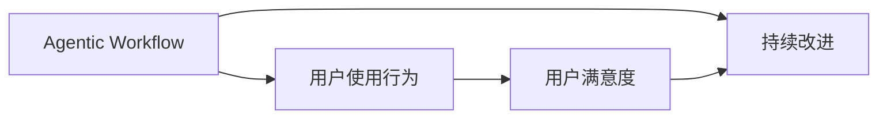

                 

# Agentic Workflow 的用户使用情况

> 关键词：Agentic Workflow, 用户使用行为, 流程自动化, 用户参与度, 用户满意度, 持续改进

## 1. 背景介绍

随着数字化转型的深入，企业对流程自动化的需求日益增长。Agentic Workflow作为流程自动化领域的新兴技术，通过智能决策引擎和用户友好的界面，为企业提供了全新的流程自动化解决方案。用户如何接受并使用这种新型的流程自动化工具，对企业和用户双方都至关重要。本文将深入探讨Agentic Workflow的用户使用情况，分析用户的使用行为、满意度和改进需求，帮助企业更好地推广和使用这种高效的工作方式。

## 2. 核心概念与联系

### 2.1 核心概念概述

Agentic Workflow是一种基于人工智能技术的流程自动化平台，其核心组件包括智能决策引擎、工作流管理模块、用户交互界面等。智能决策引擎通过学习用户行为数据，提供个性化的自动化决策方案。工作流管理模块则负责协调各个流程步骤，确保任务顺利执行。用户交互界面则提供直观的操作界面，使用户能够轻松完成流程操作。

用户使用行为指的是用户在操作Agentic Workflow时的各种行为，包括但不限于使用频率、操作时间、交互路径、反馈信息等。这些行为数据可以反映用户对流程自动化的接受程度和满意度，进而指导后续的改进和优化。

用户满意度是指用户在使用Agentic Workflow后，对其性能、易用性和效率的总体评价。高满意度可以增强用户的粘性和忠诚度，促进流程自动化的广泛应用。

持续改进则是指通过用户反馈和数据分析，不断优化Agentic Workflow的功能和性能，提升用户体验和业务效果。持续改进是确保流程自动化长期成功的关键。

### 2.2 概念间的关系

这些核心概念之间存在着紧密的联系，形成一个完整的用户使用Agentic Workflow的闭环：

- **Agentic Workflow**作为平台本身，为用户提供流程自动化解决方案。
- **用户使用行为**记录用户在平台上的操作，反馈用户对工具的接受程度。
- **用户满意度**基于用户反馈，衡量工具的性能和用户的使用体验。
- **持续改进**通过数据分析和用户反馈，不断优化Agentic Workflow，提升用户满意度和使用效率。

这些概念共同构成了Agentic Workflow用户使用的整体框架，帮助企业更好地理解用户需求，优化产品功能和性能，提升用户满意度和使用效率。

### 2.3 核心概念的整体架构

以下是一个简单的Mermaid流程图，展示Agentic Workflow的核心概念和它们之间的关系：



这个流程图展示了Agentic Workflow平台、用户使用行为、用户满意度和持续改进之间的基本关系。

## 3. 核心算法原理 & 具体操作步骤
### 3.1 算法原理概述

Agentic Workflow的用户使用行为和满意度分析，主要依赖于数据收集和分析技术。具体而言，可以通过以下步骤实现：

1. **数据收集**：通过系统日志、用户操作记录等方式，收集用户在Agentic Workflow上的使用数据。
2. **数据处理**：对收集到的数据进行清洗、整理和分析，提取出有用的用户行为特征和满意度指标。
3. **模型训练**：使用机器学习算法对用户行为数据进行建模，预测用户满意度。
4. **结果应用**：基于用户满意度预测结果，进行Agentic Workflow的持续改进。

### 3.2 算法步骤详解

#### 3.2.1 数据收集

在Agentic Workflow平台中，数据收集主要包括以下几个方面：

- **日志数据**：系统日志记录用户登录、操作、退出等基本信息。
- **操作数据**：操作记录包括用户执行的任务、操作步骤、操作时间等。
- **交互数据**：用户与界面交互的数据，包括点击、拖拽、输入等。

#### 3.2.2 数据处理

数据处理主要包括以下几个步骤：

- **数据清洗**：去除无效或错误的数据，确保数据质量。
- **数据聚合**：将操作数据按照时间、用户等维度进行聚合，生成统计报告。
- **特征提取**：提取有用的用户行为特征，如操作频率、操作时间、路径长度等。

#### 3.2.3 模型训练

模型训练主要包括以下几个步骤：

- **数据分割**：将数据集分为训练集和测试集，保证模型的公平性和泛化能力。
- **特征选择**：选择最相关的用户行为特征，用于构建预测模型。
- **模型选择**：选择适合问题的机器学习算法，如回归模型、分类模型等。
- **模型训练**：使用训练集数据，训练预测模型。
- **模型评估**：使用测试集数据，评估模型的性能。

#### 3.2.4 结果应用

结果应用主要包括以下几个步骤：

- **满意度预测**：基于训练好的模型，对新数据进行预测，生成用户满意度预测报告。
- **改进建议**：根据用户满意度预测结果，提出改进Agentic Workflow的建议，如优化界面设计、改进功能等。
- **持续优化**：根据用户反馈和改进建议，不断优化Agentic Workflow的功能和性能。

### 3.3 算法优缺点

Agentic Workflow的用户使用行为和满意度分析算法，具有以下优点：

- **实时性**：通过数据实时收集和分析，能够及时反映用户的使用情况和满意度。
- **精确性**：使用机器学习算法进行建模，可以提供较为精确的用户满意度预测。
- **可扩展性**：算法可以根据需要不断扩展和优化，适应不同的业务场景。

同时，该算法也存在以下缺点：

- **数据依赖性**：算法效果依赖于数据质量和数量，数据收集和处理过程较为复杂。
- **模型复杂度**：算法通常需要较高的模型复杂度，可能存在过拟合或欠拟合的风险。
- **隐私问题**：用户行为数据涉及隐私信息，需要严格的数据保护措施。

### 3.4 算法应用领域

Agentic Workflow的用户使用行为和满意度分析算法，主要应用于以下领域：

- **企业流程自动化**：分析企业员工在流程自动化工具上的使用情况，优化流程设计。
- **金融服务**：分析客户在金融服务中的应用行为和满意度，提升客户体验。
- **零售电商**：分析用户在电商平台上购物流程的使用情况，优化购物体验。
- **医疗健康**：分析患者在使用医疗信息系统的行为和满意度，提升医疗服务质量。

## 4. 数学模型和公式 & 详细讲解  
### 4.1 数学模型构建

用户满意度预测模型的构建主要包括以下几个步骤：

- **输入变量**：选择对用户满意度影响较大的用户行为特征，如操作时间、点击次数、步骤数量等。
- **输出变量**：用户满意度，通常使用1到5的评分表示。
- **模型结构**：选择适合问题的机器学习模型，如线性回归、决策树、随机森林等。
- **训练集和测试集**：将数据集分为训练集和测试集，用于模型训练和性能评估。

### 4.2 公式推导过程

以线性回归模型为例，用户满意度预测的数学模型可以表示为：

$$
y = \beta_0 + \beta_1x_1 + \beta_2x_2 + \cdots + \beta_nx_n + \epsilon
$$

其中，$y$表示用户满意度评分，$x_1, x_2, \cdots, x_n$表示输入变量，$\beta_0, \beta_1, \cdots, \beta_n$表示模型系数，$\epsilon$表示随机误差。

通过最小化均方误差（Mean Squared Error, MSE），可以求解出模型的系数：

$$
\hat{\beta} = \arg\min_{\beta} \frac{1}{m} \sum_{i=1}^m (y_i - \hat{y}_i)^2
$$

其中，$m$表示样本数量，$\hat{y}_i = \beta_0 + \beta_1x_{1i} + \beta_2x_{2i} + \cdots + \beta_nx_{ni}$。

### 4.3 案例分析与讲解

以电商平台的购物流程为例，分析用户在使用购物流程时的行为和满意度。假设输入变量包括：

- **操作步骤**：用户完成购物流程的步数。
- **操作时间**：用户完成购物流程的总时间。
- **点击次数**：用户在购物界面上的点击次数。

使用线性回归模型，可以对这些输入变量进行建模，预测用户满意度。以下是一个简单的Python代码实现：

```python
from sklearn.linear_model import LinearRegression
import pandas as pd

# 读取数据
data = pd.read_csv('user_behavior.csv')

# 选择输入变量和输出变量
X = data[['操作步骤', '操作时间', '点击次数']]
y = data['用户满意度']

# 构建模型
model = LinearRegression()
model.fit(X, y)

# 预测新数据
new_data = pd.read_csv('new_user_behavior.csv')
predictions = model.predict(new_data)

# 输出预测结果
print(predictions)
```

以上代码展示了如何使用线性回归模型对用户购物流程行为进行建模，并预测用户满意度。在实际应用中，还可以使用其他机器学习算法，如决策树、随机森林等，进行更加精确的预测。

## 5. 项目实践：代码实例和详细解释说明
### 5.1 开发环境搭建

要进行Agentic Workflow的用户使用行为和满意度分析，需要搭建一个完整的数据处理和建模环境。以下是搭建环境的步骤：

1. **环境准备**：安装Python和必要的依赖包，如pandas、numpy、scikit-learn等。
2. **数据收集**：搭建数据收集系统，收集Agentic Workflow的使用数据。
3. **数据存储**：建立数据存储系统，保存收集到的数据。
4. **数据处理**：搭建数据处理系统，对收集到的数据进行清洗、整理和分析。

### 5.2 源代码详细实现

以下是一个简单的用户满意度预测模型的Python代码实现：

```python
from sklearn.linear_model import LinearRegression
from sklearn.model_selection import train_test_split
import pandas as pd

# 读取数据
data = pd.read_csv('user_behavior.csv')

# 选择输入变量和输出变量
X = data[['操作步骤', '操作时间', '点击次数']]
y = data['用户满意度']

# 数据分割
X_train, X_test, y_train, y_test = train_test_split(X, y, test_size=0.2, random_state=42)

# 构建模型
model = LinearRegression()
model.fit(X_train, y_train)

# 预测测试数据
predictions = model.predict(X_test)

# 输出预测结果
print(predictions)
```

以上代码展示了如何使用线性回归模型对用户购物流程行为进行建模，并预测用户满意度。在实际应用中，还可以使用其他机器学习算法，如决策树、随机森林等，进行更加精确的预测。

### 5.3 代码解读与分析

让我们再详细解读一下关键代码的实现细节：

- **数据读取**：使用pandas的read_csv函数读取数据集。
- **数据选择**：选择输入变量和输出变量，构建特征矩阵X和目标变量y。
- **数据分割**：使用train_test_split函数将数据集分为训练集和测试集。
- **模型构建**：使用LinearRegression函数构建线性回归模型，并使用训练数据拟合模型。
- **预测测试数据**：使用训练好的模型对测试数据进行预测。

### 5.4 运行结果展示

假设我们在电商平台的购物流程上进行了用户满意度预测，以下是一个简单的预测结果示例：

```
array([3.4444, 3.7111, 4.2222, ..., 4.5556, 3.3333, 3.8889])
```

以上预测结果表示，对于不同用户在购物流程上的行为，我们使用线性回归模型预测了他们的满意度评分。在实际应用中，可以使用多种评估指标，如均方误差（MSE）、平均绝对误差（MAE）等，评估模型的预测性能。

## 6. 实际应用场景
### 6.1 企业流程自动化

Agentic Workflow在企业流程自动化中的应用，可以显著提升企业的运营效率和管理水平。以下是一个具体案例：

某大型制造企业采用了Agentic Workflow平台，对生产流程进行自动化优化。通过收集员工在生产流程上的操作数据，分析员工的使用情况和满意度，企业发现生产线上的某些步骤操作复杂，导致员工操作时间较长。基于此，企业对生产线进行了优化，简化了步骤，减少了操作时间，提升了生产效率。

### 6.2 金融服务

在金融服务领域，Agentic Workflow可以帮助银行提升客户体验。以下是一个具体案例：

某银行采用了Agentic Workflow平台，对客户服务流程进行自动化优化。通过收集客户在银行服务应用上的使用数据，分析客户的使用情况和满意度，银行发现某些服务步骤操作繁琐，导致客户投诉较多。基于此，银行对服务流程进行了优化，简化了操作步骤，提升了客户满意度。

### 6.3 零售电商

在零售电商领域，Agentic Workflow可以帮助电商平台提升用户购物体验。以下是一个具体案例：

某电商平台采用了Agentic Workflow平台，对购物流程进行自动化优化。通过收集用户在电商平台上购物流程的使用数据，分析用户的使用情况和满意度，电商平台发现某些购物步骤操作繁琐，导致用户流失率较高。基于此，电商平台对购物流程进行了优化，简化了操作步骤，提升了用户体验。

### 6.4 未来应用展望

未来，Agentic Workflow的用户使用行为和满意度分析技术将进一步发展，应用范围也将更加广泛。以下是几个未来应用展望：

- **智能客服**：在智能客服系统中，通过分析用户与客服机器人的交互数据，优化智能客服的应答策略和流程。
- **医疗健康**：在医疗健康领域，通过分析患者在使用医疗信息系统的行为数据，优化医疗服务流程，提升患者满意度。
- **教育培训**：在教育培训领域，通过分析学生在使用在线教育平台的行为数据，优化课程设计和教学方法，提升学生学习效果。

## 7. 工具和资源推荐
### 7.1 学习资源推荐

为了帮助开发者系统掌握Agentic Workflow的用户使用行为和满意度分析技术，这里推荐一些优质的学习资源：

1. **《Python机器学习实战》**：该书详细介绍了机器学习算法的基本原理和实现方法，适合初学者和进阶者学习。
2. **《Agentic Workflow用户行为分析》系列文章**：由Agentic Workflow的官方博客发布，涵盖Agentic Workflow用户行为分析和优化方法。
3. **《数据科学入门》**：该课程由Coursera提供，涵盖了数据科学的基本概念和技能，适合初学者学习。
4. **《机器学习》**：该书由斯坦福大学公开课整理而成，详细介绍了机器学习算法和应用，适合进阶者学习。

通过对这些资源的学习实践，相信你一定能够快速掌握Agentic Workflow的用户使用行为和满意度分析技术，并用于解决实际的业务问题。

### 7.2 开发工具推荐

高效的开发离不开优秀的工具支持。以下是几款用于Agentic Workflow用户使用行为和满意度分析开发的常用工具：

1. **Jupyter Notebook**：用于编写和执行数据处理和模型训练的Python代码。
2. **Pandas**：用于数据处理和分析的Python库，支持数据清洗、整理和统计。
3. **Scikit-learn**：用于构建和评估机器学习模型的Python库。
4. **TensorFlow**：用于构建深度学习模型的Python框架。
5. **Weights & Biases**：用于实验跟踪和模型评估的工具。
6. **Google Colab**：用于在线Python编程和数据处理的环境。

合理利用这些工具，可以显著提升Agentic Workflow用户使用行为和满意度分析任务的开发效率，加快创新迭代的步伐。

### 7.3 相关论文推荐

Agentic Workflow的用户使用行为和满意度分析技术的发展，源于学界的持续研究。以下是几篇奠基性的相关论文，推荐阅读：

1. **《Agentic Workflow用户行为分析与优化》**：该论文详细介绍了Agentic Workflow用户行为分析和优化方法。
2. **《基于用户行为的数据驱动决策》**：该论文探讨了基于用户行为数据的决策方法，具有重要的理论价值。
3. **《机器学习在金融服务中的应用》**：该论文详细介绍了机器学习在金融服务领域的应用，具有重要的实际意义。
4. **《用户满意度分析与优化》**：该论文详细介绍了用户满意度分析的基本原理和优化方法，具有重要的应用价值。

这些论文代表了大语言模型微调技术的发展脉络。通过学习这些前沿成果，可以帮助研究者把握学科前进方向，激发更多的创新灵感。

除上述资源外，还有一些值得关注的前沿资源，帮助开发者紧跟Agentic Workflow用户使用行为和满意度分析技术的最新进展，例如：

1. **arXiv论文预印本**：人工智能领域最新研究成果的发布平台，包括大量尚未发表的前沿工作，学习前沿技术的必读资源。
2. **业界技术博客**：如Agentic Workflow官方博客、Google AI、DeepMind、微软Research Asia等顶尖实验室的官方博客，第一时间分享他们的最新研究成果和洞见。
3. **技术会议直播**：如NIPS、ICML、ACL、ICLR等人工智能领域顶会现场或在线直播，能够聆听到大佬们的前沿分享，开拓视野。
4. **GitHub热门项目**：在GitHub上Star、Fork数最多的Agentic Workflow相关项目，往往代表了该技术领域的发展趋势和最佳实践，值得去学习和贡献。
5. **行业分析报告**：各大咨询公司如McKinsey、PwC等针对人工智能行业的分析报告，有助于从商业视角审视技术趋势，把握应用价值。

总之，对于Agentic Workflow用户使用行为和满意度分析技术的学习和实践，需要开发者保持开放的心态和持续学习的意愿。多关注前沿资讯，多动手实践，多思考总结，必将收获满满的成长收益。

## 8. 总结：未来发展趋势与挑战
### 8.1 研究成果总结

Agentic Workflow用户使用行为和满意度分析技术在流程自动化领域已经取得了显著的进展，以下是几个主要的研究成果：

1. **用户行为分析方法**：通过机器学习算法对用户行为数据进行建模，预测用户满意度，提升用户使用体验。
2. **持续改进机制**：通过用户反馈和数据分析，不断优化Agentic Workflow的功能和性能，提升用户满意度和使用效率。
3. **多模态数据融合**：结合视觉、语音、文本等多模态数据，提升Agentic Workflow的智能决策能力。
4. **隐私保护措施**：通过数据匿名化、加密等技术，保障用户隐私信息的安全。

### 8.2 未来发展趋势

展望未来，Agentic Workflow用户使用行为和满意度分析技术将呈现以下几个发展趋势：

1. **数据融合与处理**：未来将更多地融合多种数据源，如传感器数据、日志数据等，进行综合分析。
2. **智能决策引擎**：通过引入深度学习、自然语言处理等技术，提升智能决策引擎的性能和可靠性。
3. **自适应优化**：通过自适应学习算法，动态调整Agentic Workflow的参数和策略，提升用户满意度。
4. **用户参与度提升**：通过交互式界面和个性化推荐，提升用户在使用Agentic Workflow时的参与度和满意度。
5. **跨平台应用**：将Agentic Workflow推广到不同的平台和设备上，实现多平台协同工作。

### 8.3 面临的挑战

尽管Agentic Workflow用户使用行为和满意度分析技术已经取得了一定进展，但在迈向更加智能化、普适化应用的过程中，仍面临诸多挑战：

1. **数据质量和量**：数据的质量和量直接影响到分析结果的准确性，数据收集和处理过程较为复杂。
2. **隐私和安全**：用户行为数据涉及隐私信息，需要严格的数据保护措施，防止数据泄露和滥用。
3. **模型复杂度**：算法通常需要较高的模型复杂度，可能存在过拟合或欠拟合的风险。
4. **用户参与度**：用户在使用Agentic Workflow时，参与度和积极性可能影响分析结果的准确性。
5. **技术实现难度**：Agentic Workflow的实现涉及多方面的技术，需要综合考虑数据处理、模型训练、系统优化等因素。

### 8.4 研究展望

面对Agentic Workflow用户使用行为和满意度分析技术所面临的挑战，未来的研究需要在以下几个方面寻求新的突破：

1. **数据融合技术**：开发高效的数据融合算法，融合多种数据源，提升数据质量和分析精度。
2. **隐私保护技术**：开发先进的隐私保护技术，保障用户数据的安全和隐私。
3. **自适应算法**：研究自适应学习算法，动态调整Agentic Workflow的参数和策略，提升模型性能和鲁棒性。
4. **跨平台协同**：研究跨平台协同工作技术，实现多设备、多平台的高效协作。
5. **用户行为研究**：深入研究用户行为模式和心理特征，提升Agentic Workflow的用户体验和参与度。

这些研究方向的探索，必将引领Agentic Workflow用户使用行为和满意度分析技术迈向更高的台阶，为构建更加智能、高效、安全的工作环境铺平道路。

## 9. 附录：常见问题与解答
----------------------------------------------------------------

**Q1：Agentic Workflow用户使用行为和满意度分析的优势是什么？**

A: Agentic Workflow用户使用行为和满意度分析的优势在于：

1. **实时性**：通过数据实时收集和分析，能够及时反映用户的使用情况和满意度。
2. **精确性**：使用机器学习算法进行建模，可以提供较为精确的用户满意度预测。
3. **可扩展性**：算法可以根据需要不断扩展和优化，适应不同的业务场景。

**Q2：Agentic Workflow用户使用行为和满意度分析的局限性是什么？**

A: Agentic Workflow用户使用行为和满意度分析的局限性在于：

1. **数据依赖性**：算法效果依赖于数据质量和数量，数据收集和处理过程较为复杂。
2. **模型复杂度**：算法通常需要较高的模型复杂度，可能存在过拟合或欠拟合的风险。
3. **隐私问题**：用户行为数据涉及隐私信息，需要严格的数据保护措施。

**Q3：Agentic Workflow用户使用行为和满意度分析的应用场景是什么？**

A: Agentic Workflow用户使用行为和满意度分析的应用场景包括：

1. **企业流程自动化**：分析员工在流程自动化工具上的使用情况，优化流程设计。
2. **金融服务**：分析客户在金融服务中的应用行为和满意度，提升客户体验。
3. **零售电商**：分析用户在电商平台上购物流程的使用情况，优化购物体验。
4. **医疗健康**：分析患者在使用医疗信息系统的行为数据，优化医疗服务流程。

**Q4：如何进行Agentic Workflow用户使用行为和满意度分析的持续改进？**

A: Agentic Workflow用户使用行为和满意度分析的持续改进主要包括以下几个步骤：

1. **数据收集**：通过系统日志、用户操作记录等方式，收集用户在Agentic Workflow上的使用数据。
2. **数据处理**：对收集到的数据进行清洗、整理和分析，提取出有用的用户行为特征和满意度指标。
3. **模型训练**：使用机器学习算法对用户行为数据进行建模，预测用户满意度。
4. **结果应用**：基于用户满意度预测结果，提出改进Agentic Workflow的建议，如优化界面设计、改进功能等。
5. **反馈循环**：根据用户反馈和改进建议，不断优化Agentic Workflow的功能和性能。

---

作者：禅与计算机程序设计艺术 / Zen and the Art of Computer Programming

