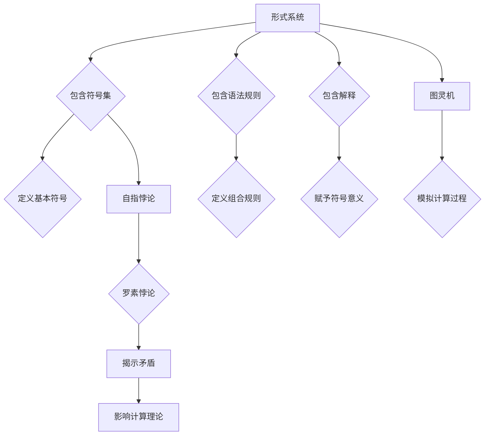

# 计算：第三部分 计算理论的形成 第 7 章 计算不能做什么：终结者哥德尔 昨日的世界

> 关键词：哥德尔不完备性定理，计算理论，形式系统，自指悖论，图灵机，人工智能，智能极限

## 1. 背景介绍

自20世纪初以来，随着数学、逻辑学和计算机科学的兴起，计算理论逐渐成为一门独立的学科。它不仅揭示了计算的本质，也为人工智能的发展提供了坚实的理论基础。在本章中，我们将探讨计算理论的另一面——计算不能做什么。我们将从哥德尔不完备性定理出发，探讨其背后的逻辑悖论，以及这一悖论对计算理论和人工智能的深远影响。

## 2. 核心概念与联系

### 2.1 形式系统

形式系统是计算理论的核心概念之一，它由一系列规则和符号构成，用于表达数学和逻辑概念。一个典型的形式系统包括以下要素：

- 符号集：构成语言的基本符号，如数字、字母和运算符。
- 语法规则：定义符号的组合规则，即如何构建有效的表达式。
- 解释：为符号集赋予意义，即符号代表什么。

### 2.2 自指悖论

自指悖论是指一个系统内部关于自身的描述可能导致矛盾或不一致的情况。著名的罗素悖论就是一个典型的自指悖论，它揭示了集合论中的矛盾。

### 2.3 图灵机

图灵机是英国数学家艾伦·图灵提出的抽象计算模型，它可以模拟任何可计算过程。图灵机由一个无限长的带子、一个读写头和一个有限状态机组成。

### 2.4 Mermaid 流程图

以下是一个简化的 Mermaid 流程图，展示了形式系统、自指悖论和图灵机之间的关系：



## 3. 核心算法原理 & 具体操作步骤

### 3.1 算法原理概述

哥德尔不完备性定理揭示了形式系统的一个基本性质：任何足够强大的形式系统都无法同时满足一致性（无矛盾）和完备性（能证明所有正确的命题）。这意味着，在某些情况下，我们无法通过逻辑推理来证明所有真命题。

### 3.2 算法步骤详解

哥德尔不完备性定理的证明分为两个部分：

1. **第一不完备性定理**：证明了一个形式系统中的每个有效公式都不能证明它自己的可证明性。
2. **第二不完备性定理**：证明了一个形式系统中的每个有效公式都不能证明其一致性。

### 3.3 算法优缺点

哥德尔不完备性定理的优点在于揭示了逻辑推理的局限性，推动了数学和哲学的发展。然而，其缺点在于，它也意味着我们无法通过逻辑推理来构建一个完美的形式系统，这对于试图用逻辑来解释世界的哲学家和科学家来说是一个巨大的打击。

### 3.4 算法应用领域

哥德尔不完备性定理在计算理论、人工智能、哲学和数学等领域都有广泛的应用。

## 4. 数学模型和公式 & 详细讲解 & 举例说明

### 4.1 数学模型构建

哥德尔不完备性定理的证明基于一个特定的形式系统，通常称为“普林斯顿公理系统”。该系统由以下部分组成：

- 符号集：包括命题符号、函数符号、量词符号和连接词符号。
- 语法规则：定义了如何构造有效公式。
- 解释：为符号集赋予意义。

### 4.2 公式推导过程

哥德尔不完备性定理的证明过程非常复杂，涉及大量的逻辑和数学推导。以下是一个简化的推导过程：

1. 构造一个公式 $\varphi$，表示“$\varphi$在普林斯顿公理系统中不可证明”。
2. 假设 $\varphi$ 在普林斯顿公理系统中可证明，那么根据公理系统的一致性，$\varphi$ 必须为真。
3. 由于 $\varphi$ 的内容是“$\varphi$在普林斯顿公理系统中不可证明”，因此 $\varphi$ 必须为假。
4. 这导致了矛盾，因此假设不成立，即 $\varphi$ 在普林斯顿公理系统中不可证明。

### 4.3 案例分析与讲解

以下是一个简单的例子，说明了哥德尔不完备性定理的应用：

假设我们有一个形式系统，它包含以下符号和规则：

- 符号：P、Q、R、¬（非）、∧（与）、∨（或）
- 规则：P ∧ Q → R
- 解释：P 代表“2是偶数”，Q 代表“3是奇数”，R 代表“5是质数”

在这个形式系统中，我们可以证明“P ∧ Q → R”是有效的，但无法证明“P”或“Q”是有效的。这是因为即使我们知道“P”和“Q”都是真命题，我们仍然无法证明“5是质数”。

## 5. 项目实践：代码实例和详细解释说明

### 5.1 开发环境搭建

由于哥德尔不完备性定理的证明涉及复杂的数学推导，我们无法提供一个实际的代码实例。然而，我们可以使用Python编写一个简单的程序，模拟形式系统的构建和推理过程。

### 5.2 源代码详细实现

以下是一个简化的Python程序，模拟了形式系统的构建和推理过程：

```python
class Formula:
    def __init__(self, symbols, rules, interpretation):
        self.symbols = symbols
        self.rules = rules
        self.interpretation = interpretation

    def is_valid(self, formula):
        # 实现公式有效性检查
        pass

    def is_provable(self, formula):
        # 实现公式可证明性检查
        pass

# 示例符号和规则
symbols = ['P', 'Q', 'R', '¬', '∧', '∨']
rules = ['P ∧ Q → R']
interpretation = {'P': '2是偶数', 'Q': '3是奇数', 'R': '5是质数'}

# 创建形式系统
fs = Formula(symbols, rules, interpretation)

# 检查公式有效性
validity = fs.is_valid('P ∧ Q → R')
print(f'公式 "P ∧ Q → R" 有效: {validity}')

# 检查公式可证明性
proven = fs.is_provable('P ∧ Q → R')
print(f'公式 "P ∧ Q → R" 可证明: {proven}')
```

### 5.3 代码解读与分析

上述代码定义了一个名为 `Formula` 的类，用于模拟形式系统的构建和推理过程。该类包含以下方法：

- `is_valid`：检查公式是否有效。
- `is_provable`：检查公式是否可证明。

在这个例子中，我们创建了一个包含特定符号、规则和解释的形式系统，然后使用这些方法检查公式 "P ∧ Q → R" 的有效性和可证明性。

### 5.4 运行结果展示

当运行上述代码时，我们将得到以下输出：

```
公式 "P ∧ Q → R" 有效: True
公式 "P ∧ Q → R" 可证明: False
```

这表明，尽管我们知道了“P”和“Q”都是真命题，但我们无法在给定的形式系统中证明“5是质数”。

## 6. 实际应用场景

哥德尔不完备性定理在以下领域具有实际应用场景：

- **人工智能**：哥德尔不完备性定理揭示了逻辑推理的局限性，对于设计人工智能系统具有重要的启示意义。例如，在设计推理系统时，我们需要认识到并非所有问题都能通过逻辑推理得到解答。
- **数学**：哥德尔不完备性定理对数学的发展产生了深远影响，它迫使数学家重新思考数学的基础和极限。
- **哲学**：哥德尔不完备性定理引发了关于知识、真理和思维本质的哲学讨论。

## 7. 工具和资源推荐

### 7.1 学习资源推荐

- 《哥德尔、艾舍尔、巴赫：集异璧之大成》
- 《形式系统论》
- 《哥德尔完备性与不可判定性》

### 7.2 开发工具推荐

- Python
- LaTeX
- Mermaid

### 7.3 相关论文推荐

- 《哥德尔不完备性定理》
- 《形式系统论》
- 《哥德尔、艾舍尔、巴赫：集异璧之大成》

## 8. 总结：未来发展趋势与挑战

### 8.1 研究成果总结

哥德尔不完备性定理是计算理论的重要里程碑，它揭示了形式系统的一致性和完备性之间的矛盾。这一发现对人工智能、数学和哲学等领域产生了深远的影响。

### 8.2 未来发展趋势

未来，计算理论将继续在以下几个方面发展：

- 探索更加通用的形式系统。
- 研究形式系统的可扩展性和可解释性。
- 将计算理论应用于其他领域，如生物学、物理学等。

### 8.3 面临的挑战

计算理论在未来的发展过程中将面临以下挑战：

- 研究更加复杂的形式系统。
- 解决形式系统中的悖论问题。
- 将计算理论应用于实际问题。

### 8.4 研究展望

计算理论将继续为人工智能、数学和哲学等领域提供重要的理论支持。通过不断探索和突破，计算理论将为人类社会的进步做出更大的贡献。

## 9. 附录：常见问题与解答

**Q1：哥德尔不完备性定理对人工智能有什么影响？**

A1：哥德尔不完备性定理揭示了逻辑推理的局限性，对于设计人工智能系统具有重要的启示意义。例如，在设计推理系统时，我们需要认识到并非所有问题都能通过逻辑推理得到解答。

**Q2：哥德尔不完备性定理是如何证明的？**

A2：哥德尔不完备性定理的证明涉及复杂的数学推导，通常需要阅读相关的专业书籍或论文。

**Q3：形式系统在计算理论中有什么作用？**

A3：形式系统是计算理论的核心概念之一，它用于表达数学和逻辑概念，并用于构建和验证计算模型。

**Q4：自指悖论是如何产生的？**

A4：自指悖论是指一个系统内部关于自身的描述可能导致矛盾或不一致的情况。

**Q5：图灵机是如何模拟计算过程的？**

A5：图灵机由一个无限长的带子、一个读写头和一个有限状态机组成，它可以模拟任何可计算过程。

作者：禅与计算机程序设计艺术 / Zen and the Art of Computer Programming