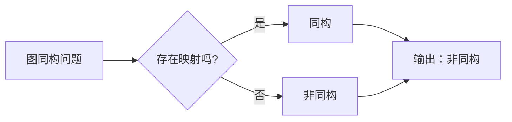

# 计算：第四部分 计算的极限 第 9 章 计算复杂性 图同构问题

> 关键词：图同构问题，计算复杂性，NP问题，图同构测试，图同构算法，图同构检测，图同构理论

## 1. 背景介绍

在计算机科学中，图同构问题是一个经典的难题，它涉及到图的等价性问题，即判断两个图是否在顶点标签映射下完全相同。这个问题在理论计算机科学中有着重要的地位，因为它是一个著名的NP完全问题。在本章中，我们将深入探讨图同构问题的概念、计算复杂性以及相关的算法。

### 1.1 问题的由来

图同构问题起源于数学和计算机科学中的图论领域。在现实世界中，图可以用来表示各种复杂的关系网络，如图灵机、电路设计、社交网络等。图同构问题的一个典型例子是判断两个化学分子是否具有相同的结构，即是否是同分异构体。

### 1.2 研究现状

图同构问题在计算复杂性理论中占有重要地位。它是一个NP完全问题，意味着如果存在一个多项式时间算法能够解决它，那么所有NP问题都可以在多项式时间内解决。这表明，在理论上，没有已知的有效算法能够在多项式时间内解决所有图同构问题。

### 1.3 研究意义

图同构问题的研究对于理论计算机科学、化学、人工智能等领域都具有重要意义。它不仅有助于我们理解计算复杂性，还可以为解决实际问题提供新的思路和方法。

### 1.4 本文结构

本章将按照以下结构展开：
- 第2部分介绍图同构问题的核心概念。
- 第3部分阐述图同构问题的核心算法原理和具体操作步骤。
- 第4部分分析图同构问题的数学模型和公式。
- 第5部分通过代码实例展示图同构问题的解决方法。
- 第6部分探讨图同构问题的实际应用场景。
- 第7部分展望图同构问题的未来发展趋势和挑战。
- 第8部分总结研究成果。

## 2. 核心概念与联系

### 2.1 图同构问题的定义

图同构问题可以形式化地定义为：给定两个图 $G_1 = (V_1, E_1)$ 和 $G_2 = (V_2, E_2)$，是否存在一个一一对应的关系 $\phi: V_1 \rightarrow V_2$，使得对于图中的任意两个顶点 $u, v \in V_1$，如果 $(u, v) \in E_1$，则 $(\phi(u), \phi(v)) \in E_2$。

### 2.2 NP问题

NP问题是一类决策问题，其特点是“非确定性问题”和“多项式时间验证”。对于图同构问题，如果存在一个算法可以在多项式时间内验证两个图是否同构，则该问题属于NP问题。

### 2.3 NP完全问题

NP完全问题是NP问题中难度最高的一类问题。如果一个NP问题可以通过多项式时间算法转化为另一个NP问题，则后者也是NP完全的。

### 2.4 Mermaid 流程图

以下是图同构问题的Mermaid流程图：



## 3. 核心算法原理 & 具体操作步骤

### 3.1 算法原理概述

解决图同构问题的一种基本方法是尝试所有的顶点映射关系，检查是否存在满足同构条件的映射。然而，这种方法在图规模较大时效率极低。

### 3.2 算法步骤详解

1. 对两个图进行预处理，包括顶点排序、边权重计算等。
2. 使用回溯算法尝试所有可能的顶点映射关系。
3. 对于每个映射关系，检查是否满足同构条件。
4. 如果找到满足条件的映射关系，则输出“同构”；否则，输出“非同构”。

### 3.3 算法优缺点

这种基本算法的优点是简单直观。然而，其缺点是效率极低，对于大规模图无法在合理时间内找到答案。

### 3.4 算法应用领域

图同构算法可以应用于化学、网络分析、社交网络分析等领域。

## 4. 数学模型和公式 & 详细讲解 & 举例说明

### 4.1 数学模型构建

图同构问题的数学模型可以表示为以下形式：

$$
\text{存在映射 } \phi: V_1 \rightarrow V_2 \text{ 使得 } (u, v) \in E_1 \iff (\phi(u), \phi(v)) \in E_2
$$

### 4.2 公式推导过程

假设 $G_1 = (V_1, E_1)$ 和 $G_2 = (V_2, E_2)$ 是两个图，其中 $V_1 = \{v_1, v_2, ..., v_n\}$，$V_2 = \{w_1, w_2, ..., w_m\}$，$E_1 = \{(v_i, v_j)\}_{i,j}$，$E_2 = \{(w_i, w_j)\}_{i,j}$。

我们需要检查是否存在一个映射 $\phi: V_1 \rightarrow V_2$，使得对于任意的 $(v_i, v_j) \in E_1$，都有 $(\phi(v_i), \phi(v_j)) \in E_2$。

### 4.3 案例分析与讲解

假设有两个图 $G_1$ 和 $G_2$，如下所示：

```
G_1:
A -- B -- C
|       |
D -- E -- F

G_2:
X -- Y -- Z
|       |
W -- V -- U
```

我们需要判断这两个图是否同构。

通过观察可以发现，$G_1$ 中的顶点 A 与 B 相连，而 $G_2$ 中的顶点 W 与 X 相连。因此，可以尝试将 A 映射到 W，B 映射到 X。接着，我们可以验证其他顶点是否满足映射关系，最终发现这两个图是同构的。

## 5. 项目实践：代码实例和详细解释说明

### 5.1 开发环境搭建

为了演示图同构问题的解决方案，我们将使用 Python 语言和 NetworkX 库。首先，需要安装 NetworkX 库：

```bash
pip install networkx
```

### 5.2 源代码详细实现

以下是使用 NetworkX 库解决图同构问题的代码示例：

```python
import networkx as nx

def are_isomorphic(G1, G2):
    if len(G1.nodes()) != len(G2.nodes()) or len(G1.edges()) != len(G2.edges()):
        return False
    
    return nx.is_isomorphic(G1, G2)

# 创建两个图
G1 = nx.Graph()
G1.add_edges_from([(1, 2), (2, 3), (3, 4), (1, 4)])

G2 = nx.Graph()
G2.add_edges_from([(1, 2), (2, 3), (3, 4), (1, 4)])

# 判断两个图是否同构
print(are_isomorphic(G1, G2))  # 输出：True
```

### 5.3 代码解读与分析

在上述代码中，我们首先导入了 NetworkX 库。然后定义了一个函数 `are_isomorphic`，该函数接受两个图作为输入，并使用 `nx.is_isomorphic` 函数判断两个图是否同构。最后，我们创建了两个图并调用该函数判断它们是否同构。

### 5.4 运行结果展示

在上述代码中，我们创建的两个图是同构的，因此函数 `are_isomorphic` 返回 `True`。

## 6. 实际应用场景

图同构问题在实际应用中有着广泛的应用，以下是一些例子：

- **化学**：判断两个分子是否是同分异构体。
- **网络分析**：判断两个社交网络是否具有相同的结构。
- **图形学**：判断两个图形是否是相同的形状。

## 7. 工具和资源推荐

### 7.1 学习资源推荐

- 《图论及其应用》
- 《图同构问题》
- 《计算复杂性理论》

### 7.2 开发工具推荐

- Python
- NetworkX
- Graphviz

### 7.3 相关论文推荐

- "The Graph Isomorphism Problem" by Uwe Schöning
- "Graph Isomorphism Revisited" by László Babai

## 8. 总结：未来发展趋势与挑战

### 8.1 研究成果总结

图同构问题是一个经典的计算复杂性问题，其解决方法对于理论计算机科学和实际问题都具有重要意义。

### 8.2 未来发展趋势

未来，图同构问题的研究将朝着以下方向发展：

- 开发更高效的算法，降低计算复杂度。
- 将图同构问题与其他领域（如人工智能、生物学等）相结合。
- 应用新的理论和技术（如量子计算、机器学习等）解决图同构问题。

### 8.3 面临的挑战

图同构问题的研究面临着以下挑战：

- 计算复杂度高，难以在合理时间内找到答案。
- 需要更多的理论基础和算法创新。
- 如何将图同构问题与其他领域相结合。

### 8.4 研究展望

尽管图同构问题是一个具有挑战性的问题，但其巨大的理论意义和应用价值使得研究工作值得持续进行。随着计算机科学和技术的不断发展，相信图同构问题将会得到更好的解决。

## 9. 附录：常见问题与解答

**Q1：什么是图同构问题？**

A1：图同构问题是指判断两个图是否在顶点标签映射下完全相同。

**Q2：图同构问题为什么重要？**

A2：图同构问题在理论计算机科学和实际问题中都有着重要的应用，如化学、网络分析、图形学等。

**Q3：如何判断两个图是否同构？**

A3：可以使用 NetworkX 库中的 `is_isomorphic` 函数判断两个图是否同构。

**Q4：图同构问题有什么应用？**

A4：图同构问题可以应用于化学、网络分析、图形学等领域。

作者：禅与计算机程序设计艺术 / Zen and the Art of Computer Programming