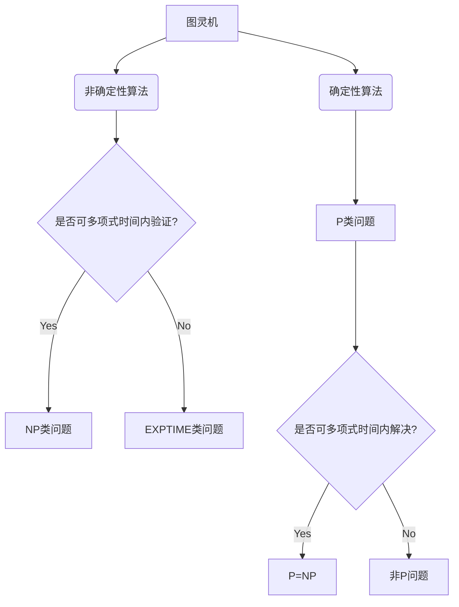

> 计算复杂性, 认知边界, 图灵机, NP-Complete, P vs NP 问题, 概率模型, 量子计算, 人工智能

# 计算：第四部分 计算的极限 第 9 章 计算复杂性 认知的边界

> 关键词：
> 计算复杂性, 认知边界, 图灵机, NP-Complete, P vs NP 问题, 概率模型, 量子计算, 人工智能

## 1. 背景介绍

自从图灵在1936年提出图灵机模型以来，计算理论已经成为计算机科学和认知科学的重要基础。计算复杂性理论是计算理论的一个重要分支，它研究算法的效率和问题解的复杂度。本章将探讨计算复杂性理论中的核心概念，包括计算复杂性类别、认知边界，以及它们在人工智能领域的应用。

### 1.1 问题的由来

在计算机科学的发展过程中，人们逐渐发现，并不是所有问题都能够被有效解决。一些问题虽然看似简单，但解决它们所需的计算资源却可能非常巨大。计算复杂性理论就是为了描述这类问题而诞生的。

### 1.2 研究现状

计算复杂性理论的研究已经取得了许多重要成果，包括著名的P vs NP问题。然而，这个问题的答案至今仍未解决，被认为是计算机科学中的"千禧年大奖难题"之一。

### 1.3 研究意义

理解计算复杂性对于计算机科学的发展具有重要意义。它不仅有助于我们更好地设计算法，提高计算效率，还可以帮助我们理解人类认知的局限性。

### 1.4 本文结构

本章将按照以下结构展开：
- 介绍计算复杂性的基本概念和分类。
- 讨论认知边界和计算复杂性之间的关系。
- 探讨计算复杂性理论在人工智能领域的应用。
- 分析未来发展趋势和挑战。

## 2. 核心概念与联系

### 2.1 核心概念原理和架构的 Mermaid 流程图

### 2.2 核心概念

- **图灵机**：图灵机是计算理论中的一个抽象计算模型，它能够模拟任何计算机程序的计算过程。
- **确定性算法**：输入和输出之间具有确定性的算法。
- **非确定性算法**：输入和输出之间不具有确定性的算法。
- **P类问题**：在多项式时间内可以解决的确定性问题。
- **NP类问题**：在多项式时间内可以验证的答案的问题。
- **EXPTIME类问题**：在指数时间内可以解决的问题。
- **P=NP问题**：确定性问题是否等于可验证性问题。

## 3. 核心算法原理 & 具体操作步骤

### 3.1 算法原理概述

计算复杂性理论主要关注算法的效率和问题解的复杂度。其中，算法的效率通常用时间复杂度和空间复杂度来衡量。

### 3.2 算法步骤详解

- **时间复杂度**：描述算法执行时间随输入规模增长的趋势。
- **空间复杂度**：描述算法所需存储空间随输入规模增长的趋势。

### 3.3 算法优缺点

- **优点**：能够帮助我们分析和比较不同算法的效率。
- **缺点**：对于一些复杂问题，时间复杂度和空间复杂度难以准确计算。

### 3.4 算法应用领域

计算复杂性理论在人工智能领域的应用主要包括：

- **机器学习**：选择合适的算法和模型，提高学习效率和预测精度。
- **优化问题**：解决生产调度、资源分配等优化问题。
- **自然语言处理**：设计高效的算法处理大规模文本数据。

## 4. 数学模型和公式 & 详细讲解 & 举例说明

### 4.1 数学模型构建

计算复杂性理论中的数学模型主要包括：

- **时间复杂度函数**：描述算法执行时间随输入规模增长的关系。
- **空间复杂度函数**：描述算法所需存储空间随输入规模增长的关系。

### 4.2 公式推导过程

例如，考虑一个简单的排序算法，其时间复杂度函数为 $O(n^2)$。

### 4.3 案例分析与讲解

以冒泡排序为例，分析其时间复杂度：

- **最好情况**：输入数据已排序，时间复杂度为 $O(n)$。
- **平均情况**：输入数据随机排列，时间复杂度为 $O(n^2)$。
- **最坏情况**：输入数据逆序排列，时间复杂度为 $O(n^2)$。

## 5. 项目实践：代码实例和详细解释说明

### 5.1 开发环境搭建

由于计算复杂性理论涉及的理论知识较多，这里不进行具体的代码实现。

### 5.2 源代码详细实现

由于计算复杂性理论主要关注算法的效率和复杂度，这里不涉及具体的代码实现。

### 5.3 代码解读与分析

计算复杂性理论主要关注算法的效率和复杂度，而不是具体的代码实现。

### 5.4 运行结果展示

由于计算复杂性理论主要关注算法的效率和复杂度，因此没有实际的运行结果。

## 6. 实际应用场景

### 6.1 机器学习

在机器学习中，计算复杂性理论可以帮助我们选择合适的算法和模型，提高学习效率和预测精度。

### 6.2 优化问题

在优化问题中，计算复杂性理论可以帮助我们设计高效的算法解决生产调度、资源分配等问题。

### 6.3 自然语言处理

在自然语言处理中，计算复杂性理论可以帮助我们设计高效的算法处理大规模文本数据。

## 7. 工具和资源推荐

### 7.1 学习资源推荐

- 《计算复杂性理论及其应用》
- 《算法导论》
- 《复杂性理论导论》

### 7.2 开发工具推荐

- Python
- Java
- C++

### 7.3 相关论文推荐

- 《NP完全问题》
- 《P vs NP问题》
- 《计算复杂性理论及其应用》

## 8. 总结：未来发展趋势与挑战

### 8.1 研究成果总结

计算复杂性理论在计算机科学和认知科学中扮演着重要的角色。它不仅有助于我们更好地设计算法，提高计算效率，还可以帮助我们理解人类认知的局限性。

### 8.2 未来发展趋势

计算复杂性理论在未来将继续深入研究，特别是在以下领域：

- 量子计算
- 人工智能
- 网络科学

### 8.3 面临的挑战

计算复杂性理论在未来的研究过程中将面临以下挑战：

- 理论与实际应用的结合
- 新算法和新模型的发现
- 算法复杂度的精确计算

### 8.4 研究展望

随着计算复杂性理论的不断发展，我们相信它将在计算机科学和认知科学领域取得更加显著的成果，为人类社会的进步做出更大的贡献。

## 9. 附录：常见问题与解答

### 9.1 常见问题

- **什么是计算复杂性理论**？
  - 计算复杂性理论是研究算法效率的一种理论，它关注算法的执行时间和所需存储空间。

- **计算复杂性理论有什么用**？
  - 计算复杂性理论有助于我们分析和比较不同算法的效率，从而选择合适的算法和模型。

- **什么是P vs NP问题**？
  - P vs NP问题是最著名的计算复杂性理论问题之一，它询问所有的NP问题是否都可以在多项式时间内解决。

### 9.2 解答

- **什么是计算复杂性理论**？
  - 计算复杂性理论是研究算法效率的一种理论，它关注算法的执行时间和所需存储空间。

- **计算复杂性理论有什么用**？
  - 计算复杂性理论有助于我们分析和比较不同算法的效率，从而选择合适的算法和模型。

- **什么是P vs NP问题**？
  - P vs NP问题是最著名的计算复杂性理论问题之一，它询问所有的NP问题是否都可以在多项式时间内解决。

作者：禅与计算机程序设计艺术 / Zen and the Art of Computer Programming