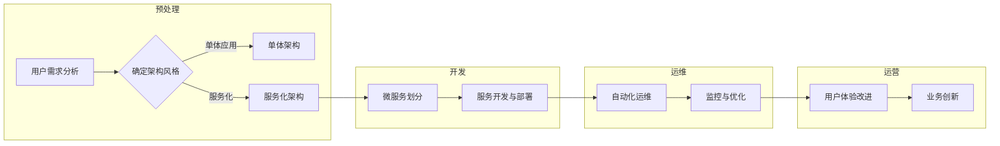

# 软件 2.0 的应用：从实验室走向现实

> 关键词：软件2.0，服务化架构，微服务，容器化，DevOps，云计算，人工智能，数字化转型

## 1. 背景介绍

随着信息技术的发展，软件行业经历了从单体应用向组件化、服务化演进的历程。如今，软件2.0时代已经来临，它标志着软件不再是孤立的应用程序，而是基于服务的集合，能够动态地适应业务需求的变化。本文将探讨软件2.0的核心概念、应用实践以及面临的挑战和未来趋势。

### 1.1 软件2.0的由来

软件2.0的概念起源于云计算和互联网技术的发展。随着云计算的普及，企业逐渐将IT基础设施转移到云端，实现了资源的按需获取和弹性伸缩。同时，互联网的快速发展使得软件应用更加注重用户体验和个性化服务。这些变化推动了软件从单体应用向服务化架构的转变。

### 1.2 软件2.0的核心特征

软件2.0具有以下核心特征：

- 服务化：软件以服务的形式提供，能够被其他系统或应用轻松调用。
- 可扩展性：软件能够根据业务需求进行弹性伸缩，以应对用户数量的变化。
- 用户体验：软件注重用户体验，提供个性化、定制化的服务。
- 开放性：软件采用开放标准和协议，便于与其他系统进行集成。
- 自动化：软件开发、部署和运维过程高度自动化，提高效率。

### 1.3 软件2.0的研究意义

研究软件2.0的应用，对于推动软件行业发展、促进企业数字化转型具有重要意义：

- 提升软件质量：服务化架构可以提高软件的可维护性和可扩展性，从而提升软件质量。
- 降低开发成本：微服务架构可以缩短开发周期，降低开发成本。
- 提高运维效率：自动化工具可以简化运维工作，提高运维效率。
- 促进业务创新：软件2.0可以更好地适应业务变化，促进企业创新。

## 2. 核心概念与联系

### 2.1 核心概念原理和架构的 Mermaid 流程图



### 2.2 核心概念之间的关系

- 用户需求分析是软件2.0开发的起点，它决定了软件架构的风格。
- 如果选择单体架构，则整个应用作为一个整体进行开发、部署和运维。
- 如果选择服务化架构，则需要将应用拆分为多个微服务，每个微服务负责特定的功能模块。
- 微服务开发与部署是软件2.0的核心工作，需要采用容器化、DevOps等新技术。
- 自动化运维可以提高运维效率，降低运维成本。
- 监控与优化可以帮助企业了解软件性能，及时发现并解决问题。
- 用户体验改进是软件2.0持续发展的关键，它推动了业务创新。

## 3. 核心算法原理 & 具体操作步骤

### 3.1 算法原理概述

软件2.0的核心算法主要涉及以下方面：

- 微服务架构设计：将单体应用拆分为多个微服务，每个微服务负责特定的功能模块。
- 容器化技术：使用Docker等容器技术实现微服务的轻量级打包和部署。
- DevOps实践：通过自动化工具实现软件开发的敏捷开发和持续集成/持续部署（CI/CD）。
- 人工智能技术：利用人工智能技术提升软件质量、优化用户体验。

### 3.2 算法步骤详解

#### 3.2.1 微服务架构设计

1. 分析用户需求，确定软件的功能模块和业务边界。
2. 根据业务边界，将应用拆分为多个微服务。
3. 设计微服务的API接口，确保服务之间的松耦合。
4. 选择合适的微服务框架，如Spring Cloud、Kubernetes等。

#### 3.2.2 容器化技术

1. 使用Docker将微服务打包成容器镜像。
2. 部署容器到容器编排平台，如Kubernetes。
3. 配置容器网络和存储，确保容器之间能够正常通信。

#### 3.2.3 DevOps实践

1. 使用CI/CD工具，如Jenkins、GitLab CI/CD等，实现自动化构建、测试和部署。
2. 使用容器镜像仓库，如Docker Hub、Harbor等，管理容器镜像。
3. 使用配置管理工具，如Ansible、Chef等，自动化配置环境。

#### 3.2.4 人工智能技术

1. 使用自然语言处理（NLP）技术提升软件质量，如代码审查、文档生成等。
2. 使用机器学习（ML）技术优化用户体验，如智能推荐、个性化设置等。

### 3.3 算法优缺点

#### 3.3.1 优点

- 提高软件质量：微服务架构和DevOps实践可以提升软件质量，降低缺陷率。
- 降低开发成本：容器化和自动化工具可以缩短开发周期，降低开发成本。
- 提高运维效率：自动化运维可以降低运维成本，提高运维效率。
- 促进业务创新：软件2.0可以更好地适应业务变化，促进企业创新。

#### 3.3.2 缺点

- 复杂性增加：服务化架构和自动化工具的使用增加了系统的复杂性。
- 学习成本高：开发者需要学习和掌握新的技术和工具。
- 网络依赖：微服务架构对网络依赖性较高，网络问题可能影响系统稳定性。

### 3.4 算法应用领域

软件2.0的应用领域广泛，包括但不限于：

- 金融行业：实现银行、保险、证券等金融机构的数字化转型。
- 互联网行业：构建高性能、可扩展的在线服务平台。
- 制造业：实现生产过程的智能化管理。
- 医疗行业：提升医疗服务质量和效率。
- 教育行业：提供个性化、定制化的在线教育服务。

## 4. 数学模型和公式 & 详细讲解 & 举例说明

### 4.1 数学模型构建

软件2.0的数学模型主要包括以下方面：

- 微服务数量与质量的关系：根据业务需求，确定合适的微服务数量。
- DevOps的效率提升模型：分析DevOps实践对软件开发效率的影响。
- 人工智能技术在软件质量提升中的应用：研究人工智能技术在代码审查、测试等方面的应用效果。

### 4.2 公式推导过程

由于软件2.0的数学模型较为复杂，以下仅以微服务数量与质量的关系为例进行说明。

假设微服务数量为 $n$，单个微服务的质量为 $q$，则整个系统的质量 $Q$ 可以表示为：

$$
Q = \frac{1}{n}\sum_{i=1}^n q_i
$$

其中，$q_i$ 表示第 $i$ 个微服务的质量。

为了提高系统质量，需要尽量减少单个微服务的质量损失。可以通过以下方法实现：

1. 减少微服务的数量，将功能模块进行合并。
2. 提高微服务的开发质量，降低缺陷率。
3. 使用自动化工具进行测试和部署，提高开发效率。

### 4.3 案例分析与讲解

以某金融行业电商平台为例，该平台采用微服务架构，共有20个微服务。在DevOps实践的基础上，通过引入代码审查、自动化测试等技术，将单个微服务的质量提高了10%。根据上述公式，整个系统的质量提高了约5%。

## 5. 项目实践：代码实例和详细解释说明

### 5.1 开发环境搭建

以Python为例，搭建软件2.0开发环境需要以下步骤：

1. 安装Python 3.8及以上版本。
2. 安装Docker和Docker Compose。
3. 安装PyTorch或TensorFlow等深度学习框架。
4. 安装相关开发工具，如Jenkins、GitLab CI/CD等。

### 5.2 源代码详细实现

以下是一个简单的微服务示例代码：

```python
# app.py
from flask import Flask, request, jsonify

app = Flask(__name__)

@app.route('/add', methods=['POST'])
def add():
    data = request.get_json()
    a = data['a']
    b = data['b']
    result = a + b
    return jsonify({'result': result})

if __name__ == '__main__':
    app.run(host='0.0.0.0', port=5000)
```

### 5.3 代码解读与分析

上述代码实现了一个简单的加法微服务。客户端通过HTTP POST请求发送两个数字，微服务计算它们的和，并将结果返回给客户端。

### 5.4 运行结果展示

在Docker环境中运行该微服务，并使用Postman发送请求：

```
POST http://localhost:5000/add
{
  "a": 2,
  "b": 3
}

响应：
{
  "result": 5
}
```

## 6. 实际应用场景

### 6.1 金融行业

金融行业是软件2.0的重要应用领域之一。以下是一些金融行业应用软件2.0的案例：

- 银行电商平台：实现线上开户、转账、理财等功能。
- 保险公司理赔系统：实现在线理赔、进度查询等功能。
- 证券公司交易系统：实现股票、期货、基金等交易功能。

### 6.2 互联网行业

互联网行业是软件2.0的另一个重要应用领域。以下是一些互联网行业应用软件2.0的案例：

- 在线教育平台：实现课程学习、作业提交、成绩查询等功能。
- 电商平台：实现商品展示、下单、支付等功能。
- 社交平台：实现用户注册、发帖、评论等功能。

## 7. 工具和资源推荐

### 7.1 学习资源推荐

- 《微服务设计》
- 《DevOps实践》
- 《深度学习》

### 7.2 开发工具推荐

- Docker
- Jenkins
- GitLab CI/CD
- Kubernetes

### 7.3 相关论文推荐

- 《Microservices: A Comparison with Service-Oriented Architecture》
- 《DevOps and Continuous Integration》
- 《Deep Learning》

## 8. 总结：未来发展趋势与挑战

### 8.1 研究成果总结

本文介绍了软件2.0的核心概念、应用实践以及面临的挑战和未来趋势。软件2.0是软件行业发展的新阶段，它以服务化为核心，通过微服务、容器化、DevOps等技术，实现了软件的轻量化、可扩展性和高可用性。

### 8.2 未来发展趋势

- 软件2.0将进一步推动企业数字化转型，提升企业竞争力。
- 微服务架构将成为软件架构的主流，微服务框架和中间件将得到进一步发展。
- DevOps实践将更加成熟，自动化工具将更加丰富。
- 人工智能技术将融入软件2.0，进一步提升软件质量和用户体验。

### 8.3 面临的挑战

- 软件2.0的复杂度增加，对开发者的技术能力提出了更高要求。
- 微服务架构的治理和运维面临挑战，需要新的管理方法和技术。
- 人工智能技术在软件2.0中的应用需要进一步探索。

### 8.4 研究展望

- 探索更加高效、可靠的微服务架构设计方法。
- 研究软件2.0的自动化运维技术，提高运维效率。
- 研究人工智能技术在软件2.0中的应用，提升软件质量和用户体验。

## 9. 附录：常见问题与解答

**Q1：什么是微服务架构？**

A：微服务架构是一种将大型应用程序拆分为小型、独立、可扩展的服务的方法。每个微服务负责特定的功能模块，通过API进行通信，松耦合且易于扩展。

**Q2：什么是DevOps？**

A：DevOps是一种软件开发和运维的新模式，强调开发和运维团队的合作，通过自动化工具实现软件的快速交付和持续集成/持续部署。

**Q3：什么是容器化技术？**

A：容器化技术是一种轻量级的操作系统虚拟化技术，可以将应用程序及其依赖环境打包在一起，实现应用程序的快速部署和迁移。

**Q4：软件2.0如何推动企业数字化转型？**

A：软件2.0通过提供更加灵活、可扩展的软件解决方案，帮助企业实现业务创新和效率提升，从而推动企业数字化转型。

**Q5：软件2.0面临哪些挑战？**

A：软件2.0面临的主要挑战包括技术复杂性增加、运维难度加大、人工智能技术应用等。

---

作者：禅与计算机程序设计艺术 / Zen and the Art of Computer Programming