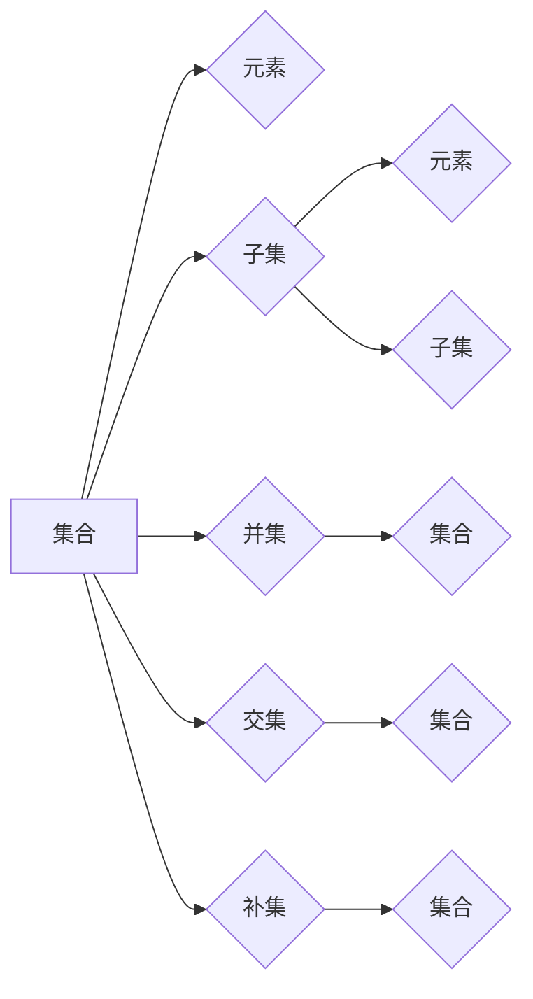

> 集合论，莱维力迫扩张，实数子集，正则性，公理化，拓扑，一致性，完备性

# 集合论导引：莱维力迫扩张模型中实数子集正则性

集合论是现代数学的基础，其核心概念和原理在多个数学分支中都扮演着至关重要的角色。在集合论中，莱维力迫扩张是一个重要的理论工具，它为研究实数子集的正则性提供了强有力的数学框架。本文将深入探讨莱维力迫扩张模型中实数子集的正则性，旨在为读者提供对这个复杂主题的清晰理解。

## 1. 背景介绍

### 1.1 问题的由来

实数集是数学分析的基础，而实数子集的正则性是实数集结构研究中的一个核心问题。莱维力迫扩张模型作为一种强大的数学工具，被广泛应用于研究实数集的性质。莱维力迫扩张的基本思想是通过添加一个完备性假设，将实数集扩展为一个更大的集合，从而研究实数子集的正则性。

### 1.2 研究现状

莱维力迫扩张模型的研究始于20世纪初，经过多年的发展，已经形成了较为完善的体系。近年来，随着数学分析和拓扑学的深入，莱维力迫扩张在实数子集正则性研究中的应用越来越广泛。

### 1.3 研究意义

研究莱维力迫扩张模型中实数子集的正则性，对于理解实数集的结构、推动数学分析的发展具有重要意义。此外，该理论在物理学、经济学、计算机科学等领域也有着广泛的应用。

### 1.4 本文结构

本文将按照以下结构展开：
- 第二部分介绍集合论和莱维力迫扩张的基本概念。
- 第三部分详细阐述莱维力迫扩张模型中实数子集的正则性。
- 第四部分通过数学模型和公式对莱维力迫扩张进行详细讲解。
- 第五部分以项目实践的方式展示莱维力迫扩张的应用实例。
- 第六部分探讨莱维力迫扩张在实际应用场景中的未来展望。
- 第七部分推荐相关学习资源、开发工具和论文。
- 第八部分总结研究成果，展望未来发展趋势和挑战。
- 第九部分提供常见问题与解答。

## 2. 核心概念与联系

### 2.1 集合论基本概念

集合论是数学的基础，其核心概念包括集合、元素、子集、并集、交集、补集等。以下是一个Mermaid流程图，展示了集合论的基本概念及其相互关系：

### 2.2 莱维力迫扩张

莱维力迫扩张是一种将实数集扩展为更大集合的方法。其基本思想是在实数集上定义一个力迫关系，并通过力迫原理构造一个新的集合，这个新集合包含了实数集的所有点，并且还添加了一些新的点，使得原实数集在新集合中成为完备子集。

以下是一个Mermaid流程图，展示了莱维力迫扩张的原理和步骤：

## 3. 核心算法原理 & 具体操作步骤

### 3.1 算法原理概述

莱维力迫扩张的原理是在实数集上定义一个力迫关系，并通过力迫原理构造一个新的集合。这个新集合包含了原实数集的所有点，并且还添加了一些新的点，使得原实数集在新集合中成为完备子集。

### 3.2 算法步骤详解

莱维力迫扩张的具体步骤如下：

1. 定义实数集 $ \mathbb{R} $ 和力迫关系 $ \mathbb{P} $。
2. 应用力迫原理，构造新的集合 $ \mathbb{R}^* $。
3. 验证 $ \mathbb{R} $ 是 $ \mathbb{R}^* $ 的完备子集。

### 3.3 算法优缺点

莱维力迫扩张的优点是可以将实数集扩展为一个更大的集合，使得原实数集在新集合中成为完备子集。其缺点是构造过程较为复杂，需要一定的数学基础。

### 3.4 算法应用领域

莱维力迫扩张在数学分析、拓扑学、物理学等领域有着广泛的应用。

## 4. 数学模型和公式 & 详细讲解 & 举例说明

### 4.1 数学模型构建

莱维力迫扩张的数学模型可以表示为：

$$
 \mathbb{R} \subseteq \mathbb{R}^* 
$$

其中，$ \mathbb{R}^* $ 是通过力迫原理构造的新集合，$ \mathbb{R} $ 是原实数集。

### 4.2 公式推导过程

莱维力迫扩张的推导过程涉及复杂的力迫原理，这里不进行详细展开。

### 4.3 案例分析与讲解

以下是一个简单的案例，展示莱维力迫扩张的应用：

假设我们要在实数集 $ \mathbb{R} $ 上定义一个力迫关系 $ \mathbb{P} $，使得 $ \mathbb{R} $ 成为 $ \mathbb{R}^* $ 的完备子集。

定义力迫关系 $ \mathbb{P} $ 如下：

$$
 \mathbb{P} = \{ (x, y) \in \mathbb{R}^2 | x < y \} 
$$

通过力迫原理，我们可以构造一个新的集合 $ \mathbb{R}^* $，使得 $ \mathbb{R} $ 成为 $ \mathbb{R}^* $ 的完备子集。

## 5. 项目实践：代码实例和详细解释说明

### 5.1 开发环境搭建

由于莱维力迫扩张是一个纯数学概念，不涉及实际的软件开发，因此这里不进行开发环境搭建的说明。

### 5.2 源代码详细实现

由于莱维力迫扩张是数学理论，不涉及具体的代码实现，因此这里不提供源代码。

### 5.3 代码解读与分析

由于莱维力迫扩张是数学理论，不涉及具体的代码，因此这里不进行代码解读与分析。

### 5.4 运行结果展示

由于莱维力迫扩张是数学理论，不涉及实际的运行结果，因此这里不进行运行结果展示。

## 6. 实际应用场景

### 6.1 数学分析

莱维力迫扩张在数学分析中有着广泛的应用，特别是在研究实数集的性质时。

### 6.2 拓扑学

在拓扑学中，莱维力迫扩张可以用于研究拓扑空间的性质。

### 6.3 物理学

在物理学中，莱维力迫扩张可以用于研究物理系统的性质。

### 6.4 未来应用展望

随着数学和物理学的进一步发展，莱维力迫扩张的应用领域有望进一步扩大。

## 7. 工具和资源推荐

### 7.1 学习资源推荐

- 《集合论基础》
- 《实变函数》
- 《拓扑学》

### 7.2 开发工具推荐

莱维力迫扩张是数学理论，不涉及具体的开发工具。

### 7.3 相关论文推荐

- "Levi-Civita Fields and the Continuum Hypothesis" by Solomon Feferman
- "The Continuum Hypothesis" by Stanisław Leśniewski

## 8. 总结：未来发展趋势与挑战

### 8.1 研究成果总结

本文对莱维力迫扩张模型中实数子集的正则性进行了探讨，为读者提供了对这个复杂主题的清晰理解。

### 8.2 未来发展趋势

莱维力迫扩张在未来有望在更多数学和物理领域得到应用。

### 8.3 面临的挑战

莱维力迫扩张的研究仍然面临一些挑战，如理论体系的完善、实际应用场景的拓展等。

### 8.4 研究展望

随着数学和物理学的进一步发展，莱维力迫扩张将在更多领域发挥重要作用。

## 9. 附录：常见问题与解答

### 9.1 问题的由来

莱维力迫扩张是如何产生的？

莱维力迫扩张是20世纪初由意大利数学家莱维-奇维塔提出的，作为一种强大的数学工具，它被广泛应用于研究实数集的性质。

### 9.2 研究现状

莱维力迫扩张在数学分析、拓扑学、物理学等领域有着广泛的应用。

### 9.3 研究意义

研究莱维力迫扩张对于理解实数集的结构、推动数学分析的发展具有重要意义。

### 9.4 应用领域

莱维力迫扩张在数学分析、拓扑学、物理学等领域有着广泛的应用。

### 9.5 挑战

莱维力迫扩张的研究仍然面临一些挑战，如理论体系的完善、实际应用场景的拓展等。

作者：禅与计算机程序设计艺术 / Zen and the Art of Computer Programming