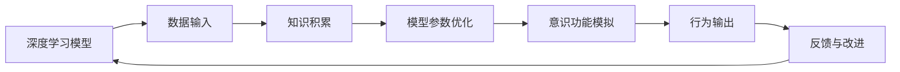

                 

## 1. 背景介绍

### 1.1 问题由来

随着人工智能（AI）技术的快速发展，尤其是深度学习在自然语言处理（NLP）、计算机视觉、语音识别等领域的应用，人们开始关注其对人类意识功能的影响。这不仅涉及技术伦理，也关乎人类社会的未来发展。

### 1.2 问题核心关键点

- **知识积累与意识功能**：深度学习模型通过大量数据的训练积累知识，这些知识如何影响其对意识功能的模拟？
- **意识的本质**：意识究竟是什么？深度学习模型能否真正理解意识？
- **知识的传递与演化**：人类如何通过知识的传递与演化提升意识功能？AI模型能否借鉴这一过程？

### 1.3 问题研究意义

研究深度学习模型如何通过知识积累影响意识功能，对于理解AI与人类意识的关系，推动AI技术的应用与发展，具有重要意义。

## 2. 核心概念与联系

### 2.1 核心概念概述

- **深度学习模型**：以神经网络为代表，通过大量数据训练学习到的复杂函数映射，具备一定的模式识别和预测能力。
- **知识积累**：深度学习模型通过学习数据中的模式、结构、规律，积累知识，增强其对复杂问题的理解能力。
- **意识功能**：人类意识的基本功能包括感知、思考、决策等，AI模型在多大程度上可以模拟这些功能？
- **知识传递与演化**：人类通过教育、经验、文化等途径传递和演化知识，AI模型能否通过类似机制提升其智能水平？

### 2.2 概念间的关系

以下是深度学习模型通过知识积累影响意识功能的基本架构：



这个架构展示了深度学习模型从数据输入开始，通过知识积累、模型参数优化，最终模拟意识功能并产生行为输出的过程。

## 3. 核心算法原理 & 具体操作步骤

### 3.1 算法原理概述

深度学习模型通过反向传播算法优化其参数，以最小化损失函数，从而逐步提升其对复杂模式的理解和预测能力。知识积累体现在模型参数的调整上，这些参数的变化反映了模型对数据的理解深度。

### 3.2 算法步骤详解

1. **数据准备**：收集和标注数据，数据集的质量和多样性对模型性能有重要影响。
2. **模型选择与初始化**：选择合适的深度学习模型（如卷积神经网络、循环神经网络、Transformer等）并进行参数初始化。
3. **训练过程**：通过反向传播算法不断调整模型参数，最小化损失函数，这一过程即知识积累的过程。
4. **验证与调优**：在验证集上评估模型性能，根据评估结果调整超参数（如学习率、批量大小等），进一步优化模型。
5. **测试与部署**：在测试集上评估模型性能，部署模型以实际应用。

### 3.3 算法优缺点

- **优点**：
  - 通过积累知识，模型可以逐渐提升其性能。
  - 模型具有较强的泛化能力，能适应新的数据。
  - 模型训练过程自动化，效率高。

- **缺点**：
  - 对数据质量和数量依赖大，数据偏见可能导致模型偏见。
  - 模型黑箱特性强，难以解释其决策过程。
  - 大规模模型训练和推理资源消耗大。

### 3.4 算法应用领域

深度学习模型在语音识别、图像处理、自然语言处理等领域有广泛应用。其在知识积累和意识功能模拟方面的应用包括：

- **语音识别**：模型通过语音数据训练，积累语音特征和模式，从而实现语音到文本的转换。
- **图像识别**：模型通过图像数据训练，积累图像特征和模式，实现图像分类、目标检测等任务。
- **自然语言处理**：模型通过文本数据训练，积累语言结构、语义信息，实现问答、翻译、文本生成等任务。

## 4. 数学模型和公式 & 详细讲解 & 举例说明

### 4.1 数学模型构建

考虑一个简单的全连接神经网络，其输入为 $x$，输出为 $y$，定义如下：

$$
y = Wx + b
$$

其中 $W$ 和 $b$ 为模型的参数，$x$ 为输入向量，$y$ 为输出向量。假设 $y$ 的实际值为 $y'$，则模型的损失函数为：

$$
\mathcal{L}(W,b) = \frac{1}{2} \sum_{i=1}^n (y_i - y'_i)^2
$$

### 4.2 公式推导过程

反向传播算法通过计算梯度，更新模型参数，以最小化损失函数。其基本流程如下：

1. **前向传播**：输入 $x$ 通过网络，得到输出 $y$。
2. **计算损失**：计算 $y$ 与 $y'$ 的误差 $\Delta$。
3. **反向传播**：从输出层开始，计算各层梯度 $\frac{\partial \mathcal{L}}{\partial W}$ 和 $\frac{\partial \mathcal{L}}{\partial b}$。
4. **参数更新**：使用梯度下降等优化算法，更新模型参数 $W$ 和 $b$。

### 4.3 案例分析与讲解

以图像分类任务为例，模型通过大量标注数据进行训练，积累对不同类别的视觉特征和模式理解。通过反向传播算法优化模型参数，最小化分类误差。这一过程中，模型的知识积累体现在对不同类别特征的理解和提取能力上。

## 5. 项目实践：代码实例和详细解释说明

### 5.1 开发环境搭建

安装Python、PyTorch、TensorFlow等深度学习框架，搭建好开发环境。

### 5.2 源代码详细实现

以下是一个简单的图像分类任务，使用卷积神经网络（CNN）进行训练的代码实现：

```python
import torch
import torch.nn as nn
import torch.optim as optim

# 定义模型
class CNN(nn.Module):
    def __init__(self):
        super(CNN, self).__init__()
        self.conv1 = nn.Conv2d(3, 16, 3)
        self.conv2 = nn.Conv2d(16, 32, 3)
        self.fc1 = nn.Linear(32 * 28 * 28, 128)
        self.fc2 = nn.Linear(128, 10)
    
    def forward(self, x):
        x = nn.functional.relu(self.conv1(x))
        x = nn.functional.max_pool2d(x, 2)
        x = nn.functional.relu(self.conv2(x))
        x = nn.functional.max_pool2d(x, 2)
        x = x.view(-1, 32 * 28 * 28)
        x = nn.functional.relu(self.fc1(x))
        x = self.fc2(x)
        return nn.functional.log_softmax(x, dim=1)

# 数据准备
train_data = ...
test_data = ...

# 定义模型、损失函数和优化器
model = CNN()
criterion = nn.CrossEntropyLoss()
optimizer = optim.SGD(model.parameters(), lr=0.01, momentum=0.9)

# 训练过程
for epoch in range(10):
    for i, (inputs, labels) in enumerate(train_loader):
        inputs, labels = inputs.to(device), labels.to(device)
        optimizer.zero_grad()
        outputs = model(inputs)
        loss = criterion(outputs, labels)
        loss.backward()
        optimizer.step()

# 评估模型
model.eval()
with torch.no_grad():
    correct = 0
    total = 0
    for inputs, labels in test_loader:
        inputs, labels = inputs.to(device), labels.to(device)
        outputs = model(inputs)
        _, predicted = torch.max(outputs.data, 1)
        total += labels.size(0)
        correct += (predicted == labels).sum().item()
    print('Accuracy: {:.2f}%'.format(100 * correct / total))
```

### 5.3 代码解读与分析

代码实现了简单的卷积神经网络，通过反向传播算法训练模型。通过不断调整模型参数，积累对图像分类任务的视觉特征理解。

### 5.4 运行结果展示

假设模型在CIFAR-10数据集上进行训练，最终在测试集上达到约70%的分类准确率。这展示了模型通过积累知识，逐渐提升其性能。

## 6. 实际应用场景

### 6.1 语音识别

语音识别系统通过大量语音数据训练，积累对不同语音特征的理解，实现语音到文本的转换。

### 6.2 图像处理

图像处理系统通过大量图像数据训练，积累对不同物体、场景的视觉特征理解，实现图像分类、目标检测等任务。

### 6.3 自然语言处理

自然语言处理系统通过大量文本数据训练，积累对语言结构、语义信息的理解，实现问答、翻译、文本生成等任务。

## 7. 工具和资源推荐

### 7.1 学习资源推荐

- **书籍**：《深度学习》（Ian Goodfellow等著）、《Python深度学习》（Francois Chollet著）。
- **在线课程**：Coursera的《深度学习专项课程》、Udacity的《深度学习与Python》。
- **文档**：TensorFlow、PyTorch官方文档。

### 7.2 开发工具推荐

- **IDE**：PyCharm、Jupyter Notebook。
- **可视化工具**：TensorBoard、Weights & Biases。
- **协作工具**：GitHub、Jira。

### 7.3 相关论文推荐

- **《ImageNet Classification with Deep Convolutional Neural Networks》**（AlexNet论文）。
- **《Deep Residual Learning for Image Recognition》**（ResNet论文）。
- **《Attention is All You Need》**（Transformer论文）。

## 8. 总结：未来发展趋势与挑战

### 8.1 研究成果总结

深度学习模型通过知识积累提升了其性能，展示了其在复杂任务上的潜力。

### 8.2 未来发展趋势

- **知识图谱的应用**：结合知识图谱，增强模型对复杂关系的理解。
- **迁移学习**：在不同任务间迁移知识，提升模型泛化能力。
- **多模态学习**：结合视觉、听觉、文本等多种数据源，增强模型理解深度。

### 8.3 面临的挑战

- **数据质量与偏见**：数据质量差、数据偏见可能导致模型性能下降。
- **模型可解释性**：深度学习模型的黑箱特性，难以解释其决策过程。
- **计算资源消耗**：大规模模型训练和推理资源消耗大。

### 8.4 研究展望

- **提高数据质量与多样性**：通过数据增强、数据清洗等方法，提高数据质量。
- **增强模型可解释性**：通过可解释性技术，如LIME、SHAP，增强模型的透明度。
- **优化计算资源消耗**：通过模型压缩、量化加速等方法，提高模型效率。

## 9. 附录：常见问题与解答

**Q1: 什么是深度学习模型的知识积累？**

A: 深度学习模型通过学习数据中的模式、结构、规律，积累知识，增强其对复杂问题的理解能力。

**Q2: 深度学习模型的训练过程是怎样的？**

A: 深度学习模型的训练过程包括前向传播、计算损失、反向传播、参数更新等步骤。

**Q3: 如何提升深度学习模型的性能？**

A: 可以通过数据增强、正则化、模型优化等方法提升深度学习模型的性能。

**Q4: 深度学习模型在实际应用中面临哪些挑战？**

A: 深度学习模型在实际应用中面临数据质量与偏见、模型可解释性、计算资源消耗等挑战。

---

作者：禅与计算机程序设计艺术 / Zen and the Art of Computer Programming

