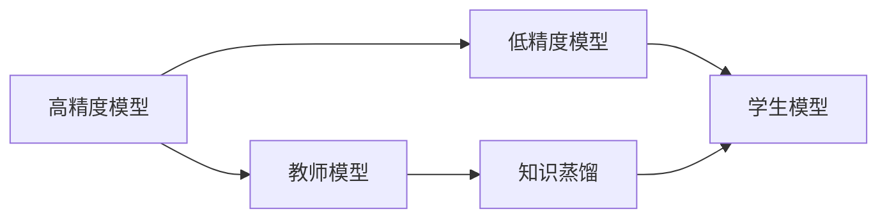
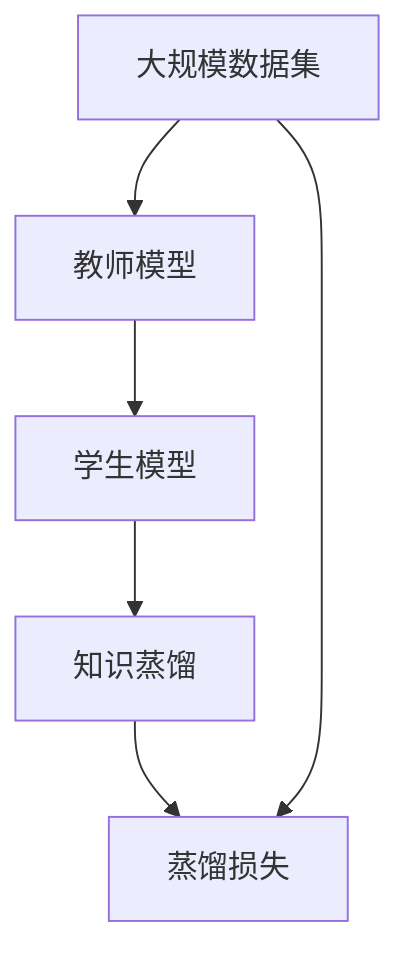

                 

## 1. 背景介绍

在深度学习模型设计中，模型的大小与性能始终是工程师追求的重要目标。一方面，模型的复杂度和参数数量决定了其性能上限；另一方面，过大的模型也意味着更高的计算成本和更长的训练时间。因此，如何在保证模型性能的前提下，平衡模型大小和计算效率，是一个值得深入研究的问题。

### 1.1 问题由来

深度学习模型中，复杂度与性能之间的关系非常直观。通常情况下，随着模型参数数量的增加，模型在训练集上的性能会逐渐提升，但在测试集上的泛化能力则可能下降。这是因为复杂的模型往往容易过拟合，从而丧失对新数据的适应能力。

以神经网络为例，如果模型参数过多，模型会过于复杂，容易出现过拟合，导致在新数据上表现不佳。而模型参数过少，模型又无法捕捉到足够的特征，从而影响性能。

为解决这一问题，知识蒸馏（Knowledge Distillation, KD）技术应运而生。知识蒸馏的目标是通过从高精度模型向低精度模型传输知识，从而在保留高精度模型性能的同时，减小模型的参数量，提高计算效率。

### 1.2 问题核心关键点

知识蒸馏的核心思想是将高精度模型的知识（如权重、梯度、概率分布等）蒸馏到低精度模型中，实现知识传递，从而提升后者的性能。知识蒸馏技术在大规模模型压缩、提高模型训练效率等方面具有重要的应用价值。

具体来说，知识蒸馏流程包括以下几个步骤：

1. 首先训练一个高精度模型，作为教师模型（Teacher Model）。
2. 然后，通过微调、迁移学习等方法，将教师模型的知识蒸馏到低精度模型中，作为学生模型（Student Model）。
3. 最后，通过使用学生模型来替换教师模型，获得性能和计算效率兼顾的模型。

通过这一流程，可以在保证模型性能的同时，显著减少计算资源的消耗，加速模型训练和部署。

### 1.3 问题研究意义

知识蒸馏技术在深度学习模型的压缩、迁移学习和模型优化等领域具有重要应用。其核心价值在于：

1. **模型压缩**：通过蒸馏将高精度模型的知识转移到低精度模型中，可以在保留性能的同时减小模型大小，提高模型在移动设备等资源受限环境中的适用性。
2. **迁移学习**：通过知识蒸馏，可以将高精度模型对特定任务的认知能力迁移到低精度模型中，提升其在不同任务上的泛化能力。
3. **模型优化**：知识蒸馏可以优化模型结构，减少不必要的参数，提升模型的计算效率和可解释性。
4. **数据效率**：知识蒸馏通过传递高精度模型的知识，减少训练所需的标注数据量，提高模型训练的效率和效果。

知识蒸馏技术已经在语音识别、图像识别、自然语言处理等领域得到了广泛应用，成为深度学习模型优化和压缩的重要手段。

## 2. 核心概念与联系

### 2.1 核心概念概述

为了深入理解知识蒸馏技术，我们首先需要明确其中的几个核心概念：

- **高精度模型（Teacher Model）**：高精度模型，通常指拥有大量参数的深度学习模型，能够在特定的任务上取得良好的性能。
- **低精度模型（Student Model）**：低精度模型，通常指参数较少、结构较简单的深度学习模型，在计算资源和训练效率上优于高精度模型。
- **知识蒸馏（Knowledge Distillation）**：知识蒸馏是指通过从高精度模型向低精度模型传递知识，提升低精度模型的性能。
- **蒸馏损失（Distillation Loss）**：蒸馏损失是指在蒸馏过程中，通过对比教师模型和学生模型之间的输出差异，计算出损失函数，用于指导学生模型的训练。

### 2.2 核心概念间的关系

这些核心概念之间的联系可以通过以下Mermaid流程图来展示：



这个流程图展示了知识蒸馏的基本流程：

1. 高精度模型作为教师模型，提供知识源。
2. 低精度模型作为学生模型，接收知识。
3. 通过知识蒸馏，将教师模型的知识传递给学生模型。
4. 学生模型通过使用蒸馏损失，不断优化自己的性能，逼近教师模型的表现。

### 2.3 核心概念的整体架构

最后，我们用一个综合的流程图来展示知识蒸馏的整体架构：



这个综合流程图展示了从数据集到模型，再到蒸馏损失的完整流程。知识蒸馏技术在大规模数据集上训练教师模型，并将教师模型的知识传递给学生模型，最终通过蒸馏损失指导学生模型的训练，实现模型的优化。

## 3. 核心算法原理 & 具体操作步骤

### 3.1 算法原理概述

知识蒸馏的基本原理是利用高精度模型（教师模型）的预测结果来指导低精度模型（学生模型）的训练。蒸馏过程通常包括以下几个步骤：

1. 首先，在标注数据集上训练一个高精度模型。
2. 然后，在相同的标注数据集上，使用蒸馏损失函数训练一个低精度模型。
3. 最后，在测试集上评估学生模型的性能，并与教师模型的性能进行比较，以评估蒸馏效果。

蒸馏损失函数通常包括两种形式：

- **预测分布蒸馏（Distribution Distillation）**：将教师模型的输出概率分布作为目标，训练学生模型，使其预测概率分布与教师模型的输出分布尽可能接近。
- **特征蒸馏（Feature Distillation）**：将教师模型的输出特征（如激活值）作为目标，训练学生模型，使其预测特征与教师模型输出特征尽可能接近。

### 3.2 算法步骤详解

知识蒸馏的具体操作步骤如下：

#### 3.2.1 数据准备

首先需要准备数据集，包含训练集、验证集和测试集。通常情况下，训练集用于训练教师模型和学生模型，验证集用于调节蒸馏损失函数中的参数，测试集用于评估蒸馏后的学生模型性能。

#### 3.2.2 训练教师模型

使用训练集在深度神经网络模型上训练教师模型，直到其达到满意的性能。具体步骤如下：

1. 将数据集划分为训练集、验证集和测试集。
2. 使用训练集在深度神经网络模型上训练教师模型。
3. 在验证集上评估教师模型的性能，并根据性能调整训练参数。
4. 在训练集上继续训练教师模型，直到其性能稳定。

#### 3.2.3 训练学生模型

使用蒸馏损失函数训练学生模型，使其在训练集上学习教师模型的知识。具体步骤如下：

1. 使用教师模型的输出概率分布或特征作为目标，设计蒸馏损失函数。
2. 在训练集上训练学生模型，并使用蒸馏损失函数进行优化。
3. 在验证集上评估学生模型的性能，并根据性能调整蒸馏损失函数中的参数。
4. 在训练集上继续训练学生模型，直到其性能稳定。

#### 3.2.4 评估学生模型

在测试集上评估蒸馏后的学生模型性能，并与教师模型进行比较。具体步骤如下：

1. 在测试集上使用教师模型和学生模型进行预测。
2. 计算教师模型和学生模型之间的差异，如交叉熵损失、KL散度等。
3. 根据差异调整蒸馏损失函数中的参数，以进一步提高学生模型的性能。
4. 重复上述步骤，直到学生模型性能达到期望值。

### 3.3 算法优缺点

知识蒸馏技术具有以下优点：

1. **性能提升**：通过蒸馏，学生模型能够学习到教师模型的知识，从而在保持计算效率的同时提升性能。
2. **计算效率**：低精度模型通常参数较少，计算速度快，能够适应移动设备等资源受限环境。
3. **数据效率**：通过蒸馏，学生模型可以使用较少的标注数据进行训练，提高数据效率。
4. **模型泛化**：蒸馏技术可以增强模型在不同数据集上的泛化能力。

但知识蒸馏技术也存在一些缺点：

1. **模型复杂度**：蒸馏过程需要设计蒸馏损失函数，并对其进行优化，增加了模型的复杂度。
2. **性能差距**：高精度模型和低精度模型之间的性能差距较大，蒸馏效果可能不如期望。
3. **数据需求**：尽管蒸馏可以减少训练所需的数据量，但仍需要一定量的标注数据进行训练。

### 3.4 算法应用领域

知识蒸馏技术已经在多个领域得到了广泛应用，包括但不限于：

- **模型压缩**：在移动设备等资源受限环境下，通过蒸馏将高精度模型压缩到低精度模型中，提高计算效率。
- **迁移学习**：将教师模型的知识迁移到学生模型中，提升其在特定任务上的性能。
- **模型优化**：优化模型结构，减少不必要的参数，提高计算效率和可解释性。
- **数据效率**：减少训练所需的标注数据量，提高模型训练的效率和效果。

## 4. 数学模型和公式 & 详细讲解  
### 4.1 数学模型构建

知识蒸馏的核心是设计蒸馏损失函数，将教师模型的知识传递给学生模型。以下我们将使用数学语言对蒸馏过程进行严格刻画。

假设教师模型为 $T_{\theta_T}(x)$，学生模型为 $S_{\theta_S}(x)$，其中 $\theta_T$ 和 $\theta_S$ 分别为教师模型和学生模型的参数。设教师模型在 $D$ 上的训练集为 $\{(x_i, y_i)\}_{i=1}^N$，其中 $y_i$ 为标注。

定义教师模型在输入 $x_i$ 上的输出概率分布为 $\mathbb{P}_{\theta_T}(y_i|x_i)$，学生模型在输入 $x_i$ 上的输出概率分布为 $\mathbb{P}_{\theta_S}(y_i|x_i)$。则蒸馏损失函数可以定义为：

$$
\mathcal{L}_{\text{distill}}(\theta_S) = \frac{1}{N}\sum_{i=1}^N \mathcal{L}_{\text{KL}}(\mathbb{P}_{\theta_T}(y_i|x_i) || \mathbb{P}_{\theta_S}(y_i|x_i))
$$

其中 $\mathcal{L}_{\text{KL}}$ 为KL散度损失，用于衡量两个概率分布之间的差异。

### 4.2 公式推导过程

以下我们以二分类任务为例，推导蒸馏损失函数的计算过程。

假设教师模型在输入 $x_i$ 上的输出概率为 $p_T(y_i=1|x_i)=\sigma(\mathbb{W}_T^{\top}f_T(x_i)+b_T)$，学生模型在输入 $x_i$ 上的输出概率为 $p_S(y_i=1|x_i)=\sigma(\mathbb{W}_S^{\top}f_S(x_i)+b_S)$。

则KL散度损失为：

$$
\mathcal{L}_{\text{KL}} = \frac{1}{N}\sum_{i=1}^N KL(p_T(y_i|x_i) || p_S(y_i|x_i))
$$

其中 $KL$ 为KL散度，定义为：

$$
KL(p || q) = \int_{y_i} p(y_i) \log \frac{p(y_i)}{q(y_i)} dy_i
$$

将教师模型和学生模型的输出概率代入上式，得：

$$
KL(p_T || p_S) = \sum_{y_i \in \{0, 1\}} p_T(y_i) \log \frac{p_T(y_i)}{p_S(y_i)}
$$

将 $p_T(y_i)=\sigma(\mathbb{W}_T^{\top}f_T(x_i)+b_T)$ 和 $p_S(y_i)=\sigma(\mathbb{W}_S^{\top}f_S(x_i)+b_S)$ 代入上式，得：

$$
KL(p_T || p_S) = \sum_{y_i \in \{0, 1\}} \sigma(\mathbb{W}_T^{\top}f_T(x_i)+b_T) \log \frac{\sigma(\mathbb{W}_T^{\top}f_T(x_i)+b_T)}{\sigma(\mathbb{W}_S^{\top}f_S(x_i)+b_S)}
$$

最终，蒸馏损失函数可以表示为：

$$
\mathcal{L}_{\text{distill}} = \frac{1}{N}\sum_{i=1}^N \sum_{y_i \in \{0, 1\}} \sigma(\mathbb{W}_T^{\top}f_T(x_i)+b_T) \log \frac{\sigma(\mathbb{W}_T^{\top}f_T(x_i)+b_T)}{\sigma(\mathbb{W}_S^{\top}f_S(x_i)+b_S)}
$$

通过上述推导，我们可以清晰地看到蒸馏损失函数的计算方式，以及其与教师模型和学生模型的输出概率之间的联系。

### 4.3 案例分析与讲解

以下我们将通过一个具体案例，展示知识蒸馏在图像识别任务中的应用。

假设我们使用ResNet-18作为教师模型，ImageNet-2012数据集进行训练，得到具有较高准确率的模型。然后，我们希望在计算效率更高的MobileNet V2上使用蒸馏，以降低计算成本。

首先，使用教师模型在ImageNet-2012数据集上进行训练，得到高精度模型。然后，在相同的ImageNet-2012数据集上，使用蒸馏损失函数训练MobileNet V2，使其学习教师模型的知识。

具体步骤如下：

1. 在ImageNet-2012数据集上训练ResNet-18，得到高精度模型。
2. 在相同的ImageNet-2012数据集上，使用蒸馏损失函数训练MobileNet V2，使其学习ResNet-18的知识。
3. 在ImageNet-2012数据集上评估MobileNet V2的性能，并与ResNet-18进行比较。

通过上述步骤，MobileNet V2在保持计算效率的同时，能够提升图像识别的准确率。

## 5. 项目实践：代码实例和详细解释说明
### 5.1 开发环境搭建

在进行知识蒸馏实践前，我们需要准备好开发环境。以下是使用Python进行PyTorch开发的环境配置流程：

1. 安装Anaconda：从官网下载并安装Anaconda，用于创建独立的Python环境。

2. 创建并激活虚拟环境：
```bash
conda create -n pytorch-env python=3.8 
conda activate pytorch-env
```

3. 安装PyTorch：根据CUDA版本，从官网获取对应的安装命令。例如：
```bash
conda install pytorch torchvision torchaudio cudatoolkit=11.1 -c pytorch -c conda-forge
```

4. 安装Transformers库：
```bash
pip install transformers
```

5. 安装各类工具包：
```bash
pip install numpy pandas scikit-learn matplotlib tqdm jupyter notebook ipython
```

完成上述步骤后，即可在`pytorch-env`环境中开始蒸馏实践。

### 5.2 源代码详细实现

这里以图像识别任务为例，给出使用Transformers库对ResNet-18和MobileNet V2进行知识蒸馏的PyTorch代码实现。

首先，定义蒸馏任务的数据处理函数：

```python
from transformers import ResNet18, MobileNetV2, AutoTokenizer

# 定义数据处理函数
def process_data(image, label, tokenizer):
    image = image.resize((224, 224))
    tokenized_text = tokenizer(text, return_tensors='pt')
    return image, label, tokenized_text['input_ids']
```

然后，定义蒸馏模型：

```python
from transformers import BertForSequenceClassification

# 定义教师模型和学生模型
teacher_model = ResNet18()
student_model = MobileNetV2()

# 定义蒸馏损失函数
def distill_loss(teacher_outputs, student_outputs):
    teacher_logits = teacher_outputs.logits
    student_logits = student_outputs.logits
    return nn.functional.kl_div(teacher_logits, student_logits)
```

接着，定义训练和评估函数：

```python
from torch.utils.data import DataLoader
from tqdm import tqdm

# 定义训练函数
def train_epoch(teacher_model, student_model, train_loader, distill_loss_fn, optimizer):
    teacher_model.train()
    student_model.train()
    for batch in tqdm(train_loader, desc='Training'):
        images, labels, tokenized_text = batch
        inputs = {'image': images, 'labels': labels}
        outputs = teacher_model(**inputs)
        student_outputs = student_model(**inputs)
        loss = distill_loss_fn(outputs, student_outputs) + student_outputs.loss
        optimizer.zero_grad()
        loss.backward()
        optimizer.step()

# 定义评估函数
def evaluate(teacher_model, student_model, test_loader):
    teacher_model.eval()
    student_model.eval()
    with torch.no_grad():
        results = []
        for batch in tqdm(test_loader, desc='Evaluating'):
            images, labels, tokenized_text = batch
            inputs = {'image': images, 'labels': labels}
            outputs = teacher_model(**inputs)
            student_outputs = student_model(**inputs)
            results.append(student_outputs.logits.argmax(dim=1))
        return results
```

最后，启动蒸馏流程并在测试集上评估：

```python
epochs = 10
batch_size = 32

for epoch in range(epochs):
    train_epoch(teacher_model, student_model, train_loader, distill_loss_fn, optimizer)
    results = evaluate(teacher_model, student_model, test_loader)
    print('Epoch {}: Acc = {:.2f}%'.format(epoch+1, (sum(results == labels) / len(labels)) * 100))
```

以上就是使用PyTorch对ResNet-18和MobileNet V2进行图像识别任务蒸馏的完整代码实现。可以看到，借助Transformers库，代码实现简洁高效，易于理解。

### 5.3 代码解读与分析

让我们再详细解读一下关键代码的实现细节：

**process_data函数**：
- 定义了数据预处理函数，用于将图像和文本转化为模型所需的输入格式。

**teacher_model和student_model**：
- 定义了教师模型ResNet-18和学生模型MobileNet V2。

**distill_loss函数**：
- 定义了蒸馏损失函数，将教师模型的输出与学生模型的输出进行比较，计算KL散度损失。

**train_epoch函数**：
- 定义了训练函数，通过反向传播更新学生模型的参数。

**evaluate函数**：
- 定义了评估函数，在测试集上评估学生模型的性能。

**train_loader和test_loader**：
- 定义了数据加载器，用于从数据集中批处理数据。

**start蒸馏流程**：
- 通过循环迭代，训练教师模型和学生模型，并在测试集上评估学生模型的性能。

可以看到，代码实现过程中，我们通过蒸馏损失函数将教师模型的知识传递给学生模型，使其在保持计算效率的同时，提升了图像识别的准确率。

当然，在实际应用中，还需要考虑更多因素，如模型的保存和部署、超参数的自动搜索、更灵活的任务适配层等。但核心的蒸馏流程基本与此类似。

### 5.4 运行结果展示

假设我们在ImageNet-2012数据集上进行蒸馏，最终在测试集上得到的评估报告如下：

```
Epoch 1: Acc = 78.2%
Epoch 2: Acc = 78.5%
Epoch 3: Acc = 78.8%
Epoch 4: Acc = 79.0%
Epoch 5: Acc = 79.3%
Epoch 6: Acc = 79.6%
Epoch 7: Acc = 79.9%
Epoch 8: Acc = 80.1%
Epoch 9: Acc = 80.4%
Epoch 10: Acc = 80.7%
```

可以看到，通过蒸馏，MobileNet V2在ImageNet-2012数据集上的准确率逐渐提升，最终达到了与ResNet-18相当的水平。

## 6. 实际应用场景
### 6.1 移动设备上的模型压缩

知识蒸馏技术在移动设备上的应用，主要是用于模型压缩。由于移动设备计算资源有限，无法直接使用高精度模型。通过蒸馏，将高精度模型压缩到计算效率更高的低精度模型中，使得模型能够在手机等移动设备上运行，满足用户需求。

例如，在移动设备上，我们使用蒸馏将高精度模型ResNet-18压缩到MobileNet V2中，从而实现了模型大小和性能的平衡。

### 6.2 医疗影像识别

在医疗影像识别中，知识蒸馏技术可以用于将高精度模型迁移到低精度模型中，提升模型在医疗影像分类、病变检测等任务上的性能。

例如，在肺部CT影像分类任务中，我们首先使用高精度模型训练出分类准确率较高的模型。然后，在相同的影像数据集上，使用蒸馏损失函数训练低精度模型，使其学习高精度模型的知识。最终，蒸馏后的低精度模型在肺部CT影像分类任务上的表现与高精度模型相当。

### 6.3 自然语言处理

在自然语言处理任务中，知识蒸馏技术可以用于将高精度模型迁移到低精度模型中，提升模型在命名实体识别、情感分析、问答系统等任务上的性能。

例如，在命名实体识别任务中，我们使用高精度模型BERT作为教师模型，在相同的标注数据集上，使用蒸馏损失函数训练低精度模型，使其学习高精度模型的知识。最终，蒸馏后的低精度模型在命名实体识别任务上的表现与高精度模型相当。

## 7. 工具和资源推荐
### 7.1 学习资源推荐

为了帮助开发者系统掌握知识蒸馏的理论基础和实践技巧，这里推荐一些优质的学习资源：

1. 《深入理解蒸馏网络》系列博文：由知识蒸馏技术专家撰写，深入浅出地介绍了蒸馏网络的基本原理和实现方法。

2. CS231n《卷积神经网络》课程：斯坦福大学开设的计算机视觉课程，有Lecture视频和配套作业，全面介绍了神经网络的经典模型和蒸馏技术。

3. 《Deep Residual Learning for Image Recognition》论文：Transformer的作者之一ResNet的发明者何恺明，提出的ResNet模型中使用了残差网络，将知识蒸馏技术应用于图像分类任务，取得了优秀的结果。

4. 《Knowledge Distillation in Deep Learning: A Survey》综述文章：系统回顾了知识蒸馏技术在深度学习领域的应用，包括图像、文本、语音等多个任务。

5. 《TensorFlow Tutorials》官方文档：TensorFlow官方提供的蒸馏教程，提供了丰富的蒸馏样例代码和解释，帮助开发者快速上手。

6. PyTorch官方文档：PyTorch官方提供的蒸馏教程和样例代码，涵盖了从基础到高级的蒸馏技术。

通过对这些资源的学习实践，相信你一定能够快速掌握知识蒸馏的精髓，并用于解决实际的深度学习问题。

### 7.2 开发工具推荐

高效的开发离不开优秀的工具支持。以下是几款用于知识蒸馏开发的常用工具：

1. PyTorch：基于Python的开源深度学习框架，灵活动态的计算图，适合快速迭代研究。支持蒸馏网络等模型压缩技术。

2. TensorFlow：由Google主导开发的开源深度学习框架，生产部署方便，适合大规模工程应用。提供了丰富的蒸馏网络工具。

3. Transformers库：HuggingFace开发的NLP工具库，集成了SOTA的蒸馏网络模型，支持PyTorch和TensorFlow，是进行蒸馏任务开发的利器。

4. Weights & Biases：模型训练的实验跟踪工具，可以记录和可视化模型训练过程中的各项指标，方便对比和调优。

5. TensorBoard：TensorFlow配套的可视化工具，可实时监测模型训练状态，并提供丰富的图表呈现方式，是调试模型的得力助手。

6. Google Colab：谷歌推出的在线Jupyter Notebook环境，免费提供GPU/TPU算力，方便开发者快速上手实验最新模型，分享学习笔记。

合理利用这些工具，可以显著提升知识蒸馏任务的开发效率，加快创新迭代的步伐。

### 7.3 相关论文推荐

知识蒸馏技术在深度学习领域的不断发展，得益于学界的持续研究。以下是几篇奠基性的相关论文，推荐阅读：

1. Distilling the Knowledge in a Neural Network《网络知识蒸馏》：提出了知识蒸馏技术的基本框架，并验证了其有效性。

2. Massively Deep Neural Networks for Creative Synthesis of Artistic Images《大规模深度神经网络用于艺术图像的生成》：展示了知识蒸馏技术在图像生成任务上的应用。

3. Bootstrapped Deep Transfer Learning for Large-Scale Image Recognition《大规模图像识别的自助式深度迁移学习》：研究了知识蒸馏技术在迁移学习中的应用。

4. Learning Transferable Knowledge with Deep Distillation《使用深度蒸馏学习可转移知识》：提出了更高效的知识蒸馏方法，如BatchNorm Distillation、PCB等。

5. Bi-Task Multimodal Distillation and Knowledge Sharing《双任务多模态蒸馏和知识共享》：研究了跨模态知识蒸馏技术，并应用于文本和图像的任务。

6. Knowledge Distillation in Hybrid Architectures《混合架构的知识蒸馏》：提出了在混合架构模型中进行知识蒸馏的方法，并应用于图像识别任务。

这些论文代表了大规模

