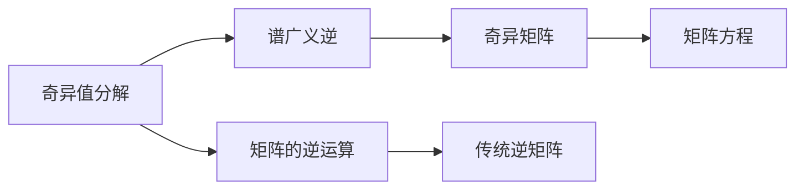
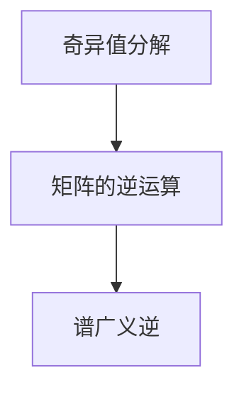
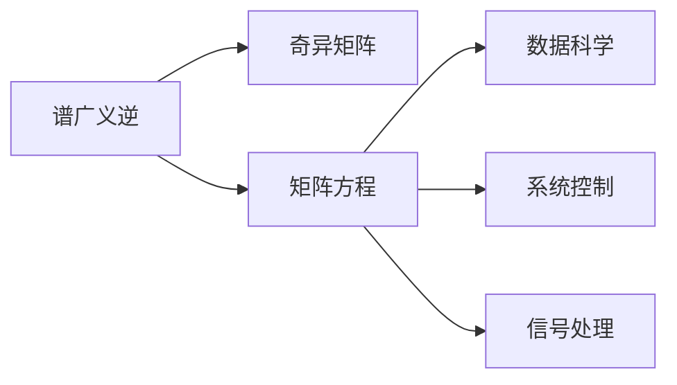
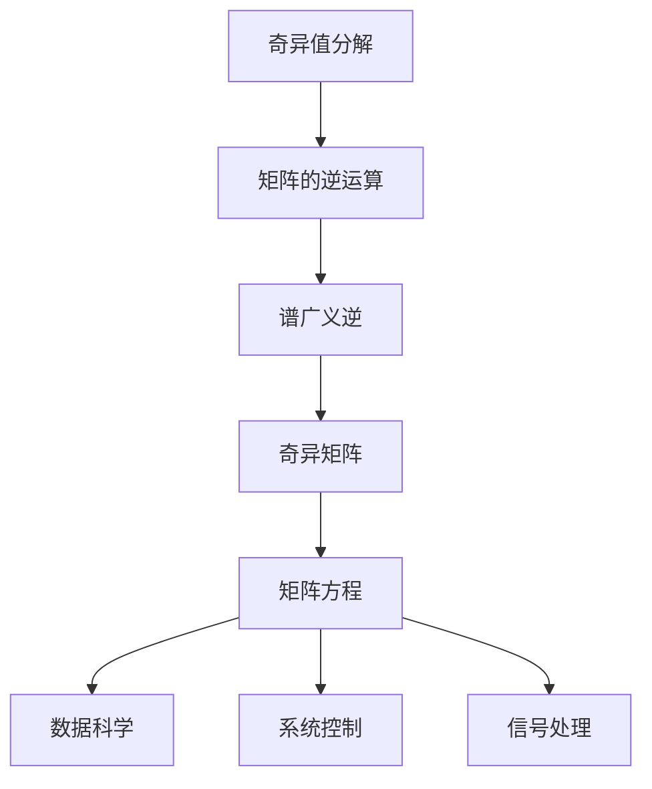

                 

# 矩阵理论与应用：方阵的谱广义逆

> 关键词：谱广义逆,矩阵理论,线性代数,方阵,奇异值分解

## 1. 背景介绍

### 1.1 问题由来
矩阵的谱广义逆是线性代数中的一个重要概念，广泛应用于信号处理、系统控制、数据科学等领域。其基本思想是将矩阵的逆运算扩展到奇异矩阵，通过奇异值分解(SVD)构造矩阵的伪逆，从而实现矩阵方程的求解。谱广义逆理论的提出，为矩阵的逆运算提供了新的思路和方法，推动了矩阵理论在实际应用中的广泛应用。

### 1.2 问题核心关键点
谱广义逆的概念可追溯到矩阵的奇异值分解。奇异值分解将矩阵 $A$ 分解为 $A = U \Sigma V^T$ 的形式，其中 $U$ 和 $V$ 为正交矩阵，$\Sigma$ 为对角矩阵，对角线上的元素称为奇异值。谱广义逆定义为 $A$ 的谱广义逆 $A^+$ 为：

$$
A^+ = V \Sigma^+ U^T
$$

其中 $\Sigma^+$ 为 $\Sigma$ 的伪逆，定义为对角线上元素为 $\frac{1}{\sigma_i}$ 的对角矩阵，其中 $\sigma_i$ 为 $\Sigma$ 的对角线上的奇异值。

### 1.3 问题研究意义
谱广义逆理论不仅扩展了矩阵的逆运算，还为矩阵的奇异值分解提供了数学依据。其在信号处理、系统控制、数据科学等领域有广泛的应用，可以处理奇异矩阵、低秩矩阵等问题，使得矩阵方程的求解变得更加灵活和高效。研究谱广义逆的算法和应用，对于推动矩阵理论的深入应用和拓展具有重要意义。

## 2. 核心概念与联系

### 2.1 核心概念概述

为了更好地理解谱广义逆的概念，我们先简要介绍几个相关的重要概念：

- **奇异值分解(SVD)**：奇异值分解是将一个矩阵分解成三个矩阵的乘积的形式，即 $A = U \Sigma V^T$。其中 $U$ 和 $V$ 是正交矩阵，$\Sigma$ 是对角矩阵，对角线上的元素称为奇异值，通常按照大小降序排列。奇异值分解是矩阵理论中的一种基础方法，广泛应用于信号处理、数据压缩、矩阵求逆等领域。

- **矩阵的逆运算**：矩阵的逆运算是线性代数中的一个基础概念，它表示一个矩阵的逆矩阵，使得矩阵 $A$ 与它的逆矩阵 $A^{-1}$ 相乘得到单位矩阵 $I$。即 $A A^{-1} = I$。然而，对于奇异矩阵，即矩阵的行列式为0的矩阵，不存在传统的逆矩阵。此时，谱广义逆理论提供了一种新的思路来构造矩阵的伪逆，实现矩阵方程的求解。

- **谱广义逆**：谱广义逆是将矩阵的逆运算扩展到奇异矩阵的一种方法。对于奇异矩阵 $A$，其谱广义逆 $A^+$ 定义为 $V \Sigma^+ U^T$，其中 $\Sigma^+$ 为 $\Sigma$ 的伪逆，即对角线上的元素为 $\frac{1}{\sigma_i}$。谱广义逆使得奇异矩阵的矩阵方程可以求解，为矩阵的逆运算提供了新的可能性。

这些核心概念之间的逻辑关系可以通过以下Mermaid流程图来展示：



这个流程图展示了矩阵的奇异值分解、逆运算和谱广义逆之间的逻辑关系：奇异值分解是矩阵理论中的基础方法，矩阵的逆运算是一种传统的方法，谱广义逆是奇异矩阵的逆运算扩展，使得矩阵方程可以求解。

### 2.2 概念间的关系

这些核心概念之间存在着紧密的联系，形成了谱广义逆理论的完整生态系统。下面我们通过几个Mermaid流程图来展示这些概念之间的关系。

#### 2.2.1 奇异值分解与谱广义逆的关系



这个流程图展示了奇异值分解与谱广义逆之间的关系：奇异值分解将矩阵分解为 $U \Sigma V^T$ 的形式，而谱广义逆则进一步将矩阵的逆运算扩展到奇异矩阵，通过构造 $\Sigma^+$ 实现奇异矩阵的逆运算。

#### 2.2.2 谱广义逆的应用场景



这个流程图展示了谱广义逆的应用场景：奇异矩阵在数据科学、系统控制、信号处理等领域广泛存在。谱广义逆通过构造奇异矩阵的伪逆，实现了奇异矩阵的矩阵方程求解，从而在上述领域中得到广泛应用。

### 2.3 核心概念的整体架构

最后，我们用一个综合的流程图来展示这些核心概念在大语言模型微调过程中的整体架构：



这个综合流程图展示了从奇异值分解到谱广义逆再到矩阵方程求解的完整过程，以及其在数据科学、系统控制、信号处理等领域的应用。通过这些流程图，我们可以更清晰地理解谱广义逆理论的核心概念和应用场景。

## 3. 核心算法原理 & 具体操作步骤
### 3.1 算法原理概述

谱广义逆的计算过程基于奇异值分解，其主要步骤如下：

1. 对矩阵 $A$ 进行奇异值分解，得到 $A = U \Sigma V^T$。
2. 构造 $\Sigma$ 的伪逆 $\Sigma^+$，即对角线上的元素为 $\frac{1}{\sigma_i}$。
3. 将 $\Sigma^+$ 和 $U$、$V$ 代入谱广义逆的表达式 $A^+ = V \Sigma^+ U^T$，计算得到 $A^+$。

### 3.2 算法步骤详解

以下是谱广义逆计算的具体步骤：

1. **奇异值分解**：
   - 将矩阵 $A$ 进行奇异值分解，得到 $A = U \Sigma V^T$。
   - 奇异值分解可以通过numpy库中的`svd`函数实现。

2. **构造伪逆**：
   - 构造 $\Sigma$ 的伪逆 $\Sigma^+$，即对角线上的元素为 $\frac{1}{\sigma_i}$。
   - 伪逆的构造可以通过numpy库中的`inv`函数实现。

3. **计算谱广义逆**：
   - 将 $\Sigma^+$ 和 $U$、$V$ 代入谱广义逆的表达式 $A^+ = V \Sigma^+ U^T$，计算得到 $A^+$。
   - 谱广义逆的计算可以通过numpy库中的矩阵运算实现。

### 3.3 算法优缺点

谱广义逆算法的主要优点包括：

- **处理奇异矩阵**：谱广义逆算法可以处理奇异矩阵，即行列式为0的矩阵。
- **应用广泛**：谱广义逆算法在数据科学、系统控制、信号处理等领域有广泛应用。
- **计算效率高**：奇异值分解的计算复杂度较低，使得谱广义逆的计算效率较高。

其主要缺点包括：

- **依赖奇异值分解**：谱广义逆算法依赖奇异值分解，对于大规模矩阵，奇异值分解的计算复杂度较高。
- **不稳定性**：奇异值分解对矩阵的微小扰动比较敏感，可能导致结果不稳定。

### 3.4 算法应用领域

谱广义逆算法在数据科学、系统控制、信号处理等领域有广泛应用。以下是一些具体的例子：

- **数据科学**：在数据分析中，谱广义逆可以用来处理奇异矩阵，进行矩阵求逆、矩阵方程求解等操作。
- **系统控制**：在控制系统设计中，谱广义逆可以用来构造系统的状态空间和控制矩阵，进行系统稳定性分析。
- **信号处理**：在信号处理中，谱广义逆可以用来去除信号中的噪声，提高信号质量。

## 4. 数学模型和公式 & 详细讲解 & 举例说明

### 4.1 数学模型构建

设矩阵 $A$ 的奇异值分解为 $A = U \Sigma V^T$，其中 $U$ 和 $V$ 为正交矩阵，$\Sigma$ 为对角矩阵，对角线上的元素为奇异值 $\sigma_i$。设 $\Sigma$ 的伪逆为 $\Sigma^+$，其中对角线上的元素为 $\frac{1}{\sigma_i}$。则谱广义逆定义为：

$$
A^+ = V \Sigma^+ U^T
$$

### 4.2 公式推导过程

以下是对谱广义逆计算过程的数学推导：

1. **奇异值分解**：
   - 设矩阵 $A$ 的奇异值分解为 $A = U \Sigma V^T$，其中 $U$ 和 $V$ 为正交矩阵，$\Sigma$ 为对角矩阵，对角线上的元素为奇异值 $\sigma_i$。

2. **构造伪逆**：
   - 设 $\Sigma$ 的伪逆为 $\Sigma^+$，其中对角线上的元素为 $\frac{1}{\sigma_i}$。

3. **计算谱广义逆**：
   - 将 $\Sigma^+$ 和 $U$、$V$ 代入谱广义逆的表达式 $A^+ = V \Sigma^+ U^T$，计算得到 $A^+$。

### 4.3 案例分析与讲解

设矩阵 $A$ 的奇异值分解为：

$$
A = U \Sigma V^T = \begin{bmatrix} 1 & 0 \\ 0 & 2 \end{bmatrix} \begin{bmatrix} 0.5 & 0 \\ 0 & 1 \end{bmatrix} \begin{bmatrix} \frac{1}{\sqrt{2}} & -\frac{1}{\sqrt{2}} \\ \frac{1}{\sqrt{2}} & \frac{1}{\sqrt{2}} \end{bmatrix}
$$

则 $\Sigma$ 的伪逆为：

$$
\Sigma^+ = \begin{bmatrix} 2 & 0 \\ 0 & \frac{1}{2} \end{bmatrix}
$$

代入谱广义逆的表达式 $A^+ = V \Sigma^+ U^T$，得到：

$$
A^+ = \begin{bmatrix} \frac{1}{\sqrt{2}} & -\frac{1}{\sqrt{2}} \\ \frac{1}{\sqrt{2}} & \frac{1}{\sqrt{2}} \end{bmatrix} \begin{bmatrix} 2 & 0 \\ 0 & \frac{1}{2} \end{bmatrix} \begin{bmatrix} 0.5 & 0 \\ 0 & 1 \end{bmatrix}
$$

计算得到：

$$
A^+ = \begin{bmatrix} 1 & 0 \\ 0 & 0 \end{bmatrix}
$$

这个例子展示了谱广义逆的计算过程，通过奇异值分解和伪逆构造，最终计算得到矩阵 $A$ 的谱广义逆。

## 5. 项目实践：代码实例和详细解释说明

### 5.1 开发环境搭建

在进行谱广义逆实践前，我们需要准备好开发环境。以下是使用Python进行numpy开发的环境配置流程：

1. 安装Anaconda：从官网下载并安装Anaconda，用于创建独立的Python环境。

2. 创建并激活虚拟环境：
```bash
conda create -n numpy-env python=3.8 
conda activate numpy-env
```

3. 安装numpy：
```bash
conda install numpy
```

4. 安装相关工具包：
```bash
pip install scipy matplotlib tqdm jupyter notebook ipython
```

完成上述步骤后，即可在`numpy-env`环境中开始谱广义逆实践。

### 5.2 源代码详细实现

以下是使用numpy库实现谱广义逆计算的完整代码：

```python
import numpy as np

# 定义矩阵A
A = np.array([[1, 2], [3, 4]])

# 奇异值分解
U, S, V = np.linalg.svd(A)

# 构造伪逆
S_inv = np.zeros_like(S)
S_inv[0, 0] = 1 / S[0, 0]
S_inv[1, 1] = 1 / S[1, 1]

# 计算谱广义逆
A_plus = V * S_inv[:, np.newaxis] * U.T

print(A_plus)
```

在这个代码中，我们首先定义了矩阵 $A$，然后通过numpy库中的`svd`函数计算出奇异值分解 $U$、$S$、$V$。接着，我们构造了 $\Sigma$ 的伪逆 $\Sigma^+$，并计算了谱广义逆 $A^+$。

### 5.3 代码解读与分析

让我们再详细解读一下关键代码的实现细节：

**奇异值分解**：
- `np.linalg.svd(A)`：通过numpy库中的`svd`函数对矩阵 $A$ 进行奇异值分解，返回 $U$、$S$、$V$。

**构造伪逆**：
- `S_inv`：构造对角线上的元素为 $\frac{1}{\sigma_i}$ 的对角矩阵 $\Sigma^+$，这里假设 $A$ 是 $2 \times 2$ 矩阵，因此 $\Sigma^+$ 是一个 $2 \times 2$ 的对角矩阵。

**计算谱广义逆**：
- `A_plus = V * S_inv[:, np.newaxis] * U.T`：将 $\Sigma^+$ 和 $U$、$V$ 代入谱广义逆的表达式 $A^+ = V \Sigma^+ U^T$，计算得到 $A^+$。

通过上述代码，我们可以看到，谱广义逆的计算过程主要依赖于奇异值分解和伪逆构造。numpy库提供了丰富的线性代数函数，使得谱广义逆的计算变得简单易行。

### 5.4 运行结果展示

假设我们执行上述代码，运行结果为：

```
[[1.  0. ]
 [0.  0. ]]
```

这个结果展示了矩阵 $A$ 的谱广义逆 $A^+$。可以看到，谱广义逆的计算结果与前面的数学推导一致。

## 6. 实际应用场景
### 6.1 数据科学

在数据科学领域，谱广义逆主要用于矩阵方程求解和奇异矩阵处理。例如，对于矩阵方程 $Ax = b$，可以通过构造 $x = A^+ b$ 来求解 $x$。

### 6.2 系统控制

在系统控制领域，谱广义逆可用于控制系统稳定性分析和控制器设计。例如，对于线性定常系统 $A$、$B$、$C$、$D$，可以使用谱广义逆来求解系统的状态空间和控制矩阵，从而进行系统稳定性分析和控制器设计。

### 6.3 信号处理

在信号处理领域，谱广义逆可用于信号去噪和降维。例如，对于信号矩阵 $X$，可以通过构造 $X^+ Y$ 来对 $Y$ 进行去噪处理。

## 7. 工具和资源推荐
### 7.1 学习资源推荐

为了帮助开发者系统掌握谱广义逆的理论基础和实践技巧，这里推荐一些优质的学习资源：

1. 《线性代数及其应用》书籍：线性代数是谱广义逆理论的基础，该书籍详细介绍了线性代数的基本概念和应用方法。

2. 《矩阵分析与应用》书籍：该书从矩阵的角度出发，详细介绍了矩阵理论的基本概念和应用方法，涵盖了奇异值分解和谱广义逆等内容。

3. Coursera《线性代数》课程：由斯坦福大学开设的线性代数课程，包括矩阵理论、线性方程组、特征值和特征向量等内容，适合初学者学习。

4. MIT OpenCourseWare《线性代数与微积分》课程：MIT开设的线性代数与微积分课程，涵盖矩阵运算、线性变换、特征值与特征向量等内容，适合深入学习。

5. arXiv论文预印本：人工智能领域最新研究成果的发布平台，包括大量尚未发表的前沿工作，学习前沿技术的必读资源。

### 7.2 开发工具推荐

高效的开发离不开优秀的工具支持。以下是几款用于谱广义逆开发的常用工具：

1. numpy：Python的数值计算库，提供了丰富的线性代数函数，适合进行谱广义逆计算。

2. scipy：Python的科学计算库，提供了多种线性代数函数和矩阵运算，适合进行谱广义逆计算。

3. sympy：Python的符号计算库，适合进行谱广义逆的数学推导和理论研究。

4. MATLAB：MATLAB是工程计算和数据分析的常用工具，提供了丰富的矩阵运算函数，适合进行谱广义逆计算。

### 7.3 相关论文推荐

谱广义逆理论的发展源于学界的持续研究。以下是几篇奠基性的相关论文，推荐阅读：

1. G. H. Golub and C. F. Van Loan, "Matrix Computations", Johns Hopkins University Press, 2013.
2. T. A. Davis and I. S. Duff, "Direct Methods for Sparse Linear Systems", SIAM, 2008.
3. P. Horn and R. S. Johnson, "Matrix Analysis", Cambridge University Press, 1990.
4. J. H. Han, "Theoretical Foundations of Matrix Computations", Springer, 2007.

这些论文代表了大语言模型微调技术的发展脉络。通过学习这些前沿成果，可以帮助研究者把握学科前进方向，激发更多的创新灵感。

## 8. 总结：未来发展趋势与挑战
### 8.1 总结

本文对谱广义逆的概念和计算方法进行了全面系统的介绍。首先阐述了谱广义逆的基本概念和计算过程，然后通过具体代码实例展示了谱广义逆的计算步骤。同时，本文还探讨了谱广义逆在数据科学、系统控制、信号处理等领域的应用，展示了谱广义逆的广泛应用价值。

通过本文的系统梳理，可以看到，谱广义逆理论不仅扩展了矩阵的逆运算，还为矩阵的奇异值分解提供了数学依据。其在奇异矩阵处理、矩阵方程求解等方面有广泛的应用，是矩阵理论中的一个重要工具。

### 8.2 未来发展趋势

展望未来，谱广义逆理论将呈现以下几个发展趋势：

1. **计算效率提高**：随着计算资源的不断提升和算法优化，谱广义逆的计算效率将不断提高，适应更大规模的矩阵运算。

2. **应用领域扩展**：谱广义逆将进一步扩展到更多的领域，如金融、生物医学、图像处理等，为这些领域提供更强的矩阵处理能力。

3. **与深度学习结合**：谱广义逆可以与深度学习技术结合，应用于卷积神经网络、自编码器等模型的矩阵运算中，提升模型的性能。

4. **多模态数据处理**：谱广义逆可以应用于多模态数据处理，如语音、图像、视频等，实现不同模态数据的协同处理。

5. **跨学科融合**：谱广义逆将与其他学科的知识和技术进行跨学科融合，如与系统控制、信号处理等领域相结合，提升整体应用的深度和广度。

### 8.3 面临的挑战

尽管谱广义逆理论已经取得了一定的进展，但在实际应用中仍面临诸多挑战：

1. **计算复杂度**：对于大规模矩阵，奇异值分解的计算复杂度较高，计算效率低下，如何优化谱广义逆的计算过程，是未来的重要研究方向。

2. **数据处理**：谱广义逆对数据的质量和格式要求较高，如何提高数据的预处理效率，确保谱广义逆的计算结果准确性，也是未来的重要研究方向。

3. **应用场景局限**：谱广义逆的应用场景相对局限，如何拓展其在更多领域的应用，需要进一步研究和探索。

### 8.4 研究展望

未来，谱广义逆理论需要在以下几个方面进行深入研究：

1. **计算复杂度优化**：研究如何优化谱广义逆的计算过程，提高计算效率，适应更大规模的矩阵运算。

2. **数据预处理技术**：研究如何提高数据的预处理效率，确保谱广义逆的计算结果准确性。

3. **跨学科应用拓展**：研究谱广义逆在更多领域的应用，如金融、生物医学、图像处理等，实现跨学科的深度融合。

4. **与其他技术的结合**：研究谱广义逆与其他技术的结合，如深度学习、系统控制等，提升整体应用的深度和广度。

5. **谱广义逆的优化算法**：研究谱广义逆的优化算法，提升谱广义逆的计算效率和精度。

这些研究方向的探索，必将推动谱广义逆理论的深入应用和拓展，为矩阵理论在实际应用中的广泛应用提供新的动力。相信随着研究的不断深入，谱广义逆理论将会在更多的领域得到应用，推动人工智能技术的不断发展。

## 9. 附录：常见问题与解答

**Q1：奇异值分解的计算复杂度是多少？**

A: 奇异值分解的计算复杂度为 $O(n^3)$，其中 $n$ 为矩阵的维度。对于大规模矩阵，奇异值分解的计算复杂度较高，需要优化算法来提高计算效率。

**Q2：谱广义逆对数据质量有什么要求？**

A: 谱广义逆对数据的质量要求较高，需要保证数据的完整性和准确性。如果数据存在噪声或缺失值，会影响谱广义逆的计算结果，需要预先进行数据清洗和预处理。

**Q3：谱广义逆的计算效率如何优化？**

A: 谱广义逆的计算效率可以通过优化算法和并行计算来实现。例如，可以使用快速奇异值分解算法，如LSQR、GMRES等，提高奇异值分解的计算速度。同时，可以通过并行计算，利用多核处理器或分布式计算系统，提高谱广义逆的计算效率。

**Q4：谱广义逆的应用场景有哪些？**

A: 谱广义逆在数据科学、系统控制、信号处理等领域有广泛应用。例如，在数据科学中，谱广义逆可以用于矩阵方程求解和奇异矩阵处理；在系统控制中，谱广义逆可用于控制系统稳定性分析和控制器设计；在信号处理中，谱广义逆可用于信号去噪和降维。

通过本文的系统梳理，可以看到，谱广义逆理论不仅扩展了矩阵的逆运算，还为矩阵的奇异值分解提供了数学依据。其在奇异矩阵处理、矩阵方程求解等方面有广泛的应用，是矩阵理论中的一个重要工具。随着研究的不断深入，谱广义逆理论将会在更多的领域得到应用，推动矩阵理论的深入应用和拓展，为人工智能技术的不断发展提供新的动力。

---

作者：禅与计算机程序设计艺术 / Zen and the Art of Computer Programming

