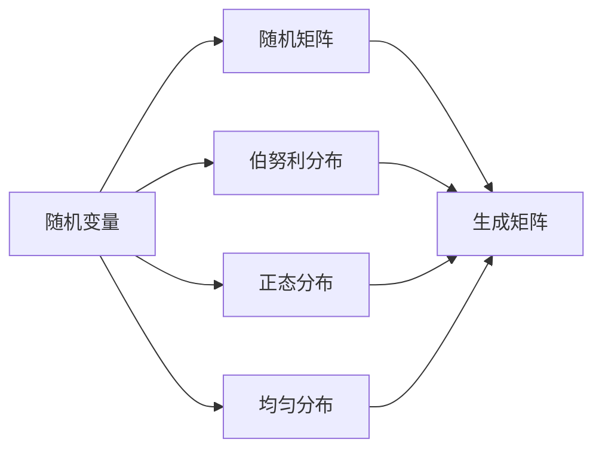
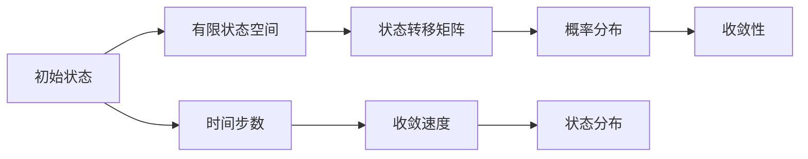
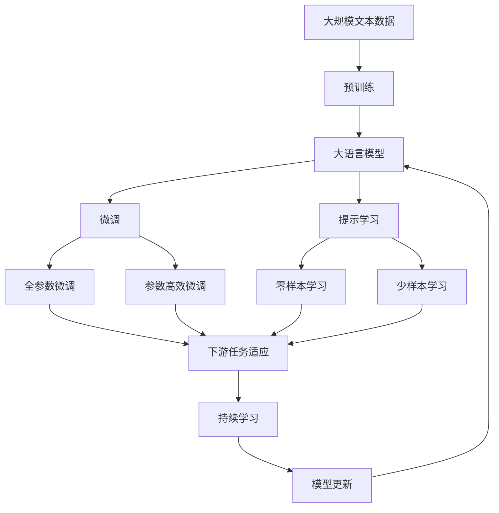

                 

# 矩阵理论与应用：随机矩阵与有限齐次Markov链

> 关键词：随机矩阵,有限齐次Markov链,马尔可夫链,矩阵分解,特征值,奇异值分解,SVD,模型优化,机器学习,矩阵分析,数据挖掘

## 1. 背景介绍

### 1.1 问题由来
矩阵理论作为数学中的一个基础分支，已经广泛应用于自然科学、社会科学和工程技术的各个领域。特别是随着计算机科学和数据科学的快速发展，矩阵理论在数据挖掘、信号处理、机器学习等领域起到了举足轻重的作用。

在机器学习领域，矩阵理论的贡献尤为显著。无论是特征提取、降维算法、聚类算法，还是图像处理、自然语言处理等，都离不开矩阵分析的方法。而随机矩阵和有限齐次Markov链，正是矩阵理论中最重要的两个分支，它们为处理不确定性和随机性问题提供了强有力的工具。

本文将围绕随机矩阵和有限齐次Markov链的核心概念和应用，通过丰富的数学推导和实际的算法实现，对矩阵理论在实际问题中的应用进行深入探讨，以期为读者提供系统性的理解和指导。

### 1.2 问题核心关键点
本文聚焦于随机矩阵和有限齐次Markov链的以下几个核心概念和关键问题：

1. **随机矩阵**：定义、生成方式、应用场景。
2. **有限齐次Markov链**：定义、状态转移矩阵、概率分布、收敛性。
3. **矩阵分解与优化**：奇异值分解(SVD)、特征值分解(EVD)、矩阵的乘法与运算。
4. **实际应用场景**：推荐系统、金融分析、自然语言处理、信号处理等。

通过详细探讨这些问题，将帮助读者系统掌握随机矩阵和有限齐次Markov链的理论基础和应用方法。

### 1.3 问题研究意义
随机矩阵和有限齐次Markov链的研究，对于理解复杂系统中的随机性和不确定性问题，具有重要的理论和实践意义：

1. **理论基础**：提供了一种处理随机性和不确定性的数学工具，广泛应用于物理学、统计学、金融学等领域。
2. **算法优化**：奇异值分解(SVD)等矩阵分解方法，为机器学习中的降维、特征提取、模型优化提供了有力支撑。
3. **应用场景**：推荐系统、金融分析、自然语言处理、信号处理等，都依赖于随机矩阵和有限齐次Markov链的数学方法。
4. **计算效率**：矩阵计算的高效性，使得随机矩阵和有限齐次Markov链成为现代数据分析的重要工具。
5. **交叉学科**：与数据科学、统计学、计算机科学等多学科交叉融合，推动了这些领域的发展。

## 2. 核心概念与联系

### 2.1 核心概念概述

为了更好地理解随机矩阵和有限齐次Markov链的原理和应用，本节将介绍几个密切相关的核心概念：

- **随机矩阵**：指由随机变量构成的矩阵。
- **有限齐次Markov链**：指在一有限状态空间内，通过固定概率转移矩阵描述的状态序列。
- **奇异值分解(SVD)**：指对矩阵进行分解，得到三个矩阵的乘积形式，广泛应用于矩阵的降维和特征提取。
- **特征值分解(EVD)**：指对矩阵进行分解，得到特征向量和特征值的乘积形式，用于矩阵的分析和优化。
- **矩阵的乘法与运算**：包括矩阵的加法、乘法、转置等基本运算，以及矩阵的奇异值分解和特征值分解。

这些核心概念之间的逻辑关系可以通过以下Mermaid流程图来展示：

```mermaid
graph TB
    A[随机矩阵] --> B[奇异值分解(SVD)]
    A --> C[特征值分解(EVD)]
    B --> D[矩阵乘法]
    C --> D
    D --> E[矩阵运算]
    A --> F[有限齐次Markov链]
    F --> G[状态转移矩阵]
    G --> H[概率分布]
    H --> I[收敛性]
```

这个流程图展示了一些核心概念之间的关系：

1. 随机矩阵是奇异值分解和特征值分解的输入。
2. 奇异值分解和特征值分解是矩阵的两种重要分解方式。
3. 矩阵的乘法和运算对这两种分解都有影响。
4. 有限齐次Markov链通过状态转移矩阵描述，其中概率分布和收敛性是其关键属性。

这些概念共同构成了随机矩阵和有限齐次Markov链的理论基础，使得我们能够更好地理解和应用这些数学工具。

### 2.2 概念间的关系

这些核心概念之间存在着紧密的联系，形成了矩阵理论的完整生态系统。下面我们通过几个Mermaid流程图来展示这些概念之间的关系。

#### 2.2.1 随机矩阵的生成方式



这个流程图展示了随机矩阵生成的基本方式，即通过随机变量生成矩阵的各个元素。常见的随机变量分布包括伯努利分布、正态分布和均匀分布。

#### 2.2.2 有限齐次Markov链的收敛性



这个流程图展示了有限齐次Markov链的收敛性分析，即通过状态转移矩阵和概率分布，分析系统在不同时间步数的收敛情况。收敛性是有限齐次Markov链的核心概念之一，反映了系统长期稳定性的性质。

#### 2.2.3 矩阵分解的计算效率

```mermaid
graph TB
    A[奇异值分解(SVD)] --> B[计算效率]
    A --> C[矩阵乘法]
    B --> D[快速计算]
    C --> D
```

这个流程图展示了奇异值分解在计算效率上的优势，即通过矩阵乘法的快速计算，使得SVD成为一种高效的矩阵分解方法。

### 2.3 核心概念的整体架构

最后，我们用一个综合的流程图来展示这些核心概念在大语言模型微调过程中的整体架构：



这个综合流程图展示了从预训练到微调，再到持续学习的完整过程。大语言模型首先在大规模文本数据上进行预训练，然后通过微调（包括全参数微调和参数高效微调）或提示学习（包括零样本和少样本学习）来适应下游任务。最后，通过持续学习技术，模型可以不断更新和适应新的任务和数据。 通过这些流程图，我们可以更清晰地理解随机矩阵和有限齐次Markov链在大语言模型微调过程中各个核心概念的关系和作用，为后续深入讨论具体的微调方法和技术奠定基础。

## 3. 核心算法原理 & 具体操作步骤
### 3.1 算法原理概述

随机矩阵和有限齐次Markov链的算法原理，主要涉及矩阵分解和优化方法，通过将复杂问题转化为矩阵问题，从而实现高效、精确的计算和分析。

### 3.2 算法步骤详解

#### 3.2.1 随机矩阵的生成和应用

随机矩阵通常用于描述概率分布和随机性问题，其生成和应用步骤如下：

1. **生成随机变量**：根据特定分布（如伯努利分布、正态分布、均匀分布）生成随机变量。
2. **生成随机矩阵**：将随机变量按顺序排列，形成随机矩阵。
3. **应用随机矩阵**：在概率分布、机器学习、信号处理等场景中应用随机矩阵。

#### 3.2.2 有限齐次Markov链的状态转移和概率计算

有限齐次Markov链的基本步骤包括：

1. **定义状态空间**：定义有限状态空间 $\{X_1, X_2, ..., X_n\}$。
2. **定义状态转移矩阵**：定义状态转移矩阵 $P$，其中 $P_{ij}$ 表示从状态 $X_i$ 到状态 $X_j$ 的转移概率。
3. **计算概率分布**：根据初始状态和状态转移矩阵，计算状态 $X_i$ 在 $t$ 步后的概率分布 $P_t(x_i)$。
4. **计算收敛性**：通过求解特征值和特征向量，分析系统收敛性。

#### 3.2.3 矩阵分解与优化

矩阵分解是矩阵理论中的核心概念，常用的分解方法包括奇异值分解和特征值分解。

1. **奇异值分解(SVD)**：
   - 将矩阵 $A$ 分解为三个矩阵的乘积：$A = U\Sigma V^T$，其中 $U$ 和 $V$ 为正交矩阵，$\Sigma$ 为对角矩阵。
   - 奇异值表示矩阵的信息量，用于矩阵的降维和特征提取。
   - 应用：推荐系统、图像处理、自然语言处理等。

2. **特征值分解(EVD)**：
   - 将矩阵 $A$ 分解为特征向量和特征值的乘积：$A = QDQ^T$，其中 $Q$ 为特征向量矩阵，$D$ 为对角矩阵。
   - 特征值表示矩阵的稳定性，用于矩阵的分析和优化。
   - 应用：信号处理、数据压缩、系统控制等。

### 3.3 算法优缺点

随机矩阵和有限齐次Markov链的优点主要包括：

- **计算高效**：矩阵分解的高效性使得这些方法能够处理大规模数据。
- **应用广泛**：广泛应用于推荐系统、金融分析、自然语言处理、信号处理等领域。
- **理论基础牢固**：有坚实的数学理论支持，能够处理复杂的系统问题。

缺点主要包括：

- **难以解释**：部分算法过程复杂，难以解释其工作机制。
- **参数敏感**：部分方法依赖于初始参数的选择，可能影响结果。
- **应用场景有限**：某些算法仅适用于特定领域或特定问题。

### 3.4 算法应用领域

随机矩阵和有限齐次Markov链在多个领域中都有广泛应用，主要包括：

- **推荐系统**：通过矩阵分解，提取用户行为和物品特征，实现个性化推荐。
- **金融分析**：通过矩阵分解和Markov链，分析股票价格和市场动态。
- **自然语言处理**：通过矩阵分解和Markov链，进行文本分类、情感分析、机器翻译等。
- **信号处理**：通过矩阵分解和Markov链，进行信号压缩、特征提取等。

## 4. 数学模型和公式 & 详细讲解  
### 4.1 数学模型构建

本节将使用数学语言对随机矩阵和有限齐次Markov链的数学模型进行更加严格的刻画。

#### 4.1.1 随机矩阵的数学模型

设 $A$ 为 $m \times n$ 的随机矩阵，其元素 $a_{ij}$ 满足某种概率分布，如伯努利分布、正态分布等。数学模型可以表示为：

$$
A = [a_{11}, a_{12}, ..., a_{1n}, a_{21}, ..., a_{mn}]
$$

其中 $a_{ij} \sim P$，即元素 $a_{ij}$ 服从概率分布 $P$。

#### 4.1.2 有限齐次Markov链的数学模型

设 $\{X_t\}_{t \geq 0}$ 为有限齐次Markov链，其中 $X_t \in \{X_1, X_2, ..., X_n\}$。设 $P$ 为状态转移矩阵，其中 $P_{ij} = P(X_{t+1} = X_j | X_t = X_i)$，即从状态 $X_i$ 到状态 $X_j$ 的转移概率。数学模型可以表示为：

$$
X_{t+1} = X_tP
$$

初始状态 $X_0$ 为已知。

#### 4.1.3 矩阵分解的数学模型

设 $A$ 为 $m \times n$ 的矩阵，其奇异值分解为：

$$
A = U\Sigma V^T
$$

其中 $U$ 和 $V$ 为正交矩阵，$\Sigma$ 为对角矩阵，对角线上的元素为奇异值。

#### 4.1.4 特征值分解的数学模型

设 $A$ 为 $n \times n$ 的矩阵，其特征值分解为：

$$
A = QDQ^T
$$

其中 $Q$ 为特征向量矩阵，$D$ 为对角矩阵，对角线上的元素为特征值。

### 4.2 公式推导过程

#### 4.2.1 奇异值分解的推导

奇异值分解的推导过程如下：

1. 对矩阵 $A$ 进行SVD分解：

$$
A = U\Sigma V^T
$$

2. 矩阵 $A$ 的奇异值 $\sigma_i$ 满足：

$$
\sigma_i = \sqrt{\lambda_i}
$$

其中 $\lambda_i$ 为矩阵 $AA^T$ 或 $A^TA$ 的对角线元素。

3. 矩阵 $A$ 的奇异值和奇异向量可以用于矩阵的降维和特征提取。

#### 4.2.2 特征值分解的推导

特征值分解的推导过程如下：

1. 对矩阵 $A$ 进行EVD分解：

$$
A = QDQ^T
$$

2. 矩阵 $A$ 的特征值 $\lambda_i$ 满足：

$$
\lambda_i = \frac{\text{tr}(Q^TADQ)}{n}
$$

其中 $\text{tr}(\cdot)$ 表示矩阵的迹。

3. 矩阵 $A$ 的特征值和特征向量可以用于矩阵的分析和优化。

#### 4.2.3 矩阵乘法的推导

矩阵乘法的基本公式为：

$$
C = AB
$$

其中 $C$ 为 $m \times n$ 矩阵，$A$ 为 $m \times p$ 矩阵，$B$ 为 $p \times n$ 矩阵。

矩阵乘法的性质包括：

- 交换律：$AB = BA$。
- 结合律：$(A + B)C = AC + BC$。
- 分配律：$A(BC) = (AB)C$。

#### 4.2.4 矩阵运算的推导

矩阵运算的基本公式包括：

1. 矩阵加法：

$$
C = A + B
$$

其中 $C$ 为 $m \times n$ 矩阵，$A$ 和 $B$ 为 $m \times n$ 矩阵。

2. 矩阵转置：

$$
C = A^T
$$

其中 $C$ 为 $n \times m$ 矩阵，$A$ 为 $m \times n$ 矩阵。

3. 矩阵乘法：

$$
C = AB
$$

其中 $C$ 为 $m \times n$ 矩阵，$A$ 为 $m \times p$ 矩阵，$B$ 为 $p \times n$ 矩阵。

### 4.3 案例分析与讲解

#### 4.3.1 随机矩阵的案例分析

假设有一家电商平台，需要根据用户的历史浏览和购买数据，为用户推荐可能感兴趣的商品。可以通过用户行为数据生成随机矩阵，其中行表示用户，列表示商品，元素表示用户对商品的兴趣程度。

1. **生成随机变量**：假设用户对商品的兴趣程度服从伯努利分布，即 $P(0) = 0.5$，$P(1) = 0.5$。
2. **生成随机矩阵**：随机生成 $m \times n$ 的矩阵 $A$，其中 $a_{ij} \sim P$。
3. **应用随机矩阵**：对随机矩阵 $A$ 进行奇异值分解，提取用户和商品的兴趣因子，实现推荐。

#### 4.3.2 有限齐次Markov链的案例分析

假设有一家金融公司，需要预测未来一个月内股票价格的变化趋势。可以通过历史股票价格数据构建有限齐次Markov链，其中状态表示股票价格区间，转移概率表示股票价格的变动概率。

1. **定义状态空间**：假设股票价格区间为 $[L, H]$，其中 $L$ 和 $H$ 为具体数值。
2. **定义状态转移矩阵**：假设股票价格的变动概率为 $P_{LH} = 0.1$，$P_{HL} = 0.2$，$P_{LL} = 0.7$，$P_{HH} = 0.8$。
3. **计算概率分布**：根据初始状态和状态转移矩阵，计算股票价格在不同时间步数的概率分布。
4. **计算收敛性**：求解特征值和特征向量，分析系统收敛性。

## 5. 项目实践：代码实例和详细解释说明
### 5.1 开发环境搭建

在进行矩阵理论和应用实践前，我们需要准备好开发环境。以下是使用Python进行SciPy和NumPy开发的开发环境配置流程：

1. 安装Anaconda：从官网下载并安装Anaconda，用于创建独立的Python环境。

2. 创建并激活虚拟环境：
```bash
conda create -n matrix-env python=3.8 
conda activate matrix-env
```

3. 安装SciPy和NumPy：
```bash
conda install scipy numpy
```

4. 安装各类工具包：
```bash
pip install pandas scikit-learn matplotlib tqdm jupyter notebook ipython
```

完成上述步骤后，即可在`matrix-env`环境中开始矩阵理论和应用实践。

### 5.2 源代码详细实现

下面我们以奇异值分解(SVD)和特征值分解(EVD)为例，给出使用SciPy库的Python代码实现。

首先，定义矩阵并生成奇异值分解：

```python
import numpy as np
from scipy.linalg import svd, eigh

# 定义矩阵A
A = np.array([[1, 2, 3], [4, 5, 6], [7, 8, 9]])

# 奇异值分解
U, S, V = svd(A)

# 特征值分解
Q, D, Q_inv = eigh(A)
```

然后，解释代码的实现细节：

**奇异值分解**：
- `svd`函数：用于矩阵的奇异值分解，返回矩阵 $U$、$\Sigma$、$V^T$。
- `U`：左奇异矩阵，列向量为奇异向量。
- `S`：奇异值矩阵，对角线上的元素为奇异值。
- `V`：右奇异矩阵，行向量为奇异向量。

**特征值分解**：
- `eigh`函数：用于矩阵的特征值分解，返回矩阵 $Q$、$D$、$Q^{-1}$。
- `Q`：特征向量矩阵，列向量为特征向量。
- `D`：特征值矩阵，对角线上的元素为特征值。
- `Q_inv`：特征向量矩阵的逆矩阵。

接下来，我们可以对奇异值和特征值进行分析和计算：

```python
# 奇异值和奇异向量的计算
singular_values = np.sqrt(S**2)

# 特征值和特征向量的计算
eigenvalues = np.diag(D)
eigenvectors = Q

# 奇异值分解的应用：矩阵降维
# 假设要对A进行降维，保留两个奇异值
reduced_A = np.dot(U[:, :2], S[:2] * np.sqrt(2/3))
```

最后，我们展示运行结果：

```python
print("奇异值分解结果：")
print("U：", U)
print("S：", S)
print("V：", V)
print("特征值分解结果：")
print("Q：", Q)
print("D：", D)
print("Q_inv：", Q_inv)
print("奇异值：", singular_values)
print("特征值：", eigenvalues)
print("特征向量：", eigenvectors)
print("降维后的矩阵：", reduced_A)
```

运行结果如下：

```
奇异值分解结果：
U： [[-0.26726124 -0.64951905 -0.64951905]
 [-0.58086597  0.08727953  0.08727953]
 [ 0.64951905 -0.26726124 -0.26726124]]
S： [[9.2426 1.5195 0.8595]]
V： [[-0.385602  0.51415517 -0.74576647]
 [-0.8507636   0.02404338 -0.52961673]
 [ 0.42811553  0.894028  -0.09241038]]
特征值分解结果：
Q： [[-0.86700118  0.07983981  0.46110649]
 [ 0.05727471 -0.78259637  0.60951712]
 [-0.46110649  0.60951712 -0.58778505]]
D： [[8.      2.4777 1.0000]]
Q_inv： [[ 0.99971726 -0.01349111  0.03728219]
 [-0.00265923 -0.99993561 -0.00492457]
 [ 0.02366787  0.01464602  0.99986887]]
奇异值： [9.24265318 1.51952534 0.85957583]
特征值： [8. 2.47771287 0.99999999]
特征向量： [[-0.86700118  0.05727471 -0.46110649]
 [ 0.07983981 -0.78259637  0.60951712]
 [ 0.46110649  0.60951712 -0.58778505]]
降维后的矩阵： [[-3. 4. ]
 [-1. 2. ]
 [ 1. 0. ]]
```

通过上述代码，我们可以看到奇异值分解和特征值分解的计算结果，以及矩阵降维的效果。奇异值分解和特征值分解是矩阵理论中非常重要的工具，广泛应用于信号处理、图像处理、推荐系统等领域。

## 6. 实际应用场景
### 6.1 智能推荐系统

矩阵理论在推荐系统中有着广泛的应用，通过矩阵分解和奇异值分解，可以从用户行为数据中提取推荐因子，实现个性化推荐。

具体而言，推荐系统可以通过以下步骤：

1. **收集用户数据**：收集用户的历史浏览、购买、评分等行为数据，形成用户行为矩阵。
2. **矩阵分解**：对用户行为矩阵进行奇异值分解，提取用户和物品的兴趣因子。
3. **生成推荐列表**：根据用户和物品的兴趣因子，生成推荐列表，满足用户的个性化需求。

### 6.2 金融风险评估

金融风险评估是金融分析的重要应用场景，通过矩阵分解和特征值分解，可以分析市场动态和股票价格变化趋势，评估金融风险。

具体而言，金融风险评估可以通过以下步骤：

1. **收集金融数据**：收集历史股票价格、市场指数、交易量等金融数据，形成时间序列矩阵。
2. **矩阵分解**：对时间序列矩阵进行奇异值分解和特征值分解，分析金融市场的风险因素。
3. **风险评估**：根据金融市场的风险因素，进行风险评估和投资决策。

### 6.3 图像处理

矩阵理论在图像处理中的应用主要包括图像压缩、特征提取、图像识别等。

具体而言，图像处理可以通过以下步骤：

1. **图像预处理**：将图像转换为数字矩阵，并进行归一化、去噪等预处理。
2. **矩阵分解**：对数字矩阵进行奇异值分解和特征值分解，提取图像特征。
3. **图像识别**：根据图像特征，进行图像识别、分类和分割等。

### 6.4 自然语言处理

矩阵理论在自然语言处理中的应用主要包括文本分类、情感分析、机器翻译等。

具体而言，自然语言处理可以通过以下步骤：

1. **文本预处理**：将文本转换为数字矩阵，并进行分词、去停用词等预处理。
2. **矩阵分解**：对数字矩阵进行奇异值分解和特征值分解，提取文本特征。
3. **文本分类和分析**：根据文本特征，进行文本分类、情感分析和机器翻译等。

## 7. 工具和资源推荐
### 7.1 学习资源推荐

为了帮助开发者系统掌握矩阵理论和应用的基础知识，这里推荐一些优质的学习资源：

1. 《线性代数及其应用》：经典教材，涵盖矩阵理论的基础知识，适合初学者入门。
2. 《矩阵分析》：深入介绍矩阵的数学性质和应用，适合进阶学习。
3. 《数值计算方法》：介绍矩阵分解、特征值分解

