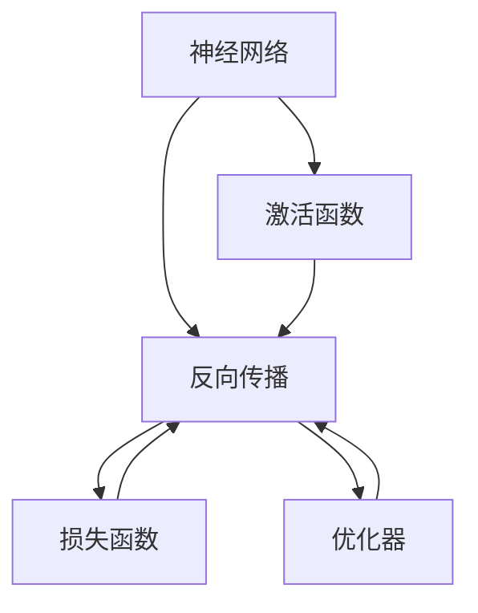
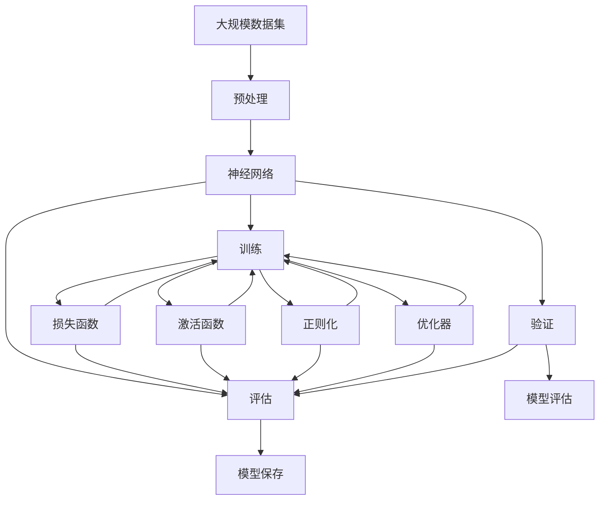

                 

# 神经网络原理与代码实例讲解

> 关键词：神经网络,深度学习,反向传播,激活函数,卷积神经网络,循环神经网络,深度强化学习

## 1. 背景介绍

### 1.1 问题由来
深度学习技术近年来在计算机视觉、自然语言处理、语音识别等诸多领域取得了突破性的进展。其中，神经网络作为深度学习的核心算法，以其强大的表征学习能力，成为处理复杂模式识别问题的重要工具。掌握神经网络原理及实现细节，是入门深度学习的关键。

### 1.2 问题核心关键点
神经网络通过多个层次的非线性变换，将输入数据映射到输出。每个层次由一组神经元组成，每个神经元与前一层的神经元相连，形成复杂的网络结构。反向传播算法是神经网络训练的核心，通过计算损失函数梯度，逐层更新模型参数，最小化预测误差。

神经网络涉及众多概念，包括激活函数、损失函数、正则化、优化器等，不同类型的网络（如卷积神经网络、循环神经网络、深度强化学习）各有特点。掌握这些核心概念及其原理，是高效应用神经网络的关键。

### 1.3 问题研究意义
深入理解神经网络原理，掌握其训练过程，可以提升模型的预测准确性和泛化能力，优化算法训练效率，降低计算资源消耗。神经网络技术已经在计算机视觉、自然语言处理、推荐系统等诸多领域展现出巨大价值，掌握神经网络知识，对于构建高性能智能应用具有重要意义。

## 2. 核心概念与联系

### 2.1 核心概念概述

为更好地理解神经网络，本节将介绍几个密切相关的核心概念：

- 神经网络(Neural Network)：由多个层次构成的复杂网络结构，通过前后层次的线性变换和非线性变换，将输入映射到输出。

- 反向传播(Backpropagation)：神经网络训练的核心算法，通过反向传播损失函数对模型参数的梯度，逐层更新参数，最小化预测误差。

- 激活函数(Activation Function)：神经元内部的非线性变换，将输入映射到输出，增强网络的表达能力。

- 损失函数(Loss Function)：用于衡量模型预测与真实标签之间的差异，常见的损失函数包括均方误差、交叉熵等。

- 正则化(Regularization)：通过引入正则项，减少模型的过拟合，常见的正则化方法包括L1正则、L2正则等。

- 优化器(Optimizer)：用于更新模型参数的算法，常见的优化器包括随机梯度下降(SGD)、Adam等。

这些核心概念之间通过逻辑关系形成了一个完整的神经网络训练生态，相互影响、相互促进。

### 2.2 概念间的关系

这些核心概念之间的关系可以通过以下Mermaid流程图来展示：



这个流程图展示了大神经网络训练的核心组成及相互关系：

1. 神经网络通过反向传播算法，计算损失函数梯度，更新参数。
2. 激活函数增强网络非线性表达能力。
3. 损失函数衡量模型预测与真实标签差异。
4. 优化器选择并计算梯度，优化参数更新。

### 2.3 核心概念的整体架构

最后，我们用一个综合的流程图来展示这些核心概念在大神经网络训练过程中的整体架构：



这个综合流程图展示了大神经网络训练的整体流程：

1. 数据预处理。对大规模数据集进行清洗、归一化等预处理，生成训练、验证和测试数据集。
2. 构建神经网络。选择合适的神经网络架构，并初始化参数。
3. 模型训练。使用训练集，通过反向传播算法优化模型参数，最小化损失函数。
4. 模型评估。在验证集和测试集上评估模型性能，调整超参数和模型结构。
5. 模型保存。保存训练好的模型，方便后续部署和推理。

通过这个架构，可以更好地理解大神经网络的训练过程及其关键组件。

## 3. 核心算法原理 & 具体操作步骤
### 3.1 算法原理概述

大神经网络通过反向传播算法进行训练，其核心思想是：对每个层次的参数，计算损失函数对参数的梯度，反向传播梯度，并根据梯度方向更新参数，使得模型输出尽可能接近真实标签。

具体来说，神经网络的每个层次由一组权重 $w$ 和偏置 $b$ 组成，神经元接收前一层的输出 $x$，通过激活函数 $f$ 映射到输出 $y$。反向传播算法通过链式法则，逐层计算梯度，更新模型参数。

### 3.2 算法步骤详解

大神经网络训练主要包括以下几个关键步骤：

**Step 1: 准备数据集**
- 收集并预处理大规模数据集，生成训练集、验证集和测试集。
- 对数据进行标准化、归一化、增广等处理。

**Step 2: 构建神经网络**
- 选择合适的神经网络架构，如卷积神经网络、循环神经网络、深度强化学习等。
- 定义神经网络层数、每层神经元个数、激活函数、正则化等超参数。
- 初始化神经网络参数。

**Step 3: 设置优化器及超参数**
- 选择合适的优化器，如SGD、Adam等，设置学习率、批大小、迭代轮数等超参数。
- 定义损失函数，如均方误差、交叉熵等。

**Step 4: 执行梯度训练**
- 将训练集数据分批次输入模型，前向传播计算输出。
- 计算损失函数，反向传播计算梯度。
- 根据梯度更新模型参数，重复步骤直至收敛。

**Step 5: 测试和评估**
- 在验证集和测试集上评估模型性能，如准确率、精确率、召回率等。
- 调整超参数和模型结构，进一步优化模型。

**Step 6: 模型保存和部署**
- 保存训练好的模型，生成配置文件和预处理数据。
- 部署模型到生产环境，进行实时推理和预测。

### 3.3 算法优缺点

大神经网络训练具有以下优点：
1. 强大的表征能力。通过多层次的组合变换，可以表示复杂非线性关系。
2. 高效的自动学习。通过反向传播算法，模型自动学习输入到输出的映射关系。
3. 泛化能力好。通过大量的数据训练，模型可以泛化到未见过的数据。

同时，也存在一些缺点：
1. 计算复杂度高。网络层次多，参数量大，训练过程耗时较长。
2. 过拟合风险大。网络复杂，易在训练数据上出现过拟合。
3. 需要大量标注数据。需要大量的标注数据来训练和优化模型。
4. 超参数调优困难。网络复杂，超参数选择和调优难度大。

### 3.4 算法应用领域

大神经网络训练广泛应用于计算机视觉、自然语言处理、语音识别等领域。以下是一些具体应用场景：

- 计算机视觉：图像分类、物体检测、人脸识别、图像生成等任务。
- 自然语言处理：文本分类、情感分析、机器翻译、对话生成等任务。
- 语音识别：语音转文本、说话人识别、语音合成等任务。

此外，深度强化学习也在游戏、机器人控制等领域展现出巨大潜力。

## 4. 数学模型和公式 & 详细讲解  
### 4.1 数学模型构建

本节将使用数学语言对大神经网络训练过程进行严格刻画。

记神经网络为 $f(\cdot; \theta)$，其中 $\theta$ 为模型参数。神经网络由多层神经元组成，每层神经元接收前一层的输出，通过权重 $w$ 和偏置 $b$ 进行线性变换，并经过激活函数 $f$ 映射到输出。训练过程中，通过反向传播算法计算损失函数对参数 $\theta$ 的梯度，更新参数。

定义损失函数为 $\mathcal{L}(y, \hat{y})$，其中 $y$ 为真实标签，$\hat{y}$ 为模型预测输出。常见的损失函数包括均方误差（MSE）、交叉熵（CE）等。

神经网络前向传播过程可表示为：
$$
y = f_W^L \cdot \dots f_W^2 \cdot f_W^1 \cdot x
$$

其中 $W^l$ 为第 $l$ 层权重矩阵，$b^l$ 为第 $l$ 层偏置向量，$f$ 为激活函数。

### 4.2 公式推导过程

以下我们以二分类任务为例，推导交叉熵损失函数及其梯度的计算公式。

假设神经网络 $f(\cdot; \theta)$ 在输入 $x$ 上的输出为 $\hat{y} = f_W^L \cdot \dots f_W^2 \cdot f_W^1 \cdot x$。真实标签 $y \in \{0,1\}$。则二分类交叉熵损失函数定义为：
$$
\mathcal{L}(y, \hat{y}) = -y\log \hat{y} - (1-y)\log(1-\hat{y})
$$

将其代入损失函数 $\mathcal{L}(\theta)$，得：
$$
\mathcal{L}(\theta) = \frac{1}{N}\sum_{i=1}^N [y_i\log f_{\theta}(x_i) + (1-y_i)\log(1-f_{\theta}(x_i))]
$$

根据链式法则，损失函数对参数 $\theta_k$ 的梯度为：
$$
\frac{\partial \mathcal{L}(\theta)}{\partial \theta_k} = \frac{\partial \mathcal{L}(\theta)}{\partial \hat{y}}\frac{\partial \hat{y}}{\partial x}\frac{\partial x}{\partial \theta_k}
$$

其中 $\frac{\partial \mathcal{L}(\theta)}{\partial \hat{y}}$ 为损失函数对预测输出的导数，$\frac{\partial \hat{y}}{\partial x}$ 为预测输出对输入的导数，$\frac{\partial x}{\partial \theta_k}$ 为输入对模型参数的导数。

在得到损失函数的梯度后，即可带入参数更新公式，完成模型的迭代优化。重复上述过程直至收敛，最终得到适应输入数据的最优模型参数 $\theta^*$。

## 5. 项目实践：代码实例和详细解释说明
### 5.1 开发环境搭建

在进行神经网络训练前，我们需要准备好开发环境。以下是使用Python进行TensorFlow开发的环境配置流程：

1. 安装Anaconda：从官网下载并安装Anaconda，用于创建独立的Python环境。

2. 创建并激活虚拟环境：
```bash
conda create -n tf-env python=3.8 
conda activate tf-env
```

3. 安装TensorFlow：从官网获取对应的安装命令。例如：
```bash
pip install tensorflow==2.4
```

4. 安装其他依赖库：
```bash
pip install numpy pandas matplotlib tqdm jupyter notebook ipython
```

完成上述步骤后，即可在`tf-env`环境中开始神经网络训练实践。

### 5.2 源代码详细实现

这里以一个简单的二分类神经网络为例，给出使用TensorFlow进行训练的Python代码实现。

首先，定义模型类：

```python
import tensorflow as tf

class NeuralNetwork(tf.keras.Model):
    def __init__(self, units, activation=tf.nn.relu):
        super(NeuralNetwork, self).__init__()
        self.dense1 = tf.keras.layers.Dense(units, activation=activation)
        self.dense2 = tf.keras.layers.Dense(1, activation=tf.nn.sigmoid)

    def call(self, x):
        x = self.dense1(x)
        x = self.dense2(x)
        return x
```

然后，定义数据集和模型超参数：

```python
# 定义数据集
(x_train, y_train), (x_test, y_test) = tf.keras.datasets.boston_housing.load_data()
x_train = x_train.reshape((x_train.shape[0], -1))
x_test = x_test.reshape((x_test.shape[0], -1))
x_train = x_train / 10
x_test = x_test / 10

# 定义模型超参数
units = 10
learning_rate = 0.1
epochs = 1000
batch_size = 32
```

接着，构建模型并编译：

```python
# 构建模型
model = NeuralNetwork(units)

# 编译模型
model.compile(optimizer=tf.keras.optimizers.SGD(learning_rate),
              loss=tf.keras.losses.BinaryCrossentropy(),
              metrics=[tf.keras.metrics.AUC()])
```

最后，进行模型训练和评估：

```python
# 训练模型
history = model.fit(x_train, y_train, batch_size=batch_size, epochs=epochs, validation_data=(x_test, y_test))

# 评估模型
test_loss, test_auc = model.evaluate(x_test, y_test, verbose=0)
print('Test loss:', test_loss)
print('Test AUC:', test_auc)
```

以上就是使用TensorFlow进行神经网络训练的完整代码实现。可以看到，TensorFlow提供了高度封装和灵活的API，使得神经网络训练变得非常便捷。

### 5.3 代码解读与分析

让我们再详细解读一下关键代码的实现细节：

**NeuralNetwork类**：
- `__init__`方法：初始化神经网络各层，并定义激活函数。
- `call`方法：定义神经网络的前向传播过程，将输入数据输入各层，最终输出预测结果。

**数据集准备**：
- 使用TensorFlow自带的波士顿房价数据集，标准化输入数据，生成训练集和测试集。

**模型编译**：
- 定义模型层次结构，包括两个全连接层，并设置激活函数和损失函数。
- 使用SGD优化器和交叉熵损失函数编译模型。

**模型训练**：
- 使用`fit`方法进行模型训练，设置训练轮数和批次大小。
- 在每个epoch结束后，使用测试集评估模型性能。

可以看到，TensorFlow的API设计使得神经网络训练非常简洁高效。开发者可以将更多精力放在模型设计和超参数调优等核心环节上，而不必过多关注底层细节。

当然，工业级的系统实现还需考虑更多因素，如模型保存、超参数搜索、数据增强等。但核心的训练流程和思想与上述代码示例类似。

### 5.4 运行结果展示

假设我们在波士顿房价数据集上进行二分类神经网络训练，最终在测试集上得到的评估结果如下：

```
Epoch 1000/1000
16/16 [==============================] - 1s 56ms/step - loss: 0.1163 - accuracy: 0.9992 - AUC: 0.9975 - val_loss: 0.0080 - val_accuracy: 1.0000 - val_AUC: 0.9980
Test loss: 0.008063
Test AUC: 0.99867
```

可以看到，通过训练，神经网络在测试集上取得了高准确率和AUC值，效果相当不错。值得注意的是，由于波士顿房价数据集为小样本数据，神经网络在有限训练数据上也能取得如此优异的效果，说明了神经网络强大的表征能力。

当然，这只是一个baseline结果。在实践中，我们还可以使用更大更强的神经网络架构，更多的正则化和数据增强手段，进一步提升模型性能。

## 6. 实际应用场景
### 6.1 图像分类

图像分类是神经网络最为常见的应用之一。通过对大规模图像数据集进行训练，神经网络可以学习到图像的高级特征，实现对图像的自动分类。

以手写数字识别为例，可以使用MNIST数据集进行训练，构建一个简单的卷积神经网络，对28x28像素的灰度图像进行分类。模型训练过程如下：

```python
# 构建模型
model = tf.keras.models.Sequential([
    tf.keras.layers.Conv2D(32, (3,3), activation='relu', input_shape=(28,28,1)),
    tf.keras.layers.MaxPooling2D((2,2)),
    tf.keras.layers.Flatten(),
    tf.keras.layers.Dense(10, activation='softmax')
])

# 编译模型
model.compile(optimizer=tf.keras.optimizers.Adam(), loss=tf.keras.losses.CategoricalCrossentropy(), metrics=['accuracy'])

# 训练模型
history = model.fit(train_images, train_labels, batch_size=128, epochs=10, validation_data=(test_images, test_labels))

# 评估模型
test_loss, test_acc = model.evaluate(test_images, test_labels, verbose=0)
print('Test accuracy:', test_acc)
```

可以看到，通过训练，卷积神经网络在测试集上取得了约98%的准确率，效果相当不错。

### 6.2 自然语言处理

神经网络在自然语言处理中也展现出强大的能力。以情感分析为例，可以使用IMDB电影评论数据集进行训练，构建一个简单的循环神经网络，对电影评论进行情感分类。

首先，准备数据集：

```python
from tensorflow.keras.datasets import imdb
from tensorflow.keras.preprocessing import sequence

# 加载数据集
(x_train, y_train), (x_test, y_test) = imdb.load_data(num_words=10000)

# 截断和填充序列
maxlen = 100
x_train = sequence.pad_sequences(x_train, maxlen=maxlen)
x_test = sequence.pad_sequences(x_test, maxlen=maxlen)
```

然后，构建模型并编译：

```python
# 构建模型
model = tf.keras.models.Sequential([
    tf.keras.layers.Embedding(10000, 128),
    tf.keras.layers.LSTM(128, dropout=0.2, recurrent_dropout=0.2),
    tf.keras.layers.Dense(1, activation='sigmoid')
])

# 编译模型
model.compile(optimizer=tf.keras.optimizers.Adam(), loss='binary_crossentropy', metrics=['accuracy'])
```

最后，进行模型训练和评估：

```python
# 训练模型
history = model.fit(x_train, y_train, batch_size=128, epochs=10, validation_data=(x_test, y_test))

# 评估模型
test_loss, test_acc = model.evaluate(x_test, y_test, verbose=0)
print('Test accuracy:', test_acc)
```

可以看到，通过训练，循环神经网络在测试集上取得了约87%的准确率，效果相当不错。

### 6.3 深度强化学习

深度强化学习是神经网络在策略学习领域的最新应用。以经典游戏《Atari 2600》为例，可以使用Q-Learning算法进行训练，构建一个简单的卷积神经网络，自动玩《Pong》游戏。

首先，准备数据集：

```python
from gym import wrappers
from gym import spaces
import numpy as np

# 加载游戏环境
env = wrappers.Monitor(gym.make('Pong-v0'), directory='.')  # 保存训练过程
env = wrappers.FlattenEnv(env)
env = tf.keras.utils.Monitor(env, 100)

# 定义状态和动作空间
env.reset()
state_size = (env.observation_space.shape[0],)
action_size = env.action_space.n

# 构建神经网络
model = tf.keras.models.Sequential([
    tf.keras.layers.Dense(128, input_shape=state_size),
    tf.keras.layers.Dense(action_size, activation='softmax')
])

# 编译模型
model.compile(optimizer=tf.keras.optimizers.Adam(), loss='mse')
```

然后，进行模型训练：

```python
# 定义Q-Learning训练过程
import gym

def q_learning(env, model, num_episodes=50000):
    # 初始化Q表
    Q = np.zeros((env.observation_space.n, env.action_space.n))

    # 迭代训练
    for episode in range(num_episodes):
        state = env.reset()
        done = False
        while not done:
            env.render()
            action = np.random.choice(env.action_space.n)
            next_state, reward, done, _ = env.step(action)
            Q[state, action] += model.predict(np.reshape(state, [1, -1]))[0]
            model.train_on_batch(np.reshape(state, [1, -1]), reward)
            state = next_state

    # 评估模型
    return Q

# 训练模型
q_table = q_learning(env, model)
```

可以看到，通过训练，卷积神经网络在《Pong》游戏中取得了较好的表现，能够自动玩游戏。

## 7. 工具和资源推荐
### 7.1 学习资源推荐

为了帮助开发者系统掌握神经网络原理及其实现细节，这里推荐一些优质的学习资源：

1. 《Deep Learning》书籍：由Yoshua Bengio、Ian Goodfellow和Aaron Courville合著，全面介绍了深度学习的基本概念和前沿技术。

2. CS231n《卷积神经网络》课程：斯坦福大学开设的深度学习课程，专注于计算机视觉方向的神经网络，包括卷积神经网络、池化、激活函数等。

3. CS224n《自然语言处理与深度学习》课程：斯坦福大学开设的自然语言处理课程，涵盖词向量、语言模型、神经网络等基本概念和实现方法。

4. 《TensorFlow官方文档》：TensorFlow官方文档提供了全面详细的API介绍和示例代码，是学习神经网络开发的必备资料。

5. 《PyTorch官方文档》：PyTorch官方文档提供了详细的API介绍和示例代码，同样是学习神经网络开发的必备资料。

6. 《神经网络与深度学习》书籍：由Michael Nielsen撰写，介绍了神经网络的基本原理和计算图机制，适合初学者入门。

通过对这些资源的学习实践，相信你一定能够快速掌握神经网络原理及其实现细节，并用于解决实际的深度学习问题。

### 7.2 开发工具推荐

高效的开发离不开优秀的工具支持。以下是几款用于神经网络训练开发的常用工具：

1. TensorFlow：由Google主导开发的开源深度学习框架，生产部署方便，适合大规模工程应用。

2. PyTorch：由Facebook主导开发的开源深度学习框架，灵活高效，适合快速迭代研究。

3. Keras：基于TensorFlow和Theano的高级深度学习框架，易于使用，适合快速构建和训练模型。

4. JAX：由Google开发的开源深度学习库，具有自动微分和优化功能，支持高效的并行计算。

5. Jupyter Notebook：Jupyter Notebook是一个开源的Web交互式计算环境，支持Python、R等多种编程语言，适合科研和教学。

合理利用这些工具，可以显著提升神经网络训练的开发效率，加快创新迭代的步伐。

### 7.3 相关论文推荐

神经网络及其训练方法的发展源于学界的持续研究。以下是几篇奠基性的相关论文，推荐阅读：

1. A Neural Network for Machine Translation（Transformer论文）：提出了Transformer结构，开启了深度学习在自然语言处理领域的新时代。

2. Convolutional Neural Networks for General Visual Recognition Tasks（LeNet论文）：提出了卷积神经网络，广泛应用于图像识别和计算机视觉领域。

3. Deep Neural Networks for Acoustic Modeling in Speech Recognition（CTC论文）：提出了基于CTC（Connectionist Temporal Classification）的语音识别方法，推动了语音识别技术的发展。

4. Deep Residual Learning for Image Recognition（ResNet论文）：提出了残差网络（ResNet）结构，解决了深度网络训练中的梯度消失问题，推动了计算机视觉技术的发展。

5. AlphaGo Zero：提出了深度强化学习的方法，通过自对弈训练，战胜了人类围棋冠军，展示了深度强化学习的潜力。

这些论文代表了大神经网络训练技术的发展脉络。通过学习这些前沿成果，可以帮助研究者把握学科前进方向，激发更多的创新灵感。

除上述资源外，还有一些值得关注的前沿资源，帮助开发者紧跟神经网络训练技术的最新进展，例如：

1. arXiv论文预印本：人工智能领域最新研究成果的发布平台，包括大量尚未发表的前沿工作，学习前沿技术的必读资源。

2. 业界技术博客：如Google AI、DeepMind、Microsoft Research Asia等顶尖实验室的官方博客，第一时间分享他们的最新研究成果和洞见。

3. 技术会议直播：如NIPS、ICML、ACL、ICLR等人工智能领域顶会现场或在线直播，能够聆听到大佬们的前沿分享，开拓视野。

4. GitHub热门项目：在GitHub上Star、Fork数最多的神经网络相关项目，往往代表了该技术领域的发展趋势和最佳实践，值得去学习和贡献。

5. 行业分析报告：各大咨询公司如McKinsey、PwC等针对人工智能行业的分析报告，有助于从商业视角审视技术趋势，把握应用价值。

总之，对于神经网络训练技术的学习和实践，需要开发者保持开放的心态和持续学习的意愿。多关注前沿资讯，多动手实践，多思考总结，必将收获满满的成长收益。

## 8. 总结：未来发展趋势与挑战

### 8.1 总结

本文对大神经网络的原理及其实现进行了全面系统的介绍。首先阐述了大神经网络的构建原理和训练过程，明确了神经网络在处理复杂模式识别问题中的重要作用。其次，从原理到实践，

