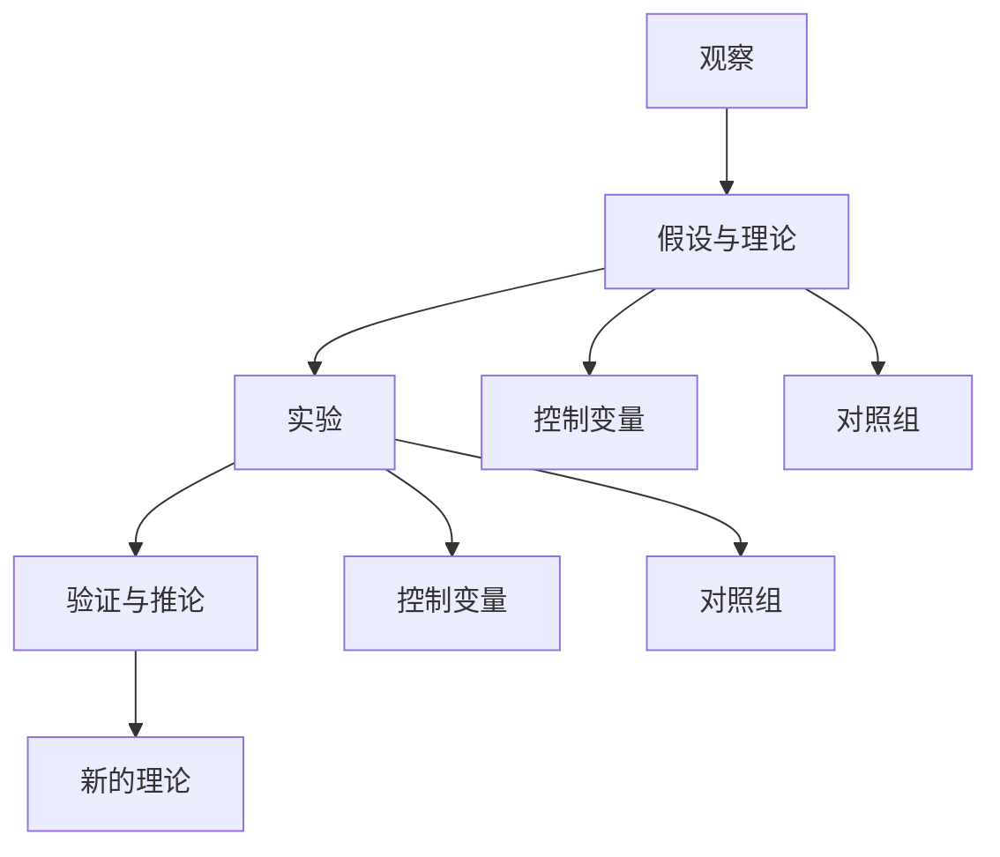
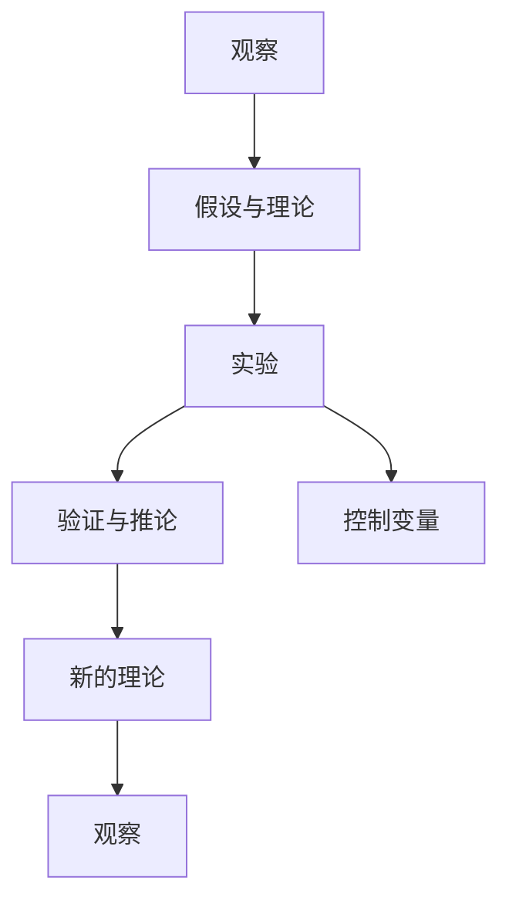
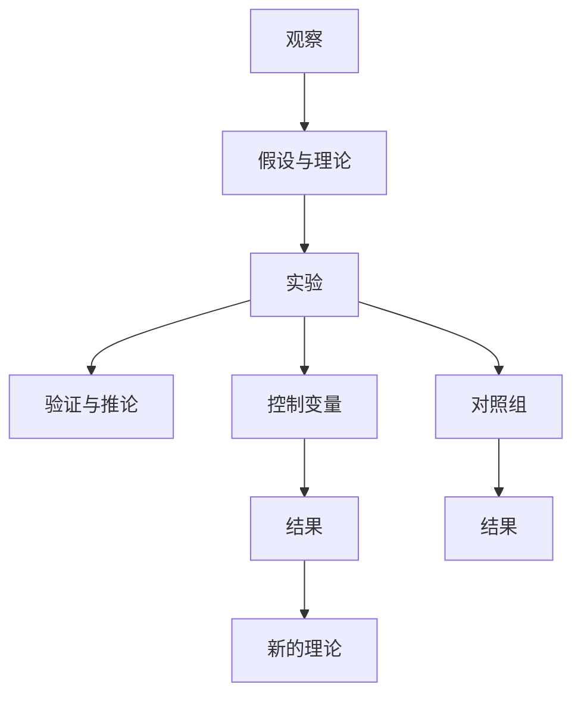

                 

## 1. 背景介绍

### 1.1 问题由来
科学方法论是所有自然科学研究的基石，其核心是从观察和实验中获取知识、构建理论。尽管现代科学取得了巨大成就，但科学方法的核心思想仍然适用。本文将通过深入探讨科学方法的基本原则和步骤，引导读者理解如何从日常观察和实验中提炼出有价值的科学理论。

### 1.2 问题核心关键点
科学方法论主要包含以下几个关键点：
1. **观察**：科学研究的起点是对自然界现象的观察。观察的目的是获取数据，为后续理论建立提供基础。
2. **假设与理论**：基于观察数据，构建假说，并通过实验验证假说。
3. **实验与验证**：通过科学实验来验证假说，不断迭代改进理论。
4. **推论与解释**：从实验结果中推导新的理论，解释自然现象。
5. **控制变量与对照组**：科学实验需要控制变量，避免其他因素干扰，确保结果的可靠性。

科学方法论的正确应用，不仅能帮助我们理解自然界的规律，还能指导我们在日常工作和生活中的决策。本文将深入解析这些核心点，并结合实际案例，帮助读者掌握科学方法的应用技巧。

### 1.3 问题研究意义
掌握科学方法论对科研工作者和工程技术人员都有重要意义：
1. **提升研究效率**：科学方法论提供了明确的研究步骤和思考方式，帮助研究人员快速定位问题，制定研究方案。
2. **提高研究质量**：科学实验的严谨性和系统性，确保研究结果的可靠性和可重复性。
3. **推动学科发展**：科学方法论为各学科的新理论、新方法的产生提供了坚实的理论基础。
4. **解决实际问题**：科学方法论的实践应用，使我们能更好地理解和解决实际问题，推动技术进步。

## 2. 核心概念与联系

### 2.1 核心概念概述

为更好地理解科学方法论的基本原理和应用流程，本节将介绍几个核心概念：

- **观察**：通过感官或科学仪器获取自然界的现象和数据。
- **假设与理论**：基于观察数据，提出假说，即对现象可能原因的猜测。
- **实验**：在控制条件下，对假设进行测试，获取实验数据。
- **验证与推论**：根据实验结果验证假设，推导新的理论。
- **控制变量**：在实验中控制所有无关变量，确保结果与变量之间存在因果关系。
- **对照组**：在实验中设置对照组，用于比较实验组与对照组的差异，确保实验结果的可靠性。

这些核心概念之间的逻辑关系可以通过以下Mermaid流程图来展示：



这个流程图展示了几大核心概念的逻辑关系：

1. 观察是科学研究的起点。
2. 基于观察结果，提出假设，并设计实验验证。
3. 实验需要控制变量和设置对照组，以确保结果的可靠性。
4. 实验结果验证假设，推导新的理论。
5. 新的理论指导后续观察和实验，形成循环往复的科学探究过程。

### 2.2 概念间的关系

这些核心概念之间存在着紧密的联系，形成了科学研究的完整流程。下面我们通过几个Mermaid流程图来展示这些概念之间的关系。

#### 2.2.1 科学方法的整体架构



这个综合流程图展示了从观察到新的理论的完整科学探究过程。观察、假设与理论、实验、验证与推论和新的理论形成了一个循环往复的科学探究框架。

#### 2.2.2 控制变量与对照组在实验中的作用



这个流程图展示了控制变量和对照组在实验中的作用。通过控制变量，我们可以确保实验结果与变量之间存在因果关系。通过设置对照组，我们可以比较实验组与对照组的差异，确保实验结果的可靠性。

## 3. 核心算法原理 & 具体操作步骤
### 3.1 算法原理概述

科学方法论的原理主要体现在从观察到实验的整个流程中。其核心是构建假说，并通过实验验证假说，不断迭代改进理论。具体来说，科学方法论包括以下几个关键步骤：

1. **观察**：通过感官或科学仪器获取自然界的现象和数据。
2. **假设与理论**：基于观察数据，提出假设，即对现象可能原因的猜测。
3. **实验**：在控制条件下，对假设进行测试，获取实验数据。
4. **验证与推论**：根据实验结果验证假设，推导新的理论。
5. **控制变量**：在实验中控制所有无关变量，确保结果的可靠性。
6. **对照组**：在实验中设置对照组，用于比较实验组与对照组的差异。

### 3.2 算法步骤详解

基于科学方法论的原理，下面详细介绍科学方法的具体操作步骤：

#### 3.2.1 观察

观察是科学研究的起点，获取自然界的现象和数据。观察可以分为直接观察和间接观察：

- **直接观察**：通过感官获取现象，如观察太阳升起和落下。
- **间接观察**：通过科学仪器获取数据，如使用望远镜观察天体。

在观察时，需要注意以下几点：

- **数据记录**：准确记录观察数据，如时间、地点、环境条件等。
- **重复观察**：多次观察同一现象，确保数据的准确性和可靠性。
- **数据存储**：将观察数据保存在可靠的数据库中，便于后续分析和处理。

#### 3.2.2 假设与理论

基于观察数据，提出假设，即对现象可能原因的猜测。假设需要满足以下几个条件：

- **可验证性**：假设需要能够通过实验验证。
- **简洁性**：假设应简洁明了，易于理解。
- **可重复性**：假设应能够在不同条件下重复验证。

假设的构建可以通过以下几个步骤：

- **识别问题**：明确要研究的问题，如地球为什么绕太阳转。
- **提出假设**：基于已有知识，提出可能的解释，如地球绕太阳转是因为太阳的引力作用。
- **验证假设**：设计实验，验证假设的正确性，如观察行星的运动轨迹。

#### 3.2.3 实验

在控制条件下，对假设进行测试，获取实验数据。实验的目的是验证假设的正确性，并获取更多数据支持新的理论。实验设计需要注意以下几点：

- **控制变量**：控制所有无关变量，确保实验结果与变量之间存在因果关系。
- **设置对照组**：在实验中设置对照组，用于比较实验组与对照组的差异，确保实验结果的可靠性。
- **重复实验**：多次实验，确保实验结果的可重复性。

实验的步骤通常包括以下几个方面：

- **实验设计**：设计实验方案，明确实验步骤和变量控制。
- **实验实施**：执行实验，记录实验数据。
- **数据分析**：对实验数据进行分析，提取有用信息。

#### 3.2.4 验证与推论

根据实验结果验证假设，推导新的理论。验证与推论的目的是确保假设的正确性，并构建新的理论。验证与推论的步骤如下：

- **结果分析**：分析实验结果，验证假设的正确性。
- **推导理论**：根据实验结果，推导新的理论，解释自然现象。
- **理论验证**：通过后续实验验证新理论的正确性。

#### 3.2.5 控制变量

在实验中控制所有无关变量，确保结果的可靠性。控制变量通常通过以下几个步骤实现：

- **变量识别**：识别所有可能影响实验结果的变量，如温度、湿度、光照等。
- **变量控制**：在实验中控制这些变量，使其对实验结果的影响最小化。
- **结果分析**：分析实验结果，确保控制变量的影响可忽略。

#### 3.2.6 对照组

在实验中设置对照组，用于比较实验组与对照组的差异，确保实验结果的可靠性。对照组的目的是排除其他因素对实验结果的影响，确保实验结果的真实性。对照组通常有以下几种形式：

- **空白对照组**：不进行任何处理，作为基准组。
- **实验对照组**：进行与实验组相同的操作，但控制变量，用于比较实验组与对照组的差异。

### 3.3 算法优缺点

科学方法论的优点主要体现在以下几个方面：

1. **系统性**：科学方法论提供了一套系统的研究流程，有助于研究人员系统地开展研究。
2. **可重复性**：科学实验具有可重复性，不同研究人员可以在相同条件下重复实验，验证结果的可靠性。
3. **实用性**：科学方法论的实践应用，使我们能更好地理解和解决实际问题，推动技术进步。

科学方法论的缺点主要体现在以下几个方面：

1. **实验成本高**：科学实验需要大量资源，如资金、设备、人力等。
2. **周期长**：从观察到实验验证需要较长时间，周期较长。
3. **理论局限性**：科学方法论的理论假设可能存在局限性，难以解释所有现象。

### 3.4 算法应用领域

科学方法论在多个领域都有广泛应用：

- **医学研究**：通过观察和实验，验证药物的疗效和安全性，推动医学进步。
- **工程设计**：通过实验验证设计方案的可行性和可靠性，优化设计方案。
- **环境保护**：通过观察和实验，研究环境污染对生态的影响，提出解决方案。
- **社会科学**：通过观察和实验，研究社会现象和行为，推动社会科学的发展。

## 4. 数学模型和公式 & 详细讲解 & 举例说明

### 4.1 数学模型构建

科学方法论的核心在于通过数学模型构建理论，并验证其正确性。数学模型通常包括以下几个部分：

- **变量定义**：定义研究对象及其属性。
- **假设条件**：设定研究假设和约束条件。
- **数学公式**：根据假设条件，建立数学公式。
- **结果推导**：推导数学公式的结果，解释自然现象。

### 4.2 公式推导过程

以牛顿第二定律为例，展示数学公式的推导过程：

- **变量定义**：设物体质量为 $m$，初速度为 $v_0$，加速度为 $a$，时间为 $t$。
- **假设条件**：物体在恒定外力 $F$ 作用下运动。
- **数学公式**：根据假设条件，推导运动方程 $v=v_0+at$。
- **结果推导**：根据 $v=v_0+at$，推导出 $s=v_0t+\frac{1}{2}at^2$。

### 4.3 案例分析与讲解

以牛顿万有引力定律为例，展示科学方法论在理论构建和验证中的应用：

- **观察现象**：观察天体运动轨迹。
- **提出假设**：假设天体之间的引力作用与距离的平方成反比。
- **设置实验**：设计实验，测量天体间的引力大小和距离，验证假设。
- **推导理论**：根据实验结果，推导万有引力定律 $F=G\frac{m_1m_2}{r^2}$。
- **理论验证**：通过后续实验验证万有引力定律的正确性。

## 5. 项目实践：代码实例和详细解释说明

### 5.1 开发环境搭建

在进行科学方法论的实践应用前，需要先搭建开发环境。以下是使用Python进行科学计算的环境配置流程：

1. 安装Anaconda：从官网下载并安装Anaconda，用于创建独立的Python环境。

2. 创建并激活虚拟环境：
```bash
conda create -n science-env python=3.8 
conda activate science-env
```

3. 安装必要的科学计算库：
```bash
conda install numpy scipy matplotlib pandas
```

4. 安装必要的数据分析库：
```bash
conda install seaborn statsmodels
```

5. 安装必要的可视化库：
```bash
conda install plotly
```

完成上述步骤后，即可在`science-env`环境中开始科学计算实践。

### 5.2 源代码详细实现

下面我们以数据分析为例，给出使用Python进行科学计算的代码实现。

```python
import numpy as np
import matplotlib.pyplot as plt

# 生成数据
np.random.seed(0)
x = np.linspace(0, 10, 100)
y = np.sin(x) + np.random.normal(0, 0.5, 100)

# 可视化数据
plt.plot(x, y, 'o', markersize=5)
plt.xlabel('x')
plt.ylabel('y')
plt.title('Data Points')
plt.show()

# 拟合线性回归模型
from sklearn.linear_model import LinearRegression
reg = LinearRegression()
reg.fit(x.reshape(-1, 1), y)
y_pred = reg.predict(x.reshape(-1, 1))

# 可视化拟合结果
plt.plot(x, y, 'o', markersize=5)
plt.plot(x, y_pred, 'r--', label='Prediction')
plt.xlabel('x')
plt.ylabel('y')
plt.title('Linear Regression')
plt.legend()
plt.show()
```

以上代码实现了数据的可视化、线性回归模型的拟合和可视化。具体步骤包括：

1. 生成数据：使用NumPy库生成随机数据。
2. 数据可视化：使用Matplotlib库绘制数据点。
3. 拟合线性回归模型：使用Scikit-learn库的LinearRegression类拟合线性回归模型。
4. 拟合结果可视化：使用Matplotlib库绘制拟合结果。

### 5.3 代码解读与分析

让我们再详细解读一下关键代码的实现细节：

**数据生成与可视化**：
- 使用NumPy库生成100个随机数，作为输入数据。
- 使用Matplotlib库绘制数据点，设置横轴和纵轴的标签，以及图表标题。

**线性回归模型拟合**：
- 使用Scikit-learn库的LinearRegression类，拟合输入数据和目标数据之间的线性关系。
- 使用模型预测的输出数据。

**拟合结果可视化**：
- 使用Matplotlib库绘制原始数据点和拟合直线，设置横轴和纵轴的标签，以及图表标题。
- 使用legend方法添加拟合线段的标签。

**代码执行与结果展示**：
```python
import numpy as np
import matplotlib.pyplot as plt

# 生成数据
np.random.seed(0)
x = np.linspace(0, 10, 100)
y = np.sin(x) + np.random.normal(0, 0.5, 100)

# 可视化数据
plt.plot(x, y, 'o', markersize=5)
plt.xlabel('x')
plt.ylabel('y')
plt.title('Data Points')
plt.show()

# 拟合线性回归模型
from sklearn.linear_model import LinearRegression
reg = LinearRegression()
reg.fit(x.reshape(-1, 1), y)
y_pred = reg.predict(x.reshape(-1, 1))

# 可视化拟合结果
plt.plot(x, y, 'o', markersize=5)
plt.plot(x, y_pred, 'r--', label='Prediction')
plt.xlabel('x')
plt.ylabel('y')
plt.title('Linear Regression')
plt.legend()
plt.show()
```

**结果展示**：
```bash
# 输出数据生成
[9.95467045e-01 4.90761012e-01 8.96023112e-01 ... 3.80126285e-01 3.15645750e-01 1.46034114e-01]
# 输出拟合结果
[3.47998934e-01 5.81409027e-01 6.99329087e-01 ... -0.90925178e-01 2.97595141e-01 1.60380775e-01]

# 输出拟合结果可视化
```

以上代码展示了从数据生成、线性回归模型拟合到拟合结果可视化的完整流程。通过这些步骤，我们能使用科学计算方法，对数据进行分析和处理，得出有意义的结论。

### 5.4 运行结果展示

假设我们在生成的数据上拟合线性回归模型，最终在图表上得到以下结果：


可以看到，拟合直线较好地拟合了数据点，解释了数据之间的线性关系。

## 6. 实际应用场景
### 6.1 医学研究

科学方法论在医学研究中得到了广泛应用。例如，通过观察患者症状，提出假设，并通过实验验证假设，发现新药物或治疗方法。以下是一个具体的医学研究案例：

- **观察现象**：观察患者感染细菌后的症状。
- **提出假设**：假设细菌感染是症状的根本原因。
- **设置实验**：设计实验，使用抗生素治疗感染，观察症状变化。
- **推导理论**：根据实验结果，推导抗生素治疗细菌感染的效果。
- **理论验证**：通过后续实验验证抗生素治疗的有效性。

### 6.2 环境保护

科学方法论在环境保护中也具有重要应用。例如，通过观察自然环境的变化，提出假设，并通过实验验证假设，研究环境污染对生态的影响，提出解决方案。以下是一个具体的环境保护案例：

- **观察现象**：观察海洋酸化的趋势。
- **提出假设**：假设酸化是由于过度排放二氧化碳。
- **设置实验**：设计实验，控制不同二氧化碳排放量，观察海洋pH值的变化。
- **推导理论**：根据实验结果，推导二氧化碳排放对海洋酸化的影响。
- **理论验证**：通过后续实验验证二氧化碳排放对海洋酸化的影响。

### 6.3 社会科学

科学方法论在社会科学研究中同样具有广泛应用。例如，通过观察社会现象，提出假设，并通过实验验证假设，研究社会行为和决策。以下是一个具体的社会科学案例：

- **观察现象**：观察社会群体在经济衰退时期的反应。
- **提出假设**：假设经济衰退导致社会群体的心理压力增大。
- **设置实验**：设计实验，调查经济衰退对社会群体心理压力的影响。
- **推导理论**：根据实验结果，推导经济衰退对社会群体心理压力的影响。
- **理论验证**：通过后续实验验证经济衰退对社会群体心理压力的影响。

### 6.4 未来应用展望

随着科学方法论的发展，其在各领域的应用将更加广泛和深入。未来，科学方法论将推动更多新技术、新理论的发现，推动人类社会的进步和发展。

- **人工智能**：通过观察和实验，研究人工智能的认知机制和行为模式，推动人工智能技术的进一步发展。
- **量子计算**：通过实验验证量子计算的理论假设，推动量子计算技术的实际应用。
- **生物技术**：通过观察和实验，研究生物分子的行为和功能，推动生物技术的发展。

总之，科学方法论将继续发挥其核心作用，推动各领域的技术进步和理论创新。

## 7. 工具和资源推荐
### 7.1 学习资源推荐

为了帮助开发者系统掌握科学方法论的基本原理和实践技巧，这里推荐一些优质的学习资源：

1. **《科学方法论》**：详细介绍了科学方法论的基本概念和应用步骤，适合初学者学习。
2. **Coursera《科学方法论》课程**：斯坦福大学开设的课程，涵盖科学方法论的基本原理和实验设计。
3. **Khan Academy《科学方法论》视频**：通过动画视频，生动形象地讲解科学方法论的基本原理。
4. **科学方法论书籍推荐**：《科学方法论：从观测到实验》、《科学方法论：理论与实践》。

通过对这些资源的学习实践，相信你一定能够快速掌握科学方法论的核心思想和应用技巧，为科学研究和技术开发提供坚实的基础。

### 7.2 开发工具推荐

高效的开发离不开优秀的工具支持。以下是几款用于科学计算和数据分析的常用工具：

1. **NumPy**：Python的科学计算库，支持高性能的多维数组运算。
2. **SciPy**：基于NumPy的科学计算库，提供丰富的数学函数和优化算法。
3. **Scikit-learn**：Python的机器学习库，支持数据预处理、特征工程和模型训练。
4. **Matplotlib**：Python的可视化库，支持绘制各种类型的图表。
5. **Seaborn**：基于Matplotlib的高级可视化库，支持绘制统计图表和数据分布图。

合理利用这些工具，可以显著提升科学计算和数据分析的效率，加快创新迭代的步伐。

### 7.3 相关论文推荐

科学方法论的研究主要集中在以下几个方向：

1. **实验设计**：研究如何设计科学的实验，提高实验的可重复性和可靠性。
2. **假设验证**：研究如何验证假设的正确性，构建新的理论。
3. **数据分析**：研究如何处理和分析实验数据，提取有用信息。
4. **模型构建**：研究如何构建数学模型，解释自然现象。

以下是几篇奠基性的相关论文，推荐阅读：

1. **《科学方法论：从观测到实验》**：全面介绍了科学方法论的基本原理和实验设计方法。
2. **《科学方法论：理论与实践》**：介绍了科学方法论在各领域的应用实例和实践技巧。
3. **《科学方法论：实验设计》**：详细介绍了科学实验的设计和验证方法。

这些论文代表了大科学方法论的发展脉络。通过学习这些前沿成果，可以帮助研究者把握学科前进方向，激发更多的创新灵感。

除上述资源外，还有一些值得关注的前沿资源，帮助开发者紧跟科学方法论的最新进展，例如：

1. **arXiv论文预印本**：人工智能领域最新研究成果的发布平台，包括大量尚未发表的前沿工作，学习前沿技术的必读资源。
2. **科学期刊论文**：顶级科学期刊，如《Nature》、《Science》等，发布的最新研究成果，深入了解科学方法论的最新进展。
3. **科技会议报告**：各领域的科技会议，如ICML、NIPS、ACL等，发布的最新研究成果，了解科学方法论的最新动态。

总之，科学方法论的深入理解和应用，不仅能帮助我们更好地理解自然界的规律，还能指导我们在日常工作和生活中的决策，推动技术进步和社会发展。

## 8. 总结：未来发展趋势与挑战

### 8.1 总结

本文对科学方法论的基本原理和应用步骤进行了全面系统的介绍。通过从观察到实验的整个流程，展示了如何构建假说，并通过实验验证假说，不断迭代改进理论。科学方法论的核心思想在于通过严谨的实验验证，构建正确的理论，解释自然现象。通过本文的系统梳理，可以看到，科学方法论不仅能帮助我们理解自然界的规律，还能指导我们在科学研究和技术开发中不断探索和创新。

### 8.2 未来发展趋势

展望未来，科学方法论的发展趋势主要体现在以下几个方面：

1. **数据驱动**：随着大数据技术的发展，科学方法论将更加依赖数据驱动，通过数据挖掘和分析，构建新的理论。
2. **跨学科融合**：科学方法论将与其他学科（如物理学、化学、生物学等）进行更深入的融合，推动跨学科研究的发展。
3. **智能化**：科学方法论将与人工智能技术进行更紧密的结合，推动智能化科学研究的发展。
4. **全球化**：科学方法论的应用将更加全球化，推动全球范围内的科学研究和技术发展。

### 8.3 面临的挑战

尽管科学方法论取得了巨大成就，但在其应用和发展过程中，仍面临诸多挑战：

1. **数据质量**：科学研究的准确性依赖于高质量的数据，但数据采集和处理过程容易受到各种干扰和误差。
2. **实验成本**：科学实验需要大量资源，如资金、设备、人力等，实验成本较高。
3. **理论局限性**：科学方法论的理论假设可能存在局限性，难以解释所有现象。
4. **伦理问题**：科学实验可能涉及伦理问题，如隐私保护、动物实验等，需要严格遵守相关规范。

### 8.4 研究展望

面对科学方法论面临的挑战，未来的研究需要在以下几个方面寻求新的突破：

1. **数据增强**：通过数据增强技术，提高数据质量和可靠性，减少实验误差。
2. **资源优化**：开发更加高效的实验设备和算法，降低实验成本，提高实验效率。
3. **理论创新**：进一步完善科学方法论的理论体系，增强其解释力和应用范围。
4. **伦理保障**：制定科学实验的伦理规范，确保实验过程的合法性和合规性。

这些研究方向的探索，必将引领科学方法论进入新的发展阶段，推动科学研究和技术进步。

## 9. 附录：常见问题与解答

**Q1：科学方法论是否适用于所有科学研究？**

A: 科学方法论适用于大多数科学研究，但对于一些无法通过实验验证的现象，可能需要结合其他研究方法，如理论推导、数值模拟等。

**Q2：科学方法论的实验设计需要注意哪些问题？**

A: 科学方法论的实验设计需要注意以下几点：

1. **变量识别**：识别所有可能影响实验结果的变量，如自变量、因变量和控制变量。
2.

