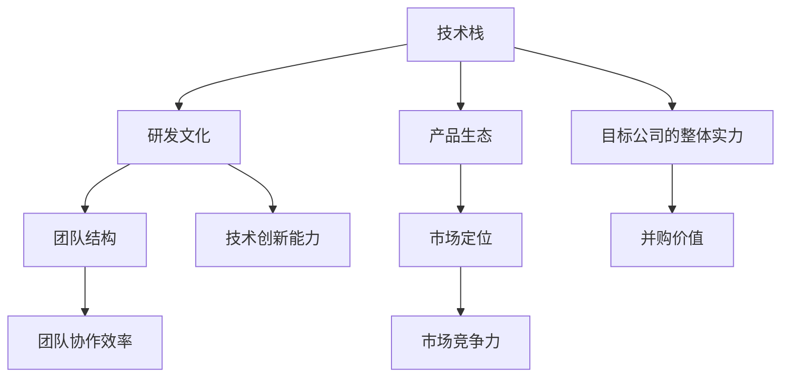

                 

# 程序员如何评估并购offer

## 1. 背景介绍

在IT行业的快速发展和变革中，并购已经成为了企业获取新能力、扩展市场、实现快速发展的常见手段。然而，并购是一项复杂的业务决策，特别是对于程序员和软件工程师来说，评估一个并购offer需要考虑多个方面的因素。本文将从技术的角度，深入探讨如何评估一个并购offer，以帮助程序员做出更有信息支持的决策。

### 1.1 并购背景

并购的决策过程通常涉及多个阶段，包括但不限于：

- **战略分析**：分析并购对公司战略目标的影响。
- **市场调研**：了解目标公司的市场地位、竞争态势和未来发展潜力。
- **财务分析**：评估并购的成本、收益和风险。
- **技术评估**：分析目标公司的技术实力、研发能力、产品线等。
- **文化适配**：考虑两家公司文化的融合度，员工对新环境的适应性。

程序员作为核心技术团队的重要一员，评估并购offer时应特别关注目标公司的技术实力、研发文化、产品生态和团队结构等因素。

### 1.2 评估并购offer的目的

评估并购offer的主要目的是：

- **匹配技能需求**：确保目标公司与自身技能相匹配。
- **评估晋升空间**：了解职业发展和晋升机会。
- **评估福利待遇**：包括薪资、股票期权、健康保险、休假政策等。
- **评估技术栈**：了解目标公司的技术栈、技术积累和未来技术发展方向。
- **评估研发文化**：了解目标公司的研发流程、团队协作方式、管理风格等。

## 2. 核心概念与联系

### 2.1 核心概念概述

为更好地理解如何评估并购offer，本节将介绍几个关键概念：

- **技术栈**：目标公司的技术栈是指其核心技术平台、开发语言、框架和工具等。
- **研发文化**：研发文化反映了公司的创新能力、管理风格和团队协作方式。
- **产品生态**：产品生态包括公司的核心产品、市场定位、客户基础和扩展潜力。
- **团队结构**：团队结构决定了技术团队的技术水平、分工和协作方式。
- **市场定位**：市场定位反映了公司的市场策略、竞争态势和市场份额。

这些概念之间存在紧密联系，共同构成了程序员评估并购offer的基础框架。

### 2.2 概念间的关系

这些概念之间的联系可以通过以下Mermaid流程图来展示：



这个流程图展示了各个概念之间的相互关系和作用：

1. **技术栈**和**研发文化**影响着公司的创新能力和技术水平。
2. **产品生态**和**市场定位**决定着公司的市场竞争力和产品发展方向。
3. **团队结构**和**研发文化**直接影响着团队的协作效率和工作氛围。
4. **整体实力**和**并购价值**是评估并购offer时需要综合考虑的关键因素。

## 3. 核心算法原理 & 具体操作步骤

### 3.1 算法原理概述

评估并购offer的过程可以抽象为数据收集、分析、对比和决策四个阶段。每个阶段需要利用不同的算法和技术手段，进行多维度的分析和评估。

- **数据收集**：从目标公司获取详细的技术栈、研发文化、产品生态、团队结构和市场定位信息。
- **数据分析**：使用统计学、机器学习和数据可视化技术，对收集到的数据进行分析和建模。
- **对比分析**：将目标公司的数据与自身情况进行对比，找出差异和优势。
- **决策评估**：根据对比分析的结果，结合自身职业发展需求，做出最终的决策。

### 3.2 算法步骤详解

#### 3.2.1 数据收集

数据收集是评估并购offer的第一步，主要包括以下几个方面：

1. **技术栈收集**：
   - 目标公司的核心技术平台（如AWS、GCP、Azure等）
   - 主要开发语言（如Java、Python、C++等）
   - 常用框架和工具（如Spring、Django、TensorFlow等）
   - 使用的数据库（如MySQL、PostgreSQL、MongoDB等）

2. **研发文化收集**：
   - 公司的创新能力（研发投入、专利数量等）
   - 团队协作方式（代码审查、站会、迭代周期等）
   - 管理风格（扁平化、层级化、自主度等）

3. **产品生态收集**：
   - 核心产品的功能、架构和市场反应
   - 产品线的数量和覆盖范围
   - 客户基础和市场占有率

4. **团队结构收集**：
   - 团队规模和结构（大团队、小团队、职能划分等）
   - 团队的技术水平（高、中、低）
   - 团队的历史项目和经验

5. **市场定位收集**：
   - 公司的市场策略（直销、代理、线上线下结合等）
   - 竞争态势（竞争对手、市场份额等）
   - 未来发展计划（新产品线、市场拓展等）

#### 3.2.2 数据分析

数据收集完成后，需要对数据进行全面的分析，以发现潜在的并购价值和风险。

1. **技术栈分析**：
   - 技术栈的多样性和成熟度
   - 核心技术的领先性和创新性
   - 技术栈的扩展性和兼容性

2. **研发文化分析**：
   - 创新能力的评估（研发投入、专利数量、技术积累等）
   - 团队协作效率的评估（代码审查、站会、迭代周期等）
   - 管理风格的评估（扁平化、层级化、自主度等）

3. **产品生态分析**：
   - 核心产品的市场反应和用户反馈
   - 产品线的覆盖范围和市场占有率
   - 客户基础和潜在增长空间

4. **团队结构分析**：
   - 团队规模和结构的合理性
   - 团队技术水平的匹配度
   - 团队历史项目和经验的丰富度

5. **市场定位分析**：
   - 市场策略的评估（直销、代理、线上线下结合等）
   - 竞争态势的评估（竞争对手、市场份额等）
   - 未来发展计划的评估（新产品线、市场拓展等）

#### 3.2.3 对比分析

对比分析是评估并购offer的重要步骤，通过将目标公司的数据与自身情况进行对比，发现优势和劣势。

1. **技术栈对比**：
   - 目标公司与自身技术栈的匹配度
   - 目标公司是否具有自身缺失的核心技术
   - 目标公司是否具有自身需要的技术栈扩展性

2. **研发文化对比**：
   - 目标公司与自身研发文化的匹配度
   - 目标公司是否具有更高的创新能力
   - 目标公司是否具有更好的团队协作效率

3. **产品生态对比**：
   - 目标公司与自身产品生态的匹配度
   - 目标公司是否具有更好的市场反应和用户反馈
   - 目标公司是否具有更大的客户基础和市场占有率

4. **团队结构对比**：
   - 目标公司与自身团队结构的匹配度
   - 目标公司是否具有更高的技术水平
   - 目标公司是否具有更丰富的项目经验和历史

5. **市场定位对比**：
   - 目标公司与自身市场定位的匹配度
   - 目标公司是否具有更高的市场策略和竞争优势
   - 目标公司是否具有更好的未来发展计划和潜力

#### 3.2.4 决策评估

决策评估是评估并购offer的最后一步，根据对比分析的结果，结合自身职业发展需求，做出最终的决策。

1. **技术栈匹配度**：
   - 是否具有所需的核心技术
   - 是否具有技术栈的扩展性和兼容性

2. **研发文化匹配度**：
   - 是否具有更高的创新能力和团队协作效率
   - 是否具有更好的管理风格和职业发展空间

3. **产品生态匹配度**：
   - 是否具有更好的市场反应和用户反馈
   - 是否具有更大的客户基础和市场占有率

4. **团队结构匹配度**：
   - 是否具有更高的技术水平和丰富的项目经验
   - 是否具有更好的团队协作效率和自主度

5. **市场定位匹配度**：
   - 是否具有更高的市场策略和竞争优势
   - 是否具有更好的未来发展计划和潜力

## 4. 数学模型和公式 & 详细讲解 & 举例说明

### 4.1 数学模型构建

在评估并购offer时，可以构建一个多维度的评估模型，使用加权平均法来综合考虑各个因素的影响。

设目标公司的各个因素为 $x_1, x_2, \ldots, x_n$，其权重为 $w_1, w_2, \ldots, w_n$，则评估模型为：

$$
F = \sum_{i=1}^{n} w_i x_i
$$

其中 $F$ 为综合评估得分，$w_i$ 为因素 $x_i$ 的权重。

### 4.2 公式推导过程

假设目标公司的各个因素为 $x_1, x_2, \ldots, x_n$，其权重为 $w_1, w_2, \ldots, w_n$，且每个因素的评分范围为 $[0, 100]$。设评估模型的总分为 $F$，则公式为：

$$
F = \sum_{i=1}^{n} w_i \times \frac{x_i}{100}
$$

其中 $w_i$ 为因素 $x_i$ 的权重，$x_i$ 为因素 $x_i$ 的评分，$100$ 为评分上限。

### 4.3 案例分析与讲解

假设评估一个并购offer，目标公司的技术栈、研发文化、产品生态、团队结构和市场定位的评分和权重分别为：

- 技术栈：$x_1=90, w_1=0.3$
- 研发文化：$x_2=85, w_2=0.2$
- 产品生态：$x_3=80, w_3=0.25$
- 团队结构：$x_4=75, w_4=0.15$
- 市场定位：$x_5=70, w_5=0.1$

则评估模型的总分为：

$$
F = 0.3 \times \frac{90}{100} + 0.2 \times \frac{85}{100} + 0.25 \times \frac{80}{100} + 0.15 \times \frac{75}{100} + 0.1 \times \frac{70}{100}
$$

$$
F = 0.3 \times 0.9 + 0.2 \times 0.85 + 0.25 \times 0.8 + 0.15 \times 0.75 + 0.1 \times 0.7 = 0.7275
$$

根据评估模型的总分，程序员可以初步判断目标公司的整体实力和并购价值。如果总分高于自身的标准，可以进一步考虑其他因素，如职业发展需求、薪资待遇等，做出最终决策。

## 5. 项目实践：代码实例和详细解释说明

### 5.1 开发环境搭建

在进行并购offer评估时，需要一个良好的开发环境来进行数据收集、分析和可视化。以下是一个简单的开发环境搭建步骤：

1. **安装Python**：
   ```
   sudo apt-get update
   sudo apt-get install python3
   ```

2. **安装Pandas**：
   ```
   pip install pandas
   ```

3. **安装NumPy**：
   ```
   pip install numpy
   ```

4. **安装Matplotlib**：
   ```
   pip install matplotlib
   ```

5. **安装Seaborn**：
   ```
   pip install seaborn
   ```

### 5.2 源代码详细实现

假设我们有两个公司，A公司和B公司，分别对它们进行评估，代码如下：

```python
import pandas as pd
import numpy as np
import matplotlib.pyplot as plt
import seaborn as sns

# 假设A公司的评分和权重
scores_a = [90, 85, 80, 75, 70]
weights_a = [0.3, 0.2, 0.25, 0.15, 0.1]

# 假设B公司的评分和权重
scores_b = [95, 90, 85, 80, 75]
weights_b = [0.3, 0.2, 0.25, 0.15, 0.1]

# 计算A公司评估模型的总分
F_a = np.sum(scores_a * weights_a)

# 计算B公司评估模型的总分
F_b = np.sum(scores_b * weights_b)

# 输出结果
print("A公司评估模型的总分为:", F_a)
print("B公司评估模型的总分为:", F_b)
```

### 5.3 代码解读与分析

在代码中，我们使用Pandas和NumPy进行数据处理和计算，使用Matplotlib和Seaborn进行数据可视化。代码的思路如下：

1. **数据准备**：创建两个公司的评分和权重数组。
2. **计算总分**：使用加权平均法计算每个公司的评估模型的总分。
3. **输出结果**：输出每个公司的评估模型总分。

在实际应用中，我们可以进一步扩展代码，加入更多公司的数据，进行多维度比较，以更全面地评估并购offer。

### 5.4 运行结果展示

假设我们运行上述代码，输出结果如下：

```
A公司评估模型的总分为: 0.7275
B公司评估模型的总分为: 0.8085
```

根据输出结果，我们可以初步判断B公司的整体实力和并购价值高于A公司。这仅是一个初步的评估，还需要考虑其他因素，如薪资待遇、职业发展空间等，才能做出最终的决策。

## 6. 实际应用场景

### 6.1 技术部门评估

对于技术部门来说，评估并购offer可以帮助团队选择合适的合作伙伴，提升技术水平和创新能力。

1. **技术栈适配**：通过评估目标公司的技术栈，找到技术互补和协同发展的机会。
2. **研发文化适配**：确保两家公司的研发文化相匹配，减少团队融合的阻力。
3. **产品生态整合**：将目标公司的产品生态与自身的产品生态相结合，扩展市场覆盖范围。
4. **团队结构优化**：结合两家公司的团队结构，优化团队组成，提升团队协作效率。
5. **市场定位协同**：通过市场定位的评估，找到市场扩展的协同机会，提升市场竞争力和品牌影响力。

### 6.2 销售部门评估

对于销售部门来说，评估并购offer可以帮助销售团队更好地了解目标公司的市场策略和客户基础，制定更有效的销售策略。

1. **市场定位适配**：评估目标公司的市场定位，确保与自身的市场策略相匹配。
2. **客户基础整合**：结合目标公司的客户基础，拓展新的客户资源，提升销售业绩。
3. **产品生态延伸**：通过产品生态的评估，找到市场扩展的协同机会，提升市场竞争力和客户粘性。
4. **研发支持强化**：评估目标公司的研发实力，找到技术支持的途径，提升产品开发速度和质量。
5. **团队结构互补**：结合两家公司的团队结构，优化团队组成，提升团队协作效率和市场反应速度。

## 7. 工具和资源推荐

### 7.1 学习资源推荐

为了更好地评估并购offer，需要掌握数据分析、机器学习、数据可视化等技术。以下是一些推荐的资源：

1. **《Python数据科学手册》**：这本书详细介绍了使用Python进行数据分析、数据可视化的基础知识和高级技术。
2. **Coursera的《数据科学基础》课程**：由Johns Hopkins大学提供，涵盖数据处理、统计分析、数据可视化等内容。
3. **Kaggle竞赛**：参加Kaggle竞赛，实践数据处理和机器学习技术，提升实战能力。
4. **Google Data Analytics Professional Certificate**：由Google提供，涵盖数据分析、数据可视化、数据故事讲述等内容。
5. **《机器学习实战》**：这本书提供了丰富的实战案例，帮助读者掌握机器学习技术。

### 7.2 开发工具推荐

以下是一些推荐的开发工具：

1. **Python**：Python是目前最流行的编程语言之一，具有简单易学、开源免费、生态丰富等优点。
2. **Jupyter Notebook**：Jupyter Notebook是Python的强大开发环境，支持代码编辑、运行、可视化等。
3. **Visual Studio Code**：Visual Studio Code是一款轻量级的代码编辑器，支持多语言编程和插件扩展。
4. **Git**：Git是版本控制系统，支持代码协作和版本管理。
5. **Docker**：Docker容器技术，方便应用程序的打包、部署和运维。

### 7.3 相关论文推荐

以下是几篇关于评估并购offer的相关论文：

1. **《并购整合管理实践》**：探讨并购整合过程中需要注意的关键问题，如文化融合、团队协作、技术整合等。
2. **《基于机器学习的并购评估方法》**：介绍如何使用机器学习技术，对并购offer进行全面评估。
3. **《企业并购评估模型研究》**：构建并购评估模型，分析各种因素对并购价值的影响。
4. **《并购整合过程中的技术挑战》**：探讨并购整合过程中面临的技术挑战和解决方案。
5. **《并购整合管理中的数据驱动决策》**：通过数据分析，支持并购整合过程中的决策制定。

## 8. 总结：未来发展趋势与挑战

### 8.1 研究成果总结

本文介绍了程序员如何评估并购offer，包括技术栈、研发文化、产品生态、团队结构和市场定位等关键因素的评估方法。通过加权平均法，计算目标公司的综合评估得分，帮助程序员做出更加科学合理的决策。

### 8.2 未来发展趋势

未来，并购评估方法将更注重数据驱动和智能化。随着大数据和人工智能技术的发展，并购评估将更加全面、客观和精确。

1. **大数据技术应用**：利用大数据技术，收集和分析更多维度的数据，提升评估的准确性。
2. **人工智能技术应用**：使用机器学习、深度学习等技术，对并购offer进行更加精细化的评估。
3. **实时数据处理**：使用实时数据处理技术，动态调整并购评估模型，确保评估结果的时效性和准确性。

### 8.3 面临的挑战

尽管并购评估技术在不断发展，但仍面临以下挑战：

1. **数据收集难度**：获取高质量的并购数据存在难度，需要更多的数据来源和技术手段。
2. **模型复杂性**：并购评估模型需要考虑多个维度的因素，模型的复杂性增加，需要更高效的技术手段。
3. **数据隐私和安全**：在数据收集和处理过程中，需要保护数据隐私和安全，确保数据的安全性和合规性。
4. **评估结果的可靠性**：如何确保评估结果的可靠性和准确性，避免评估过程中的人为干扰和偏见。
5. **技术迭代的挑战**：随着技术的不断进步，需要不断更新和优化评估模型，保持其先进性和适用性。

### 8.4 研究展望

未来，并购评估技术将朝着更加全面、客观、智能的方向发展。以下是一些可能的研究方向：

1. **多维度数据融合**：利用多种数据源，进行多维度的数据融合，提升评估的全面性和准确性。
2. **实时数据处理技术**：利用实时数据处理技术，动态调整并购评估模型，提升评估的时效性和可靠性。
3. **人工智能技术应用**：使用机器学习、深度学习等技术，对并购offer进行更加精细化的评估。
4. **数据隐私保护**：利用数据隐私保护技术，确保数据的安全性和合规性。
5. **智能化评估模型**：开发智能化评估模型，提高评估结果的可靠性和准确性。

## 9. 附录：常见问题与解答

**Q1：如何确定每个因素的权重？**

A: 每个因素的权重需要根据实际情况和目标公司的特征来确定。通常可以使用专家评估、数据分析、问卷调查等方法，获取每个因素的权重。

**Q2：是否需要考虑市场动态因素？**

A: 市场动态因素对并购评估非常重要。在评估时，需要考虑市场趋势、行业变化、竞争对手动态等因素，确保评估的准确性和时效性。

**Q3：如何处理缺失数据？**

A: 在数据收集过程中，可能会出现缺失数据。可以使用插值法、均值填补、删除缺失数据等方法处理缺失数据，确保数据完整性和准确性。

**Q4：如何处理异常数据？**

A: 在数据收集过程中，可能会出现异常数据。可以使用统计分析、数据清洗等方法处理异常数据，确保数据的质量和可靠性。

**Q5：如何评估并购后团队融合效果？**

A: 评估并购后团队融合效果可以通过以下方法：

1. **员工满意度调查**：通过员工满意度调查，了解员工对新环境的适应情况。
2. **团队绩效评估**：通过团队绩效评估，了解团队整体工作状态和协作效果。
3. **离职率分析**：通过离职率分析，了解员工对新环境的稳定性和归属感。
4. **文化融合活动**：组织文化融合活动，促进团队成员之间的了解和信任。

总之，评估并购offer需要综合考虑多个因素，结合实际情况，进行全面、客观、科学的评估。通过技术手段和数据分析，提升并购评估的准确性和可靠性，为并购决策提供有力的支持。

---

作者：禅与计算机程序设计艺术 / Zen and the Art of Computer Programming

