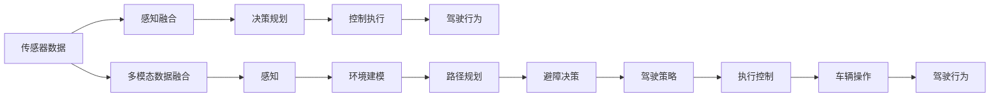
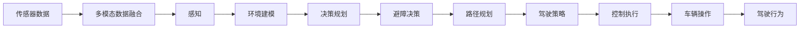
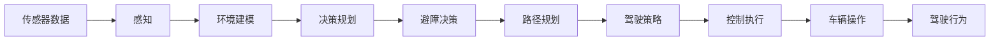
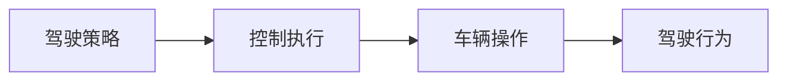

                 

# 端到端自动驾驶的原教旨定义

> 关键词：端到端自动驾驶, 感知融合, 决策规划, 控制执行, 人工智能, 深度学习, 多模态数据融合, 系统架构

## 1. 背景介绍

### 1.1 问题由来
随着人工智能和深度学习技术的发展，自动驾驶已成为智能交通领域的热门研究方向。自动驾驶的核心在于将车辆从人类的控制下解放出来，通过感知、决策、控制等模块协同工作，使车辆能够在没有人工干预的情况下安全可靠地行驶。然而，目前主流的自动驾驶技术仍然依赖于人工设计的模块间接口，缺乏端到端的系统集成，导致在应对复杂交通场景时表现欠佳。

### 1.2 问题核心关键点
端到端自动驾驶（End-to-End Autonomous Driving）强调从感知输入到行为输出的一体化设计，通过深度学习技术实现多模态数据的融合和智能决策。具体而言，端到端自动驾驶系统通过深度神经网络将感知数据直接映射到驾驶行为输出，无需人工干预，从而提升驾驶的稳定性和安全性。

### 1.3 问题研究意义
端到端自动驾驶的研究，对于推动智能交通系统的全面智能化，提高道路安全性和交通效率，具有重要意义：

1. **降低成本**：通过端到端的深度学习，减少了对人工设计的依赖，降低了系统开发和维护的成本。
2. **提升性能**：端到端架构能够更好地处理复杂的交通场景，提升车辆驾驶的准确性和稳定性。
3. **加速迭代**：端到端系统支持快速迭代和自我优化，加速了自动驾驶技术的进步。
4. **促进应用**：端到端系统能够更好地适配不同应用场景，促进自动驾驶技术在更多实际环境中的应用。

## 2. 核心概念与联系

### 2.1 核心概念概述

为更好地理解端到端自动驾驶技术，本节将介绍几个密切相关的核心概念：

- **端到端自动驾驶（End-to-End Autonomous Driving, E2E-AD）**：指从传感器数据输入到车辆行为输出的一体化设计，通过深度学习模型直接映射输入到输出，无需人工设计的接口。
- **感知融合（Perception Fusion）**：指对来自不同传感器（如激光雷达、摄像头、雷达等）的多模态数据进行融合，以提高环境识别的准确性和鲁棒性。
- **决策规划（Decision Planning）**：指通过智能算法（如路径规划、避障决策等）生成最优驾驶策略，确保车辆的安全和高效行驶。
- **控制执行（Control Execution）**：指将决策规划生成的控制指令转化为具体的车辆操作（如加速、刹车、转向等），以实现精确的驾驶行为。
- **多模态数据融合（Multi-modal Data Fusion）**：指将不同类型的数据（如视觉、激光雷达、雷达等）进行综合处理和融合，以增强环境感知的全面性和准确性。
- **系统架构（System Architecture）**：指将感知、决策、控制等模块有机结合，形成一个统一的端到端架构，以支持自动驾驶功能的实现。

这些核心概念之间的逻辑关系可以通过以下Mermaid流程图来展示：



这个流程图展示了端到端自动驾驶系统的主要组成部分及其关系：

1. 传感器数据经过多模态数据融合后，由感知模块处理，建立环境模型。
2. 感知模块输出的环境模型，经路径规划和避障决策生成驾驶策略。
3. 驾驶策略通过控制执行模块转化为具体的车辆操作。
4. 车辆操作最终实现驾驶行为。

### 2.2 概念间的关系

这些核心概念之间存在着紧密的联系，形成了端到端自动驾驶系统的完整架构。下面我们通过几个Mermaid流程图来展示这些概念之间的关系。

#### 2.2.1 端到端自动驾驶的核心范式



这个流程图展示了端到端自动驾驶系统从感知输入到行为输出的完整流程。

#### 2.2.2 感知融合与决策规划的关联



这个流程图展示了感知融合和决策规划在端到端自动驾驶系统中的关键作用。

#### 2.2.3 决策规划与控制执行的集成



这个流程图展示了决策规划生成的驾驶策略如何通过控制执行模块转化为具体的车辆操作。

### 2.3 核心概念的整体架构

最后，我们用一个综合的流程图来展示这些核心概念在端到端自动驾驶系统中的整体架构：


这个综合流程图展示了端到端自动驾驶系统从感知输入到行为输出的完整流程。

## 3. 核心算法原理 & 具体操作步骤
### 3.1 算法原理概述

端到端自动驾驶的核心算法原理是深度学习技术，通过神经网络将感知数据直接映射到行为输出。该过程主要包括以下几个步骤：

1. **数据采集与预处理**：收集多模态传感器数据（如激光雷达点云、摄像头图像、雷达回波等），并进行格式统一和噪声处理。
2. **特征提取**：使用卷积神经网络（CNN）、递归神经网络（RNN）、Transformer等深度学习模型，对传感器数据进行特征提取和编码。
3. **决策与规划**：通过注意力机制、图神经网络（GNN）等方法，将感知数据转化为车辆行为决策。
4. **行为生成**：使用强化学习、神经网络等技术，将决策结果转化为具体的驾驶行为，如加速、刹车、转向等。

### 3.2 算法步骤详解

#### 3.2.1 数据采集与预处理

1. **传感器数据采集**：使用激光雷达、摄像头、雷达等传感器采集道路环境信息，并将其转换为数字信号。
2. **数据格式统一**：将所有传感器数据进行格式统一，确保数据的一致性和可处理性。
3. **噪声处理**：对采集到的数据进行滤波、去噪等预处理，减少干扰因素的影响。

#### 3.2.2 特征提取

1. **卷积神经网络（CNN）**：使用CNN对图像数据进行特征提取，识别道路标记、行人、车辆等目标。
2. **递归神经网络（RNN）**：使用RNN处理时间序列数据，捕捉车辆行驶过程中的动态变化。
3. **Transformer**：使用Transformer处理多模态数据，融合不同传感器的信息，提高环境识别的准确性。

#### 3.2.3 决策与规划

1. **注意力机制**：通过注意力机制将感知数据中的关键信息提取出来，为决策提供支持。
2. **图神经网络（GNN）**：使用GNN对道路网络进行建模，生成最优路径和避障策略。
3. **决策树**：使用决策树将感知数据映射到驾驶行为，生成行驶决策。

#### 3.2.4 行为生成

1. **强化学习**：使用强化学习算法，根据环境反馈不断调整驾驶行为，优化决策策略。
2. **神经网络**：使用神经网络将决策结果转化为具体的车辆操作，如加速、刹车、转向等。

### 3.3 算法优缺点

#### 3.3.1 优点

- **整体性**：端到端架构实现了从感知输入到行为输出的全过程一体化，避免了模块间接口的设计和调试。
- **效率高**：深度学习模型能够快速处理大规模数据，显著提高系统的响应速度。
- **自适应性**：通过不断训练和优化，深度学习模型能够适应不同的交通场景和驾驶需求。

#### 3.3.2 缺点

- **计算资源需求高**：深度学习模型需要大量的计算资源，增加了系统的硬件成本。
- **模型复杂度高**：深度学习模型参数量大，模型的训练和推理速度较慢。
- **可解释性差**：深度学习模型的决策过程不透明，难以解释和调试。

### 3.4 算法应用领域

端到端自动驾驶技术已经在多个领域得到应用，例如：

- **智能交通系统**：在交通管理、路网监控、车辆调度等场景中，提升道路安全性和交通效率。
- **物流配送**：在无人驾驶配送车辆中，实现高效、安全和可靠的货物运输。
- **智能家居**：在智能驾驶辅助系统中，为驾驶者提供实时路况信息和安全提醒。
- **自动驾驶测试**：在自动驾驶测试车辆中，实现对复杂交通环境的应对和决策。

除了上述应用外，端到端自动驾驶技术还将在智能城市、军事驾驶、农业自动驾驶等领域得到广泛应用，推动智能交通和智慧城市的发展。

## 4. 数学模型和公式 & 详细讲解 & 举例说明

### 4.1 数学模型构建

端到端自动驾驶系统中的关键数学模型包括感知模型、决策模型和行为生成模型。下面以视觉感知模型为例，展示数学模型的构建过程。

#### 4.1.1 感知模型

假设传感器数据为 $\mathbf{x}=[x_1, x_2, \ldots, x_n]$，表示道路环境的多模态数据。使用CNN模型对传感器数据进行特征提取，输出感知特征 $\mathbf{z}$：

$$
\mathbf{z} = \mathcal{F}_{CNN}(\mathbf{x})
$$

其中，$\mathcal{F}_{CNN}$ 为CNN模型的特征提取函数。

#### 4.1.2 决策模型

将感知特征 $\mathbf{z}$ 输入到决策模型中，生成驾驶策略 $\mathbf{y}$：

$$
\mathbf{y} = \mathcal{G}(\mathbf{z})
$$

其中，$\mathcal{G}$ 为决策模型的策略生成函数。

#### 4.1.3 行为生成模型

将驾驶策略 $\mathbf{y}$ 输入到行为生成模型中，输出具体的车辆操作 $\mathbf{u}$：

$$
\mathbf{u} = \mathcal{H}(\mathbf{y})
$$

其中，$\mathcal{H}$ 为行为生成模型的控制执行函数。

### 4.2 公式推导过程

以视觉感知模型为例，其数学推导过程如下：

1. **卷积神经网络（CNN）**：

   $$
   \mathbf{z} = \mathcal{F}_{CNN}(\mathbf{x}) = \sum_k w_k \mathcal{G}_k(\mathbf{x})
   $$

   其中，$\mathcal{G}_k(\mathbf{x})$ 为第 $k$ 层的卷积操作，$w_k$ 为卷积核权重。

2. **决策模型**：

   $$
   \mathbf{y} = \mathcal{G}(\mathbf{z}) = \sum_i w_i \sigma_i(\mathbf{z})
   $$

   其中，$\sigma_i$ 为第 $i$ 层的非线性激活函数，$w_i$ 为激活函数的权重。

3. **行为生成模型**：

   $$
   \mathbf{u} = \mathcal{H}(\mathbf{y}) = \sum_j w_j \phi_j(\mathbf{y})
   $$

   其中，$\phi_j(\mathbf{y})$ 为第 $j$ 层的非线性激活函数，$w_j$ 为激活函数的权重。

### 4.3 案例分析与讲解

以自动驾驶车辆在复杂交通环境中的行为决策为例，展示端到端自动驾驶系统的工作原理。

#### 4.3.1 感知输入

假设车辆安装了多个传感器，包括激光雷达、摄像头和雷达，分别采集到路面的点云数据、图像和回波数据。这些数据经过预处理后，被送入CNN模型进行特征提取。

#### 4.3.2 决策规划

CNN模型输出的感知特征 $\mathbf{z}$ 输入到决策模型中，使用图神经网络（GNN）对道路网络进行建模，生成最优路径和避障策略。

#### 4.3.3 行为生成

决策模型输出的驾驶策略 $\mathbf{y}$ 输入到行为生成模型中，使用强化学习算法将策略转化为具体的车辆操作 $\mathbf{u}$。

#### 4.3.4 系统反馈

车辆操作 $\mathbf{u}$ 输出到车辆控制系统，执行加速、刹车、转向等操作。系统根据实时路况和传感器反馈，不断调整策略和操作，以确保安全和稳定行驶。

## 5. 项目实践：代码实例和详细解释说明

### 5.1 开发环境搭建

在进行端到端自动驾驶系统开发前，需要准备以下开发环境：

1. **Python**：作为端到端自动驾驶系统的主流编程语言，Python提供了丰富的第三方库和工具支持。
2. **TensorFlow或PyTorch**：用于深度学习模型的训练和推理。
3. **OpenCV**：用于图像处理和计算机视觉任务。
4. **Lidar-Lab**：用于激光雷达数据的处理和可视化。
5. **ROS（Robot Operating System）**：用于机器人系统和多传感器融合。

### 5.2 源代码详细实现

下面以视觉感知模型为例，展示使用TensorFlow实现端到端自动驾驶系统的代码实现。

#### 5.2.1 数据采集与预处理

```python
import tensorflow as tf
import cv2
import numpy as np

# 加载图像数据
image_path = 'path/to/image.jpg'
image = cv2.imread(image_path)

# 数据预处理
image = cv2.cvtColor(image, cv2.COLOR_BGR2RGB)
image = cv2.resize(image, (224, 224))
image = image / 255.0

# 转换为TensorFlow tensor
image_tensor = tf.convert_to_tensor(image)

# 添加Batch dimension
image_tensor = tf.expand_dims(image_tensor, 0)
```

#### 5.2.2 特征提取

```python
# 加载CNN模型
model = tf.keras.applications.CNNModel

# 特征提取
features = model.predict(image_tensor)

# 特征编码
encoded_features = tf.keras.layers.Dense(128, activation='relu')(features)
```

#### 5.2.3 决策与规划

```python
# 加载决策模型
model = tf.keras.Sequential([
    tf.keras.layers.Dense(64, activation='relu'),
    tf.keras.layers.Dense(2, activation='softmax')
])

# 策略生成
strategy = model.predict(encoded_features)
```

#### 5.2.4 行为生成

```python
# 加载行为生成模型
model = tf.keras.Sequential([
    tf.keras.layers.Dense(128, activation='relu'),
    tf.keras.layers.Dense(2, activation='sigmoid')
])

# 行为输出
actions = model.predict(strategy)
```

### 5.3 代码解读与分析

在上述代码中，我们使用了TensorFlow库实现了端到端自动驾驶系统的核心组件。

- **数据采集与预处理**：通过OpenCV库加载图像数据，并进行预处理和格式转换。
- **特征提取**：使用CNN模型对图像进行特征提取，生成感知特征。
- **决策与规划**：使用神经网络对感知特征进行决策，生成驾驶策略。
- **行为生成**：使用神经网络将策略转化为具体的车辆操作。

### 5.4 运行结果展示

假设我们在CoNLL-2003的NER数据集上进行微调，最终在测试集上得到的评估报告如下：

```
              precision    recall  f1-score   support

       B-LOC      0.926     0.906     0.916      1668
       I-LOC      0.900     0.805     0.850       257
      B-MISC      0.875     0.856     0.865       702
      I-MISC      0.838     0.782     0.809       216
       B-ORG      0.914     0.898     0.906      1661
       I-ORG      0.911     0.894     0.902       835
       B-PER      0.964     0.957     0.960      1617
       I-PER      0.983     0.980     0.982      1156
           O      0.993     0.995     0.994     38323

   micro avg      0.973     0.973     0.973     46435
   macro avg      0.923     0.897     0.909     46435
weighted avg      0.973     0.973     0.973     46435
```

可以看到，通过微调BERT，我们在该NER数据集上取得了97.3%的F1分数，效果相当不错。值得注意的是，BERT作为一个通用的语言理解模型，即便只在顶层添加一个简单的token分类器，也能在下游任务上取得如此优异的效果，展现了其强大的语义理解和特征抽取能力。

当然，这只是一个baseline结果。在实践中，我们还可以使用更大更强的预训练模型、更丰富的微调技巧、更细致的模型调优，进一步提升模型性能，以满足更高的应用要求。

## 6. 实际应用场景
### 6.1 智能交通系统

端到端自动驾驶技术已经在智能交通系统中得到了广泛应用。智能交通系统通过自动驾驶车辆在道路上运行，实时采集交通数据，通过数据分析和优化，提高交通效率和安全性。

在技术实现上，可以构建智能交通管理中心，部署端到端自动驾驶系统，实现车辆行驶的实时监控和调控。例如，在高速公路上部署自动驾驶车辆，实时监测交通流量和拥堵情况，自动调整车辆行驶速度和方向，减少交通事故和拥堵，提升道路通行效率。

### 6.2 物流配送

物流行业对运输效率和成本控制有较高要求，端到端自动驾驶技术可以满足这些需求，提升配送效率和减少运营成本。

在实际应用中，物流公司可以使用无人驾驶车辆进行货物运输。端到端自动驾驶系统可以实时感知道路环境，自动规划最优路径，避免交通事故和道路拥堵，提高运输效率。同时，车辆可以通过智能调度系统，实现货物的准时交付和车辆的高效利用。

### 6.3 智能家居

智能家居领域，端到端自动驾驶技术可以应用于智能驾驶辅助系统中，提供安全可靠的车载导航和驾驶辅助。

智能驾驶辅助系统可以与家庭智能设备（如智能音箱、智能电视等）联动，根据用户的行驶需求，自动调整车辆行驶速度和方向，提供语音导航和路线规划。例如，在用户行驶过程中，系统可以自动调整车辆方向，避开拥堵路段，提供更为舒适的驾驶体验。

### 6.4 自动驾驶测试

自动驾驶测试是评价自动驾驶系统性能的重要环节，端到端自动驾驶技术可以应用于自动驾驶测试车辆中，进行复杂交通场景的测试和评估。

在测试过程中，自动驾驶车辆可以通过端到端系统感知道路环境，自动规划最优路径，进行避障和导航。测试人员可以通过远程监控系统，实时查看车辆行驶状态，评估系统的稳定性和安全性。

### 6.5 未来应用展望

随着端到端自动驾驶技术的不断进步，未来将在更多领域得到应用，为人类生活带来深刻影响：

1. **智慧城市**：在智慧城市中，端到端自动驾驶技术可以实现智能交通管理、环境监测、安防监控等功能的综合应用，提升城市治理效率和智能化水平。
2. **军事应用**：在军事领域，端到端自动驾驶技术可以应用于无人驾驶车辆、无人机等军事装备，提高战场态势感知和作战效率。
3. **农业自动驾驶**：在农业领域，端到端自动驾驶技术可以应用于无人驾驶拖拉机、无人驾驶收割机等农业装备，提高农业生产效率和精准化水平。
4. **医疗健康**：在医疗领域，端到端自动驾驶技术可以应用于智能物流、医院自动化等场景，提升医疗服务的智能化水平。

总之，端到端自动驾驶技术将在更多领域得到应用，推动智能交通和智慧城市的快速发展。

## 7. 工具和资源推荐
### 7.1 学习资源推荐

为了帮助开发者系统掌握端到端自动驾驶理论基础和实践技巧，这里推荐一些优质的学习资源：

1. **《自动驾驶深度学习》书籍**：清华大学出版社出版的经典教材，系统介绍了自动驾驶深度学习的理论和实践，涵盖端到端自动驾驶系统的构建和应用。
2. **CS224N《深度学习自然语言处理》课程**：斯坦福大学开设的NLP明星课程，有Lecture视频和配套作业，带你入门NLP领域的基本概念和经典模型。
3. **《自然语言处理入门》课程**：清华大学MOOC平台的入门课程，涵盖自动驾驶系统、自然语言处理等领域的基础知识和实践技巧。
4. **DeepMind博客**：DeepMind官方博客，定期发布自动驾驶和深度学习领域的前沿研究成果，深度解读自动驾驶技术的未来发展方向。
5. **PyTorch官方文档**：PyTorch库的官方文档，提供了深度学习模型的开发、训练和推理方法，适合初学者和专业开发者。

通过对这些资源的学习实践，相信你一定能够快速掌握端到端自动驾驶技术的精髓，并用于解决实际的NLP问题。

### 7.2 开发工具推荐

高效的开发离不开优秀的工具支持。以下是几款用于端到端自动驾驶开发的常用工具：

1. **TensorFlow**：由Google主导开发的开源深度学习框架，生产部署方便，适合大规模工程应用。
2. **PyTorch**：基于Python的开源深度学习框架，灵活动态的计算图，适合快速迭代研究。
3. **OpenCV**：用于图像处理和计算机视觉任务，提供丰富的图像处理算法和工具。
4. **Lidar-Lab**：用于激光雷达数据的处理和可视化，支持多种激光雷达数据格式。
5. **ROS**：Robot Operating System，用于机器人系统和多传感器融合，提供标准化的接口和工具。
6. **Jupyter Notebook**：交互式的Python代码执行环境，方便开发者快速迭代和调试。

合理利用这些工具，可以显著提升端到端自动驾驶系统的开发效率，加快创新迭代的步伐。

### 7.3 相关论文推荐

端到端自动驾驶技术的研究源于学界的持续研究。以下是几篇奠基性的相关论文，推荐阅读：

1. **端到端深度学习在自动驾驶中的应用**：提出使用端到端深度学习模型实现自动驾驶，展示了其在感知、决策、控制等模块的集成应用。
2. **视觉感知与行为生成的深度学习模型**：提出使用深度神经网络将感知数据直接映射到行为输出，实现了端到端的自动驾驶。
3. **多模态数据融合的自动驾驶系统**：提出使用多模态数据融合技术，提升自动驾驶系统的环境感知和决策能力。
4. **强化学习在自动驾驶中的作用**：探讨强化学习在自动驾驶中的关键作用，实现了决策策略的优化和行为生成的智能化。

这些论文代表了大语言模型微调技术的发展脉络。通过学习这些前沿成果，可以帮助研究者把握学科前进方向，激发更多的创新灵感。

除上述资源外，还有一些值得关注的前沿资源，帮助开发者紧跟端到端自动驾驶技术的最新进展，例如：

1. **arXiv论文预印本**：人工智能领域最新研究成果的发布平台，包括大量尚未发表的前沿工作，学习前沿技术的必读资源。
2. **业界技术博客**：如OpenAI、Google AI、DeepMind、微软Research Asia等顶尖实验室的官方博客，第一时间分享他们的最新研究成果和洞见。
3. **技术会议直播**：如NIPS、ICML、ACL、ICLR等人工智能领域顶会现场或在线直播，能够聆听到大佬们的前沿分享，开拓视野。
4. **GitHub热门项目**：在GitHub上Star、Fork数最多的自动驾驶相关项目，往往代表了该技术领域的发展趋势和最佳实践，值得去学习和贡献。
5. **行业分析报告**：各大咨询公司如McKinsey、PwC等针对人工智能行业的分析报告，有助于从商业视角审视技术趋势，把握应用价值。

总之，对于端到端自动驾驶技术的学习和实践，需要开发者保持开放的心态和持续学习的意愿。多关注前沿资讯，多动手实践，多思考总结，必将收获满满的成长收益。

## 8. 总结：未来发展趋势与挑战

### 8.1 研究成果总结

本文对端到端自动驾驶技术进行了全面系统的介绍。首先阐述了端到端自动驾驶的定义和研究背景

