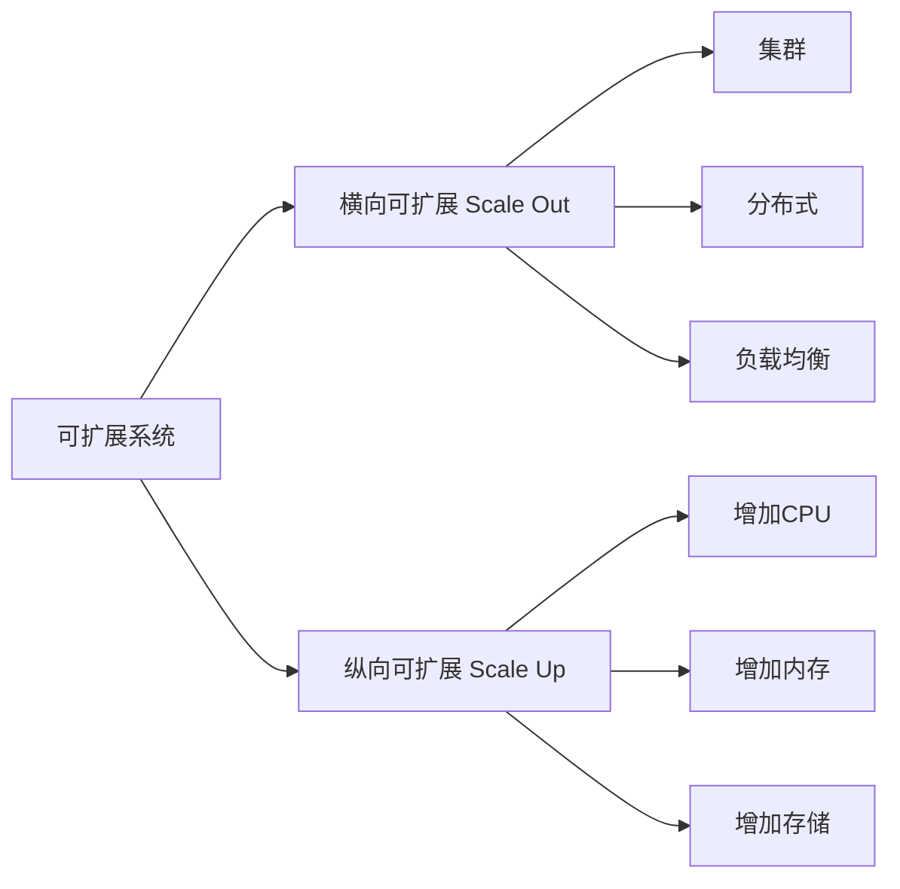

# 横向可扩展性与纵向可扩展性解析

关键词：横向可扩展性、纵向可扩展性、分布式系统、高可用、负载均衡、集群、高性能计算

## 1. 背景介绍
### 1.1 问题的由来
随着互联网技术的飞速发展,海量数据的涌现和用户访问量的快速增长,传统的单体架构已无法满足日益增长的业务需求。系统可扩展性成为衡量一个系统能否支撑业务持续增长的关键指标。横向可扩展性和纵向可扩展性作为两种主要的系统扩展方式应运而生。

### 1.2 研究现状
目前,业界对于横向可扩展性和纵向可扩展性的研究主要集中在分布式系统、云计算、高性能计算等领域。许多互联网巨头如谷歌、亚马逊、阿里巴巴等都在积极探索和实践这两种可扩展性架构,并取得了显著成效。但是,对于中小型企业和开发者而言,如何在有限的资源条件下实现系统的可扩展性仍然是一个巨大的挑战。

### 1.3 研究意义
深入研究横向可扩展性和纵向可扩展性,对于设计和构建高可用、高性能的分布式系统具有重要意义。一方面,可以提高系统的并发处理能力和吞吐量,满足海量用户的访问需求;另一方面,可以提升系统的容错性和可靠性,避免单点故障引起的系统瘫痪。同时,掌握这两种可扩展性原理和实现技术,也是程序员必备的核心技能之一。

### 1.4 本文结构
本文将从以下几个方面对横向可扩展性和纵向可扩展性进行深入探讨：
- 第2节：核心概念与联系
- 第3节：核心算法原理 & 具体操作步骤
- 第4节：数学模型和公式 & 详细讲解 & 举例说明
- 第5节：项目实践：代码实例和详细解释说明
- 第6节：实际应用场景
- 第7节：工具和资源推荐
- 第8节：总结：未来发展趋势与挑战
- 第9节：附录：常见问题与解答

## 2. 核心概念与联系
横向可扩展性(Scale Out)和纵向可扩展性(Scale Up)是构建可扩展系统的两种主要方式：

- 横向可扩展性(Scale Out)：通过添加更多的服务器/节点来扩展系统性能,即将负载分散到多个服务器上,从而获得更高的吞吐量和并发处理能力。常见的实现方式包括集群、分布式、负载均衡等。
- 纵向可扩展性(Scale Up)：通过增强单个服务器/节点的硬件性能(如CPU、内存、存储等)来提升系统性能,即在一台超级服务器上运行,利用更强大的硬件资源来支撑更高的负载。

横向可扩展性与纵向可扩展性并非对立,而是相辅相成的。一个理想的可扩展系统往往是二者的结合,既能通过纵向扩展获得单机性能提升,又能通过横向扩展获得更大规模的吞吐能力。它们之间的关系如下图所示：



## 3. 核心算法原理 & 具体操作步骤
### 3.1 算法原理概述
实现横向可扩展性的核心是将请求均匀分发到多个服务器节点,从而实现负载均衡。常见的负载均衡算法有：
- 轮询(Round Robin)：将请求依次分配给每个服务器,适用于服务器性能相近的场景。
- 加权轮询(Weighted Round Robin)：根据服务器性能分配权重,性能高的服务器分配更多请求。
- 最少连接(Least Connections)：将请求分配给当前连接数最少的服务器。
- 源地址哈希(IP Hash)：根据请求源IP地址计算哈希值,将同一IP的请求分配给同一服务器,保证会话粘性。

### 3.2 算法步骤详解
以加权轮询算法为例,具体步骤如下：
1. 为每个服务器节点分配一个权重值,表示该节点的性能强弱,权重值越大,性能越强。
2. 计算所有节点的权重总和,记为total_weight。
3. 定义一个当前权重变量current_weight,初始值为0。
4. 遍历服务器节点列表：
   - 对于每个节点,将其权重值加到current_weight上。
   - 如果current_weight >= total_weight,选择当前节点处理请求,并将current_weight减去total_weight。
5. 重复步骤4,直到所有请求被分配完毕。

### 3.3 算法优缺点
加权轮询算法的优点是：
- 根据服务器性能分配请求,充分利用各节点的处理能力。
- 算法简单,易于实现。

缺点是：
- 未考虑服务器的动态负载情况,可能导致负载不均。
- 权重值需要根据实际情况进行调整,否则可能带来性能损失。

### 3.4 算法应用领域
负载均衡算法广泛应用于各种分布式系统,如：
- Web服务器集群
- 数据库集群
- 缓存集群
- 消息队列集群
- 高性能计算集群

## 4. 数学模型和公式 & 详细讲解 & 举例说明
### 4.1 数学模型构建
为了更好地理解横向可扩展性,我们可以建立一个简单的数学模型。假设有n个服务器节点,每个节点的处理能力为Ci(i=1,2,...,n),单位时间内到达的请求数为λ,那么系统的总处理能力C可以表示为：

$$C = \sum_{i=1}^{n} C_i$$

系统的平均响应时间T可以用Little定律计算：

$$T = \frac{L}{\lambda}$$

其中,L表示系统中请求的平均数量,可以用Erlang C公式估算：

$$L = \frac{\rho}{1-\rho} + \frac{\lambda}{\mu}$$

其中,ρ表示服务器利用率,μ表示单个服务器的平均服务率。

### 4.2 公式推导过程
Erlang C公式的推导过程如下：
1. 假设请求到达服务器的过程是泊松分布,到达率为λ。
2. 服务器的服务时间服从指数分布,平均服务率为μ。
3. 令状态变量k表示系统中请求的数量,则状态转移方程为：

$$\begin{cases}
\lambda p_0 = \mu p_1 & k=0 \
(\lambda+k\mu)p_k = \lambda p_{k-1} + (k+1)\mu p_{k+1} & k>0
\end{cases}$$

4. 求解状态转移方程,得到系统中请求数量的分布：

$$p_k = \frac{\rho^k}{k!}p_0$$

5. 利用归一化条件$\sum_{k=0}^{\infty}p_k=1$,求得$p_0$：

$$p_0 = \frac{1}{\sum_{k=0}^{\infty}\frac{\rho^k}{k!}}$$

6. 将$p_0$代入$p_k$的表达式,得到系统中请求的平均数量L：

$$L = \sum_{k=1}^{\infty}kp_k = \frac{\rho}{1-\rho} + \frac{\lambda}{\mu}$$

### 4.3 案例分析与讲解
假设一个Web服务器集群由4个节点组成,每个节点的处理能力为100个请求/秒,当前的请求到达率为250个请求/秒。如果要将平均响应时间控制在0.5秒以内,需要增加多少个节点?

解：
1. 系统总处理能力:$C=4*100=400$ 请求/秒
2. 平均服务率:$\mu=\frac{C}{4}=100$ 请求/秒
3. 服务器利用率:$\rho=\frac{\lambda}{\mu}=\frac{250}{400}=0.625$
4. 系统中请求的平均数量:$L=\frac{0.625}{1-0.625}+\frac{250}{100}=4.17$
5. 平均响应时间:$T=\frac{4.17}{250}=0.017$秒

可见当前的响应时间已经满足要求,无需增加节点。如果请求量增加到500个请求/秒,则需要增加节点数量：

令$C=n*100$,代入$T=\frac{L}{\lambda}=\frac{\rho}{(1-\rho)\lambda}+\frac{1}{\mu}=0.5$,解得$n\approx7$。

因此,需要再增加3个节点,使集群总数达到7个,才能将平均响应时间控制在0.5秒以内。

### 4.4 常见问题解答
问题1：在水平扩展时,如何保证数据一致性?
解答：可以采用分布式一致性协议,如Paxos、Raft等,通过多数派投票的方式在多个节点之间同步数据,保证数据一致性。同时,还可以使用分布式事务、最终一致性等技术,根据业务场景的不同需求选择适当的一致性级别。

问题2：水平扩展是否有限度?
解答：理论上,水平扩展可以无限进行,直到将请求分散到足够多的节点上。但在实际情况中,受限于硬件成本、网络带宽、管理复杂度等因素,水平扩展也有一定的限度。因此,在进行水平扩展时,需要综合考虑系统性能、成本、可管理性等多方面因素。

问题3：如何选择横向扩展还是纵向扩展?
解答：一般来说,当单机性能无法满足需求时,首选横向扩展。因为横向扩展可以通过添加商用服务器快速提升系统性能,成本相对较低。而纵向扩展需要购买高端服务器,成本较高。但是,当请求量不高,但单个请求处理时间较长时,可以考虑纵向扩展。此外,一些难以进行分布式改造的系统,也更适合采用纵向扩展的方式。

## 5. 项目实践：代码实例和详细解释说明
### 5.1 开发环境搭建
以Java语言为例,搭建一个简单的负载均衡Demo。
1. 安装JDK 1.8+
2. 安装Maven 3.x
3. 安装Tomcat 8.x
4. 克隆示例代码仓库
```bash
git clone https://github.com/example/load-balancer-demo.git
```

### 5.2 源代码详细实现
1. 定义服务器节点类`ServerNode`:
```java
public class ServerNode {
    private String ip;
    private int port;
    private int weight;

    // 构造函数、getter和setter方法
}
```

2. 实现加权轮询负载均衡器`WeightedRoundRobinBalancer`:
```java
public class WeightedRoundRobinBalancer {
    private static List<ServerNode> nodeList; // 存储服务器节点列表
    private static int totalWeight; // 所有节点的权重之和
    private static int currentWeight; // 当前权重
    private static int currentIndex; // 当前节点索引

    static {
        nodeList = new ArrayList<>();
        // 初始化节点列表
        nodeList.add(new ServerNode("192.168.1.1", 8080, 4));
        nodeList.add(new ServerNode("192.168.1.2", 8081, 3));
        nodeList.add(new ServerNode("192.168.1.3", 8082, 1));

        // 计算总权重
        for (ServerNode node : nodeList) {
            totalWeight += node.getWeight();
        }
    }

    public static ServerNode getServerNode() {
        ServerNode selectedNode = null;

        synchronized (WeightedRoundRobinBalancer.class) {
            currentWeight += 1;
            if (currentWeight >= totalWeight) {
                currentWeight = 0;
                currentIndex = (currentIndex + 1) % nodeList.size();
            }
            selectedNode = nodeList.get(currentIndex);
        }

        return selectedNode;
    }
}
```

3. 编写Servlet处理请求:
```java
@WebServlet("/hello")
public class HelloServlet extends HttpServlet {
    protected void doGet(HttpServletRequest