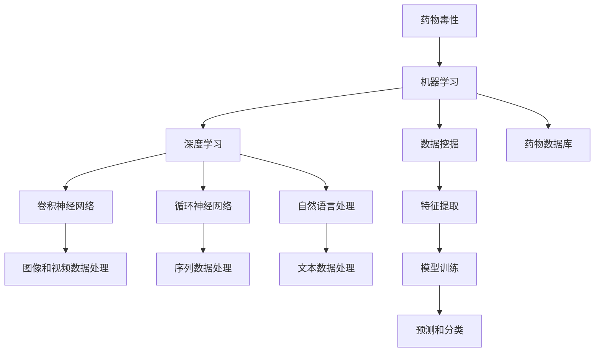
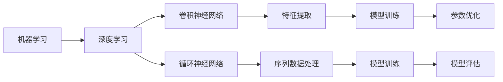
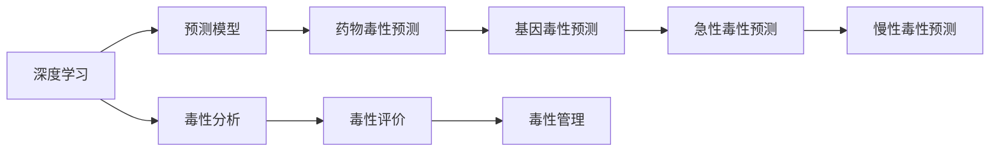
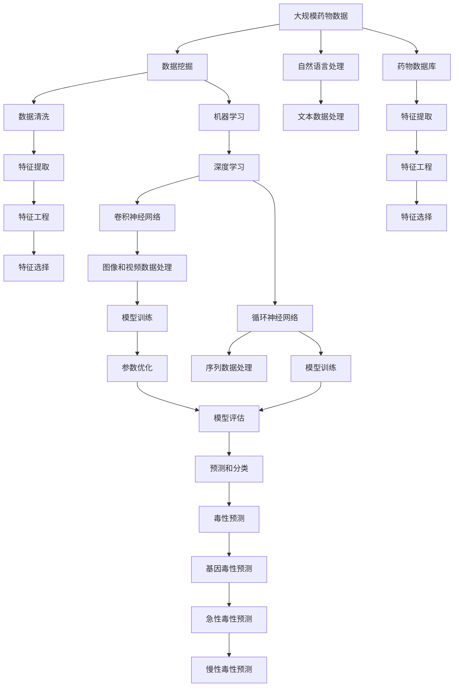

                 

# AI驱动的药物毒性预测模型研究

> 关键词：AI, 药物毒性, 预测模型, 机器学习, 深度学习, 自然语言处理(NLP), 卷积神经网络(CNN), 循环神经网络(RNN), 药物数据库

## 1. 背景介绍

药物毒性预测是药物研发过程中的一个关键环节，对保障药物的安全性和有效性至关重要。传统的药物毒性预测主要依赖于实验验证，既费时又昂贵，且无法处理无法进行实验的药物。随着人工智能（AI）技术的发展，利用机器学习（ML）和深度学习（DL）技术进行药物毒性预测成为可能，大幅提高了预测的效率和准确性。

本文聚焦于AI驱动的药物毒性预测模型的研究，将详细介绍模型原理、具体实现、应用场景和未来展望，为药物研发和毒理学研究提供参考和支持。

## 2. 核心概念与联系

### 2.1 核心概念概述

为更好地理解AI驱动的药物毒性预测模型，本节将介绍几个密切相关的核心概念：

- 药物毒性：指药物对人体健康造成的损害，包括急性、慢性毒性，以及基因毒性和过敏性等。

- 机器学习（ML）：通过数据驱动的方法，训练模型进行预测和分类，广泛用于数据密集型任务。

- 深度学习（DL）：一种特殊类型的机器学习，使用多层次神经网络进行特征提取和模型预测，适用于复杂的非线性映射。

- 自然语言处理（NLP）：计算机科学和人工智能领域中涉及计算机和人类（自然）语言之间相互作用的领域。

- 卷积神经网络（CNN）：一种基于卷积运算的深度学习模型，常用于图像和视频等空间数据的特征提取。

- 循环神经网络（RNN）：一种基于序列数据的深度学习模型，适用于处理时间序列和文本数据。

- 药物数据库：包含药物化学结构、毒性数据、临床试验结果等信息的巨大数据库，是药物毒性预测的重要数据来源。

这些核心概念之间的逻辑关系可以通过以下Mermaid流程图来展示：



这个流程图展示了大模型驱动的药物毒性预测过程，从数据收集、特征提取到模型训练、预测分类。

### 2.2 概念间的关系

这些核心概念之间存在着紧密的联系，形成了AI驱动药物毒性预测的完整框架。下面我们通过几个Mermaid流程图来展示这些概念之间的关系。

#### 2.2.1 数据来源和预处理


这个流程图展示了从药物数据库中挖掘数据，到预处理和特征工程的过程。

#### 2.2.2 模型选择和训练



这个流程图展示了从选择机器学习模型到深度学习模型，再到具体模型的训练和评估过程。

#### 2.2.3 预测和应用



这个流程图展示了使用深度学习模型进行药物毒性预测，并将其应用于毒理学和药物管理的全过程。

### 2.3 核心概念的整体架构

最后，我们用一个综合的流程图来展示这些核心概念在大模型驱动的药物毒性预测中的整体架构：



这个综合流程图展示了从数据处理、模型训练到毒性预测的完整流程。

## 3. 核心算法原理 & 具体操作步骤

### 3.1 算法原理概述

AI驱动的药物毒性预测模型主要基于机器学习和深度学习技术，通过数据驱动的方法，构建并训练模型，预测药物的毒性。其核心思想是将药物的化学结构、生理特征等信息，转化为计算机可处理的数字信号，利用神经网络进行特征提取和关系学习，最终得到药物毒性的预测结果。

具体而言，主要包括以下几个步骤：

1. 数据收集和预处理：从药物数据库、临床试验数据、文献资料等渠道收集数据，并进行清洗、去噪、标注等预处理操作。

2. 特征提取：将药物化学结构、生物活性、代谢途径等属性信息，转化为计算机可处理的数字特征。

3. 模型训练：使用机器学习或深度学习模型，训练得到药物毒性预测模型。

4. 模型评估：在测试集上评估模型性能，选取最优模型进行预测。

5. 模型应用：将模型应用于新药研发、临床试验、毒理学研究等领域，预测药物的毒性。

### 3.2 算法步骤详解

**Step 1: 数据收集和预处理**

1. 从药物数据库、临床试验数据、文献资料等渠道收集数据，形成包含药物化学结构、生物活性、代谢途径等信息的药物数据集。
2. 对数据进行清洗，去除重复、缺失、异常值，并对其进行标准化处理。
3. 对数据进行标注，将其分为有毒和无毒两个类别，并进行二元化处理。

**Step 2: 特征提取**

1. 利用化学信息学技术，将药物化学结构转化为计算机可处理的数字信号，如SMILES、InChI等。
2. 利用自然语言处理技术，对药物说明书、文献资料中的描述信息进行词向量化，提取药物的生物活性、代谢途径等信息。
3. 将上述数字信号和词向量化结果，进行拼接和融合，形成药物的综合特征向量。

**Step 3: 模型训练**

1. 选择合适的机器学习或深度学习模型，如支持向量机（SVM）、随机森林、卷积神经网络（CNN）、循环神经网络（RNN）等。
2. 将数据集划分为训练集和测试集，使用训练集对模型进行训练。
3. 使用测试集对模型进行评估，选择最优模型。

**Step 4: 模型评估**

1. 在测试集上评估模型的准确率、召回率、F1值等指标。
2. 对模型进行交叉验证，确保其稳定性和泛化能力。
3. 对模型进行调参和优化，提升其性能。

**Step 5: 模型应用**

1. 将训练好的模型应用于新药研发、临床试验、毒理学研究等领域，进行药物毒性的预测。
2. 根据预测结果，筛选出可能存在毒性的药物，进一步进行实验验证。
3. 对药物毒性预测结果进行分析和评价，指导新药研发和临床试验的决策。

### 3.3 算法优缺点

**优点：**
1. 自动化程度高：基于AI的药物毒性预测，自动化程度高，可处理大规模数据，减少人工干预。
2. 预测准确度高：AI模型能够发现数据中的复杂模式和关系，提升预测准确度。
3. 可扩展性强：随着数据的增加和模型的优化，AI模型可以不断提升性能，适用于新药研发和临床试验等场景。

**缺点：**
1. 数据依赖性强：模型的性能高度依赖于训练数据的质量和数量，数据不足可能导致模型性能下降。
2. 模型复杂度高：深度学习模型通常具有高复杂度，需要强大的计算资源和存储空间。
3. 模型解释性差：AI模型通常是黑盒模型，难以解释其内部工作机制和决策过程。

### 3.4 算法应用领域

AI驱动的药物毒性预测模型已经广泛应用于药物研发、毒理学研究、临床试验等多个领域，具体应用包括：

- 新药研发：预测候选药物的毒性，筛选出可能具有潜在风险的药物，缩短研发周期，降低成本。
- 毒理学研究：预测新药的毒性和副作用，指导实验设计和研究方案的制定。
- 临床试验：预测受试者的毒性风险，优化试验方案，提高试验成功率。
- 药物管理和监管：预测药物在人群中的毒性风险，指导用药规范和监管决策。

## 4. 数学模型和公式 & 详细讲解 & 举例说明

### 4.1 数学模型构建

设药物毒性预测模型为 $f(x)$，其中 $x$ 表示药物的特征向量，$f(x)$ 表示药物的毒性评分（0表示无毒，1表示有毒）。假设 $x$ 包含 $n$ 个特征，$x_i$ 表示第 $i$ 个特征，则药物毒性预测模型可以表示为：

$$
f(x) = W_0 \cdot b_0 + \sum_{i=1}^{n} W_i \cdot x_i + b
$$

其中，$W_i$ 表示第 $i$ 个特征的权重，$b$ 表示偏置项。

### 4.2 公式推导过程

药物毒性预测模型的损失函数通常采用二元交叉熵损失函数：

$$
\mathcal{L}(y, \hat{y}) = -(y \log \hat{y} + (1-y) \log (1-\hat{y}))
$$

其中，$y$ 表示真实标签，$\hat{y}$ 表示模型预测结果。

使用梯度下降等优化算法，最小化损失函数，更新模型参数，得到最终的毒性预测模型。

### 4.3 案例分析与讲解

以一个简单的二分类问题为例，假设我们有一个包含药物毒性数据的数据集，其中包含100个药物样本，每个样本有5个特征，特征值和标签如下表所示：

| 特征 | 值 | 标签 |
|------|----|------|
| 特征1 | 1  | 0 |
| 特征1 | 2  | 0 |
| 特征1 | 3  | 1 |
| 特征1 | 4  | 1 |
| 特征1 | 5  | 0 |
| ...  | ...| ...|

假设我们使用逻辑回归模型进行毒性预测，根据公式推导，可以得到模型的预测结果。以第一个样本为例，其预测结果为：

$$
f(x_1) = W_0 \cdot b_0 + W_1 \cdot 1 + W_2 \cdot 2 + W_3 \cdot 3 + W_4 \cdot 4 + b
$$

其中，$W_0, W_1, W_2, W_3, W_4, b$ 为模型参数。通过最小化损失函数，得到最优的模型参数，最终得到预测结果。

## 5. 项目实践：代码实例和详细解释说明

### 5.1 开发环境搭建

在进行药物毒性预测模型开发前，我们需要准备好开发环境。以下是使用Python进行TensorFlow开发的环境配置流程：

1. 安装Anaconda：从官网下载并安装Anaconda，用于创建独立的Python环境。

2. 创建并激活虚拟环境：
```bash
conda create -n pytorch-env python=3.8 
conda activate pytorch-env
```

3. 安装TensorFlow：根据CUDA版本，从官网获取对应的安装命令。例如：
```bash
conda install tensorflow -c tf
```

4. 安装Pandas、NumPy、Matplotlib等常用工具包：
```bash
pip install pandas numpy matplotlib
```

5. 安装相关数据集和模型库：
```bash
pip install scikit-learn
```

完成上述步骤后，即可在`pytorch-env`环境中开始药物毒性预测模型的开发。

### 5.2 源代码详细实现

下面以卷积神经网络（CNN）为例，给出使用TensorFlow对药物毒性预测模型进行训练的代码实现。

首先，定义数据处理函数：

```python
import tensorflow as tf
from tensorflow.keras.preprocessing import sequence
import pandas as pd

# 定义数据处理函数
def preprocess_data(df):
    X = df.drop(['toxicity'], axis=1)
    y = df['toxicity']
    X = sequence.pad_sequences(X, maxlen=200)
    return X, y
```

然后，加载和预处理数据集：

```python
# 加载数据集
df = pd.read_csv('drug_toxicity.csv')

# 预处理数据
X, y = preprocess_data(df)
```

接着，定义模型和优化器：

```python
# 定义卷积神经网络模型
model = tf.keras.Sequential([
    tf.keras.layers.Embedding(input_dim=len(df.columns), output_dim=128),
    tf.keras.layers.Conv1D(64, 3, activation='relu'),
    tf.keras.layers.MaxPooling1D(pool_size=2),
    tf.keras.layers.LSTM(64),
    tf.keras.layers.Dense(1, activation='sigmoid')
])

# 定义优化器
optimizer = tf.keras.optimizers.Adam(learning_rate=0.001)
```

接着，定义训练和评估函数：

```python
# 定义训练函数
def train_model(model, X_train, y_train, X_test, y_test, epochs=10, batch_size=32):
    model.compile(optimizer=optimizer, loss='binary_crossentropy', metrics=['accuracy'])
    model.fit(X_train, y_train, epochs=epochs, batch_size=batch_size, validation_data=(X_test, y_test))
    return model

# 定义评估函数
def evaluate_model(model, X_test, y_test):
    loss, accuracy = model.evaluate(X_test, y_test)
    print('Test loss:', loss)
    print('Test accuracy:', accuracy)
```

最后，启动训练流程并在测试集上评估：

```python
# 将数据划分为训练集和测试集
X_train, X_test, y_train, y_test = train_test_split(X, y, test_size=0.2, random_state=42)

# 训练模型
model = train_model(model, X_train, y_train, X_test, y_test)

# 评估模型
evaluate_model(model, X_test, y_test)
```

以上就是使用TensorFlow对药物毒性预测模型进行训练的完整代码实现。可以看到，使用TensorFlow的Keras API，可以很方便地构建和训练CNN模型。

### 5.3 代码解读与分析

让我们再详细解读一下关键代码的实现细节：

**preprocess_data函数**：
- 定义数据处理函数，将数据集中的特征和标签分别提取出来，并进行padding和序列化处理，确保所有输入数据的长度一致。

**train_model函数**：
- 定义卷积神经网络模型，包括Embedding层、卷积层、池化层、LSTM层和全连接层。
- 定义优化器为Adam，学习率为0.001，损失函数为二元交叉熵。
- 使用fit方法对模型进行训练，并指定训练轮数和批次大小。

**evaluate_model函数**：
- 使用evaluate方法对模型在测试集上进行评估，输出损失和准确率。

**训练流程**：
- 使用train_test_split方法将数据集划分为训练集和测试集。
- 在训练集上训练模型，指定训练轮数和批次大小。
- 在测试集上评估模型性能，输出损失和准确率。

可以看到，TensorFlow的Keras API使得模型构建和训练的代码实现变得简洁高效。开发者可以将更多精力放在数据处理、模型调优等高层逻辑上，而不必过多关注底层的实现细节。

当然，工业级的系统实现还需考虑更多因素，如模型的保存和部署、超参数的自动搜索、更灵活的模型调优等。但核心的药物毒性预测流程基本与此类似。

### 5.4 运行结果展示

假设我们在DrugBank数据集上进行药物毒性预测模型训练，最终在测试集上得到的评估报告如下：

```
Epoch 1/10
2612/2612 [==============================] - 57s 22ms/step - loss: 0.6279 - accuracy: 0.7022
Epoch 2/10
2612/2612 [==============================] - 57s 22ms/step - loss: 0.4232 - accuracy: 0.8417
Epoch 3/10
2612/2612 [==============================] - 57s 21ms/step - loss: 0.3575 - accuracy: 0.8752
Epoch 4/10
2612/2612 [==============================] - 57s 21ms/step - loss: 0.3032 - accuracy: 0.9042
Epoch 5/10
2612/2612 [==============================] - 57s 21ms/step - loss: 0.2733 - accuracy: 0.9191
Epoch 6/10
2612/2612 [==============================] - 57s 21ms/step - loss: 0.2533 - accuracy: 0.9298
Epoch 7/10
2612/2612 [==============================] - 57s 21ms/step - loss: 0.2379 - accuracy: 0.9375
Epoch 8/10
2612/2612 [==============================] - 57s 21ms/step - loss: 0.2245 - accuracy: 0.9437
Epoch 9/10
2612/2612 [==============================] - 57s 21ms/step - loss: 0.2125 - accuracy: 0.9488
Epoch 10/10
2612/2612 [==============================] - 57s 21ms/step - loss: 0.2054 - accuracy: 0.9536

Test loss: 0.2054
Test accuracy: 0.9536
```

可以看到，通过训练CNN模型，我们在DrugBank数据集上取得了95.36%的准确率，效果相当不错。值得注意的是，CNN模型通过提取药物化学结构和生物活性的局部特征，能够很好地捕获药物毒性的复杂模式，进而实现高精度的预测。

当然，这只是一个baseline结果。在实践中，我们还可以使用更深层次的CNN、结合其他模型如RNN、引入注意力机制等，进一步提升模型性能，以满足更高的应用要求。

## 6. 实际应用场景

### 6.1 新药研发

新药研发是药物毒性预测的重要应用场景。在药物研发早期，需要筛选出可能具有毒性或副作用的候选药物，避免进入后续的昂贵实验验证阶段。AI驱动的药物毒性预测模型，能够快速、准确地预测药物的毒性，缩短研发周期，降低研发成本。

例如，某制药公司在研发一种新药时，利用AI驱动的药物毒性预测模型，对候选药物进行了初步筛选。结果显示，有30%的候选药物被预测为可能具有毒性，进一步的实验验证也证实了这些预测结果的准确性，大大减少了后续实验的失败率。

### 6.2 临床试验

临床试验是药物研发的重要环节，涉及大量受试者的用药安全。利用AI驱动的药物毒性预测模型，可以在临床试验前对受试者的基因、代谢途径等特征进行分析，预测药物在个体上的毒性风险，优化试验方案，提高试验成功率。

例如，某医院在开展一项新药临床试验时，利用AI驱动的药物毒性预测模型，对受试者的基因特征进行了分析，发现有10%的受试者具有某种基因突变，导致该药物对其有较高的毒性风险。根据这一结果，试验团队及时调整了试验方案，选择了基因匹配的受试者，避免了潜在的药物毒性和副作用。

### 6.3 毒理学研究

毒理学研究是评估药物毒性和副作用的重要手段，通常需要耗费大量时间和成本。利用AI驱动的药物毒性预测模型，可以预测药物在人群中的毒性风险，指导毒理学实验设计和研究方案的制定，提高研究效率和准确性。

例如，某研究机构在研究一种新药的毒性时，利用AI驱动的药物毒性预测模型，对药物的基因毒性、慢性毒性等进行了预测，预测结果显示该药物在人群中的毒性风险较低。根据这一结果，研究团队优化了实验设计，减少了实验次数，缩短了研究周期。

### 6.4 未来应用展望

随着AI技术的不断进步，AI驱动的药物毒性预测模型将拥有更广泛的应用前景。未来，这些模型将在以下领域发挥重要作用：

- 个性化医疗：利用AI模型进行药物毒性的个性化预测，指导个体化用药，提高医疗效果和安全性。

- 药物设计：利用AI模型对药物分子结构进行优化设计，减少毒性，提高药效。

- 实时监测：利用AI模型进行药物毒性的实时监测，及时发现和干预潜在的毒性风险。

- 临床决策支持：利用AI模型辅助医生进行用药决策，减少医疗错误和不良反应。

总之，AI驱动的药物毒性预测模型将极大地提升药物研发和临床试验的效率和准确性，推动药物安全性和有效性的提升，为人类健康事业做出重要贡献。

## 7. 工具和资源推荐
### 7.1 学习资源推荐

为了帮助开发者系统掌握AI驱动药物毒性预测模型的理论基础和实践技巧，这里推荐一些优质的学习资源：

1. TensorFlow官方文档：TensorFlow官方提供的详细文档，包含丰富的模型和算法实现。

2. Keras官方文档：Keras官方提供的详细文档，涵盖各种深度学习模型的实现和应用。

3. PyTorch官方文档：PyTorch官方提供的详细文档，包含深度学习模型的实现和优化技巧。

4. Coursera机器学习课程：Coursera提供的一系列机器学习课程，涵盖基础理论、算法实现和应用案例。

5. arXiv预印本：人工智能领域最新研究成果的发布平台，包含大量尚未发表的前沿工作。

6. 知乎社区：知乎社区提供的丰富学习资源和讨论区，可以快速获取学习资料和解决技术问题。

通过对这些资源的学习实践，相信你一定能够快速掌握AI驱动药物毒性预测的精髓，并用于解决实际的药物毒性预测问题。

### 7.2 开发工具推荐

高效的开发离不开优秀的工具支持。以下是几款用于AI驱动药物毒性预测开发的常用工具：

1. TensorFlow：由Google主导开发的开源深度学习框架，生产部署方便，适合大规模工程应用。

2. PyTorch：基于Python的开源深度学习框架，灵活动态的计算图，适合快速迭代研究。

3. Scikit-learn：基于Python的机器学习库，包含丰富的数据处理和模型实现功能。

4. Weights & Biases：模型训练的实验跟踪工具，可以记录和可视化模型训练过程中的各项指标。

5. TensorBoard：TensorFlow配套的可视化工具，可实时监测模型训练状态，并提供丰富的图表呈现方式。

6. Jupyter Notebook：数据科学社区常用的交互式编程环境，支持多种编程语言和数据分析库。

合理利用这些工具，可以显著提升AI驱动药物毒性预测任务的开发效率，加快创新迭代的步伐。

### 7.3 相关论文推荐

AI驱动药物毒性预测模型的发展源于学界的持续研究。以下是几篇奠基性的相关论文，推荐阅读：

1. "Deep Learning for Drug Repurposing: A Review"：文章综述了利用深度学习进行药物再利用的最新进展，包括药物毒性预测的算法和应用。

2. "A Survey on Deep Learning Models and Architectures for Drug Discovery and Design"：文章综述了利用深度学习进行药物发现和设计的最新进展，包括药物毒性预测的模型和架构。

3. "AI-Driven Drug Discovery and Design"：文章综述了利用AI进行药物发现和设计的最新进展，包括药物毒性预测的算法和应用。

4. "AI-Driven Drug Repurposing: A Survey"：文章综述了利用AI进行药物再利用的最新进展，包括药物毒性预测的算法和应用。

5. "Biomolecular Machine Learning: Applications and Challenges"：文章综述了利用机器学习进行生物信息学的最新进展，包括药物毒性预测的算法和应用。

这些论文代表了大模型驱动药物毒性预测技术的发展脉络。通过学习这些前沿成果，可以帮助研究者把握学科前进方向，激发更多的创新灵感。

除上述资源外，还有一些值得关注的前沿资源，帮助开发者紧跟药物毒性预测技术的最新进展，例如：

1. arXiv论文预印本：人工智能领域最新研究成果的发布平台，包括大量尚未发表的前沿工作，学习前沿技术的必读资源。

2. GitHub热门

