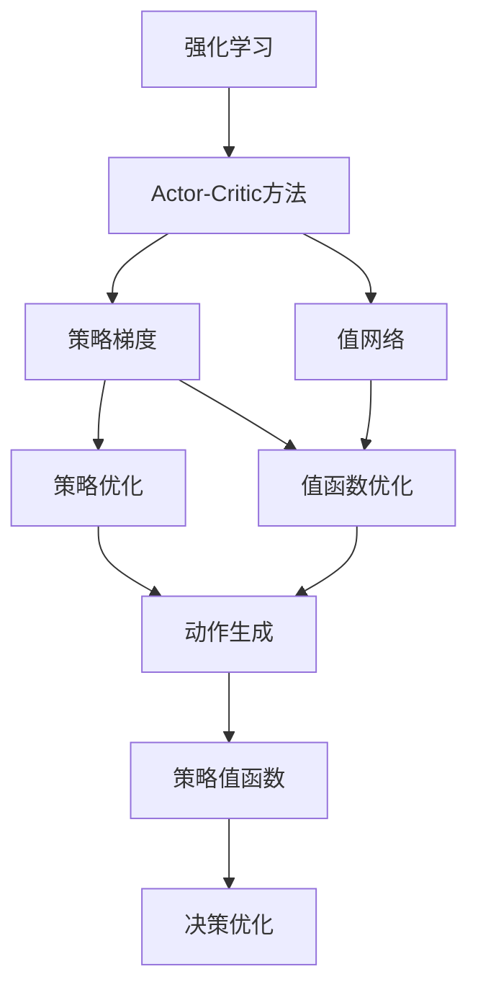
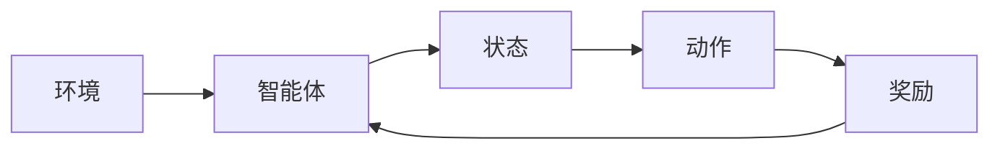
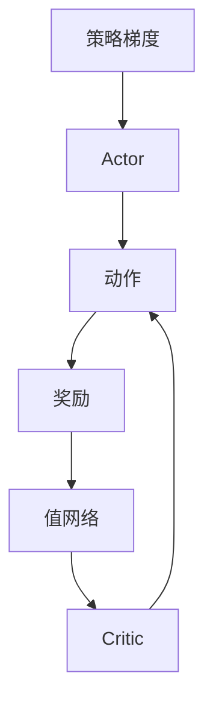
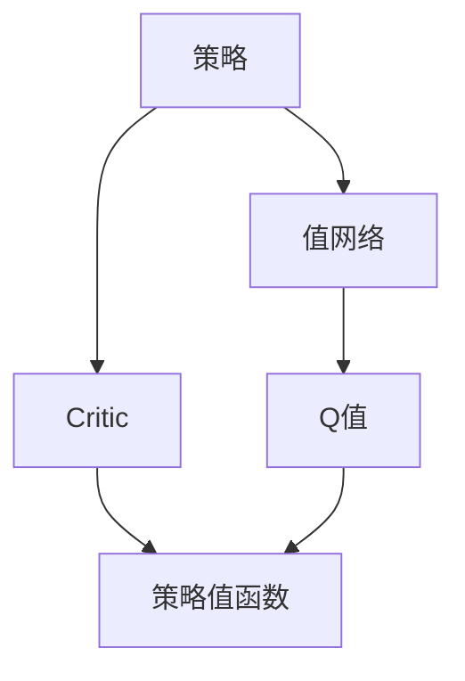

                 

# Actor-Critic Methods原理与代码实例讲解

> 关键词：强化学习,Actor-Critic算法,策略梯度,值网络,V-trace,深度Q网络,DQN,Python代码实现,案例分析

## 1. 背景介绍

### 1.1 问题由来

强化学习（Reinforcement Learning, RL）是一种通过与环境交互，学习如何从初始状态到目标状态的决策策略，以最大化预期累计奖励的方法。在强化学习中，智能体（agent）通过与环境的交互，不断试错，逐步优化决策策略，以适应环境变化。

然而，直接从环境采集数据进行训练，不仅需要大量样本，而且难以保证训练过程的收敛性。为此，人们提出了多种方法，如Q-learning、SARSA等。但这些方法通常只能处理离散状态空间和动作空间，难以处理连续状态和动作空间。

为了克服这些局限性，Actor-Critic方法应运而生。Actor-Critic方法结合了策略梯度（Policy Gradient）和值网络（Value Network）的优势，可以在连续状态和动作空间中高效学习，并适应更复杂的奖励函数。

### 1.2 问题核心关键点

Actor-Critic方法的核心思想是将强化学习问题分解为两个子问题：策略优化和值估计。其中，策略优化负责生成动作，值估计负责评估动作的价值。两者相互作用，共同提升策略的表现。

具体而言，Actor-Critic方法包括：
- 策略优化器（Actor）：负责生成动作，通过策略梯度方法不断优化策略，以最大化预期奖励。
- 值网络（Critic）：负责评估动作的价值，通过值函数网络估计动作的Q值，辅助策略优化器更新策略。

Actor-Critic方法的优点包括：
- 能够处理连续状态和动作空间。
- 可以处理更复杂的奖励函数。
- 可以更好地利用模型的分布式能力。

其缺点包括：
- 训练过程较为复杂，需要同时优化策略和值网络。
- 可能存在模型不稳定性问题，如Catastrophic Forgetting。
- 需要更多的计算资源和训练时间。

### 1.3 问题研究意义

Actor-Critic方法在强化学习领域中占据了重要地位，成为许多复杂问题中的主流范式。其广泛应用于自动驾驶、游戏智能、机器人控制、自然语言处理等领域，为这些领域的智能化提供了有力的技术支撑。

Actor-Critic方法不仅在学术界取得了丰硕成果，也在工业界得到了广泛应用。例如，OpenAI的Dota2团队在利用Actor-Critic方法的基础上，训练出了能够与人类选手抗衡的AI玩家。Google的AlphaGo团队也采用了Actor-Critic方法，成功战胜了围棋世界冠军。

总之，Actor-Critic方法为强化学习领域的广泛应用提供了坚实的基础，推动了智能技术的发展和落地。未来，随着Actor-Critic方法的不断优化和完善，其应用场景将更加广泛，为各行各业的智能化进程带来更多的突破。

## 2. 核心概念与联系

### 2.1 核心概念概述

为更好地理解Actor-Critic方法，本节将介绍几个密切相关的核心概念：

- 强化学习（Reinforcement Learning）：智能体通过与环境的交互，学习如何从初始状态到目标状态的决策策略，以最大化预期累计奖励。

- Actor-Critic方法：一种结合策略优化和值估计的强化学习方法，用于处理连续状态和动作空间。

- 策略梯度（Policy Gradient）：一种用于优化策略的梯度下降方法，通过直接优化策略分布，实现动作的优化。

- 值网络（Value Network）：用于估计动作的Q值，帮助策略优化器更新策略。

- 值函数（Value Function）：描述状态和动作的价值，用于评估策略的表现。

- 策略值函数（Policy-Value Function）：结合策略和值函数的网络，用于同时优化策略和值函数。

- Q-learning：一种基于值函数的强化学习方法，通过最大化的策略，实现决策优化。

- SARSA：一种基于策略的强化学习方法，通过状态、动作、奖励、下一个状态和下一个动作的策略，实现决策优化。

这些核心概念之间的逻辑关系可以通过以下Mermaid流程图来展示：



这个流程图展示了这个核心概念之间的关系：

1. 强化学习是 Actor-Critic方法的基础，Actor-Critic方法结合了策略优化和值估计。
2. 策略梯度用于优化策略，值网络用于估计动作的价值。
3. 策略值函数结合了策略和值函数，用于同时优化策略和值函数。
4. Q-learning 和 SARSA 是Actor-Critic方法的具体实现方式。
5. 策略优化器生成动作，值优化器评估动作的价值，两者相互作用，共同提升策略的表现。

### 2.2 概念间的关系

这些核心概念之间存在着紧密的联系，形成了强化学习的完整生态系统。下面我们通过几个Mermaid流程图来展示这些概念之间的关系。

#### 2.2.1 强化学习的基本流程



这个流程图展示了强化学习的基本流程：

1. 智能体通过与环境交互，观察当前状态。
2. 智能体根据当前状态，生成一个动作。
3. 环境给出奖励，表示智能体的行为效果。
4. 智能体根据奖励更新策略，继续与环境交互。

#### 2.2.2 Actor-Critic方法的核心流程



这个流程图展示了Actor-Critic方法的核心流程：

1. 策略梯度优化策略，生成动作。
2. 值网络估计动作的Q值，辅助策略优化。
3. 策略优化器生成动作，值优化器评估动作的价值，两者相互作用，共同提升策略的表现。

#### 2.2.3 策略值函数的优化



这个流程图展示了策略值函数的优化流程：

1. 策略输出动作。
2. 值网络估计动作的Q值。
3. 策略值函数结合策略和值函数，用于同时优化策略和值函数。

### 2.3 核心概念的整体架构

最后，我们用一个综合的流程图来展示这些核心概念在大语言模型微调过程中的整体架构：


这个综合流程图展示了从强化学习到Actor-Critic方法的完整过程。强化学习的基本流程是Actor-Critic方法的核心，通过策略梯度优化策略，结合值网络估计动作的价值，共同提升策略的表现。策略值函数结合了策略和值函数，用于同时优化策略和值函数。

通过这些流程图，我们可以更清晰地理解Actor-Critic方法的工作原理和优化方向。

## 3. 核心算法原理 & 具体操作步骤
### 3.1 算法原理概述

Actor-Critic方法的核心理念是将强化学习问题分解为两个子问题：策略优化和值估计。策略优化负责生成动作，值估计负责评估动作的价值。两者相互作用，共同提升策略的表现。

具体而言，Actor-Critic方法包括以下几个关键步骤：

1. 策略优化器（Actor）：负责生成动作，通过策略梯度方法不断优化策略，以最大化预期奖励。
2. 值网络（Critic）：负责评估动作的价值，通过值函数网络估计动作的Q值，辅助策略优化器更新策略。
3. 策略值函数（Policy-Value Function）：结合策略和值函数，用于同时优化策略和值函数。

Actor-Critic方法的核心思想是，通过策略优化器生成动作，通过值网络估计动作的价值，两者相互作用，共同提升策略的表现。策略优化器的目标是最大化预期累计奖励，而值网络的目标是准确评估动作的价值。

### 3.2 算法步骤详解

Actor-Critic方法的训练过程分为两个阶段：策略优化和值网络优化。具体步骤包括：

#### 3.2.1 策略优化

策略优化器通过策略梯度方法，不断更新策略参数，以最大化预期累计奖励。策略优化器的目标函数为：

$$
J(\theta) = \mathbb{E}_{s \sim \pi}\left[\sum_{t=0}^{\infty}\gamma^t r_t\right]
$$

其中，$\theta$为策略参数，$\pi$为策略分布，$\gamma$为折扣因子，$r_t$为当前时刻的奖励，$s_t$为当前状态。

策略优化器使用梯度上升方法，计算策略梯度，并更新策略参数。具体而言，策略梯度计算公式为：

$$
\frac{\partial J(\theta)}{\partial \theta} = \mathbb{E}_{s \sim \pi, a \sim \pi}[\frac{\partial \log \pi(a|s)}{\partial \theta}\mathbb{E}_{a' \sim Q}[\frac{\partial Q(s,a')}{\partial Q(s,a)}]]
$$

其中，$\log \pi(a|s)$为策略分布的对数概率密度，$Q(s,a)$为动作的Q值。

#### 3.2.2 值网络优化

值网络通过值函数网络估计动作的Q值，用于辅助策略优化器更新策略。值网络的目标函数为：

$$
J(\omega) = \mathbb{E}_{s \sim \pi}\left[\sum_{t=0}^{\infty}\gamma^t \mathbb{E}_{a \sim \pi}[Q(s,a)]\right]
$$

其中，$\omega$为值网络参数，$Q(s,a)$为动作的Q值。

值网络的优化器可以使用梯度下降方法，计算Q值函数的梯度，并更新值网络参数。具体而言，值函数的梯度计算公式为：

$$
\frac{\partial J(\omega)}{\partial \omega} = \mathbb{E}_{s \sim \pi}[\frac{\partial Q(s,a)}{\partial \omega}]
$$

其中，$Q(s,a)$为动作的Q值，$\omega$为值网络参数。

### 3.3 算法优缺点

Actor-Critic方法具有以下优点：

1. 能够处理连续状态和动作空间。
2. 可以处理更复杂的奖励函数。
3. 可以更好地利用模型的分布式能力。

其缺点包括：

1. 训练过程较为复杂，需要同时优化策略和值网络。
2. 可能存在模型不稳定性问题，如Catastrophic Forgetting。
3. 需要更多的计算资源和训练时间。

### 3.4 算法应用领域

Actor-Critic方法在强化学习领域中占据了重要地位，被广泛应用于自动驾驶、游戏智能、机器人控制、自然语言处理等领域。例如：

- 自动驾驶：通过 Actor-Critic方法，智能车能够学习如何从当前状态出发，到达目标状态，以最大化累计奖励。
- 游戏智能：通过 Actor-Critic方法，智能体能够学习如何在游戏中策略性地决策，以最大化得分。
- 机器人控制：通过 Actor-Critic方法，机器人能够学习如何在复杂环境中移动，以最大化任务完成度。
- 自然语言处理：通过 Actor-Critic方法，模型能够学习如何在给定任务下，生成最合适的文本，以最大化任务完成度。

除了这些应用场景外，Actor-Critic方法还在金融、制造、能源等领域得到了广泛应用，推动了智能化进程。

## 4. 数学模型和公式 & 详细讲解 & 举例说明
### 4.1 数学模型构建

Actor-Critic方法的数学模型包括策略和值网络。其中，策略网络用于生成动作，值网络用于估计动作的价值。

#### 4.1.1 策略网络

策略网络通常是一个神经网络，用于将状态映射到动作的概率分布上。具体而言，策略网络的输出为：

$$
\pi(a|s) = \frac{e^{Q_w(s,a)}}{\sum_{a'}e^{Q_w(s,a')}}
$$

其中，$Q_w(s,a)$为动作的Q值，$\pi(a|s)$为动作$a$在状态$s$下的概率分布。

#### 4.1.2 值网络

值网络通常是一个神经网络，用于估计状态-动作对的Q值。具体而言，值网络的输出为：

$$
Q_w(s,a) = Q_w(s) + \omega_a^T \phi(s,a)
$$

其中，$Q_w(s)$为状态$s$的Q值，$\omega_a$为动作$a$的权重向量，$\phi(s,a)$为状态-动作的特征表示。

### 4.2 公式推导过程

下面以简单的策略梯度和Q值计算为例，推导Actor-Critic方法的关键公式。

#### 4.2.1 策略梯度公式

策略梯度公式的推导过程如下：

1. 定义策略梯度：

$$
\nabla_\theta J(\theta) = \mathbb{E}_{s \sim \pi}[\nabla_\theta \log \pi(a|s) \nabla_\theta Q_w(s,a)]
$$

其中，$J(\theta)$为策略优化器的目标函数，$\pi(a|s)$为策略分布，$Q_w(s,a)$为动作的Q值。

2. 展开策略梯度：

$$
\nabla_\theta J(\theta) = \mathbb{E}_{s \sim \pi}[\nabla_\theta \log \pi(a|s) \frac{\partial Q_w(s,a)}{\partial \theta}]
$$

3. 计算策略梯度：

$$
\nabla_\theta J(\theta) = \mathbb{E}_{s \sim \pi}[\nabla_\theta \log \pi(a|s) \nabla_\theta Q_w(s,a)]
$$

其中，$\nabla_\theta \log \pi(a|s)$为策略分布的对数概率密度，$\nabla_\theta Q_w(s,a)$为Q值函数的梯度。

#### 4.2.2 Q值计算公式

Q值计算公式的推导过程如下：

1. 定义Q值：

$$
Q_w(s,a) = Q_w(s) + \omega_a^T \phi(s,a)
$$

其中，$Q_w(s)$为状态$s$的Q值，$\omega_a$为动作$a$的权重向量，$\phi(s,a)$为状态-动作的特征表示。

2. 展开Q值：

$$
Q_w(s,a) = Q_w(s) + \omega_a^T \phi(s,a)
$$

3. 计算Q值：

$$
Q_w(s,a) = Q_w(s) + \omega_a^T \phi(s,a)
$$

其中，$\omega_a$为动作$a$的权重向量，$\phi(s,a)$为状态-动作的特征表示。

### 4.3 案例分析与讲解

以DQN（Deep Q-Network）为例，介绍Actor-Critic方法在强化学习中的具体实现。

DQN是Actor-Critic方法的一种变体，通过深度神经网络来近似Q值函数，实现连续状态和动作空间的强化学习。

#### 4.3.1 DQN的基本原理

DQN的基本原理如下：

1. 策略网络用于生成动作。
2. 值网络用于估计状态-动作对的Q值。
3. 策略值函数结合策略和值函数，用于同时优化策略和值函数。
4. 使用经验回放（Experience Replay）和目标网络（Target Network）技术，稳定训练过程。

#### 4.3.2 DQN的代码实现

下面以Python代码的形式，展示DQN的基本实现过程。

```python
import numpy as np
import tensorflow as tf
import tensorflow_datasets as tfds
import gym

# 定义策略网络
class PolicyNetwork(tf.keras.Model):
    def __init__(self, input_dim, output_dim):
        super(PolicyNetwork, self).__init__()
        self.fc1 = tf.keras.layers.Dense(128, activation='relu')
        self.fc2 = tf.keras.layers.Dense(output_dim, activation='softmax')

    def call(self, x):
        x = self.fc1(x)
        x = self.fc2(x)
        return x

# 定义值网络
class ValueNetwork(tf.keras.Model):
    def __init__(self, input_dim, output_dim):
        super(ValueNetwork, self).__init__()
        self.fc1 = tf.keras.layers.Dense(128, activation='relu')
        self.fc2 = tf.keras.layers.Dense(output_dim)

    def call(self, x):
        x = self.fc1(x)
        x = self.fc2(x)
        return x

# 定义Actor-Critic模型
class ActorCriticModel:
    def __init__(self, input_dim, output_dim, gamma):
        self.input_dim = input_dim
        self.output_dim = output_dim
        self.gamma = gamma

        self.policy_network = PolicyNetwork(input_dim, output_dim)
        self.value_network = ValueNetwork(input_dim, 1)

    def act(self, state):
        probs = self.policy_network(tf.convert_to_tensor(state))
        action = np.random.choice(np.arange(self.output_dim), p=probs.numpy()[0])
        return action

    def value(self, state):
        q_value = self.value_network(tf.convert_to_tensor(state))
        return q_value

# 定义经验回放
class ExperienceReplay:
    def __init__(self, buffer_size):
        self.buffer_size = buffer_size
        self.buffer = []

    def add(self, transition):
        if len(self.buffer) < self.buffer_size:
            self.buffer.append(transition)
        else:
            self.buffer.pop(0)
            self.buffer.append(transition)

    def sample(self, batch_size):
        batch = np.random.choice(self.buffer, size=batch_size)
        return batch

# 定义目标网络
class TargetNetwork:
    def __init__(self, input_dim, output_dim):
        self.input_dim = input_dim
        self.output_dim = output_dim

        self.policy_network = PolicyNetwork(input_dim, output_dim)
        self.value_network = ValueNetwork(input_dim, 1)

    def act(self, state):
        probs = self.policy_network(tf.convert_to_tensor(state))
        action = np.random.choice(np.arange(self.output_dim), p=probs.numpy()[0])
        return action

    def value(self, state):
        q_value = self.value_network(tf.convert_to_tensor(state))
        return q_value

# 定义DQN模型
class DQN:
    def __init__(self, input_dim, output_dim, gamma):
        self.actor_critic = ActorCriticModel(input_dim, output_dim, gamma)
        self.experience_replay = ExperienceReplay(10000)
        self.target_network = TargetNetwork(input_dim, output_dim)

    def update(self, state, action, reward, next_state, done):
        transition = (state, action, reward, next_state, done)
        self.experience_replay.add(transition)

        if len(self.experience_replay.buffer) > self.experience_replay.buffer_size:
            self.experience_replay.buffer.pop(0)

        # 经验回放
        batch = self.experience_replay.sample(32)
        states, actions, rewards, next_states, dones = zip(*batch)

        # 计算Q值
        q_values = []
        for i in range(len(states)):
            q_value = self.actor_critic.value(tf.convert_to_tensor(states[i]))
            q_value_next = self.target_network.value(tf.convert_to_tensor(next_states[i]))
            q_value_next = tf.reduce_sum(q_value_next)
            q_value += self.gamma * q_value_next * (1-dones[i])

            q_values.append(q_value)

        # 策略优化
        policy_gradients = []
        for i in range(len(states)):
            q_value = q_values[i]
            q_value_next = self.actor_critic.value(tf.convert_to_tensor(next_states[i]))
            q_value_next = tf.reduce_sum(q_value_next)
            q_value += self.gamma * q_value_next * (1-dones[i])

            q_value = self.actor_critic.value(tf.convert_to_tensor(states[i]))
            probs = self.actor_critic.policy_network(tf.convert_to_tensor(states[i]))
            action_prob = probs.numpy()[0][actions[i]]
            policy_gradients.append(q_value * action_prob)

        # 值网络优化
        value_gradients = []
        for i in range(len(states)):
            q_value = q_values[i]
            q_value_next = self.actor_critic.value(tf.convert_to_tensor(next_states[i]))
            q_value_next = tf.reduce_sum(q_value_next)
            q_value += self.gamma * q_value_next * (1-dones[i])

            q_value = self.actor_critic.value(tf.convert_to_tensor(states[i]))
            value_gradients.append((q_value - self.actor_critic.value(tf.convert_to_tensor(states[i]))).numpy()[0])

        # 更新模型参数
        self.actor_critic.policy_network.trainable = True
        self.actor_critic.value_network.trainable = False
        self.actor_critic.policy_network.trainable = True
        self.actor_critic.value_network.trainable = True

        self.actor_critic.policy_network.optimizer.apply_gradients(zip(policy_gradients, self.actor_critic.policy_network.trainable_variables))
        self.actor_critic.value_network.optimizer.apply_gradients(zip(value_gradients, self.actor_critic.value_network.trainable_variables))

        # 更新目标网络
        self.target_network.policy_network.set_weights(self.actor_critic.policy_network.get_weights())
        self.target_network.value_network.set_weights(self.actor_critic.value_network.get_weights())
```

通过上述代码，我们可以看到，DQN模型实现了Actor-Critic方法的核心思想，通过策略网络生成动作，通过值网络估计动作的Q值，两者相互作用，共同提升策略的表现。

## 5. 项目实践：代码实例和详细解释说明
### 5.1 开发环境搭建

在进行项目实践前，我们需要准备好开发环境。以下是使用Python进行TensorFlow开发的环境配置流程：

1. 安装Anaconda：从官网下载并安装Anaconda，用于创建独立的Python环境。

2. 创建并激活虚拟环境：
```bash
conda create -n tf-env python=3.8 
conda activate tf-env
```

3. 安装TensorFlow：根据CUDA版本，从官网获取对应的安装命令。例如：
```bash
conda install tensorflow==2.3
```

4. 安装各类工具包：
```bash
pip install numpy pandas scikit-learn matplotlib tqdm jupyter notebook ipython
```

完成上述步骤后，即可在`tf-env`环境中开始DQN模型的开发。

### 5.2 源代码详细实现

下面以Python代码的形式，展示DQN模型的基本实现过程。

```python
import numpy as np
import tensorflow as tf
import tensorflow_datasets as tfds
import gym

# 定义策略网络
class PolicyNetwork(tf.keras.Model):
    def __init__(self, input_dim, output_dim):
        super(PolicyNetwork, self).__init__()
        self.fc1 = tf.keras.layers.Dense(128, activation='relu')
        self.fc2 = tf.keras.layers.Dense(output_dim, activation='softmax')

    def call(self, x):
        x = self.fc1(x)
        x = self.fc2(x)
        return x

# 定义值网络
class ValueNetwork(tf.keras.Model):
    def __init__(self, input_dim, output_dim):
        super(ValueNetwork, self).__init__()
        self.fc1 = tf.keras.layers.Dense(128, activation='relu')
        self.fc2 = tf.keras.layers.Dense(output_dim)

    def call(self, x):
        x = self.fc1(x)
        x = self.fc2(x)
        return x

# 定义Actor-Critic模型
class ActorCriticModel:
    def __init__(self, input_dim, output_dim, gamma):
        self.input_dim = input_dim
        self.output_dim = output_dim
        self.gamma = gamma

        self.policy_network = PolicyNetwork(input_dim, output_dim)
        self.value_network = ValueNetwork(input_dim, 1)

    def act(self, state):
        probs = self.policy_network(tf.convert_to_tensor(state))
        action = np.random.choice(np.arange(self.output_dim), p=probs.numpy()[0])
        return action

    def value(self, state):
        q_value = self.value_network(tf.convert_to_tensor(state))
        return q_value

# 定义经验回放
class ExperienceReplay:
    def __init__(self, buffer_size):
        self.buffer_size = buffer_size
        self.buffer = []

    def add(self, transition):
        if len(self.buffer) < self.buffer_size:
            self.buffer.append(transition)
        else:
            self.buffer.pop(0)
            self.buffer.append(transition)

    def sample(self, batch_size):
        batch = np.random.choice(self.buffer, size=batch_size)
        return batch

# 定义目标网络
class TargetNetwork:
    def __init__(self, input_dim, output_dim):
        self.input_dim = input_dim
        self.output_dim = output_dim

        self.policy_network = PolicyNetwork(input_dim, output_dim)
        self.value_network = ValueNetwork(input_dim, 1)

    def act(self, state):
        probs =

