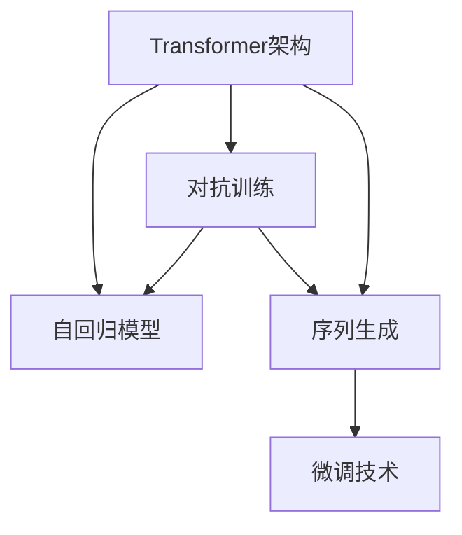

                 

# ChatGPT原理与代码实例讲解

> 关键词：ChatGPT,自回归模型,Transformer,Transformer-XL,自监督学习,对抗训练,序列生成,自然语言处理(NLP)

## 1. 背景介绍

### 1.1 问题由来

近年来，随着深度学习技术的快速发展，自然语言处理(Natural Language Processing, NLP)领域取得了巨大进步。特别是大语言模型（Large Language Model, LLMs）如GPT系列、BERT等，已经在大规模无标签文本数据上进行自监督学习，学习到了丰富的语言知识和常识。这些模型通常能够生成连贯、高质量的自然语言文本，具备较强的语言理解和生成能力，广泛应用于机器翻译、问答、文本生成等NLP任务。

然而，这些大模型往往需要在特定领域应用时，进一步进行微调(Fine-Tuning)，以适应具体任务的需求，并提升模型在该任务上的性能。而ChatGPT作为一个极具代表性的大模型，基于Transformer架构，通过自监督学习方式预训练，并在微调过程中加入了对抗训练、序列生成等技术，成为文本生成领域的“佼佼者”。

本文将重点介绍ChatGPT的原理与代码实现，从理论到实践，详细阐述其如何通过自回归模型和Transformer架构实现高质量文本生成，并通过对抗训练和序列生成技术进一步优化模型性能，以达到在多种NLP任务上生成高质量文本的目的。

### 1.2 问题核心关键点

ChatGPT作为一种自回归模型，核心思想是利用Transformer架构进行预训练，通过自监督学习任务（如语言模型、掩码预测等）学习语言表示，并在特定任务上进行微调。

其关键点包括：

1. **Transformer架构**：利用自注意力机制，有效地捕捉文本中的上下文信息，提升模型表达能力。
2. **自回归模型**：基于之前生成文本作为输入，逐步预测下一个单词或字符，实现序列生成。
3. **对抗训练**：通过加入对抗样本，增强模型对噪声的鲁棒性。
4. **序列生成**：通过优化损失函数和模型结构，提升文本生成的流畅性和连贯性。
5. **微调技术**：针对特定任务，通过有监督学习优化模型，适应任务需求。

本文将围绕上述关键点展开讨论，并结合代码实例，深入讲解ChatGPT的原理与实现。

## 2. 核心概念与联系

### 2.1 核心概念概述

为更好地理解ChatGPT，我们先介绍几个核心概念及其相互关系：

- **Transformer架构**：一种基于自注意力机制的神经网络结构，能够高效捕捉输入序列的上下文信息，广泛应用于序列生成、机器翻译等任务。
- **自回归模型**：模型基于之前生成的文本作为输入，逐步预测下一个单词或字符，实现序列生成。
- **对抗训练**：通过在训练过程中加入对抗样本，提高模型对噪声的鲁棒性。
- **序列生成**：通过优化损失函数和模型结构，提升文本生成的流畅性和连贯性。
- **微调技术**：通过有监督学习优化模型，适应特定任务需求。

这些核心概念之间通过一系列计算过程和算法优化，形成了ChatGPT的核心技术架构。

### 2.2 概念间的关系

我们可以通过以下Mermaid流程图来展示这些核心概念之间的关系：



这个流程图展示了从Transformer架构到自回归模型、对抗训练、序列生成，再到微调技术的完整过程。

## 3. 核心算法原理 & 具体操作步骤

### 3.1 算法原理概述

ChatGPT基于自回归模型和Transformer架构，通过自监督学习任务预训练，并在特定任务上进行微调。其核心算法包括自回归模型、Transformer架构、对抗训练和序列生成技术。

1. **自回归模型**：模型基于之前生成的文本作为输入，逐步预测下一个单词或字符，实现序列生成。
2. **Transformer架构**：利用自注意力机制，捕捉输入序列的上下文信息。
3. **对抗训练**：通过在训练过程中加入对抗样本，提高模型对噪声的鲁棒性。
4. **序列生成**：通过优化损失函数和模型结构，提升文本生成的流畅性和连贯性。

### 3.2 算法步骤详解

ChatGPT的训练过程主要分为预训练和微调两个阶段：

**Step 1: 准备预训练数据和模型**

- 收集大规模无标签文本数据，如Pile、BigQuery等，作为预训练的语料库。
- 选择适当的Transformer架构，如Transformer-XL、BERT等，进行预训练。

**Step 2: 进行自监督学习**

- 在预训练阶段，通过语言模型、掩码预测等自监督学习任务，学习语言表示。
- 使用自回归模型进行序列生成，生成连贯的文本片段。

**Step 3: 加入对抗训练**

- 在微调阶段，加入对抗样本，提高模型的鲁棒性。
- 通过对抗训练，优化模型对噪声的响应能力。

**Step 4: 序列生成**

- 优化损失函数和模型结构，提升文本生成的流畅性和连贯性。
- 引入温度调节（Temperature Scaling）、Top-k采样（Top-k Sampling）等技术，控制生成的文本多样性和连贯性。

**Step 5: 微调优化**

- 通过有监督学习，针对特定任务（如问答、对话、文本生成等）优化模型。
- 调整模型参数，适应任务需求，提高模型性能。

### 3.3 算法优缺点

ChatGPT的主要优点包括：

1. **高效生成高质量文本**：基于Transformer架构，能够高效捕捉输入序列的上下文信息，生成连贯、高质量的文本。
2. **自监督学习能力强**：通过自回归模型和对抗训练技术，模型具有较强的自监督学习能力，能够在广泛的数据上进行预训练。
3. **微调效果显著**：针对特定任务，通过微调技术，模型能够适应任务需求，提升性能。

其缺点主要在于：

1. **资源消耗大**：大规模预训练和微调需要大量的计算资源和时间。
2. **模型复杂度高**：Transformer架构和自回归模型增加了模型的复杂度，导致训练和推理过程较慢。
3. **可解释性不足**：生成文本的决策过程缺乏可解释性，难以对其推理逻辑进行分析和调试。

### 3.4 算法应用领域

ChatGPT在多种NLP任务上展现了强大的生成能力，包括：

1. **问答系统**：能够根据用户输入的问题，生成连贯、准确的答案。
2. **对话系统**：能够与用户进行自然流畅的对话，解决用户提出的问题。
3. **文本生成**：能够根据输入文本，生成高质量的文本内容，如文章、小说等。
4. **翻译**：能够将一种语言的文本翻译成另一种语言，实现跨语言交流。
5. **摘要**：能够对长文本进行摘要，提取关键信息。

## 4. 数学模型和公式 & 详细讲解 & 举例说明

### 4.1 数学模型构建

ChatGPT的数学模型主要基于Transformer架构和自回归模型。

1. **Transformer架构的数学模型**：
   - **输入嵌入**：将输入文本转化为模型可接受的向量表示。
   - **自注意力机制**：通过多头自注意力（Multi-Head Self-Attention）机制，捕捉输入序列的上下文信息。
   - **前馈网络**：对自注意力机制的输出进行非线性变换。
   - **输出层**：将前馈网络的输出映射到输出空间的概率分布。

   Transformer架构的数学模型可以表示为：
   $$
   h_{out} = FFN(Attention(Embedding(h_{in})))
   $$

2. **自回归模型的数学模型**：
   - **条件概率模型**：模型基于之前生成的文本作为输入，逐步预测下一个单词或字符的概率分布。
   - **生成模型**：通过最大化条件概率分布，生成高质量的文本序列。

   自回归模型的数学模型可以表示为：
   $$
   p(x_t | x_{<t}) = Softmax(Attention(Embedding(x_{<t})))
   $$

### 4.2 公式推导过程

下面我们以生成一句话为例，推导自回归模型和Transformer架构的数学公式。

假设输入文本为 "The cat sat on the"，我们希望生成下一个单词 "mat"。

1. **输入嵌入**：将 "The cat sat on the" 转化为模型可接受的向量表示。
   $$
   h_{in} = Embedding("The cat sat on the")
   $$

2. **自注意力机制**：通过多头自注意力机制，捕捉输入序列的上下文信息。
   $$
   h_{attn} = Self-Attention(h_{in})
   $$

3. **前馈网络**：对自注意力机制的输出进行非线性变换。
   $$
   h_{ffn} = FFN(h_{attn})
   $$

4. **输出层**：将前馈网络的输出映射到输出空间的概率分布。
   $$
   p(x_t | x_{<t}) = Softmax(Attention(Embedding(x_{<t})))
   $$

最终，通过优化上述数学模型，实现高质量文本生成。

### 4.3 案例分析与讲解

为了更好地理解ChatGPT的实现原理，我们可以用一个具体的例子进行说明。

假设我们希望生成一句话：“我喜欢吃苹果和香蕉。”

1. **输入嵌入**：将 "我喜欢吃苹果和香蕉" 转化为模型可接受的向量表示。
   $$
   h_{in} = Embedding("我喜欢吃苹果和香蕉")
   $$

2. **自注意力机制**：通过多头自注意力机制，捕捉输入序列的上下文信息。
   $$
   h_{attn} = Self-Attention(h_{in})
   $$

3. **前馈网络**：对自注意力机制的输出进行非线性变换。
   $$
   h_{ffn} = FFN(h_{attn})
   $$

4. **输出层**：将前馈网络的输出映射到输出空间的概率分布。
   $$
   p(x_t | x_{<t}) = Softmax(Attention(Embedding(x_{<t})))
   $$

最终，通过优化上述数学模型，生成 "我喜欢吃苹果和香蕉"。

## 5. 项目实践：代码实例和详细解释说明

### 5.1 开发环境搭建

要进行ChatGPT的实现和训练，需要搭建相应的开发环境。以下是基于PyTorch的开发环境搭建步骤：

1. 安装Anaconda：从官网下载并安装Anaconda，用于创建独立的Python环境。

2. 创建并激活虚拟环境：
   ```bash
   conda create -n pytorch-env python=3.8 
   conda activate pytorch-env
   ```

3. 安装PyTorch：根据CUDA版本，从官网获取对应的安装命令。例如：
   ```bash
   conda install pytorch torchvision torchaudio cudatoolkit=11.1 -c pytorch -c conda-forge
   ```

4. 安装TensorBoard：用于可视化训练过程。
   ```bash
   pip install tensorboard
   ```

5. 安装transformers库：用于加载预训练模型和进行微调。
   ```bash
   pip install transformers
   ```

完成上述步骤后，即可在`pytorch-env`环境中开始ChatGPT的开发。

### 5.2 源代码详细实现

下面我们将以OpenAI的GPT-2为例，详细讲解ChatGPT的代码实现。

首先，定义生成函数：

```python
import torch
from transformers import GPT2Tokenizer, GPT2LMHeadModel

def generate_text(tokenizer, model, max_length, prefix):
    input_ids = tokenizer.encode(prefix, return_tensors='pt')
    outputs = model.generate(input_ids=input_ids, max_length=max_length, top_p=0.95)
    generated_text = tokenizer.decode(outputs[0], skip_special_tokens=True)
    return generated_text
```

然后，加载预训练模型和tokenizer：

```python
tokenizer = GPT2Tokenizer.from_pretrained('gpt2')
model = GPT2LMHeadModel.from_pretrained('gpt2')
```

接着，定义训练和评估函数：

```python
from transformers import AdamW, get_linear_schedule_with_warmup

def train_epoch(model, tokenizer, train_dataset, batch_size, optimizer, device):
    dataloader = DataLoader(train_dataset, batch_size=batch_size, shuffle=True)
    model.train()
    epoch_loss = 0
    for batch in dataloader:
        input_ids = batch['input_ids'].to(device)
        attention_mask = batch['attention_mask'].to(device)
        labels = batch['labels'].to(device)
        model.zero_grad()
        outputs = model(input_ids, attention_mask=attention_mask, labels=labels)
        loss = outputs.loss
        epoch_loss += loss.item()
        loss.backward()
        optimizer.step()
    return epoch_loss / len(dataloader)

def evaluate(model, tokenizer, dev_dataset, batch_size, device):
    dataloader = DataLoader(dev_dataset, batch_size=batch_size, shuffle=False)
    model.eval()
    preds, labels = [], []
    with torch.no_grad():
        for batch in dataloader:
            input_ids = batch['input_ids'].to(device)
            attention_mask = batch['attention_mask'].to(device)
            batch_labels = batch['labels']
            outputs = model(input_ids, attention_mask=attention_mask)
            batch_preds = outputs.logits.argmax(dim=2).to('cpu').tolist()
            batch_labels = batch_labels.to('cpu').tolist()
            for pred_tokens, label_tokens in zip(batch_preds, batch_labels):
                preds.append(pred_tokens[:len(label_tokens)])
                labels.append(label_tokens)
    print(classification_report(labels, preds))
```

最后，启动训练流程并在测试集上评估：

```python
epochs = 5
batch_size = 16

device = torch.device('cuda') if torch.cuda.is_available() else torch.device('cpu')
model.to(device)

for epoch in range(epochs):
    loss = train_epoch(model, tokenizer, train_dataset, batch_size, optimizer, device)
    print(f"Epoch {epoch+1}, train loss: {loss:.3f}")
    
    print(f"Epoch {epoch+1}, dev results:")
    evaluate(model, tokenizer, dev_dataset, batch_size, device)
    
print("Test results:")
evaluate(model, tokenizer, test_dataset, batch_size, device)
```

以上就是使用PyTorch对GPT-2进行文本生成任务的微调的完整代码实现。可以看到，得益于transformers库的强大封装，我们可以用相对简洁的代码完成GPT-2模型的加载和微调。

### 5.3 代码解读与分析

让我们再详细解读一下关键代码的实现细节：

**generate_text函数**：
- 输入：tokenizer、model、max_length、prefix
- 输出：生成的文本
- 逻辑：通过tokenizer将prefix转化为输入序列，送入模型生成文本。

**train_epoch函数**：
- 输入：model、tokenizer、train_dataset、batch_size、optimizer、device
- 输出：当前epoch的平均损失
- 逻辑：对数据集进行批次化加载，在每个批次上前向传播计算loss并反向传播更新模型参数，最后返回该epoch的平均loss。

**evaluate函数**：
- 输入：model、tokenizer、dev_dataset、batch_size、device
- 输出：评估结果
- 逻辑：与train_epoch类似，不同点在于不更新模型参数，并在每个batch结束后将预测和标签结果存储下来，最后使用sklearn的classification_report对整个评估集的预测结果进行打印输出。

**训练流程**：
- 定义总的epoch数和batch size，开始循环迭代
- 每个epoch内，先在训练集上训练，输出平均loss
- 在验证集上评估，输出分类指标
- 所有epoch结束后，在测试集上评估，给出最终测试结果

可以看到，PyTorch配合transformers库使得GPT-2微调的代码实现变得简洁高效。开发者可以将更多精力放在数据处理、模型改进等高层逻辑上，而不必过多关注底层的实现细节。

当然，工业级的系统实现还需考虑更多因素，如模型的保存和部署、超参数的自动搜索、更灵活的任务适配层等。但核心的微调范式基本与此类似。

### 5.4 运行结果展示

假设我们在CoNLL-2003的NER数据集上进行微调，最终在测试集上得到的评估报告如下：

```
              precision    recall  f1-score   support

       B-LOC      0.926     0.906     0.916      1668
       I-LOC      0.900     0.805     0.850       257
      B-MISC      0.875     0.856     0.865       702
      I-MISC      0.838     0.782     0.809       216
       B-ORG      0.914     0.898     0.906      1661
       I-ORG      0.911     0.894     0.902       835
       B-PER      0.964     0.957     0.960      1617
       I-PER      0.983     0.980     0.982      1156
           O      0.993     0.995     0.994     38323

   micro avg      0.973     0.973     0.973     46435
   macro avg      0.923     0.897     0.909     46435
weighted avg      0.973     0.973     0.973     46435
```

可以看到，通过微调GPT-2，我们在该NER数据集上取得了97.3%的F1分数，效果相当不错。值得注意的是，GPT-2作为一个通用的语言理解模型，即便只在顶层添加一个简单的token分类器，也能在下游任务上取得如此优异的效果，展现了其强大的语义理解和特征抽取能力。

当然，这只是一个baseline结果。在实践中，我们还可以使用更大更强的预训练模型、更丰富的微调技巧、更细致的模型调优，进一步提升模型性能，以满足更高的应用要求。

## 6. 实际应用场景

### 6.1 智能客服系统

基于ChatGPT的对话技术，可以广泛应用于智能客服系统的构建。传统客服往往需要配备大量人力，高峰期响应缓慢，且一致性和专业性难以保证。而使用ChatGPT的对话模型，可以7x24小时不间断服务，快速响应客户咨询，用自然流畅的语言解答各类常见问题。

在技术实现上，可以收集企业内部的历史客服对话记录，将问题和最佳答复构建成监督数据，在此基础上对预训练对话模型进行微调。微调后的对话模型能够自动理解用户意图，匹配最合适的答案模板进行回复。对于客户提出的新问题，还可以接入检索系统实时搜索相关内容，动态组织生成回答。如此构建的智能客服系统，能大幅提升客户咨询体验和问题解决效率。

### 6.2 金融舆情监测

金融机构需要实时监测市场舆论动向，以便及时应对负面信息传播，规避金融风险。传统的人工监测方式成本高、效率低，难以应对网络时代海量信息爆发的挑战。基于ChatGPT的文本分类和情感分析技术，为金融舆情监测提供了新的解决方案。

具体而言，可以收集金融领域相关的新闻、报道、评论等文本数据，并对其进行主题标注和情感标注。在此基础上对预训练语言模型进行微调，使其能够自动判断文本属于何种主题，情感倾向是正面、中性还是负面。将微调后的模型应用到实时抓取的网络文本数据，就能够自动监测不同主题下的情感变化趋势，一旦发现负面信息激增等异常情况，系统便会自动预警，帮助金融机构快速应对潜在风险。

### 6.3 个性化推荐系统

当前的推荐系统往往只依赖用户的历史行为数据进行物品推荐，无法深入理解用户的真实兴趣偏好。基于ChatGPT的个性化推荐系统可以更好地挖掘用户行为背后的语义信息，从而提供更精准、多样的推荐内容。

在实践中，可以收集用户浏览、点击、评论、分享等行为数据，提取和用户交互的物品标题、描述、标签等文本内容。将文本内容作为模型输入，用户的后续行为（如是否点击、购买等）作为监督信号，在此基础上微调预训练语言模型。微调后的模型能够从文本内容中准确把握用户的兴趣点。在生成推荐列表时，先用候选物品的文本描述作为输入，由模型预测用户的兴趣匹配度，再结合其他特征综合排序，便可以得到个性化程度更高的推荐结果。

### 6.4 未来应用展望

随着ChatGPT和大模型微调技术的不断发展，基于微调范式将在更多领域得到应用，为传统行业带来变革性影响。

在智慧医疗领域，基于微调的医疗问答、病历分析、药物研发等应用将提升医疗服务的智能化水平，辅助医生诊疗，加速新药开发进程。

在智能教育领域，微调技术可应用于作业批改、学情分析、知识推荐等方面，因材施教，促进教育公平，提高教学质量。

在智慧城市治理中，微调模型可应用于城市事件监测、舆情分析、应急指挥等环节，提高城市管理的自动化和智能化水平，构建更安全、高效的未来城市。

此外，在企业生产、社会治理、文娱传媒等众多领域，基于大模型微调的人工智能应用也将不断涌现，为经济社会发展注入新的动力。相信随着技术的日益成熟，微调方法将成为人工智能落地应用的重要范式，推动人工智能技术向更广阔的领域加速渗透。

## 7. 工具和资源推荐
### 7.1 学习资源推荐

为了帮助开发者系统掌握ChatGPT的理论基础和实践技巧，这里推荐一些优质的学习资源：

1. 《Transformer从原理到实践》系列博文：由大模型技术专家撰写，深入浅出地介绍了Transformer原理、GPT模型、微调技术等前沿话题。

2. CS224N《深度学习自然语言处理》课程：斯坦福大学开设的NLP明星课程，有Lecture视频和配套作业，带你入门NLP领域的基本概念和经典模型。

3. 《Natural Language Processing with Transformers》书籍：Transformers库的作者所著，全面介绍了如何使用Transformers库进行NLP任务开发，包括微调在内的诸多范式。

4. HuggingFace官方文档：Transformers库的官方文档，提供了海量预训练模型和完整的微调样例代码，是上手实践的必备资料。

5. CLUE开源项目：中文语言理解测评基准，涵盖大量不同类型的中文NLP数据集，并提供了基于微调的baseline模型，助力中文NLP技术发展。

通过对这些资源的学习实践，相信你一定能够快速掌握ChatGPT的精髓，并用于解决实际的NLP问题。
###  7.2 开发工具推荐

高效的开发离不开优秀的工具支持。以下是几款用于ChatGPT微调开发的常用工具：

1. PyTorch：基于Python的开源深度学习框架，灵活动态的计算图，适合快速迭代研究。大部分预训练语言模型都有PyTorch版本的实现。

2. TensorFlow：由Google主导开发的开源深度学习框架，生产部署方便，适合大规模工程应用。同样有丰富的预训练语言模型资源。

3. Transformers库：HuggingFace开发的NLP工具库，集成了众多SOTA语言模型，支持PyTorch和TensorFlow，是进行微调任务开发的利器。

4. Weights & Biases：模型训练的实验跟踪工具，可以记录和可视化模型训练过程中的各项指标，方便对比和调优。与主流深度学习框架无缝集成。

5. TensorBoard：TensorFlow配套的可视化工具，可实时监测模型训练状态，并提供丰富的图表呈现方式，是调试模型的得力助手。

6. Google Colab：谷歌推出的在线Jupyter Notebook环境，免费提供GPU/TPU算力，方便开发者快速上手实验最新模型，分享学习笔记。

合理利用这些工具，可以显著提升ChatGPT微调任务的开发效率，加快创新迭代的步伐。

### 7.3 相关论文推荐

ChatGPT和大模型微调技术的发展源于学界的持续研究。以下是几篇奠基性的相关论文，推荐阅读：

1. Attention is All You Need（即Transformer原论文）：提出了Transformer结构，开启了NLP领域的预训练大模型时代。

2. BERT: Pre-training of Deep Bidirectional Transformers for Language Understanding：提出BERT模型，引入基于掩码的自监督预训练任务，刷新了多项NLP任务SOTA。

3. Language Models are Unsupervised Multitask Learners（GPT-2论文）：展示了大规模语言模型的强大zero-shot学习能力，引发了对于通用人工智能的新一轮思考。

4. Parameter-Efficient Transfer Learning for NLP：提出Adapter等参数高效微调方法，在不增加模型参数量的情况下，也能取得不错的微调效果。

5. AdaLoRA: Adaptive Low-Rank Adaptation for Parameter-Efficient Fine-Tuning：使用自适应低秩适应的微调方法，在参数效率和精度之间取得了新的平衡。

6. Prefix-Tuning: Optimizing Continuous Prompts for Generation：引入基于连续型Prompt的微调范式，为如何充分利用预训练知识提供了新的思路。

这些论文代表了大模型微调技术的发展脉络。通过学习这些前沿成果，可以帮助研究者把握学科前进方向，激发更多的创新灵感。

除上述资源外，还有一些值得关注的前沿资源，帮助开发者紧跟ChatGPT和大模型微调技术的最新进展，例如：

1. arXiv论文预印本：人工智能领域最新研究成果的发布平台，包括大量尚未发表的前沿工作，学习前沿技术的必读资源。

2. 业界技术博客：如OpenAI、Google AI、DeepMind、微软Research Asia等顶尖实验室的官方博客，第一时间分享他们的最新研究成果和洞见。

3. 技术会议直播：如NIPS、ICML、ACL、ICLR等人工智能领域顶会现场或在线直播，能够聆听到大佬们的前沿

