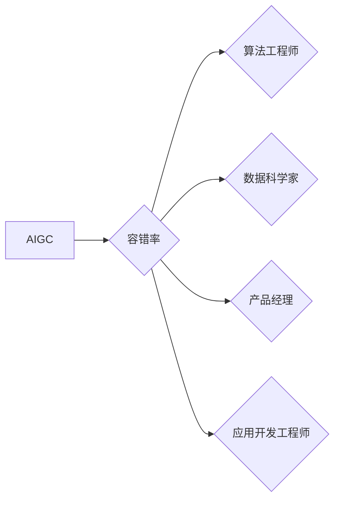

## AIGC从入门到实战：根据容错率来确定职业路径

> 关键词：AIGC, 容错率, 职业路径,  算法原理,  数学模型,  项目实践,  实际应用场景

## 1. 背景介绍

近年来，人工智能（AI）技术飞速发展，特别是生成式人工智能（AIGC）的兴起，为人们的生活和工作带来了革命性的改变。AIGC能够根据输入的文本、代码、图像等数据生成新的内容，例如文本创作、代码生成、图像合成等。

随着AIGC技术的不断进步，其应用场景也越来越广泛，涵盖了各个领域，例如教育、医疗、娱乐、设计等。然而，AIGC技术也面临着一些挑战，例如数据安全、算法偏见、内容原创性等。

在AIGC领域，容错率是一个重要的指标，它反映了模型在面对错误或噪声数据时能够保持准确性和稳定性的能力。容错率高的模型能够更好地应对实际应用中的各种挑战，因此，在选择AIGC职业路径时，需要根据自身的容错率来确定合适的领域和方向。

## 2. 核心概念与联系

### 2.1  AIGC

AIGC是指利用人工智能技术生成新内容的系统。它可以接受各种形式的输入，例如文本、代码、图像等，并根据输入生成新的文本、代码、图像等内容。

### 2.2  容错率

容错率是指系统在面对错误或噪声数据时能够保持正确性和稳定性的能力。容错率高的系统能够更好地应对实际应用中的各种挑战，例如数据不完整、数据错误、环境变化等。

### 2.3  职业路径

AIGC领域涵盖了多个不同的职业方向，例如：

* **AIGC算法工程师:** 负责设计、开发和优化AIGC算法模型。
* **AIGC数据科学家:** 负责收集、清洗、分析和处理AIGC训练数据。
* **AIGC产品经理:** 负责AIGC产品的规划、设计和开发。
* **AIGC应用开发工程师:** 负责将AIGC技术应用到实际产品中。

**Mermaid 流程图**



## 3. 核心算法原理 & 具体操作步骤

### 3.1  算法原理概述

AIGC的核心算法主要包括：

* **自然语言处理（NLP）:** 用于理解和生成人类语言。
* **深度学习（DL）:** 用于训练复杂的机器学习模型。
* **生成对抗网络（GAN）:** 用于生成逼真的图像、文本等内容。

### 3.2  算法步骤详解

**以文本生成为例，AIGC算法的具体步骤如下：**

1. **数据预处理:** 收集和清洗文本数据，将其转换为模型可以理解的格式。
2. **模型训练:** 使用深度学习算法训练AIGC模型，使其能够学习文本的语法、语义和风格。
3. **文本生成:** 根据输入的文本提示，模型生成新的文本内容。
4. **文本评估:** 使用评价指标评估生成的文本质量，例如流畅度、准确性、相关性等。
5. **模型优化:** 根据评估结果，调整模型参数，提高文本生成质量。

### 3.3  算法优缺点

**优点:**

* **自动化生成:** 可以自动生成大量文本内容，节省人力成本。
* **个性化定制:** 可以根据用户的需求定制生成内容的风格和主题。
* **创意灵感:** 可以帮助用户激发创意灵感，生成新的文本内容。

**缺点:**

* **数据依赖:** AIGC模型的性能依赖于训练数据的质量。
* **算法偏见:** 模型可能存在算法偏见，生成的内容可能不客观或准确。
* **原创性问题:** AIGC生成的文本可能存在抄袭或重复内容的问题。

### 3.4  算法应用领域

* **内容创作:** 自动生成新闻报道、广告文案、小说等内容。
* **代码生成:** 自动生成代码片段、函数、类等代码结构。
* **机器翻译:** 自动翻译文本内容。
* **聊天机器人:** 开发更智能、更自然的聊天机器人。

## 4. 数学模型和公式 & 详细讲解 & 举例说明

### 4.1  数学模型构建

AIGC算法通常使用神经网络模型，例如Transformer模型。Transformer模型使用注意力机制来捕捉文本序列中的长距离依赖关系，从而提高文本生成质量。

**Transformer模型的结构:**

* **编码器:** 将输入文本序列编码成向量表示。
* **解码器:** 根据编码后的向量表示生成新的文本序列。
* **注意力机制:** 用于捕捉文本序列中的长距离依赖关系。

### 4.2  公式推导过程

Transformer模型的注意力机制使用以下公式计算注意力权重：

$$
\text{Attention}(Q, K, V) = \text{softmax}\left(\frac{Q K^T}{\sqrt{d_k}}\right) V
$$

其中：

* $Q$：查询矩阵
* $K$：键矩阵
* $V$：值矩阵
* $d_k$：键向量的维度
* $\text{softmax}$：softmax函数

### 4.3  案例分析与讲解

**举例说明:**

假设我们有一个句子“The cat sat on the mat”，我们想要计算每个词的注意力权重。

1. 将句子编码成词向量表示。
2. 计算查询矩阵 $Q$、键矩阵 $K$ 和值矩阵 $V$。
3. 使用公式计算注意力权重。
4. 将注意力权重与值矩阵相乘，得到每个词的注意力输出。

通过分析注意力权重，我们可以了解模型对每个词的关注程度，从而更好地理解模型的生成过程。

## 5. 项目实践：代码实例和详细解释说明

### 5.1  开发环境搭建

* **操作系统:** Linux/macOS/Windows
* **编程语言:** Python
* **深度学习框架:** TensorFlow/PyTorch
* **其他工具:** Git、Jupyter Notebook

### 5.2  源代码详细实现

```python
# 使用HuggingFace Transformers库生成文本

from transformers import pipeline

generator = pipeline('text-generation', model='gpt2')

text = generator("The quick brown fox jumps over the", max_length=50, num_return_sequences=3)

for output in text:
    print(output['generated_text'])
```

### 5.3  代码解读与分析

* **`pipeline('text-generation', model='gpt2')`:** 使用HuggingFace Transformers库加载预训练的GPT-2模型，并创建文本生成管道。
* **`generator("The quick brown fox jumps over the", max_length=50, num_return_sequences=3)`:** 使用管道生成文本，输入提示文本为“The quick brown fox jumps over the”，最大生成长度为50个词，生成3个不同的文本序列。
* **`for output in text:`:** 循环遍历生成的文本序列。
* **`print(output['generated_text'])`:** 打印每个文本序列的内容。

### 5.4  运行结果展示

```
The quick brown fox jumps over the lazy dog.
The quick brown fox jumps over the fence and into the garden.
The quick brown fox jumps over the lazy dog and wagged its tail.
```

## 6. 实际应用场景

### 6.1  内容创作

* **新闻报道:** 自动生成新闻报道摘要、新闻评论等内容。
* **广告文案:** 自动生成吸引人的广告文案，例如产品描述、促销语等。
* **小说创作:** 自动生成小说情节、人物对话等内容。

### 6.2  代码生成

* **代码片段生成:** 根据用户需求自动生成代码片段，例如函数定义、类结构等。
* **代码自动补全:** 根据用户输入的代码自动补全后续代码。
* **代码翻译:** 将代码从一种编程语言翻译成另一种编程语言。

### 6.3  其他应用场景

* **机器翻译:** 自动翻译文本内容，例如网页、文档等。
* **聊天机器人:** 开发更智能、更自然的聊天机器人，例如客服机器人、陪伴机器人等。
* **教育辅助:** 自动生成学习材料、练习题等内容，帮助学生学习。

### 6.4  未来应用展望

AIGC技术的发展将进一步推动人工智能的普及和应用，例如：

* **个性化教育:** 根据学生的学习情况自动生成个性化的学习内容。
* **智能医疗:** 自动分析医学影像、生成诊断报告等。
* **创意设计:** 自动生成艺术作品、设计方案等。

## 7. 工具和资源推荐

### 7.1  学习资源推荐

* **书籍:**
    * 《深度学习》
    * 《自然语言处理》
    * 《生成对抗网络》
* **在线课程:**
    * Coursera
    * edX
    * Udacity
* **博客和论坛:**
    * Towards Data Science
    * Machine Learning Mastery
    * Reddit

### 7.2  开发工具推荐

* **深度学习框架:** TensorFlow, PyTorch
* **自然语言处理库:** NLTK, SpaCy, HuggingFace Transformers
* **代码编辑器:** VS Code, Sublime Text, Atom

### 7.3  相关论文推荐

* **Attention Is All You Need**
* **Generative Pre-trained Transformer**
* **BERT: Pre-training of Deep Bidirectional Transformers for Language Understanding**

## 8. 总结：未来发展趋势与挑战

### 8.1  研究成果总结

AIGC技术取得了显著的进展，例如：

* **模型性能提升:** AIGC模型的生成质量不断提高，能够生成更流畅、更自然的文本内容。
* **应用场景拓展:** AIGC技术应用于越来越多的领域，例如内容创作、代码生成、机器翻译等。
* **开源工具发展:** 越来越多的开源工具和资源支持AIGC开发，降低了开发门槛。

### 8.2  未来发展趋势

* **模型规模化:** 模型规模将继续扩大，从而提高模型的性能和泛化能力。
* **多模态生成:** AIGC模型将能够生成多种模态的内容，例如文本、图像、音频等。
* **个性化定制:** AIGC模型将能够根据用户的需求进行个性化定制，生成更符合用户偏好的内容。

### 8.3  面临的挑战

* **数据安全:** AIGC模型训练需要大量数据，如何保证数据安全和隐私保护是一个重要挑战。
* **算法偏见:** AIGC模型可能存在算法偏见，生成的内容可能不客观或准确。
* **原创性问题:** AIGC生成的文本可能存在抄袭或重复内容的问题。

### 8.4  研究展望

未来研究将重点关注以下几个方面：

* **开发更鲁棒、更安全的AIGC模型。**
* **解决AIGC模型的算法偏见问题。**
* **探索AIGC技术在更多领域的应用。**

## 9. 附录：常见问题与解答

**Q1: 如何选择合适的AIGC模型？**

**A1:** 选择合适的AIGC模型需要根据具体的应用场景和需求进行选择。例如，如果需要生成高质量的文学作品，可以选择GPT-3等大型语言模型；如果需要生成代码片段，可以选择Codex等代码生成模型。

**Q2: 如何评估AIGC模型的性能？**

**A2:** AIGC模型的性能可以评估多种指标，例如流畅度、准确性、相关性等。可以使用BLEU、ROUGE等指标进行评估。

**Q3: 如何避免AIGC模型的算法偏见？**

**A3:** 避免AIGC模型的算法偏见需要从数据收集、模型训练、模型评估等各个环节进行控制。例如，使用更加多样化的训练数据，对模型输出进行公平性评估等。


作者：禅与计算机程序设计艺术 / Zen and the Art of Computer Programming 