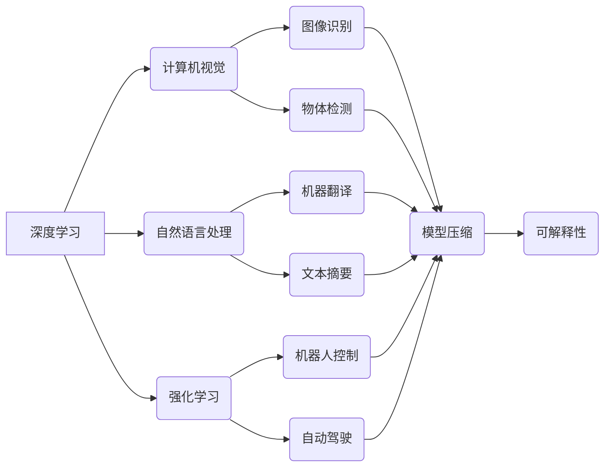

## Andrej Karpathy：人工智能的未来发展趋势

> 关键词：人工智能、深度学习、计算机视觉、自然语言处理、强化学习、模型压缩、可解释性

### 1. 背景介绍

人工智能（AI）正以惊人的速度发展，深刻地改变着我们生活和工作的方式。作为AI领域的领军人物之一，Andrej Karpathy 在深度学习、计算机视觉和自然语言处理等领域做出了杰出的贡献。他的研究成果和洞察力为我们理解AI的未来发展趋势提供了宝贵的指引。

### 2. 核心概念与联系

**2.1 深度学习**

深度学习是机器学习的一个子领域，它利用多层神经网络来模拟人类大脑的学习过程。通过学习大量的训练数据，深度学习模型能够自动提取特征，并进行复杂的模式识别和预测。

**2.2 计算机视觉**

计算机视觉是让计算机“看”和理解图像和视频的技术。深度学习在计算机视觉领域取得了突破性进展，例如图像识别、物体检测、图像分割和视频分析等。

**2.3 自然语言处理**

自然语言处理（NLP）是让计算机理解和处理人类语言的技术。深度学习在NLP领域也取得了显著成果，例如机器翻译、文本摘要、情感分析和对话系统等。

**2.4 强化学习**

强化学习是一种机器学习方法，它通过奖励和惩罚机制来训练智能体，使其在特定环境中做出最优决策。强化学习在机器人控制、游戏 AI 和自动驾驶等领域具有广泛应用前景。

**2.5 模型压缩**

随着深度学习模型规模的不断增长，模型部署和推理效率成为一个关键问题。模型压缩技术旨在减小模型大小和计算复杂度，提高模型的效率和可部署性。

**2.6 可解释性**

深度学习模型的决策过程通常是不可解释的，这使得其应用在一些安全关键领域受到限制。可解释性研究旨在提高深度学习模型的透明度和可理解性，使其决策过程更加可信和可控。

**核心概念与联系流程图**



### 3. 核心算法原理 & 具体操作步骤

**3.1 算法原理概述**

深度学习算法的核心是多层神经网络。神经网络由多个层组成，每层包含多个神经元。每个神经元接收来自上一层的输入信号，并通过激活函数进行处理，输出到下一层。通过训练大量的样本数据，神经网络能够学习到数据的特征表示和模式，从而实现预测和分类等任务。

**3.2 算法步骤详解**

1. **数据预处理:** 将原始数据转换为深度学习模型可以理解的格式，例如归一化、编码和特征提取。
2. **网络结构设计:** 根据任务需求设计神经网络的层数、神经元数量和激活函数等参数。
3. **模型训练:** 使用训练数据训练神经网络模型，通过反向传播算法调整模型参数，使模型的预测结果与真实值尽可能接近。
4. **模型评估:** 使用测试数据评估模型的性能，例如准确率、召回率和F1-score等指标。
5. **模型调优:** 根据评估结果调整模型参数和网络结构，进一步提高模型性能。
6. **模型部署:** 将训练好的模型部署到实际应用场景中，用于预测和分类等任务。

**3.3 算法优缺点**

**优点:**

* 能够自动提取特征，无需人工特征工程。
* 能够处理复杂的数据模式，取得优异的性能。
* 能够进行泛化学习，对新数据进行预测。

**缺点:**

* 需要大量的训练数据，训练成本高。
* 模型训练时间长，计算资源需求大。
* 模型的决策过程难以解释，缺乏透明度。

**3.4 算法应用领域**

深度学习算法广泛应用于各个领域，例如：

* 计算机视觉：图像识别、物体检测、图像分割、视频分析等。
* 自然语言处理：机器翻译、文本摘要、情感分析、对话系统等。
* 语音识别：语音转文本、语音助手等。
* 医疗诊断：疾病预测、图像分析、药物研发等。
* 金融分析：欺诈检测、风险评估、投资预测等。

### 4. 数学模型和公式 & 详细讲解 & 举例说明

**4.1 数学模型构建**

深度学习模型通常由多个层组成，每层包含多个神经元。每个神经元接收来自上一层的输入信号，并通过激活函数进行处理，输出到下一层。

**4.2 公式推导过程**

深度学习模型的训练过程基于反向传播算法。反向传播算法通过计算损失函数的梯度，更新模型参数，使模型的预测结果与真实值尽可能接近。

**损失函数:**

$$L = \frac{1}{N} \sum_{i=1}^{N} (y_i - \hat{y}_i)^2$$

其中：

* $L$ 是损失函数
* $N$ 是样本数量
* $y_i$ 是真实值
* $\hat{y}_i$ 是预测值

**梯度下降:**

$$\theta = \theta - \alpha \nabla L$$

其中：

* $\theta$ 是模型参数
* $\alpha$ 是学习率
* $\nabla L$ 是损失函数的梯度

**4.3 案例分析与讲解**

例如，在图像分类任务中，深度学习模型会学习到图像特征，并将其映射到不同的类别。训练过程中，模型会根据损失函数的梯度更新参数，使其能够准确地识别图像类别。

### 5. 项目实践：代码实例和详细解释说明

**5.1 开发环境搭建**

深度学习开发环境通常需要安装Python、深度学习框架（例如TensorFlow、PyTorch）和必要的库。

**5.2 源代码详细实现**

```python
import tensorflow as tf

# 定义模型结构
model = tf.keras.models.Sequential([
    tf.keras.layers.Conv2D(32, (3, 3), activation='relu', input_shape=(28, 28, 1)),
    tf.keras.layers.MaxPooling2D((2, 2)),
    tf.keras.layers.Conv2D(64, (3, 3), activation='relu'),
    tf.keras.layers.MaxPooling2D((2, 2)),
    tf.keras.layers.Flatten(),
    tf.keras.layers.Dense(10, activation='softmax')
])

# 编译模型
model.compile(optimizer='adam',
              loss='sparse_categorical_crossentropy',
              metrics=['accuracy'])

# 训练模型
model.fit(x_train, y_train, epochs=5)

# 评估模型
loss, accuracy = model.evaluate(x_test, y_test)
print('Test loss:', loss)
print('Test accuracy:', accuracy)
```

**5.3 代码解读与分析**

这段代码定义了一个简单的卷积神经网络模型，用于手写数字识别任务。模型包含两个卷积层、两个最大池化层、一个全连接层和一个softmax输出层。

**5.4 运行结果展示**

训练完成后，模型可以用于预测新的手写数字图像的类别。

### 6. 实际应用场景

**6.1 医疗诊断**

深度学习可以用于分析医学图像，例如X光片、CT扫描和MRI扫描，辅助医生诊断疾病。

**6.2 自动驾驶**

深度学习可以用于训练自动驾驶汽车的感知系统，识别道路场景、车辆和行人，并做出相应的决策。

**6.3 金融风险评估**

深度学习可以用于分析金融数据，识别欺诈交易和评估投资风险。

**6.4 个性化推荐**

深度学习可以用于分析用户行为数据，提供个性化的商品推荐和内容推荐。

**6.5 未来应用展望**

随着深度学习技术的不断发展，其应用场景将更加广泛，例如：

* 人机交互：开发更加自然和智能的人机交互系统。
* 科学研究：加速科学发现和技术创新。
* 社会治理：提高社会管理效率和服务水平。

### 7. 工具和资源推荐

**7.1 学习资源推荐**

* **书籍:**

    * 《深度学习》 by Ian Goodfellow, Yoshua Bengio, and Aaron Courville
    * 《动手学深度学习》 by Aurélien Géron

* **在线课程:**

    * Coursera: Deep Learning Specialization
    * Udacity: Deep Learning Nanodegree

**7.2 开发工具推荐**

* **TensorFlow:** 开源深度学习框架，支持多种硬件平台。
* **PyTorch:** 开源深度学习框架，以其灵活性和研究友好性而闻名。
* **Keras:** 高级深度学习API，可以运行在TensorFlow、Theano和CNTK等框架之上。

**7.3 相关论文推荐**

* **ImageNet Classification with Deep Convolutional Neural Networks** by Alex Krizhevsky, Ilya Sutskever, and Geoffrey E. Hinton
* **Attention Is All You Need** by Ashish Vaswani, Noam Shazeer, Niki Parmar, Jakob Uszkoreit, Llion Jones, Aidan N. Gomez, Łukasz Kaiser, and Illia Polosukhin

### 8. 总结：未来发展趋势与挑战

**8.1 研究成果总结**

近年来，深度学习取得了令人瞩目的成果，在计算机视觉、自然语言处理、语音识别等领域取得了突破性进展。

**8.2 未来发展趋势**

* **模型效率提升:** 研究更轻量级、更高效的深度学习模型，降低模型部署成本。
* **可解释性增强:** 研究提高深度学习模型透明度和可解释性的方法，增强模型的信任度。
* **跨模态学习:** 研究能够处理多种模态数据（例如文本、图像、音频）的深度学习模型。
* **联邦学习:** 研究隐私保护的深度学习方法，允许在不共享数据的情况下进行模型训练。

**8.3 面临的挑战**

* **数据获取和标注:** 深度学习模型需要大量的训练数据，数据获取和标注成本高昂。
* **模型可解释性:** 深度学习模型的决策过程难以解释，这限制了其在一些安全关键领域的应用。
* **公平性和偏见:** 深度学习模型可能存在公平性和偏见问题，需要进行更深入的研究和解决措施。

**8.4 研究展望**

未来，深度学习研究将继续朝着更安全、更可靠、更可解释的方向发展，为人类社会带来更多福祉。

### 9. 附录：常见问题与解答

**9.1 什么是深度学习？**

深度学习是一种机器学习方法，它利用多层神经网络来模拟人类大脑的学习过程。

**9.2 深度学习有哪些应用场景？**

深度学习广泛应用于各个领域，例如计算机视觉、自然语言处理、语音识别、医疗诊断、自动驾驶等。

**9.3 如何学习深度学习？**

可以通过阅读书籍、参加在线课程、参与开源项目等方式学习深度学习。

**9.4 深度学习有哪些挑战？**

深度学习面临的数据获取、模型可解释性和公平性等挑战。


作者：禅与计算机程序设计艺术 / Zen and the Art of Computer Programming 
