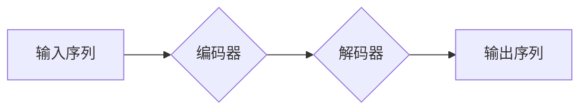

## Transformer大模型实战 Hugging Face的Transformers 库

> 关键词：Transformer, Hugging Face, Transformers 库, 自然语言处理, 深度学习, 预训练模型, 序列到序列, 文本生成

## 1. 背景介绍

近年来，深度学习在自然语言处理 (NLP) 领域取得了突破性进展。其中，Transformer 架构凭借其强大的序列建模能力和并行计算效率，成为 NLP 领域的主流模型架构。

Transformer 模型首次提出于 2017 年的论文《Attention Is All You Need》，彻底颠覆了传统的循环神经网络 (RNN) 模型，并为 NLP 领域带来了新的革命。其核心创新在于引入了自注意力机制 (Self-Attention)，能够有效捕捉序列中词语之间的长距离依赖关系，从而提升模型的表达能力和性能。

Hugging Face 是一个开源社区和平台，致力于促进机器学习和深度学习的开源发展。其 Transformers 库是目前最流行的 Transformer 模型库之一，提供了丰富的预训练模型和工具，方便开发者快速上手并应用 Transformer 模型。

## 2. 核心概念与联系

### 2.1 Transformer 架构

Transformer 模型主要由以下几个部分组成：

* **编码器 (Encoder):** 用于将输入序列映射到一个隐藏表示。
* **解码器 (Decoder):** 用于根据编码器的输出生成目标序列。
* **自注意力机制 (Self-Attention):** 用于捕捉序列中词语之间的关系。
* **多头注意力机制 (Multi-Head Attention):** 将自注意力机制扩展到多个头，提高模型的表达能力。
* **前馈神经网络 (Feed-Forward Network):** 用于对隐藏表示进行非线性变换。

### 2.2 Transformer 模型流程图



### 2.3 Hugging Face Transformers 库

Hugging Face Transformers 库提供了以下主要功能：

* **预训练模型:** 提供了多种预训练的 Transformer 模型，例如 BERT、GPT-2、T5 等。
* **模型微调:** 提供了方便的工具，可以对预训练模型进行微调，使其适应特定任务。
* **模型训练:** 提供了训练 Transformer 模型的工具和接口。
* **数据处理:** 提供了数据预处理和转换工具。

## 3. 核心算法原理 & 具体操作步骤

### 3.1 算法原理概述

Transformer 模型的核心算法是自注意力机制。自注意力机制能够计算每个词语与所有其他词语之间的相关性，并根据相关性生成一个加权表示。

### 3.2 算法步骤详解

1. **计算词嵌入:** 将每个词语映射到一个低维向量空间。
2. **计算注意力权重:** 使用查询 (Query)、键 (Key) 和值 (Value) 向量计算每个词语与所有其他词语之间的注意力权重。
3. **加权求和:** 根据注意力权重对值向量进行加权求和，得到每个词语的上下文表示。
4. **多头注意力:** 将自注意力机制扩展到多个头，每个头学习不同的词语关系。
5. **前馈神经网络:** 对每个词语的上下文表示进行非线性变换。
6. **重复步骤 2-5:** 对编码器和解码器中的每个层重复上述步骤，逐步提升模型的表达能力。

### 3.3 算法优缺点

**优点:**

* 能够有效捕捉序列中词语之间的长距离依赖关系。
* 并行计算效率高，训练速度快。
* 表现能力强，在各种 NLP 任务中取得了优异的性能。

**缺点:**

* 参数量大，需要大量的计算资源进行训练。
* 训练数据量要求高。

### 3.4 算法应用领域

Transformer 模型在以下 NLP 任务中取得了广泛应用:

* 文本分类
* 情感分析
* 机器翻译
* 文本摘要
* 问答系统
* 代码生成

## 4. 数学模型和公式 & 详细讲解 & 举例说明

### 4.1 数学模型构建

Transformer 模型的数学模型主要基于线性变换、激活函数和注意力机制。

* **线性变换:** 用于将输入数据映射到不同的向量空间。
* **激活函数:** 用于引入非线性，提升模型的表达能力。
* **注意力机制:** 用于计算词语之间的相关性。

### 4.2 公式推导过程

**自注意力机制:**

$$
Attention(Q, K, V) = softmax(\frac{QK^T}{\sqrt{d_k}})V
$$

其中:

* $Q$ 是查询矩阵。
* $K$ 是键矩阵。
* $V$ 是值矩阵。
* $d_k$ 是键向量的维度。

**多头注意力机制:**

$$
MultiHead(Q, K, V) = Concat(head_1, head_2,..., head_h)W^O
$$

其中:

* $head_i$ 是第 $i$ 个注意力头的输出。
* $h$ 是注意力头的数量。
* $W^O$ 是一个线性变换矩阵。

### 4.3 案例分析与讲解

假设我们有一个句子 "The cat sat on the mat"，将其转换为词嵌入向量。

使用自注意力机制计算每个词语与所有其他词语之间的注意力权重。例如，"cat" 与 "sat" 之间的注意力权重较高，因为它们在语义上相关。

使用多头注意力机制，可以学习到不同类型的词语关系，例如语义关系、语法关系等。

## 5. 项目实践：代码实例和详细解释说明

### 5.1 开发环境搭建

* Python 3.6+
* PyTorch 或 TensorFlow
* Hugging Face Transformers 库

### 5.2 源代码详细实现

```python
from transformers import pipeline

# 使用预训练的 BERT 模型进行文本分类
classifier = pipeline("sentiment-analysis", model="bert-base-uncased")

# 对文本进行分类
result = classifier("This is a great movie!")

# 打印结果
print(result)
```

### 5.3 代码解读与分析

* `pipeline("sentiment-analysis", model="bert-base-uncased")`: 使用 Hugging Face Transformers 库的 `pipeline` 函数，加载预训练的 BERT 模型进行文本分类任务。
* `classifier("This is a great movie!")`: 使用加载的模型对文本进行分类。
* `print(result)`: 打印分类结果，包括文本内容和预测的 sentiment 分类。

### 5.4 运行结果展示

```
[{'label': 'POSITIVE','score': 0.9998627465820312}]
```

结果显示，文本 "This is a great movie!" 被预测为正面情感，置信度为 99.99%。

## 6. 实际应用场景

### 6.1 文本分类

* 垃圾邮件过滤
* 情感分析
* 文本主题分类

### 6.2 机器翻译

* 自动翻译文档和网站
* 跨语言沟通

### 6.3 文本摘要

* 自动生成文章摘要
* 提取关键信息

### 6.4 其他应用

* 代码生成
* 问答系统
* 对话系统

### 6.5 未来应用展望

Transformer 模型在未来将有更广泛的应用，例如:

* 个性化推荐
* 自动写作
* 医疗诊断

## 7. 工具和资源推荐

### 7.1 学习资源推荐

* Hugging Face Transformers 文档: https://huggingface.co/docs/transformers/index
* Transformer 原论文: https://arxiv.org/abs/1706.03762

### 7.2 开发工具推荐

* PyTorch: https://pytorch.org/
* TensorFlow: https://www.tensorflow.org/

### 7.3 相关论文推荐

* BERT: https://arxiv.org/abs/1810.04805
* GPT-2: https://openai.com/blog/better-language-models/
* T5: https://arxiv.org/abs/1910.10683

## 8. 总结：未来发展趋势与挑战

### 8.1 研究成果总结

Transformer 模型在 NLP 领域取得了突破性进展，其强大的序列建模能力和并行计算效率使其成为主流模型架构。

### 8.2 未来发展趋势

* 模型规模进一步扩大
* 探索新的注意力机制
* 提升模型的效率和可解释性
* 将 Transformer 模型应用于其他领域

### 8.3 面临的挑战

* 模型参数量大，训练成本高
* 训练数据量要求高
* 模型的可解释性较差

### 8.4 研究展望

未来研究将集中在以下方面:

* 探索更有效的训练方法
* 提升模型的效率和可解释性
* 将 Transformer 模型应用于其他领域


## 9. 附录：常见问题与解答

* **Q: Transformer 模型为什么比 RNN 模型更好？**

A: Transformer 模型能够有效捕捉序列中词语之间的长距离依赖关系，而 RNN 模型在处理长序列时容易出现梯度消失问题。

* **Q: 如何使用 Hugging Face Transformers 库训练 Transformer 模型？**

A: Hugging Face Transformers 库提供了训练 Transformer 模型的工具和接口，可以参考官方文档进行操作。

* **Q: Transformer 模型的应用场景有哪些？**

A: Transformer 模型在文本分类、机器翻译、文本摘要等 NLP 任务中取得了广泛应用。

作者：禅与计算机程序设计艺术 / Zen and the Art of Computer Programming 


