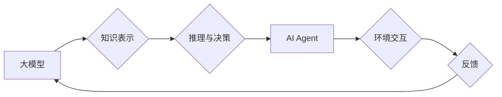

## 【大模型应用开发 动手做AI Agent】大模型就是Agent的大脑

> 关键词：大模型、AI Agent、应用开发、自然语言处理、机器学习、深度学习、对话系统、智能助手

### 1. 背景介绍

近年来，大模型技术取得了飞速发展，其强大的泛化能力和知识表示能力为人工智能领域带来了革命性的变革。从文本生成、机器翻译到图像识别、语音合成，大模型在各个领域展现出令人惊叹的应用潜力。然而，单纯的模型训练并不能完全发挥大模型的价值，将其应用于实际场景，构建智能代理（AI Agent）才是真正意义上的突破。

AI Agent是指能够感知环境、做出决策并与环境交互的智能实体。它可以是软件程序、机器人或其他智能系统，其目标是通过学习和推理来实现特定的任务或目标。大模型作为AI Agent的大脑，可以为其提供强大的认知能力和知识库，使其能够更智能地感知、理解和响应环境变化。

### 2. 核心概念与联系

#### 2.1 大模型

大模型是指参数量巨大、训练数据海量的人工智能模型。它们通常基于深度学习架构，例如Transformer，通过大量的训练数据学习复杂的语言模式和知识表示。

#### 2.2 AI Agent

AI Agent是一种能够自主行动的智能实体，它可以感知环境、制定计划并执行行动，以实现预定的目标。

#### 2.3 联系

大模型为AI Agent提供了强大的认知能力和知识库，使其能够更智能地感知、理解和响应环境变化。

**Mermaid 流程图**



### 3. 核心算法原理 & 具体操作步骤

#### 3.1 算法原理概述

大模型应用于AI Agent的核心算法主要包括：

* **自然语言理解 (NLU):** 理解自然语言文本的语义和意图。
* **对话管理 (Dialogue Management):** 管理对话流程，理解用户意图并生成相应的回复。
* **知识图谱 (Knowledge Graph):** 建立知识图谱，存储和组织知识，为AI Agent提供知识推理和查询能力。
* **强化学习 (Reinforcement Learning):** 通过奖励机制训练AI Agent，使其能够学习最佳的行动策略。

#### 3.2 算法步骤详解

1. **数据预处理:** 收集和预处理训练数据，包括文本清洗、分词、词向量化等步骤。
2. **模型训练:** 使用大模型架构，例如Transformer，对预处理后的数据进行训练，学习语言模式和知识表示。
3. **模型评估:** 使用测试数据评估模型性能，例如准确率、召回率、F1-score等指标。
4. **模型部署:** 将训练好的模型部署到实际应用场景中，例如聊天机器人、智能助手等。
5. **用户交互:** 用户与AI Agent进行交互，AI Agent根据用户输入进行理解和响应。
6. **反馈收集:** 收集用户反馈，用于模型优化和改进。

#### 3.3 算法优缺点

**优点:**

* **强大的泛化能力:** 大模型能够学习复杂的语言模式和知识表示，适用于多种任务和场景。
* **丰富的知识库:** 大模型可以存储和组织海量知识，为AI Agent提供丰富的知识支持。
* **持续学习:** 大模型可以通过不断学习新的数据来更新知识和模型，保持其智能水平。

**缺点:**

* **训练成本高:** 大模型的训练需要大量的计算资源和时间。
* **模型复杂度高:** 大模型的结构复杂，难以理解和调试。
* **数据依赖性强:** 大模型的性能依赖于训练数据的质量和数量。

#### 3.4 算法应用领域

* **对话系统:** 构建智能聊天机器人、虚拟助手等。
* **文本生成:** 生成高质量的文本内容，例如文章、故事、诗歌等。
* **机器翻译:** 实现跨语言的文本翻译。
* **问答系统:** 回答用户提出的问题，提供相关信息。
* **代码生成:** 自动生成代码，提高开发效率。

### 4. 数学模型和公式 & 详细讲解 & 举例说明

#### 4.1 数学模型构建

大模型的训练通常基于深度学习框架，例如TensorFlow或PyTorch。这些框架提供了一系列数学模型和算法，用于学习语言模式和知识表示。

**举例:** Transformer模型的核心是自注意力机制，它通过计算词之间的相关性来理解文本语义。

#### 4.2 公式推导过程

自注意力机制的计算公式如下：

$$
Attention(Q, K, V) = softmax(\frac{QK^T}{\sqrt{d_k}})V
$$

其中：

* $Q$：查询矩阵
* $K$：键矩阵
* $V$：值矩阵
* $d_k$：键向量的维度
* $softmax$：softmax函数

#### 4.3 案例分析与讲解

假设我们有一个句子“我爱学习编程”，我们想要计算每个词与“学习”之间的相关性。

1. 将句子中的每个词转换为词向量。
2. 将词向量作为查询矩阵 $Q$，键矩阵 $K$ 和值矩阵 $V$。
3. 计算 $QK^T$，得到每个词与“学习”之间的相关性分数。
4. 使用softmax函数将分数归一化，得到每个词与“学习”之间的注意力权重。
5. 将注意力权重与值矩阵 $V$ 进行加权求和，得到“学习”的上下文表示。

### 5. 项目实践：代码实例和详细解释说明

#### 5.1 开发环境搭建

* Python 3.7+
* TensorFlow 或 PyTorch
* CUDA 和 cuDNN (可选，用于GPU加速)

#### 5.2 源代码详细实现

```python
# 使用HuggingFace Transformers库加载预训练模型
from transformers import AutoModelForSequenceClassification, AutoTokenizer

# 加载模型和分词器
model_name = "bert-base-uncased"
tokenizer = AutoTokenizer.from_pretrained(model_name)
model = AutoModelForSequenceClassification.from_pretrained(model_name)

# 输入文本
text = "我爱学习编程"

# 将文本转换为模型输入格式
inputs = tokenizer(text, return_tensors="pt")

# 使用模型进行预测
outputs = model(**inputs)

# 获取预测结果
predicted_class = outputs.logits.argmax().item()

# 打印预测结果
print(predicted_class)
```

#### 5.3 代码解读与分析

* 使用HuggingFace Transformers库加载预训练模型，简化模型使用过程。
* 使用AutoTokenizer和AutoModelForSequenceClassification自动加载模型和分词器。
* 将文本转换为模型输入格式，并使用模型进行预测。
* 获取预测结果并打印输出。

#### 5.4 运行结果展示

运行上述代码，可以得到模型对输入文本的分类结果。例如，如果模型训练用于情感分类任务，则输出结果可能为“正面”。

### 6. 实际应用场景

#### 6.1 聊天机器人

大模型可以用于构建更智能、更自然的聊天机器人，能够理解用户意图，并提供更精准、更人性化的回复。

#### 6.2 智能助手

大模型可以作为智能助手的核心引擎，帮助用户完成各种任务，例如日程安排、信息查询、文件处理等。

#### 6.3 个性化推荐

大模型可以分析用户的行为数据和偏好，提供个性化的商品、内容或服务推荐。

#### 6.4 未来应用展望

* **更智能的教育系统:** 大模型可以提供个性化的学习辅导、自动批改作业、生成互动学习内容等。
* **更便捷的医疗服务:** 大模型可以辅助医生诊断疾病、提供医疗咨询、分析患者数据等。
* **更安全的金融服务:** 大模型可以用于欺诈检测、风险评估、个性化理财建议等。

### 7. 工具和资源推荐

#### 7.1 学习资源推荐

* **书籍:**
    * 《深度学习》
    * 《自然语言处理》
    * 《机器学习》
* **在线课程:**
    * Coursera
    * edX
    * Udacity

#### 7.2 开发工具推荐

* **TensorFlow:** https://www.tensorflow.org/
* **PyTorch:** https://pytorch.org/
* **HuggingFace Transformers:** https://huggingface.co/transformers/

#### 7.3 相关论文推荐

* **Attention Is All You Need:** https://arxiv.org/abs/1706.03762
* **BERT: Pre-training of Deep Bidirectional Transformers for Language Understanding:** https://arxiv.org/abs/1810.04805

### 8. 总结：未来发展趋势与挑战

#### 8.1 研究成果总结

大模型技术取得了显著进展，为AI Agent的开发提供了强大的工具和基础。

#### 8.2 未来发展趋势

* **模型规模进一步扩大:** 随着计算资源的不断提升，大模型的规模将继续扩大，带来更强大的能力。
* **多模态学习:** 大模型将融合文本、图像、音频等多模态数据，实现更全面的理解和交互。
* **可解释性增强:** 研究者将致力于提高大模型的可解释性，使其决策过程更加透明和可理解。

#### 8.3 面临的挑战

* **训练成本高:** 大模型的训练需要大量的计算资源和时间，成本仍然是一个挑战。
* **数据安全和隐私:** 大模型的训练依赖于海量数据，如何保证数据安全和隐私是一个重要问题。
* **伦理和社会影响:** 大模型的应用可能带来伦理和社会问题，需要谨慎考虑和引导。

#### 8.4 研究展望

未来，大模型技术将继续发展，为AI Agent的开发带来更多可能性。研究者将致力于解决上述挑战，推动大模型技术在更多领域得到应用，最终实现真正智能的AI Agent。

### 9. 附录：常见问题与解答

* **Q: 如何选择合适的预训练模型？**

A: 选择预训练模型需要根据具体的应用场景和任务需求。HuggingFace Model Hub提供了一个丰富的预训练模型库，可以根据任务类型进行筛选。

* **Q: 如何评估大模型的性能？**

A: 大模型的性能评估需要根据具体的应用场景和任务类型选择合适的指标。常见的指标包括准确率、召回率、F1-score、BLEU等。

* **Q: 如何部署大模型？**

A: 大模型的部署可以采用多种方式，例如云端部署、边缘部署、本地部署等。选择合适的部署方式需要根据应用场景和资源限制进行考虑。


作者：禅与计算机程序设计艺术 / Zen and the Art of Computer Programming 
