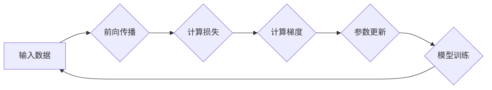

## 一切皆是映射：优化器算法及其在深度学习中的应用

> 关键词：深度学习、优化器、梯度下降、学习率、动量、Adam、RMSprop、SGD

### 1. 背景介绍

深度学习近年来取得了令人瞩目的成就，在图像识别、自然语言处理、语音识别等领域展现出强大的能力。然而，深度学习模型的训练过程依赖于一个关键环节：**优化器算法**。优化器算法负责调整模型参数，使模型在训练数据上取得最佳性能。

优化器算法的核心思想是通过不断迭代的方式，沿着梯度下降的方向更新模型参数，最终找到一个使损失函数最小化的参数值。 

### 2. 核心概念与联系

**2.1 核心概念**

* **损失函数 (Loss Function):** 用于衡量模型预测结果与真实值的差距。
* **梯度 (Gradient):** 损失函数对模型参数的偏导数，表示参数变化对损失函数的影响方向和大小。
* **优化目标:** 找到使损失函数最小化的模型参数值。

**2.2 优化器算法流程图**



**2.3 联系**

优化器算法通过不断迭代前向传播、计算损失、计算梯度和更新参数的步骤，最终实现对模型参数的优化，从而降低模型的损失函数值，提高模型的预测精度。

### 3. 核心算法原理 & 具体操作步骤

**3.1 算法原理概述**

梯度下降算法是优化器算法的基础，其核心思想是沿着梯度的负方向更新模型参数，逐步降低损失函数的值。

**3.2 算法步骤详解**

1. **初始化模型参数:**  随机初始化模型参数。
2. **前向传播:** 将输入数据输入模型，计算模型输出。
3. **计算损失:** 计算模型输出与真实值的差距，即损失函数值。
4. **计算梯度:** 计算损失函数对每个模型参数的偏导数，即梯度值。
5. **参数更新:** 根据梯度值和学习率，更新模型参数。
6. **重复步骤2-5:**  重复上述步骤，直到损失函数值达到最小值或满足其他停止条件。

**3.3 算法优缺点**

* **优点:** 
    * 算法简单易懂，易于实现。
    * 在许多情况下能够有效地找到损失函数的最小值。
* **缺点:** 
    * 容易陷入局部最优解。
    * 学习率的选择对收敛速度和最终结果有很大影响。

**3.4 算法应用领域**

梯度下降算法广泛应用于深度学习模型的训练，例如卷积神经网络 (CNN)、循环神经网络 (RNN) 等。

### 4. 数学模型和公式 & 详细讲解 & 举例说明

**4.1 数学模型构建**

假设模型参数为 $\theta$, 损失函数为 $L(\theta)$, 则优化目标是找到使 $L(\theta)$ 最小的 $\theta$ 值。

**4.2 公式推导过程**

梯度下降算法的更新公式为:

$$\theta = \theta - \eta \nabla L(\theta)$$

其中:

* $\theta$ 是模型参数
* $\eta$ 是学习率
* $\nabla L(\theta)$ 是损失函数 $L(\theta)$ 对参数 $\theta$ 的梯度

**4.3 案例分析与讲解**

假设我们有一个线性回归模型，其损失函数为均方误差 (MSE):

$$L(\theta) = \frac{1}{n} \sum_{i=1}^{n} (y_i - \theta x_i)^2$$

其中:

* $n$ 是样本数量
* $y_i$ 是第 $i$ 个样本的真实值
* $x_i$ 是第 $i$ 个样本的特征值
* $\theta$ 是模型参数

根据梯度下降算法，我们可以计算损失函数对参数 $\theta$ 的梯度:

$$\nabla L(\theta) = \frac{2}{n} \sum_{i=1}^{n} (y_i - \theta x_i) (-x_i)$$

然后，根据更新公式，更新模型参数:

$$\theta = \theta - \eta \frac{2}{n} \sum_{i=1}^{n} (y_i - \theta x_i) (-x_i)$$

**5. 项目实践：代码实例和详细解释说明**

**5.1 开发环境搭建**

* Python 3.x
* TensorFlow 或 PyTorch 等深度学习框架

**5.2 源代码详细实现**

```python
import tensorflow as tf

# 定义模型参数
W = tf.Variable(0.0, dtype=tf.float32)
b = tf.Variable(0.0, dtype=tf.float32)

# 定义损失函数
def loss_function(y_true, y_predicted):
  return tf.reduce_mean(tf.square(y_true - y_predicted))

# 定义优化器
optimizer = tf.keras.optimizers.SGD(learning_rate=0.01)

# 定义训练步骤
@tf.function
def train_step(x, y):
  with tf.GradientTape() as tape:
    y_predicted = W * x + b
    loss = loss_function(y, y_predicted)
  gradients = tape.gradient(loss, [W, b])
  optimizer.apply_gradients(zip(gradients, [W, b]))
  return loss

# 训练数据
x_train = [1.0, 2.0, 3.0, 4.0, 5.0]
y_train = [2.0, 4.0, 6.0, 8.0, 10.0]

# 训练模型
for epoch in range(100):
  for x, y in zip(x_train, y_train):
    loss = train_step(x, y)
    print(f"Epoch: {epoch}, Loss: {loss.numpy()}")

# 打印训练后的模型参数
print(f"W: {W.numpy()}")
print(f"b: {b.numpy()}")
```

**5.3 代码解读与分析**

* 代码首先定义了模型参数 $W$ 和 $b$，以及损失函数 MSE。
* 然后定义了优化器 SGD，并设置了学习率为 0.01。
* 定义了训练步骤 `train_step`，该步骤计算损失函数值，并根据梯度下降算法更新模型参数。
* 最后，使用训练数据训练模型，并打印训练后的模型参数。

**5.4 运行结果展示**

运行代码后，会输出每个 epoch 的损失值，以及训练后的模型参数 $W$ 和 $b$。

### 6. 实际应用场景

**6.1 图像分类**

在图像分类任务中，优化器算法用于训练卷积神经网络 (CNN)，使模型能够识别图像中的物体。

**6.2 自然语言处理**

在自然语言处理任务中，优化器算法用于训练循环神经网络 (RNN) 或 Transformer 模型，使模型能够理解和生成文本。

**6.3 机器翻译**

机器翻译任务中，优化器算法用于训练序列到序列模型，使模型能够将一种语言翻译成另一种语言。

**6.4 未来应用展望**

随着深度学习技术的不断发展，优化器算法将在更多领域得到应用，例如药物研发、材料科学、金融预测等。

### 7. 工具和资源推荐

**7.1 学习资源推荐**

* 深度学习书籍：
    * 《深度学习》 (Deep Learning) - Ian Goodfellow, Yoshua Bengio, Aaron Courville
    * 《动手学深度学习》 (Hands-On Machine Learning with Scikit-Learn, Keras & TensorFlow) - Aurélien Géron
* 在线课程：
    * Coursera - Deep Learning Specialization
    * Udacity - Deep Learning Nanodegree

**7.2 开发工具推荐**

* TensorFlow: https://www.tensorflow.org/
* PyTorch: https://pytorch.org/
* Keras: https://keras.io/

**7.3 相关论文推荐**

* Adam: A Method for Stochastic Optimization (Kingma & Ba, 2014)
* RMSprop: Divide the Gradient by a Running Average of its Recent Magnitude (Tieleman & Hinton, 2012)
* Momentum: A Simple Technique for Faster Gradient Descent (Polyak, 1964)

### 8. 总结：未来发展趋势与挑战

**8.1 研究成果总结**

近年来，优化器算法取得了显著进展，例如 Adam、RMSprop 等算法的提出，显著提高了深度学习模型的训练效率和性能。

**8.2 未来发展趋势**

* **自适应学习率:**  根据训练过程中的数据特征动态调整学习率，提高训练效率。
* **分布式优化:**  在分布式计算环境下进行模型训练，加速训练速度。
* **强化学习优化:**  将强化学习的思想应用于优化器算法，使模型能够自主学习最优的训练策略。

**8.3 面临的挑战**

* **局部最优解:**  梯度下降算法容易陷入局部最优解，如何跳出局部最优解仍然是一个挑战。
* **超参数调优:**  优化器算法的超参数 (例如学习率) 对训练结果有很大影响，如何进行有效的超参数调优仍然是一个难题。
* **黑盒问题:**  许多优化器算法的内部机制比较复杂，难以理解其工作原理，如何提高优化器算法的可解释性是一个重要方向。

**8.4 研究展望**

未来，优化器算法的研究将继续深入，探索更有效的、更鲁棒的、更可解释的优化算法，推动深度学习技术的进一步发展。

### 9. 附录：常见问题与解答

**9.1 什么是学习率？**

学习率是优化器算法中的一个超参数，控制着模型参数更新的步长。学习率过大可能会导致模型训练不稳定，学习率过小可能会导致训练速度过慢。

**9.2 如何选择合适的学习率？**

学习率的选择是一个经验性的过程，通常可以通过试错法或使用学习率衰减策略来找到合适的学习率。

**9.3 什么是动量？**

动量是一种优化技巧，可以加速模型训练，并帮助模型跳出局部最优解。动量通过累积梯度信息，使得模型参数更新方向更加稳定。


作者：禅与计算机程序设计艺术 / Zen and the Art of Computer Programming 
