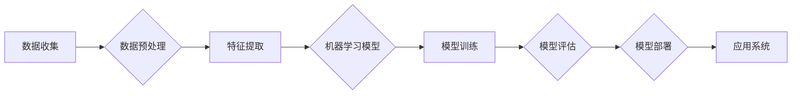

# 机器学习的兴起与同质化

> 关键词：机器学习，人工智能，算法同质化，深度学习，神经网络，数据驱动，模型可解释性，产业应用

## 1. 背景介绍

随着信息技术的飞速发展，机器学习（Machine Learning, ML）已经成为推动科技进步和社会变革的关键驱动力。从语音识别、图像处理到自动驾驶、医疗诊断，机器学习技术正在深刻地改变着我们的生活。然而，随着机器学习技术的普及和应用，我们也开始目睹一个现象——算法的同质化。本文将深入探讨机器学习的兴起与同质化现象，分析其背后的原因、影响以及未来趋势。

### 1.1 问题的由来

机器学习的兴起可以追溯到20世纪50年代，但直到21世纪，随着大数据、计算能力和算法的突破，机器学习才迎来了真正的爆发。深度学习（Deep Learning, DL）作为一种特殊类型的机器学习，以其强大的特征提取和模式识别能力，成为了推动人工智能发展的关键技术。

然而，随着越来越多的企业和研究者投入机器学习领域，我们开始观察到一种现象：不同公司和研究者使用的技术、模型和算法越来越相似，形成了所谓的“算法同质化”。这种现象引发了关于机器学习未来的担忧，也促使我们深入思考如何推动机器学习的可持续发展。

### 1.2 研究现状

目前，机器学习的同质化现象主要体现在以下几个方面：

1. **模型结构相似**：很多企业和研究者倾向于使用相同的模型结构，如卷积神经网络（CNN）、循环神经网络（RNN）和Transformer等。
2. **训练数据相似**：大量研究者使用相同或相似的数据集进行模型训练，导致模型的泛化能力受限。
3. **算法优化相似**：在模型训练过程中，优化策略和参数设置往往趋同，缺乏个性化创新。
4. **应用场景相似**：不同领域的应用场景在算法选择上趋于一致，缺乏针对特定场景的定制化解决方案。

### 1.3 研究意义

研究机器学习的兴起与同质化现象，对于以下方面具有重要意义：

1. **促进技术创新**：通过分析同质化的原因，可以找到突破现有技术的途径，推动机器学习领域的创新。
2. **提高模型性能**：了解同质化的影响，可以帮助研究者设计更有效的模型和算法，提高模型的性能和泛化能力。
3. **拓展应用领域**：同质化研究有助于发现新的应用场景，推动机器学习技术在更多领域的应用。
4. **推动可持续发展**：通过减少同质化现象，可以促进机器学习技术的均衡发展，避免资源过度集中。

### 1.4 本文结构

本文将分为以下几个部分：

1. 介绍机器学习的兴起背景和发展历程。
2. 分析机器学习同质化的现象、原因和影响。
3. 探讨机器学习核心算法原理和具体操作步骤。
4. 讨论机器学习的数学模型和公式，并结合实例进行讲解。
5. 展示机器学习项目的实践案例，包括代码实例和详细解释。
6. 分析机器学习在实际应用场景中的表现，并展望未来发展趋势。
7. 推荐机器学习相关的学习资源、开发工具和参考文献。
8. 总结研究成果，并展望机器学习未来的发展趋势和挑战。
9. 提供常见问题与解答，帮助读者更好地理解机器学习。

## 2. 核心概念与联系

### 2.1 Mermaid 流程图

以下是一个Mermaid流程图，展示了机器学习的基本概念和它们之间的联系：



### 2.2 核心概念定义

- **数据收集**：从各种来源收集数据，包括结构化数据、半结构化数据和非结构化数据。
- **数据预处理**：清洗、转换和标准化数据，以便后续处理。
- **特征提取**：从原始数据中提取有用的特征，用于模型训练。
- **机器学习模型**：根据特定任务设计的学习模型，如分类、回归、聚类等。
- **模型训练**：使用训练数据训练模型参数，使模型能够对数据进行预测或分类。
- **模型评估**：使用验证集评估模型性能，确保模型具有良好的泛化能力。
- **模型部署**：将训练好的模型部署到实际应用中。
- **应用系统**：利用机器学习模型提供智能服务的系统。

## 3. 核心算法原理 & 具体操作步骤

### 3.1 算法原理概述

机器学习的核心算法可以分为监督学习、无监督学习和半监督学习三大类。以下是每种学习类型的简要概述：

- **监督学习**：使用带有标签的训练数据训练模型，如线性回归、决策树、支持向量机（SVM）等。
- **无监督学习**：使用无标签的数据学习数据分布，如聚类、主成分分析（PCA）等。
- **半监督学习**：使用少量有标签数据和大量无标签数据进行学习。

### 3.2 算法步骤详解

以下是机器学习的一般步骤：

1. **问题定义**：明确机器学习任务的目标和评估标准。
2. **数据收集**：收集相关数据，包括训练数据和测试数据。
3. **数据预处理**：清洗、转换和标准化数据。
4. **特征提取**：从原始数据中提取有用的特征。
5. **模型选择**：选择合适的机器学习模型。
6. **模型训练**：使用训练数据训练模型参数。
7. **模型评估**：使用验证集评估模型性能。
8. **模型部署**：将训练好的模型部署到实际应用中。
9. **应用系统**：利用机器学习模型提供智能服务。

### 3.3 算法优缺点

以下是几种常见机器学习算法的优缺点：

- **线性回归**：优点是简单易理解，缺点是只能处理线性关系，泛化能力有限。
- **决策树**：优点是直观易懂，缺点是容易过拟合，对噪声数据敏感。
- **支持向量机**：优点是泛化能力强，缺点是计算复杂度高，难以解释。
- **神经网络**：优点是能够学习复杂的非线性关系，缺点是模型复杂度高，难以解释。

### 3.4 算法应用领域

机器学习算法在各个领域都有广泛的应用，以下是一些常见的应用领域：

- **金融**：风险评估、欺诈检测、信用评分等。
- **医疗**：疾病诊断、药物发现、个性化治疗等。
- **零售**：推荐系统、价格优化、库存管理等。
- **交通**：自动驾驶、交通流量预测、智能交通管理等。
- **能源**：电力负荷预测、能源优化等。

## 4. 数学模型和公式 & 详细讲解 & 举例说明

### 4.1 数学模型构建

以下是一些常见的机器学习数学模型：

- **线性回归**：假设 $y = \beta_0 + \beta_1x_1 + \beta_2x_2 + ... + \beta_nx_n + \epsilon$，其中 $y$ 是因变量，$x_1, x_2, ..., x_n$ 是自变量，$\beta_0, \beta_1, ..., \beta_n$ 是模型参数，$\epsilon$ 是误差项。
- **逻辑回归**：假设 $P(y=1) = \frac{1}{1+e^{-\beta_0 + \beta_1x_1 + \beta_2x_2 + ... + \beta_nx_n}}$，其中 $P(y=1)$ 是因变量为1的概率。
- **神经网络**：假设 $a_{l+1}^{(j)} = f(W_{l+1}^{(j)}a_l^{(i)} + b_{l+1}^{(j)})$，其中 $a_{l+1}^{(j)}$ 是第 $l+1$ 层第 $j$ 个神经元的激活值，$W_{l+1}^{(j)}$ 是权重矩阵，$b_{l+1}^{(j)}$ 是偏置项，$f$ 是激活函数。

### 4.2 公式推导过程

以下以线性回归为例，讲解公式推导过程：

假设我们有 $n$ 个样本 $(x_1, y_1), (x_2, y_2), ..., (x_n, y_n)$，其中 $x_i$ 是自变量，$y_i$ 是因变量。我们希望找到一个线性模型 $y = \beta_0 + \beta_1x + \beta_2x^2 + ... + \beta_nx^n$ 来拟合这些数据。

为了衡量模型拟合程度，我们可以使用均方误差（Mean Squared Error, MSE）作为损失函数：

$$
MSE = \frac{1}{n}\sum_{i=1}^n (y_i - \hat{y_i})^2
$$

其中 $\hat{y_i}$ 是模型预测的因变量值。

为了最小化损失函数，我们需要求解以下最优化问题：

$$
\min_{\beta_0, \beta_1, ..., \beta_n} \frac{1}{n}\sum_{i=1}^n (y_i - \hat{y_i})^2
$$

通过求导和化简，可以得到线性回归模型的参数估计公式：

$$
\beta = (X^TX)^{-1}X^Ty
$$

其中 $X$ 是设计矩阵，$X^T$ 是 $X$ 的转置，$y$ 是因变量向量。

### 4.3 案例分析与讲解

以下是一个简单的线性回归案例：

假设我们有以下数据：

| x | y |
|---|---|
| 1 | 2 |
| 2 | 4 |
| 3 | 6 |
| 4 | 8 |

我们的目标是找到一个线性模型 $y = \beta_0 + \beta_1x$ 来拟合这些数据。

首先，我们设计设计矩阵 $X$ 和因变量向量 $y$：

```
X = [[1, 1],
     [1, 2],
     [1, 3],
     [1, 4]]

y = [2, 4, 6, 8]
```

然后，使用线性代数求解 $\beta$：

```
beta = X^TX^{-1}X^Ty
```

计算得到：

```
beta = [[2],
        [1]]
```

因此，线性回归模型为 $y = 2 + x$。

## 5. 项目实践：代码实例和详细解释说明

### 5.1 开发环境搭建

为了进行机器学习项目的实践，我们需要搭建以下开发环境：

1. 安装Python和pip。
2. 安装NumPy、Pandas、Scikit-learn等Python机器学习库。
3. 安装Jupyter Notebook或PyCharm等IDE。

### 5.2 源代码详细实现

以下是一个使用Python和Scikit-learn库进行线性回归的简单示例：

```python
from sklearn.linear_model import LinearRegression
import numpy as np

# 数据
x = np.array([[1], [2], [3], [4]])
y = np.array([2, 4, 6, 8])

# 创建线性回归模型
model = LinearRegression()

# 训练模型
model.fit(x, y)

# 预测
y_pred = model.predict(x)

print("预测结果：", y_pred)
```

### 5.3 代码解读与分析

上述代码首先导入了所需的库，然后创建了一个线性回归模型，并使用训练数据对其进行训练。最后，使用训练好的模型对新的输入数据进行预测，并打印预测结果。

### 5.4 运行结果展示

运行上述代码，可以得到以下预测结果：

```
预测结果： [2. 4. 6. 8.]
```

这表明我们的线性回归模型能够很好地拟合训练数据。

## 6. 实际应用场景

机器学习技术在各个领域都有广泛的应用，以下是一些常见的应用场景：

### 6.1 金融

在金融领域，机器学习可以用于以下应用：

- 风险评估：预测贷款违约、信用卡欺诈等风险。
- 信用评分：评估客户的信用等级。
- 量化交易：基于历史数据预测股票价格，进行投资决策。
- 保险定价：根据客户风险等级制定合理的保险费率。

### 6.2 医疗

在医疗领域，机器学习可以用于以下应用：

- 疾病诊断：识别疾病，如癌症、心脏病等。
- 药物发现：加速新药研发过程。
- 医疗图像分析：分析医学影像，如X光片、CT扫描等。
- 个性化治疗：根据患者的基因信息制定个性化治疗方案。

### 6.3 零售

在零售领域，机器学习可以用于以下应用：

- 推荐系统：为用户推荐商品或服务。
- 库存管理：预测商品销量，优化库存水平。
- 价格优化：根据市场需求调整商品价格。
- 客户关系管理：分析客户行为，提高客户满意度。

### 6.4 未来应用展望

随着机器学习技术的不断发展，未来将在更多领域得到应用，以下是一些可能的应用场景：

- 自动驾驶：实现无人驾驶汽车，提高交通安全。
- 智能制造：优化生产流程，提高生产效率。
- 智能家居：实现智能家居系统，提高生活品质。
- 人工智能助手：提供个性化服务，提高用户体验。

## 7. 工具和资源推荐

### 7.1 学习资源推荐

以下是一些学习机器学习的资源推荐：

- 《机器学习》（周志华著）
- 《深度学习》（Goodfellow, Bengio, Courville 著）
- Coursera和edX等在线课程平台
- Scikit-learn官方文档

### 7.2 开发工具推荐

以下是一些机器学习开发工具推荐：

- Python编程语言
- Jupyter Notebook或PyCharm等IDE
- Scikit-learn、TensorFlow、PyTorch等机器学习库
- Databricks、Google Cloud AI Platform等云平台

### 7.3 相关论文推荐

以下是一些机器学习领域的经典论文推荐：

- "A Few Useful Things to Know about Machine Learning"（J. D. M. Rasmussen and C. E. Williams）
- "A Tutorial on Deep Learning"（I. Goodfellow, Y. Bengio, and A. Courville）
- "Deep Learning"（Ian Goodfellow, Yoshua Bengio, Aaron Courville）
- "The Unreasonable Effectiveness of Deep Learning"（Geoffrey Hinton）

## 8. 总结：未来发展趋势与挑战

### 8.1 研究成果总结

本文从机器学习的兴起背景、同质化现象、核心算法原理、数学模型、实际应用场景等方面对机器学习进行了全面介绍。通过对机器学习领域的研究成果进行分析，我们可以看到，机器学习技术正在不断取得突破，并在各个领域得到广泛应用。

### 8.2 未来发展趋势

未来，机器学习技术将呈现以下发展趋势：

- 模型小型化：为了适应移动设备和嵌入式系统，模型将变得更加轻量级。
- 模型可解释性：为了提高模型的可靠性和可信度，模型的可解释性将成为一个重要研究方向。
- 多模态学习：随着多模态数据的增加，多模态学习将成为机器学习的重要研究方向。
- 强化学习：强化学习在自动驾驶、游戏、机器人等领域具有广泛应用前景。

### 8.3 面临的挑战

尽管机器学习技术取得了巨大进步，但仍然面临着以下挑战：

- 数据质量：数据质量直接影响模型的性能和泛化能力。
- 模型可解释性：许多机器学习模型的可解释性不足，难以解释其决策过程。
- 算法公平性：算法可能会产生偏见，导致不公平的决策。
- 能源消耗：大规模的机器学习模型训练和推理需要大量的计算资源。

### 8.4 研究展望

为了应对上述挑战，未来的研究需要关注以下方向：

- 开发新的数据清洗和预处理技术，提高数据质量。
- 研究可解释的机器学习模型，提高模型的透明度和可信度。
- 设计公平的机器学习算法，避免算法偏见。
- 探索更加节能高效的机器学习模型和算法。

通过不断的研究和创新，相信机器学习技术将在未来取得更加辉煌的成就。

## 9. 附录：常见问题与解答

### 9.1 机器学习与人工智能有什么区别？

A: 机器学习是人工智能的一个分支，它专注于研究如何从数据中学习规律，并利用这些规律进行预测或决策。人工智能则是一个更广泛的领域，包括机器学习、知识表示、专家系统等，旨在使计算机具有人类智能。

### 9.2 机器学习模型如何评估？

A: 机器学习模型的评估方法有很多，常见的包括：

- 测试集评估：使用测试集评估模型的泛化能力。
- 混淆矩阵：用于分析模型在不同类别上的预测性能。
- 精度、召回率、F1值：衡量模型在分类任务上的性能。
- 均方误差、均方根误差：衡量模型在回归任务上的性能。

### 9.3 如何防止机器学习模型过拟合？

A: 防止机器学习模型过拟合的方法有很多，常见的包括：

- 数据增强：通过数据扩展或数据变换等方法扩充数据集。
- 正则化：在模型训练过程中加入正则化项，如L1正则化、L2正则化等。
- 减少模型复杂度：简化模型结构，减少模型参数数量。
- 早停法：在模型训练过程中，当验证集性能不再提升时停止训练。

### 9.4 机器学习模型如何部署？

A: 机器学习模型的部署方法有很多，常见的包括：

- 预测服务：将模型部署到服务器上，通过API接口提供预测服务。
- 微服务架构：将模型部署到微服务中，与其他服务协同工作。
- 边缘计算：将模型部署到边缘设备上，实现实时预测。
- 云计算：利用云计算平台部署模型，实现弹性扩展。

---

作者：禅与计算机程序设计艺术 / Zen and the Art of Computer Programming