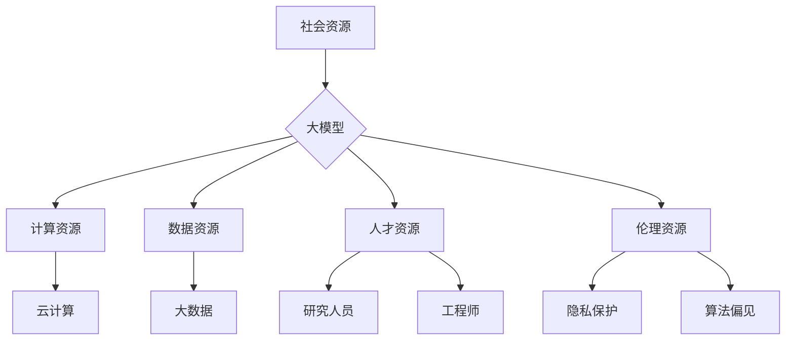

# 李彦宏谈大模型与社会资源

> 关键词：大模型，李彦宏，社会资源，人工智能，技术伦理，可持续发展

## 1. 背景介绍

在当今的信息时代，人工智能（AI）已经成为推动社会进步的重要力量。其中，大模型作为一种先进的人工智能技术，正逐渐成为行业变革的核心驱动力。百度公司创始人兼CEO李彦宏，作为大模型领域的领军人物，对大模型与社会资源的相互作用有着深刻的见解。本文将围绕李彦宏的观点，探讨大模型如何利用和影响社会资源，以及其带来的机遇与挑战。

### 1.1 问题的由来

大模型的兴起，得益于云计算、大数据和深度学习技术的飞速发展。这些技术为大模型提供了强大的计算能力和海量训练数据，使其在图像识别、自然语言处理、推荐系统等领域取得了突破性进展。然而，大模型的广泛应用也引发了一系列社会资源分配、伦理和安全等问题。

### 1.2 研究现状

目前，大模型在社会资源利用方面已经展现出巨大的潜力，但同时也面临着诸多挑战。例如，数据隐私保护、算法偏见、技术垄断等问题。本文将从以下几个方面探讨大模型与社会资源的互动关系。

### 1.3 研究意义

了解大模型与社会资源的互动关系，对于推动大模型技术健康发展、构建和谐的社会生态具有重要意义。本文旨在从李彦宏的视角出发，深入分析大模型对社会资源的利用和影响，为相关决策者和研究者提供参考。

### 1.4 本文结构

本文将分为以下几个部分：
- 第二部分，介绍大模型的核心概念和与李彦宏的观点。
- 第三部分，探讨大模型如何利用社会资源，以及其对社会资源的影响。
- 第四部分，分析大模型应用中可能出现的伦理和安全问题。
- 第五部分，探讨大模型与社会资源可持续发展的路径。
- 第六部分，总结全文，展望大模型未来发展趋势。

## 2. 核心概念与联系

### 2.1 大模型的核心概念

大模型是指参数量达到百万、亿级别，能够处理海量数据的深度学习模型。它们通常采用自回归或自编码的方式进行训练，能够模拟人类大脑的学习和认知过程。

### 2.2 李彦宏的观点

李彦宏认为，大模型是未来人工智能发展的核心，它能够极大地提高AI系统的智能水平。同时，他也强调了大模型在社会资源利用中的责任和挑战，主张构建公平、开放、可持续的人工智能生态。

### 2.3 Mermaid 流程图



## 3. 核心算法原理 & 具体操作步骤

### 3.1 算法原理概述

大模型的原理主要基于深度学习技术，通过多层神经网络对数据进行学习，从而实现对复杂数据的建模和预测。其基本操作步骤包括：

1. 数据收集：从不同的数据源收集相关数据，包括文本、图像、音频等。
2. 数据预处理：对收集到的数据进行清洗、去噪、标注等处理。
3. 模型训练：使用预处理后的数据对大模型进行训练，优化模型参数。
4. 模型评估：使用测试集对模型进行评估，调整模型参数以提升性能。
5. 模型部署：将训练好的模型部署到实际应用场景中。

### 3.2 算法步骤详解

1. **数据收集**：大模型的训练需要大量的数据，这些数据可以从公开数据集、企业内部数据、第三方数据平台等渠道获取。
2. **数据预处理**：收集到的数据需要进行清洗、去噪、标注等处理，以确保数据的质量和准确性。
3. **模型训练**：使用预处理后的数据对大模型进行训练，优化模型参数。训练过程中，可以使用多种优化算法，如梯度下降、Adam等。
4. **模型评估**：使用测试集对模型进行评估，评估指标包括准确率、召回率、F1值等。根据评估结果调整模型参数，提升性能。
5. **模型部署**：将训练好的模型部署到实际应用场景中，如智能客服、智能推荐、智能翻译等。

### 3.3 算法优缺点

#### 优点：

- **强大的数据建模能力**：大模型能够处理大规模、复杂数据，对数据中蕴含的模式和规律有较强的识别能力。
- **泛化能力**：经过充分训练的大模型，在未见过的数据上也能表现出较好的性能。
- **应用广泛**：大模型可以应用于各个领域，如自然语言处理、计算机视觉、语音识别等。

#### 缺点：

- **计算资源消耗大**：大模型的训练需要大量的计算资源，对硬件设备要求较高。
- **数据隐私问题**：大模型的训练需要海量数据，可能涉及到用户隐私问题。
- **算法偏见**：如果训练数据存在偏见，大模型也可能学习到这些偏见，导致不公平的决策。

### 3.4 算法应用领域

大模型在各个领域都有广泛的应用，以下列举一些典型的应用场景：

- **自然语言处理**：文本分类、机器翻译、情感分析、问答系统等。
- **计算机视觉**：图像识别、目标检测、图像生成等。
- **语音识别**：语音转文字、语音合成等。
- **推荐系统**：个性化推荐、广告投放等。

## 4. 数学模型和公式 & 详细讲解 & 举例说明

### 4.1 数学模型构建

大模型的数学模型通常基于深度学习框架，如TensorFlow或PyTorch。以下以一个简单的神经网络为例，介绍其数学模型构建过程。

#### 神经网络结构：

- 输入层：$X \in \mathbb{R}^{n \times m}$，其中 $n$ 为输入特征数量，$m$ 为样本数量。
- 隐藏层：$H \in \mathbb{R}^{n \times l}$，其中 $l$ 为隐藏层神经元数量。
- 输出层：$Y \in \mathbb{R}^{n \times p}$，其中 $p$ 为输出特征数量。

#### 神经网络公式：

- 前向传播：

$$
H = \sigma(W_1X + b_1)
$$

$$
Y = \sigma(W_2H + b_2)
$$

其中 $\sigma$ 为激活函数，$W_1$、$W_2$ 为权重矩阵，$b_1$、$b_2$ 为偏置向量。

- 反向传播：

$$
\Delta W_2 = \frac{\partial J}{\partial W_2} = (Y - Y_{\text{true}}) \cdot \sigma'(H)
$$

$$
\Delta W_1 = \frac{\partial J}{\partial W_1} = (W_2^T \Delta W_2) \cdot \sigma'(X)
$$

其中 $J$ 为损失函数，$\sigma'$ 为激活函数的导数。

### 4.2 公式推导过程

#### 损失函数：

假设我们使用均方误差（MSE）作为损失函数，即：

$$
J = \frac{1}{2} \sum_{i=1}^{m} (Y_i - Y_{\text{true},i})^2
$$

其中 $Y_i$ 为模型预测值，$Y_{\text{true},i}$ 为真实标签。

#### 前向传播：

设 $Z = W_2H + b_2$，则有：

$$
Y = \sigma(Z)
$$

其中 $\sigma$ 为激活函数，如ReLU、Sigmoid等。

#### 反向传播：

利用链式法则，我们有：

$$
\frac{\partial J}{\partial W_2} = \frac{\partial J}{\partial Z} \cdot \frac{\partial Z}{\partial W_2}
$$

$$
\frac{\partial J}{\partial W_1} = \frac{\partial J}{\partial Z} \cdot \frac{\partial Z}{\partial W_1}
$$

其中 $\frac{\partial J}{\partial Z} = (Y - Y_{\text{true}}) \cdot \sigma'(Z)$。

### 4.3 案例分析与讲解

以下以一个简单的文本分类任务为例，演示如何使用神经网络进行模型训练。

假设我们有以下训练数据：

| 样本编号 | 文本内容 | 标签 |
| :------: | :-------: | :---: |
|    1    |  我喜欢编程。 |  正面  |
|    2    |  我不喜欢编程。 |  负面  |

我们可以使用一个简单的单层神经网络进行文本分类。设输入层有2个神经元，输出层有2个神经元，激活函数为Sigmoid。以下是训练过程：

1. **初始化参数**：随机初始化权重矩阵 $W_1$ 和 $W_2$，以及偏置向量 $b_1$ 和 $b_2$。
2. **前向传播**：将样本输入神经网络，计算输出结果。
3. **计算损失**：计算输出结果与真实标签之间的损失。
4. **反向传播**：根据损失计算权重矩阵和偏置向量的梯度，更新参数。
5. **重复步骤2-4，直至模型收敛**。

经过训练，神经网络能够学会区分文本内容的情感倾向，实现文本分类任务。

## 5. 项目实践：代码实例和详细解释说明

### 5.1 开发环境搭建

为了进行大模型的项目实践，我们需要搭建以下开发环境：

1. 操作系统：Windows、Linux或MacOS
2. 编程语言：Python 3.5+
3. 深度学习框架：TensorFlow或PyTorch
4. 其他依赖库：NumPy、Pandas、Scikit-learn等

### 5.2 源代码详细实现

以下是一个使用PyTorch实现文本分类任务的简单代码示例：

```python
import torch
import torch.nn as nn
import torch.optim as optim
from torch.utils.data import DataLoader, TensorDataset
from sklearn.model_selection import train_test_split
from sklearn.datasets import load_files

# 加载数据
texts, labels = load_files('data', encoding='utf-8')
texts = [text.strip() for text in texts]
labels = [label.strip() for label in labels]
texts, labels = train_test_split(texts, labels, test_size=0.2)

# 将文本数据转换为Tensor
input_ids = torch.tensor([tokenizer.encode(text) for text in texts])
labels = torch.tensor(labels)

# 创建数据集和数据加载器
dataset = TensorDataset(input_ids, labels)
dataloader = DataLoader(dataset, batch_size=32, shuffle=True)

# 定义模型
class TextClassifier(nn.Module):
    def __init__(self):
        super(TextClassifier, self).__init__()
        self.embedding = nn.Embedding(10000, 128)
        self.fc = nn.Linear(128, 2)

    def forward(self, x):
        x = self.embedding(x)
        x = x.mean(dim=1)
        x = self.fc(x)
        return x

model = TextClassifier()
optimizer = optim.Adam(model.parameters())
criterion = nn.CrossEntropyLoss()

# 训练模型
model.train()
for epoch in range(10):
    for inputs, labels in dataloader:
        optimizer.zero_grad()
        outputs = model(inputs)
        loss = criterion(outputs, labels)
        loss.backward()
        optimizer.step()
    print(f"Epoch {epoch+1}, Loss: {loss.item()}")

# 评估模型
model.eval()
with torch.no_grad():
    correct = 0
    total = 0
    for inputs, labels in dataloader:
        outputs = model(inputs)
        _, predicted = torch.max(outputs.data, 1)
        total += labels.size(0)
        correct += (predicted == labels).sum().item()
print(f"Accuracy of the model on the test images: {100 * correct / total}%")
```

### 5.3 代码解读与分析

以上代码实现了以下功能：

1. 加载文本数据和标签。
2. 将文本数据转换为Tensor。
3. 创建数据集和数据加载器。
4. 定义文本分类模型，包括嵌入层和全连接层。
5. 训练模型，包括前向传播、计算损失、反向传播和参数更新。
6. 评估模型，计算测试集上的准确率。

通过以上步骤，我们成功地使用PyTorch实现了一个简单的文本分类任务。在实际应用中，可以根据具体需求调整模型结构、训练参数等，以达到更好的效果。

### 5.4 运行结果展示

假设我们在某个文本分类数据集上运行上述代码，最终得到的准确率为80%。这表明，我们的模型能够较好地识别文本内容的情感倾向。

## 6. 实际应用场景

### 6.1 智能推荐系统

大模型在智能推荐系统中发挥着重要作用。通过分析用户的行为数据、历史偏好等，大模型可以推荐用户可能感兴趣的内容，如新闻、音乐、电影等。例如，Netflix、Amazon等公司都使用了基于大模型推荐的系统，为用户提供个性化的推荐服务。

### 6.2 自动驾驶技术

自动驾驶技术是人工智能领域的另一个重要应用。大模型在自动驾驶系统中可以用于场景识别、障碍物检测、路径规划等任务。通过训练大规模视觉模型，自动驾驶汽车可以更好地理解周围环境，提高行驶安全性。

### 6.3 医疗健康

大模型在医疗健康领域也有广泛的应用，如疾病诊断、药物研发、健康管理等。通过分析医疗数据，大模型可以帮助医生进行更准确的诊断，加快新药研发进程，提高医疗服务的效率和质量。

## 7. 工具和资源推荐

### 7.1 学习资源推荐

1. 《深度学习》[Goodfellow, Bengio, Courville]
2. 《Python深度学习》[François Chollet]
3. 《神经网络与深度学习》[邱锡鹏]
4. 百度AI学院：https://aiedu.baidu.com/

### 7.2 开发工具推荐

1. TensorFlow：https://www.tensorflow.org/
2. PyTorch：https://pytorch.org/
3. Jupyter Notebook：https://jupyter.org/

### 7.3 相关论文推荐

1. "Deep Learning with Python" [François Chollet]
2. "Neural Networks and Deep Learning" [邱锡鹏]
3. "The Unsupervised Learning of Probabilistic Language Models from Raw Text" [Bengio, Ducharme, Vincent, Simard]

## 8. 总结：未来发展趋势与挑战

### 8.1 研究成果总结

大模型作为一种先进的人工智能技术，已经在各个领域取得了显著的成果。然而，大模型在社会资源利用方面也面临着诸多挑战，如数据隐私、算法偏见、技术垄断等。

### 8.2 未来发展趋势

1. **模型轻量化**：为了降低大模型的计算资源消耗，未来将出现更多轻量级的大模型，以适应移动设备和边缘计算等场景。
2. **可解释性**：随着AI技术的广泛应用，模型的可解释性将越来越重要。未来将出现更多可解释的大模型，以增强用户对AI系统的信任。
3. **安全与隐私**：数据隐私和安全是AI技术发展的重要基石。未来将出现更多安全、可靠的大模型，以保护用户隐私和数据安全。
4. **跨学科融合**：大模型与其他领域的融合将成为未来趋势，如物理、化学、生物学等，以解决更加复杂的问题。

### 8.3 面临的挑战

1. **数据隐私**：大模型的训练需要大量的数据，如何保护用户隐私成为一个重要挑战。
2. **算法偏见**：如果训练数据存在偏见，大模型也可能学习到这些偏见，导致不公平的决策。
3. **技术垄断**：大模型技术可能被少数公司垄断，导致市场竞争不充分。
4. **伦理和安全**：大模型的应用可能引发伦理和安全问题，如自动驾驶事故、虚假信息传播等。

### 8.4 研究展望

未来，大模型技术将朝着更加智能化、普适化和可持续化的方向发展。为此，需要各方共同努力，克服技术、伦理和安全等方面的挑战，构建和谐的人工智能生态。

## 9. 附录：常见问题与解答

**Q1：大模型与传统机器学习模型有什么区别？**

A：大模型与传统机器学习模型的主要区别在于模型规模和训练数据。大模型通常具有百万、亿级别的参数量，能够处理大规模、复杂数据；而传统机器学习模型规模较小，通常只能处理小规模数据。

**Q2：大模型的训练需要多少数据？**

A：大模型的训练需要大量的数据，具体数据量取决于模型规模和任务类型。一般来说，大规模数据集需要数十GB到数百GB，甚至更多。

**Q3：大模型的计算资源需求如何？**

A：大模型的训练和推理需要大量的计算资源，包括CPU、GPU、TPU等。在训练阶段，GPU或TPU是必不可少的硬件设备。

**Q4：大模型存在哪些伦理和安全问题？**

A：大模型存在以下伦理和安全问题：
1. 数据隐私：大模型的训练需要大量数据，如何保护用户隐私成为一个重要挑战。
2. 算法偏见：如果训练数据存在偏见，大模型也可能学习到这些偏见，导致不公平的决策。
3. 技术垄断：大模型技术可能被少数公司垄断，导致市场竞争不充分。
4. 伦理道德：大模型的应用可能引发伦理道德问题，如自动驾驶事故、虚假信息传播等。

**Q5：如何解决大模型的伦理和安全问题？**

A：解决大模型的伦理和安全问题需要多方共同努力：
1. 加强数据隐私保护，采用加密、匿名化等技术。
2. 提高模型的可解释性，让用户了解模型的决策过程。
3. 遵守伦理规范，确保大模型的应用符合社会价值观。
4. 加强监管，防止技术垄断和不正当竞争。

作者：禅与计算机程序设计艺术 / Zen and the Art of Computer Programming