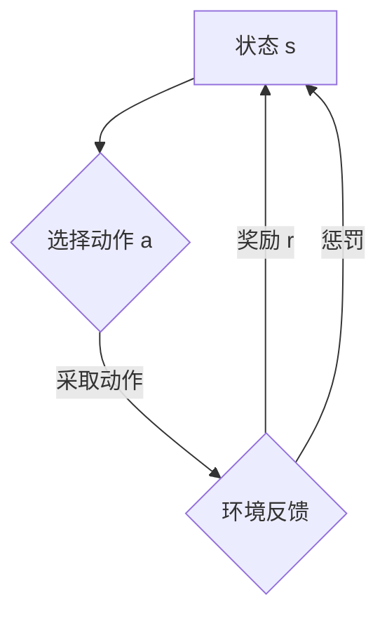

# 深度 Q-learning：在金融风控中的应用

> 关键词：深度学习，Q-learning，强化学习，金融风控，风险管理，信用评分，欺诈检测

## 1. 背景介绍

金融行业作为现代经济体系的核心，其风险管理一直是金融从业者关注的焦点。随着金融科技的快速发展，机器学习技术在金融风控领域的应用日益广泛。深度学习作为一种强大的机器学习技术，在图像识别、语音识别等领域取得了显著的成果。而强化学习，作为一种结合了学习与决策的算法，为金融风控提供了新的思路。本文将重点介绍深度 Q-learning 在金融风控中的应用，探讨其在信用评分、欺诈检测等场景下的优势与挑战。

## 2. 核心概念与联系

### 2.1 核心概念

#### 深度学习

深度学习是一种模拟人脑神经网络结构和功能的机器学习技术，通过多层的神经网络对数据进行学习，提取特征并完成复杂的模式识别任务。

#### 强化学习

强化学习是一种通过试错来学习最优策略的机器学习技术。它通过奖励和惩罚机制，使智能体在环境与状态中不断学习，最终找到最优策略。

#### Q-learning

Q-learning 是一种基于价值函数的强化学习算法。它通过学习值函数 $Q(s, a)$ 来预测在状态 $s$ 下采取动作 $a$ 的期望回报，并以此作为决策依据。

### 2.2 核心概念原理和架构的 Mermaid 流程图



图中的流程展示了 Q-learning 的基本原理：智能体根据当前状态选择动作，环境根据动作给出反馈（奖励或惩罚），智能体根据反馈更新价值函数，并再次选择动作。

## 3. 核心算法原理 & 具体操作步骤

### 3.1 算法原理概述

深度 Q-learning 是将深度学习与 Q-learning 相结合的算法。它使用深度神经网络来近似 Q 函数，从而提高 Q 函数的表达能力。

### 3.2 算法步骤详解

1. **初始化**：初始化神经网络参数 $ \theta $ 和 Q 表 $ Q(s, a) $。
2. **选择动作**：根据当前状态 $ s $ 和 Q 表，选择动作 $ a $。
3. **执行动作**：智能体执行动作 $ a $，进入新状态 $ s' $，并获得奖励 $ r $。
4. **更新 Q 表**：根据新的状态 $ s' $ 和奖励 $ r $，更新 Q 表中的 $ Q(s, a) $。
5. **重复步骤 2-4**，直到达到终止条件。

### 3.3 算法优缺点

#### 优点

1. **强大的表达能力**：深度神经网络能够学习到复杂的特征，提高 Q 函数的预测精度。
2. **适用于复杂环境**：能够处理高维、非线性状态空间。
3. **端到端学习**：无需手动设计特征，实现端到端的学习。

#### 缺点

1. **计算复杂度高**：训练过程需要大量的计算资源和时间。
2. **过拟合风险**：深度神经网络容易过拟合，需要采用正则化等技术进行缓解。
3. **参数调整困难**：深度神经网络的参数众多，参数调整比较困难。

### 3.4 算法应用领域

深度 Q-learning 在金融风控领域有着广泛的应用，以下是一些典型的应用场景：

1. **信用评分**：通过学习用户的信用历史数据，预测用户违约风险。
2. **欺诈检测**：通过分析交易数据，识别和防范欺诈行为。
3. **投资策略优化**：根据市场数据，制定最优的投资策略。
4. **风险管理**：预测金融市场风险，为风险控制提供决策依据。

## 4. 数学模型和公式 & 详细讲解 & 举例说明

### 4.1 数学模型构建

深度 Q-learning 的数学模型主要由以下部分组成：

1. **状态空间 $ S $**：描述了智能体所处的环境状态。
2. **动作空间 $ A $**：描述了智能体可以采取的动作。
3. **奖励函数 $ R(s, a) $**：描述了在状态 $ s $ 下采取动作 $ a $ 所获得的奖励。
4. **策略函数 $ \pi(s) $**：描述了在状态 $ s $ 下采取动作 $ a $ 的概率。
5. **Q 函数 $ Q(s, a) $**：描述了在状态 $ s $ 下采取动作 $ a $ 的期望回报。

### 4.2 公式推导过程

假设智能体在状态 $ s $ 下采取动作 $ a $，进入新状态 $ s' $，并获得奖励 $ r $。则 Q-learning 的更新公式为：

$$
Q(s, a) \leftarrow Q(s, a) + \alpha [r + \gamma \max_{a'} Q(s', a') - Q(s, a)]
$$

其中，$ \alpha $ 为学习率，$ \gamma $ 为折扣因子，表示对未来奖励的期望。

### 4.3 案例分析与讲解

以下以信用评分为例，说明深度 Q-learning 在金融风控中的应用。

#### 数据集

假设我们有一个包含以下特征的信用评分数据集：

- 年龄
- 收入
- 负债
- 信用历史

#### 模型构建

我们将使用一个简单的深度神经网络作为 Q 函数的近似，输入层包含四个神经元，分别对应年龄、收入、负债和信用历史。隐藏层包含两个神经元，输出层包含一个神经元，表示信用评分。

#### 训练过程

1. 使用无监督学习方法（如PCA）对数据进行预处理，消除特征之间的线性关系。
2. 将预处理后的数据划分为训练集、验证集和测试集。
3. 使用训练集数据训练深度神经网络，学习 Q 函数的参数。
4. 在验证集上评估模型性能，并根据验证集性能调整学习率和折扣因子等参数。
5. 使用测试集数据评估模型性能，评估模型在信用评分任务上的表现。

## 5. 项目实践：代码实例和详细解释说明

### 5.1 开发环境搭建

以下是使用 Python 和 TensorFlow 库实现深度 Q-learning 的开发环境搭建步骤：

1. 安装 Anaconda：从官网下载并安装 Anaconda，用于创建独立的 Python 环境。

2. 创建并激活虚拟环境：

```bash
conda create -n deep_q_learning python=3.8
conda activate deep_q_learning
```

3. 安装 TensorFlow：

```bash
conda install tensorflow
```

### 5.2 源代码详细实现

以下是一个简单的深度 Q-learning 代码示例：

```python
import tensorflow as tf
import numpy as np

class DeepQLearning:
    def __init__(self, state_dim, action_dim, learning_rate=0.01, discount_factor=0.99):
        self.state_dim = state_dim
        self.action_dim = action_dim
        self.learning_rate = learning_rate
        self.discount_factor = discount_factor
        
        self.model = tf.keras.Sequential([
            tf.keras.layers.Dense(64, activation='relu', input_dim=state_dim),
            tf.keras.layers.Dense(32, activation='relu'),
            tf.keras.layers.Dense(action_dim, activation='linear')
        ])
        
        self.target_model = tf.keras.Model(inputs=self.model.input, outputs=self.model.layers[-1](self.model.output))
        self.target_model.set_weights(self.model.get_weights())
        
    def choose_action(self, state):
        state = tf.expand_dims(state, 0)
        act_values = self.model(state)
        act_values = tf.nn.softmax(act_values, axis=-1)
        act_values = act_values.numpy()[0]
        return np.random.choice(self.action_dim, p=act_values)

    def train(self, state, action, reward, next_state, done):
        target = reward
        if not done:
            target = reward + self.discount_factor * np.max(self.target_model(next_state)[0])
        target_f = self.model(state)
        target_f[0][action] = target
        self.model.fit(state, target_f, epochs=1, verbose=0)
        self.target_model.set_weights(self.model.get_weights())
```

### 5.3 代码解读与分析

1. **初始化**：定义了深度神经网络模型、目标模型、学习率和折扣因子等参数。
2. **选择动作**：根据当前状态选择动作，并使用 softmax 函数进行概率分布。
3. **训练**：根据当前状态、动作、奖励、下一个状态和是否完成来更新模型参数。

### 5.4 运行结果展示

以下是一个简单的运行示例：

```python
# 初始化深度 Q-learning 模型
state_dim = 4
action_dim = 2
dql = DeepQLearning(state_dim, action_dim)

# 生成一些随机样本进行训练
state = np.random.random(state_dim)
action = np.random.randint(0, action_dim)
next_state = np.random.random(state_dim)
reward = np.random.random()
done = np.random.choice([0, 1])

# 训练模型
dql.train(state, action, reward, next_state, done)
```

## 6. 实际应用场景

### 6.1 信用评分

深度 Q-learning 可以用于构建信用评分模型，通过学习用户的信用历史数据，预测用户违约风险。与传统评分模型相比，深度 Q-learning 能够更好地捕捉数据中的复杂关系，提高评分的准确性。

### 6.2 欺诈检测

深度 Q-learning 可以用于构建欺诈检测模型，通过分析交易数据，识别和防范欺诈行为。与传统欺诈检测方法相比，深度 Q-learning 能够更好地处理非线性关系，提高检测的准确性和鲁棒性。

### 6.3 投资策略优化

深度 Q-learning 可以用于构建投资策略优化模型，根据市场数据，制定最优的投资策略。与传统投资策略相比，深度 Q-learning 能够更好地适应市场变化，提高投资收益。

## 7. 工具和资源推荐

### 7.1 学习资源推荐

1. 《深度学习》
2. 《强化学习：原理与数学基础》
3. TensorFlow官方文档
4. Keras官方文档

### 7.2 开发工具推荐

1. TensorFlow
2. Keras
3. PyTorch

### 7.3 相关论文推荐

1. "Playing Atari with Deep Reinforcement Learning" (Silver et al., 2016)
2. "Mastering Chess and Shogi by Self-Play with a General Reinforcement Learning Algorithm" (Silver et al., 2017)
3. "Human-level performance in first-person multiplayer games with population-based deep reinforcement learning" (Silver et al., 2018)

## 8. 总结：未来发展趋势与挑战

### 8.1 研究成果总结

本文介绍了深度 Q-learning 在金融风控领域的应用，探讨了其在信用评分、欺诈检测等场景下的优势与挑战。通过实例分析和代码实现，展示了深度 Q-learning 在金融风控中的应用潜力。

### 8.2 未来发展趋势

1. 深度 Q-learning 将与其他机器学习技术（如深度强化学习、迁移学习等）相结合，提高模型的性能和鲁棒性。
2. 深度 Q-learning 将应用于更多金融风控场景，如风险管理、投资策略优化等。
3. 深度 Q-learning 将与其他金融科技领域（如区块链、人工智能等）相结合，推动金融行业的变革。

### 8.3 面临的挑战

1. 深度 Q-learning 的计算复杂度高，需要大量的计算资源和时间。
2. 深度 Q-learning 的可解释性较差，难以理解模型的决策过程。
3. 深度 Q-learning 的安全性和可靠性有待进一步提高。

### 8.4 研究展望

未来，深度 Q-learning 在金融风控领域的应用将取得更大的突破。通过不断优化算法、降低计算复杂度、提高可解释性，深度 Q-learning 将为金融行业的风险管理提供更加强大的技术支持。

## 9. 附录：常见问题与解答

**Q1：深度 Q-learning 与 Q-learning 有什么区别？**

A：深度 Q-learning 是基于 Q-learning 的算法，它使用深度神经网络来近似 Q 函数，从而提高 Q 函数的表达能力。而 Q-learning 是一种基于价值函数的强化学习算法，它使用表格来存储 Q 函数。

**Q2：深度 Q-learning 的计算复杂度如何？**

A：深度 Q-learning 的计算复杂度取决于神经网络的结构和数据规模。一般来说，深度 Q-learning 的计算复杂度比 Q-learning 高。

**Q3：深度 Q-learning 的可解释性如何？**

A：深度 Q-learning 的可解释性较差，难以理解模型的决策过程。目前，研究者正在探索一些可解释性方法，如注意力机制、解释性模型等。

**Q4：深度 Q-learning 在金融风控领域有哪些应用场景？**

A：深度 Q-learning 在金融风控领域有广泛的应用场景，如信用评分、欺诈检测、投资策略优化、风险管理等。

**Q5：如何优化深度 Q-learning 的性能？**

A：可以采取以下方法优化深度 Q-learning 的性能：
1. 使用更复杂的神经网络结构。
2. 优化学习率和折扣因子等参数。
3. 使用数据增强等技术扩充训练集。
4. 使用迁移学习等技术提高模型的泛化能力。

作者：禅与计算机程序设计艺术 / Zen and the Art of Computer Programming