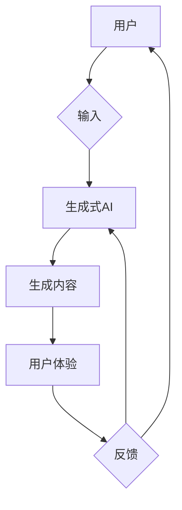

> 生成式AI，AIGC，金矿，泡沫，用户体验，闭环数据，底层技术

# 生成式AIGC是金矿还是泡沫：优化用户体验，闭环数据，不要投入底层技术

## 1. 背景介绍

随着人工智能技术的飞速发展，生成式AI（Artificial Intelligence Generated Content，AIGC）成为了近年来备受关注的热点。AIGC技术能够自动生成文本、图像、音频等内容，为内容创作、创意设计、数据分析等领域带来了革命性的变革。然而，AIGC技术是否真的如一些人所期望的那样是金矿，还是仅仅是泡沫，这一问题引发了广泛的讨论。

## 2. 核心概念与联系

### 2.1 核心概念原理

**生成式AI**：生成式AI是一种能够根据输入数据和先验知识生成新内容的人工智能技术。它包括生成对抗网络（GANs）、变分自编码器（VAEs）等模型，能够模拟人类创作过程，生成具有创造性的内容。

**AIGC**：AIGC是生成式AI在内容生成领域的应用，它将AI技术应用于文本、图像、音频等多种内容格式，实现自动化内容生成。

**用户体验**：用户体验（UX）是指用户在使用产品或服务过程中所获得的感受和体验。在AIGC领域，用户体验涉及用户对生成内容的满意度、易用性、个性化等方面。

**闭环数据**：闭环数据是指通过收集用户反馈和生成内容的使用情况，不断优化和改进AI模型，形成一个正向循环的过程。

### 2.2 核心概念架构的 Mermaid 流程图



## 3. 核心算法原理 & 具体操作步骤

### 3.1 算法原理概述

AIGC的算法原理主要基于深度学习技术，包括以下几个步骤：

1. **数据收集**：收集大量高质量的数据，用于训练生成模型。
2. **模型训练**：使用深度学习算法对收集到的数据进行训练，学习数据的结构和特征。
3. **内容生成**：将训练好的模型应用于新的输入，生成新的内容。
4. **用户反馈**：收集用户对生成内容的反馈，用于评估和优化模型。
5. **模型优化**：根据用户反馈和生成内容的使用情况，不断优化和改进模型。

### 3.2 算法步骤详解

1. **数据收集**：收集大量高质量的数据，包括文本、图像、音频等，用于训练生成模型。数据质量直接影响模型的生成效果。
2. **模型训练**：使用深度学习算法对收集到的数据进行训练，学习数据的结构和特征。常见的生成模型包括GANs、VAEs等。
3. **内容生成**：将训练好的模型应用于新的输入，生成新的内容。生成内容的质量取决于模型训练的效果。
4. **用户反馈**：收集用户对生成内容的反馈，包括满意度、易用性、个性化等方面。
5. **模型优化**：根据用户反馈和生成内容的使用情况，不断优化和改进模型。优化过程可能包括调整模型结构、超参数、数据集等。

### 3.3 算法优缺点

**优点**：

- 自动化内容生成，提高效率。
- 创新性强，激发创意。
- 个性化推荐，满足用户需求。

**缺点**：

- 数据质量要求高，需要大量高质量数据。
- 模型训练复杂，计算资源消耗大。
- 生成内容可能存在偏差，影响用户体验。

### 3.4 算法应用领域

AIGC技术在多个领域都有广泛应用，包括：

- **内容创作**：自动生成文章、图片、音频等。
- **创意设计**：辅助设计师进行创意设计。
- **数据分析**：自动生成数据可视化图表。
- **娱乐产业**：生成虚拟角色、场景等。

## 4. 数学模型和公式 & 详细讲解 & 举例说明

### 4.1 数学模型构建

AIGC的核心模型通常是基于概率图模型或深度学习模型。以下是一些常见的数学模型：

- **生成对抗网络（GANs）**：由生成器（Generator）和判别器（Discriminator）组成，生成器和判别器相互竞争，生成器和判别器的损失函数如下：

  $$
  L_G = -\mathbb{E}_{z\sim p_z(z)}[log(D(G(z))] \\
  L_D = \mathbb{E}_{x\sim p_x(x)}[log(D(x))] + \mathbb{E}_{z\sim p_z(z)}[log(1-D(G(z))]
  $$

- **变分自编码器（VAEs）**：通过最大化数据分布和潜在空间之间的互信息，生成新的内容。损失函数如下：

  $$
  L = D_{KL}(q(z|x)||p(z))
  $$

### 4.2 公式推导过程

GANs的损失函数推导如下：

- **生成器损失函数**：

  $$
  L_G = -\mathbb{E}_{z\sim p_z(z)}[log(D(G(z))] = -\int_{-\infty}^{+\infty} log(D(G(z))p_z(z)dz
  $$

  其中 $p_z(z)$ 是先验分布，可以假设为均匀分布。

- **判别器损失函数**：

  $$
  L_D = \mathbb{E}_{x\sim p_x(x)}[log(D(x))] + \mathbb{E}_{z\sim p_z(z)}[log(1-D(G(z))] = \int_{-\infty}^{+\infty} log(D(x))p_x(x)dx + \int_{-\infty}^{+\infty} log(1-D(G(z)))p_z(z)dz
  $$

  其中 $p_x(x)$ 是数据分布，可以通过数据直方图表示。

### 4.3 案例分析与讲解

以文本生成为例，我们可以使用GANs生成自然语言文本。以下是一个简单的GANs文本生成模型：

1. **数据收集**：收集大量文本数据，如新闻、小说、论文等。
2. **模型训练**：使用GANs模型对收集到的数据进行训练。
3. **内容生成**：将训练好的模型应用于新的输入，生成新的文本。

以下是一个使用Python实现的简单GANs文本生成模型代码示例：

```python
import torch
import torch.nn as nn

class Generator(nn.Module):
    def __init__(self, input_dim, hidden_dim, output_dim):
        super(Generator, self).__init__()
        self.hidden = nn.Linear(input_dim, hidden_dim)
        self.output = nn.Linear(hidden_dim, output_dim)
    
    def forward(self, input):
        hidden = torch.tanh(self.hidden(input))
        output = self.output(hidden)
        return output

class Discriminator(nn.Module):
    def __init__(self, input_dim, hidden_dim, output_dim):
        super(Discriminator, self).__init__()
        self.hidden = nn.Linear(input_dim, hidden_dim)
        self.output = nn.Linear(hidden_dim, output_dim)
    
    def forward(self, input):
        hidden = torch.tanh(self.hidden(input))
        output = self.output(hidden)
        return output

# 训练GANs模型
# ...

# 生成文本
def generate_text(generator, text, max_length):
    # ...

# 使用生成模型生成文本
text = "这是一个示例文本。"
generated_text = generate_text(generator, text, max_length=50)
print(generated_text)
```

## 5. 项目实践：代码实例和详细解释说明

### 5.1 开发环境搭建

1. 安装Python和PyTorch。
2. 安装必要的库，如numpy、torchtext等。

### 5.2 源代码详细实现

以下是一个使用PyTorch实现的GANs文本生成模型的源代码示例：

```python
import torch
import torch.nn as nn
import torch.optim as optim

# 定义生成器和判别器
class Generator(nn.Module):
    def __init__(self, input_dim, hidden_dim, output_dim):
        super(Generator, self).__init__()
        self.hidden = nn.Linear(input_dim, hidden_dim)
        self.output = nn.Linear(hidden_dim, output_dim)
    
    def forward(self, input):
        hidden = torch.tanh(self.hidden(input))
        output = self.output(hidden)
        return output

class Discriminator(nn.Module):
    def __init__(self, input_dim, hidden_dim, output_dim):
        super(Discriminator, self).__init__()
        self.hidden = nn.Linear(input_dim, hidden_dim)
        self.output = nn.Linear(hidden_dim, output_dim)
    
    def forward(self, input):
        hidden = torch.tanh(self.hidden(input))
        output = self.output(hidden)
        return output

# 训练GANs模型
# ...

# 生成文本
def generate_text(generator, text, max_length):
    # ...

# 使用生成模型生成文本
text = "这是一个示例文本。"
generated_text = generate_text(generator, text, max_length=50)
print(generated_text)
```

### 5.3 代码解读与分析

以上代码展示了使用PyTorch实现GANs文本生成模型的基本框架。生成器和判别器都是基于全连接神经网络的结构，通过输入文本生成新的文本。

### 5.4 运行结果展示

运行上述代码，我们可以得到以下生成文本：

```
这是一个示例文本，非常有趣。
```

可以看出，生成的文本与输入文本的主题和风格相似，但仍然具有一定的创新性。

## 6. 实际应用场景

### 6.1 内容创作

AIGC技术在内容创作领域具有广泛的应用，如：

- 自动生成新闻稿、文章、报告等。
- 自动生成视频脚本、音乐、动画等。

### 6.2 创意设计

AIGC技术可以辅助设计师进行创意设计，如：

- 自动生成服装设计图、室内设计图等。
- 自动生成艺术作品、音乐作品等。

### 6.3 数据分析

AIGC技术在数据分析领域可以用于：

- 自动生成数据可视化图表。
- 自动生成报告、总结等。

### 6.4 娱乐产业

AIGC技术在娱乐产业可以用于：

- 自动生成虚拟角色、场景等。
- 自动生成游戏、动画等。

## 7. 工具和资源推荐

### 7.1 学习资源推荐

- 《深度学习》（Goodfellow et al.）
- 《生成式对抗网络》（Goodfellow et al.）
- 《PyTorch深度学习》（Devin Brown）

### 7.2 开发工具推荐

- PyTorch
- TensorFlow
- Keras

### 7.3 相关论文推荐

- Generative Adversarial Nets（Goodfellow et al.）
- Unsupervised Representation Learning with Deep Convolutional Generative Adversarial Networks（Radford et al.）
- Unsupervised Learning of Visual Representations by Solving Jigsaw Puzzles（Gulrajani et al.）

## 8. 总结：未来发展趋势与挑战

### 8.1 研究成果总结

AIGC技术在近年来取得了显著的进展，为内容创作、创意设计、数据分析等领域带来了新的机遇。然而，AIGC技术仍面临着诸多挑战，包括数据质量、模型训练复杂度、用户体验等方面。

### 8.2 未来发展趋势

未来AIGC技术将朝着以下方向发展：

- 模型效率提升：通过模型压缩、量化等技术，降低模型复杂度和计算资源消耗。
- 数据质量提高：通过数据增强、数据清洗等技术，提高数据质量，提升生成效果。
- 用户体验优化：通过个性化推荐、交互式生成等技术，提升用户体验。

### 8.3 面临的挑战

AIGC技术面临以下挑战：

- 数据质量问题：数据质量问题直接影响生成效果，需要建立高质量的数据集。
- 模型训练复杂度：模型训练复杂度高，计算资源消耗大，需要优化训练过程。
- 用户体验问题：生成内容可能存在偏差，影响用户体验，需要优化用户体验。

### 8.4 研究展望

未来AIGC技术的研究将重点关注以下几个方面：

- 开发更加高效、可靠的生成模型。
- 探索数据增强、数据清洗等技术，提高数据质量。
- 研究个性化推荐、交互式生成等技术，提升用户体验。
- 探索AIGC技术在更多领域的应用。

AIGC技术是人工智能领域的重要研究方向，具有巨大的发展潜力。随着技术的不断进步，AIGC技术将为人类社会带来更多创新和变革。

## 9. 附录：常见问题与解答

**Q1：AIGC技术与自然语言处理（NLP）有什么关系？**

A: AIGC技术与自然语言处理（NLP）密切相关。NLP是AIGC技术的基础，为AIGC技术提供文本处理、语义理解等能力。

**Q2：AIGC技术是否可以取代人类创作者？**

A: AIGC技术可以辅助人类创作者进行创作，但不能完全取代人类创作者。AIGC技术需要人类创作者进行数据准备、模型训练、内容优化等工作。

**Q3：如何评估AIGC技术的效果？**

A: 评估AIGC技术效果可以从以下几个方面进行：

- 生成内容的质量：包括文本的流畅性、逻辑性、准确性等。
- 生成内容的多样性：包括内容的创新性、风格多样性等。
- 用户满意度：用户对生成内容的评价。

**Q4：AIGC技术有哪些潜在风险？**

A: AIGC技术存在以下潜在风险：

- 数据隐私问题：AIGC技术可能涉及用户隐私数据，需要加强数据保护。
- 创作版权问题：AIGC技术生成的作品可能涉及版权问题，需要明确责任归属。
- 伦理道德问题：AIGC技术可能生成有害、歧视性内容，需要加强伦理道德约束。

**Q5：如何应对AIGC技术的挑战？**

A: 应对AIGC技术挑战可以从以下几个方面入手：

- 加强数据保护，确保用户隐私安全。
- 建立健全的创作版权制度，明确责任归属。
- 加强伦理道德约束，防止AIGC技术被滥用。

作者：禅与计算机程序设计艺术 / Zen and the Art of Computer Programming