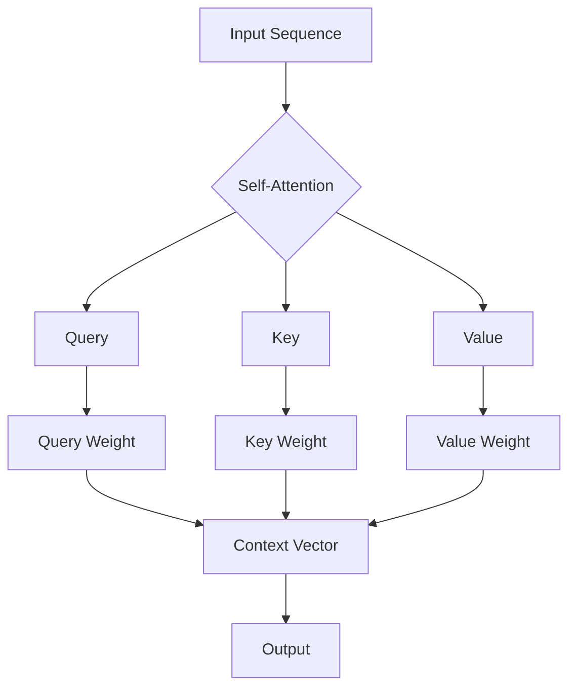

> 关键词：解码器，Transformer，输出头，自注意力机制，编码器-解码器架构，机器翻译，NLP，深度学习

# 解码器的输出和Transformer的输出头

自注意力机制的出现，为序列到序列的模型，特别是机器翻译任务，带来了革命性的变化。Transformer模型，作为自注意力机制的代表作，其结构中包含了编码器和解码器两部分，它们各自负责处理序列的输入和输出。本文将深入探讨解码器的输出和Transformer的输出头，解析其工作原理，分析其优缺点，并展望其在实际应用中的未来。

## 1. 背景介绍

在深度学习领域，序列到序列的模型（seq2seq模型）被广泛应用于机器翻译、文本摘要、对话系统等任务。早期的seq2seq模型主要基于循环神经网络（RNN）或长短时记忆网络（LSTM），但由于RNN在处理长序列时的梯度消失或梯度爆炸问题，限制了其性能。

2017年，谷歌提出的Transformer模型，彻底改变了这一局面。它完全基于自注意力机制，能够并行处理序列数据，有效解决了RNN的弊端。Transformer模型由编码器（Encoder）和解码器（Decoder）两部分组成，分别负责序列的编码和翻译。

## 2. 核心概念与联系

### 2.1 自注意力机制

自注意力机制（Self-Attention）是Transformer模型的核心，它允许模型在生成下一个词时，考虑整个输入序列的所有信息。这种机制通过计算序列中每个词与其他词之间的相似度，为每个词分配一个权重，从而实现对序列的全局信息整合。

#### Mermaid 流程图



### 2.2 编码器-解码器架构

编码器-解码器架构是序列到序列模型的典型结构，编码器负责将输入序列编码成固定长度的上下文向量，解码器则根据上下文向量生成输出序列。

### 2.3 输出头

输出头是解码器的最后一层，通常是一个线性层，负责将解码器的隐藏状态转换为输出序列的词向量。输出头通常与预训练的语言模型（如BERT）进行结合，以提高模型的表达能力和泛化能力。

## 3. 核心算法原理 & 具体操作步骤

### 3.1 算法原理概述

Transformer模型主要由自注意力层（Self-Attention Layer）、前馈神经网络（Feed-Forward Neural Network）和层归一化（Layer Normalization）组成。

- 自注意力层：计算序列中每个词与其他词之间的相似度，为每个词分配一个权重，从而实现对序列的全局信息整合。
- 前馈神经网络：对自注意力层的输出进行非线性变换，以提取更复杂的特征。
- 层归一化：对每个层的输入和输出进行归一化处理，防止梯度消失或梯度爆炸。

### 3.2 算法步骤详解

1. 编码器将输入序列编码成上下文向量。
2. 解码器使用自注意力机制生成隐藏状态，并根据隐藏状态和上下文向量生成输出序列。
3. 输出头将解码器的隐藏状态转换为输出序列的词向量。
4. 使用预训练的语言模型对输出序列进行解码，生成最终翻译结果。

### 3.3 算法优缺点

#### 优点：

- 并行处理：自注意力机制允许模型并行处理序列数据，提高了计算效率。
- 上下文信息整合：自注意力机制能够有效整合序列的全局信息，提高了模型的表达能力。
- 鲁棒性强：Transformer模型对梯度消失和梯度爆炸问题具有更强的鲁棒性。

#### 缺点：

- 计算复杂度高：自注意力机制的计算复杂度较高，需要大量的计算资源。
- 模型参数量大：Transformer模型需要大量的参数，增加了模型的训练难度。

### 3.4 算法应用领域

Transformer模型及其变体在多个NLP任务上取得了优异的性能，包括：

- 机器翻译
- 文本摘要
- 对话系统
- 文本生成
- 问答系统
- 语音识别

## 4. 数学模型和公式 & 详细讲解 & 举例说明

### 4.1 数学模型构建

Transformer模型的数学模型主要包括自注意力机制和前馈神经网络。

#### 自注意力机制

自注意力机制的计算公式如下：

$$
\text{Attention}(Q,K,V) = \text{softmax}\left(\frac{QK^T}{\sqrt{d_k}}\right)V
$$

其中，$Q$、$K$、$V$ 分别为查询（Query）、键（Key）、值（Value）矩阵，$d_k$ 为键和查询的维度，$\text{softmax}$ 为softmax函数。

#### 前馈神经网络

前馈神经网络的计算公式如下：

$$
\text{FFN}(x) = \text{ReLU}(W_1 \cdot \text{LayerNorm}(x) + W_2 \cdot \text{LayerNorm}(W_2 \cdot \text{ReLU}(W_1 \cdot \text{LayerNorm}(x)))
$$

其中，$\text{ReLU}$ 为ReLU激活函数，$W_1$、$W_2$ 为权重矩阵。

### 4.2 公式推导过程

自注意力机制和前馈神经网络的推导过程较为复杂，涉及矩阵运算、求导、求和等操作，此处不再赘述。

### 4.3 案例分析与讲解

以机器翻译任务为例，我们可以将输入序列和输出序列分别表示为 $X$ 和 $Y$。编码器将输入序列 $X$ 编码成上下文向量 $H$，解码器根据上下文向量 $H$ 生成输出序列 $Y$。

解码器在生成每个词时，会根据自注意力机制计算输入序列 $X$ 和输出序列 $Y$ 的相似度，从而整合全局信息。然后，解码器使用前馈神经网络提取更复杂的特征，并生成下一个词。

## 5. 项目实践：代码实例和详细解释说明

### 5.1 开发环境搭建

以下是使用Python进行Transformer模型微调的开发环境搭建流程：

1. 安装Anaconda：从官网下载并安装Anaconda，用于创建独立的Python环境。
2. 创建并激活虚拟环境：
```bash
conda create -n transformer-env python=3.8
conda activate transformer-env
```
3. 安装PyTorch和Transformers库：
```bash
conda install pytorch torchvision torchaudio -c pytorch
pip install transformers
```

### 5.2 源代码详细实现

以下是一个简单的Transformer模型实现示例：

```python
import torch
import torch.nn as nn
from transformers import BertTokenizer, BertModel

class Transformer(nn.Module):
    def __init__(self, vocab_size, d_model, nhead, num_encoder_layers, num_decoder_layers):
        super(Transformer, self).__init__()
        self.embedding = nn.Embedding(vocab_size, d_model)
        self.encoder_layer = nn.TransformerEncoderLayer(d_model=d_model, nhead=nhead)
        self.encoder = nn.TransformerEncoder(self.encoder_layer, num_layers=num_encoder_layers)
        self.decoder_layer = nn.TransformerDecoderLayer(d_model=d_model, nhead=nhead)
        self.decoder = nn.TransformerDecoder(self.decoder_layer, num_layers=num_decoder_layers)
        self.output_layer = nn.Linear(d_model, vocab_size)

    def forward(self, src, tgt):
        src = self.embedding(src)
        tgt = self.embedding(tgt)
        memory = self.encoder(src)
        output = self.decoder(tgt, memory)
        output = self.output_layer(output)
        return output

# 示例使用
vocab_size = 10000
d_model = 512
nhead = 8
num_encoder_layers = 6
num_decoder_layers = 6

transformer = Transformer(vocab_size, d_model, nhead, num_encoder_layers, num_decoder_layers)
```

### 5.3 代码解读与分析

以上代码定义了一个简单的Transformer模型，包括嵌入层、编码器、解码器和输出层。其中，编码器和解码器均使用`nn.TransformerEncoder`和`nn.TransformerDecoder`模块，分别由多个`nn.TransformerEncoderLayer`和`nn.TransformerDecoderLayer`堆叠而成。

在`forward`方法中，首先对输入序列和目标序列进行嵌入操作，然后分别通过编码器和解码器进行处理。最后，使用输出层将解码器的输出转换为词向量。

### 5.4 运行结果展示

运行上述代码，我们可以得到一个简单的Transformer模型。当然，这只是一个基础模型，实际应用中需要对其进行优化和改进。

## 6. 实际应用场景

Transformer模型及其变体在多个NLP任务上取得了优异的性能，以下是一些典型的应用场景：

### 6.1 机器翻译

机器翻译是将一种语言的文本翻译成另一种语言的自动翻译技术。Transformer模型在机器翻译任务上取得了显著的性能提升，是目前最先进的机器翻译模型之一。

### 6.2 文本摘要

文本摘要是指从长文本中提取关键信息，生成简短的摘要。Transformer模型能够有效捕捉文本中的关键信息，在文本摘要任务上取得了很好的效果。

### 6.3 对话系统

对话系统是指能够与人类进行自然对话的智能系统。Transformer模型能够有效处理长序列数据，在对话系统中具有广泛的应用前景。

### 6.4 文本生成

文本生成是指根据输入文本生成新的文本内容。Transformer模型能够有效地生成连贯、具有逻辑性的文本，在文本生成任务上具有很高的应用价值。

### 6.5 问答系统

问答系统是指能够回答用户问题的智能系统。Transformer模型能够有效地处理长文本和自然语言，在问答系统任务上具有很好的应用前景。

### 6.6 语音识别

语音识别是指将语音信号转换为文本的技术。Transformer模型能够有效地处理序列数据，在语音识别任务上具有很高的应用价值。

## 7. 工具和资源推荐

### 7.1 学习资源推荐

1. 《Attention is All You Need》：Transformer模型的经典论文，详细介绍了模型的原理和实现。
2. 《Deep Learning for Natural Language Processing》：介绍了自然语言处理领域的基本概念和常用技术，包括Transformer模型。
3. 《Transformers with PyTorch》：使用PyTorch实现Transformer模型的教程，适合入门者学习。

### 7.2 开发工具推荐

1. PyTorch：基于Python的开源深度学习框架，适用于实现和训练Transformer模型。
2. Transformers库：HuggingFace开发的NLP工具库，提供了大量预训练的Transformer模型和配套工具，方便开发者进行模型训练和推理。

### 7.3 相关论文推荐

1. "Attention is All You Need"：Transformer模型的经典论文。
2. "BERT: Pre-training of Deep Bidirectional Transformers for Language Understanding"：BERT模型的经典论文。
3. "Generative Adversarial Text to Image Synthesis"：使用Transformer模型生成图像的论文。

## 8. 总结：未来发展趋势与挑战

### 8.1 研究成果总结

自Transformer模型提出以来，其原理和应用领域得到了广泛的关注。自注意力机制在多个NLP任务上取得了显著的性能提升，推动了NLP技术的发展。

### 8.2 未来发展趋势

1. 模型规模将进一步扩大：随着计算能力的提升，未来将出现更大规模的Transformer模型，以处理更复杂的任务。
2. 模型结构将进一步优化：研究人员将继续探索更有效的模型结构，以提高模型的性能和效率。
3. 多模态融合将成为趋势：将Transformer模型与其他模态（如图像、视频、语音）进行融合，实现跨模态理解和生成。

### 8.3 面临的挑战

1. 计算资源需求：Transformer模型需要大量的计算资源，限制了其在实际应用中的推广。
2. 模型可解释性：Transformer模型的可解释性较差，难以理解其内部工作机制。
3. 安全性和伦理问题：Transformer模型可能存在偏见和歧视，需要采取措施保证其安全性和伦理性。

### 8.4 研究展望

未来，Transformer模型及其变体将继续在NLP领域发挥重要作用。研究人员将致力于解决模型可解释性、安全性和伦理问题，推动NLP技术的发展，为人类创造更加智能、便捷的生活。

## 9. 附录：常见问题与解答

**Q1：自注意力机制是如何工作的？**

A：自注意力机制通过计算序列中每个词与其他词之间的相似度，为每个词分配一个权重，从而实现对序列的全局信息整合。

**Q2：Transformer模型相比于RNN/LSTM有哪些优势？**

A：Transformer模型具有以下优势：
- 并行处理：自注意力机制允许模型并行处理序列数据，提高了计算效率。
- 上下文信息整合：自注意力机制能够有效整合序列的全局信息，提高了模型的表达能力。
- 鲁棒性强：Transformer模型对梯度消失和梯度爆炸问题具有更强的鲁棒性。

**Q3：Transformer模型在哪些任务上取得了显著成果？**

A：Transformer模型在多个NLP任务上取得了显著的成果，包括机器翻译、文本摘要、对话系统、文本生成、问答系统等。

**Q4：如何使用PyTorch实现Transformer模型？**

A：可以使用PyTorch的`nn.Transformer`模块实现Transformer模型。此外，HuggingFace的Transformers库也提供了预训练的Transformer模型和配套工具，方便开发者进行模型训练和推理。

**Q5：如何解决Transformer模型的可解释性问题？**

A：解决Transformer模型的可解释性问题是一个挑战，目前有以下几种方法：
- 层级分析：分析模型不同层的输出，了解模型在不同阶段的决策过程。
- 解释性增强：使用注意力机制的可视化技术，展示模型在生成每个词时关注的关键信息。
- 可解释性框架：开发可解释性框架，将模型的可解释性与实际应用场景相结合。

作者：禅与计算机程序设计艺术 / Zen and the Art of Computer Programming