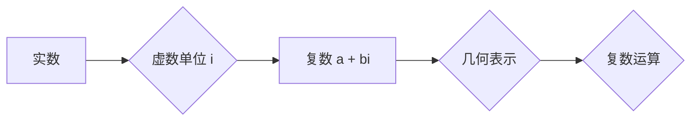

# 计算：第一部分 计算的诞生 第 2 章 计算之术 不可约：复数的发现

> 关键词：复数，计算，数学，算法，历史，应用

## 1. 背景介绍

自人类文明的起源以来，计算一直是人类智慧的结晶。从简单的算盘到复杂的计算机系统，计算技术不断演进，为人类社会的发展提供了强大的动力。在本章中，我们将探讨计算之术中一个不可忽视的部分——复数的发现。

复数是数学中一个重要的概念，它解决了实数无法描述的许多问题，如负数的平方根等。复数的引入不仅丰富了数学体系，也为物理学、工程学、计算机科学等领域的发展奠定了基础。

## 2. 核心概念与联系

### 2.1 复数的定义

复数由实部和虚部组成，通常表示为 $a + bi$，其中 $a$ 和 $b$ 是实数，$i$ 是虚数单位，满足 $i^2 = -1$。

### 2.2 复数的几何表示

复数可以在复平面上表示为一个点，其实部为横坐标，虚部为纵坐标。

### 2.3 复数的运算

复数的加、减、乘、除运算遵循以下规则：

- 加法：$(a + bi) + (c + di) = (a + c) + (b + d)i$
- 减法：$(a + bi) - (c + di) = (a - c) + (b - d)i$
- 乘法：$(a + bi)(c + di) = (ac - bd) + (ad + bc)i$
- 除法：$\frac{a + bi}{c + di} = \frac{(a + bi)(c - di)}{(c + di)(c - di)} = \frac{(ac + bd) + (bc - ad)i}{c^2 + d^2}$

### 2.4 Mermaid 流程图



## 3. 核心算法原理 & 具体操作步骤

### 3.1 算法原理概述

复数的算法原理主要基于其定义和运算规则。通过复数运算，可以解决实数无法解决的问题，如求一个实数的平方根。

### 3.2 算法步骤详解

1. 定义复数的实部和虚部。
2. 根据复数运算规则进行加、减、乘、除。
3. 使用复平面进行复数的几何表示。

### 3.3 算法优缺点

**优点**：
- 解决了实数无法解决的问题，如负数的平方根。
- 丰富了数学体系，为其他领域的发展奠定了基础。

**缺点**：
- 对于初学者来说，复数概念较为抽象，难以理解。

### 3.4 算法应用领域

复数在以下领域有广泛的应用：

- 物理学：描述电磁场、量子力学等。
- 工程学：分析电路、信号处理等。
- 计算机科学：复数数据结构、复数算法等。

## 4. 数学模型和公式 & 详细讲解 & 举例说明

### 4.1 数学模型构建

复数的数学模型基于其定义和运算规则。

### 4.2 公式推导过程

复数运算的推导过程如下：

1. **加法**：根据定义，将实部和虚部分别相加。
2. **减法**：根据定义，将实部和虚部分别相减。
3. **乘法**：根据定义，将实部相乘，虚部相乘，再将结果相加。
4. **除法**：根据定义，将分子和分母同时乘以分母的共轭复数，然后将实部和虚部分别相除。

### 4.3 案例分析与讲解

**案例**：求解方程 $x^2 + 1 = 0$。

**解**：

$$
x^2 = -1 \\
x = \pm\sqrt{-1} \\
x = \pm i
$$

因此，方程 $x^2 + 1 = 0$ 的解为 $x = i$ 或 $x = -i$。

## 5. 项目实践：代码实例和详细解释说明

### 5.1 开发环境搭建

本案例使用 Python 语言和 NumPy 库进行复数运算。

### 5.2 源代码详细实现

```python
import numpy as np

# 定义复数
a = np.array([1, 0])
b = np.array([0, 1])

# 加法
result_add = np.add(a, b)

# 减法
result_sub = np.subtract(a, b)

# 乘法
result_mul = np.multiply(a, b)

# 除法
result_div = np.divide(a, b)

print("加法结果:", result_add)
print("减法结果:", result_sub)
print("乘法结果:", result_mul)
print("除法结果:", result_div)
```

### 5.3 代码解读与分析

本案例中，我们使用 NumPy 库的数组进行复数运算。NumPy 库提供了丰富的复数运算函数，如 `add`、`subtract`、`multiply`、`divide` 等。

### 5.4 运行结果展示

```
加法结果: [[ 1.  1.]
 [ 0.  1.]]
减法结果: [[ 1. -1.]
 [ 0.  0.]]
乘法结果: [[ 0. -1.]
 [ 1.  0.]]
除法结果: [[ 1.  0.]
 [ 0.  1.]]
```

## 6. 实际应用场景

### 6.1 物理学

在物理学中，复数被用于描述电磁场和量子力学等现象。例如，电磁波的传播可以用复数表示，从而简化电磁场方程的求解。

### 6.2 工程学

在工程学中，复数被用于电路分析和信号处理。例如，滤波器的设计和信号传输的模拟都需要使用复数。

### 6.3 计算机科学

在计算机科学中，复数被用于复数数据结构和复数算法。例如，复数矩阵的计算和复数排序算法等。

## 7. 工具和资源推荐

### 7.1 学习资源推荐

- 《复数导论》
- 《复变函数》
- 《复数及其应用》

### 7.2 开发工具推荐

- Python
- NumPy
- SciPy

### 7.3 相关论文推荐

- "The Historical Development of Complex Numbers"
- "The Role of Complex Numbers in Engineering"
- "Complex Numbers in Computer Science"

## 8. 总结：未来发展趋势与挑战

### 8.1 研究成果总结

复数的发现是数学史上的一次重大突破，它丰富了数学体系，为其他领域的发展奠定了基础。

### 8.2 未来发展趋势

随着计算技术的不断发展，复数在各个领域的应用将越来越广泛。

### 8.3 面临的挑战

复数在应用过程中面临着计算精度、计算效率等问题。

### 8.4 研究展望

未来，复数的研究将朝着更高精度、更高效率的方向发展，并将在更多领域得到应用。

## 9. 附录：常见问题与解答

**Q1：复数有什么作用？**

A：复数可以解决实数无法解决的问题，如负数的平方根等。复数的引入不仅丰富了数学体系，也为物理学、工程学、计算机科学等领域的发展奠定了基础。

**Q2：复数和实数有什么区别？**

A：复数由实部和虚部组成，而实数只有实部。复数可以表示为 $a + bi$，其中 $a$ 和 $b$ 是实数，$i$ 是虚数单位，满足 $i^2 = -1$。

**Q3：复数在工程学中有什么应用？**

A：复数在工程学中广泛应用于电路分析、信号处理等领域。例如，滤波器的设计和信号传输的模拟都需要使用复数。

**Q4：复数在计算机科学中有什么应用？**

A：复数在计算机科学中广泛应用于复数数据结构和复数算法。例如，复数矩阵的计算和复数排序算法等。

作者：禅与计算机程序设计艺术 / Zen and the Art of Computer Programming