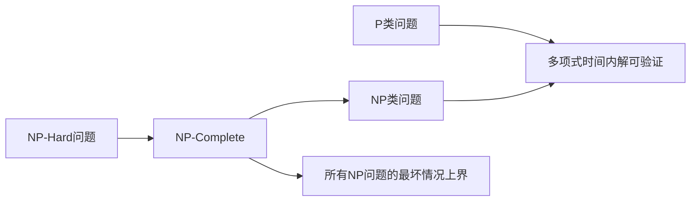

# 计算：第四部分 计算的极限 第 9 章 计算复杂性 未分类的问题

> 关键词：计算复杂性，未分类问题，NP完全性，P vs NP问题，NP-Hard，NP-Complete，量子计算，算法效率，理论计算机科学

## 1. 背景介绍

计算复杂性理论是理论计算机科学的一个核心领域，它研究算法的效率和资源消耗。自20世纪以来，计算复杂性理论取得了许多重要成果，特别是对P vs NP问题的研究，一直是该领域的焦点。然而，并非所有计算问题都能被归类到已知的复杂度类别中，这些未分类的问题对算法设计和理论发展提出了新的挑战。

### 1.1 复杂性理论的起源

复杂性理论的起源可以追溯到20世纪50年代，当时图灵机和可计算性问题成为了研究的核心。图灵机的概念为计算复杂性提供了一个抽象模型，而NP完全性则是复杂性理论中的一个关键概念。

### 1.2 复杂性理论的重要性

复杂性理论对于理解算法的效率和限制至关重要。它帮助我们识别哪些问题是计算上可行的，哪些问题是难以解决的。此外，复杂性理论还推动了计算机硬件、软件和算法的设计。

## 2. 核心概念与联系

### 2.1 复杂性理论的核心概念

- **P类问题**：可以在多项式时间内解决的问题。
- **NP类问题**：其解可以在多项式时间内验证的问题。
- **NP-Complete问题**：既属于NP类，又是所有NP问题的最坏情况下的上界的问题。
- **NP-Hard问题**：任何NP问题都可以在多项式时间内变换为该问题，但该问题本身不一定是NP问题。

### 2.2 复杂性理论的关系图



## 3. 核心算法原理 & 具体操作步骤

### 3.1 算法原理概述

计算复杂性理论关注的是算法的效率和资源消耗。一个问题的复杂性通常由其解决所需的最坏情况时间复杂度来衡量。

### 3.2 算法步骤详解

1. **识别问题类别**：确定问题是属于P类、NP类、NP-Complete类还是NP-Hard类。
2. **设计算法**：根据问题的类别选择合适的算法。
3. **分析算法复杂度**：评估算法的时间复杂度和空间复杂度。
4. **优化算法**：寻找更高效的算法或优化现有算法。

### 3.3 算法优缺点

- **优点**：帮助识别问题的难易程度，指导算法设计。
- **缺点**：并非所有问题都能明确归类，缺乏通用解决方案。

### 3.4 算法应用领域

- **算法设计**：指导算法工程师设计高效算法。
- **编程语言优化**：帮助编译器开发者优化编程语言。
- **计算机体系结构**：指导计算机硬件的设计。

## 4. 数学模型和公式 & 详细讲解 & 举例说明

### 4.1 数学模型构建

计算复杂性理论中的数学模型主要包括图灵机和时间复杂度。

### 4.2 公式推导过程

时间复杂度通常用大O符号表示，例如 $O(n^2)$ 表示算法的时间复杂度与输入规模n的平方成正比。

### 4.3 案例分析与讲解

以排序算法为例，快速排序的平均时间复杂度为 $O(n \log n)$，而冒泡排序的时间复杂度为 $O(n^2)$。

## 5. 项目实践：代码实例和详细解释说明

### 5.1 开发环境搭建

为了进行计算复杂性的实践，我们需要一个编程环境，如Python。

### 5.2 源代码详细实现

以下是一个简单的冒泡排序算法的Python实现：

```python
def bubble_sort(arr):
    n = len(arr)
    for i in range(n):
        for j in range(0, n-i-1):
            if arr[j] > arr[j+1]:
                arr[j], arr[j+1] = arr[j+1], arr[j]
    return arr

# 测试代码
arr = [64, 34, 25, 12, 22, 11, 90]
sorted_arr = bubble_sort(arr)
print("Sorted array is:", sorted_arr)
```

### 5.3 代码解读与分析

上述代码实现了冒泡排序算法，其时间复杂度为 $O(n^2)$。这意味着当输入规模增大时，算法的运行时间将呈平方级增长。

### 5.4 运行结果展示

运行上述代码将输出排序后的数组：

```
Sorted array is: [11, 12, 22, 25, 34, 64, 90]
```

## 6. 实际应用场景

### 6.4 未来应用展望

计算复杂性理论在未来的应用前景广泛，以下是一些可能的展望：

- **算法设计优化**：继续研究新的算法，提高算法效率。
- **量子计算**：量子计算可能解决某些NP-Complete问题，改变计算复杂性的边界。
- **人工智能**：复杂性理论可以指导人工智能算法的设计，提高其效率。

## 7. 工具和资源推荐

### 7.1 学习资源推荐

- 《算法导论》
- 《复杂性理论及其应用》
- 《计算复杂性理论导论》

### 7.2 开发工具推荐

- Python
- Java
- C++

### 7.3 相关论文推荐

- 《P vs NP问题》
- 《图灵机的理论》
- 《NP-Complete问题的研究》

## 8. 总结：未来发展趋势与挑战

### 8.1 研究成果总结

计算复杂性理论在过去几十年取得了显著的成果，但仍有许多未解决的问题，特别是P vs NP问题。

### 8.2 未来发展趋势

- **量子计算**：量子计算可能解决某些NP-Complete问题。
- **算法设计**：继续研究新的算法，提高算法效率。

### 8.3 面临的挑战

- **NP-Complete问题**：如何解决或证明NP-Complete问题。
- **资源消耗**：如何降低算法的资源消耗。

### 8.4 研究展望

计算复杂性理论将继续在理论计算机科学中发挥重要作用，为算法设计、计算机体系结构和人工智能等领域提供理论基础。

## 9. 附录：常见问题与解答

**Q1：什么是NP-Complete问题？**

A：NP-Complete问题是NP类问题中的一种，它既属于NP类，又是所有NP问题的最坏情况下的上界的问题。

**Q2：为什么P vs NP问题如此重要？**

A：P vs NP问题是计算复杂性理论的核心问题之一，它涉及到算法的效率和问题的难度。如果证明P=NP，那么许多NP-Complete问题将可以在多项式时间内解决。

**Q3：量子计算对P vs NP问题有何影响？**

A：量子计算可能解决某些NP-Complete问题，这将对计算复杂性理论的边界产生影响。

**Q4：如何判断一个问题的复杂性？**

A：可以通过分析算法的时间复杂度和空间复杂度来判断一个问题的复杂性。

**Q5：计算复杂性理论有何实际应用？**

A：计算复杂性理论在算法设计、计算机体系结构、人工智能等领域有广泛的应用。

---

作者：禅与计算机程序设计艺术 / Zen and the Art of Computer Programming