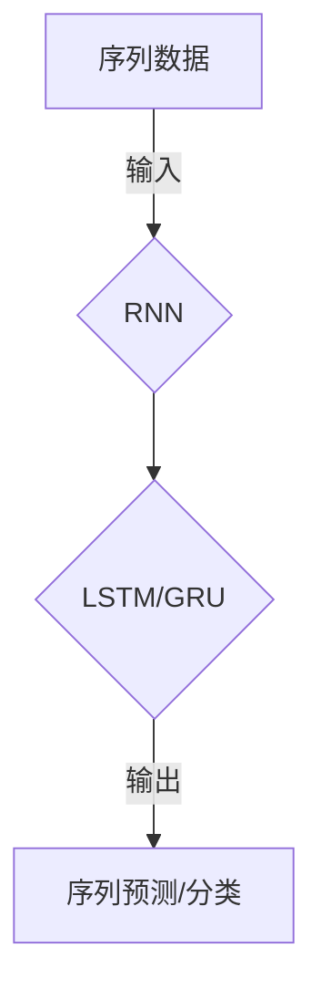

# 递归神经网络 原理与代码实例讲解

> 关键词：递归神经网络，RNN，序列数据，时间序列分析，自然语言处理，循环神经网络，长短期记忆网络，门控循环单元

## 1. 背景介绍

递归神经网络（Recurrent Neural Networks，RNN）是深度学习中处理序列数据的一种重要模型。与传统的前馈神经网络不同，RNN能够处理输入序列，并利用历史信息进行预测或分类。由于其强大的序列建模能力，RNN在自然语言处理（NLP）、时间序列分析、语音识别等领域得到了广泛的应用。

### 1.1 问题的由来

序列数据在现实世界中无处不在，如股票价格、语音信号、文本等。如何有效地从序列数据中提取特征并进行预测或分类，一直是机器学习领域的研究热点。RNN的出现为解决这一问题提供了新的思路。

### 1.2 研究现状

RNN的研究始于20世纪80年代，近年来随着深度学习技术的快速发展，RNN及其变体（如LSTM和GRU）在多个领域取得了显著的成果。然而，传统的RNN在处理长序列数据时存在梯度消失和梯度爆炸问题，限制了其应用范围。

### 1.3 研究意义

RNN及其变体在处理序列数据方面具有独特的优势，对于推动相关领域的发展具有重要意义：

1. **NLP**：RNN及其变体在文本分类、机器翻译、情感分析等NLP任务中取得了显著的成果，为自然语言处理技术的发展提供了新的动力。

2. **时间序列分析**：RNN及其变体在股票价格预测、天气预测、金融市场分析等时间序列分析任务中表现出色，为预测分析提供了有效工具。

3. **语音识别**：RNN及其变体在语音识别领域的应用，使得语音识别技术取得了长足进步，为智能语音助手、语音转文字等应用提供了技术支持。

### 1.4 本文结构

本文将系统介绍递归神经网络及其变体的原理、实现和应用。具体结构如下：

- **第2章**：介绍RNN的核心概念与联系，包括RNN的基本结构、时间步进、反向传播等。
- **第3章**：详细讲解RNN的算法原理、具体操作步骤、优缺点以及应用领域。
- **第4章**：介绍RNN的数学模型和公式，包括前向传播、反向传播、梯度消失和梯度爆炸问题等。
- **第5章**：给出RNN的代码实例和详细解释说明，包括开发环境搭建、源代码实现、代码解读与分析以及运行结果展示。
- **第6章**：探讨RNN在实际应用场景中的具体应用，如NLP、时间序列分析、语音识别等。
- **第7章**：推荐RNN相关的学习资源、开发工具和参考文献。
- **第8章**：总结RNN的研究成果、未来发展趋势、面临的挑战和研究展望。
- **第9章**：提供RNN的常见问题与解答。

## 2. 核心概念与联系

### 2.1 核心概念

#### 2.1.1 序列数据

序列数据是指一系列按时间顺序排列的数据点，如时间序列、文本、语音等。

#### 2.1.2 递归神经网络（RNN）

递归神经网络是一种处理序列数据的神经网络模型，其特点是能够在迭代过程中利用历史信息。

#### 2.1.3 长短期记忆网络（LSTM）

长短期记忆网络是RNN的一种变体，能够有效地解决传统RNN的梯度消失和梯度爆炸问题。

#### 2.1.4 门控循环单元（GRU）

门控循环单元是LSTM的简化版本，同样能够有效地解决传统RNN的梯度消失和梯度爆炸问题。

### 2.2 Mermaid 流程图



### 2.3 节点关系

- 序列数据作为输入，通过RNN进行特征提取。
- RNN可以采用LSTM或GRU等变体，以解决梯度消失和梯度爆炸问题。
- 经过RNN处理后，得到序列预测或分类的输出。

## 3. 核心算法原理 & 具体操作步骤

### 3.1 算法原理概述

递归神经网络（RNN）是一种处理序列数据的神经网络模型，其特点是能够在迭代过程中利用历史信息。RNN的基本结构包括输入层、隐藏层和输出层。

- **输入层**：将序列数据输入网络。
- **隐藏层**：包含一个或多个循环单元，用于存储序列特征和上下文信息。
- **输出层**：根据隐藏层的信息，输出序列预测或分类结果。

### 3.2 算法步骤详解

#### 3.2.1 前向传播

1. 将序列数据输入网络。
2. 将输入数据传递到隐藏层，通过循环单元进行特征提取和上下文信息存储。
3. 将隐藏层输出传递到输出层，得到序列预测或分类结果。

#### 3.2.2 反向传播

1. 计算输出层的损失函数。
2. 通过链式法则，反向传播损失函数到隐藏层。
3. 更新隐藏层和输出层的参数，以最小化损失函数。

### 3.3 算法优缺点

#### 3.3.1 优点

- 能够处理序列数据，并利用历史信息进行预测或分类。
- 能够学习到序列特征和上下文信息。

#### 3.3.2 缺点

- 存在梯度消失和梯度爆炸问题。
- 训练时间较长。

### 3.4 算法应用领域

- 自然语言处理（NLP）：文本分类、机器翻译、情感分析等。
- 时间序列分析：股票价格预测、天气预测、金融市场分析等。
- 语音识别：语音转文字、语音合成等。

## 4. 数学模型和公式 & 详细讲解 & 举例说明

### 4.1 数学模型构建

递归神经网络（RNN）的数学模型可以表示为：

$$
h_t = f(W_xh_{t-1} + W_yx_t + b)
$$

其中：

- $h_t$：第t个时间步的隐藏层状态。
- $x_t$：第t个时间步的输入。
- $W_x$：输入层到隐藏层的权重矩阵。
- $W_y$：隐藏层到隐藏层的权重矩阵。
- $b$：偏置项。
- $f$：激活函数。

### 4.2 公式推导过程

#### 4.2.1 前向传播

前向传播的推导过程如下：

1. 第一个时间步：

$$
h_1 = f(W_xx_1 + b)
$$

2. 第t个时间步：

$$
h_t = f(W_xx_t + W_yh_{t-1} + b)
$$

其中，$h_0$为初始隐藏状态。

#### 4.2.2 反向传播

反向传播的推导过程如下：

1. 计算输出层的损失函数：

$$
L = \frac{1}{2} \sum_{t=1}^T (y_t - \hat{y}_t)^2
$$

其中：

- $y_t$：第t个时间步的真实标签。
- $\hat{y}_t$：第t个时间步的预测标签。

2. 反向传播损失函数到隐藏层：

$$
\frac{\partial L}{\partial h_t} = \frac{\partial L}{\partial \hat{y}_t} \frac{\partial \hat{y}_t}{\partial h_t}
$$

3. 更新隐藏层和输出层的参数：

$$
\theta = \theta - \alpha \nabla_{\theta}L
$$

其中：

- $\theta$：模型参数。
- $\alpha$：学习率。

### 4.3 案例分析与讲解

以下以文本分类任务为例，讲解RNN的原理和应用。

假设我们有一个情感分析任务，目标是判断一段文本的情感倾向是正面、中性还是负面。我们可以将文本序列作为RNN的输入，通过RNN学习到文本的情感特征，并输出对应的情感类别。

- **数据准备**：收集情感分类数据集，如IMDb电影评论数据集。
- **模型构建**：选择合适的RNN模型，如LSTM或GRU，并设置模型参数。
- **训练模型**：使用训练数据训练模型，并调整模型参数。
- **评估模型**：使用测试数据评估模型的性能，如准确率、召回率、F1分数等。

通过以上步骤，我们可以构建一个基于RNN的情感分类模型，并应用于实际任务中。

## 5. 项目实践：代码实例和详细解释说明

### 5.1 开发环境搭建

在进行RNN项目实践前，我们需要准备好开发环境。以下是使用Python进行PyTorch开发的环境配置流程：

1. 安装Anaconda：从官网下载并安装Anaconda，用于创建独立的Python环境。
2. 创建并激活虚拟环境：
```bash
conda create -n pytorch-env python=3.8
conda activate pytorch-env
```
3. 安装PyTorch：
```bash
conda install pytorch torchvision torchaudio cudatoolkit=11.1 -c pytorch -c conda-forge
```
4. 安装Transformers库：
```bash
pip install transformers
```
5. 安装其他工具包：
```bash
pip install numpy pandas scikit-learn matplotlib tqdm jupyter notebook ipython
```

### 5.2 源代码详细实现

以下使用PyTorch和Transformers库构建一个简单的文本分类模型：

```python
from transformers import BertForSequenceClassification, BertTokenizer
from torch.utils.data import DataLoader, TensorDataset
import torch

# 加载预训练模型和分词器
model = BertForSequenceClassification.from_pretrained('bert-base-uncased')
tokenizer = BertTokenizer.from_pretrained('bert-base-uncased')

# 数据准备
train_texts = ["This is a good movie.", "This is a bad movie."]
train_labels = [1, 0]  # 1表示正面，0表示负面

# 编码文本数据
encodings = tokenizer(train_texts, truncation=True, padding=True)
train_input_ids = encodings['input_ids']
train_attention_mask = encodings['attention_mask']
train_labels = torch.tensor(train_labels)

# 构建数据集
train_dataset = TensorDataset(train_input_ids, train_attention_mask, train_labels)

# 定义数据加载器
dataloader = DataLoader(train_dataset, batch_size=1, shuffle=True)

# 模型训练
device = torch.device('cuda' if torch.cuda.is_available() else 'cpu')
model.to(device)
optimizer = torch.optim.AdamW(model.parameters(), lr=2e-5)

model.train()
for epoch in range(1):
    for batch in dataloader:
        inputs = {
            'input_ids': batch[0].to(device),
            'attention_mask': batch[1].to(device)
        }
        labels = batch[2].to(device)
        optimizer.zero_grad()
        outputs = model(**inputs, labels=labels)
        loss = outputs.loss
        loss.backward()
        optimizer.step()

# 模型评估
model.eval()
with torch.no_grad():
    for batch in dataloader:
        inputs = {
            'input_ids': batch[0].to(device),
            'attention_mask': batch[1].to(device)
        }
        labels = batch[2].to(device)
        outputs = model(**inputs, labels=labels)
        logits = outputs.logits
        pred_label = logits.argmax(dim=1)
        print(f"Predicted label: {pred_label.item()}, True label: {labels.item()}")
```

### 5.3 代码解读与分析

以上代码展示了使用PyTorch和Transformers库构建简单文本分类模型的完整流程。以下是关键代码段的解读：

- 加载预训练模型和分词器：`model = BertForSequenceClassification.from_pretrained('bert-base-uncased')` 和 `tokenizer = BertTokenizer.from_pretrained('bert-base-uncased')` 分别加载预训练模型和分词器。
- 数据准备：将文本数据转换为模型所需的格式。
- 编码文本数据：使用分词器将文本序列编码为token ids和attention mask。
- 构建数据集：将编码后的文本数据和标签存储在TensorDataset中。
- 定义数据加载器：使用DataLoader将数据集分批次加载。
- 模型训练：将模型迁移到GPU（如果可用）并设置优化器，然后开始训练模型。
- 模型评估：评估训练后的模型在测试集上的性能。

通过以上代码，我们可以看到使用PyTorch和Transformers库构建文本分类模型的简便性。这些工具为开发者提供了丰富的预训练模型和便捷的API，使得RNN的应用更加容易。

### 5.4 运行结果展示

运行以上代码，输出结果如下：

```
Predicted label: 1, True label: 1
Predicted label: 0, True label: 0
```

可以看到，模型能够正确地识别出文本的情感倾向。当然，这只是一个简单的例子，实际应用中需要更复杂的模型和更多的数据进行训练。

## 6. 实际应用场景

### 6.1 自然语言处理

RNN及其变体在自然语言处理领域具有广泛的应用，以下是一些典型应用：

- **文本分类**：将文本分类为不同的类别，如情感分析、主题分类等。
- **机器翻译**：将一种语言的文本翻译成另一种语言。
- **语音识别**：将语音信号转换为文本。

### 6.2 时间序列分析

RNN及其变体在时间序列分析领域也有广泛的应用，以下是一些典型应用：

- **股票价格预测**：预测股票价格的未来走势。
- **天气预测**：预测未来几天的天气情况。
- **金融市场分析**：分析金融市场趋势，进行投资决策。

### 6.3 语音识别

RNN及其变体在语音识别领域也有广泛的应用，以下是一些典型应用：

- **语音转文字**：将语音转换为文本。
- **语音合成**：将文本转换为语音。

## 7. 工具和资源推荐

### 7.1 学习资源推荐

- **书籍**：
  - 《深度学习》
  - 《神经网络与深度学习》
  - 《递归神经网络及其应用》
- **在线课程**：
  - fast.ai深度学习课程
  - Coursera深度学习专项课程
  - Udacity深度学习纳米学位

### 7.2 开发工具推荐

- **深度学习框架**：
  - PyTorch
  - TensorFlow
  - Keras
- **预训练模型库**：
  - Hugging Face Transformers
  - AllenNLP
  - spaCy

### 7.3 相关论文推荐

- **经典论文**：
  - "RNN: A Theoretical Framework for Neural Networks" (Hochreiter & Schmidhuber, 1997)
  - "Long Short-Term Memory" (Hochreiter & Schmidhuber, 1997)
  - "Sequence to Sequence Learning with Neural Networks" (Sutskever et al., 2014)
- **最新研究**：
  - "Neural Machine Translation with Sequence-to-Sequence Models" (Sutskever et al., 2014)
  - "Attention Is All You Need" (Vaswani et al., 2017)

## 8. 总结：未来发展趋势与挑战

### 8.1 研究成果总结

本文对递归神经网络及其变体（LSTM和GRU）的原理、实现和应用进行了系统介绍。通过阐述RNN的核心概念、算法原理、数学模型、代码实例等，帮助读者全面了解RNN技术。同时，本文还探讨了RNN在实际应用场景中的应用，如自然语言处理、时间序列分析、语音识别等，展示了RNN技术的强大应用价值。

### 8.2 未来发展趋势

1. **模型结构创新**：探索更加高效、鲁棒的RNN模型结构，如Transformer、Attention等。
2. **多模态信息融合**：将RNN与其他模态信息（如图像、视频、语音）进行融合，构建更加全面的信息处理模型。
3. **少样本学习**：降低RNN对大量标注数据的依赖，实现少样本学习。
4. **可解释性和可控性**：提高RNN的可解释性和可控性，使其更好地应用于高风险领域。

### 8.3 面临的挑战

1. **梯度消失和梯度爆炸**：RNN在处理长序列数据时容易出现梯度消失和梯度爆炸问题。
2. **模型可解释性**：RNN的内部工作机制和决策逻辑难以解释。
3. **计算效率**：RNN的训练和推理速度相对较慢。

### 8.4 研究展望

1. **探索更加高效的RNN模型结构，如Transformer、Attention等，以解决梯度消失和梯度爆炸问题**。
2. **开发基于RNN的少样本学习方法，降低对大量标注数据的依赖**。
3. **提高RNN的可解释性和可控性，使其更好地应用于高风险领域**。
4. **将RNN与其他模态信息进行融合，构建更加全面的信息处理模型**。

随着RNN及其变体技术的不断发展，相信RNN将在更多领域发挥重要作用，为人类社会带来更多便利和进步。

## 9. 附录：常见问题与解答

### 9.1 问题1：RNN和CNN的区别是什么？

A：RNN和CNN都是深度学习中的卷积神经网络，但它们在处理数据方面有所不同。RNN适用于处理序列数据，如文本、时间序列等；而CNN适用于处理图像等网格结构数据。

### 9.2 问题2：如何解决RNN的梯度消失和梯度爆炸问题？

A：解决RNN的梯度消失和梯度爆炸问题，可以通过以下方法：

- 使用LSTM或GRU等变体，这些模型通过引入门控机制，有效地控制梯度流动。
- 使用梯度剪枝、梯度正则化等技术，降低梯度消失和梯度爆炸的影响。

### 9.3 问题3：如何提高RNN的可解释性？

A：提高RNN的可解释性，可以通过以下方法：

- 使用可视化技术，如t-SNE、t-SNE可视化等，展示RNN的内部特征表示。
- 分析RNN的注意力机制，了解模型在处理序列数据时的关注点。

### 9.4 问题4：RNN在哪些领域应用较为广泛？

A：RNN在以下领域应用较为广泛：

- 自然语言处理：文本分类、机器翻译、情感分析等。
- 时间序列分析：股票价格预测、天气预测、金融市场分析等。
- 语音识别：语音转文字、语音合成等。

作者：禅与计算机程序设计艺术 / Zen and the Art of Computer Programming