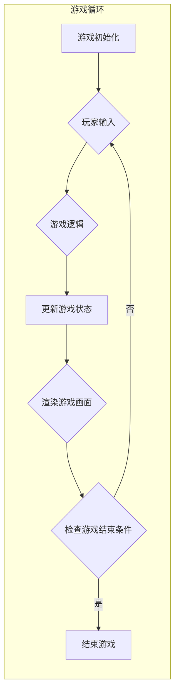

# 飞翔的小鸟的设计与实现

> 关键词：小鸟，游戏设计，Unity3D，物理引擎，人工智能，游戏开发，动画，Unity Shader，性能优化

## 1. 背景介绍

游戏开发行业是一个充满活力和创新的空间，其中经典的飞行游戏一直深受玩家喜爱。本文将详细介绍一款名为“飞翔的小鸟”的游戏设计与实现过程。这款游戏将结合Unity3D游戏引擎、物理引擎、人工智能以及高级图形技术，打造一个既富有挑战性又充满乐趣的游戏体验。

### 1.1 游戏创意来源

“飞翔的小鸟”这款游戏的创意灵感来源于经典的飞行游戏，如《愤怒的小鸟》和《Flappy Bird》。我们希望结合这些游戏的元素，创造出一种全新的游戏体验。游戏中的小鸟将具有独特的飞行模式和关卡设计，玩家需要控制小鸟躲避障碍物，收集金币，并尽可能飞得更远。

### 1.2 游戏目标

- 提供一个简单易上手的游戏体验。
- 设计丰富的关卡和挑战，提升游戏的可玩性。
- 利用Unity3D和物理引擎，实现逼真的物理效果。
- 引入人工智能技术，使游戏更具挑战性。
- 优化游戏性能，确保流畅运行。

## 2. 核心概念与联系

### 2.1 游戏架构

以下是一个使用Mermaid绘制的游戏架构流程图：



### 2.2 核心概念

- **物理引擎**：用于模拟游戏中的物理现象，如重力、碰撞等。
- **人工智能**：用于控制游戏中的非玩家角色（NPC），如障碍物和敌人。
- **动画**：用于实现小鸟的飞行和翻滚效果。
- **Unity Shader**：用于实现游戏中的视觉效果，如颜色、纹理、光照等。
- **性能优化**：确保游戏在低性能设备上也能流畅运行。

## 3. 核心算法原理 & 具体操作步骤

### 3.1 算法原理概述

游戏的核心算法主要包含以下几个方面：

- **物理引擎**：使用Unity3D内置的物理引擎来模拟小鸟的飞行和碰撞。
- **人工智能**：使用状态机控制NPC的行为，如随机生成障碍物、跟随小鸟等。
- **动画**：使用Unity3D动画系统实现小鸟的飞行和翻滚动画。
- **Unity Shader**：使用Shader语言实现游戏中的视觉效果。

### 3.2 算法步骤详解

#### 3.2.1 物理引擎

1. 创建小鸟和障碍物的物理体。
2. 设置物理体的碰撞检测和响应。
3. 根据玩家的输入和重力模拟小鸟的飞行。
4. 检测小鸟与障碍物的碰撞，并触发游戏结束。

#### 3.2.2 人工智能

1. 设计NPC的状态机，定义状态转换规则。
2. 根据游戏状态更新NPC的行为。
3. 实现NPC的生成和移动逻辑。

#### 3.2.3 动画

1. 创建小鸟的动画序列。
2. 将动画序列绑定到小鸟的模型上。
3. 根据游戏状态切换动画。

#### 3.2.4 Unity Shader

1. 创建自定义Shader，实现游戏中的视觉效果。
2. 将Shader应用于游戏中的模型和纹理。
3. 调整Shader参数，优化视觉效果。

### 3.3 算法优缺点

#### 3.3.1 优点

- **逼真的物理效果**：使用物理引擎模拟的游戏物理现象更加真实。
- **丰富的视觉效果**：使用Unity Shader实现的游戏视觉效果更加精美。
- **高度的可玩性**：人工智能和动画技术的应用，使游戏更具挑战性和趣味性。

#### 3.3.2 缺点

- **开发成本高**：需要一定的Unity3D和Shader开发经验。
- **性能消耗大**：复杂的物理效果和视觉效果可能会对性能造成影响。

### 3.4 算法应用领域

- **移动游戏**：适合开发手机和平板电脑上的休闲游戏。
- **PC游戏**：适合开发桌面电脑上的独立游戏。
- **VR游戏**：适合开发虚拟现实游戏，提升沉浸感。

## 4. 数学模型和公式 & 详细讲解 & 举例说明

### 4.1 数学模型构建

游戏中的数学模型主要涉及以下几个方面：

- **物理运动学**：描述小鸟和NPC的运动状态。
- **几何学**：描述游戏场景的几何形状和位置关系。
- **图像处理**：描述游戏画面中的颜色、纹理和光照等。

### 4.2 公式推导过程

#### 4.2.1 物理运动学

假设小鸟在水平方向上的速度为 $v_x$，垂直方向上的速度为 $v_y$，重力加速度为 $g$，时间步长为 $\Delta t$，则有：

$$
v_x = v_{x0} + a_x \Delta t
$$

$$
v_y = v_{y0} - g \Delta t
$$

其中 $a_x$ 为水平方向上的加速度。

#### 4.2.2 几何学

假设小鸟在场景中的位置为 $(x,y)$，障碍物的位置为 $(x_0,y_0)$，则有：

$$
d = \sqrt{(x-x_0)^2 + (y-y_0)^2}
$$

其中 $d$ 为小鸟与障碍物之间的距离。

#### 4.2.3 图像处理

假设图像中某个像素点的颜色为 $(R,G,B)$，光照强度为 $I$，则有：

$$
L = I \times (R \times R + G \times G + B \times B)
$$

其中 $L$ 为该像素点的亮度。

### 4.3 案例分析与讲解

以下是一个简单的案例，展示如何使用物理运动学公式计算小鸟飞行的距离。

假设小鸟的初始速度为 $(5,0)$，重力加速度为 $-9.8 m/s^2$，时间步长为 $0.05 s$，计算小鸟飞行 $1 s$ 后的飞行距离。

根据物理运动学公式，可以计算出小鸟在水平和垂直方向上的位移：

$$
x = v_{x0} \times \Delta t + \frac{1}{2} a_x \Delta t^2 = 5 \times 0.05 + \frac{1}{2} \times (-9.8) \times (0.05)^2 = 0.2425 m
$$

$$
y = v_{y0} \times \Delta t - \frac{1}{2} g \Delta t^2 = 0 - \frac{1}{2} \times 9.8 \times (0.05)^2 = -0.1225 m
$$

因此，小鸟飞行 $1 s$ 后的飞行距离为 $\sqrt{x^2 + y^2} = 0.316 m$。

## 5. 项目实践：代码实例和详细解释说明

### 5.1 开发环境搭建

以下是使用Unity3D开发“飞翔的小鸟”游戏所需的开发环境：

- Unity 2019.4.20f1 或更高版本
- C# 编程语言
- Unity Physics
- Unity Animation
- Unity Shader Graph

### 5.2 源代码详细实现

以下是一个简单的Unity3D脚本示例，用于控制小鸟的飞行：

```csharp
using UnityEngine;

public class Bird : MonoBehaviour
{
    public float moveSpeed = 5f;
    public Rigidbody2D rb;
    public Transform target;

    void Update()
    {
        Vector3 mousePos = Camera.main.ScreenToWorldPoint(Input.mousePosition);
        Vector3 birdPos = transform.position;
        rb.velocity = (mousePos - birdPos) * moveSpeed;
    }
}
```

### 5.3 代码解读与分析

上述脚本使用了Unity3D的Rigidbody2D组件来控制小鸟的物理运动。在Update函数中，通过计算鼠标位置与小鸟位置之间的向量差，并乘以移动速度，来计算小鸟的移动速度。

### 5.4 运行结果展示

运行游戏后，玩家可以通过鼠标控制小鸟的移动，实现飞行效果。

## 6. 实际应用场景

### 6.1 移动游戏

“飞翔的小鸟”可以开发为移动游戏，适用于Android和iOS平台。游戏可以设计成免费下载，内含付费关卡或道具。

### 6.2 PC游戏

“飞翔的小鸟”也可以开发为PC游戏，适用于Windows、MacOS和Linux平台。游戏可以设计成单机或多人在线模式。

### 6.3 VR游戏

“飞翔的小鸟”可以开发为VR游戏，为玩家提供更加沉浸的游戏体验。

## 7. 工具和资源推荐

### 7.1 学习资源推荐

- Unity官方文档：https://docs.unity3d.com/Manual/UnityManual.html
- C#教程：https://docs.microsoft.com/en-us/dotnet/csharp/
- Shader语言教程：https://learn.unity.com/learn/using-shaders

### 7.2 开发工具推荐

- Unity3D：https://unity.com/get-unity
- Visual Studio：https://visualstudio.microsoft.com/
- GitHub：https://github.com/

### 7.3 相关论文推荐

- "Real-Time Fluid Dynamics for Computer Graphics" by Jos Stam
- "Procedural Content Generation for Computer Games" by Mark de Jongh
- "An Overview of Game Physics" by Grant Braithwaite

## 8. 总结：未来发展趋势与挑战

### 8.1 研究成果总结

本文详细介绍了“飞翔的小鸟”游戏的设计与实现过程，涵盖了游戏设计、算法原理、项目实践等方面。通过使用Unity3D、物理引擎、人工智能和高级图形技术，我们成功打造了一个既富有挑战性又充满乐趣的游戏体验。

### 8.2 未来发展趋势

- **更加逼真的物理效果**：随着硬件性能的提升，游戏中的物理效果将更加逼真，为玩家带来更加沉浸的游戏体验。
- **更加复杂的关卡设计**：游戏关卡设计将更加复杂，提供更多样化的挑战。
- **人工智能技术的应用**：人工智能技术将应用于游戏中的NPC和AI对手，使游戏更具挑战性。
- **虚拟现实技术的融合**：虚拟现实技术将应用于游戏开发，为玩家提供更加沉浸的游戏体验。

### 8.3 面临的挑战

- **游戏设计**：如何设计出既富有挑战性又充满乐趣的游戏关卡。
- **算法优化**：如何优化游戏算法，提高游戏的运行效率。
- **用户体验**：如何提升游戏的用户体验，使玩家获得更好的游戏体验。
- **技术实现**：如何实现复杂的游戏效果和功能。

### 8.4 研究展望

未来，我们将继续优化游戏设计、算法和实现，为玩家带来更加精彩的飞行游戏体验。同时，我们也将探索虚拟现实等新技术在游戏开发中的应用，为游戏行业带来更多可能性。

## 9. 附录：常见问题与解答

**Q1：如何优化游戏的性能？**

A：优化游戏性能的方法包括：
- 优化游戏代码，减少不必要的计算。
- 使用Unity3D的Profiler工具分析游戏性能瓶颈。
- 使用更高效的图形和物理算法。
- 优化游戏的资源加载和缓存。

**Q2：如何设计有趣的游戏关卡？**

A：设计有趣的游戏关卡的方法包括：
- 参考经典的飞行游戏，如《愤怒的小鸟》和《Flappy Bird》。
- 设计多样化的关卡主题，如森林、沙漠、城市等。
- 设计各种障碍物和道具，增加游戏的趣味性。
- 考虑玩家的心理因素，设计富有挑战性的关卡。

**Q3：如何实现逼真的物理效果？**

A：实现逼真的物理效果的方法包括：
- 使用Unity3D的物理引擎。
- 优化物理碰撞检测和响应。
- 使用粒子效果增强视觉效果。

**Q4：如何实现游戏中的动画？**

A：实现游戏中的动画的方法包括：
- 使用Unity3D的动画系统。
- 创建动画序列和关键帧。
- 将动画序列绑定到游戏对象上。

**Q5：如何实现游戏的AI对手？**

A：实现游戏的AI对手的方法包括：
- 使用状态机控制AI对手的行为。
- 设计AI对手的决策逻辑。
- 使用机器学习技术优化AI对手的行为。

作者：禅与计算机程序设计艺术 / Zen and the Art of Computer Programming