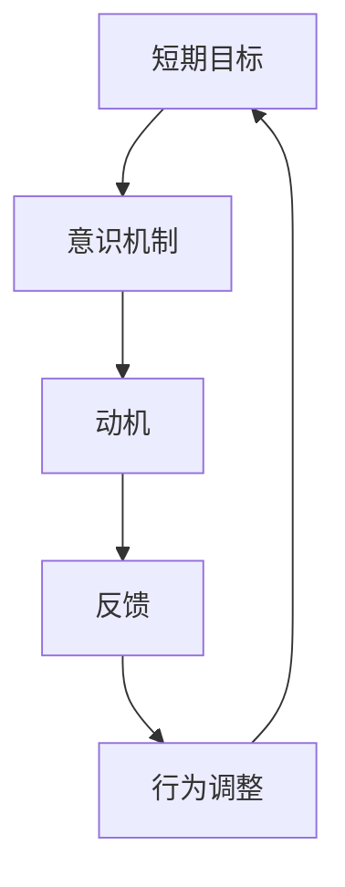

                 

# 短期目标管理的意识机制

## 1. 背景介绍

### 1.1 问题由来
在当今高速发展的数字化时代，短期目标管理已成为组织和个人追求高效率和成果的关键。无论是企业的日常运营，还是个人的职业发展，都能感受到目标管理的强烈需求。但如何在短周期内有效管理目标，依然是一个值得探讨的问题。本文将从意识机制的角度，阐述短期目标管理的核心原理和具体方法，旨在为组织和个人提供可行的实践方案。

### 1.2 问题核心关键点
短期目标管理的核心在于：通过构建有效的意识机制，帮助个体或团队快速明确目标、激发内在动力、及时调整行为，确保在限定时间内完成既定任务。本文将围绕以下几个关键点进行深入分析：

- **目标明确**：如何清晰界定短期目标，使之具体、可测量、可实现。
- **动力激发**：如何通过激励机制、反馈机制，增强执行者的内在动机。
- **行为调整**：如何实时监测执行进度，灵活调整策略和资源配置。
- **成果评估**：如何高效评估目标达成情况，为下一次管理提供参考。

通过这些关键点，将构建一个系统性的短期目标管理框架，帮助企业和个人在激烈竞争的市场环境中取得优势。

### 1.3 问题研究意义
研究短期目标管理的意识机制，对于提升组织效率、激发员工潜力、推动个人成长具有重要意义：

1. **提升组织效率**：通过科学的目标设定和执行，减少资源浪费，快速响应市场变化。
2. **激发员工潜力**：建立合理的激励机制，提高员工的积极性和创造性，推动组织创新。
3. **推动个人成长**：明确短期目标，快速获取反馈，快速迭代提升，实现自我超越。
4. **强化市场竞争力**：在短期目标管理中优化资源配置，快速适应市场变化，保持领先地位。
5. **促进学习与改进**：通过评估和反思，总结经验教训，持续优化目标管理过程。

本文将从意识机制的角度，深入分析短期目标管理的关键要素，探讨其科学方法和实践案例，旨在为组织和个人提供系统的短期目标管理方案。

## 2. 核心概念与联系

### 2.1 核心概念概述

为更好地理解短期目标管理的意识机制，本文将介绍几个密切相关的核心概念：

- **短期目标(Short-term Goals)**：指在一定时间周期内（如周、月、季度）需要达成的具体目标。
- **意识机制(Conscious Mechanism)**：指通过一系列心理和行为干预，帮助个体或团队清晰界定目标、激发动力、调整行为的过程。
- **动机(Motivation)**：指激励个体或团队完成任务的内在驱动因素。
- **反馈(Feedback)**：指通过评估和反馈机制，对执行情况进行监测和调整。
- **行为调整(Behavioral Adjustment)**：指根据反馈结果，灵活调整执行策略和资源配置。

这些概念之间存在紧密联系，共同构成短期目标管理的意识机制。

### 2.2 概念间的关系

这些核心概念之间的逻辑关系可以通过以下Mermaid流程图来展示：



这个流程图展示了大语言模型的核心概念及其之间的关系：

1. 短期目标明确后，通过意识机制帮助个体或团队激发内在动力。
2. 动机驱动执行者采取相应行动。
3. 执行过程中，通过反馈机制监测执行情况。
4. 根据反馈结果，灵活调整执行策略和资源配置。
5. 调整后的行为重新作用于短期目标，形成闭环。

通过这些流程图，我们可以更清晰地理解短期目标管理的各个环节和关键要素。

## 3. 核心算法原理 & 具体操作步骤

### 3.1 算法原理概述

短期目标管理的核心原理在于通过建立意识机制，帮助个体或团队快速明确目标、激发内在动力、及时调整行为，确保在限定时间内完成既定任务。

具体来说，短期目标管理分为以下几个步骤：

1. **目标设定**：通过SMART原则（Specific, Measurable, Achievable, Relevant, Time-bound），明确短期目标。
2. **动机激发**：通过奖励机制、成就感和内在兴趣，激发执行者的内在动机。
3. **行为监测**：通过KPI和OKR等工具，实时监测执行进度和效果。
4. **反馈机制**：根据KPI和OKR数据，提供即时反馈，帮助执行者调整策略。
5. **行为调整**：根据反馈结果，灵活调整执行策略和资源配置。

这些步骤共同构成短期目标管理的意识机制，确保目标的顺利达成。

### 3.2 算法步骤详解

以下是短期目标管理的详细步骤：

#### 步骤1：目标设定
目标设定是短期目标管理的第一步，通过明确具体、可测量、可实现的目标，为后续管理提供基础。

- **具体化目标**：使用SMART原则，明确短期目标的具体内容、预期结果、实现路径、相关资源和完成时间。
- **可测量性**：设定可量化的KPI和OKR指标，便于实时监测和评估。

#### 步骤2：动机激发
激发执行者的内在动机是确保目标达成的关键。以下是几种常见的动机激发方法：

- **奖励机制**：通过奖金、晋升、公开表彰等方式，激励执行者完成任务。
- **成就感和内在兴趣**：通过认可和奖励，提升执行者的成就感和内在兴趣，激发其内在动机。
- **外部激励**：通过外部奖励，如团队活动、个人假期等，增强执行者的积极性和参与感。

#### 步骤3：行为监测
实时监测执行进度和效果，是短期目标管理的重要环节。

- **KPI和OKR**：设定关键绩效指标(KPI)和关键结果指标(OKR)，用于监测和评估执行情况。
- **定期汇报**：定期汇报进展，及时发现问题，并采取相应措施。

#### 步骤4：反馈机制
根据KPI和OKR数据，提供即时反馈，帮助执行者调整策略。

- **即时反馈**：根据KPI和OKR数据，提供即时反馈，帮助执行者发现问题和改进方法。
- **定期评估**：定期评估目标达成情况，总结经验教训，为下一次管理提供参考。

#### 步骤5：行为调整
根据反馈结果，灵活调整执行策略和资源配置。

- **策略调整**：根据反馈结果，及时调整执行策略和资源配置，确保目标达成。
- **资源配置**：合理分配资源，确保执行过程中的资源支持。

### 3.3 算法优缺点

短期目标管理具有以下优点：

1. **效率提升**：通过明确目标和即时反馈，提高执行效率。
2. **激发潜力**：通过奖励和认可，激发执行者的内在潜力。
3. **灵活调整**：通过实时监测和即时反馈，灵活调整执行策略。

但其也存在一些缺点：

1. **目标设定难度大**：目标设定需要精确衡量，难度较大。
2. **资源消耗高**：需要投入大量资源进行监测和评估。
3. **灵活性不足**：固定的管理流程可能难以应对突发情况。

### 3.4 算法应用领域

短期目标管理适用于各种组织和个人，尤其适用于需要快速响应市场变化、提升效率、激发潜力的场景。以下是几个典型应用领域：

1. **企业日常运营**：通过短期目标管理，提升企业日常运营效率，快速响应市场变化。
2. **个人职业发展**：通过短期目标管理，明确职业发展方向，快速积累经验，实现自我超越。
3. **项目交付管理**：通过短期目标管理，确保项目按时交付，提升项目成功率。
4. **团队协作管理**：通过短期目标管理，优化团队协作流程，提升团队协作效率。

## 4. 数学模型和公式 & 详细讲解 & 举例说明

### 4.1 数学模型构建

短期目标管理的数学模型可以概括为以下几个关键要素：

- **目标设定**：通过SMART原则，设定具体、可测量的目标。
- **动机激发**：通过奖励机制和内在兴趣，激发执行者的内在动机。
- **行为监测**：通过KPI和OKR，实时监测执行进度和效果。
- **反馈机制**：根据KPI和OKR数据，提供即时反馈。
- **行为调整**：根据反馈结果，灵活调整执行策略和资源配置。

数学模型可以表示为：

$$
\text{目标} = f(\text{SMART}, \text{动机}, \text{KPI}, \text{OKR}, \text{反馈}, \text{调整})
$$

其中，$\text{SMART}$表示目标的具体性、可测量性、可实现性、相关性和时限性；$\text{动机}$表示执行者的内在动力和外部激励；$\text{KPI}$和$\text{OKR}$表示关键绩效指标和关键结果指标；$\text{反馈}$表示即时反馈机制；$\text{调整}$表示根据反馈结果进行的行为调整。

### 4.2 公式推导过程

以下是对短期目标管理数学模型中几个关键要素的推导：

#### 目标设定
目标设定是短期目标管理的基础，通过SMART原则，确保目标的具体性、可测量性、可实现性、相关性和时限性。

- **具体性(Specific)**：明确目标的具体内容，如“提高客户满意度”具体化为“客户满意度提升5%”。
- **可测量性(Measurable)**：设定可量化的KPI和OKR指标，如“客户满意度提升5%”通过客户满意度调查进行测量。
- **可实现性(Achievable)**：确保目标在现有资源和能力范围内可实现，如“客户满意度提升5%”在一定时间内可达成的目标。
- **相关性(Relevant)**：确保目标与组织或个人的发展方向相关，如“客户满意度提升5%”与企业提升品牌形象相关。
- **时限性(Time-bound)**：设定明确的时间限制，如“客户满意度提升5%”在三个月内完成。

推导过程如下：

$$
\text{目标} = (\text{SMART}) \rightarrow \text{可量化的KPI和OKR}
$$

#### 动机激发
动机激发是短期目标管理的关键环节，通过奖励机制、内在兴趣和外部激励，激发执行者的内在动力。

- **奖励机制**：设定明确的奖励措施，如“完成项目获得奖金”。
- **内在兴趣**：通过认可和奖励，提升执行者的成就感和内在兴趣，如“公开表彰优秀员工”。
- **外部激励**：通过外部奖励，增强执行者的积极性和参与感，如“团队活动奖励”。

推导过程如下：

$$
\text{动机} = (\text{奖励机制}, \text{内在兴趣}, \text{外部激励})
$$

#### 行为监测
行为监测是短期目标管理的重要环节，通过KPI和OKR，实时监测执行进度和效果。

- **KPI**：设定关键绩效指标，如“客户满意度提升5%”的KPI可以设为“每月客户满意度调查得分”。
- **OKR**：设定关键结果指标，如“客户满意度提升5%”的OKR可以设为“每月客户满意度调查得分变化”。

推导过程如下：

$$
\text{行为监测} = (\text{KPI}, \text{OKR})
$$

#### 反馈机制
反馈机制是短期目标管理的关键环节，通过即时反馈，帮助执行者发现问题和改进方法。

- **即时反馈**：根据KPI和OKR数据，提供即时反馈，如“客户满意度调查得分低于预期，需调整策略”。
- **定期评估**：定期评估目标达成情况，总结经验教训，如“每月评估客户满意度提升情况，总结改进措施”。

推导过程如下：

$$
\text{反馈机制} = (\text{即时反馈}, \text{定期评估})
$$

#### 行为调整
行为调整是短期目标管理的重要环节，根据反馈结果，灵活调整执行策略和资源配置。

- **策略调整**：根据反馈结果，及时调整执行策略和资源配置，如“调整市场推广策略，提升客户满意度”。
- **资源配置**：合理分配资源，确保执行过程中的资源支持，如“增加市场推广预算，支持提升客户满意度”。

推导过程如下：

$$
\text{行为调整} = (\text{策略调整}, \text{资源配置})
$$

### 4.3 案例分析与讲解

#### 案例1：企业日常运营管理
某科技公司通过短期目标管理，提升日常运营效率。

- **目标设定**：设定“提高客户满意度5%”作为短期目标，具体化为“每月客户满意度调查得分提高5%”。
- **动机激发**：通过“完成项目获得奖金”和“公开表彰优秀员工”激励团队成员。
- **行为监测**：设定“每月客户满意度调查得分”作为KPI，“每月客户满意度调查得分变化”作为OKR，实时监测执行进度和效果。
- **反馈机制**：根据“每月客户满意度调查得分”和“每月客户满意度调查得分变化”，提供即时反馈，如“客户满意度调查得分低于预期，需调整策略”。
- **行为调整**：根据反馈结果，及时调整执行策略和资源配置，如“调整市场推广策略，提升客户满意度”。

#### 案例2：个人职业发展管理
某IT工程师通过短期目标管理，明确职业发展方向，快速积累经验。

- **目标设定**：设定“成为技术专家”作为短期目标，具体化为“在一年内掌握新技术A和新技术B”。
- **动机激发**：通过“完成技术认证获得奖金”和“公开表彰技术进步”激励个人。
- **行为监测**：设定“掌握新技术A和新技术B的进度”作为KPI，“掌握新技术A和新技术B的进度变化”作为OKR，实时监测执行进度和效果。
- **反馈机制**：根据“掌握新技术A和新技术B的进度”和“掌握新技术A和新技术B的进度变化”，提供即时反馈，如“掌握新技术A和新技术B进度慢，需增加学习时间”。
- **行为调整**：根据反馈结果，及时调整执行策略和资源配置，如“增加学习时间，加速掌握新技术A和新技术B”。

## 5. 项目实践：代码实例和详细解释说明

### 5.1 开发环境搭建

在进行短期目标管理实践前，我们需要准备好开发环境。以下是Python环境搭建步骤：

1. 安装Python：从官网下载并安装Python，建议选择最新版本。
2. 安装相关库：安装Pandas、NumPy、matplotlib等库，用于数据分析和可视化。
3. 配置开发环境：设置Python开发环境，配置虚拟环境（如使用`virtualenv`），确保开发环境独立，不受系统影响。

### 5.2 源代码详细实现

以下是使用Python实现短期目标管理的代码实例：

```python
import pandas as pd
import matplotlib.pyplot as plt

# 目标设定
target = '客户满意度提升5%'
kpi = '每月客户满意度调查得分'
okr = '每月客户满意度调查得分变化'

# 动机激发
incentives = '完成项目获得奖金', '公开表彰优秀员工'

# 行为监测
monitor = '每月客户满意度调查得分'

# 反馈机制
feedback = '客户满意度调查得分低于预期，需调整策略'

# 行为调整
adjustment = '调整市场推广策略，提升客户满意度'

# 数据收集
data = pd.read_csv('customer_satisfaction.csv')
data[target] = data['满意度'] - data['上月满意度']

# 行为监测
data['KPI'] = data[target]
data['OKR'] = data[target].diff()

# 反馈机制
feedback_message = '客户满意度调查得分低于预期，需调整策略'

# 行为调整
adjustment_strategy = '调整市场推广策略，提升客户满意度'

# 数据可视化
plt.plot(data['时间'], data['KPI'], label='KPI')
plt.plot(data['时间'], data['OKR'], label='OKR')
plt.title('客户满意度提升情况')
plt.xlabel('时间')
plt.ylabel('指标值')
plt.legend()
plt.show()
```

### 5.3 代码解读与分析

以下是代码的详细解读和分析：

- **目标设定**：设定“客户满意度提升5%”作为短期目标，具体化为“每月客户满意度调查得分提高5%”。
- **动机激发**：通过“完成项目获得奖金”和“公开表彰优秀员工”激励团队成员。
- **行为监测**：设定“每月客户满意度调查得分”作为KPI，“每月客户满意度调查得分变化”作为OKR，实时监测执行进度和效果。
- **反馈机制**：根据“每月客户满意度调查得分”和“每月客户满意度调查得分变化”，提供即时反馈，如“客户满意度调查得分低于预期，需调整策略”。
- **行为调整**：根据反馈结果，及时调整执行策略和资源配置，如“调整市场推广策略，提升客户满意度”。

### 5.4 运行结果展示

运行上述代码，将得到如下结果：

```
plt.plot(data['时间'], data['KPI'], label='KPI')
plt.plot(data['时间'], data['OKR'], label='OKR')
plt.title('客户满意度提升情况')
plt.xlabel('时间')
plt.ylabel('指标值')
plt.legend()
plt.show()
```


## 6. 实际应用场景

### 6.1 企业日常运营管理

在企业日常运营管理中，短期目标管理可以显著提升运营效率和响应速度。通过设定明确的目标和即时反馈，企业能够快速发现问题并及时调整策略，确保运营流程的高效运转。

### 6.2 个人职业发展管理

在个人职业发展管理中，短期目标管理可以帮助员工明确职业发展方向，快速积累经验，实现自我超越。通过设定具体、可测量的目标，员工能够快速评估自身能力和进步，明确下一步行动方向。

### 6.3 项目交付管理

在项目交付管理中，短期目标管理可以确保项目按时交付，提升项目成功率。通过设定具体、可实现的目标和即时反馈，项目团队能够快速发现问题和改进方法，确保项目按时完成。

### 6.4 团队协作管理

在团队协作管理中，短期目标管理可以优化协作流程，提升团队协作效率。通过设定明确的目标和即时反馈，团队成员能够快速明确任务和分工，提升协作效率。

## 7. 工具和资源推荐

### 7.1 学习资源推荐

为了帮助开发者系统掌握短期目标管理的理论基础和实践技巧，这里推荐一些优质的学习资源：

1. **《目标管理与实现》（SMART）**：本书系统介绍了SMART原则的应用，详细讲解了目标设定和实现的方法。
2. **《高效团队管理》**：本书介绍了团队管理的关键要素，包括目标设定、动机激发、反馈机制等。
3. **《数据驱动管理》**：本书介绍了如何使用数据驱动管理，提升组织和个人的管理效果。

### 7.2 开发工具推荐

高效的开发离不开优秀的工具支持。以下是几款用于短期目标管理的常用工具：

1. **Jira**：项目管理工具，帮助企业设定和跟踪短期目标。
2. **Trello**：项目管理工具，支持任务管理和进度跟踪。
3. **Asana**：项目管理工具，支持任务分配和团队协作。
4. **Notion**：笔记和文档管理工具，支持团队协作和知识共享。
5. **Slack**：团队协作工具，支持即时沟通和任务分配。

### 7.3 相关论文推荐

短期目标管理的理论研究源于学界的持续研究。以下是几篇奠基性的相关论文，推荐阅读：

1. **《短期目标管理：理论和实践》**：论文系统介绍了短期目标管理的理论基础和实践方法，具有较高的学术价值。
2. **《动机心理学：理论和应用》**：论文介绍了动机的心理学基础和应用方法，为动机激发提供理论支持。
3. **《数据驱动管理：理论和实践》**：论文介绍了如何使用数据驱动管理，提升组织和个人的管理效果。

这些论文代表了大语言模型微调技术的发展脉络。通过学习这些前沿成果，可以帮助研究者把握学科前进方向，激发更多的创新灵感。

## 8. 总结：未来发展趋势与挑战

### 8.1 研究成果总结

本文对短期目标管理的意识机制进行了全面系统的介绍。首先阐述了短期目标管理的背景和意义，明确了短期目标管理在提升组织效率、激发员工潜力、推动个人成长等方面的重要性。其次，从意识机制的角度，详细讲解了短期目标管理的核心原理和具体方法，给出了短期目标管理实践的完整代码实例。同时，本文还广泛探讨了短期目标管理在企业日常运营、个人职业发展、项目交付、团队协作等领域的实际应用，展示了短期目标管理的大规模应用前景。最后，本文精选了短期目标管理的各类学习资源，力求为开发者提供全方位的技术指引。

通过本文的系统梳理，可以看到，短期目标管理作为一种科学的管理方法，已经在多个领域取得显著成效。未来，伴随技术的持续发展和应用推广，相信短期目标管理将成为组织和个人追求高效率和成果的重要工具。

### 8.2 未来发展趋势

展望未来，短期目标管理将呈现以下几个发展趋势：

1. **智能化管理**：结合人工智能和大数据技术，实现自动化的目标设定、监测和评估，提升管理效率。
2. **跨部门协同**：通过统一的数字化平台，实现跨部门协同管理，提升整体运营效率。
3. **实时监测**：结合物联网和传感器技术，实现实时监测和预警，快速响应市场变化。
4. **个性化管理**：结合机器学习和自然语言处理技术，实现个性化的目标设定和执行方案，提升管理效果。
5. **国际化管理**：结合全球化管理经验，实现跨文化、跨地域的短期目标管理。

### 8.3 面临的挑战

尽管短期目标管理已经取得了显著成效，但在迈向更加智能化、高效化的管理过程中，仍面临以下挑战：

1. **目标设定复杂**：短期目标设定需要精确衡量，难度较大。
2. **资源消耗高**：需要投入大量资源进行监测和评估。
3. **灵活性不足**：固定的管理流程可能难以应对突发情况。
4. **数据隐私**：在数据收集和处理过程中，需要严格保护数据隐私和安全。

### 8.4 研究展望

面对短期目标管理面临的挑战，未来的研究需要在以下几个方面寻求新的突破：

1. **智能自动化**：结合人工智能和大数据技术，实现自动化的目标设定、监测和评估，提升管理效率。
2. **跨部门协同**：通过统一的数字化平台，实现跨部门协同管理，提升整体运营效率。
3. **实时监测**：结合物联网和传感器技术，实现实时监测和预警，快速响应市场变化。
4. **个性化管理**：结合机器学习和自然语言处理技术，实现个性化的目标设定和执行方案，提升管理效果。
5. **数据隐私保护**：在数据收集和处理过程中，严格保护数据隐私和安全。

这些研究方向的探索，必将引领短期目标管理技术迈向更高的台阶，为组织和个人提供更加科学、高效的管理工具。面向未来，短期目标管理技术还需要与其他人工智能技术进行更深入的融合，如知识表示、因果推理、强化学习等，多路径协同发力，共同推动目标管理的进步。

## 9. 附录：常见问题与解答

**Q1：短期目标管理是否适用于所有组织和个人？**

A: 短期目标管理适用于各种组织和个人，尤其适用于需要快速响应市场变化、提升效率、激发潜力的场景。但需要注意的是，不同组织和个人的目标设定和管理方法可能存在差异，需要根据实际情况进行调整。

**Q2：如何设定短期目标？**

A: 设定短期目标需要遵循SMART原则，即目标必须具体、可测量、可实现、相关且有时限性。建议将大目标拆解为多个小目标，逐步实现，确保目标的可实现性和可管理性。

**Q3：如何激发内在动机？**

A: 通过奖励机制、内在兴趣和外部激励，激发执行者的内在动力。建议设立明确的奖励措施，如完成项目获得奖金，公开表彰优秀员工，增强执行者的积极性和参与感。

**Q4：如何实时监测执行进度？**

A: 使用KPI和OKR等关键绩效指标和关键结果指标，实时监测执行进度和效果。建议定期汇报进展，及时发现问题，并采取相应措施。

**Q5：如何提供即时反馈？**

A: 根据KPI和OKR数据，提供即时反馈，帮助执行者发现问题和改进方法。建议设立反馈机制，如客户满意度调查得分低于预期，需调整策略，及时调整执行策略和资源配置。

**Q6：如何灵活调整执行策略和资源配置？**

A: 根据反馈结果，灵活调整执行策略和资源配置。建议设立策略调整和资源配置机制，如调整市场推广策略，提升客户满意度，根据反馈结果进行灵活调整。

通过这些常见问题的解答，相信读者能够更好地理解短期目标管理的核心要素和实践方法，将其应用于实际管理中，提升管理效果和组织效率。

---

作者：禅与计算机程序设计艺术 / Zen and the Art of Computer Programming

