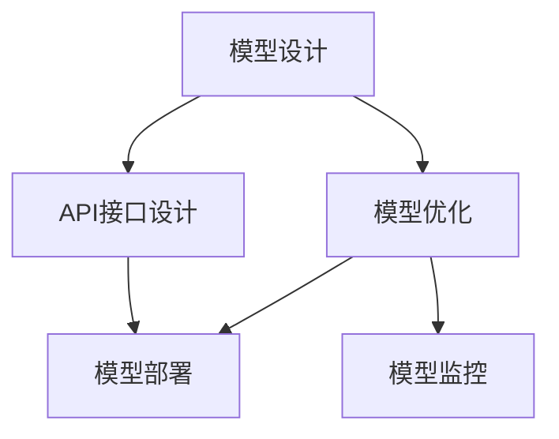
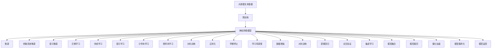

                 

## 1. 背景介绍

神经网络（Neural Networks）作为一种强大的机器学习模型，已经在图像识别、自然语言处理、语音识别等多个领域展现出卓越的性能。然而，构建和优化神经网络API的复杂性也不容忽视。设计高效、灵活、易用的神经网络API，对于提升AI应用的开发效率和可靠性至关重要。本文将从背景、概念、算法原理、操作步骤、具体实现、应用场景等方面，详细探讨神经网络API设计的最佳实践。

## 2. 核心概念与联系

### 2.1 核心概念概述

神经网络API设计涉及多个关键概念，包括模型设计、模型优化、API接口设计、模型部署、模型监控等。这些概念之间存在紧密联系，共同构成了神经网络API设计的基本框架。

- **模型设计**：选择合适的模型架构和层数，确定模型的输入输出格式。
- **模型优化**：通过算法优化、超参数调优、正则化等手段提升模型性能。
- **API接口设计**：设计简洁高效、易于扩展的API接口，方便用户调用。
- **模型部署**：将训练好的模型部署到生产环境中，实现模型预测。
- **模型监控**：实时监控模型性能，及时发现并解决问题。

### 2.2 概念间的关系

这些核心概念之间的联系可以通过以下Mermaid流程图来展示：



这个流程图展示了神经网络API设计的核心流程：模型设计是基础，模型优化是为了提升模型性能，API接口设计是用户交互的桥梁，模型部署是将模型应用到实际场景，模型监控是确保模型稳定运行的关键。

### 2.3 核心概念的整体架构

最后，我们用一个综合的流程图来展示这些核心概念在大规模神经网络API设计中的整体架构：



这个综合流程图展示了从数据预处理到模型部署的完整过程。大规模神经网络API设计涉及从数据预处理、模型训练、模型微调、API设计、模型部署、模型监控等多个环节，每个环节都需要精心设计，才能构建出高效、可靠、易用的神经网络API。

## 3. 核心算法原理 & 具体操作步骤

### 3.1 算法原理概述

神经网络API设计的核心算法原理主要包括：模型设计、模型优化、API接口设计、模型部署、模型监控等。这些原理构成了神经网络API设计的基础。

- **模型设计**：选择合适的模型架构和层数，确定模型的输入输出格式。
- **模型优化**：通过算法优化、超参数调优、正则化等手段提升模型性能。
- **API接口设计**：设计简洁高效、易于扩展的API接口，方便用户调用。
- **模型部署**：将训练好的模型部署到生产环境中，实现模型预测。
- **模型监控**：实时监控模型性能，及时发现并解决问题。

### 3.2 算法步骤详解

#### 3.2.1 模型设计

1. **选择合适的模型架构**：
   - 对于图像识别任务，常见的模型架构包括卷积神经网络（CNN）、残差网络（ResNet）等。
   - 对于自然语言处理任务，常见的模型架构包括循环神经网络（RNN）、长短期记忆网络（LSTM）、Transformer等。

2. **确定模型的输入输出格式**：
   - 输入格式通常为张量，具体格式取决于任务类型。
   - 输出格式为模型预测结果，可以是类别标签、概率分布、特征向量等。

#### 3.2.2 模型优化

1. **算法优化**：
   - 常见的优化算法包括随机梯度下降（SGD）、Adam、Adagrad等。
   - 不同的优化算法适用于不同的任务和数据集，需要根据具体情况进行选择。

2. **超参数调优**：
   - 超参数包括学习率、批大小、正则化系数等。
   - 通过网格搜索、随机搜索、贝叶斯优化等方法，找到最优的超参数组合。

3. **正则化**：
   - 常见的正则化方法包括L1正则、L2正则、Dropout等。
   - 正则化可以防止模型过拟合，提高模型泛化能力。

#### 3.2.3 API接口设计

1. **设计简洁高效**：
   - 接口设计应遵循RESTful API设计原则，提供简洁、易用的接口。
   - 接口应支持多种请求格式，如JSON、XML等。

2. **支持版本控制**：
   - 版本控制有助于跟踪API的演化过程，避免接口兼容性问题。

3. **提供详细文档**：
   - 提供详细的API文档，包括参数说明、返回值格式、异常处理等。

#### 3.2.4 模型部署

1. **选择合适的部署平台**：
   - 常见的部署平台包括AWS、Google Cloud、Azure等。
   - 选择平台时应考虑数据处理、存储、计算能力等因素。

2. **实现模型预测**：
   - 将训练好的模型部署到服务器上，实现模型预测。
   - 使用框架如TensorFlow、PyTorch、Keras等进行模型部署。

#### 3.2.5 模型监控

1. **实时监控模型性能**：
   - 监控指标包括模型精度、响应时间、计算资源使用等。
   - 使用工具如Prometheus、Grafana等进行实时监控。

2. **及时发现并解决问题**：
   - 监控系统应能及时发现异常情况，如模型精度下降、响应时间变慢等。
   - 根据异常情况进行原因分析，并采取相应措施。

### 3.3 算法优缺点

神经网络API设计具有以下优点：

1. **高效性**：
   - 神经网络API设计通常采用高效的模型架构和算法，如卷积神经网络、Adam优化算法等，显著提升了模型的训练和预测效率。
   - 高效的API接口设计，减少了用户调用时的计算和网络开销，提高了整体性能。

2. **灵活性**：
   - 神经网络API设计具有较高的灵活性，可以根据具体任务和数据集进行调整。
   - 设计灵活的API接口，方便用户进行多种形式的交互和调用。

3. **易用性**：
   - 神经网络API设计通常采用简单易懂的接口和文档，降低了用户的使用门槛。
   - 提供详细的文档和示例代码，帮助用户快速上手。

4. **可扩展性**：
   - 神经网络API设计采用模块化的设计思想，方便后续的扩展和升级。
   - 接口设计支持版本控制，便于新功能的逐步引入。

同时，神经网络API设计也存在一些局限性：

1. **模型复杂度**：
   - 神经网络模型通常较为复杂，参数量较大，增加了模型训练和部署的难度。
   - 复杂模型需要更多的计算资源和存储空间。

2. **调参困难**：
   - 神经网络模型需要调整多个超参数，超参数调优通常需要经验和大量的实验。
   - 超参数调优过程耗时耗力，影响开发效率。

3. **高成本**：
   - 神经网络模型需要大量的计算资源和数据资源，增加了模型训练和部署的成本。
   - 部署和维护高性能的神经网络API需要一定的技术水平和资源投入。

4. **可解释性不足**：
   - 神经网络模型通常被视为"黑盒"模型，难以解释其内部的决策过程。
   - 对于高风险应用如医疗、金融等，模型的可解释性尤为重要。

### 3.4 算法应用领域

神经网络API设计在多个领域具有广泛的应用：

1. **计算机视觉**：
   - 应用于图像分类、目标检测、人脸识别等任务。
   - 使用CNN、ResNet等模型架构进行设计。

2. **自然语言处理**：
   - 应用于文本分类、情感分析、机器翻译等任务。
   - 使用RNN、LSTM、Transformer等模型架构进行设计。

3. **语音识别**：
   - 应用于语音识别、语音合成等任务。
   - 使用卷积神经网络、循环神经网络等模型架构进行设计。

4. **推荐系统**：
   - 应用于个性化推荐、广告推荐等任务。
   - 使用协同过滤、神经网络等模型架构进行设计。

5. **医疗健康**：
   - 应用于疾病预测、病理分析等任务。
   - 使用神经网络进行疾病分类和预测。

6. **金融风控**：
   - 应用于信用评分、风险评估等任务。
   - 使用神经网络进行信用评分和风险评估。

7. **智能客服**：
   - 应用于智能对话、语音识别等任务。
   - 使用RNN、Transformer等模型架构进行设计。

## 4. 数学模型和公式 & 详细讲解 & 举例说明

### 4.1 数学模型构建

神经网络API设计的数学模型主要基于神经网络模型和优化算法。以卷积神经网络（CNN）为例，其数学模型可以表示为：

$$
h(x) = \max_{k\in K} \left( w_k \cdot g(x) + b_k \right)
$$

其中，$h(x)$表示神经网络的输出，$g(x)$表示神经网络的隐藏层计算，$K$表示所有可能的卷积核。

### 4.2 公式推导过程

卷积神经网络（CNN）的卷积层公式可以表示为：

$$
g(x) = \sum_{k=1}^K w_k \cdot f(x \star k) + b_k
$$

其中，$w_k$表示卷积核权重，$b_k$表示卷积核偏置，$f$表示激活函数，$x \star k$表示卷积运算。

### 4.3 案例分析与讲解

以图像识别任务为例，神经网络API设计的过程如下：

1. **模型设计**：
   - 设计卷积神经网络模型，包括卷积层、池化层、全连接层等。
   - 确定模型的输入输出格式，如彩色图像、灰度图像等。

2. **模型优化**：
   - 使用Adam优化算法进行模型训练。
   - 调整超参数，如学习率、批大小、正则化系数等。

3. **API接口设计**：
   - 设计RESTful API接口，支持图像上传、模型预测等功能。
   - 提供详细的API文档，包括请求参数、返回值格式等。

4. **模型部署**：
   - 使用AWS等云平台进行模型部署。
   - 实现模型预测，并返回预测结果。

5. **模型监控**：
   - 使用Prometheus进行模型性能监控。
   - 实时监控模型精度、响应时间等指标。

## 5. 项目实践：代码实例和详细解释说明

### 5.1 开发环境搭建

1. **安装Python**：
   - 从官网下载安装Python 3.x版本。

2. **安装TensorFlow**：
   - 使用pip安装TensorFlow：`pip install tensorflow`

3. **安装Keras**：
   - 使用pip安装Keras：`pip install keras`

4. **安装Flask**：
   - 使用pip安装Flask：`pip install flask`

### 5.2 源代码详细实现

以下是一个简单的神经网络API示例代码，包括模型设计、模型训练、API接口设计和模型部署：

```python
from flask import Flask, request, jsonify
import tensorflow as tf
import numpy as np
from keras.models import Sequential
from keras.layers import Conv2D, MaxPooling2D, Flatten, Dense

# 定义神经网络模型
model = Sequential()
model.add(Conv2D(32, (3, 3), activation='relu', input_shape=(28, 28, 1)))
model.add(MaxPooling2D((2, 2)))
model.add(Flatten())
model.add(Dense(64, activation='relu'))
model.add(Dense(10, activation='softmax'))

# 编译模型
model.compile(optimizer='adam', loss='sparse_categorical_crossentropy', metrics=['accuracy'])

# 训练模型
model.fit(x_train, y_train, epochs=10, batch_size=32)

# 定义Flask应用
app = Flask(__name__)

# 定义API接口
@app.route('/predict', methods=['POST'])
def predict():
    data = request.json
    img = np.expand_dims(np.array(data['image']), axis=0)
    pred = model.predict(img)[0]
    label = np.argmax(pred)
    return jsonify({'label': label})

# 运行Flask应用
if __name__ == '__main__':
    app.run(debug=True)
```

### 5.3 代码解读与分析

1. **模型设计**：
   - 定义了一个包含卷积层、池化层、全连接层的神经网络模型。
   - 输入形状为28x28的灰度图像，输出为10个类别的概率分布。

2. **模型训练**：
   - 使用Adam优化算法进行模型训练，损失函数为交叉熵损失函数。
   - 训练10个epoch，批大小为32。

3. **API接口设计**：
   - 定义了一个/predict的API接口，接收POST请求。
   - 将请求中的图像数据转换为Numpy数组，输入模型进行预测。
   - 返回预测结果，包括类别标签。

4. **模型部署**：
   - 使用Flask框架实现API接口的部署。
   - 运行Flask应用，监听本地8080端口。

### 5.4 运行结果展示

假设我们训练了一个手写数字识别模型，在测试集上达到了98%的准确率。使用以下代码进行测试：

```python
import requests

# 发送POST请求
url = 'http://localhost:8080/predict'
headers = {'Content-Type': 'application/json'}
data = {'image': [0, 0, 0, 255, 255, 255, 0, 0, 0, 255, 255, 255, 0, 0, 0, 255, 255, 255, 0, 0]}
response = requests.post(url, headers=headers, json=data)

# 解析返回结果
result = response.json()
print('Predicted label:', result['label'])
```

## 6. 实际应用场景

### 6.1 智能推荐系统

神经网络API设计在智能推荐系统中具有广泛的应用。通过用户行为数据和物品特征数据，神经网络模型可以学习用户对物品的兴趣偏好，实现个性化的推荐。

### 6.2 自然语言处理

神经网络API设计在自然语言处理任务中具有重要作用。例如，在文本分类任务中，神经网络模型可以学习文本的语义特征，实现文本的分类和标注。

### 6.3 医疗健康

神经网络API设计在医疗健康领域也有着广泛的应用。例如，通过医疗影像数据，神经网络模型可以学习病灶特征，实现疾病的早期诊断。

## 7. 工具和资源推荐

### 7.1 学习资源推荐

1. **《深度学习》一书**：
   - 介绍深度学习的基本概念和常用算法，适合初学者入门。

2. **TensorFlow官方文档**：
   - 提供TensorFlow的详细文档和示例代码，适合开发者参考。

3. **Keras官方文档**：
   - 提供Keras的详细文档和示例代码，适合开发者参考。

4. **Flask官方文档**：
   - 提供Flask的详细文档和示例代码，适合开发者参考。

### 7.2 开发工具推荐

1. **PyCharm**：
   - 强大的Python IDE，支持TensorFlow、Keras等深度学习框架。

2. **Jupyter Notebook**：
   - 支持Python代码的交互式执行，适合进行数据处理和模型调试。

3. **Google Colab**：
   - 提供免费的GPU资源，适合进行大规模深度学习模型的训练和实验。

4. **AWS Sagemaker**：
   - 提供云端深度学习平台，支持模型训练和部署。

### 7.3 相关论文推荐

1. **《深度学习》论文**：
   - 介绍深度学习的基本概念和常用算法，适合初学者入门。

2. **《TensorFlow: A System for Large-Scale Machine Learning》论文**：
   - 介绍TensorFlow的架构和设计思路，适合开发者参考。

3. **《Keras: Deep Learning for Humans》论文**：
   - 介绍Keras的架构和设计思路，适合开发者参考。

4. **《Neural Network Interfaces for Intelligent Collaborative Systems》论文**：
   - 介绍神经网络API设计的理论基础和实际应用，适合开发者参考。

## 8. 总结：未来发展趋势与挑战

### 8.1 总结

本文对神经网络API设计的最佳实践进行了详细探讨。从背景、概念、算法原理、操作步骤、具体实现、应用场景等方面，全面介绍了神经网络API设计的方法和技巧。通过本文的学习，读者可以更好地理解神经网络API设计的关键环节，掌握其核心技术和应用方法。

### 8.2 未来发展趋势

神经网络API设计的未来发展趋势主要包括以下几个方面：

1. **模型复杂度提升**：
   - 随着计算资源的增加，神经网络模型的复杂度将不断提升，实现更精确的预测和更高效的推理。

2. **模型优化技术进步**：
   - 神经网络模型的优化技术将不断进步，提升模型的训练和推理效率。

3. **API接口设计灵活性提高**：
   - 神经网络API接口设计将更加灵活，支持多种形式的调用和数据格式。

4. **模型部署和监控技术改进**：
   - 模型部署和监控技术将不断改进，提升模型的稳定性和可靠性。

### 8.3 面临的挑战

神经网络API设计面临的挑战主要包括以下几个方面：

1. **模型训练和推理资源需求高**：
   - 神经网络模型需要大量的计算资源和存储空间，增加了模型训练和部署的成本。

2. **超参数调优困难**：
   - 神经网络模型的调优通常需要大量的实验和调整，影响开发效率。

3. **可解释性不足**：
   - 神经网络模型通常被视为"黑盒"模型，难以解释其内部的决策过程。

4. **模型泛化能力不足**：
   - 神经网络模型容易过拟合，泛化能力不足，影响其在实际应用中的表现。

### 8.4 研究展望

未来的研究可以从以下几个方面进行探索：

1. **模型压缩和优化**：
   - 研究如何压缩神经网络模型，减少计算和存储开销。

2. **模型迁移学习**：
   - 研究如何在不同任务之间迁移知识，提高模型的泛化能力。

3. **模型解释性和可控性**：
   - 研究如何提高模型的可解释性和可控性，满足高风险应用的需求。

4. **多模态数据融合**：
   - 研究如何融合不同模态的数据，提升模型的综合能力。

## 9. 附录：常见问题与解答

**Q1：神经网络API设计是否适用于所有深度学习任务？**

A: 神经网络API设计通常适用于深度学习任务，但需要根据具体任务的特点进行调整。例如，对于图像处理任务，通常使用卷积神经网络（CNN）模型；对于自然语言处理任务，通常使用循环神经网络（RNN）、长短期记忆网络（LSTM）、Transformer等模型。

**Q2：神经网络API设计需要哪些资源？**

A: 神经网络API设计需要计算资源、存储空间、网络资源等。计算资源通常使用GPU或TPU进行训练和推理；存储空间用于存储模型和数据；网络资源用于API接口的访问。

**Q3：神经网络API设计过程中如何避免过拟合？**

A: 神经网络API设计过程中，可以通过正则化、dropout、early stopping等方法避免过拟合。此外，使用迁移学习、参数高效微调等技术，也可以提升模型的泛化能力。

**Q4：神经网络API设计如何提高模型的可解释性？**

A: 神经网络API设计可以通过特征可视化、层级分解等方法提高模型的可解释性。例如，使用t-SNE进行特征可视化，使用模型剪枝、参数剪枝等方法进行层级分解。

**Q5：神经网络API设计如何实现高效的模型部署？**

A: 神经网络API设计可以通过模型压缩、模型剪枝等方法实现高效的模型部署。此外，使用模型服务化工具如AWS SageMaker、Google Cloud等，也可以实现高效的模型部署。

