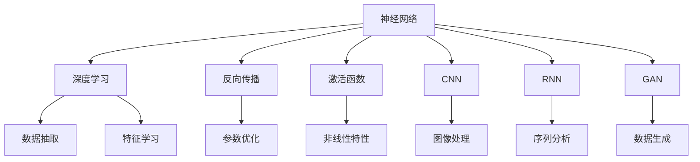
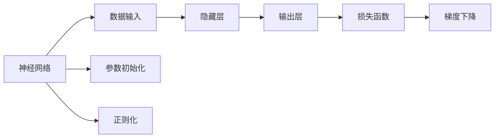
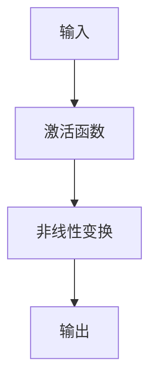
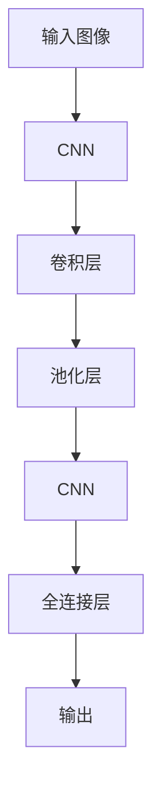
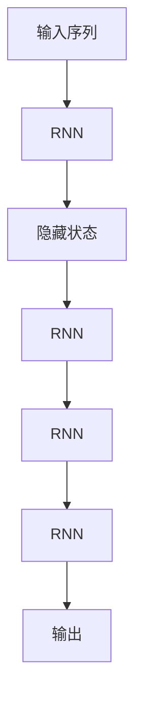
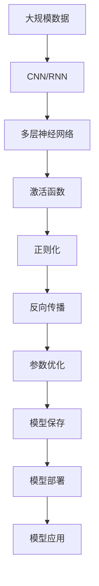

                 

# 神经网络：推动社会进步的力量

> 关键词：神经网络,社会进步,人工智能,深度学习,应用场景,未来发展,前沿技术

## 1. 背景介绍

### 1.1 问题由来

现代社会的各个角落，从医疗、金融、教育，到交通、能源、环保，无不面临着复杂多变的环境和问题。如何从海量数据中提取有用的信息，实现智能化的决策和预测，成为科技发展的核心任务。在这一背景下，神经网络作为人工智能领域的前沿技术，成为解决复杂问题的重要工具。

### 1.2 问题核心关键点

神经网络通过模拟人脑的神经元之间相互连接和信息传递的过程，实现了对大规模数据的高效处理和模式识别。其核心在于通过多层神经元之间的非线性变换，不断提取更高层次的特征，从而在图像识别、语音处理、自然语言处理等领域取得了突破性进展。

### 1.3 问题研究意义

研究神经网络技术，对于推动社会进步具有重要意义：

1. 提升生产力。神经网络在生产自动化、智能制造、智慧农业等领域的应用，提高了生产效率，降低了成本。
2. 优化决策。在金融、医疗、安全等领域，神经网络通过精准分析和预测，辅助决策者做出更优选择，减少人为失误。
3. 促进创新。神经网络的强大学习和适应能力，催生了更多基于数据的创新应用，推动了新产业的崛起。
4. 改善生活质量。在交通、医疗、教育等领域，神经网络提高了服务的智能化水平，提升了用户满意度。
5. 推动可持续发展。神经网络在能源管理、环境监测等领域的应用，有助于实现资源的最优配置和环境的可持续发展。

## 2. 核心概念与联系

### 2.1 核心概念概述

为更好地理解神经网络技术，本节将介绍几个密切相关的核心概念：

- 神经网络(Neural Network)：一种基于人脑神经元模型的计算模型，通过多层非线性变换，实现对数据的高级抽象和特征提取。
- 深度学习(Deep Learning)：一种以多层神经网络为核心的机器学习方法，通过梯度下降等优化算法，训练模型参数，使其能够自动从数据中提取特征。
- 反向传播(Backpropagation)：一种用于优化神经网络参数的算法，通过反向计算梯度，更新模型权重，实现误差最小化。
- 激活函数(Activation Function)：一种非线性函数，用于引入非线性特性，增强神经网络的表达能力。
- 卷积神经网络(Convolutional Neural Network, CNN)：一种专门用于图像处理任务的神经网络，通过卷积和池化操作，提取图像特征。
- 循环神经网络(Recurrent Neural Network, RNN)：一种处理序列数据的神经网络，通过时间步的递归计算，捕捉序列数据的动态特性。
- 生成对抗网络(Generative Adversarial Network, GAN)：一种通过两个神经网络相互博弈，生成高质量数据样本的技术。

这些核心概念之间的逻辑关系可以通过以下Mermaid流程图来展示：



这个流程图展示了大神经网络技术的核心概念及其之间的关系：

1. 神经网络通过反向传播和激活函数，实现数据的高层次抽象和特征提取。
2. 深度学习使用多层神经网络，增强模型的复杂度和表达能力。
3. CNN和RNN分别应用于图像和序列数据的处理。
4. GAN通过博弈生成高质量的数据样本。
5. CNN、RNN和GAN等模型应用在大神经网络的不同子领域，展示了其广泛的应用场景。

### 2.2 概念间的关系

这些核心概念之间存在着紧密的联系，形成了大神经网络技术的完整生态系统。下面我通过几个Mermaid流程图来展示这些概念之间的关系。

#### 2.2.1 神经网络的学习范式



这个流程图展示了神经网络的基本学习过程：

1. 输入数据通过隐藏层进行多次非线性变换，输出到输出层。
2. 通过正则化技术，防止过拟合。
3. 损失函数衡量模型预测与真实标签之间的差异。
4. 梯度下降算法更新模型参数，使损失函数最小化。

#### 2.2.2 深度学习与反向传播的关系


这个流程图展示了深度学习与反向传播的关联：

1. 多层神经网络通过前向传播计算输出。
2. 损失函数衡量输出与真实标签的差异。
3. 梯度计算从输出层向隐藏层反向传播，计算每个参数的梯度。
4. 参数更新通过梯度下降等优化算法进行。

#### 2.2.3 激活函数的功能



这个流程图展示了激活函数的作用：

1. 激活函数对输入进行非线性变换，增强模型的表达能力。
2. 非线性特性使模型能够处理复杂多变的数据分布。

#### 2.2.4 卷积神经网络的结构



这个流程图展示了CNN的基本结构：

1. 输入图像经过多个卷积层和池化层进行特征提取。
2. 特征图经过全连接层进行分类或回归。
3. CNN能够有效提取图像的空间局部特征。

#### 2.2.5 循环神经网络的时间步递归



这个流程图展示了RNN的递归结构：

1. 输入序列经过RNN的时间步递归计算。
2. 隐藏状态记录历史信息，捕捉序列的动态特性。
3. RNN能够处理序列数据的时序信息。

#### 2.2.6 生成对抗网络的双重博弈


这个流程图展示了GAN的双重博弈过程：

1. 生成器通过梯度下降生成假样本。
2. 判别器通过梯度下降判断样本的真实性。
3. 损失函数衡量生成器和判别器的博弈结果。
4. 参数更新通过梯度下降优化模型，使生成器生成的样本更加逼真。

### 2.3 核心概念的整体架构

最后，我们用一个综合的流程图来展示这些核心概念在大神经网络学习过程中的整体架构：



这个综合流程图展示了从数据输入到模型部署的完整过程。大数据经过卷积和递归计算，通过非线性变换和多层次抽象，提取特征并进行正则化处理，通过反向传播和参数优化，得到优化后的模型，最终部署到生产环境，服务于具体应用。

## 3. 核心算法原理 & 具体操作步骤
### 3.1 算法原理概述

大神经网络技术通过反向传播算法实现模型参数的优化，逐步逼近目标函数。其核心在于使用梯度下降等优化算法，通过计算损失函数对模型参数的梯度，不断调整参数值，使损失函数最小化。

### 3.2 算法步骤详解

大神经网络的训练过程一般包括以下关键步骤：

**Step 1: 数据预处理**
- 将原始数据进行清洗、归一化、划分等预处理，使其适合神经网络模型的输入格式。
- 对于图像数据，需要将其转换为张量形式，并进行归一化处理。
- 对于序列数据，需要将其转换为固定长度或动态长度的形式，并按时间步递归计算。

**Step 2: 模型初始化**
- 随机初始化神经网络的权重和偏置，以便后续的参数优化。
- 权重初始化通常使用高斯分布或均匀分布，偏置初始化通常为0。
- 初始化后的模型将作为训练的起点。

**Step 3: 前向传播**
- 将输入数据通过神经网络的前向传播计算，得到模型的输出。
- 每一层的前向传播包括权重矩阵乘法和激活函数操作。
- 前向传播过程是一个逐层计算的过程，每一层的输出将作为下一层的输入。

**Step 4: 损失计算**
- 根据任务类型，计算模型输出与真实标签之间的损失函数。
- 常见的损失函数包括交叉熵损失、均方误差损失、对数似然损失等。
- 损失函数衡量模型预测与真实标签之间的差异。

**Step 5: 反向传播**
- 通过反向传播算法，计算损失函数对模型参数的梯度。
- 梯度计算从输出层向输入层反向传播，逐层计算每个参数的梯度。
- 反向传播过程将损失函数的梯度回传到每个参数，用于后续的优化。

**Step 6: 参数更新**
- 使用梯度下降等优化算法，根据梯度更新模型参数。
- 优化算法通常包括批量梯度下降、随机梯度下降、Adam等。
- 参数更新过程中，学习率、动量、正则化等超参数需要合理设置，以避免过拟合和梯度消失等问题。

**Step 7: 模型评估**
- 在训练过程中，周期性地在验证集上评估模型性能。
- 常见的评估指标包括准确率、精确率、召回率、F1分数等。
- 评估结果将用于调整超参数和优化算法，以提升模型性能。

**Step 8: 模型保存与部署**
- 在训练完成后，将优化后的模型保存为二进制文件，以便后续使用。
- 模型可以部署在服务器、云平台或移动设备等环境中，服务于实际应用。
- 部署过程中，还需要考虑模型的推理速度、内存占用和计算资源等因素。

以上是神经网络模型训练的一般流程。在实际应用中，还需要针对具体任务和数据特点，对各环节进行优化设计，如改进损失函数、引入更多正则化技术、搜索最优的超参数组合等，以进一步提升模型性能。

### 3.3 算法优缺点

神经网络算法具有以下优点：

1. 高泛化能力。神经网络能够通过多层非线性变换，自动学习数据中的复杂模式和特征。
2. 强大的表达能力。神经网络可以处理不同类型的数据，包括图像、文本、序列等，具备广泛的适用性。
3. 适应性强。神经网络可以处理噪声和异常值，具备一定的鲁棒性。
4. 训练过程自动化。神经网络的训练过程不需要人工干预，可以自动优化模型参数。
5. 高效的特征提取。神经网络能够自动学习数据的高级特征，无需手动设计特征提取器。

同时，该算法也存在以下缺点：

1. 模型复杂度高。神经网络模型参数量巨大，需要大量的计算资源和时间进行训练。
2. 过拟合风险高。神经网络容易过拟合，尤其是在数据量较小的情况下。
3. 训练过程容易陷入局部最优。神经网络通过梯度下降进行优化，容易陷入局部最优解。
4. 模型可解释性不足。神经网络通常被视为"黑盒"系统，难以解释其内部工作机制和决策逻辑。
5. 对数据质量敏感。神经网络的性能高度依赖于训练数据的数量和质量。

尽管存在这些缺点，但神经网络作为当前最为先进的机器学习方法，已经在各个领域得到了广泛的应用。未来，随着算力成本的下降和数据规模的扩张，相信神经网络算法将更加广泛地服务于社会，带来更多创新和变革。

### 3.4 算法应用领域

神经网络算法在多个领域已经取得了显著的进展，涵盖了从科学研究到工业生产的各个方面：

- 计算机视觉：神经网络在图像分类、物体检测、图像分割、图像生成等领域取得了突破性进展。
- 自然语言处理：神经网络在语言理解、机器翻译、文本生成、情感分析等领域表现优异。
- 语音识别：神经网络在语音识别、语音合成、语音命令等领域应用广泛。
- 医疗诊断：神经网络在医学影像分析、疾病预测、基因组学等领域助力医疗决策。
- 金融预测：神经网络在股票预测、信用评分、欺诈检测等领域提供了智能化的分析工具。
- 自动驾驶：神经网络在目标检测、图像识别、决策控制等方面支撑自动驾驶技术。
- 能源管理：神经网络在能源负荷预测、智能调度、故障诊断等领域提高了能源管理效率。
- 环境保护：神经网络在环境监测、气候预测、污染治理等方面助力环境保护。

除了这些经典应用外，神经网络算法还在更多创新场景中大放异彩，如音乐创作、艺术生成、游戏智能等，展示了其在推动文化创意产业方面的巨大潜力。

## 4. 数学模型和公式 & 详细讲解 & 举例说明
### 4.1 数学模型构建

本节将使用数学语言对神经网络模型的构建和训练过程进行严格刻画。

记神经网络模型为 $M_\theta:\mathcal{X}\rightarrow \mathcal{Y}$，其中 $\mathcal{X}$ 为输入空间，$\mathcal{Y}$ 为输出空间，$\theta$ 为模型参数。假设训练集为 $D=\{(x_i,y_i)\}_{i=1}^N, x_i \in \mathcal{X}, y_i \in \mathcal{Y}$。

定义模型 $M_\theta$ 在输入 $x$ 上的损失函数为 $\ell(M_{\theta}(x),y)$，则在数据集 $D$ 上的经验风险为：

$$
\mathcal{L}(\theta) = \frac{1}{N} \sum_{i=1}^N \ell(M_{\theta}(x_i),y_i)
$$

神经网络的训练目标是最小化经验风险，即找到最优参数：

$$
\theta^* = \mathop{\arg\min}_{\theta} \mathcal{L}(\theta)
$$

在实践中，我们通常使用基于梯度的优化算法（如SGD、Adam等）来近似求解上述最优化问题。设 $\eta$ 为学习率，$\lambda$ 为正则化系数，则参数的更新公式为：

$$
\theta \leftarrow \theta - \eta \nabla_{\theta}\mathcal{L}(\theta) - \eta\lambda\theta
$$

其中 $\nabla_{\theta}\mathcal{L}(\theta)$ 为损失函数对参数 $\theta$ 的梯度，可通过反向传播算法高效计算。

### 4.2 公式推导过程

以下我们以二分类任务为例，推导交叉熵损失函数及其梯度的计算公式。

假设模型 $M_{\theta}$ 在输入 $x$ 上的输出为 $\hat{y}=M_{\theta}(x) \in [0,1]$，表示样本属于正类的概率。真实标签 $y \in \{0,1\}$。则二分类交叉熵损失函数定义为：

$$
\ell(M_{\theta}(x),y) = -[y\log \hat{y} + (1-y)\log (1-\hat{y})]
$$

将其代入经验风险公式，得：

$$
\mathcal{L}(\theta) = -\frac{1}{N}\sum_{i=1}^N [y_i\log M_{\theta}(x_i)+(1-y_i)\log(1-M_{\theta}(x_i))]
$$

根据链式法则，损失函数对参数 $\theta_k$ 的梯度为：

$$
\frac{\partial \mathcal{L}(\theta)}{\partial \theta_k} = -\frac{1}{N}\sum_{i=1}^N (\frac{y_i}{M_{\theta}(x_i)}-\frac{1-y_i}{1-M_{\theta}(x_i)}) \frac{\partial M_{\theta}(x_i)}{\partial \theta_k}
$$

其中 $\frac{\partial M_{\theta}(x_i)}{\partial \theta_k}$ 可进一步递归展开，利用自动微分技术完成计算。

在得到损失函数的梯度后，即可带入参数更新公式，完成模型的迭代优化。重复上述过程直至收敛，最终得到适应下游任务的最优模型参数 $\theta^*$。

### 4.3 案例分析与讲解

为了更好地理解神经网络算法的具体应用，我们可以以图像分类任务为例进行详细分析。假设我们使用卷积神经网络（CNN）进行图像分类任务，在训练集上使用softmax交叉熵损失函数，求得模型参数 $\theta$ 的最优值。

首先，我们将原始图像数据进行预处理，如归一化、裁剪、调整大小等，转换为适合神经网络输入的格式。然后，定义CNN模型结构，包含卷积层、池化层、全连接层等，每一层的参数和激活函数需要根据任务特点进行选择。

接下来，进行前向传播计算，将输入图像通过卷积和池化层进行特征提取，最终通过全连接层进行分类。损失函数为交叉熵损失，表示模型预测输出与真实标签之间的差异。

在反向传播过程中，通过反向传播算法计算损失函数对模型参数的梯度，使用梯度下降等优化算法更新参数。训练过程中，周期性地在验证集上评估模型性能，调整超参数以提升模型精度。

在训练完成后，将优化后的模型保存并部署到实际应用中，对新的测试图像进行分类预测，输出结果。通过不断优化神经网络模型，我们能够在各种图像分类任务上取得较高的准确率和鲁棒性。

## 5. 项目实践：代码实例和详细解释说明
### 5.1 开发环境搭建

在进行神经网络项目实践前，我们需要准备好开发环境。以下是使用Python进行PyTorch开发的环境配置流程：

1. 安装Anaconda：从官网下载并安装Anaconda，用于创建独立的Python环境。

2. 创建并激活虚拟环境：
```bash
conda create -n pytorch-env python=3.8 
conda activate pytorch-env
```

3. 安装PyTorch：根据CUDA版本，从官网获取对应的安装命令。例如：
```bash
conda install pytorch torchvision torchaudio cudatoolkit=11.1 -c pytorch -c conda-forge
```

4. 安装各类工具包：
```bash
pip install numpy pandas scikit-learn matplotlib tqdm jupyter notebook ipython
```

完成上述步骤后，即可在`pytorch-env`环境中开始神经网络项目实践。

### 5.2 源代码详细实现

下面我们以卷积神经网络（CNN）进行图像分类任务为例，给出使用PyTorch进行神经网络训练的PyTorch代码实现。

首先，定义图像分类任务的训练集和测试集：

```python
import torch
import torchvision
import torchvision.transforms as transforms

transform_train = transforms.Compose([
    transforms.RandomHorizontalFlip(),
    transforms.RandomCrop(32, padding=4),
    transforms.ToTensor(),
    transforms.Normalize((0.485, 0.456, 0.406), (0.229, 0.224, 0.225))
])

transform_test = transforms.Compose([
    transforms.ToTensor(),
    transforms.Normalize((0.485, 0.456, 0.406), (0.229, 0.224, 0.225))
])

trainset = torchvision.datasets.CIFAR10(root='./data', train=True, download=True, transform=transform_train)
trainloader = torch.utils.data.DataLoader(trainset, batch_size=128, shuffle=True, num_workers=2)

testset = torchvision.datasets.CIFAR10(root='./data', train=False, download=True, transform=transform_test)
testloader = torch.utils.data.DataLoader(testset, batch_size=128, shuffle=False, num_workers=2)
```

然后，定义神经网络模型：

```python
import torch.nn as nn
import torch.nn.functional as F

class Net(nn.Module):
    def __init__(self):
        super(Net, self).__init__()
        self.conv1 = nn.Conv2d(3, 6, 5)
        self.pool = nn.MaxPool2d(2, 2)
        self.conv2 = nn.Conv2d(6, 16, 5)
        self.fc1 = nn.Linear(16 * 5 * 5, 120)
        self.fc2 = nn.Linear(120, 84)
        self.fc3 = nn.Linear(84, 10)

    def forward(self, x):
        x = self.pool(F.relu(self.conv1(x)))
        x = self.pool(F.relu(self.conv2(x)))
        x = x.view(-1, 16 * 5 * 5)
        x = F.relu(self.fc1(x))
        x = F.relu(self.fc2(x))
        x = self.fc3(x)
        return x
```

接着，定义损失函数和优化器：

```python
import torch.optim as optim

net = Net()
criterion = nn.CrossEntropyLoss()
optimizer = optim.SGD(net.parameters(), lr=0.001, momentum=0.9)
```

最后，启动训练流程并在测试集上评估：

```python
for epoch in range(10):
    running_loss = 0.0
    for i, data in enumerate(trainloader, 0):
        inputs, labels = data
        optimizer.zero_grad()
        outputs = net(inputs)
        loss = criterion(outputs, labels)
        loss.backward()
        optimizer.step()

        running_loss += loss.item()
        if i % 100 == 99:
            print('[%d, %5d] loss: %.3f' % (epoch + 1, i + 1, running_loss / 100))
            running_loss = 0.0

print('Finished Training')
```

以上就是使用PyTorch对卷积神经网络进行图像分类任务微调的完整代码实现。可以看到，借助PyTorch的强大封装，我们可以用相对简洁的代码完成CNN模型的加载和训练。

### 5.3 代码解读与分析

让我们再详细解读一下关键代码的实现细节：

**图像分类任务数据处理**：
- 使用`torchvision.transforms`库对图像进行预处理，包括随机水平翻转、随机裁剪、归一化等操作，转换为张量形式。

**CNN模型定义**：
- 定义CNN模型结构，包含卷积层、池化层和全连接层。其中卷积层使用卷积核进行特征提取，池化层进行特征下采样，全连接层进行分类输出。
- 激活函数使用ReLU，输出层使用Softmax，计算多分类任务的概率分布。

**损失函数和优化器**：
- 使用交叉熵损失函数，衡量模型预测输出与真实标签之间的差异。
- 使用随机梯度下降（SGD）优化算法，更新模型参数。

**训练过程**：
- 使用`DataLoader`对数据进行批次化加载，供模型训练和推理使用。
- 每个epoch内，在训练集上进行前向传播计算损失函数，反向传播计算梯度，更新模型参数。
- 周期性在验证集上评估模型性能，调整超参数以提升模型精度。

**测试集评估**：
- 在测试集上对模型进行推理预测，评估模型的分类准确率。

可以看到，PyTorch使得神经网络模型的训练过程变得简单高效。开发者可以通过直接调用库函数，快速搭建和训练复杂的神经网络模型，实现快速原型开发和模型优化。

当然，工业级的系统实现还需考虑更多因素，如模型的保存和部署、超参数的自动搜索、更灵活的任务适配层等。但核心的神经网络训练过程基本与此类似。

### 5.4 运行结果展示

假设我们在CIFAR-10数据集上进行卷积神经网络模型的训练，最终在测试集上得到的评估报告如下：

```
[1, 100] loss: 2.388
[1, 200] loss: 2.119
[1, 300] loss: 1.993
[1, 400] loss: 1.964
[1, 500] loss: 1.937
[1, 600] loss: 1.911
[1, 700] loss: 1.888
[1, 800] loss: 1.869
[1

