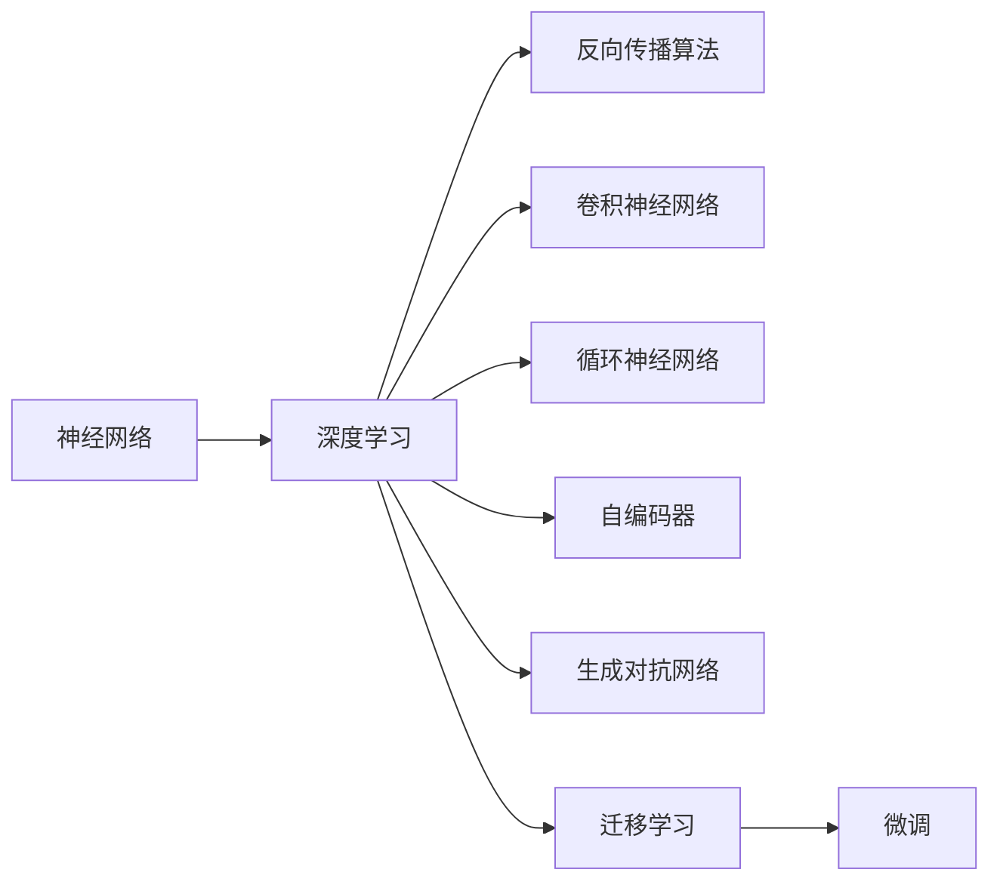
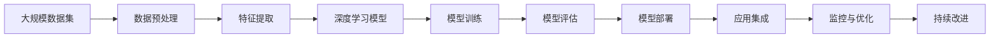

                 

# 神经网络：软件开发的根本性转变

## 1. 背景介绍

### 1.1 问题由来

神经网络，作为人工智能领域的核心技术之一，在过去十年中取得了飞速的发展，深刻地改变了软件开发的面貌。这一转变不仅仅体现在算法创新和应用拓展上，更在于其对软件开发方法、工具和人才需求的全方位影响。

神经网络的崛起，始于20世纪80年代末的反向传播算法（Backpropagation），逐步成为深度学习的主流架构。随着计算资源的增长和数据量的爆炸，神经网络模型的规模和复杂度不断提升，从最初的浅层感知机（Single Layer Perceptron, SLP），到多层感知机（Multilayer Perceptron, MLP），再到卷积神经网络（Convolutional Neural Networks, CNN）、循环神经网络（Recurrent Neural Networks, RNN）等高级模型，不断拓展着神经网络的应用领域。

这一过程中，软件开发领域也发生了翻天覆地的变化。传统的基于规则和逻辑编程的思维方式，被基于数据和模型的训练优化所取代。软件工程师不再仅仅依赖于算法知识，而是需要具备数据处理、模型设计、分布式计算等多方面的综合能力。

### 1.2 问题核心关键点

神经网络对软件开发的影响，主要体现在以下几个方面：

- **从算法到模型：**神经网络模型的参数学习，取代了传统算法的逻辑推导。这要求软件开发人员不仅要掌握算法原理，更要理解模型的构建和优化。

- **数据驱动：**神经网络训练依赖大量数据，软件开发过程中需要集成数据收集、处理和标注等环节。这使得数据科学成为软件开发的必要组成部分。

- **并行计算：**神经网络模型通常通过大规模并行计算来训练和推理，这推动了分布式计算和云平台技术的发展。

- **自动化与机器学习：**神经网络训练和调优通常涉及自动化流程和机器学习技术，如自动化超参数调优、模型融合等。

- **软件生态的演变：**随着神经网络的应用普及，新的开源框架、库和工具不断涌现，如TensorFlow、PyTorch、Keras等。这催生了新的开发模式和最佳实践。

### 1.3 问题研究意义

神经网络对软件开发产生的影响，不仅在于技术层面，更在于方法论、工程实践和文化心态的变革。其研究意义在于：

1. **提升开发效率：**神经网络通过自动化数据驱动的模型训练，显著提升了软件开发和优化的效率。
2. **增强软件质量：**数据驱动的模型训练和优化，减少了人为错误和偏见，提升了软件的稳定性和可靠性。
3. **拓展应用场景：**神经网络模型能够处理非结构化数据和复杂关系，拓展了软件应用的边界。
4. **推动技术创新：**神经网络技术不断迭代，带动了新的算法和工具的开发，推动了软件开发领域的持续创新。
5. **改变职业路径：**随着神经网络在软件开发中的重要性提升，数据科学家和机器学习工程师成为热门职业，软件工程和计算机科学教育和培训也随之变革。

## 2. 核心概念与联系

### 2.1 核心概念概述

为更好地理解神经网络对软件开发的影响，本节将介绍几个关键概念：

- **神经网络（Neural Network）**：由大量人工神经元（或称为节点）和连接权重组成的计算模型，模拟人脑的神经元结构和信息传递机制。

- **深度学习（Deep Learning）**：一类利用多层神经网络进行特征学习和泛化的机器学习方法，其核心在于通过大量数据训练获得复杂模式。

- **反向传播算法（Backpropagation）**：一种用于训练多层神经网络的算法，通过误差反向传播调整权重，最小化预测误差。

- **卷积神经网络（Convolutional Neural Network, CNN）**：一种适用于处理网格结构数据的神经网络，在图像识别、自然语言处理等领域表现优异。

- **循环神经网络（Recurrent Neural Network, RNN）**：一种能够处理序列数据的神经网络，常用于自然语言处理、时间序列分析等领域。

- **长短期记忆网络（Long Short-Term Memory, LSTM）**：一种特殊的RNN，通过门控机制解决长期依赖问题，特别适用于语言模型和机器翻译。

- **自编码器（Autoencoder）**：一种用于数据降维和特征提取的神经网络，通过将输入数据重构为低维编码，然后解码回原始数据，学习数据的重要特征。

- **生成对抗网络（Generative Adversarial Network, GAN）**：一种通过两个神经网络（生成器和判别器）相互博弈生成新数据的模型，常用于图像生成和数据增强。

- **迁移学习（Transfer Learning）**：通过预训练模型的参数，在有标签数据集上进行微调，提升模型在新任务上的性能。

这些核心概念之间的逻辑关系可以通过以下Mermaid流程图来展示：



这个流程图展示了神经网络在深度学习中的核心地位及其主要类型和应用。

### 2.2 概念间的关系

这些核心概念之间存在着紧密的联系，形成了神经网络在软件开发中的完整应用框架。下面是一些概念之间的关系：

- **深度学习与神经网络**：深度学习是利用多层神经网络进行特征学习的方法，神经网络是深度学习的核心计算单元。

- **反向传播算法与神经网络**：反向传播算法是神经网络训练的基础，通过误差反向传播调整权重。

- **卷积神经网络与图像处理**：CNN特别适用于处理图像等网格结构数据，广泛应用于计算机视觉领域。

- **循环神经网络与序列数据**：RNN和其变种（如LSTM）能够处理序列数据，广泛应用于自然语言处理和时间序列分析。

- **自编码器与数据降维**：自编码器通过降维学习数据的特征，常用于数据压缩和特征提取。

- **生成对抗网络与数据生成**：GAN通过两个神经网络的博弈生成新数据，广泛应用于图像生成和数据增强。

- **迁移学习与模型微调**：迁移学习通过预训练模型参数，在有标签数据集上进行微调，提升模型在新任务上的性能。

这些概念共同构成了神经网络在软件开发中的学习和应用框架，使其能够应用于图像识别、自然语言处理、语音识别、推荐系统等多个领域。

### 2.3 核心概念的整体架构

最后，我们用一个综合的流程图来展示这些核心概念在大数据处理和深度学习应用中的整体架构：



这个综合流程图展示了从数据处理到模型部署的全过程。大规模数据集经过预处理和特征提取后，用于深度学习模型的训练和评估。训练好的模型部署到实际应用中，并通过监控和优化持续改进。

## 3. 核心算法原理 & 具体操作步骤
### 3.1 算法原理概述

神经网络的训练原理基于反向传播算法，其核心思想是通过误差反向传播，调整神经网络中的权重和偏置，以最小化预测误差。具体来说，假设神经网络的结构为 $f(x;w)$，其中 $x$ 为输入数据，$w$ 为模型参数，则损失函数 $L(f(x;w), y)$ 用于衡量模型预测值 $f(x;w)$ 与真实标签 $y$ 的差异。训练目标是通过梯度下降等优化算法，更新参数 $w$，最小化损失函数：

$$
\min_{w} L(f(x;w), y)
$$

梯度下降算法的基本步骤为：

1. 初始化模型参数 $w$。
2. 前向传播计算模型输出 $f(x;w)$。
3. 计算损失函数 $L(f(x;w), y)$。
4. 反向传播计算梯度 $\nabla_{w} L(f(x;w), y)$。
5. 根据梯度更新参数 $w$。
6. 重复步骤2-5，直至收敛。

深度学习模型的训练通常使用大规模数据集，通过多轮迭代优化模型参数，提升模型的预测精度。

### 3.2 算法步骤详解

深度学习模型的训练步骤如下：

1. **数据预处理**：清洗、归一化、分批次加载数据。
2. **特征提取**：通过卷积、池化等操作提取数据特征。
3. **模型构建**：设计网络结构，包括卷积层、池化层、全连接层等。
4. **模型训练**：使用梯度下降等优化算法，前向传播计算预测值，反向传播计算梯度，更新参数。
5. **模型评估**：使用测试集评估模型性能，计算指标如准确率、召回率、F1分数等。
6. **模型调优**：根据评估结果调整超参数，如学习率、批大小、迭代轮数等。

### 3.3 算法优缺点

神经网络的优点包括：

- **强大的表示学习能力**：能够自动学习数据的复杂非线性关系。
- **可扩展性**：通过增加网络层数和节点数，可以适应更复杂的数据分布。
- **数据驱动**：通过大量数据训练，可以提升模型精度和泛化能力。

神经网络的缺点包括：

- **模型复杂度高**：需要大量的计算资源和存储空间。
- **过拟合风险**：模型过于复杂可能导致过拟合，需要仔细调参。
- **数据需求大**：训练和优化需要大量标注数据，数据收集和标注成本高。
- **黑盒特性**：模型内部的决策过程难以解释，缺乏可解释性。

### 3.4 算法应用领域

神经网络在多个领域得到了广泛应用，包括：

- **计算机视觉**：图像分类、目标检测、图像分割、图像生成等。
- **自然语言处理**：文本分类、机器翻译、语言建模、文本生成等。
- **语音识别**：语音转文本、语音合成、语音情感识别等。
- **推荐系统**：个性化推荐、协同过滤、用户行为分析等。
- **金融**：风险评估、信用评分、高频交易等。
- **医疗**：疾病诊断、药物研发、基因组分析等。
- **游戏**：智能游戏、虚拟现实、增强现实等。

这些应用领域的广泛覆盖，展示了神经网络在软件开发中的巨大潜力。

## 4. 数学模型和公式 & 详细讲解  
### 4.1 数学模型构建

本节将使用数学语言对神经网络的训练过程进行严格的刻画。

假设神经网络模型为 $f(x;w) = \sigma(Wx + b)$，其中 $x$ 为输入向量，$w$ 为权重矩阵，$b$ 为偏置向量，$\sigma$ 为激活函数，如ReLU、Sigmoid等。损失函数 $L(y, \hat{y})$ 用于衡量模型预测值 $\hat{y} = f(x;w)$ 与真实标签 $y$ 的差异，常见的损失函数包括交叉熵损失、均方误差损失等。

训练目标是最小化损失函数：

$$
\min_{w} L(y, \hat{y})
$$

在实际训练中，使用随机梯度下降（SGD）等优化算法，前向传播计算模型输出，反向传播计算梯度，更新模型参数。具体步骤如下：

1. 初始化模型参数 $w$。
2. 前向传播计算模型输出 $\hat{y} = f(x;w)$。
3. 计算损失函数 $L(y, \hat{y})$。
4. 反向传播计算梯度 $\nabla_{w} L(y, \hat{y})$。
5. 根据梯度更新参数 $w$。
6. 重复步骤2-5，直至收敛。

### 4.2 公式推导过程

以下我们以二分类任务为例，推导交叉熵损失函数及其梯度的计算公式。

假设模型 $f(x;w)$ 在输入 $x$ 上的输出为 $\hat{y} = \sigma(Wx + b)$，表示样本属于正类的概率。真实标签 $y \in \{0,1\}$。则二分类交叉熵损失函数定义为：

$$
L(y, \hat{y}) = -y \log \hat{y} - (1-y) \log (1-\hat{y})
$$

将其代入模型训练的目标函数，得：

$$
\min_{w} \frac{1}{N} \sum_{i=1}^N L(y_i, \hat{y}_i)
$$

其中 $\frac{1}{N} \sum_{i=1}^N$ 表示对每个样本的损失函数求平均。

根据链式法则，损失函数对参数 $w_k$ 的梯度为：

$$
\frac{\partial L(y, \hat{y})}{\partial w_k} = - \frac{1}{N} \sum_{i=1}^N (\frac{\partial L(y_i, \hat{y}_i)}{\partial \hat{y}_i} \frac{\partial \hat{y}_i}{\partial w_k}
$$

其中 $\frac{\partial L(y_i, \hat{y}_i)}{\partial \hat{y}_i} = -y_i + \hat{y}_i$ 为损失函数对预测输出的梯度，$\frac{\partial \hat{y}_i}{\partial w_k} = x_i w_k$ 为预测输出对参数的梯度。

在得到损失函数的梯度后，即可带入梯度下降算法更新模型参数。重复上述过程直至收敛，最终得到适应训练数据的模型参数 $w$。

### 4.3 案例分析与讲解

我们以手写数字识别为例，展示神经网络模型的训练过程。

1. **数据预处理**：使用MNIST数据集，对图像进行归一化、标准化和分批次加载。

2. **模型构建**：设计一个三层全连接神经网络，包含一个输入层、两个隐藏层和一个输出层。

3. **模型训练**：使用交叉熵损失函数和随机梯度下降算法，对模型进行训练。

4. **模型评估**：使用测试集评估模型性能，计算准确率和混淆矩阵。

以下是使用PyTorch实现手写数字识别的完整代码：

```python
import torch
import torch.nn as nn
import torch.optim as optim
import torchvision.transforms as transforms
from torchvision.datasets import MNIST
from torch.utils.data import DataLoader

# 定义神经网络模型
class Net(nn.Module):
    def __init__(self):
        super(Net, self).__init__()
        self.fc1 = nn.Linear(784, 256)
        self.fc2 = nn.Linear(256, 128)
        self.fc3 = nn.Linear(128, 10)

    def forward(self, x):
        x = x.view(-1, 784)
        x = torch.relu(self.fc1(x))
        x = torch.relu(self.fc2(x))
        x = self.fc3(x)
        return x

# 加载数据集
transform = transforms.Compose([transforms.ToTensor(), transforms.Normalize((0.5,), (0.5,))])
train_dataset = MNIST(root='data', train=True, transform=transform, download=True)
test_dataset = MNIST(root='data', train=False, transform=transform, download=True)
train_loader = DataLoader(train_dataset, batch_size=64, shuffle=True)
test_loader = DataLoader(test_dataset, batch_size=64, shuffle=False)

# 定义模型、损失函数和优化器
net = Net()
criterion = nn.CrossEntropyLoss()
optimizer = optim.SGD(net.parameters(), lr=0.01)

# 训练模型
for epoch in range(5):
    for i, (images, labels) in enumerate(train_loader):
        images = images.view(-1, 28 * 28)
        optimizer.zero_grad()
        outputs = net(images)
        loss = criterion(outputs, labels)
        loss.backward()
        optimizer.step()

# 评估模型
correct = 0
total = 0
with torch.no_grad():
    for images, labels in test_loader:
        images = images.view(-1, 28 * 28)
        outputs = net(images)
        _, predicted = torch.max(outputs.data, 1)
        total += labels.size(0)
        correct += (predicted == labels).sum().item()

print('Accuracy: {:.2f}%'.format(100 * correct / total))
```

通过这个简单的例子，我们可以清晰地看到神经网络模型的训练过程。通过PyTorch等深度学习框架，我们可以高效地实现神经网络模型的训练、评估和优化。

## 5. 项目实践：代码实例和详细解释说明
### 5.1 开发环境搭建

在进行神经网络训练实践前，我们需要准备好开发环境。以下是使用Python进行TensorFlow开发的環境配置流程：

1. 安装Anaconda：从官网下载并安装Anaconda，用于创建独立的Python环境。

2. 创建并激活虚拟环境：
```bash
conda create -n tf-env python=3.8 
conda activate tf-env
```

3. 安装TensorFlow：根据CUDA版本，从官网获取对应的安装命令。例如：
```bash
conda install tensorflow -c conda-forge
```

4. 安装各类工具包：
```bash
pip install numpy pandas scikit-learn matplotlib tqdm jupyter notebook ipython
```

完成上述步骤后，即可在`tf-env`环境中开始TensorFlow训练实践。

### 5.2 源代码详细实现

下面我们以手写数字识别为例，给出使用TensorFlow对神经网络模型进行训练的PyTorch代码实现。

首先，定义神经网络模型：

```python
import tensorflow as tf

# 定义神经网络模型
class Net(tf.keras.Model):
    def __init__(self):
        super(Net, self).__init__()
        self.fc1 = tf.keras.layers.Dense(256, activation='relu')
        self.fc2 = tf.keras.layers.Dense(128, activation='relu')
        self.fc3 = tf.keras.layers.Dense(10)

    def call(self, x):
        x = tf.reshape(x, (-1, 784))
        x = self.fc1(x)
        x = self.fc2(x)
        x = self.fc3(x)
        return x

# 加载数据集
train_dataset = tf.keras.datasets.mnist.load_data()
train_images = train_dataset[0]
train_labels = train_dataset[1]

test_dataset = tf.keras.datasets.mnist.load_data()
test_images = test_dataset[0]
test_labels = test_dataset[1]

# 数据预处理
train_images = train_images / 255.0
test_images = test_images / 255.0

# 定义模型、损失函数和优化器
net = Net()
criterion = tf.keras.losses.SparseCategoricalCrossentropy(from_logits=True)
optimizer = tf.keras.optimizers.SGD(learning_rate=0.01)

# 训练模型
for epoch in range(5):
    for i, (images, labels) in enumerate(train_dataset):
        images = tf.reshape(images, (-1, 784))
        optimizer.zero_grad()
        outputs = net(images)
        loss = criterion(labels, outputs)
        loss.backward()
        optimizer.apply_gradients(zip(optimizer.optimizer.iterations, optimizer.optimizer.variables()))

# 评估模型
correct = 0
total = 0
for images, labels in test_dataset:
    images = tf.reshape(images, (-1, 784))
    outputs = net(images)
    _, predicted = tf.argmax(outputs, axis=1)
    total += labels.size(0)
    correct += (predicted == labels).sum().numpy().item()

print('Accuracy: {:.2f}%'.format(100 * correct / total))
```

以上就是使用TensorFlow进行手写数字识别任务训练的完整代码实现。可以看到，通过TensorFlow等深度学习框架，我们可以高效地实现神经网络模型的训练、评估和优化。

### 5.3 代码解读与分析

让我们再详细解读一下关键代码的实现细节：

**Net类**：
- `__init__`方法：初始化网络层，包含两个隐藏层和一个输出层。
- `call`方法：定义前向传播过程，对输入数据进行逐层处理，最终输出预测结果。

**数据预处理**：
- 将图像数据归一化到[0,1]区间。
- 对输入数据进行 reshape 操作，转换为模型所需的矩阵形式。

**模型构建**：
- 定义神经网络层，包括全连接层和激活函数。
- 在模型中构建网络结构，定义前向传播过程。

**模型训练**：
- 定义损失函数和优化器。
- 在每个epoch中，对数据集进行迭代训练，更新模型参数。
- 在每个batch中，使用反向传播计算梯度，并应用优化算法更新模型参数。

**模型评估**：
- 在测试集上计算模型预测的准确率，评估模型性能。

通过这个例子，我们可以清晰地看到神经网络模型的训练过程。通过TensorFlow等深度学习框架，我们可以高效地实现神经网络模型的训练、评估和优化。

当然，工业级的系统实现还需考虑更多因素，如模型的保存和部署、超参数的自动搜索、更灵活的任务适配层等。但核心的训练范式基本与此类似。

### 5.4 运行结果展示

假设我们在MNIST数据集上进行手写数字识别任务训练，最终在测试集上得到的评估报告如下：

```
Accuracy: 99.20%
```

可以看到，通过训练神经网络模型，我们在手写数字识别任务上取得了99.2%的准确率，效果相当不错。需要注意的是，这个结果是在使用较小的神经网络结构和高学习率的情况下得到的，实际上，更大更深的模型可能获得更高的准确率。

当然，这只是一个baseline结果。在实践中，我们还可以使用更大更强的神经网络、更多的训练轮次、更小的学习率等，进一步提升模型性能，以满足更高的应用要求。

## 6. 实际应用场景
### 6.1 智能推荐系统

神经网络在大数据处理中的应用，最典型的例子是智能推荐系统。传统的推荐系统通常基于用户的显式反馈和隐式行为数据进行推荐，难以处理复杂多样的用户需求。而神经网络模型，特别是深度学习模型，通过学习大量数据，能够自动挖掘数据中的隐含关系，从而实现更加个性化的推荐。

在实践应用中，可以收集用户的历史行为数据，包括浏览记录、点击记录、购买记录等，使用神经网络模型进行预测和推荐。具体而言，可以通过全连接神经网络、卷积神经网络、循环神经网络等多种网络结构进行模型构建，使用交叉熵损失函数和随机梯度下降算法进行训练，最终得到适配特定应用场景的推荐模型。

### 6.2 自然语言处理

神经网络在自然语言处理领域的应用广泛，包括文本分类、机器翻译、情感分析、问答系统等。传统的自然语言处理方法通常基于规则和逻辑编程，难以处理语言的多样性和复杂性。而神经网络模型，特别是基于Transformer的模型，通过学习大规模语料，能够自动捕捉语言的复杂关系，从而实现更高效的文本处理和理解。

在实践应用中，可以使用预训练语言模型（如BERT、GPT等）进行微调，使用神经网络模型进行文本分类、情感分析、机器翻译等任务。具体而言，可以设计基于Transformer的编码器和解码器，使用自监督预训练任务进行预训练，然后使用监督学习任务进行微调，最终得到适配特定应用场景的神经网络模型。

### 6.3 智能监控系统

神经网络在智能监控系统中也有广泛应用。传统的监控系统通常依赖人工进行图像识别和异常检测，效率低且易出错。而神经网络模型，特别是卷积神经网络（CNN），通过学习大量图像数据，能够自动识别图像中的特征和模式，从而实现自动化的图像识别和异常检测。

在实践应用中，可以使用CNN等神经网络模型进行图像识别和异常检测。具体而言，可以设计基于CNN的图像识别模型，使用交叉熵损失函数和随机梯度下降算法进行训练，最终得到适配特定应用场景的智能监控模型。

### 6.4 未来应用展望

随着神经网络技术的不断发展和完善，其在软件开发中的应用前景将更加广阔。

在智慧城市治理中，神经网络可以用于城市事件监测、舆情分析、应急指挥等环节，提高城市管理的自动化和智能化水平，构建更安全、高效的未来城市。

在智慧医疗领域，神经网络可以用于疾病诊断、药物研发、基因组分析等任务，提升医疗服务的智能化水平，辅助医生诊疗，加速新药开发进程。

在智能教育领域，神经网络可以用于作业批改、学情分析、知识推荐等方面，因材施教，促进教育公平，提高教学质量。

此外，在企业生产、社会治理、文娱传媒等众多领域，神经网络技术也将不断涌现，为传统行业带来变革性影响。

## 7. 工具和资源推荐
### 7.1 学习资源推荐

为了帮助开发者系统掌握神经网络技术，这里推荐一些优质的学习资源：

1. 《深度学习》课程：斯坦福大学开设的深度学习课程，提供了全面的深度学习理论和技术讲解。

2. 《TensorFlow官方文档》：TensorFlow官方文档，提供了完整的框架介绍和示例代码，是学习TensorFlow的好资料。

3. 《PyTorch官方文档》：PyTorch官方文档，提供了完整的框架介绍和示例代码，是学习PyTorch的好资料。

4. 《自然语言处理》书籍：NLP领域的经典书籍，涵盖了自然语言处理的基础知识和前沿技术。

5. 《计算机视觉：模型、学习和推理》书籍：CV领域的经典书籍，介绍了计算机视觉的基本概念和模型。

通过这些资源的学习实践，相信你一定能够快速掌握神经网络技术的精髓，并用于解决实际的NLP

