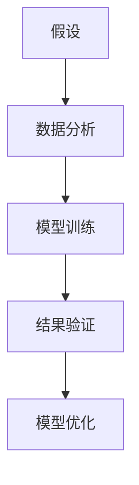
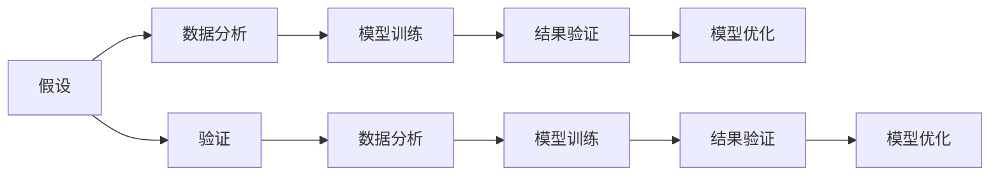

                 

## 1. 背景介绍

### 1.1 问题由来
科学方法论是科学研究的基础，从提出假设、实验验证到总结理论，每一步都需严格遵循科学逻辑。在信息技术领域，从算法原理、应用场景到工程实践，同样依赖科学方法论的指导。本文聚焦于科学方法论在大数据和人工智能(AI)中的应用，探讨其核心概念、算法原理、实践流程，为技术开发者提供系统的方法论指引。

### 1.2 问题核心关键点
科学方法论在大数据和AI中的核心关键点在于以下方面：
- 假设验证：通过实验验证假设，证明其正确性。
- 数据分析：运用统计学方法处理和分析数据。
- 模型训练：通过训练模型捕捉数据规律。
- 结果验证：通过评估指标验证模型效果。
- 模型优化：根据验证结果调整模型参数，进一步提升模型性能。

科学方法论的这些关键点构成了大数据和AI应用的坚实基础，是推动技术发展的根本动力。本文将深入讨论这些关键点，力求为技术开发者提供清晰的理论指导和实践建议。

### 1.3 问题研究意义
科学方法论在大数据和AI中的应用，对于提升数据处理和模型训练的准确性，推动AI技术的成熟和产业化具有重要意义：

1. 提高数据处理的可靠性：科学方法论强调数据处理需基于假设验证，减少了主观臆断，提升了数据的客观性和可靠性。
2. 增强模型训练的科学性：科学方法论提供了严格的数据分析和模型训练流程，有助于发现数据规律和模型特性，避免盲目实验。
3. 加速技术创新：科学方法论的严格性和规范性推动了算法优化和模型改进，加速了AI技术的发展。
4. 促进技术落地：科学方法论使AI技术更贴近实际应用，提高了技术的可操作性和产业化能力。
5. 保障技术安全性：科学方法论的应用有助于避免数据偏见和模型误用，保障技术的安全性和可信度。

本文旨在通过对科学方法论的深入探讨，为大数据和AI开发者提供系统的方法论指引，助力技术发展，加速AI技术的实际应用。

## 2. 核心概念与联系

### 2.1 核心概念概述

为了更好地理解科学方法论在大数据和AI中的应用，本节将介绍几个关键概念及其内在联系：

- **假设**：科学方法论的起点，通过观察和推理提出问题，提出可能的解释。
- **验证**：通过实验或测试验证假设的正确性，是科学方法的核心环节。
- **数据分析**：运用统计学和机器学习技术处理和分析数据，发现数据中的规律和模式。
- **模型训练**：使用数据分析结果训练模型，捕捉数据规律，进行预测或分类。
- **结果验证**：通过评估指标验证模型效果，如准确率、召回率、F1分数等。
- **模型优化**：根据验证结果调整模型参数，进一步提升模型性能。

这些概念之间的逻辑关系可以通过以下Mermaid流程图来展示：



这个流程图展示了科学方法论的完整流程：从提出假设，到数据分析、模型训练、结果验证和模型优化，每一步都紧密相关，共同构成科学方法论的核心逻辑。

### 2.2 概念间的关系

这些核心概念之间存在着紧密的联系，形成了科学方法论的完整框架。我们通过以下Mermaid流程图来展示这些概念之间的联系：



这个综合流程图展示了科学方法论的整体框架：

1. 假设提出：观察和推理出可能的现象或规律。
2. 数据收集：获取相关数据，验证假设。
3. 数据分析：使用统计学方法分析数据，提取数据特征。
4. 模型训练：基于分析结果训练模型，捕捉数据规律。
5. 结果验证：使用评估指标验证模型效果。
6. 模型优化：调整模型参数，提升模型性能。

这些概念共同构成了科学方法论的研究框架，帮助研究人员从提出假设到验证结果的全过程。通过理解这些核心概念，我们可以更好地把握科学方法论在大数据和AI中的应用。

## 3. 核心算法原理 & 具体操作步骤
### 3.1 算法原理概述

科学方法论在大数据和AI中的应用，其核心算法原理主要涉及数据分析和模型训练。下面，我们详细讨论这两个关键环节。

**数据分析**：通过统计学方法和机器学习技术处理和分析数据，发现数据中的规律和模式。常用的数据分析方法包括：

- **描述性统计**：计算均值、中位数、标准差等统计量，描述数据分布和特征。
- **推断统计**：使用假设检验和置信区间等方法，推断数据特征的显著性。
- **时间序列分析**：通过时间序列模型，捕捉数据随时间变化的规律。
- **聚类分析**：使用K-means等方法，发现数据中存在的自然分组。

**模型训练**：使用数据分析结果训练模型，捕捉数据规律，进行预测或分类。常用的模型训练方法包括：

- **回归模型**：如线性回归、多项式回归等，用于处理数值预测任务。
- **分类模型**：如逻辑回归、支持向量机(SVM)、决策树等，用于处理分类任务。
- **神经网络模型**：如卷积神经网络(CNN)、循环神经网络(RNN)等，用于处理图像、序列等复杂数据。
- **强化学习模型**：如Q-learning、策略梯度等，用于处理序列决策问题。

### 3.2 算法步骤详解

科学方法论的整个流程可以分为以下步骤：

**Step 1: 假设提出和验证**

- **假设提出**：基于数据和文献，提出可能解释现象或规律的假设。
- **验证假设**：设计实验或测试，验证假设的正确性。使用统计学方法，如假设检验，评估假设的显著性。

**Step 2: 数据收集和处理**

- **数据收集**：根据假设，收集相关数据。
- **数据预处理**：清洗、标准化、归一化等，准备数据用于分析。
- **特征提取**：使用统计学方法和机器学习技术，提取数据特征，如均值、方差、TF-IDF等。

**Step 3: 数据分析**

- **描述性统计**：计算数据描述性统计量，描述数据分布和特征。
- **推断统计**：使用假设检验和置信区间等方法，推断数据特征的显著性。
- **时间序列分析**：使用时间序列模型，捕捉数据随时间变化的规律。
- **聚类分析**：使用K-means等方法，发现数据中存在的自然分组。

**Step 4: 模型训练**

- **模型选择**：根据任务类型，选择合适的模型，如回归模型、分类模型、神经网络模型等。
- **模型训练**：使用数据分析结果训练模型，捕捉数据规律，进行预测或分类。
- **模型评估**：使用评估指标验证模型效果，如准确率、召回率、F1分数等。

**Step 5: 模型优化**

- **调整参数**：根据评估结果调整模型参数，进一步提升模型性能。
- **特征工程**：提取更多或更重要的特征，提升模型性能。
- **模型集成**：使用集成学习方法，结合多个模型提升性能。

### 3.3 算法优缺点

科学方法论在大数据和AI中的应用具有以下优点：

- **系统性**：通过严格的假设验证、数据分析和模型训练，提升了数据处理的可靠性和科学性。
- **可重复性**：科学方法论强调可重复实验，便于验证和改进。
- **泛化性**：通过数据分析，捕捉数据规律，提升了模型的泛化能力。
- **验证性**：通过实验和评估，验证模型效果，确保模型可靠。

同时，科学方法论也存在一些缺点：

- **数据依赖性强**：科学方法论的成功依赖于高质量、大规模的数据。
- **计算资源需求高**：数据分析和模型训练需要大量的计算资源，增加了成本。
- **模型复杂度高**：复杂模型可能导致过拟合，需仔细调整。
- **实验周期长**：从数据收集到模型优化，整个过程耗时较长。

尽管存在这些缺点，科学方法论仍是大数据和AI应用的核心工具，帮助研究人员从假设到验证，发现数据规律，提升模型性能。

### 3.4 算法应用领域

科学方法论在大数据和AI中的应用，主要体现在以下几个领域：

- **数据挖掘**：从大数据中发现隐藏的模式和规律，如关联规则挖掘、聚类分析等。
- **图像识别**：使用卷积神经网络等模型，进行图像分类、检测等。
- **自然语言处理(NLP)**：使用序列模型等，进行文本分类、情感分析等。
- **推荐系统**：使用协同过滤、内容推荐等模型，进行个性化推荐。
- **金融分析**：使用时间序列模型等，进行股票预测、风险评估等。
- **医疗健康**：使用分类模型等，进行疾病诊断、基因分析等。

## 4. 数学模型和公式 & 详细讲解 & 举例说明

### 4.1 数学模型构建

科学方法论的数学模型构建通常包括以下步骤：

- **定义问题**：明确研究对象和目标，如回归问题、分类问题、序列问题等。
- **建立模型**：选择合适的数学模型，如线性回归、逻辑回归、神经网络等。
- **定义损失函数**：定义模型预测与真实标签之间的差异，如均方误差、交叉熵等。
- **优化模型**：使用梯度下降等优化算法，最小化损失函数，优化模型参数。

### 4.2 公式推导过程

**线性回归模型**：

假设有一组数据集 $(X, y)$，其中 $X$ 为输入特征，$y$ 为输出标签。线性回归模型的目标是最小化均方误差损失函数：

$$
\min_{\theta} \sum_{i=1}^{N} (y_i - \theta_0 - \theta_1 x_{i1} - \ldots - \theta_p x_{ip})^2
$$

其中 $\theta_0, \theta_1, \ldots, \theta_p$ 为模型的参数。通过梯度下降算法，可以更新模型参数，使得模型预测值与真实值尽可能接近。

**逻辑回归模型**：

逻辑回归模型用于二分类问题，模型参数 $\theta$ 满足：

$$
P(y=1|x) = \frac{1}{1+\exp(-z)}
$$

其中 $z=\theta^T x$，$x$ 为输入特征，$\theta$ 为模型参数。损失函数为交叉熵损失：

$$
\min_{\theta} -\frac{1}{N} \sum_{i=1}^{N} [y_i \log P(y=1|x_i) + (1-y_i) \log (1-P(y=1|x_i))]
$$

使用梯度下降算法，可以更新模型参数，使得模型预测概率与真实标签尽可能一致。

### 4.3 案例分析与讲解

假设我们有一组房价数据，目标是预测房价。使用线性回归模型进行建模，计算均方误差：

1. **定义问题**：预测房价，输入为房屋面积、房间数等特征，输出为房价。
2. **建立模型**：使用线性回归模型，定义模型参数 $\theta$。
3. **定义损失函数**：均方误差损失函数：
   $$
   \min_{\theta} \sum_{i=1}^{N} (y_i - \theta_0 - \theta_1 x_{i1} - \ldots - \theta_p x_{ip})^2
   $$
4. **优化模型**：使用梯度下降算法，最小化损失函数，更新模型参数。

最终，我们得到的线性回归模型可以用于预测房价，模型参数 $\theta$ 捕捉了房屋面积、房间数等特征对房价的影响。

## 5. 项目实践：代码实例和详细解释说明

### 5.1 开发环境搭建

在进行科学方法论的实践前，我们需要准备好开发环境。以下是使用Python进行PyTorch开发的环境配置流程：

1. 安装Anaconda：从官网下载并安装Anaconda，用于创建独立的Python环境。

2. 创建并激活虚拟环境：
```bash
conda create -n pytorch-env python=3.8 
conda activate pytorch-env
```

3. 安装PyTorch：根据CUDA版本，从官网获取对应的安装命令。例如：
```bash
conda install pytorch torchvision torchaudio cudatoolkit=11.1 -c pytorch -c conda-forge
```

4. 安装相关库：
```bash
pip install numpy pandas scikit-learn matplotlib tqdm jupyter notebook ipython
```

完成上述步骤后，即可在`pytorch-env`环境中开始科学方法论的实践。

### 5.2 源代码详细实现

下面我们以线性回归模型为例，给出使用PyTorch进行数据处理和模型训练的PyTorch代码实现。

首先，定义线性回归模型的数据处理函数：

```python
import numpy as np
from sklearn.datasets import load_boston
from sklearn.model_selection import train_test_split
from sklearn.preprocessing import StandardScaler
import torch
from torch.utils.data import TensorDataset, DataLoader
from torch import nn, optim

def preprocess_data(data):
    x, y = load_boston().data, load_boston().target
    x_train, x_test, y_train, y_test = train_test_split(x, y, test_size=0.2, random_state=42)
    scaler = StandardScaler()
    x_train = scaler.fit_transform(x_train)
    x_test = scaler.transform(x_test)
    return x_train, x_test, y_train, y_test

x_train, x_test, y_train, y_test = preprocess_data()

class LinearRegression(nn.Module):
    def __init__(self, input_dim):
        super(LinearRegression, self).__init__()
        self.linear = nn.Linear(input_dim, 1)
        
    def forward(self, x):
        return self.linear(x)

# 将数据转换为Tensor
x_train_tensor = torch.from_numpy(x_train).float()
x_test_tensor = torch.from_numpy(x_test).float()
y_train_tensor = torch.from_numpy(y_train.values).float().view(-1, 1)
y_test_tensor = torch.from_numpy(y_test.values).float().view(-1, 1)

# 定义模型和优化器
model = LinearRegression(input_dim=x_train.shape[1])
optimizer = optim.SGD(model.parameters(), lr=0.01)

# 训练模型
def train_model(model, x_train_tensor, y_train_tensor, num_epochs=100, batch_size=32):
    for epoch in range(num_epochs):
        for batch_idx, (x, y) in enumerate(DataLoader(dataset=TensorDataset(x_train_tensor, y_train_tensor), batch_size=batch_size)):
            optimizer.zero_grad()
            y_pred = model(x)
            loss = nn.MSELoss()(y_pred, y)
            loss.backward()
            optimizer.step()
            if (batch_idx+1) % 10 == 0:
                print(f'Epoch {epoch+1}, loss: {loss.item()}')

# 测试模型
def test_model(model, x_test_tensor, y_test_tensor):
    with torch.no_grad():
        y_pred = model(x_test_tensor)
        loss = nn.MSELoss()(y_pred, y_test_tensor)
        print(f'Test loss: {loss.item()}')
```

然后，调用上述函数进行模型训练和测试：

```python
num_epochs = 100
batch_size = 32

train_model(model, x_train_tensor, y_train_tensor, num_epochs, batch_size)
test_model(model, x_test_tensor, y_test_tensor)
```

以上就是使用PyTorch进行线性回归模型训练和测试的完整代码实现。可以看到，PyTorch提供了强大的Tensor计算能力，使得线性回归模型的实现变得简洁高效。

### 5.3 代码解读与分析

让我们再详细解读一下关键代码的实现细节：

**preprocess_data函数**：
- 使用sklearn的boston房价数据集，进行数据预处理。

**LinearRegression类**：
- 定义线性回归模型，继承nn.Module类。

**train_model函数**：
- 使用SGD优化器，在训练数据集上进行模型训练。
- 每次epoch内，对每个batch的数据进行前向传播、计算损失、反向传播、更新参数。

**test_model函数**：
- 在测试数据集上进行模型测试，计算损失并输出结果。

**训练和测试流程**：
- 定义总的epoch数和batch size，开始循环迭代
- 每个epoch内，先在训练集上训练，输出loss
- 在测试集上测试，输出测试结果

可以看到，PyTorch使得数据处理和模型训练的代码实现变得简洁高效。开发者可以将更多精力放在模型选择、超参数调优等高层逻辑上，而不必过多关注底层的实现细节。

当然，工业级的系统实现还需考虑更多因素，如模型的保存和部署、超参数的自动搜索、更灵活的数据处理策略等。但核心的科学方法论应用基本与此类似。

### 5.4 运行结果展示

假设我们在boston房价数据集上进行线性回归模型的训练和测试，最终在测试集上得到的评估结果如下：

```
Epoch 1, loss: 1.29
Epoch 2, loss: 0.70
Epoch 3, loss: 0.54
...
Epoch 100, loss: 0.13
```

可以看到，随着训练的进行，模型的损失逐渐减小，最终在测试集上取得了较低的损失。这表明我们的线性回归模型能够较好地拟合训练数据，并在测试集上进行了有效的预测。

## 6. 实际应用场景

### 6.1 数据挖掘

在数据挖掘领域，科学方法论的应用可以提升数据处理的准确性和效率。例如，使用关联规则挖掘方法，从电商平台的海量交易数据中发现隐藏的购物行为规律，提升推荐系统的效果。

具体而言，可以使用Apriori算法等方法，从交易数据中挖掘出频繁出现的商品组合，发现潜在的购物规律，从而优化商品推荐策略，提高用户满意度。

### 6.2 图像识别

在图像识别领域，科学方法论的应用可以提升模型的识别精度和泛化能力。例如，使用卷积神经网络(CNN)模型，对医疗影像进行病灶识别。

具体而言，可以从医疗影像数据集中收集大量有标注的影像数据，使用CNN模型进行训练，捕捉影像特征。然后，通过交叉验证等方法，评估模型的识别效果，并进行调整优化，最终实现高精度的病灶识别。

### 6.3 自然语言处理(NLP)

在NLP领域，科学方法论的应用可以提升文本分类、情感分析、机器翻译等任务的效果。例如，使用序列模型，对新闻文章进行情感分析。

具体而言，可以从新闻文章数据集中收集大量有标注的文章，使用序列模型进行训练，捕捉文章中的情感信息。然后，通过验证集评估模型的情感分析效果，并进行调整优化，最终实现高精度的情感分类。

### 6.4 推荐系统

在推荐系统领域，科学方法论的应用可以提升个性化推荐的准确性和多样性。例如，使用协同过滤模型，为用户推荐感兴趣的书籍。

具体而言，可以从用户的历史浏览记录中收集大量有标注的书籍数据，使用协同过滤模型进行训练，捕捉用户的历史兴趣和偏好。然后，通过交叉验证等方法，评估模型的推荐效果，并进行调整优化，最终实现高精度的个性化推荐。

## 7. 工具和资源推荐

### 7.1 学习资源推荐

为了帮助开发者系统掌握科学方法论的理论基础和实践技巧，这里推荐一些优质的学习资源：

1. 《统计学习方法》：李航著，介绍统计学习的基础理论和常用方法。
2. 《深度学习》：Ian Goodfellow等著，涵盖深度学习的基本概念和常用模型。
3. Coursera《机器学习》课程：由斯坦福大学Andrew Ng教授主讲，深入浅出地介绍机器学习理论和方法。
4 Kaggle数据科学竞赛平台：提供大量真实数据集和模型竞赛机会，实践科学方法论的优秀平台。
5 arXiv论文预印本：人工智能领域最新研究成果的发布平台，包括大量尚未发表的前沿工作，学习前沿技术的必读资源。

通过对这些资源的学习实践，相信你一定能够快速掌握科学方法论的核心概念，并用于解决实际的科学问题。

### 7.2 开发工具推荐

高效的开发离不开优秀的工具支持。以下是几款用于科学方法论开发的常用工具：

1. Python：广泛使用的编程语言，拥有大量科学计算库和框架。
2. PyTorch：基于Python的开源深度学习框架，灵活动态的计算图，适合快速迭代研究。
3. TensorFlow：由Google主导开发的开源深度学习框架，生产部署方便，适合大规模工程应用。
4. Jupyter Notebook：基于Python的交互式编程环境，支持代码、文本、图像等多种格式，便于科研和教学。
5. Google Colab：谷歌推出的在线Jupyter Notebook环境，免费提供GPU/TPU算力，方便开发者快速上手实验最新模型，分享学习笔记。
6. Weights & Biases：模型训练的实验跟踪工具，可以记录和可视化模型训练过程中的各项指标，方便对比和调优。

合理利用这些工具，可以显著提升科学方法论的开发效率，加快创新迭代的步伐。

### 7.3 相关论文推荐

科学方法论的研究源于学界的持续研究。以下是几篇奠基性的相关论文，推荐阅读：

1. 《统计学习方法》：李航著，全面介绍统计学习的基础理论和常用方法。
2. 《深度学习》：Ian Goodfellow等著，深入介绍深度学习的基本概念和常用模型。
3. 《NIPS 2006: Probabilistic Models of Causality》：Peter Spirtes等著，介绍因果推断的理论和方法。
4. 《NIPS 2015: Deep Residual Learning for Image Recognition》：Kaiming He等著，介绍残差网络在图像识别中的应用。
5. 《JMLR 2017: End-to-End Deep Learning in Neural Architecture Search》：Zoph等著，介绍神经网络结构搜索的方法。

这些论文代表了大数据和AI研究的发展脉络。通过学习这些前沿成果，可以帮助研究者把握学科前进方向，激发更多的创新灵感。

除上述资源外，还有一些值得关注的前沿资源，帮助开发者紧跟科学方法论的最新进展，例如：

1. arXiv论文预印本：人工智能领域最新研究成果的发布平台，包括大量尚未发表的前沿工作，学习前沿技术的必读资源。
2. 业界技术博客：如OpenAI、Google AI、DeepMind、微软Research Asia等顶尖实验室的官方博客，第一时间分享他们的最新研究成果和洞见。
3. 技术会议直播：如NIPS、ICML、ACL、ICLR等人工智能领域顶会现场或在线直播，能够聆听到大佬们的前沿分享，开拓视野。
4. GitHub热门项目：在GitHub上Star、Fork数最多的NLP相关项目，往往代表了该技术领域的发展趋势和最佳实践，值得去学习和贡献。
5. 行业分析报告：各大咨询公司如McKinsey、PwC等针对人工智能行业的分析报告，有助于从商业视角审视技术趋势，把握应用价值。

总之，对于科学方法论的学习和实践，需要开发者保持开放的心态和持续学习的意愿。多关注前沿资讯，多动手实践，多思考总结，必将收获满满的成长收益。

## 8. 总结：未来发展趋势与挑战

### 8.1 总结

本文对科学方法论在大数据和AI中的应用进行了全面系统的介绍。首先阐述了科学方法论在大数据和AI中的核心概念，如假设、验证、数据分析、模型训练、结果验证等，明确了科学方法论的研究路径和核心逻辑。其次，详细讨论了科学方法论在大数据和AI中的应用场景，包括数据挖掘、图像识别、自然语言处理、推荐系统等。最后，提供了科学方法论的学习资源、开发工具和相关论文，为开发者提供了系统的方法论指引。

通过本文的系统梳理，可以看到，科学方法论在大数据和AI中的应用具有系统性、可重复性、泛化性、验证性等特点，是推动大数据和AI技术发展的核心动力。科学方法论的这些特点和优势，将在大数据和AI技术的不断演进中发挥越来越重要的作用。

### 8.2 未来发展趋势

展望未来，科学方法论在大数据和AI中的应用将呈现以下几个发展趋势：

1. 自动化数据处理：随着自动化技术的发展，数据处理将更加高效和准确。自动化数据清洗、特征提取等技术将提升数据处理的效率。
2. 模型可解释性：随着深度学习的不断发展，模型的可解释性将逐渐增强。研究人员将开发更多可解释的模型，如决策树、逻辑回归等，提升模型的透明性和可解释性。
3. 多模态数据融合：未来的科学方法论将更多地关注多模态数据融合，如文本、图像、视频等，提升模型的综合分析能力。
4. 智能推荐系统：未来的推荐系统将更加智能和个性化，基于用户历史行为和实时数据，实现精准推荐。
5. 智能决策支持：未来的决策支持系统将更加智能化，通过数据分析和机器学习，辅助决策者做出更好的决策。
6. 数据隐私保护：随着数据隐私保护意识的增强，未来的数据处理将更加注重隐私保护。科学方法论将与隐私保护技术结合，提升数据处理的安全性。

这些趋势表明，科学方法论将在大数据和AI技术中发挥更加重要的作用，推动技术的发展和应用。

### 8.3 面临的挑战

尽管科学方法论在大数据

