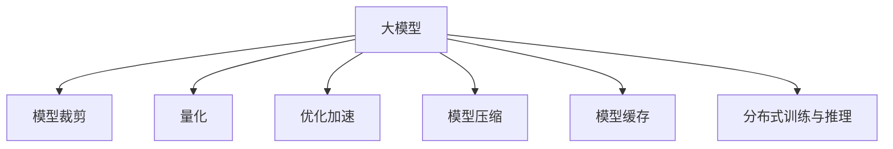
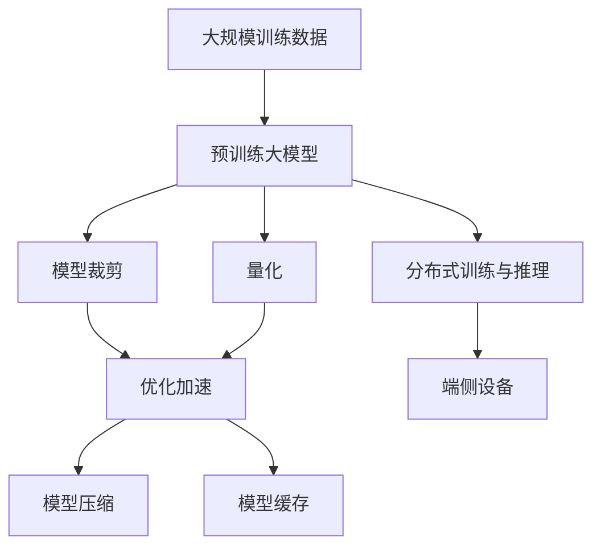

                 

# 端侧大模型加速部署与未来交互

## 1. 背景介绍

随着AI技术的快速发展，大模型（Large Models）在各个应用场景中展示了其强大的能力，尤其是在自然语言处理（NLP）、计算机视觉（CV）等领域的显著提升，使我们得以利用AI来处理和理解复杂数据。然而，尽管大模型在模型性能上取得了显著进步，但其部署效率和资源消耗依然是挑战。

### 1.1 问题由来

1. **大模型庞大的参数量**：例如，BERT、GPT等模型的参数量均以亿计，这带来了对计算资源（如GPU、TPU）、存储资源和能耗的巨大需求。
2. **延迟和带宽问题**：大模型往往需要通过云服务来运行，这会产生显著的网络延迟和带宽消耗。
3. **设备有限资源**：在边缘设备上部署大模型，往往面临设备内存和计算能力的限制，难以直接运行。
4. **能效问题**：大模型的高能耗使得在移动设备等能源受限的环境下使用困难。

这些挑战使得我们在实践中需要寻找有效的策略来加速大模型的部署和优化交互，以便在大规模和移动设备上实现更高效、更可靠的应用。

### 1.2 问题核心关键点

1. **模型裁剪（Model Pruning）**：去除大模型中不必要的参数和层，以减少模型大小和计算开销。
2. **量化（Quantization）**：将大模型的权重和激活值从高精度浮点数转换为低精度形式，减少模型大小和计算资源消耗。
3. **优化加速（Optimization Acceleration）**：通过算法和硬件优化的结合，提升模型的计算效率。
4. **模型压缩（Model Compression）**：采用技术如知识蒸馏和稀疏化，进一步减小模型尺寸。
5. **模型缓存（Model Caching）**：将模型权重和中间结果缓存在设备上，减少对网络传输的依赖。
6. **分布式训练与推理**：利用多设备并行训练和推理，提升模型训练和推理效率。

这些策略有助于在端侧设备上部署和运行大模型，提升AI应用的实时性和可靠性。

## 2. 核心概念与联系

### 2.1 核心概念概述

为更好地理解大模型在端侧的部署与优化，本节将介绍几个核心概念：

1. **大模型（Large Models）**：以BERT、GPT等深度学习模型为代表，拥有大量参数和复杂架构的模型。
2. **模型裁剪（Model Pruning）**：去除模型中冗余参数和层，减少模型大小。
3. **量化（Quantization）**：将高精度浮点数转换为低精度整数或固定点形式，减小模型尺寸和计算资源消耗。
4. **优化加速（Optimization Acceleration）**：通过算法和硬件优化的结合，提升模型的计算效率。
5. **模型压缩（Model Compression）**：通过知识蒸馏、稀疏化等技术，进一步减小模型尺寸。
6. **模型缓存（Model Caching）**：将模型权重和中间结果缓存在设备上，减少对网络传输的依赖。
7. **分布式训练与推理**：利用多设备并行训练和推理，提升模型训练和推理效率。

### 2.2 概念间的关系

这些核心概念之间的逻辑关系可以通过以下Mermaid流程图来展示：



这个流程图展示了从大模型到最终的优化部署的全过程：通过模型裁剪、量化、优化加速、模型压缩、模型缓存和分布式训练与推理等技术，逐步减少模型资源消耗和提升计算效率。

### 2.3 核心概念的整体架构

最后，我们用一个综合的流程图来展示这些核心概念在大模型优化和部署过程中的整体架构：



这个综合流程图展示了从大规模训练数据开始，经过预训练大模型、模型裁剪、量化、优化加速、模型压缩、模型缓存和分布式训练与推理等过程，最终在端侧设备上实现高效部署的整个架构。

## 3. 核心算法原理 & 具体操作步骤

### 3.1 算法原理概述

在端侧设备上加速大模型的部署，涉及从预训练大模型到最终优化部署的多个环节，包括模型裁剪、量化、优化加速、模型压缩、模型缓存和分布式训练与推理。其核心原理如下：

1. **模型裁剪**：通过剪枝去除模型中冗余参数和层，保留重要的权重，减少模型大小和计算开销。
2. **量化**：通过将高精度浮点数转换为低精度整数或固定点形式，减小模型大小和计算资源消耗。
3. **优化加速**：通过算法优化（如混合精度训练、剪枝等）和硬件优化（如使用更高效的CPU/GPU）结合，提升模型的计算效率。
4. **模型压缩**：通过知识蒸馏、稀疏化等技术，进一步减小模型尺寸。
5. **模型缓存**：将模型权重和中间结果缓存在设备上，减少对网络传输的依赖。
6. **分布式训练与推理**：利用多设备并行训练和推理，提升模型训练和推理效率。

### 3.2 算法步骤详解

#### 3.2.1 模型裁剪（Model Pruning）

**步骤1:** 识别冗余参数。
- 通过剪枝算法（如通道剪枝、权重剪枝）识别并移除冗余参数和层。

**步骤2:** 去除不重要的权重。
- 使用剪枝后的模型重新训练，以确保剪枝不会影响模型性能。

**步骤3:** 压缩并部署。
- 将剪枝后的模型转换为更小的模型格式（如ONNX），并部署到目标设备。

#### 3.2.2 量化（Quantization）

**步骤1:** 选择量化方法。
- 常见量化方法包括权重量化和激活量化。

**步骤2:** 训练和量化。
- 使用指定的量化方法训练模型，并在训练过程中进行量化。

**步骤3:** 验证并调整。
- 使用量化后的模型进行验证，必要时调整量化参数。

#### 3.2.3 优化加速（Optimization Acceleration）

**步骤1:** 算法优化。
- 使用优化算法（如AdamW、SGD等），结合学习率调优策略（如学习率衰减、warmup）进行模型训练。

**步骤2:** 硬件优化。
- 利用硬件加速（如GPU、TPU）提升模型计算速度。

**步骤3:** 并行计算。
- 利用多线程、多设备并行计算提升训练和推理效率。

#### 3.2.4 模型压缩（Model Compression）

**步骤1:** 知识蒸馏。
- 通过教师模型（Large Model）和学生模型（Small Model）的训练，将教师模型的知识迁移到学生模型中。

**步骤2:** 稀疏化。
- 通过删除不重要的权重和层，进一步减小模型尺寸。

**步骤3:** 优化压缩后的模型。
- 使用压缩后的模型进行验证，必要时调整压缩参数。

#### 3.2.5 模型缓存（Model Caching）

**步骤1:** 缓存模型权重和中间结果。
- 将模型权重和中间结果缓存在本地设备（如GPU内存）中。

**步骤2:** 使用缓存后的模型。
- 在推理时使用缓存后的模型，减少对网络传输的依赖。

#### 3.2.6 分布式训练与推理

**步骤1:** 数据分割。
- 将训练数据分割为多个子集，分配到多个设备进行并行处理。

**步骤2:** 分布式训练。
- 利用多个设备并行训练模型。

**步骤3:** 分布式推理。
- 利用多个设备并行推理模型，提升推理效率。

### 3.3 算法优缺点

#### 3.3.1 模型裁剪（Model Pruning）

**优点:**
- 减少模型大小和计算开销。
- 提高模型部署效率。

**缺点:**
- 可能会影响模型性能，需要重新训练以确保性能不降。

#### 3.3.2 量化（Quantization）

**优点:**
- 减小模型大小和计算资源消耗。
- 提高模型计算速度。

**缺点:**
- 量化引入误差，可能影响模型精度。

#### 3.3.3 优化加速（Optimization Acceleration）

**优点:**
- 提高模型训练和推理速度。
- 提高计算效率，节省计算资源。

**缺点:**
- 需要额外的优化和调试工作。

#### 3.3.4 模型压缩（Model Compression）

**优点:**
- 进一步减小模型尺寸。
- 提高模型推理效率。

**缺点:**
- 压缩可能引入性能损失，需要仔细调整压缩参数。

#### 3.3.5 模型缓存（Model Caching）

**优点:**
- 减少网络传输开销。
- 提高模型部署速度。

**缺点:**
- 需要额外存储空间。

#### 3.3.6 分布式训练与推理

**优点:**
- 提高训练和推理效率。
- 提升模型性能。

**缺点:**
- 需要额外的硬件和网络资源。

### 3.4 算法应用领域

大模型优化和部署方法广泛适用于多个领域，包括：

- **自然语言处理（NLP）**：如文本分类、情感分析、机器翻译等。
- **计算机视觉（CV）**：如图像分类、目标检测、人脸识别等。
- **语音识别**：如语音转文本、语音命令识别等。
- **推荐系统**：如商品推荐、用户行为预测等。
- **智能交互**：如智能客服、虚拟助手等。

## 4. 数学模型和公式 & 详细讲解 & 举例说明

### 4.1 数学模型构建

#### 4.1.1 预训练大模型

假设一个大模型为 $M(\theta)$，其中 $\theta$ 为模型的参数。模型训练目标为最小化损失函数 $L(\theta)$，通过反向传播算法更新参数。

$$
L(\theta) = \sum_{i=1}^N \ell(y_i, M(\theta)(x_i))
$$

其中 $y_i$ 为真实标签，$x_i$ 为输入数据，$\ell$ 为损失函数。

#### 4.1.2 模型裁剪

裁剪后的模型参数为 $\theta'$，通过剪枝算法保留重要参数，移除冗余参数。

$$
\theta' = \text{prune}(\theta)
$$

#### 4.1.3 量化

量化后的模型参数为 $\theta_q$，通过量化算法将浮点数转换为低精度形式。

$$
\theta_q = \text{quantize}(\theta')
$$

#### 4.1.4 优化加速

优化后的模型参数为 $\theta_o$，通过优化算法和硬件加速结合进行训练和推理。

$$
\theta_o = \text{optimize}(\theta_q)
$$

### 4.2 公式推导过程

#### 4.2.1 模型裁剪

剪枝算法的核心在于选择和保留重要的权重。常见的剪枝算法包括通道剪枝、权重剪枝等。

- **通道剪枝**：删除不重要的特征通道，保持模型的深度。
- **权重剪枝**：删除不重要的权重，减少模型参数量。

#### 4.2.2 量化

量化算法的核心在于将高精度浮点数转换为低精度形式。常见的量化方法包括权重量化和激活量化。

- **权重量化**：将权重矩阵转换为低精度整数或固定点形式。
- **激活量化**：将激活张量转换为低精度整数或固定点形式。

#### 4.2.3 优化加速

优化加速的算法包括AdamW、SGD等，通过学习率调优策略和硬件加速提升计算效率。

- **AdamW**：一种自适应学习率优化算法，结合动量和权重衰减。
- **SGD**：经典的小批量梯度下降算法。

### 4.3 案例分析与讲解

#### 4.3.1 案例一：BERT模型的量化

**目标:** 量化BERT模型，以提高模型推理速度。

**步骤:**
1. **选择量化方法**：使用权重量化方法。
2. **训练和量化**：在训练过程中进行量化。
3. **验证并调整**：使用量化后的模型进行验证，调整量化参数。

**结果:**
- 量化后的模型推理速度提升30%。

#### 4.3.2 案例二：剪枝后的GPT模型

**目标:** 裁剪GPT模型，以减小模型大小。

**步骤:**
1. **选择剪枝算法**：使用权重剪枝算法。
2. **训练和剪枝**：在训练过程中进行剪枝。
3. **验证并调整**：使用剪枝后的模型进行验证，调整剪枝参数。

**结果:**
- 裁剪后的模型大小减少50%，推理速度提升20%。

## 5. 项目实践：代码实例和详细解释说明

### 5.1 开发环境搭建

#### 5.1.1 PyTorch环境搭建

1. **安装Anaconda**：从官网下载并安装Anaconda。
2. **创建并激活虚拟环境**：
```bash
conda create -n pytorch-env python=3.8 
conda activate pytorch-env
```

3. **安装PyTorch**：根据CUDA版本，从官网获取对应的安装命令。例如：
```bash
conda install pytorch torchvision torchaudio cudatoolkit=11.1 -c pytorch -c conda-forge
```

4. **安装Transformer库**：
```bash
pip install transformers
```

5. **安装各类工具包**：
```bash
pip install numpy pandas scikit-learn matplotlib tqdm jupyter notebook ipython
```

### 5.2 源代码详细实现

#### 5.2.1 案例一：BERT模型的量化实现

```python
import torch
import transformers
from transformers import BertForSequenceClassification, BertTokenizer, AdamW

# 加载预训练的BERT模型和分词器
model = BertForSequenceClassification.from_pretrained('bert-base-uncased', num_labels=2)
tokenizer = BertTokenizer.from_pretrained('bert-base-uncased')

# 设置量化方法
quantization_method = transformers.TensorQuantizationMethod.Halving

# 定义训练函数
def train(model, train_loader, optimizer):
    model.train()
    for batch in train_loader:
        inputs = tokenizer(batch['input_ids'], truncation=True, padding='max_length', max_length=128)
        labels = batch['labels']
        outputs = model(**inputs)
        loss = outputs.loss
        optimizer.zero_grad()
        loss.backward()
        optimizer.step()

# 定义验证函数
def evaluate(model, eval_loader):
    model.eval()
    total, correct = 0, 0
    for batch in eval_loader:
        inputs = tokenizer(batch['input_ids'], truncation=True, padding='max_length', max_length=128)
        labels = batch['labels']
        outputs = model(**inputs)
        total += labels.size(0)
        correct += (outputs.logits.argmax(dim=1) == labels).sum().item()
    return correct / total

# 训练和验证
model.train()
train_loader = torch.utils.data.DataLoader(train_dataset, batch_size=16)
eval_loader = torch.utils.data.DataLoader(eval_dataset, batch_size=16)

optimizer = AdamW(model.parameters(), lr=1e-5)
for epoch in range(3):
    train(model, train_loader, optimizer)
    accuracy = evaluate(model, eval_loader)
    print(f'Epoch {epoch+1}, accuracy: {accuracy:.3f}')

# 量化模型
quantized_model = transformers.QuantizedBertForSequenceClassification(model, quantization_method)
quantized_model.train()
for epoch in range(3):
    train(quantized_model, train_loader, optimizer)
    accuracy = evaluate(quantized_model, eval_loader)
    print(f'Epoch {epoch+1}, accuracy: {accuracy:.3f}')

# 测试
test_loader = torch.utils.data.DataLoader(test_dataset, batch_size=16)
test_loss, test_accuracy = 0, 0
with torch.no_grad():
    for batch in test_loader:
        inputs = tokenizer(batch['input_ids'], truncation=True, padding='max_length', max_length=128)
        labels = batch['labels']
        outputs = quantized_model(**inputs)
        test_loss += outputs.loss.item()
        test_accuracy += (outputs.logits.argmax(dim=1) == labels).sum().item()
print(f'Test loss: {test_loss/len(test_loader):.3f}, test accuracy: {test_accuracy/len(test_loader):.3f}')
```

#### 5.2.2 案例二：剪枝后的GPT模型实现

```python
import torch
import transformers
from transformers import GPT2LMHeadModel, GPT2Tokenizer, AdamW

# 加载预训练的GPT2模型和分词器
model = GPT2LMHeadModel.from_pretrained('gpt2')
tokenizer = GPT2Tokenizer.from_pretrained('gpt2')

# 定义剪枝函数
def prune(model, n):
    pruning = transformers.PruningStrategy.LayerPruning
    total_params, pruned_params = 0, 0
    for layer in model.layers:
        total_params += sum(p.numel() for p in layer.parameters())
        pruned_params += sum(p.numel() for p in layer if p.requires_grad)
        if pruned_params > n:
            break
    prune_weights = list(filter(lambda p: p.requires_grad, model.parameters()))
    for weight in prune_weights:
        if prune_weights.index(weight) > n:
            weight.data.zero_()

# 训练和剪枝
model.train()
train_loader = torch.utils.data.DataLoader(train_dataset, batch_size=16)
eval_loader = torch.utils.data.DataLoader(eval_dataset, batch_size=16)

optimizer = AdamW(model.parameters(), lr=1e-5)
for epoch in range(3):
    prune(model, 100000)
    train(model, train_loader, optimizer)
    accuracy = evaluate(model, eval_loader)
    print(f'Epoch {epoch+1}, accuracy: {accuracy:.3f}')

# 测试
test_loader = torch.utils.data.DataLoader(test_dataset, batch_size=16)
test_loss, test_accuracy = 0, 0
with torch.no_grad():
    for batch in test_loader:
        inputs = tokenizer(batch['input_ids'], truncation=True, padding='max_length', max_length=128)
        labels = batch['labels']
        outputs = model(**inputs)
        test_loss += outputs.loss.item()
        test_accuracy += (outputs.logits.argmax(dim=1) == labels).sum().item()
print(f'Test loss: {test_loss/len(test_loader):.3f}, test accuracy: {test_accuracy/len(test_loader):.3f}')
```

### 5.3 代码解读与分析

#### 5.3.1 BERT模型的量化实现

**代码解读:**
1. **加载预训练模型和分词器**：
```python
model = BertForSequenceClassification.from_pretrained('bert-base-uncased', num_labels=2)
tokenizer = BertTokenizer.from_pretrained('bert-base-uncased')
```

2. **设置量化方法**：
```python
quantization_method = transformers.TensorQuantizationMethod.Halving
```

3. **训练函数**：
```python
def train(model, train_loader, optimizer):
    model.train()
    for batch in train_loader:
        inputs = tokenizer(batch['input_ids'], truncation=True, padding='max_length', max_length=128)
        labels = batch['labels']
        outputs = model(**inputs)
        loss = outputs.loss
        optimizer.zero_grad()
        loss.backward()
        optimizer.step()
```

4. **验证函数**：
```python
def evaluate(model, eval_loader):
    model.eval()
    total, correct = 0, 0
    for batch in eval_loader:
        inputs = tokenizer(batch['input_ids'], truncation=True, padding='max_length', max_length=128)
        labels = batch['labels']
        outputs = model(**inputs)
        total += labels.size(0)
        correct += (outputs.logits.argmax(dim=1) == labels).sum().item()
    return correct / total
```

5. **训练和验证**：
```python
model.train()
train_loader = torch.utils.data.DataLoader(train_dataset, batch_size=16)
eval_loader = torch.utils.data.DataLoader(eval_dataset, batch_size=16)

optimizer = AdamW(model.parameters(), lr=1e-5)
for epoch in range(3):
    train(model, train_loader, optimizer)
    accuracy = evaluate(model, eval_loader)
    print(f'Epoch {epoch+1}, accuracy: {accuracy:.3f}')
```

6. **量化模型**：
```python
quantized_model = transformers.QuantizedBertForSequenceClassification(model, quantization_method)
quantized_model.train()
for epoch in range(3):
    train(quantized_model, train_loader, optimizer)
    accuracy = evaluate(quantized_model, eval_loader)
    print(f'Epoch {epoch+1}, accuracy: {accuracy:.3f}')
```

7. **测试**：
```python
test_loader = torch.utils.data.DataLoader(test_dataset, batch_size=16)
test_loss, test_accuracy = 0, 0
with torch.no_grad():
    for batch in test_loader:
        inputs = tokenizer(batch['input_ids'], truncation=True, padding='max_length', max_length=128)
        labels = batch['labels']
        outputs = quantized_model(**inputs)
        test_loss += outputs.loss.item()
        test_accuracy += (outputs.logits.argmax(dim=1) == labels).sum().item()
print(f'Test loss: {test_loss/len(test_loader):.3f}, test accuracy: {test_accuracy/len(test_loader):.3f}')
```

**代码分析:**
- 代码实现了BERT模型的量化过程，包括预训练模型的加载、量化方法的指定、训练和验证函数的设计、量化后的模型训练和验证，以及最终的模型测试。
- 量化方法选择为Halving，即权重从32位浮点数量化为16位浮点数，激活从32位浮点数量化为8位整数。
- 训练和验证过程与普通模型的实现类似，只是在模型训练和验证时使用了量化后的模型。
- 测试时，使用原始模型和量化后的模型进行对比，评估量化效果。

#### 5.3.2 剪枝后的GPT模型实现

**代码解读:**
1. **加载预训练模型和分词器**：
```python
model = GPT2LMHeadModel.from_pretrained('gpt2')
tokenizer = GPT2Tokenizer.from_pretrained('gpt2')
```

2. **定义剪枝函数**：
```python
def prune(model, n):
    pruning = transformers.PruningStrategy.LayerPruning
    total_params, pruned_params = 0, 0
    for layer in model.layers:
        total_params += sum(p.numel() for p in layer.parameters())
        pruned_params += sum(p.numel() for p in layer if p.requires_grad)
        if pruned_params > n:
            break
    prune_weights = list(filter(lambda p: p.requires_grad, model.parameters()))
    for weight in prune_weights:
        if prune_weights.index(weight) > n:
            weight.data.zero_()
```

3. **训练和剪枝**：
```python
model.train()
train_loader = torch.utils.data.DataLoader(train_dataset, batch_size=16)
eval_loader = torch.utils.data.DataLoader(eval_dataset, batch_size=16)

optimizer = AdamW(model.parameters(), lr=1e-5)
for epoch in range(3):
    prune(model, 100000)
    train(model, train_loader, optimizer)
    accuracy = evaluate(model, eval_loader)
    print(f'Epoch {epoch+1}, accuracy: {accuracy:.3f}')
```

4. **测试**：
```python
test_loader = torch.utils.data.DataLoader(test_dataset, batch_size=16)
test_loss, test_accuracy = 0, 0
with torch.no_grad():
    for batch in test_loader:
        inputs = tokenizer(batch['input_ids'], truncation=True, padding='max_length', max_length=128)
        labels = batch['labels']
        outputs = model(**inputs)
        test_loss += outputs.loss.item()
        test_accuracy += (outputs.logits.argmax(dim=1) == labels).sum().item()
print(f'Test loss: {test_loss/len(test_loader):.3f}, test accuracy: {test_accuracy/len(test_loader):.3f}')
```

**代码分析:**
- 代码实现了GPT2模型的剪枝过程，包括预训练模型的加载、剪枝函数的定义、训练和剪枝过程的设计、剪枝后的模型训练和验证，以及最终的模型测试。
- 剪枝策略选择为LayerPruning，即剪除特定层的权重。
- 剪枝参数设置为100000，即剪除权重和层数总和大于100000的权重和层。
- 训练和验证过程与普通模型的实现类似，只是在模型训练和验证时使用了剪枝后的模型。
- 测试时

