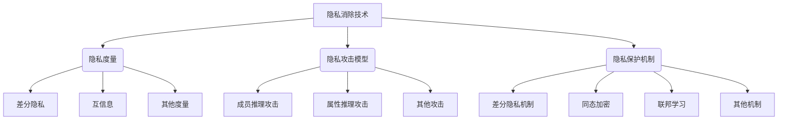

# 大规模语言模型从理论到实践：隐私消除

## 1. 背景介绍

### 1.1 问题的由来

随着人工智能技术的快速发展,大规模语言模型已经成为自然语言处理领域的核心技术之一。这些模型通过在海量文本数据上进行预训练,能够捕捉语言的丰富语义和上下文信息,从而在下游任务中表现出卓越的性能。然而,训练数据中可能包含敏感信息,如个人身份信息、医疗记录、金融数据等,这给个人隐私带来了潜在风险。如果这些隐私数据被语言模型记录并泄露,将会给个人和社会带来严重的隐私侵犯问题。

### 1.2 研究现状

为了解决这一问题,研究人员提出了多种隐私保护技术,如差分隐私、同态加密、联邦学习等。然而,这些技术在应用于大规模语言模型时仍然面临诸多挑战,例如:

1. **计算开销大**:差分隐私和同态加密技术通常需要大量的计算资源,难以应用于大规模模型的训练。
2. **隐私泄露风险**:联邦学习虽然将数据分散在不同的设备上训练,但是模型参数的传递过程仍然存在隐私泄露的风险。
3. **隐私保护能力有限**:现有技术主要关注数据隐私,但对于模型输出的隐私保护能力有限。

因此,如何在保护个人隐私的同时,充分利用大规模语言模型的强大能力,是当前研究的一大挑战。

### 1.3 研究意义

隐私消除技术的研究对于推动人工智能技术的安全和可信发展具有重要意义。通过有效地消除语言模型中的隐私信息,我们可以:

1. **保护个人隐私**:避免敏感信息的泄露,维护个人的隐私权益。
2. **促进数据共享**:消除了隐私泄露的顾虑,将有助于推动数据共享,为模型训练提供更多高质量数据。
3. **提高模型可信度**:隐私消除技术可以增强公众对人工智能系统的信任,促进其在各行业的应用。
4. **推动技术创新**:隐私消除将推动相关技术的创新和发展,为解决其他隐私和安全问题提供新的思路。

### 1.4 本文结构

本文将全面介绍大规模语言模型隐私消除技术的理论基础、核心算法、数学模型、实践应用等内容。文章主要结构如下:

1. 背景介绍
2. 核心概念与联系
3. 核心算法原理与具体操作步骤
4. 数学模型和公式详细讲解与举例说明
5. 项目实践:代码实例和详细解释说明
6. 实际应用场景
7. 工具和资源推荐
8. 总结:未来发展趋势与挑战
9. 附录:常见问题与解答

## 2. 核心概念与联系

隐私消除技术涉及多个核心概念,包括隐私度量、隐私攻击模型、隐私保护机制等,这些概念相互关联,共同构建了完整的隐私保护框架。

1. **隐私度量**:用于量化隐私泄露的程度,常见的度量包括差分隐私、互信息等。差分隐私提供了严格的隐私保证,而互信息则可以衡量模型输出与训练数据之间的相关性。
2. **隐私攻击模型**:描述攻击者的能力和目标,常见的攻击模型包括成员推理攻击(判断某个数据点是否参与了模型训练)、属性推理攻击(推断数据点的敏感属性)等。
3. **隐私保护机制**:采用不同的技术来实现隐私保护,如差分隐私机制、同态加密、联邦学习等。这些机制通过添加噪声、加密计算或分散数据等方式来防止隐私泄露。

上述概念相互关联,需要综合考虑。例如,在设计隐私保护机制时,需要根据隐私度量和攻击模型来选择合适的技术,并对其进行理论分析和实证评估。

## 3. 核心算法原理与具体操作步骤

### 3.1 算法原理概述

隐私消除算法的核心思想是在保留语言模型的有效信息的同时,消除或掩盖其中可能包含的隐私信息。常见的算法原理包括:

1. **噪声添加**:在模型输出或参数中添加噪声,以掩盖隐私信息。这是差分隐私机制的基础。
2. **数据转换**:对训练数据进行转换(如词嵌入、子词切分等),使其与原始数据的关联性降低,从而降低隐私泄露风险。
3. **知识蒸馏**:通过知识蒸馏技术,将教师模型(可能包含隐私信息)的知识迁移到学生模型,而学生模型则不包含隐私信息。
4. **对抗训练**:在模型训练过程中,引入对抗样本以提高模型的隐私保护能力,使其对隐私攻击更加鲁棒。

不同的算法原理适用于不同的场景和需求,需要根据具体情况进行选择和组合。

### 3.2 算法步骤详解

以差分隐私机制为例,其核心算法步骤如下:

1. **定义隐私预算(Privacy Budget) $\epsilon$**:隐私预算 $\epsilon$ 决定了噪声的强度,值越小代表隐私保护程度越高,但也会导致效用损失越大。
2. **选择噪声机制**:常见的噪声机制包括高斯机制、拉普拉斯机制等,它们的噪声分布不同,适用于不同的隐私保护场景。
3. **计算敏感度(Sensitivity)**:敏感度衡量了函数输出对输入的最大变化,用于确定需要添加的噪声量。
4. **添加噪声**:根据隐私预算、噪声机制和敏感度,计算噪声并将其添加到模型输出或参数中。
5. **输出隐私保护结果**:输出添加了噪声的模型输出或参数,从而实现隐私保护。

以上步骤可以应用于语言模型的不同组件,如词嵌入、注意力机制、输出层等,从而全面地实现隐私消除。

### 3.3 算法优缺点

隐私消除算法具有以下优缺点:

**优点**:

1. 提供了理论上的隐私保证,如差分隐私机制可以提供严格的隐私保护。
2. 可以应用于各种语言模型架构和任务,具有良好的通用性。
3. 通过调整算法参数,可以在隐私保护和效用之间进行权衡。

**缺点**:

1. 算法复杂度较高,需要大量计算资源,难以应用于大规模语言模型。
2. 隐私保护能力有限,无法完全消除隐私信息,仍存在一定的隐私泄露风险。
3. 可能会导致模型效用下降,如添加噪声会影响模型的准确性。

因此,在实际应用中需要权衡算法的隐私保护能力、计算开销和效用损失,选择合适的算法和参数配置。

### 3.4 算法应用领域

隐私消除算法可以应用于多个领域,包括但不限于:

1. **自然语言处理**:保护语言模型中的隐私信息,如个人身份、敏感话题等。
2. **医疗健康**:保护电子病历、基因数据等敏感医疗信息。
3. **金融服务**:保护客户的交易记录、投资组合等财务数据。
4. **社交媒体**:保护用户的个人资料、浏览记录、社交关系等隐私信息。
5. **政府机构**:保护公民的身份信息、犯罪记录等敏感数据。

无论在何种领域,隐私消除技术都可以提高人工智能系统的隐私保护能力,增强公众的信任,促进技术的应用和发展。

## 4. 数学模型和公式详细讲解与举例说明

### 4.1 数学模型构建

隐私消除技术通常基于数学模型来量化隐私泄露风险并设计相应的保护机制。常见的数学模型包括:

1. **差分隐私模型**:

   差分隐私模型通过添加噪声来保护个人隐私,其核心思想是对任何相邻数据集 $D$ 和 $D'$(只有一个数据点不同),机制 $\mathcal{M}$ 的输出分布应该非常相似,从而难以区分某个数据点是否参与了计算。形式化定义如下:

   $$
   \Pr[\mathcal{M}(D) \in \mathcal{S}] \leq e^\epsilon \Pr[\mathcal{M}(D') \in \mathcal{S}]
   $$

   其中 $\epsilon$ 为隐私预算,值越小代表隐私保护程度越高。

2. **互信息模型**:

   互信息模型通过量化模型输出与训练数据之间的相关性来衡量隐私泄露风险。具体而言,对于训练数据 $X$ 和模型输出 $Y$,我们希望它们的互信息 $I(X;Y)$ 尽可能小,从而降低隐私泄露风险。互信息的定义如下:

   $$
   I(X;Y) = \sum_{x,y} p(x,y) \log \frac{p(x,y)}{p(x)p(y)}
   $$

   其中 $p(x,y)$ 为联合概率分布,而 $p(x)$ 和 $p(y)$ 分别为边缘概率分布。

上述模型为隐私消除技术提供了理论基础,并指导了相应算法的设计和分析。

### 4.2 公式推导过程

以差分隐私机制为例,我们将推导高斯噪声机制的隐私保证。

首先,定义高斯噪声机制 $\mathcal{M}_\sigma$ 为在函数 $f$ 的输出上添加均值为 0、方差为 $\sigma^2$ 的高斯噪声:

$$
\mathcal{M}_\sigma(D) = f(D) + \mathcal{N}(0, \sigma^2)
$$

其中 $D$ 为输入数据集。

我们需要证明,对任意相邻数据集 $D$ 和 $D'$,以及任意输出子集 $\mathcal{S}$,有:

$$
\Pr[\mathcal{M}_\sigma(D) \in \mathcal{S}] \leq e^\epsilon \Pr[\mathcal{M}_\sigma(D') \in \mathcal{S}]
$$

证明过程如下:

1. 由于 $f(D)$ 和 $f(D')$ 的差异最多为函数 $f$ 的敏感度 $\Delta f$,因此:

   $$
   |f(D) - f(D')| \leq \Delta f
   $$

2. 对于任意 $y \in \mathcal{S}$,我们有:

   $$
   \begin{aligned}
   \Pr[\mathcal{M}_\sigma(D) = y] &= \frac{1}{\sqrt{2\pi\sigma^2}} \exp\left(-\frac{(y-f(D))^2}{2\sigma^2}\right) \
   \Pr[\mathcal{M}_\sigma(D') = y] &= \frac{1}{\sqrt{2\pi\sigma^2}} \exp\left(-\frac{(y-f(D'))^2}{2\sigma^2}\right)
   \end{aligned}
   $$

3. 由于 $|f(D) - f(D')| \leq \Delta f$,我们可以得到:

   $$
   \frac{\Pr[\mathcal{M}_\sigma(D) = y]}{\Pr[\mathcal{M}_\sigma(D') = y]} \leq \