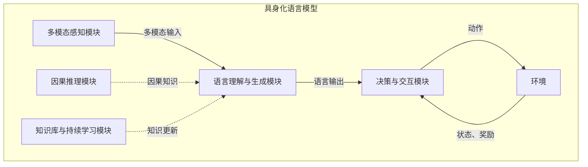

以下是《大语言模型原理基础与前沿 具身化与落地》的正文内容：

# 大语言模型原理基础与前沿 具身化与落地

## 1. 背景介绍

### 1.1 问题的由来

近年来,大型语言模型(Large Language Models, LLMs)在自然语言处理(NLP)领域取得了令人瞩目的成就。这些模型通过在大规模语料库上进行预训练,学习到了丰富的语言知识和上下文信息,从而在下游任务中展现出强大的表现力。

然而,现有的大型语言模型存在一些局限性和挑战,主要包括:

1. **缺乏体现现实世界的具身性(Embodiment)**: 大多数语言模型是基于文本数据训练的,缺乏对物理世界的感知和交互能力,难以真正理解和推理现实世界的情景。

2. **缺乏可解释性和可控性**: 大型语言模型通常是黑盒模型,其内部工作机制难以解释,输出也难以控制和调整。

3. **缺乏持续学习能力**: 现有语言模型主要依赖预训练的方式获取知识,一旦部署后就无法持续学习新的知识和技能。

4. **计算资源消耗巨大**: 训练大型语言模型需要消耗大量的计算资源,对硬件要求很高,普及应用面临一定挑战。

为了解决这些问题,研究人员提出了"具身化语言模型"(Embodied Language Models)的概念,旨在赋予语言模型对现实世界的感知、交互和推理能力,使其能够更好地理解和生成与现实相关的语言内容。同时,也有研究关注语言模型的可解释性、可控性、持续学习能力等方面的改进。

### 1.2 研究现状

具身化语言模型是一个新兴的研究方向,目前主要的研究工作包括:

1. **多模态感知**: 通过整合视觉、听觉、触觉等多种感知模态,赋予语言模型对现实世界的多模态感知能力。

2. **模型与环境交互**: 设计允许语言模型与虚拟或真实环境进行交互的框架,使模型能够根据环境反馈进行决策和更新。

3. **体现因果推理**: 赋予语言模型对事物之间因果关系的推理能力,提高其对现实情景的理解和生成能力。

4. **多任务学习**: 通过在多种任务上进行联合训练,使语言模型获得更通用、更鲁棒的能力。

5. **可解释性增强**: 设计可解释的模型架构和训练方法,提高语言模型的可解释性。

6. **持续学习**: 探索允许语言模型在部署后持续学习新知识和技能的方法。

此外,一些知名的科技公司和研究机构也在积极投入到这一领域,例如OpenAI的InstructGPT、DeepMind的Chinchilla、Google的PaLM等,都是具有一定具身化能力的大型语言模型。

### 1.3 研究意义

具身化语言模型的研究对于推动人工智能的发展具有重要意义:

1. **提高语言模型的泛化能力**: 通过感知和交互现实世界,语言模型能够获得更丰富、更真实的知识,从而提高其在各种场景下的泛化和推理能力。

2. **增强人机交互体验**: 具身化语言模型能够更好地理解和生成与现实相关的语言内容,为人机交互带来更自然、更流畅的体验。

3. **推动 AI 系统的可解释性和可控性**: 通过研究可解释的模型架构和训练方法,有助于提高 AI 系统的透明度和可控性,促进人工智能的可信赖性和安全性。

4. **拓展 AI 在实际应用中的作用**: 具身化语言模型能够更好地处理与现实世界相关的任务,为人工智能在诸如机器人、虚拟现实、智能助手等领域的应用铺平道路。

5. **推动人工智能的长期发展**: 具身化语言模型有望成为通用人工智能(Artificial General Intelligence, AGI)的重要基础,对于实现人工智能的长期目标具有重要意义。

### 1.4 本文结构

本文将全面介绍大语言模型的具身化与落地相关的理论基础和前沿研究进展。文章主要分为以下几个部分:

1. 核心概念与联系
2. 核心算法原理与具体操作步骤
3. 数学模型和公式详细讲解与案例分析
4. 项目实践:代码实例和详细解释说明
5. 实际应用场景
6. 工具和资源推荐
7. 总结:未来发展趋势与挑战
8. 附录:常见问题与解答

接下来,我们将逐一深入探讨这些主题。

## 2. 核心概念与联系

在探讨具身化语言模型之前,我们需要先了解一些核心概念及它们之间的联系。

### 2.1 语言模型(Language Model)

语言模型是自然语言处理领域的基础模型,旨在学习语言的统计规律,并对给定的文本序列计算概率。形式化地,语言模型的目标是估计一个语句 $S = \{w_1, w_2, \ldots, w_n\}$ 的概率 $P(S)$,通常将其分解为词条概率的乘积:

$$P(S) = P(w_1, w_2, \ldots, w_n) = \prod_{i=1}^n P(w_i | w_1, \ldots, w_{i-1})$$

传统的语言模型主要基于 N-gram 统计或神经网络等方法,近年来随着深度学习的发展,基于 Transformer 的大型语言模型(如 BERT、GPT 等)在各种 NLP 任务上取得了卓越的表现。

### 2.2 多模态学习(Multimodal Learning)

多模态学习是指将多种模态(如文本、图像、视频、音频等)的信息融合,以获取更丰富的表示能力。在自然语言处理领域,多模态学习通常指将语言模态与视觉模态(图像或视频)相结合,以提高模型对语义的理解能力。

典型的多模态模型包括:

- VisualBERT: 将 BERT 模型扩展到图像-文本的多模态场景。
- ViLBERT: 采用两阶段的协同注意力机制,实现视觉和语言表示的协同学习。
- UNITER: 统一了视觉-语言双向表示,并在多个视觉-语言理解和生成任务上取得了最先进的性能。

多模态学习为语言模型赋予了对视觉信息的感知能力,是实现具身化语言模型的重要一环。

### 2.3 强化学习(Reinforcement Learning)

强化学习是机器学习的一个重要分支,旨在通过与环境的交互来学习一种策略,使得在给定的环境中获得最大的累积奖励。它通常建模为一个马尔可夫决策过程(Markov Decision Process, MDP),由状态空间 $\mathcal{S}$、动作空间 $\mathcal{A}$、状态转移概率 $P(s' | s, a)$ 和奖励函数 $R(s, a)$ 组成。

在强化学习中,智能体(Agent)与环境(Environment)进行交互,在每个时间步 $t$,智能体根据当前状态 $s_t$ 选择一个动作 $a_t$,然后环境转移到新的状态 $s_{t+1}$,并返回一个奖励 $r_{t+1}$。智能体的目标是学习一个策略 $\pi(a|s)$,使得在环境中获得的累积奖励最大化:

$$J(\pi) = \mathbb{E}_\pi \left[ \sum_{t=0}^\infty \gamma^t r_t \right]$$

其中 $\gamma \in [0, 1]$ 是折扣因子,用于权衡即时奖励和长期奖励的重要性。

强化学习为语言模型与环境交互提供了理论基础和算法支持,是实现具身化语言模型的另一关键技术。

### 2.4 因果推理(Causal Reasoning)

因果推理是指推断事物之间的因果关系,即某个事件或状态是另一个事件或状态的原因或结果。在自然语言处理中,因果推理对于理解和生成与现实世界相关的语言内容至关重要。

形式化地,我们可以用结构化因果模型(Structural Causal Model, SCM)来表示因果关系,其中包括:

- 一组随机变量 $\mathbf{X} = \{X_1, X_2, \ldots, X_n\}$
- 每个变量的结构方程 $X_i = f_i(pa_i, \epsilon_i)$,其中 $pa_i$ 是 $X_i$ 的因变量集合, $\epsilon_i$ 是外生噪声
- 一个有向无环图 $\mathcal{G}$,表示变量之间的因果关系

基于 SCM,我们可以推断出做出干预后的因果效应,即 $P(X_i | do(X_j = x_j))$,这对于语言模型理解和生成与现实世界相关的语义至关重要。

### 2.5 具身化语言模型(Embodied Language Models)

具身化语言模型是指赋予语言模型对现实世界的感知、交互和推理能力,使其能够更好地理解和生成与现实相关的语言内容。具身化语言模型通常包含以下几个关键组成部分:

1. **多模态感知模块**: 感知来自视觉、听觉、触觉等多种模态的输入,获取对环境的多模态表示。

2. **语言理解与生成模块**: 基于多模态输入,理解和生成与环境相关的自然语言内容。

3. **决策与交互模块**: 根据当前状态和语言输入,通过强化学习等方法选择合理的动作,与环境进行交互。

4. **因果推理模块**: 推断事物之间的因果关系,增强对现实情景的理解和推理能力。

5. **知识库与持续学习模块**: 存储和更新模型获取的知识,实现持续学习的能力。

具身化语言模型将语言模型、多模态学习、强化学习、因果推理等多种技术有机结合,旨在构建能够感知、交互和推理现实世界的智能系统。

上图展示了具身化语言模型的基本架构和模块之间的交互关系。通过各模块的紧密协作,具身化语言模型能够感知环境,理解和生成与环境相关的语言,做出合理决策并与环境交互,同时通过因果推理和持续学习不断提升自身的能力。

## 3. 核心算法原理与具体操作步骤

在本节中,我们将介绍具身化语言模型中的一些核心算法原理及其具体操作步骤。

### 3.1 算法原理概述

#### 3.1.1 多模态融合

多模态融合旨在将来自不同模态(如文本、图像、视频等)的信息有效地整合起来,以获得更丰富的表示能力。常见的多模态融合方法包括:

- **特征级融合**: 将不同模态的特征向量拼接或做元素级运算(如加、乘等)。
- **模态间注意力**: 通过注意力机制捕获不同模态之间的相关性,对模态特征进行重新加权。
- **交互融合**: 在不同模态之间建立交互,使模态特征能够相互影响和更新。
- **跨模态编码器-解码器**: 将不同模态的输入序列编码为统一的表示,再通过解码器生成目标模态的输出。

#### 3.1.2 强化学习

强化学习是具身化语言模型与环境交互的关键算法,其核心思想是通过与环境的互动,学习一个策略,使得在给定环境中获得最大的累积奖励。常见的强化学习算法包括:

- **策略梯度方法**(Policy Gradient Methods): 直接对策略