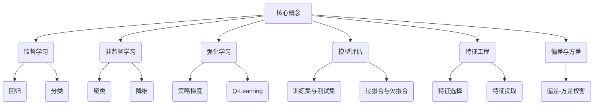

# 机器学习 原理与代码实例讲解

## 1. 背景介绍

### 1.1 问题的由来

在当今的数字时代,数据无处不在。从社交媒体到电子商务,再到物联网和人工智能系统,海量的数据不断被产生和收集。然而,如何有效地从这些原始数据中提取有价值的信息和见解,成为了一个亟待解决的挑战。这就是机器学习(Machine Learning)应运而生的原因。

机器学习是一门研究如何构建能够自主学习的算法和模型的科学,旨在使计算机能够在没有明确编程的情况下,通过学习数据中蕴含的模式自动获取知识。这种学习能力使计算机系统能够逐步优化自身的性能,并针对新的输入数据作出准确的预测或决策。

### 1.2 研究现状

机器学习作为人工智能的一个重要分支,近年来受到了广泛的关注和研究。随着算力的不断提升、数据量的爆炸式增长以及算法的不断优化,机器学习技术在诸多领域取得了令人瞩目的成就,如计算机视觉、自然语言处理、推荐系统、金融风险控制等。

目前,机器学习可以分为三大类:监督学习(Supervised Learning)、非监督学习(Unsupervised Learning)和强化学习(Reinforcement Learning)。其中,监督学习是最成熟和应用最广泛的一类,如分类、回归等任务。非监督学习则侧重于从未标记的原始数据中发现内在结构和模式。而强化学习则是通过与环境的交互,学习如何做出最优决策。

### 1.3 研究意义

机器学习技术的发展对于推动人工智能的进步具有重要意义。它使计算机系统能够自主学习,从而突破了传统编程范式的局限性,大大拓展了计算机的应用领域。同时,机器学习也为解决复杂的现实问题提供了有力工具,如疾病诊断、语音识别、无人驾驶等,为提高生活质量和社会效率做出了重要贡献。

此外,机器学习的理论和方法也为其他学科带来了新的研究视角和思路,如生物学、社会学、经济学等领域都可以借鉴机器学习的思想,从海量数据中发现隐藏的规律和知识。

### 1.4 本文结构

本文将全面介绍机器学习的核心概念、算法原理、数学模型,并结合代码实例进行详细讲解。文章主要包括以下几个部分:

1. 核心概念与联系
2. 核心算法原理与具体操作步骤
3. 数学模型和公式详细讲解与举例说明
4. 项目实践:代码实例和详细解释说明
5. 实际应用场景
6. 工具和资源推荐
7. 总结:未来发展趋势与挑战
8. 附录:常见问题与解答

## 2. 核心概念与联系

在深入探讨机器学习的算法和模型之前,有必要先了解一些核心概念,这些概念贯穿于整个机器学习的理论和实践之中。

### 2.1 监督学习

监督学习(Supervised Learning)是机器学习中最常见和最成熟的一种范式。在监督学习中,算法会基于一组已标记的训练数据(包含输入特征和期望输出)来学习一个模型,然后使用这个模型对新的未标记数据进行预测或决策。

监督学习可以分为两大类:

1. **回归(Regression)**: 当目标变量是连续值时,就属于回归问题。例如,预测房价、销量等。
2. **分类(Classification)**: 当目标变量是离散值或类别时,就属于分类问题。例如,垃圾邮件检测、图像识别等。

### 2.2 非监督学习

与监督学习不同,非监督学习(Unsupervised Learning)则是从未标记的原始数据中发现隐藏的结构和模式。它不需要任何人工标注的训练数据,而是让算法自主探索数据,发现其中的内在规律。

非监督学习的两个主要任务是:

1. **聚类(Clustering)**: 将相似的数据点划分到同一个簇或类别中,如客户细分、基因聚类等。
2. **降维(Dimensionality Reduction)**: 将高维数据映射到低维空间,以提高可解释性和降低计算复杂度,如主成分分析(PCA)、t-SNE等。

### 2.3 强化学习

强化学习(Reinforcement Learning)是一种基于环境交互的学习范式。在强化学习中,智能体(Agent)通过与环境(Environment)进行交互,根据采取的行为(Action)获得奖励或惩罚(Reward),从而不断优化自身的策略(Policy),以达到最大化长期累积奖励的目标。

强化学习常用于解决序列决策问题,如机器人控制、游戏AI、自动驾驶等。常见的强化学习算法包括:

1. **策略梯度(Policy Gradient)**: 直接优化策略函数,使期望奖励最大化。
2. **Q-Learning**: 通过估计状态-行为对的价值函数,从而学习最优策略。

### 2.4 模型评估

为了评估机器学习模型的性能,通常需要将数据集划分为训练集(Training Set)和测试集(Test Set)。模型在训练集上进行学习,而在测试集上评估其泛化能力。

常见的模型评估指标包括:

- 对于回归任务,使用均方根误差(RMSE)、平均绝对误差(MAE)等。
- 对于分类任务,使用准确率(Accuracy)、精确率(Precision)、召回率(Recall)、F1分数等。

此外,还需要注意过拟合(Overfitting)和欠拟合(Underfitting)的问题。过拟合意味着模型过于复杂,无法很好地泛化到新数据;而欠拟合则表示模型过于简单,无法捕捉数据的内在规律。

### 2.5 特征工程

特征工程(Feature Engineering)是机器学习中一个非常重要的环节。它包括特征选择(Feature Selection)和特征提取(Feature Extraction)两个方面:

1. **特征选择**: 从原始特征集中选择出对预测目标最有价值的一部分特征。
2. **特征提取**: 从原始特征集中构造出一组新的特征,以更好地表示数据的内在结构。

良好的特征工程可以极大地提高机器学习模型的性能和效率。

### 2.6 偏差与方差

偏差(Bias)和方差(Variance)是衡量机器学习模型泛化能力的两个重要指标。

- **偏差**指的是模型对训练数据的拟合程度,偏差越大,模型越简单,容易欠拟合。
- **方差**指的是模型对训练数据的敏感程度,方差越大,模型越复杂,容易过拟合。

在实践中,需要权衡偏差和方差之间的关系,以获得最优的模型性能。这就是著名的偏差-方差权衡(Bias-Variance Tradeoff)。

## 3. 核心算法原理与具体操作步骤

机器学习算法是整个领域的核心,它们赋予了计算机系统学习和推理的能力。本节将介绍几种最常用和最具代表性的机器学习算法,包括其基本原理、具体操作步骤,以及优缺点和应用领域。

### 3.1 算法原理概述

#### 3.1.1 线性回归

线性回归(Linear Regression)是最基础和最常用的监督学习算法之一。它试图通过拟合一条最佳直线(或超平面)来描述自变量和因变量之间的线性关系。

线性回归的目标是找到一组权重系数,使得预测值与实际值之间的均方误差最小化。这可以通过最小二乘法(Ordinary Least Squares)或梯度下降法(Gradient Descent)等优化算法来实现。

#### 3.1.2 逻辑回归

逻辑回归(Logistic Regression)是一种广义线性模型,常用于解决二分类问题。它通过将线性回归的输出映射到 Sigmoid 函数,将结果约束在 0 到 1 之间,从而可以解释为概率值。

逻辑回归的优化目标是最大化似然函数(Likelihood Function),通常采用梯度下降法或牛顿法等优化算法。

#### 3.1.3 决策树

决策树(Decision Tree)是一种树形结构的监督学习算法,它通过递归地划分特征空间,将数据集分割成更小的子集,直到每个子集中的实例属于同一类别或满足某个停止条件为止。

决策树的构建过程可以采用信息增益(Information Gain)或基尼系数(Gini Index)等指标作为特征选择的准则,从而生成一棵最优决策树。

#### 3.1.4 支持向量机

支持向量机(Support Vector Machine, SVM)是一种基于核技巧(Kernel Trick)的监督学习算法,它可以用于解决分类和回归问题。SVM的基本思想是在高维空间中找到一个最优超平面,将不同类别的数据点分离开来,同时最大化两类数据点到超平面的间隔。

SVM的优化目标是最小化结构风险(Structural Risk),通常采用序列最小优化(Sequential Minimal Optimization, SMO)算法来求解。

#### 3.1.5 K-均值聚类

K-均值聚类(K-Means Clustering)是一种常用的非监督学习算法,用于将数据集划分为 K 个互不相交的簇。它的目标是最小化每个数据点到其所属簇质心的平方距离之和。

K-均值聚类算法通过迭代地更新簇质心和重新分配数据点的簇标签,直到收敦为止。该算法的关键在于合理选择初始簇质心和确定最优 K 值。

#### 3.1.6 主成分分析

主成分分析(Principal Component Analysis, PCA)是一种常用的降维技术,它通过线性变换将高维数据映射到低维空间,同时尽可能保留数据的方差信息。

PCA的核心思想是找到数据的主成分(Principal Components),即数据方差最大的那些正交方向,然后将数据投影到这些主成分上,从而实现降维。

### 3.2 算法步骤详解

#### 3.2.1 线性回归

1. **数据预处理**: 对输入数据进行标准化或归一化处理,以消除量纲影响。
2. **构建模型**: 定义线性回归模型 $\hat{y} = \theta_0 + \theta_1x_1 + \theta_2x_2 + ... + \theta_nx_n$,其中 $\theta_i$ 为待求的权重系数。
3. **损失函数**: 采用均方误差(MSE)作为损失函数,即 $J(\theta) = \frac{1}{2m}\sum_{i=1}^m(\hat{y}^{(i)} - y^{(i)})^2$,目标是最小化损失函数。
4. **优化算法**: 使用最小二乘法或梯度下降法等优化算法求解最优权重系数 $\theta$。
5. **模型评估**: 在测试集上评估模型的性能,如均方根误差(RMSE)等指标。

#### 3.2.2 逻辑回归

1. **数据预处理**: 对输入数据进行标准化或归一化处理。
2. **构建模型**: 定义逻辑回归模型 $\hat{y} = \sigma(\theta^Tx) = \frac{1}{1 + e^{-\theta^Tx}}$,其中 $\sigma$ 为 Sigmoid 函数。
3. **损失函数**: 采用交叉熵(Cross Entropy)作为损失函数,即 $J(\theta) = -\frac{1}{m}\sum_{i=1}^