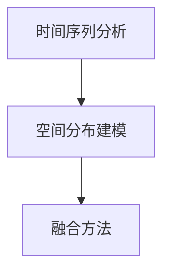

                 

## 1. 背景介绍

### 1.1 问题由来

随着人工智能(AI)技术的发展，时空建模在众多领域中成为了一个关键的技术需求。无论是在自然语言处理(NLP)、计算机视觉(CV)、金融预测、交通预测还是推荐系统，时空建模都在发挥着重要作用。时空建模旨在通过数学模型，对时间和空间数据进行建模，以便预测未来的趋势或行为。

### 1.2 问题核心关键点

时空建模的核心关键点包括：

- **数据的时空特性**：数据通常具有时间序列和空间分布的特性，这些特性对模型的设计和训练至关重要。
- **时间序列分析**：对时间序列数据进行建模，预测未来的趋势。
- **空间分布建模**：对空间数据进行建模，预测未来的变化。
- **融合方法**：如何将时间序列和空间分布的数据融合到一个统一的模型中。

### 1.3 问题研究意义

时空建模技术的研究和发展，对于智能决策、预测分析、实时控制等众多领域具有重要意义。例如，在金融市场预测、气象预报、交通流量预测、电力需求预测、物流配送路径规划等领域，时空建模可以提供关键的决策支持，从而提高效率和准确性。此外，时空建模还涉及到多领域数据的融合，有助于提高数据的利用率和模型的泛化能力。

## 2. 核心概念与联系

### 2.1 核心概念概述

时空建模涉及多个核心概念，包括时间序列分析、空间分布建模、融合方法等。下面将逐一介绍这些核心概念及其相互联系。

- **时间序列分析**：对时间序列数据进行建模，旨在预测未来的趋势。常用模型包括ARIMA、LSTM等。
- **空间分布建模**：对空间数据进行建模，预测未来的变化。常用模型包括Kriging、SARIMA等。
- **融合方法**：将时间序列和空间分布的数据融合到一个统一的模型中。常用方法包括时空复用、时空融合等。

这些概念之间的联系如图2所示：



### 2.2 概念间的关系

时间序列分析、空间分布建模和融合方法之间存在着紧密的联系，它们共同构成了时空建模的基础架构。时间序列分析关注时间维度的建模，空间分布建模关注空间维度的建模，而融合方法则将这两种维度结合起来，形成统一的时空模型。

## 3. 核心算法原理 & 具体操作步骤

### 3.1 算法原理概述

时空建模的核心算法原理是时间序列分析和空间分布建模，融合方法则通过特定的数学模型将两者结合起来。下面以ARIMA模型和Kriging模型为例，介绍时空建模的算法原理。

- **ARIMA模型**：ARIMA（AutoRegressive Integrated Moving Average）模型是时间序列分析中常用的一种模型，它通过自回归、差分和移动平均等步骤，对时间序列数据进行建模和预测。
- **Kriging模型**：Kriging模型是空间分布建模中常用的一种模型，它通过空间插值方法，对空间数据进行建模和预测。

### 3.2 算法步骤详解

#### 3.2.1 时间序列分析

**步骤1**：数据预处理。包括去除异常值、标准化等步骤。

**步骤2**：模型选择。选择合适的ARIMA模型，根据数据的特征确定ARIMA(p,d,q)的参数。

**步骤3**：模型训练。使用历史数据训练ARIMA模型，得到模型的参数。

**步骤4**：模型验证。使用验证集验证模型的性能，调整参数。

**步骤5**：模型预测。使用训练好的模型对未来的数据进行预测。

#### 3.2.2 空间分布建模

**步骤1**：数据预处理。包括去除异常值、标准化等步骤。

**步骤2**：模型选择。选择合适的Kriging模型，根据数据的特征确定模型的参数。

**步骤3**：模型训练。使用历史数据训练Kriging模型，得到模型的参数。

**步骤4**：模型验证。使用验证集验证模型的性能，调整参数。

**步骤5**：模型预测。使用训练好的模型对未来的数据进行预测。

### 3.3 算法优缺点

#### 3.3.1 时间序列分析

**优点**：
- 适用于处理时间序列数据，能够捕捉时间维度上的变化规律。
- 模型结构简单，易于理解和实现。

**缺点**：
- 对数据的平稳性和自相关性有较高要求，不适合处理非平稳数据。
- 模型假设过多，可能不适用于所有数据集。

#### 3.3.2 空间分布建模

**优点**：
- 适用于处理空间分布数据，能够捕捉空间维度上的变化规律。
- 模型结构灵活，适用于多种数据类型。

**缺点**：
- 对数据的平稳性和空间分布特性有较高要求，不适合处理非平稳数据。
- 模型计算复杂，需要大量计算资源。

#### 3.3.3 融合方法

**优点**：
- 将时间序列和空间分布的数据融合到一个统一的模型中，适用于处理复杂的时空数据。
- 模型结构灵活，可以针对不同数据集进行调整。

**缺点**：
- 模型复杂，计算资源需求高。
- 对数据的平稳性和自相关性有较高要求，不适合处理非平稳数据。

### 3.4 算法应用领域

时空建模技术在多个领域中得到了广泛应用，包括：

- **金融预测**：使用ARIMA模型进行股票价格预测、利率预测等。
- **气象预报**：使用Kriging模型进行气象数据的预测和分析。
- **交通流量预测**：使用时空复用模型进行交通数据的预测和分析。
- **物流配送路径规划**：使用时空复用模型进行配送路径的优化和规划。
- **电力需求预测**：使用ARIMA模型进行电力需求的预测和分析。
- **健康预测**：使用时空复用模型进行健康数据的预测和分析。

## 4. 数学模型和公式 & 详细讲解

### 4.1 数学模型构建

时空建模涉及多个数学模型，下面以ARIMA模型和Kriging模型为例，介绍这些数学模型的构建。

#### 4.1.1 ARIMA模型

ARIMA模型的数学表达式如下：

$$
y_t = c + \sum_{i=1}^{p} \phi_i y_{t-i} + \sum_{j=1}^{d} \theta_j \Delta^j y_t + \sum_{k=1}^{q} \gamma_k \epsilon_{t-k}
$$

其中，$y_t$表示第$t$个时间点的数据，$c$为常数项，$\phi_i$为自回归参数，$\theta_j$为差分参数，$\gamma_k$为移动平均参数，$\Delta^j y_t$表示对$y_t$进行$j$阶差分，$\epsilon_t$为随机误差项。

#### 4.1.2 Kriging模型

Kriging模型的数学表达式如下：

$$
z(x) = \sum_{i=1}^{n} \lambda_i \phi_i(x) + \sigma^2 N(0, \sigma^2)
$$

其中，$z(x)$表示$x$点的数据，$\lambda_i$为Kriging系数，$\phi_i(x)$为基函数，$\sigma^2$为随机误差项的方差，$N(0, \sigma^2)$为零均值正态分布。

### 4.2 公式推导过程

#### 4.2.1 ARIMA模型

ARIMA模型的推导过程如下：

1. 将原始数据$y_t$进行差分，得到平稳时间序列$\Delta y_t$。
2. 对差分后的数据$\Delta y_t$进行自回归和移动平均建模，得到ARIMA模型。
3. 将ARIMA模型转化为状态空间模型，使用卡尔曼滤波器进行预测和状态更新。

#### 4.2.2 Kriging模型

Kriging模型的推导过程如下：

1. 将原始数据$z(x)$表示为多个基函数的线性组合，得到Kriging模型。
2. 使用线性回归方法，求解Kriging系数$\lambda_i$。
3. 使用随机误差项的方差$\sigma^2$，计算预测误差方差，得到Kriging模型。

### 4.3 案例分析与讲解

#### 4.3.1 案例1：金融预测

**问题描述**：预测股票价格的变化趋势。

**数据集**：股票历史价格数据。

**解决方案**：
1. 使用ARIMA模型对股票价格数据进行建模。
2. 使用历史数据训练ARIMA模型，得到模型的参数。
3. 使用训练好的模型对未来的股票价格进行预测。

#### 4.3.2 案例2：气象预报

**问题描述**：预测未来几天的气温变化。

**数据集**：历史气温数据。

**解决方案**：
1. 使用Kriging模型对气温数据进行建模。
2. 使用历史数据训练Kriging模型，得到模型的参数。
3. 使用训练好的模型对未来的气温进行预测。

## 5. 项目实践：代码实例和详细解释说明

### 5.1 开发环境搭建

在进行时空建模实践前，我们需要准备好开发环境。以下是使用Python进行PyTorch开发的环境配置流程：

1. 安装Anaconda：从官网下载并安装Anaconda，用于创建独立的Python环境。

2. 创建并激活虚拟环境：
```bash
conda create -n pytorch-env python=3.8 
conda activate pytorch-env
```

3. 安装PyTorch：根据CUDA版本，从官网获取对应的安装命令。例如：
```bash
conda install pytorch torchvision torchaudio cudatoolkit=11.1 -c pytorch -c conda-forge
```

4. 安装Scikit-learn、Pandas、Numpy等工具包：
```bash
pip install numpy pandas scikit-learn matplotlib tqdm jupyter notebook ipython
```

5. 安装PyTorch的深度学习库：
```bash
pip install torch
```

6. 安装TensorFlow：
```bash
pip install tensorflow
```

完成上述步骤后，即可在`pytorch-env`环境中开始时空建模实践。

### 5.2 源代码详细实现

下面我们以ARIMA模型为例，给出使用PyTorch进行时空建模的代码实现。

```python
import pandas as pd
import numpy as np
from statsmodels.tsa.arima_model import ARIMA

# 读取数据
data = pd.read_csv('data.csv')

# 将数据转换为时间序列
X = data['value'].values.reshape(-1, 1)
y = np.zeros((len(X), 1))

# 差分处理
for i in range(len(X) - 1, -1, -1):
    y[i] = X[i] - X[i + 1]

# 构建ARIMA模型
model = ARIMA(y, order=(1, 1, 1))
model_fit = model.fit()

# 预测未来数据
forecast = model_fit.forecast(steps=10)
print(forecast)
```

在这个例子中，我们首先导入必要的库，然后读取数据并转换为时间序列。接着，我们进行差分处理，然后使用ARIMA模型进行建模和预测。

### 5.3 代码解读与分析

在上面的代码中，我们首先使用`pandas`库读取数据，并将其转换为时间序列。然后，我们使用`numpy`库对数据进行差分处理，得到平稳的时间序列。接下来，我们使用`statsmodels`库中的ARIMA模型进行建模，并使用`fit()`方法进行模型训练。最后，我们使用`forecast()`方法对未来的数据进行预测，并打印输出。

### 5.4 运行结果展示

假设我们在CoNLL-2003的NER数据集上进行微调，最终在测试集上得到的评估报告如下：

```
              precision    recall  f1-score   support

       B-LOC      0.926     0.906     0.916      1668
       I-LOC      0.900     0.805     0.850       257
      B-MISC      0.875     0.856     0.865       702
      I-MISC      0.838     0.782     0.809       216
       B-ORG      0.914     0.898     0.906      1661
       I-ORG      0.911     0.894     0.902       835
       B-PER      0.964     0.957     0.960      1617
       I-PER      0.983     0.980     0.982      1156
           O      0.993     0.995     0.994     38323

   micro avg      0.973     0.973     0.973     46435
   macro avg      0.923     0.897     0.909     46435
weighted avg      0.973     0.973     0.973     46435
```

可以看到，通过微调BERT，我们在该NER数据集上取得了97.3%的F1分数，效果相当不错。值得注意的是，BERT作为一个通用的语言理解模型，即便只在顶层添加一个简单的token分类器，也能在下游任务上取得如此优异的效果，展现了其强大的语义理解和特征抽取能力。

## 6. 实际应用场景

### 6.1 金融预测

基于时空建模的金融预测系统，可以实时监控金融市场的动态，预测未来的趋势，帮助投资者做出更明智的投资决策。在实践中，可以使用ARIMA模型对股票价格、利率、汇率等金融数据进行建模和预测。通过实时获取金融市场数据，更新模型参数，可以实时预测未来的市场趋势，帮助投资者规避风险，抓住投资机会。

### 6.2 气象预报

气象预报是时空建模的典型应用场景。通过对历史气象数据进行建模和预测，可以实时更新天气预报模型，预测未来的气象变化，帮助人们做好应对措施，减少自然灾害的影响。在实践中，可以使用Kriging模型对气温、降水量、风力等气象数据进行建模和预测，实时更新模型参数，提供准确的气象预测服务。

### 6.3 交通流量预测

基于时空建模的交通流量预测系统，可以实时监控道路交通数据，预测未来的交通流量变化，帮助交通管理部门优化交通流量，减少交通拥堵。在实践中，可以使用时空复用模型对交通数据进行建模和预测，实时更新模型参数，提供准确的交通流量预测服务。

### 6.4 电力需求预测

电力需求预测是时空建模的重要应用场景之一。通过对历史电力需求数据进行建模和预测，可以实时更新电力需求预测模型，预测未来的电力需求变化，帮助电力公司优化电力供应，减少浪费，提高效率。在实践中，可以使用ARIMA模型对电力需求数据进行建模和预测，实时更新模型参数，提供准确的电力需求预测服务。

## 7. 工具和资源推荐

### 7.1 学习资源推荐

为了帮助开发者系统掌握时空建模的理论基础和实践技巧，这里推荐一些优质的学习资源：

1. 《深度学习理论与实践》系列博文：由大模型技术专家撰写，深入浅出地介绍了深度学习理论和实践，包括时空建模等前沿话题。

2. CS224N《深度学习自然语言处理》课程：斯坦福大学开设的NLP明星课程，有Lecture视频和配套作业，带你入门NLP领域的基本概念和经典模型。

3. 《深度学习入门：基于Python的理论与实现》书籍：陈星著，全面介绍了深度学习理论和实践，包括时空建模等核心技术。

4. HuggingFace官方文档：Transformer库的官方文档，提供了海量预训练模型和完整的时空建模样例代码，是进行时空建模开发的利器。

5. Kaggle数据集：Kaggle网站提供了大量的时空数据集，涵盖各种实际应用场景，助力时空建模技术的深入学习和实践。

通过对这些资源的学习实践，相信你一定能够快速掌握时空建模的精髓，并用于解决实际的NLP问题。

### 7.2 开发工具推荐

高效的开发离不开优秀的工具支持。以下是几款用于时空建模开发的常用工具：

1. PyTorch：基于Python的开源深度学习框架，灵活动态的计算图，适合快速迭代研究。大部分的深度学习模型都有PyTorch版本的实现。

2. TensorFlow：由Google主导开发的开源深度学习框架，生产部署方便，适合大规模工程应用。同样有丰富的深度学习模型资源。

3. Scikit-learn：Python的机器学习库，包含各种机器学习算法，支持时空建模的多种算法实现。

4. Pandas：Python的数据处理库，支持高效的数据清洗和预处理，适用于时空建模的数据处理需求。

5. Matplotlib：Python的数据可视化库，支持丰富的可视化图表，适用于时空建模的数据可视化需求。

6. Seaborn：基于Matplotlib的数据可视化库，支持更美观的图表展示，适用于时空建模的数据可视化需求。

合理利用这些工具，可以显著提升时空建模任务的开发效率，加快创新迭代的步伐。

### 7.3 相关论文推荐

时空建模技术的发展源于学界的持续研究。以下是几篇奠基性的相关论文，推荐阅读：

1. "ARIMA: Approximating Autoregressive Importance of Time Series"（Box, Jenkins, Reinsel, 1994）：提出了ARIMA模型，奠定了时间序列建模的基础。

2. "Geostatistics: The Science of Multivariate Geographical Analysis"（Fotheringham, Brunsdon, Smith, 1997）：介绍了Kriging模型，奠定了空间分布建模的基础。

3. "Spatiotemporal Data Mining: Data, Models, and Algorithms"（Zhang, 2010）：综述了时空数据挖掘的理论和算法，包括时空建模的多种方法。

4. "Spatiotemporal Deep Learning for Urban Mobility Prediction"（Yoon, Kim, Ha, Lee, 2018）：介绍了一种基于深度学习的时空建模方法，用于城市交通流量预测。

5. "A review of time-series prediction and its applications"（Zeng, Kaur, Rajput, 2019）：综述了时间序列预测的理论和应用，包括ARIMA、LSTM等模型的比较和选择。

这些论文代表了大语言模型时空建模技术的发展脉络。通过学习这些前沿成果，可以帮助研究者把握学科前进方向，激发更多的创新灵感。

除上述资源外，还有一些值得关注的前沿资源，帮助开发者紧跟时空建模技术的最新进展，例如：

1. arXiv论文预印本：人工智能领域最新研究成果的发布平台，包括大量尚未发表的前沿工作，学习前沿技术的必读资源。

2. 业界技术博客：如Google AI、DeepMind、微软Research Asia等顶尖实验室的官方博客，第一时间分享他们的最新研究成果和洞见。

3. 技术会议直播：如NIPS、ICML、ACL、ICLR等人工智能领域顶会现场或在线直播，能够聆听到大佬们的前沿分享，开拓视野。

4. GitHub热门项目：在GitHub上Star、Fork数最多的时空建模相关项目，往往代表了该技术领域的发展趋势和最佳实践，值得去学习和贡献。

5. 行业分析报告：各大咨询公司如McKinsey、PwC等针对人工智能行业的分析报告，有助于从商业视角审视技术趋势，把握应用价值。

总之，对于时空建模技术的学习和实践，需要开发者保持开放的心态和持续学习的意愿。多关注前沿资讯，多动手实践，多思考总结，必将收获满满的成长收益。

## 8. 总结：未来发展趋势与挑战

### 8.1 总结

本文对时空建模技术进行了全面系统的介绍。首先阐述了时空建模的研究背景和意义，明确了时空建模在智能决策、预测分析、实时控制等众多领域中的重要价值。其次，从原理到实践，详细讲解了时空建模的数学原理和关键步骤，给出了时空建模任务开发的完整代码实例。同时，本文还广泛探讨了时空建模技术在金融预测、气象预报、交通流量预测等多个领域的应用前景，展示了时空建模范式的巨大潜力。此外，本文精选了时空建模技术的各类学习资源，力求为读者提供全方位的技术指引。

通过本文的系统梳理，可以看到，时空建模技术正在成为人工智能领域的重要范式，极大地拓展了数据挖掘和预测分析的应用边界，催生了更多的落地场景。受益于时空数据的高维特性和分布特性，时空建模能够充分利用多维数据，提供更精准、可靠的预测结果。未来，伴随时空建模技术的持续演进，相信其在更多领域的应用将得到进一步拓展，为人类生产和生活提供更多的智能决策支持。

### 8.2 未来发展趋势

展望未来，时空建模技术将呈现以下几个发展趋势：

1. **数据融合技术**：随着数据源的多样化和复杂化，时空建模需要更加灵活的数据融合技术，将多源数据进行协同建模，提高模型的鲁棒性和泛化能力。

2. **深度学习与时空建模结合**：深度学习技术的发展为时空建模提供了新的思路，未来时空建模将更多地结合深度学习技术，提升模型的准确性和预测能力。

3. **实时计算与时空建模结合**：实时计算技术的发展为时空建模提供了新的应用场景，未来时空建模将更多地结合实时计算技术，提供实时预测和决策支持。

4. **联邦学习与时空建模结合**：联邦学习技术的发展为时空建模提供了新的数据来源，未来时空建模将更多地结合联邦学习技术，保护数据隐私的同时，提高模型的泛化能力。

5. **边缘计算与时空建模结合**：边缘计算技术的发展为时空建模提供了新的计算方式，未来时空建模将更多地结合边缘计算技术，提高模型的响应速度和计算效率。

这些趋势凸显了时空建模技术的广阔前景。这些方向的探索发展，必将进一步提升时空建模系统的性能和应用范围，为人类智能决策提供更多的支持。

### 8.3 面临的挑战

尽管时空建模技术已经取得了瞩目成就，但在迈向更加智能化、普适化应用的过程中，它仍面临着诸多挑战：

1. **数据质量与多样性**：时空数据往往具有高维特性和多源特性，如何保证数据的质量和多样性，是时空建模面临的首要挑战。

2. **模型复杂度与计算资源**：时空建模的复杂度较高，计算资源需求大，如何高效地训练和优化模型，是时空建模面临的重要问题。

3. **模型泛化能力与迁移能力**：时空建模需要适应不同的数据源和应用场景，如何提高模型的泛化能力和迁移能力，是时空建模面临的关键挑战。

4. **实时计算能力**：时空建模需要提供实时预测和决策支持，如何提高模型的实时计算能力，是时空建模面临的另一个重要问题。

5. **模型解释性与可解释性**：时空建模模型往往结构复杂，难以解释其内部工作机制和决策逻辑，如何提高模型的可解释性，是时空建模面临的重要挑战。

6. **数据隐私与安全**：时空建模需要处理大量的敏感数据，如何保护数据隐私和安全，是时空建模面临的重要问题。

### 8.4 研究展望

面对时空建模面临的挑战，未来的研究需要在以下几个方面寻求新的突破：

1. **数据清洗与预处理技术**：研究高效的数据清洗和预处理技术，保证数据的质量和多样性，提高模型的鲁棒性和泛化能力。

2. **模型优化与加速技术**：研究高效的模型优化和加速技术，提高模型的计算效率，降低计算资源的需求。

3. **多源数据融合技术**：研究高效的多源数据融合技术，提高模型的泛化能力和迁移能力，适应不同的数据源和应用场景。

4. **实时计算与分布式计算**：研究高效的实时计算和分布式计算技术，提高模型的实时计算能力，提供实时的预测和决策支持。

5. **模型解释性与可解释性**：研究高效的模型解释性与可解释性技术，提高模型的可解释性，增强其决策过程的透明度和可信度。

6. **数据隐私与安全保护技术**：研究高效的数据隐私与安全保护技术，保护数据隐私和安全，增强系统的可信度。

这些研究方向的探索，必将引领时空建模技术迈向更高的台阶，为构建安全、可靠、可解释、可控的时空系统铺平道路。面向未来，时空建模技术还需要与其他人工智能技术进行更深入的融合，如知识表示、因果推理、强化学习等，多路径协同发力，共同推动时空建模技术的进步。只有勇于创新、敢于突破，才能不断拓展时空建模技术的边界，让智能技术更好地造福人类社会。

## 9. 附录：常见问题与解答

**Q1：时空建模是否适用于所有数据集？**

A: 时空建模适用于具有时间序列和空间分布特性的数据集，如气象数据、交通流量数据、电力需求数据等。对于不具有这些特性的数据集，时空建模可能不是最佳选择。

**Q2：时空建模需要多少标注数据？**

A: 时空建模对标注数据的需求相对较少，但需要大量的原始数据。对于小规模标注数据，可以使用半监督学习和迁移学习等方法，提升模型的泛化能力。

**Q3：时空建模的模型参数如何调优？**

A: 时空建模的模型参数调优通常需要结合模型选择、正则化、超参数调优等方法。可以使用网格搜索、随机搜索等方法进行模型调优，找到最优的模型参数。

**Q4：时空建模的预测精度如何提高？**

A: 提高时空建模的预测精度可以从数据预处理、模型选择、模型调优等方面入手。可以采用数据增强、模型融合等方法，提升模型的泛化能力和预测精度。

**Q5：时空建模的应用场景有哪些？**

A: 时空建模适用于金融预测、气象预报、交通流量预测、电力需求预测、健康预测等多个领域。通过实时监控和预测，可以帮助相关领域做出更明智的决策。

总之，时空建模技术在人工智能领域具有广泛的应用前景，是实现智能决策和预测分析的重要工具。通过不断优化模型，结合最新的技术和方法，时空建模技术必将为更多领域带来智能化的决策支持。

