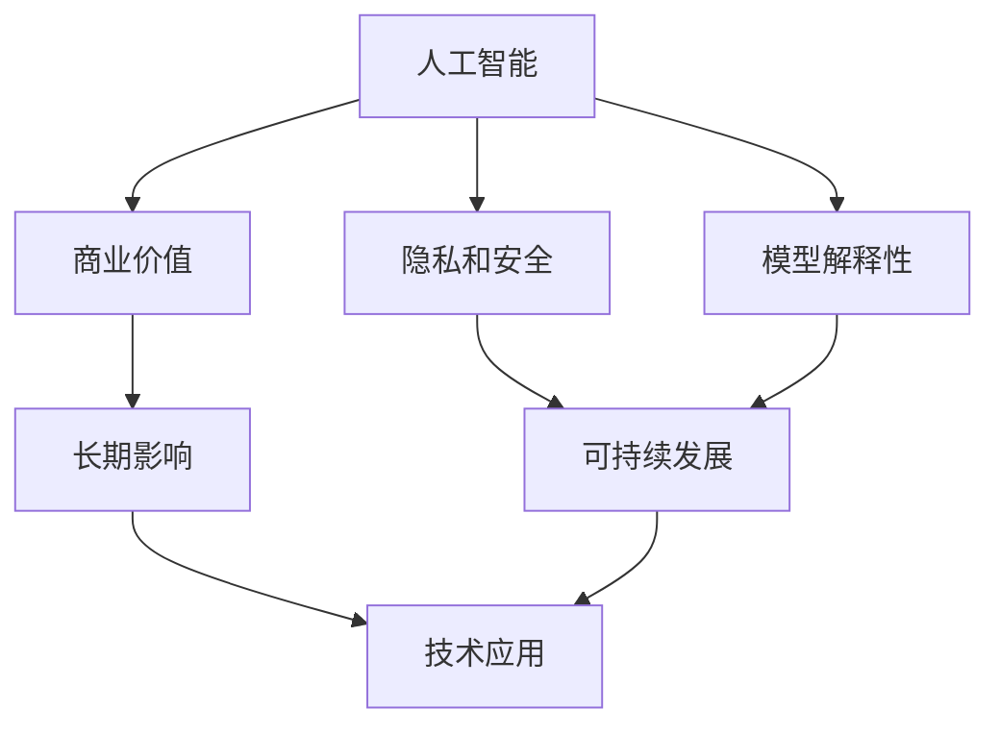

                 

# AI行业未来：回到商业价值，让AI创造长期影响

> 关键词：人工智能,商业价值,长期影响,未来趋势,技术应用,可持续发展

## 1. 背景介绍

### 1.1 问题由来

近年来，人工智能（AI）技术的迅猛发展已经深刻改变了各行各业的运作模式，从医疗、金融、制造业到娱乐和教育等领域，AI技术的应用日益广泛，产生了显著的经济和社会效益。然而，随着技术的不断进步，AI技术的商业价值开始面临新的挑战和机遇。如何在保持技术进步的同时，充分发挥AI技术的商业潜力，实现可持续发展，成为了亟需解决的问题。

### 1.2 问题核心关键点

AI技术的商业价值体现在其能否有效地解决实际问题，提高企业运营效率，创造新的商业模式，以及实现社会效益。当前，AI技术的商业应用主要集中在以下几个方面：

1. **自动化与效率提升**：AI在自动化生产、智能客服、财务分析等方面的应用，显著提高了企业的运营效率。
2. **数据分析与洞察**：通过AI技术对海量数据进行分析和挖掘，帮助企业获得新的洞察，优化决策。
3. **个性化与定制化服务**：AI技术能够根据用户行为和偏好提供个性化服务，提升用户体验。
4. **创新与新业务模式**：AI技术催生了新的业务模式，如智能推荐系统、AI医疗诊断等。

然而，AI技术在实际应用中也面临着一些挑战，如数据隐私和安全、模型解释性、技术适应性等。如何克服这些挑战，充分发挥AI技术的商业价值，实现长期影响，是当前AI行业的重要课题。

### 1.3 问题研究意义

研究AI技术的商业价值和长期影响，对于推动AI技术在各行各业的广泛应用，促进经济发展和社会进步，具有重要意义：

1. **促进产业升级**：AI技术能够帮助传统行业实现数字化、智能化转型，提高生产力和效率，增强竞争力。
2. **创造新商业模式**：AI技术的广泛应用催生了新的商业模式和市场机会，为经济增长提供新动能。
3. **改善社会效益**：AI技术在医疗、教育、环境保护等方面的应用，能够改善社会福祉，解决实际问题。
4. **驱动科技创新**：AI技术的商业应用推动了相关技术和方法的创新，促进了科技创新体系的完善。
5. **实现可持续发展**：AI技术的应用能够优化资源配置，降低环境影响，推动可持续发展。

## 2. 核心概念与联系

### 2.1 核心概念概述

为更好地理解AI技术的商业价值和长期影响，本节将介绍几个密切相关的核心概念：

- **人工智能（AI）**：通过算法、数据和计算资源，使计算机能够执行通常需要人类智能的任务。
- **商业价值（Business Value）**：指通过AI技术的应用，企业能够获得的经济和社会效益。
- **长期影响（Long-term Impact）**：指AI技术在商业应用中，对社会、环境、伦理等方面的深远影响。
- **技术应用（Technology Application）**：指AI技术在不同行业中的具体应用场景和解决方案。
- **可持续发展（Sustainable Development）**：指AI技术应用过程中，对社会、环境和经济可持续性的考虑。
- **隐私和安全（Privacy and Security）**：指在AI应用中，如何保护用户数据隐私和系统安全。
- **模型解释性（Model Interpretability）**：指AI模型输出结果的可解释性和可理解性。

这些核心概念之间存在紧密的联系，形成了AI技术的商业应用和长期影响的完整生态系统。

### 2.2 概念间的关系

这些核心概念之间存在以下联系：

1. **AI技术的基础**：AI技术的发展是实现商业价值和长期影响的基础。
2. **商业价值的实现**：通过AI技术的应用，企业能够提高效率、优化决策、创造新业务模式等，从而实现商业价值。
3. **长期影响的存在**：AI技术的商业应用对社会、环境和伦理等方面产生深远影响，需要考虑其长期影响。
4. **技术应用的广泛性**：AI技术在不同行业中的应用，有助于充分发挥其商业价值和长期影响。
5. **可持续发展的需求**：AI技术的应用需要考虑可持续发展，平衡经济效益与社会责任。
6. **隐私和安全的保障**：在AI应用中，保护用户数据隐私和系统安全是实现商业价值和长期影响的前提。
7. **模型解释性的重要性**：AI模型的可解释性有助于提高模型的可信度和应用效果，实现商业价值和长期影响。

这些概念共同构成了AI技术的商业应用和长期影响的完整框架，为理解和实现AI技术的全面价值提供了理论基础。

### 2.3 核心概念的整体架构

以下是一个综合的流程图，展示了这些核心概念在大规模AI应用中的整体架构：



这个综合流程图展示了从AI技术到商业价值，再到长期影响的整体架构，以及隐私安全、模型解释性、可持续发展等关键因素对AI商业应用和长期影响的促进和保障作用。通过这个流程图，我们可以更清晰地理解AI技术的商业应用和长期影响，以及实现这些价值的路径。

## 3. 核心算法原理 & 具体操作步骤
### 3.1 算法原理概述

AI技术的商业应用和长期影响的实现，依赖于一系列复杂的算法和模型。这些算法和模型通过数据驱动，能够在不同行业和场景中提供有效的解决方案，同时考虑到模型的解释性和可解释性。

### 3.2 算法步骤详解

AI技术的商业应用和长期影响实现的一般步骤包括：

1. **数据收集与预处理**：收集相关数据，并进行清洗、标注等预处理，以确保数据的质量和可用性。
2. **模型训练与优化**：选择适当的AI算法和模型，在预处理后的数据上训练和优化模型，确保模型的性能和准确性。
3. **模型评估与验证**：使用验证集对模型进行评估，确保模型在不同场景和数据集上的泛化能力。
4. **部署与应用**：将训练好的模型部署到实际应用中，并在不同的行业和场景中进行测试和优化。
5. **监控与维护**：对部署的模型进行实时监控和维护，确保模型的稳定性和性能。

### 3.3 算法优缺点

AI技术的商业应用和长期影响实现具有以下优点：

1. **高效与精准**：AI技术能够高效地处理大规模数据，提供精准的分析和预测。
2. **自适应与优化**：AI模型能够自适应不同的场景和数据，通过优化算法不断提高性能。
3. **个性化与定制化**：AI技术能够根据用户需求提供个性化的服务，满足不同的应用场景。
4. **自动化与低成本**：AI技术能够自动执行重复性任务，减少人力成本。

同时，AI技术也存在一些缺点：

1. **数据隐私和安全**：AI模型需要大量的数据进行训练，存在数据隐私和安全问题。
2. **模型解释性**：AI模型通常被视为“黑盒”，缺乏解释性和透明度。
3. **技术适应性**：AI技术的应用需要专业的知识和技能，对技术适应性要求较高。
4. **长期影响的不确定性**：AI技术的应用可能带来长期影响，但这些影响往往是不可预见的。

### 3.4 算法应用领域

AI技术的商业应用和长期影响实现已经广泛应用于以下几个领域：

1. **金融行业**：AI技术在风险评估、反欺诈、个性化推荐等方面发挥了重要作用。
2. **医疗健康**：AI技术在疾病诊断、健康管理、医疗影像分析等方面具有显著优势。
3. **零售电商**：AI技术在推荐系统、客户服务、库存管理等方面提高了零售电商的效率和用户体验。
4. **制造业**：AI技术在生产自动化、质量控制、供应链管理等方面提高了制造业的效率和精度。
5. **智能城市**：AI技术在交通管理、环境监测、智能安防等方面提升了城市管理水平。

## 4. 数学模型和公式 & 详细讲解 & 举例说明

### 4.1 数学模型构建

在AI技术的商业应用和长期影响实现中，数学模型和公式起着至关重要的作用。以下是一个典型的数学模型构建流程：

假设我们有一个二分类问题，输入数据为 $x$，输出标签为 $y$，模型参数为 $\theta$，则一个简单的线性模型可以表示为：

$$
y = \theta^T x
$$

其中 $\theta$ 为模型参数，$x$ 为输入特征，$y$ 为输出标签。我们的目标是通过优化损失函数 $\mathcal{L}$，使得模型的预测结果尽可能接近真实标签。

### 4.2 公式推导过程

以逻辑回归模型为例，其损失函数通常采用交叉熵损失函数：

$$
\mathcal{L}(\theta) = -\frac{1}{N}\sum_{i=1}^N [y_i\log p_i + (1-y_i)\log(1-p_i)]
$$

其中 $p_i$ 为模型对样本 $x_i$ 属于正类的概率估计，$y_i$ 为样本的真实标签。目标是最小化损失函数 $\mathcal{L}(\theta)$，从而优化模型参数 $\theta$。

### 4.3 案例分析与讲解

以金融行业中的信用评分为例，我们可以使用逻辑回归模型来进行风险评估。具体步骤如下：

1. **数据准备**：收集历史贷款数据，包括借款人的基本信息、贷款记录、还款情况等。
2. **模型训练**：使用逻辑回归模型对历史数据进行训练，得到模型参数 $\theta$。
3. **模型评估**：使用验证集对模型进行评估，计算准确率、召回率等指标。
4. **模型应用**：将训练好的模型应用到新贷款申请的信用评分中，预测其信用风险。

## 5. 项目实践：代码实例和详细解释说明

### 5.1 开发环境搭建

在进行AI技术商业应用和长期影响实现的项目实践时，我们需要准备以下开发环境：

1. **Python环境**：Python是一种流行的编程语言，拥有丰富的科学计算和机器学习库。
2. **深度学习框架**：TensorFlow、PyTorch等深度学习框架提供了高效的计算能力和丰富的API，适用于各种AI项目。
3. **数据预处理工具**：Pandas、Scikit-learn等工具提供了数据清洗、特征提取等功能。
4. **模型评估工具**：Scikit-learn、TensorBoard等工具提供了模型评估和可视化功能。
5. **部署工具**：Docker、Kubernetes等工具支持模型的快速部署和扩展。

### 5.2 源代码详细实现

以下是一个使用PyTorch框架实现信用评分逻辑回归模型的代码示例：

```python
import torch
import torch.nn as nn
from torch.utils.data import DataLoader
from sklearn.model_selection import train_test_split

# 定义逻辑回归模型
class LogisticRegression(nn.Module):
    def __init__(self, input_dim):
        super(LogisticRegression, self).__init__()
        self.linear = nn.Linear(input_dim, 1)

    def forward(self, x):
        return self.linear(x)

# 准备数据集
X, y = load_data()
X_train, X_test, y_train, y_test = train_test_split(X, y, test_size=0.2)

# 构建模型和损失函数
model = LogisticRegression(input_dim=X.shape[1])
criterion = nn.BCELoss()

# 定义优化器和超参数
optimizer = torch.optim.SGD(model.parameters(), lr=0.01, momentum=0.9)
num_epochs = 100

# 训练模型
for epoch in range(num_epochs):
    model.train()
    optimizer.zero_grad()
    outputs = model(X_train)
    loss = criterion(outputs, y_train)
    loss.backward()
    optimizer.step()

    model.eval()
    with torch.no_grad():
        outputs = model(X_test)
        predictions = torch.sigmoid(outputs)
        accuracy = (predictions.round() == y_test).float().mean()
    print(f"Epoch {epoch+1}, Loss: {loss.item():.4f}, Accuracy: {accuracy:.4f}")

# 使用模型进行预测
new_data = load_new_data()
predictions = model(new_data)
```

### 5.3 代码解读与分析

在上述代码中，我们使用了PyTorch框架实现了一个简单的逻辑回归模型，对信用评分数据进行训练和预测。关键步骤如下：

1. **数据准备**：使用 `load_data()` 函数加载数据集，并进行划分。
2. **模型构建**：定义一个逻辑回归模型，并使用 `nn.BCELoss()` 损失函数进行训练。
3. **优化器和超参数**：定义优化器和学习率等超参数。
4. **训练模型**：在训练数据上迭代训练模型，并计算损失和准确率。
5. **模型预测**：在新数据上进行预测，输出信用评分。

## 6. 实际应用场景

### 6.1 智能金融

AI技术在金融行业中的应用非常广泛，尤其是在风险管理、客户服务、投资决策等方面。通过AI技术，金融机构能够更好地理解客户需求，提高服务效率，降低风险，优化决策。

例如，银行可以使用AI技术进行信用评分、欺诈检测、客户行为分析等。通过分析历史数据和客户行为，AI模型能够预测客户的信用风险，提供个性化的金融服务，提升客户满意度。

### 6.2 智能医疗

AI技术在医疗健康领域的应用，包括疾病诊断、治疗方案推荐、医疗影像分析等。通过AI技术，医疗机构能够提高诊断准确率，优化治疗方案，提高医疗服务质量。

例如，AI技术在病理图像分析中，能够快速识别肿瘤细胞，提供精准的诊断结果。在个性化治疗方案推荐中，AI模型能够根据患者的基因信息、病史等数据，推荐最适合的治疗方案，提高治疗效果。

### 6.3 智能制造

AI技术在制造业中的应用，包括智能制造、质量控制、供应链管理等。通过AI技术，制造商能够提高生产效率，降低成本，提升产品质量。

例如，AI技术在智能制造中，能够优化生产流程，减少生产时间和成本。在质量控制中，AI模型能够实时监控生产过程，检测异常情况，提高产品质量。

## 7. 工具和资源推荐

### 7.1 学习资源推荐

为了帮助开发者系统掌握AI技术的商业应用和长期影响的理论基础和实践技巧，这里推荐一些优质的学习资源：

1. **《人工智能基础》课程**：斯坦福大学开设的入门级AI课程，涵盖AI的基础概念和核心技术。
2. **《深度学习》书籍**：由Goodfellow等人编写的深度学习经典教材，介绍了深度学习的基本原理和算法。
3. **Kaggle竞赛**：Kaggle平台提供了大量AI竞赛项目，通过实际应用案例，学习AI技术的商业应用和长期影响。
4. **开源项目和论文**：Github、arXiv等平台上有大量开源项目和研究论文，可供学习和参考。
5. **在线课程和讲座**：Coursera、edX等平台提供了丰富的AI课程和讲座，涵盖从入门到高级的各个层次。

### 7.2 开发工具推荐

高效的开发离不开优秀的工具支持。以下是几款用于AI技术商业应用和长期影响实现开发的常用工具：

1. **Python环境**：Python是一种流行的编程语言，拥有丰富的科学计算和机器学习库。
2. **深度学习框架**：TensorFlow、PyTorch等深度学习框架提供了高效的计算能力和丰富的API，适用于各种AI项目。
3. **数据预处理工具**：Pandas、Scikit-learn等工具提供了数据清洗、特征提取等功能。
4. **模型评估工具**：Scikit-learn、TensorBoard等工具提供了模型评估和可视化功能。
5. **部署工具**：Docker、Kubernetes等工具支持模型的快速部署和扩展。
6. **云服务平台**：AWS、Google Cloud等云服务平台提供了丰富的AI服务，支持模型的训练、部署和监控。

### 7.3 相关论文推荐

AI技术的商业应用和长期影响实现的研究源于学界的持续研究。以下是几篇奠基性的相关论文，推荐阅读：

1. **《深度学习与人类》**：Yann LeCun等人发表的论文，讨论了深度学习与人类认知的联系，提出了AI技术的未来发展方向。
2. **《从零到一：构建智能系统》**：Richard Sutton等人编写的书籍，介绍了AI技术在智能系统构建中的应用。
3. **《人工智能伦理》**：Ian King等人编写的书籍，讨论了AI技术在伦理、法律和社会影响方面的问题。
4. **《人工智能治理》**：Michael Chertok等人编写的书籍，讨论了AI技术在治理和政策方面的问题。

这些论文代表了大AI技术商业应用和长期影响实现的发展脉络。通过学习这些前沿成果，可以帮助研究者把握学科前进方向，激发更多的创新灵感。

除上述资源外，还有一些值得关注的前沿资源，帮助开发者紧跟AI技术商业应用和长期影响实现的最新进展，例如：

1. **arXiv论文预印本**：人工智能领域最新研究成果的发布平台，包括大量尚未发表的前沿工作，学习前沿技术的必读资源。
2. **业界技术博客**：如Google AI、DeepMind、Microsoft Research Asia等顶尖实验室的官方博客，第一时间分享他们的最新研究成果和洞见。
3. **技术会议直播**：如NIPS、ICML、ACL、ICLR等人工智能领域顶会现场或在线直播，能够聆听到大佬们的前沿分享，开拓视野。
4. **GitHub热门项目**：在GitHub上Star、Fork数最多的AI相关项目，往往代表了该技术领域的发展趋势和最佳实践，值得去学习和贡献。
5. **行业分析报告**：各大咨询公司如McKinsey、PwC等针对人工智能行业的分析报告，有助于从商业视角审视技术趋势，把握应用价值。

总之，对于AI技术商业应用和长期影响实现的学习和实践，需要开发者保持开放的心态和持续学习的意愿。多关注前沿资讯，多动手实践，多思考总结，必将收获满满的成长收益。

## 8. 总结：未来发展趋势与挑战

### 8.1 总结

本文对AI技术的商业应用和长期影响实现进行了全面系统的介绍。首先阐述了AI技术的商业价值和长期影响的研究背景和意义，明确了AI技术在各行各业中发挥的作用。其次，从原理到实践，详细讲解了AI技术在商业应用中的数学模型和算法步骤，给出了项目实践的完整代码示例。同时，本文还广泛探讨了AI技术在智能金融、智能医疗、智能制造等多个行业领域的应用前景，展示了AI技术的巨大潜力。此外，本文精选了AI技术商业应用和长期影响的各类学习资源，力求为读者提供全方位的技术指引。

通过本文的系统梳理，可以看到，AI技术的商业应用和长期影响实现已经在各行各业中得到了广泛应用，极大地提升了企业的运营效率和社会效益。未来，伴随AI技术的持续演进，其在商业应用和长期影响实现方面的发展前景广阔，必将为社会的可持续发展注入新的动力。

### 8.2 未来发展趋势

展望未来，AI技术的商业应用和长期影响实现将呈现以下几个发展趋势：

1. **自动化与智能化**：AI技术将更加自动化、智能化，能够更好地理解和处理复杂任务，提供更高质量的服务。
2. **跨领域应用**：AI技术将跨越更多领域，实现跨领域的深度融合，提升行业竞争力。
3. **个性化与定制化**：AI技术将更加个性化和定制化，能够根据用户需求提供更精准的服务。
4. **可持续发展**：AI技术的应用将更加注重环境保护和社会责任，推动可持续发展。
5. **人机协同**：AI技术将更加注重人机协同，提升系统的智能水平和用户体验。
6. **伦理与社会**：AI技术的应用将更加注重伦理和社会影响，确保技术的公平性和透明度。

以上趋势凸显了AI技术商业应用和长期影响的广阔前景。这些方向的探索发展，必将进一步提升AI技术的商业应用效果，实现更加广泛的社会效益。

### 8.3 面临的挑战

尽管AI技术的商业应用和长期影响实现已经取得了瞩目成就，但在迈向更加智能化、普适化应用的过程中，它仍面临着诸多挑战：

1. **数据隐私和安全**：AI技术需要大量的数据进行训练，存在数据隐私和安全问题。
2. **模型解释性**：AI模型通常被视为“黑盒”，缺乏解释性和透明度。
3. **技术适应性**：AI技术的应用需要专业的知识和技能，对技术适应性要求较高。
4. **长期影响的不确定性**：AI技术的应用可能带来长期影响，但这些影响往往是不可预见的。
5. **资源消耗**：AI技术的应用需要大量的计算资源和数据，可能面临资源瓶颈。

这些挑战需要在技术、伦理、法律等方面进行全面考虑，才能充分发挥AI技术的商业应用和长期影响。

### 8.4 研究展望

面对AI技术商业应用和长期影响实现所面临的挑战，未来的研究需要在以下几个方面寻求新的突破：

1. **隐私保护技术**：发展隐私保护技术，如差分隐私、联邦学习等，确保数据隐私和安全。
2. **模型解释性**：开发更可解释的AI模型，增强模型的透明度和可信度。
3. **跨领域融合**：促进AI技术与其他技术（如区块链、物联网）的融合，实现更广泛的应用。
4. **可持续发展**：推动AI技术在环境保护和社会治理中的应用，实现可持续发展。
5. **人机协同**：研究人机协同算法，提升系统的智能水平和用户体验。
6. **伦理与社会**：探讨AI技术的伦理和社会影响，制定相应的法规和标准。

这些研究方向将引领AI技术商业应用和长期影响实现迈向更高的台阶，为构建安全、可靠、可解释、可控的智能系统铺平道路。面向未来，AI技术需要与其他人工智能技术进行更深入的融合，共同推动自然语言理解和智能交互系统的进步。只有勇于创新、敢于突破，才能不断拓展AI技术的边界，让AI技术更好地造福人类社会。

## 9. 附录：常见问题与解答

**Q1: AI技术在商业应用中面临哪些挑战？**

A: AI技术在商业应用中面临以下挑战：

1. **数据隐私和安全**：AI技术需要大量的数据进行训练，存在数据隐私和安全问题。
2. **模型解释性**：AI模型通常被视为“黑盒”，缺乏解释性和透明度。
3. **技术适应性**：AI技术的应用需要专业的知识和技能，对技术适应性要求较高。
4. **长期影响的不确定性**：AI技术的应用可能带来长期影响，但这些影响往往是不可预见的。
5. **资源消耗**：AI技术的应用需要大量的计算资源和数据，可能面临资源瓶颈。

**Q2: 如何克服AI技术在商业应用中的挑战？**

A: 为了克服AI技术在商业应用中的挑战，可以采取以下措施：

1. **隐私保护技术**：发展隐私保护技术，如差分隐私、联邦学习等，确保数据隐私和安全。
2. **模型解释性**：开发更可解释的AI模型，增强模型的透明度和可信度。
3. **跨领域融合**：促进AI技术与其他技术（如区块链、物联网）的融合，实现更广泛的应用。
4. **可持续发展**：推动AI技术在环境保护和社会治理中的应用，实现可持续发展。
5. **人机协同**：研究人机协同算法，提升系统的智能水平和用户体验。
6. **伦理与社会**：探讨AI技术的伦理和社会影响，制定相应的法规和标准。

**Q3: AI技术在商业应用中有哪些优势？**

A: AI技术在商业应用中具有以下优势：

1. **高效与精准**：AI技术能够高效地处理大规模数据，提供精准的分析和预测。
2. **自适应与优化**：AI模型能够自适应不同的场景和数据，通过优化算法不断提高性能。
3. **个性化与定制化**：AI技术能够根据用户需求提供个性化的服务，满足不同的应用场景。
4. **自动化与低成本**：AI技术能够自动执行重复性任务，减少人力成本。

总之，AI技术在商业应用中具有广泛的应用前景和显著的效益，能够帮助企业提高效率、优化决策、创造新业务模式，从而实现长期的商业价值。

